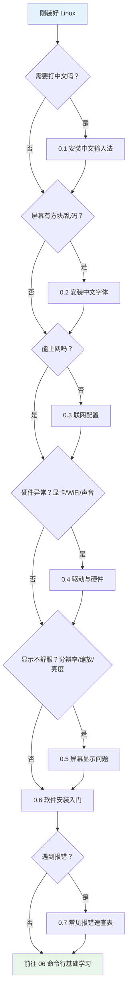
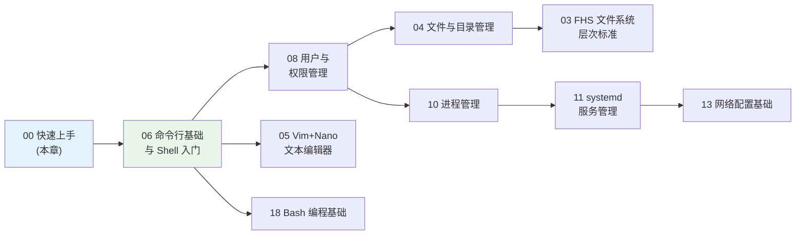

# 00 - Linux 快速上手

> 你刚装完 Linux，面对桌面（或黑乎乎的终端）一脸茫然：中文输入法在哪？WiFi 怎么连？屏幕分辨率怎么不对？字体怎么全是方块？本章不是教程主线，而是一本**急救手册**——按"遇到什么解决什么"组织，你哪里疼就翻哪一节，解决完就可以去干正事了。

---

## 阅读前提

- 已按照 [[02-多发行版安装指南|多发行版安装指南]] 完成系统安装并能正常开机进入桌面
- 知道怎么打开一个终端窗口（大多数桌面环境按 `Ctrl + Alt + T`）
- 本章所有命令默认假设你使用主流发行版：Debian/Ubuntu 系、Fedora/RHEL 系、Arch 系之一

## 决策图：我刚装好 Linux，现在要做什么



> 提示：0.1 到 0.6 大多数现代发行版在安装时已自动搞定大半。如果一切正常，只浏览标题、直接进入 [[06-命令行基础与Shell入门]] 即可。

---

## 0.1 安装中文输入法

### 0.1.1 框架选型：fcitx5 vs ibus

Linux 上的输入法不是"一个个装的输入法"，而是"输入法框架 + 框架里的引擎"。先选框架，再装拼音引擎。

| 对比项 | fcitx5 | ibus |
|--------|--------|------|
| 维护活跃度 | 非常活跃，社区主流推荐 | GNOME 官方集成，维护稳定但迭代慢 |
| 中文引擎质量 | fcitx5-chinese-addons（拼音质量高） | libpinyin（可用） |
| KDE 桌面 | 原生契合（KDE 默认推荐） | 可用但体验一般 |
| GNOME 桌面 | 需要手动配置环境变量 | 开箱即用，设置里点几下就行 |
| 扩展性 | 皮肤、云拼音、剪贴板等模块丰富 | 相对有限 |
| 推荐场景 | KDE / 追求体验 / 需要高级功能 | GNOME / 不想折腾 |

简单结论：

- **GNOME 用户**：直接用自带的 ibus 加拼音即可（见 0.1.4），零成本。
- **KDE 用户或其他桌面 / 想要更好体验**：装 fcitx5。

### 0.1.2 安装 fcitx5（三系发行版命令）

Debian / Ubuntu 系：

```bash
sudo apt install fcitx5 fcitx5-chinese-addons \
    fcitx5-frontend-gtk4 fcitx5-frontend-qt5
```

Fedora / RHEL 系：

```bash
sudo dnf install fcitx5 fcitx5-chinese-addons fcitx5-gtk2 fcitx5-qt5
```

Arch 系（注意 `fcitx5-im` 是一个包组 group，安装时会让你勾选成员）：

```bash
sudo pacman -S fcitx5-im fcitx5-chinese-addons
```

各发行版包管理器的差异与更多用法见：[[distro/debian/01-apt包管理|apt 包管理]]、[[distro/redhat/01-dnf-yum包管理|dnf 包管理]]、[[distro/arch/01-安装指南|Arch 安装指南]]。

### 0.1.3 环境变量三件套

fcitx5 需要让应用程序"知道"该把按键事件发给输入法框架，这靠三个环境变量完成：

```bash
GTK_IM_MODULE=fcitx
QT_IM_MODULE=fcitx
XMODIFIERS=@im=fcitx
```

写入位置二选一（方案 A 全局生效需 root；方案 B 仅当前用户，X11 会话登录时读取）：

```bash
# 方案 A：/etc/environment
sudo tee -a /etc/environment <<'EOF'
GTK_IM_MODULE=fcitx
QT_IM_MODULE=fcitx
XMODIFIERS=@im=fcitx
EOF

# 方案 B：~/.xprofile
cat >> ~/.xprofile <<'EOF'
export GTK_IM_MODULE=fcitx
export QT_IM_MODULE=fcitx
export XMODIFIERS=@im=fcitx
EOF
```

这些变量的加载时机与作用机制，在 [[07-PATH深入与环境变量全书|PATH 深入与环境变量全书]] 中有完整讲解。修改后**注销重新登录**才生效。

### 0.1.4 Wayland 与 X11 的配置差异

同样的三件套，在两种显示协议下表现不同：

| 场景 | X11 | Wayland |
|------|-----|---------|
| GTK/QT 应用 | 三件套生效 | GTK4/QT 应用走 Wayland 输入法协议，部分变量被忽略 |
| GNOME + ibus | 三件套照常配 | GNOME 自带 ibus，无需任何环境变量 |
| fcitx5 在 Wayland | 正常 | 建议同时安装 `fcitx5-frontend-gtk4` 等 Wayland 前端；老版本可能需要在启动参数加 `--enable-wayland-ime` |
| 判断自己在哪个协议 | `echo $XDG_SESSION_TYPE` | 同左 |

Wayland 的来龙去脉可深入阅读 [[51-Wayland深入指南]]。

### 0.1.5 GNOME 用户捷径：自带 ibus 加拼音

GNOME 用户可以完全不装 fcitx5，用系统自带的 ibus：

```text
设置 → 键盘 → 输入源 → 点 "+" → 汉语(中国) → 拼音(Intelligent Pinyin) → 添加
```

然后用 `Super + Space` 切换输入源即可。缺点是词库和定制能力弱于 fcitx5。

### 0.1.6 fcitx5 配置工具与可选增强

```bash
# 图形配置工具（Fedora 通常随主包附带）
sudo apt install fcitx5-configtool    # Debian/Ubuntu
sudo pacman -S fcitx5-configtool      # Arch

# 经典皮肤与候选词主题
sudo apt install fcitx5-material-color        # Debian/Ubuntu
# 云拼音（结果来自网络，需在拼音引擎设置里启用）
sudo apt install fcitx5-module-cloudpinyin   # Debian/Ubuntu
# Arch 对应: pacman -S fcitx5-material-color fcitx5-module-cloudpinyin
# Fedora 对应包名略有差异，可用 dnf search fcitx5 查找
```

运行 `fcitx5-configtool` 可以添加"拼音"输入引擎、调整切换键（默认 `Ctrl + Space`）、管理候选词个数。

### 0.1.7 常见故障排查

**症状一：按 Ctrl+Space 切不出来**

先确认环境变量真的被应用读到了：

```bash
echo $GTK_IM_MODULE   # 应输出 fcitx
echo $QT_IM_MODULE    # 应输出 fcitx
echo $XMODIFIERS      # 应输出 @im=fcitx
```

三个都为空说明注销重登没做或写错了文件；值不是 `fcitx` 说明被其他配置覆盖（比如系统装了 im-config 且选择了 ibus）。另外用 `pgrep -a fcitx5` 确认进程在跑，没有输出就手动启动 `fcitx5 -d`，并把它加入桌面自启动。

**症状二：Electron 应用（VS Code、Chrome 等）不生效**

Electron 应用基于 Chromium，Wayland 下输入法支持历来是老大难。两个方向：

```bash
# 方向一：让 Electron 走 Wayland 原生输入法协议（较新版本有效）
code --enable-wayland-ime --ozone-platform-hint=auto

# 方向二：强制它跑在 X11/XWayland 下，走 XMODIFIERS 路径
code --no-sandbox --disable-gpu --ozone-platform=x11
```

也可以编辑应用的 `.desktop` 文件或 `~/.config/electron-flags.conf` 全局追加参数。若 GTK 应用全部不生效但终端 echo 正常，多半是 gtk 缓存了旧模块，执行 `gtk-update-icon-cache` 无效时尝试删除 `~/.cache` 下相关缓存后重登。

---

## 0.2 安装与配置中文字体

### 0.2.1 现象与原因

典型症状：英文显示完全正常，中文却是**一排方框（俗称"豆腐块"）**或者乱码。原因很简单——你的系统里没有任何包含汉字的字体。Linux 发行版出于体积考虑，很多最小化安装不带 CJK（中日韩）字体。

### 0.2.2 安装 Noto CJK 字体（推荐）

Noto 是 Google/Adobe 合作的全语言覆盖字体家族，中文部分即"思源黑体"，是各发行版的事实标准：

```bash
# Debian/Ubuntu
sudo apt install fonts-noto-cjk fonts-noto-cjk-extra

# Fedora
sudo dnf install google-noto-sans-cjk-ttc-fonts

# Arch
sudo pacman -S noto-fonts-cjk
```

备选：文泉驿系列（体积更小、历史悠久的国产开源字体）：

```bash
sudo apt install fonts-wqy-zenhei fonts-wqy-microhei   # Debian/Ubuntu
sudo dnf install wqy-zenhei-fonts wqy-microhei-fonts   # Fedora
sudo pacman -S wqy-zenhei wqy-microhei                 # Arch
```

程序员等宽推荐：**更纱黑体 Sarasa Gothic**，其最大特点是中文与英文字符严格 2:1 宽度对齐，终端和代码编辑器里中英混排不跳动。发行版仓库通常不收录，获取方式：

```bash
# Arch 用户走 AUR
yay -S ttf-sarasa-gothic

# 其他发行版从 GitHub Releases 下载 TTF 后放入用户字体目录
mkdir -p ~/.local/share/fonts
cp SarasaGothic-*.ttf ~/.local/share/fonts/
fc-cache -fv
```

### 0.2.3 fontconfig 工作原理简讲

Linux 字体渲染由 fontconfig 统一管理，理解四件事就够用：

1. **字体目录**：fontconfig 只扫描固定目录——系统级 `/usr/share/fonts`，用户级 `~/.local/share/fonts`（以及 `~/.fonts` 旧路径）。往这些目录扔 `.ttf/.otf` 文件就是"安装字体"。
2. **缓存**：扫描结果缓存在本地，新装字体后必须刷新：

```bash
fc-cache -fv
```

3. **查询**：列出系统中所有含中文字形的字体：

```bash
fc-list :lang=zh
```

想看某个字体名是否被识别，可以 `fc-list | grep -i noto`。

4. **匹配规则**：当应用请求"sans-serif"这样的通用族名时，fontconfig 按 `/etc/fonts/conf.d/` 目录下规则的优先级决定实际用哪个字体文件。数字小的配置文件优先级高（如 `65-nonlatin.conf`），发行版默认规则已保证装上 Noto CJK 后中文自动落到合适的字体上。

### 0.2.4 用户级自定义字体优先级

不想动系统配置，可以在用户目录放一份自己的匹配规则。示例：把无衬线字体的中文默认设为 Noto Sans CJK SC：

创建 `~/.config/fontconfig/fonts.conf`：

```xml
<?xml version="1.0"?>
<!DOCTYPE fontconfig SYSTEM "fonts.dtd">
<fontconfig>
  <!-- 无衬线字体：西文交给 DejaVu/Noto，中文优先 Noto Sans CJK SC -->
  <alias>
    <family>sans-serif</family>
    <prefer>
      <family>Noto Sans CJK SC</family>
    </prefer>
  </alias>

  <!-- 等宽字体同样处理，终端中文不再豆腐 -->
  <alias>
    <family>monospace</family>
    <prefer>
      <family>Sarasa Mono SC</family>
    </prefer>
  </alias>
</fontconfig>
```

保存后 `fc-cache -fv` 并重启应用即可生效。为什么字体放在 `/usr/share/fonts` 这种位置？这涉及整个系统的目录约定，详见 [[03-FHS文件系统层次标准]]。

---

## 0.3 联网配置

Linux 上网络管理的事实标准是 **NetworkManager**（服务名 `NetworkManager`），绝大多数桌面发行版开箱即用。

### 0.3.1 有线网络

插网线即用。NetworkManager 会自动发起 DHCP 获取 IP，无需任何操作。验证：

```bash
nmcli device status
# 输出中 ethernet 类型设备 STATE 为 connected 即成功
ping -c 3 mirror.tuna.tsinghua.edu.cn
```

### 0.3.2 WiFi 连接三板斧

**第一板斧：桌面托盘（最简单）**。点击屏幕右上角网络图标 → 选择 WiFi 网络 → 输密码，和手机一样。能点鼠标就别敲命令。

**第二板斧：nmtui（终端伪图形界面）**。适合没有托盘的环境或 SSH 场景，`sudo nmtui` 启动后方向键选择"激活连接"→ 选中你的 WiFi → 输密码，全程键盘操作。

**第三板斧：nmcli（纯命令行）**：

```bash
# 扫描周围热点
nmcli dev wifi list

# 连接（SSID 含空格要加引号）
nmcli dev wifi connect "MyHomeWiFi" password "your-password"

# 查看已保存的连接
nmcli con show
```

### 0.3.3 静态 IP 配置

服务器或内网设备常需固定 IP。用 nmcli 修改已有连接（以 `Wired connection 1` 为例）：

```bash
# 改为手动模式并指定地址、网关、DNS
nmcli con mod "Wired connection 1" \
    ipv4.method manual \
    ipv4.addresses 192.168.1.100/24 \
    ipv4.gateway 192.168.1.1 \
    ipv4.dns "223.5.5.5 119.29.29.29"

# 生效
nmcli con up "Wired connection 1"
```

改回自动 DHCP：`nmcli con mod "Wired connection 1" ipv4.method auto ipv4.addresses "" ipv4.gateway ""`。

### 0.3.4 DNS 排查

"能 ping 通 IP 但打不开网页"十有八九是 DNS 问题。现代发行版多由 systemd-resolved 管理 DNS：

```bash
resolvectl status          # 查看当前每条链路用的 DNS 服务器
cat /etc/resolv.conf       # 通常是 127.0.0.53 stub，真实配置由上面命令管理
resolvectl query baidu.com # 手动测试解析
```

`/etc/resolv.conf` 里指向 `127.0.0.53` 不是故障，那是 systemd-resolved 的本地存根（stub），真正的上游 DNS 用 `resolvectl status` 看。临时换 DNS 可直接 `nmcli con mod ... ipv4.dns ...` 如上节所示。

### 0.3.5 Ubuntu 的 netplan 一段话

Ubuntu Server 没有 NetworkManager 图形前端，网络配置文件是 `/etc/netplan/*.yaml`，修改 YAML 后执行 `sudo netplan apply` 生效。YAML 格式对缩进极其敏感，改之前建议备份。netplan 只是"翻译层"，底层仍会生成 NetworkManager 或 systemd-networkd 配置，两者关系详见 [[distro/debian/04-netplan与NetworkManager|netplan 与 NetworkManager]]。

### 0.3.6 代理场景速记

**终端代理**（当前 shell 会话内生效）：

```bash
export http_proxy=http://127.0.0.1:7890
export https_proxy=http://127.0.0.1:7890
curl -I https://www.google.com   # 测试
unset http_proxy https_proxy     # 取消
```

**仅对单条命令生效**（不污染当前 shell）：

```bash
https_proxy=http://127.0.0.1:7890 curl -I https://www.google.com
http_proxy=http://127.0.0.1:7890 git clone https://github.com/torvalds/linux.git
```

**git 单独配置**（持久，只影响 git）：`git config --global http.proxy http://127.0.0.1:7890`（https 同理），取消用 `git config --global --unset http.proxy`。

**浏览器**：GNOME/KDE 设置里都有系统代理项，填入地址端口后浏览器自动跟随；也可在浏览器自身设置里单独配置。

网络的体系化知识（IP、路由、防火墙等）请移步 [[13-网络配置基础]]。

---

## 0.4 驱动与硬件

原则：**先用工具识别硬件，再决定要不要动手**。不要上来就乱装驱动。

### 0.4.1 识别硬件的三板斧

```bash
lspci              # 列出 PCI 设备：显卡、网卡、声卡都在这里
lspci -k           # 额外显示每个设备正在使用的内核驱动
lsusb              # 列出 USB 设备：外接网卡、蓝牙适配器等
lsmod              # 列出已加载的内核模块（驱动以模块形式存在）
```

例如查看显卡用的是哪个驱动：`lspci -k | grep -A 3 -i vga`。

### 0.4.2 显卡驱动的三条路

**AMD：基本免驱。** 内核自带 `amdgpu` 开源驱动，近年来的 AMD 显卡装完系统就能用，包括硬件加速。什么都不用做。

**Intel：免驱。** 核显驱动 `i915` 内置于内核，同样开箱即用。

**NVIDIA：唯一需要做选择的厂商。**

| 方案 | 说明 | 建议 |
|------|------|------|
| 发行版驱动管理器 | Ubuntu 的"附加驱动"、Fedora 的第三方源、Arch 的官方 nvidia 包 | **首选** |
| nouveau 开源驱动 | 内核自带，装完就有 | 性能约官方一半，无独占特性；日常桌面够用 |
| NVIDIA 官网 .run 安装包 | 从官网下载 shell 脚本安装 | **最后手段**。绕过包管理器，内核更新后大概率黑屏，卸载麻烦，新手勿碰 |

各发行版的正确姿势：

```bash
# Ubuntu：一条命令自动选最合适的驱动
sudo ubuntu-drivers autoinstall

# Fedora：先启用 RPM Fusion 第三方仓库，再装
sudo dnf install akmod-nvidia

# Arch：装官方包（注意选对应内核变体，linux 内核用 nvidia）
sudo pacman -S nvidia
```

### 0.4.3 WiFi 驱动缺失案例

装完系统 WiFi 图标都没有？按顺序试：

```bash
# 第一步：检查是不是被软件锁了（飞行模式）
rfkill list
rfkill unblock all

# 第二步：识别网卡型号
lspci -k | grep -i -A 3 network

# 第三步：Broadcom 系列常见缺固件，装对应固件包
sudo apt install firmware-b43-installer            # Debian/Ubuntu
sudo dnf install b43-firmware                      # Fedora（需 RPM Fusion）
# Arch 见 Arch Wiki 的 broadcom wireless 词条
```

Broadcom 和部分 Realtek USB 网卡是 Linux WiFi 重灾区，认准型号搜发行版 Wiki 比瞎装驱动有效得多。

### 0.4.4 DKMS 一句原理

你会看到一些驱动包名字带 `dkmod` 或 `dkms`（如 Fedora 的 `akmod-nvidia`）。DKMS 的作用是：**每次内核更新后，自动针对新内核重新编译第三方驱动模块**，避免升级内核后驱动失效。所以带 DKMS 的驱动装完后第一次可能要等几分钟编译，属正常现象。

驱动的完整知识体系（模块管理、udev、固件加载）见 [[43-硬件驱动与设备管理]]。

---

## 0.5 屏幕显示问题

### 0.5.1 分辨率不对

先看当前支持的分辨率列表（`xrandr`），输出类似 `HDMI-1 connected primary 1920x1080+0+0`，设备名记住。临时切换分辨率：

```bash
xrandr --output HDMI-1 --mode 1920x1080 --rate 60
```

列表里没有你想要的分辨率（常见于老显示器或虚拟机），用 `cvt` 生成新模型线再添加：

```bash
cvt 2560 1440 60
# 复制输出 Modeline 行的内容，然后依次执行：
xrandr --newmode "2560x1440_60" 312.25 2560 2752 3024 3488 1440 1443 1448 1493 -hsync +vsync
xrandr --addmode HDMI-1 2560x1440_60
xrandr --output HDMI-1 --mode 2560x1440_60
```

这套做法只在 X11 会话有效且重启失效；持久化可把上述命令加入自启动脚本，或在桌面设置的 Display 面板里调整。xrandr 对 Wayland 无效，Wayland 下请在 GNOME/KDE 显示设置里操作。

### 0.5.2 HiDPI 缩放

高分屏（2K/4K 笔记本）字太小，需要缩放：

- **GNOME**：设置 → 显示器 → 缩放。开启"实验性的分数缩放"开关后可选 125%、150% 等。
- **X11 vs Wayland 差异**：Wayland 下每个显示器独立按物理尺寸缩放，混合 DPI 多屏体验好；X11 全局统一缩放，混插不同分辨率屏幕会很痛苦。HiDPI 用户强烈建议用 Wayland 会话。
- **KDE**：设置 → 显示和监视器 → 显示比例，原生支持分数缩放。

### 0.5.3 多屏排布

图形方式：GNOME/KDE 的显示设置里拖动屏幕示意图排列相对位置、设主屏。

命令方式（X11）：`xrandr --output eDP-1 --auto --pos 0x200 --output HDMI-1 --auto --right-of eDP-1`（把笔记本内屏放左，外接屏放右，垂直居中对齐）。

### 0.5.4 亮度调节

桌面快捷键失灵时的命令行方案：

```bash
# brightnessctl：最省心
sudo apt install brightnessctl    # Debian/Ubuntu
sudo dnf install brightnessctl    # Fedora
sudo pacman -S brightnessctl      # Arch

brightnessctl set 70%             # 设为 70% 亮度
brightnessctl set +10%            # 增加 10%
```

原理是写 `/sys/class/backlight/*/brightness`。普通用户提示权限不足时，把自己加入 `video` 组或用 sudo 执行。外接显示器不受背光控制，需用 `ddcutil` 走 DDC/CI 协议。

### 0.5.5 夜间护眼

- **GNOME**：设置 → 显示器 → 夜灯，定时开启暖色滤镜，零安装。
- **redshift**（跨桌面通用）：`sudo apt install redshift redshift-gtk` 后执行 `redshift -l 39.9:116.4`（参数为纬度:经度），按日出日落自动调色温。
- KDE 有内置夜色（Night Color），效果相同，任选其一。

---

## 0.6 软件安装入门

### 0.6.1 四大包管理器一句速查表

| 包管理器 | 一句话 | 本库章节 |
|----------|--------|----------|
| apt | Debian/Ubuntu 系：`sudo apt install 软件名` | [[14-软件包管理通识]] |
| dnf | Fedora/RHEL 系：`sudo dnf install 软件名` | [[14-软件包管理通识]] |
| pacman | Arch 系：`sudo pacman -S 软件名` | [[14-软件包管理通识]] |
| nix | 声明式/跨发行版，函数式包管理新贵 | [[14-软件包管理通识]] |

通用心法：**先搜索再安装**（`apt search` / `dnf search` / `pacman -Ss`），装之前确认包名拼写。装完系统第一步通常是更新索引：apt 要 `sudo apt update`，dnf 自动维护元数据，pacman 用 `-Syu` 顺手全量升级。

### 0.6.2 通用格式三巨头对比

仓库里找不到的软件，往往提供这三种通用格式之一：

| 格式 | 特点 | 优点 | 缺点 |
|------|------|------|------|
| **Flatpak** | 沙盒化，Flathub 为中心仓库 | 跨发行版一致、权限可控、版本新 | 体积大；沙盒导致主题/输入法适配偶有问题（fcitx5 在 Flatpak 应用里常需额外配置） |
| **Snap** | Ubuntu 主推，Canonical 运营 | 服务端推送更新、支持服务器端 delta | 启动速度偏慢引发长期争议、非 Ubuntu 发行版接受度低 |
| **AppImage** | 单文件，下载即双击运行 | 零安装、便携、可放 U 盘 | 无自动更新机制、无菜单集成（需手动） |

新手建议：优先发行版仓库 → 仓库没有去 Flathub → 还没有再去官网下载。三者都不行再考虑源码编译。

### 0.6.3 从源码编译三部曲

很多开源项目只发布源码，经典安装流程：

```bash
./configure          # 检测编译环境与依赖，生成 Makefile
make                 # 按 Makefile 编译
sudo make install    # 把产物复制到系统目录
```

**何时才需要它？** 只有当目标软件不在任何仓库/通用格式中，或你需要特定编译选项/特定版本时。新手遇到"必须编译"的情况，先回头检查是不是找错了包名。编译前需安装编译工具链（Debian 系 `sudo apt install build-essential`）。卸载靠 `make uninstall`（前提是 Makefile 支持），这也是它不如包管理器干净的原因。

---

## 0.7 新手常见报错速查表

遇到报错先对照此表，命中率高的问题都列在这里：

| 现象 | 原因 | 解决 |
|------|------|------|
| `command not found` | 命令不存在于 PATH，或没装，或 PATH 配错 | 先 `which 命令名` 确认；没装就装；装了还报错查 PATH，详见 [[07-PATH深入与环境变量全书\|PATH 深入与环境变量全书]] |
| `Permission denied` | 当前用户权限不够，或文件无执行位 | 合理操作加 `sudo`；脚本要先 `chmod +x`；权限体系详见 [[08-用户与权限管理]] |
| `Unable to locate package` | 本地包索引太旧，或该源不含此包 | 先 `sudo apt update` 刷新索引；仍不行说明需添加额外源（如 universe、RPM Fusion、AUR） |
| 中文显示乱码/问号 | locale 未生成为 UTF-8，或缺 CJK 字体 | `locale` 检查 LANG 是否 `zh_CN.UTF-8`；字体问题回 0.2 节；locale 详解见 [[07-PATH深入与环境变量全书\|07 章]] |
| `Could not get lock /var/lib/dpkg/lock-frontend` | 另一个 apt/dpkg 进程正在运行（含后台自动更新） | `ps aux \| grep -E 'apt\|dpkg'` 找到占用进程等它结束；确认无进程后再删锁文件，切勿无脑 `rm lock` |
| 磁盘满了 / 系统日志占几十 GB | journald 日志无限累积 | `journalctl --vacuum-size=500M` 立即瘦身；持久限制改 `/etc/systemd/journald.conf` 的 `SystemMaxUse`，背景见 [[16-日志系统]] |
| 装完显卡驱动重启黑屏 | 驱动与内核版本不匹配（常见于 .run 安装后内核升级） | 启动时 GRUB 选旧内核进入，卸载问题驱动重装；应急思路见 [[40-引导流程与GRUB]] |
| WiFi 图标消失 | rfkill 软锁或驱动缺失 | 回 0.4.3 节按顺序排查 |

---

## 下一步学习路线

急救完毕，接下来按依赖关系系统学习：



核心主线：本章 → [[06-命令行基础与Shell入门]]（一切的基础）→ [[08-用户与权限管理]] → [[04-文件与目录管理]] 与 [[03-FHS文件系统层次标准]] → 之后按兴趣分支：运维方向走存储/服务/网络，开发方向走 Shell 编程。

> **WSL 用户提示**：如果你是在 Windows 里通过 WSL 使用 Linux，本章的输入法、字体、显示相关内容大多不适用（由 Windows 宿主机接管），联网与包管理部分仍然有效。WSL 专属入门见 [[WSL/01-WSL入门与安装]]。
