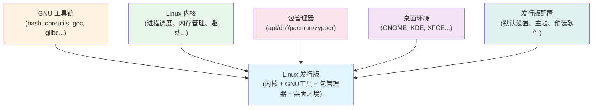
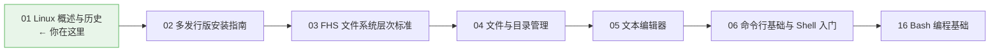

# 01 - Linux 概述与历史

> Linux 不仅仅是一个操作系统内核，它代表了一场持续三十余年的开源运动。从芬兰学生 Linus Torvalds 的个人项目，到如今驱动着全球 90% 以上服务器、全部 Top500 超级计算机以及数十亿台 Android 设备的庞大生态——理解 Linux 的起源与哲学，是深入掌握这门技术的起点。

---

## 1.1 Unix 的遗产

在 Linux 诞生之前，Unix 已经定义了现代操作系统的范式。

### 1.1.1 Unix 的诞生

| 年份 | 事件 | 意义 |
|------|------|------|
| 1965 | MIT、Bell Labs、GE 启动 Multics 项目 | 多用户操作系统的最早探索 |
| 1969 | Ken Thompson 用汇编在 PDP-7 上写出 Unics | Unix 的雏形诞生 |
| 1973 | Dennis Ritchie 用 C 语言重写 Unix V4 | 操作系统首次用高级语言实现，奠定可移植性 |
| 1975 | BSD（Berkeley Software Distribution）发布 | 学术界的 Unix 分支 |
| 1983 | Richard Stallman 启动 GNU 项目 | "GNU's Not Unix"——打造自由的操作系统 |
| 1987 | Andrew Tanenbaum 发布 MINIX | 用于教学的微型 Unix，启发了 Linus |

### 1.1.2 Unix 哲学

Unix 的设计哲学深远影响了 Linux：

> **"Do one thing and do it well"（做好一件事）**

- 每个程序只做一件事，通过管道（pipe）组合
- 一切皆文件（Everything is a file）
- 文本流作为通用接口
- 使用 Shell 脚本实现自动化

```bash
# Unix 哲学的经典体现：管道组合
cat /var/log/syslog | grep "error" | sort | uniq -c | sort -rn | head -20
```

这种"小工具组合"的思想至今仍是 Linux 命令行的核心范式。

---

## 1.2 Linus Torvalds 与 Linux 的诞生

### 1.2.1 "Just a hobby"

1991 年 8 月 25 日，一名 21 岁的芬兰赫尔辛基大学学生 Linus Torvalds 在 `comp.os.minix` 新闻组发布了一封著名的帖子：

> *"I'm doing a (free) operating system (just a hobby, won't be big and professional like gnu)..."*

他当时不会想到，这个"小爱好"将改变世界。

### 1.2.2 关键时间线

| 时间 | 里程碑 |
|------|--------|
| 1991.08.25 | Linus 公开宣布 Linux 项目 |
| 1991.09.17 | Linux 0.01 发布（仅能运行 bash 和 gcc） |
| 1991.10.05 | Linux 0.02 发布，宣布可自由使用 |
| 1992.01 | Linux 采用 GPL 许可证，开源运动的关键转折 |
| 1994.03.14 | Linux 1.0 正式发布 |
| 1996 | Tux 企鹅被确定为 Linux 官方吉祥物 |
| 2015 | Linux 4.0 发布，支持实时内核补丁 |
| 2022 | Linux 5.19 后直接跳到 6.0 版本号 |

### 1.2.3 命名的由来

Linus 最初想将内核命名为 **Freax**（Free + freak + X），但他的朋友 Ari Lemmke 在 FTP 服务器上创建目录时将其命名为 `linux`，这个名字被保留了下来。

### 1.2.4 内核源码

Linux 内核源码托管在 Linus 本人的 GitHub 仓库：

> https://github.com/torvalds/linux

至今 Linus Torvalds 仍然是内核的最终决策者（BDFL, Benevolent Dictator For Life），每日审核来自全球数千名开发者的补丁。

---

## 1.3 开源哲学与 GPL 许可证

### 1.3.1 自由软件的四项基本自由

由 Richard Stallman 定义（GNU 项目的基石）：

| 自由 | 内容 |
|------|------|
| 自由 0 | 为任何目的运行程序的自由 |
| 自由 1 | 研究程序如何工作并按需修改的自由 |
| 自由 2 | 重新分发副本的自由 |
| 自由 3 | 分发修改后版本的自由，让整个社区受益 |

### 1.3.2 GPL 许可证（GNU General Public License）

Linux 内核采用 **GPLv2** 许可证，核心原则是 **copyleft**（著佐权）：

- **可自由使用、修改、分发**源代码
- **衍生作品必须同样以 GPL 发布**（传染性条款）
- 不得添加额外限制
- 源代码必须随二进制一同提供

```text
GPL 的核心理念：
"如果站在巨人的肩膀上，你也必须成为巨人。"
——使用开源成果的人，其衍生成果也必须开源。
```

### 1.3.3 常见的开源许可证对比

| 许可证 | 类型 | Copyleft | 与闭源软件链接 | 代表项目 |
|--------|------|----------|----------------|----------|
| GPL v2/v3 | 强 Copyleft | 是 | 不允许（或需单独授权） | Linux 内核、Git |
| LGPL | 弱 Copyleft | 是 | 允许动态链接 | glibc、GTK |
| MIT | 宽松 | 否 | 允许 | Node.js、React |
| Apache 2.0 | 宽松 | 否 | 允许（含专利授权） | Kubernetes、Android |
| BSD | 宽松 | 否 | 允许 | FreeBSD、Go |

---

## 1.4 Linux 内核 vs. 发行版

许多初学者混淆"Linux"和"发行版"的概念，这是一个关键区分。

### 1.4.1 三层结构



| 组件 | 说明 | 由谁提供 |
|------|------|----------|
| **Linux 内核** | 硬件抽象、进程调度、内存管理、网络栈、驱动 | kernel.org（Linus 维护） |
| **GNU 工具链** | Shell、编译器、核心命令行工具 | GNU 项目 |
| **包管理器** | 软件安装、更新、卸载、依赖解析 | 各发行版开发 |
| **桌面环境** | 图形界面、窗口管理、文件管理器 | GNOME、KDE 等项目 |
| **发行版配置** | 主题、默认设置、预装软件策略 | 发行版维护者 |

### 1.4.2 严格术语

严格来说：
- **Linux** = 内核（kernel），由 Linus Torvalds 维护
- **GNU/Linux** = 内核 + GNU 工具链组成的完整操作系统（Richard Stallman 坚持的称呼）
- **发行版（Distribution）** = 内核 + GNU 工具 + 包管理器 + 桌面 + 配置的完整打包

在日常对话中，"Linux"通常指代发行版，这种用法已被广泛接受。

### 1.4.3 主要发行版家族

| 家族 | 包管理器 | 包格式 | 代表发行版 | 特点 |
|------|----------|--------|------------|------|
| **Debian** | apt | .deb | Debian, Ubuntu, Linux Mint | 稳定性优先，软件丰富 |
| **Red Hat** | dnf/yum | .rpm | RHEL, Fedora, CentOS Stream | 企业级，SELinux |
| **Arch** | pacman | .pkg.tar.zst | Arch Linux, Manjaro, EndeavourOS | 滚动更新，KISS 哲学 |
| **openSUSE** | zypper | .rpm | openSUSE Leap, Tumbleweed | YaST 配置工具，可选滚动 |
| **独立** | 各有不同 | 各异 | NixOS, Gentoo, Alpine, Void | 各自独特的理念 |

---

## 1.5 Linux 的应用领域

### 1.5.1 服务器（90%+ 市场份额）

Linux 在服务器领域的统治地位无可撼动：

```bash
# 全球 Top 100 万 Web 服务器中，Linux 占比超 96%
# 几乎所有云服务商（AWS, GCP, Azure）的主要操作系统都是 Linux
```

- Web 服务器（Nginx, Apache）
- 数据库服务器（MySQL, PostgreSQL, MongoDB）
- 容器编排（Kubernetes, Docker——本身就依赖 Linux 内核特性）
- 微服务架构的主要载体

### 1.5.2 超级计算机（100% 占有率）

自 2017 年 11 月起，**Top500 榜单上所有超级计算机全部运行 Linux**。包括：
- Fugaku（日本富岳）
- Summit / Frontier（美国橡树岭国家实验室）
- 天河、神威·太湖之光（中国）

Linux 能够被深度定制和优化是其在 HPC（高性能计算）领域无敌的原因。

### 1.5.3 Android — 内核是 Linux

```text
Android 架构：
 ┌──────────────────────┐
 │ Android 应用层 │ ← Java/Kotlin 编写
 ├──────────────────────┤
 │ Android Framework │
 ├──────────────────────┤
 │ Android Runtime │ ← ART (Android Runtime)
 ├──────────────────────┤
 │ HAL (硬件抽象层) │
 ├──────────────────────┤
 │ Linux 内核 │ ← 修改版的 Linux 内核
 └──────────────────────┘
```

全球数十亿台 Android 设备运行着 Linux 内核，这使 Linux 成为地球上部署最广泛的操作系统内核。

### 1.5.4 嵌入式与 IoT

- 路由器（OpenWRT——基于 Linux）
- 智能电视（大部分使用 Linux 内核）
- 汽车系统（Automotive Grade Linux，特斯拉使用 Linux）
- 工业控制（实时 Linux 内核，PREEMPT_RT 补丁）
- 树莓派（Raspberry Pi OS 基于 Debian）

### 1.5.5 桌面

虽然 Linux 桌面市场份额约 3-4%，但近年来增长显著：
- Steam Deck（Valve）运行基于 Arch 的 SteamOS，推动了 Linux 游戏
- ChromeOS 基于 Gentoo Linux，在教育市场占有率极高
- 开发者的首选平台（GitHub 调查显示超过 50% 开发者使用 Linux/macOS）

---

## 1.6 程序员为什么要学习 Linux

| 理由 | 说明 |
|------|------|
| **服务器统治** | 后端开发必然与 Linux 服务器交互 |
| **开发工具链** | GCC、Python、Node.js、Rust 等在 Linux 上体验最优 |
| **容器技术** | Docker/Kubernetes 的核心概念（namespace, cgroup）来自 Linux 内核 |
| **源码可读** | 可以阅读任何系统组件的源代码，深入理解计算机原理 |
| **命令行效率** | Shell 自动化远超 GUI 效率 |
| **云计算** | 云环境几乎全是 Linux |
| **嵌入式/IoT** | 进入物联网开发的必备技能 |
| **高薪岗位** | DevOps、SRE、云架构师等岗位必须精通 Linux |

---

## 1.7 学习路径建议



建议按照编号顺序阅读基础章节，然后再根据兴趣深入特定主题。Linux 学习是一个螺旋上升的过程——初学时理解基本操作，进阶后理解底层原理，最终形成完整的系统观。

---

## 1.8 相关链接

- [[02-多发行版安装指南]] — 安装你的第一个 Linux 系统
- [[03-FHS文件系统层次标准]] — 理解 Linux 的目录结构
- [[29-操作系统概述与结构]] — 操作系统底层原理
- [[06-命令行基础与Shell入门]] — 开始使用命令行
- [[18-Bash编程基础]] — Shell 脚本编程

> **Linux 内核源码**：https://github.com/torvalds/linux
>
> **Linux 基金会**：https://www.linuxfoundation.org/
>
> **GNU 项目**：https://www.gnu.org/
