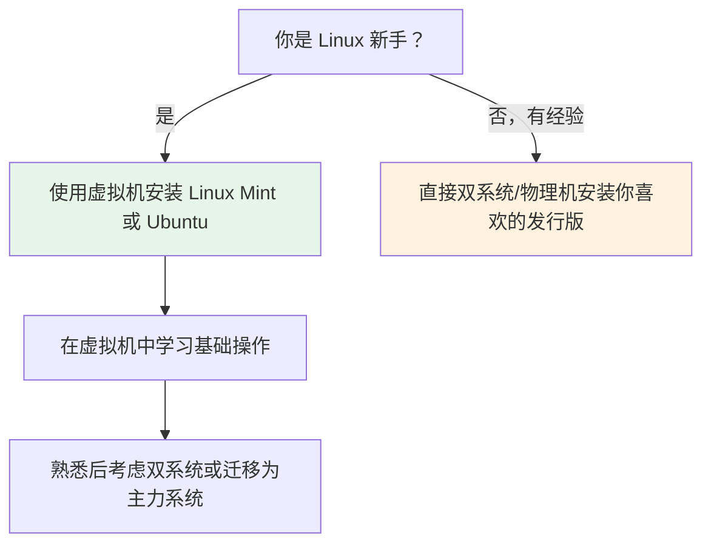

# 02 - 多发行版安装指南

> 在众多 Linux 发行版中选择并安装一个适合自己的系统，是所有 Linux 用户的起点。本章将介绍虚拟机安装（推荐初学者首选）、WSL2、双系统与物理机安装等四种主流方案，并列出各主要发行版的官方下载渠道与国内镜像站点。

---

## 2.1 安装方案选择

### 2.1.1 方案对比

| 安装方式 | 优点 | 缺点 | 适合人群 |
|----------|------|------|----------|
| **虚拟机** | 零风险、可快照回滚、同时运行宿主机与 Linux | 性能折扣（约 80-90%） | 初学者首选 |
| **WSL2** | Windows 原生体验、启动快、无缝集成 | 无独立桌面环境、仅限 Windows | Windows 用户 |
| **双系统** | 原生性能、完整硬件驱动 | 需要分区操作、引导风险、切换需重启 | 有经验的用户 |
| **物理机安装** | 体验最佳、全部资源可用 | 不可逆（单系统时）、驱动可能有问题 | 老电脑/专用机器 |

### 2.1.2 推荐路径



---

## 2.2 方案一：虚拟机安装（推荐入门）

虚拟机是在你现有操作系统内模拟一台完整计算机的软件，Linux 以"客机"身份运行其中。最安全的入门方案。

### 2.2.1 虚拟机软件选择

| 软件 | 平台 | 许可证 | 特点 |
|------|------|--------|------|
| **VirtualBox** | Windows/macOS/Linux | 自由软件（GPLv2） | 免费、跨平台、入门首选 |
| **VMware Workstation** | Windows/Linux | 商业（个人免费） | 性能更好、3D 加速更强 |
| **QEMU/KVM** | Linux | 自由软件 | Linux 原生最优性能、命令行可控 |
| **UTM** | macOS (Apple Silicon) | 自由软件 | M 系列 Mac 推荐 |

### 2.2.2 VirtualBox 安装流程（推荐新手）

**第一步：下载并安装 VirtualBox**

- 官网下载：https://www.virtualbox.org/
- 安装过程与普通 Windows/macOS 软件一致，下一步即可

**第二步：下载 Linux 发行版的 ISO 镜像**

推荐 Linux Mint 或 Ubuntu，下文的 2.5 节提供了各发行版下载地址。

**第三步：创建虚拟机**

```
1. 打开 VirtualBox，点击"新建"
2. 名称：任意（如 "Linux Mint 学习机"）
3. 类型：Linux
4. 版本：Ubuntu (64-bit) 或对应发行版
5. 内存：至少 2048MB（推荐 4096MB）
6. 硬盘：现在创建虚拟硬盘 → VDI → 动态分配 → 至少 40GB
```

**第四步：挂载 ISO 并启动**

```
1. 右键虚拟机 → 设置 → 存储
2. 点击"没有盘片" → 右侧光盘图标 → 选择虚拟光盘文件
3. 选择你下载的 .iso 文件
4. 启动虚拟机
```

**第五步：按照安装向导操作**

大多数现代发行版的安装过程非常直观，基本是：
- 选择语言 → 选择时区 → 键盘布局 → 分区（使用整个磁盘即可）→ 创建用户 → 等待安装完成

### 2.2.3 虚拟机常用功能

| 功能 | 用途 | 快捷键（VirtualBox） |
|------|------|---------------------|
| **快照** | 保存当前状态，可随时回滚 | 菜单 → 虚拟机 → 生成快照 |
| **共享文件夹** | 宿主机与虚拟机交换文件 | 设置 → 共享文件夹 |
| **共享剪贴板** | 宿主机与虚拟机之间复制粘贴 | 设置 → 常规 → 高级 |
| **无缝模式** | 虚拟机窗口与宿主机融为一体 | 快捷键 Host+L |

> **提示**：在安装/配置 Linux 之前养成使用快照的习惯。如果后续操作导致系统崩溃，只需恢复快照即可瞬间恢复，这是虚拟机学习最大优势。

---

## 2.3 方案二：WSL2（Windows Subsystem for Linux 2）

WSL2 是微软官方提供的在 Windows 内运行 Linux 内核的方案，比虚拟机更轻量、启动更快。

### 2.3.1 安装 WSL2

在 Windows PowerShell（管理员模式）中执行：

```powershell
# 一条命令安装 WSL2（Windows 10 2004+ 或 Windows 11）
wsl --install

# 重启后会自动安装 Ubuntu 作为默认发行版
```

如果已有 WSL1，升级到 WSL2：

```powershell
wsl --set-default-version 2
```

### 2.3.2 可选安装的发行版

```powershell
# 查看可安装的发行版
wsl --list --online

# 安装指定发行版
wsl --install -d Debian
wsl --install -d Ubuntu-24.04
wsl --install -d kali-linux
```

### 2.3.3 WSL2 的特点

| 特点 | 说明 |
|------|------|
| **完整 Linux 内核** | WSL2 运行真正的 Linux 内核，而非模拟层 |
| **与 Windows 互操作** | 可在 Linux 中直接调用 Windows 程序，反之亦然 |
| **文件系统互通** | Windows 文件可在 `/mnt/c/` 访问，Linux 文件可在 `\\wsl$\` 访问 |
| **GPU 加速** | 支持 CUDA、OpenGL |
| **systemd 支持** | WSL2 新版支持 systemd |
| **无图形界面** | 默认只有命令行，但可通过 WSLg 运行 GUI 应用 |

### 2.3.4 WSL2 的局限

- 仅 Windows 平台可用
- 无法完整模拟物理硬件
- 某些底层系统调用不完全支持（如加载内核模块）
- 不适合需要直接操作硬件的学习场景（如内核编译、驱动开发）

> WSL2 适合在 Windows 上进行日常开发，但如果目标是深入理解 Linux 系统，虚拟机或真实安装仍是更好的选择。

---

## 2.4 方案三：双系统安装

### 2.4.1 核心步骤概览

```
1. 在 Windows 磁盘管理中压缩卷，为 Linux 腾出空间（至少 40GB）
2. 使用 Rufus/balenaEtcher 制作 U 盘启动盘
3. 重启电脑，进入 BIOS/UEFI，设置从 U 盘启动
4. 启动 Linux Live 环境，运行安装程序
5. 分区时选择"与 Windows 共存"或手动分区
6. 完成安装，GRUB 会自动识别 Windows 启动项
```

### 2.4.2 注意事项

| 注意点 | 说明 |
|--------|------|
| **备份数据** | 分区操作前务必备份重要数据 |
| **关闭快速启动** | Windows 的快速启动可能导致 Linux 无法挂载 NTFS 分区 |
| **关闭 Secure Boot** | 某些发行版需要关闭（Ubuntu/Fedora 通常支持 Secure Boot） |
| **了解 UEFI vs Legacy** | 现代电脑使用 UEFI，需要创建 EFI 系统分区 |
| **先装 Windows 再装 Linux** | 这个顺序最容易配置双启动 |

---

## 2.5 方案四：物理机安装（单系统）

在专用硬件或老设备上直接将 Linux 作为唯一操作系统。步骤与双系统类似，但分区时选择"使用整个磁盘"即可。

### 2.5.1 适合场景

- 旧电脑"焕发新生"（Linux 对硬件要求极低）
- 学习服务器管理
- 完全脱离 Windows/macOS 的开发者日常使用
- 树莓派等 ARM 设备

### 2.5.2 硬件兼容性

```bash
# 安装前可在 Live 环境中检查硬件兼容性
lspci         # 查看 PCI 设备
lsusb         # 查看 USB 设备
lscpu         # 查看 CPU 信息
lspci -k      # 查看内核驱动加载情况（关键：看是否有未知设备）
dmesg | grep -i error   # 查看内核错误信息
```

---

## 2.6 主要发行版下载地址

### 2.6.1 面向初学者的推荐

| 发行版 | 官网下载 | 特点 |
|--------|----------|------|
| **Linux Mint** | https://linuxmint.com/ | 最友好的入门选择，开箱即用，Cinnamon 桌面类似 Windows |
| **Ubuntu** | https://ubuntu.com/download | 最流行的桌面发行版，社区庞大，资料丰富 |
| **Fedora** | https://fedoraproject.org/workstation/download | 领先采用新技术，GNOME 桌面，适合开发者 |

### 2.6.2 进阶与专业发行版

| 发行版 | 官网下载 | 特点 |
|--------|----------|------|
| **Debian** | https://www.debian.org/download | 稳定性极致，支持架构最多，Ubuntu 的母发行版 |
| **Arch Linux** | https://archlinux.org/download/ | 滚动更新，极简设计，Arch Wiki 是最好的 Linux 文档 |
| **openSUSE** | https://get.opensuse.org/ | YaST 强大的系统管理工具，可选 Leap（稳定）或 Tumbleweed（滚动） |

### 2.6.3 特殊用途发行版

| 发行版 | 官网 | 用途 |
|--------|------|------|
| **Kali Linux** | https://www.kali.org/ | 安全渗透测试 |
| **Alpine Linux** | https://alpinelinux.org/ | 超轻量（~5MB），Docker 容器首选基础镜像 |
| **Raspberry Pi OS** | https://www.raspberrypi.com/software/ | 树莓派专用，基于 Debian |
| **NixOS** | https://nixos.org/ | 声明式配置，可复现系统 |

---

## 2.7 国内镜像站点

下载 ISO 时，使用国内镜像可以大幅提升下载速度。

| 镜像站 | 地址 | 特点 |
|--------|------|------|
| **清华大学 TUNA** | https://mirrors.tuna.tsinghua.edu.cn/ | 国内最全的镜像站之一 |
| **中国科学技术大学 USTC** | https://mirrors.ustc.edu.cn/ | 高校镜像，速度稳定 |
| **阿里云镜像** | https://mirrors.aliyun.com/ | 商业云服务商，带宽充足 |
| **网易镜像** | https://mirrors.163.com/ | 老牌镜像站 |
| **华为云镜像** | https://mirrors.huaweicloud.com/ | 带宽充足 |

> 安装完成后，建议将系统的软件源也切换为国内镜像，详见各发行版的 [[distro/]] 指南。

---

## 2.8 安装后检查清单

无论使用哪种安装方式，初次进入系统后建议完成以下操作：

### 2.8.1 更新系统

```bash
# Debian/Ubuntu/Linux Mint
sudo apt update && sudo apt upgrade -y

# Fedora
sudo dnf upgrade --refresh -y

# Arch Linux
sudo pacman -Syu

# openSUSE
sudo zypper refresh && sudo zypper update -y
```

### 2.8.2 安装基础工具

```bash
# 使用你的包管理器安装以下常用工具
# curl — 网络请求工具
# wget — 文件下载工具
# git — 版本控制
# vim — 文本编辑器
# htop — 系统监控
# tree — 目录树显示
```

具体安装方法：

```bash
# Debian/Ubuntu/Linux Mint
sudo apt install curl wget git vim htop tree -y

# Fedora
sudo dnf install curl wget git vim htop tree -y

# Arch Linux
sudo pacman -S curl wget git vim htop tree

# openSUSE
sudo zypper install curl wget git vim htop tree -y
```

### 2.8.3 检查常用信息

```bash
uname -a           # 内核版本
cat /etc/os-release  # 发行版版本
lscpu              # CPU 信息
free -h            # 内存信息
df -h              # 磁盘使用情况
ip a               # 网络接口信息
```

### 2.8.4 换源（可选）

根据你所在地区，将软件仓库镜像切换到国内镜像站，可以大幅提升安装和更新速度。各发行版的具体操作请参考 [[distro/]] 子目录下的详细指南。

---

## 2.9 常见问题

| 问题 | 解决方案 |
|------|----------|
| **虚拟机中分辨率低** | 安装 VirtualBox Guest Additions 或 open-vm-tools |
| **WSL2 无法联网** | 检查 Windows 防火墙，或在 PowerShell 执行 `wsl --shutdown` 后重启 |
| **双系统 Windows 引导丢失** | 在 Linux 中执行 `sudo update-grub` 重新扫描 |
| **U 盘启动盘无法识别** | 确认 BIOS 中禁用了 Secure Boot，或使用 Ventoy 工具制作 |
| **安装完成进入 GRUB rescue** | 使用 Live USB 启动，使用 `boot-repair` 工具修复 |

---

## 2.10 相关链接

- [[01-Linux概述与历史]] — 了解 Linux 的背景与理念
- [[03-FHS文件系统层次标准]] — 安装完成后，了解文件系统的布局
- [[04-文件与目录管理]] — 开始使用命令行管理文件
- [[06-命令行基础与Shell入门]] — 熟悉命令行基础概念
- [[32-systemd全面指南]] — 理解现代 Linux 的初始化系统
- [[distro/]] — 各发行版详细配置指南

> **初学者建议**：使用虚拟机安装 **Linux Mint**，在安全的环境中慢慢探索。当你对命令行和系统操作有足够信心后，再考虑双系统或物理机安装。
