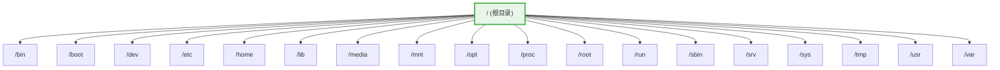

# 03 - FHS 文件系统层次标准

> FHS（Filesystem Hierarchy Standard）定义了 Linux 系统中目录的结构和用途。理解每个目录的设计意图，是掌握 Linux 系统管理的基础。无论你使用的是 Debian、Fedora 还是 Arch Linux，FHS 都提供了统一的目录组织逻辑——虽然有发行版之间的微妙差异，但核心脉络是一致的。

---

## 3.1 什么是 FHS

**FHS（Filesystem Hierarchy Standard）** 是由 Linux 基金会维护的标准文档，规定了各发行版的文件和目录放置位置。它的目标是：

- **可预测性**：用户和管理员知道在哪个目录找到什么
- **互操作性**：软件包可以在不同发行版间正常工作
- **一致性**：不因发行版不同而改变核心目录的用途

当前最新版本为 **FHS 3.0**（2015 年发布）。并非所有发行版都严格遵循，但绝大多数主流发行版的核心目录结构是一致的。

```bash
# 查看你的系统根目录
ls /
# 典型输出：
# bin dev home lib64 media opt root sbin sys usr
# boot etc lib lost+found mnt proc run srv tmp var
```

---

## 3.2 根目录 (`/`) — 所有目录的起点

`/` 是 Linux 文件系统的根（root），所有文件和目录都从这里展开。与 Windows 的多盘符（C:\, D:\）不同，Linux 采用**单一层次树**结构——所有分区、设备、网络文件系统都挂载（mount）到这棵树的某个节点上。



---

## 3.3 各目录详解

### 3.3.1 `/bin` — 基本用户命令

存放系统启动和单用户模式下必需的基本命令。

```bash
ls /bin
# cat, cp, ls, mv, rm, bash, sh, mount, echo, date ...
```

> 在现代 Linux（Arch, Fedora 33+, Ubuntu 20.04+, Debian 11+）中，`/bin` 通常是 `/usr/bin` 的符号链接——这是 **/usr merge** 的一部分，详见 3.5 节。

### 3.3.2 `/boot` — 启动文件

存放系统启动所需的文件：

```bash
ls /boot
# vmlinuz-linux ← 内核镜像（压缩的 Linux 内核）
# initramfs-linux.img ← 初始 RAM 文件系统（initramfs）
# grub/ ← GRUB 引导加载程序配置
```

| 文件 | 说明 |
|------|------|
| `vmlinuz-*` | 压缩后的 Linux 内核镜像 |
| `initramfs-*.img` | 初始内存文件系统，包含启动必需的驱动和工具 |
| `System.map-*` | 内核符号表，用于调试 |
| `config-*` | 编译该内核时的配置 |
| `grub/` | GRUB2 引导程序配置和模块 |

### 3.3.3 `/dev` — 设备文件

Linux "一切皆文件" 哲学最直接的体现。`/dev` 中的每个条目代表一个设备：

| 文件 | 设备 | 类型 |
|------|------|------|
| `/dev/sda` | 第一块 SATA/SCSI 硬盘 | 块设备 |
| `/dev/sda1` | 第一块硬盘的第一个分区 | 块设备 |
| `/dev/nvme0n1` | 第一块 NVMe SSD | 块设备 |
| `/dev/tty` | 当前终端 | 字符设备 |
| `/dev/null` | 数据黑洞（丢弃所有写入数据） | 特殊设备 |
| `/dev/zero` | 无限提供零字节 | 特殊设备 |
| `/dev/random` | 真随机数生成器 | 特殊设备 |
| `/dev/urandom` | 伪随机数生成器（更快） | 特殊设备 |
| `/dev/loop0` | 回环设备（用于挂载 ISO 文件） | 块设备 |

```bash
# 常用设备操作
lsblk # 查看块设备（比直接看 /dev 更清晰）
echo "test" > /dev/null # 输出到黑洞（丢弃）
dd if=/dev/zero of=test.bin bs=1M count=100 # 生成 100MB 的空文件
```

### 3.3.4 `/etc` — 配置文件

**Linux 的"控制面板"**。几乎所有系统级和软件的配置文件都在这里。

```bash
ls /etc
# 常见文件和目录：
# passwd ← 用户账户信息
# shadow ← 加密后的密码（仅 root 可读）
# group ← 用户组信息
# fstab ← 文件系统挂载表
# hosts ← 主机名到 IP 的静态映射
# resolv.conf ← DNS 解析配置
# sudoers ← sudo 权限配置
# ssh/ ← SSH 服务配置
# systemd/ ← systemd 配置
# nginx/ ← Nginx Web 服务器配置
# apt/ ← Debian 系列包管理器配置
# dnf/ ← Fedora 系列包管理器配置
# pacman.d/ ← Arch Linux 包管理器配置
```

`/etc` 的名字源自 "et cetera"（以及其他），历史上一度是所有杂项配置的堆放地，如今已演进为统一的配置目录。

### 3.3.5 `/home` — 用户主目录

每个普通用户的个人文件和配置所在：

```
/home/
├── alice/ ← Alice 的主目录
│ ├── Documents/
│ ├── Downloads/
│ ├── .bashrc ← Bash 个人配置
│ ├── .config/ ← 用户级应用配置
│ └── .ssh/ ← SSH 密钥和配置
├── bob/ ← Bob 的主目录
│ └── ...
```

```bash
echo $HOME # 当前用户的主目录路径
cd ~ # 快速回到主目录
ls ~/.config # 查看应用个人配置
```

> 将 `/home` 放在独立分区是一种常见实践——重装系统时保留 `/home` 分区，所有个人数据不会丢失。

### 3.3.6 `/lib` 与 `/lib64` — 系统库

存放系统启动和 `/bin`、`/sbin` 中程序所需的基本共享库（shared libraries）和内核模块。

```bash
ls /lib
# modules/ ← 内核模块（驱动）
# firmware/ ← 硬件固件
# systemd/ ← systemd 组件
```

在现代 Linux 中，`/lib` 通常也是 `/usr/lib` 的符号链接。

```bash
# 查看程序的动态库依赖
ldd /bin/ls
# 典型输出：
# linux-vdso.so.1
# libcap.so.2 => /usr/lib/libcap.so.2
# libc.so.6 => /usr/lib/libc.so.6
```

### 3.3.7 `/media` 与 `/mnt` — 挂载点

| 目录 | 用途 | 谁管理 |
|------|------|--------|
| `/media` | 自动挂载可移动设备（U盘、光盘、外接硬盘） | 系统自动（udisks） |
| `/mnt` | 系统管理员手动临时挂载 | 手动操作 |

```bash
# 典型使用
ls /media/$USER/ # 查看自动挂载的 U 盘
sudo mount /dev/sdb1 /mnt # 手动挂载到 /mnt
sudo mount -t iso9660 image.iso /mnt # 挂载 ISO 文件
```

### 3.3.8 `/opt` — 可选/第三方软件包

存放不属于发行版仓库的"可选"软件，通常自带完整的目录结构：

```
/opt/
├── google/
│ └── chrome/ ← Google Chrome
├── jetbrains/
│ └── idea/ ← IntelliJ IDEA
└── virtualbox/ ← VirtualBox
```

> 区分：通过包管理器安装的软件放在 `/usr` 下；手动安装的独立第三方软件放在 `/opt` 下。

### 3.3.9 `/proc` — 进程与内核信息（虚拟文件系统）

`/proc` 不占用磁盘空间，它是由内核在内存中动态生成的虚拟文件系统，提供进程信息和内核参数接口。

```bash
ls /proc
# 数字目录（如 1, 1234...）= 进程 PID 的信息目录
# cpuinfo = CPU 信息
# meminfo = 内存信息
# version = 内核版本
# uptime = 系统运行时间
# mounts = 挂载信息

# 常用操作
cat /proc/cpuinfo | grep "model name" # 查看 CPU 型号
cat /proc/meminfo | grep MemTotal # 查看总内存
cat /proc/version # 查看内核版本
cat /proc/uptime # 查看运行时间（秒）
```

`/proc/sys/` 子目录下的文件可以**读写**，用于动态调整内核参数。详见 [[48-BPF与系统追踪]] 中关于 sysctl 的内容。

### 3.3.10 `/root` — root 用户主目录

root（超级管理员）的个人主目录。与 `/home/` 下的普通用户主目录分开存放，确保即使 `/home` 挂载失败，root 也能登录系统。

```bash
ls /root
# .bashrc, .profile 等配置文件
```

> 不要混淆 `/`（根目录）和 `/root`（root 用户的主目录）——虽然 root 是"根"用户，但它的家目录是 `/root` 而非 `/`。

### 3.3.11 `/run` — 运行时可变数据

`/run` 是 **tmpfs**（内存文件系统），存放自系统启动以来的运行时数据：

```bash
ls /run
# user/ ← 用户运行时目录（uid）
# lock/ ← 锁文件
# systemd/ ← systemd 通信 socket
# log/ ← 运行时日志
# 各种 .pid 文件 ← 守护进程的 PID 文件
```

> `/run` 在每次重启后清空，这和 `/tmp`（可能被清理）不同。

### 3.3.12 `/sbin` — 系统管理命令

存放系统管理员使用的基本命令（Superuser binaries）：

```bash
ls /sbin
# fdisk, mkfs, mount, iptables, ip, reboot, shutdown ...
```

> 同样受 /usr merge 影响，`/sbin` 在现代系统中通常是 `/usr/sbin` 的符号链接。

### 3.3.13 `/srv` — 服务数据

存放系统提供的服务数据（不多用，但标准中有）：

```
/srv/
├── http/ ← Web 服务器的数据
├── ftp/ ← FTP 服务器的数据
└── git/ ← Git 仓库
```

> 并非所有发行版都遵循这个规范。Apache 默认使用 `/var/www/html` 而非 `/srv/http`。

### 3.3.14 `/sys` — 内核与设备信息（虚拟文件系统）

与 `/proc` 类似，`/sys` 也是内核在内存中生成的虚拟文件系统，专注于**设备和驱动**信息：

```bash
ls /sys
# block/ ← 块设备
# bus/ ← 总线类型（PCI, USB...）
# class/ ← 设备类别
# dev/ ← 设备节点
# devices/ ← 所有设备的层次结构
# firmware/ ← 固件属性
# power/ ← 电源管理
```

```bash
# 查看网卡速度
cat /sys/class/net/eth0/speed

# 查看电池状态（笔记本）
cat /sys/class/power_supply/BAT0/capacity
```

### 3.3.15 `/tmp` — 临时文件

所有用户可写的临时文件目录。重启后通常会被清空（取决于发行版配置）。

```bash
# 创建临时文件
mktemp /tmp/myapp.XXXXXX

# 某些发行版将 /tmp 挂载为 tmpfs（内存文件系统），重启即清空
df -h /tmp | grep tmpfs # 检查是否是 tmpfs
```

### 3.3.16 `/usr` — 共享只读数据

`/usr`（Unix System Resources）是除 `/etc` 外最重要的目录，包含绝大部分用户级程序和库：

| 子目录 | 内容 |
|--------|------|
| `/usr/bin` | 用户级可执行文件的主体 |
| `/usr/sbin` | 系统管理程序 |
| `/usr/lib` | 库文件 |
| `/usr/share` | 架构无关的共享数据（文档、图标、翻译、man 手册） |
| `/usr/local` | 本地编译安装的软件（优先级高于 /usr） |
| `/usr/include` | C/C++ 头文件 |
| `/usr/src` | 源代码（主要是内核源码） |

```bash
ls /usr/share
# applications/ ← .desktop 启动器文件
# man/ ← manual 手册页
# doc/ ← 文档
# icons/ ← 图标主题
# locale/ ← 语言/地区本地化数据
```

`/usr/local` 的层次结构：

```
/usr/local/
├── bin/ ← 本地编译的可执行文件
├── etc/ ← 本地编译软件的配置
├── lib/ ← 本地编译的库
├── share/ ← 本地编译的架构无关数据
└── src/ ← 本地存放的源代码
```

### 3.3.17 `/var` — 可变数据

存放系统运行过程中会变化的数据（Variable data）：

| 子目录 | 内容 |
|--------|------|
| `/var/log` | 系统和服务日志文件 |
| `/var/cache` | 应用程序缓存 |
| `/var/lib` | 应用程序的状态数据（数据库、包管理器数据库） |
| `/var/spool` | 等待处理的任务队列（打印、邮件、cron） |
| `/var/tmp` | 比 `/tmp` 更持久的临时文件（重启后保留） |

```bash
# 查看系统日志
ls /var/log
# syslog, messages, boot.log, journal/
# nginx/access.log, nginx/error.log

# 查看包管理器数据库
ls /var/lib/pacman/ # Arch Linux
ls /var/lib/dpkg/ # Debian 系列
ls /var/lib/rpm/ # RHEL/Fedora 系列
```

---

## 3.4 完整目录速查表

| 目录 | 全称 | 内容 | 可写 | 持久 |
|------|------|------|------|------|
| `/bin` | Binaries | 基本命令 | 否 | 是 |
| `/boot` | Boot | 启动文件 | 需 root | 是 |
| `/dev` | Devices | 设备文件 | 内核 | 是 |
| `/etc` | Et cetera | 配置文件 | 需 root | 是 |
| `/home` | Home | 用户主目录 | 是 | 是 |
| `/lib` | Libraries | 库+内核模块 | 否 | 是 |
| `/media` | Media | 可移动设备挂载 | 自动/root | 临时 |
| `/mnt` | Mount | 临时挂载点 | 需 root | 临时 |
| `/opt` | Optional | 第三方软件 | 需 root | 是 |
| `/proc` | Process | 进程/内核信息 | 内核 | 虚拟 |
| `/root` | Root home | root 主目录 | root | 是 |
| `/run` | Runtime | 运行时数据 | 需 root | 内存 |
| `/sbin` | System Binaries | 系统管理命令 | 否 | 是 |
| `/srv` | Service | 服务数据 | 需 root | 是 |
| `/sys` | System | 内核/设备信息 | 内核 | 虚拟 |
| `/tmp` | Temporary | 临时文件 | 所有 | 可能清空 |
| `/usr` | Unix System Resources | 用户程序+数据 | 否 | 是 |
| `/var` | Variable | 可变数据 | 需 root | 是 |

---

## 3.5 /usr Merge 合并

### 3.5.1 传统布局 vs /usr Merge

**传统布局（FHS 2.x）：**

```
/bin/ ← 基本命令（启动可用）
/sbin/ ← 系统管理命令（启动可用）
/lib/ ← 基本库（启动可用）
/usr/bin/ ← 扩展用户命令
/usr/sbin/ ← 扩展系统命令
/usr/lib/ ← 扩展库
```

**/usr Merge（FHS 3.0）：**

```
/usr/bin/ ← 所有命令（/bin → /usr/bin 符号链接）
/usr/sbin/ ← 所有系统命令（/sbin → /usr/sbin 符号链接）
/usr/lib/ ← 所有库（/lib → /usr/lib 符号链接）
```

### 3.5.2 各发行版的支持情况

| 发行版 | /usr Merge 状态 |
|--------|-----------------|
| **Arch Linux** | 最早采用，2012 年完成 |
| **Fedora** | 33 版本（2020 年）完成合并 |
| **RHEL** | RHEL 10 及之后合并且提供 compat 工具 |
| **Ubuntu** | 20.04 LTS 开始 |
| **Debian** | 11 Bullseye 合并，Bookworm（12）完全合并 |
| **openSUSE** | 新版本已合并 |
| **NixOS** | 根本结构不同，不适用（见 3.6.4） |

```bash
# 检查你的系统是否已完成 /usr merge
ls -l / | grep -E "^l.*-> usr"
# 如果 /bin, /sbin, /lib* 是到 usr 子目录的符号链接，则已 merge
```

---

## 3.6 发行版差异

### 3.6.1 Debian/Ubuntu 系列

遵循 FHS 标准最为严格。一些特点：
- `update-alternatives` 管理多个版本软件的默认路径
- `/etc/alternatives/` 存放 alternatives 的符号链接
- 包管理器数据库在 `/var/lib/dpkg/`

### 3.6.2 RHEL/Fedora 系列

- SELinux 安全标签影响文件访问，目录结构本身与 FHS 一致
- 专用的 `/etc/sysconfig/` 存放网络、服务启动参数
- 包管理器数据库在 `/var/lib/rpm/`

### 3.6.3 Arch Linux

- 完全采用 /usr merge，是最早的实施者
- 简洁设计，配置文件少而精
- Arch Wiki 被公认为最好的 Linux 文档资源
- 包管理器数据库在 `/var/lib/pacman/`

### 3.6.4 NixOS — 完全不同的文件系统哲学

NixOS 的结构与 FHS 差异极大（参见 [[46-不可变系统]]）：

```
/nix/store/<hash>-<pkgname>-<version>/
# 例: /nix/store/3x53l4y...-firefox-125.0/
```

- 没有传统的 `/bin`, `/usr/bin`, `/lib` 等
- 所有软件包被隔离存放在 `/nix/store/`，通过 hash 唯一标识
- 用户的系统环境通过符号链接拼合而成
- 带来完美的可复现性和原子升级

---

## 3.7 实践技巧

### 3.7.1 快速探索目录结构

```bash
# 查看根目录一级（不递归）
ls -1 /

# 以树状图形式显示目录（需要安装 tree）
tree -L 1 / # 只显示一层
tree -L 2 /usr # 显示 /usr 下两层

# 查看目录的磁盘占用（不递归）
du -sh /* 2>/dev/null
```

### 3.7.2 判断文件所属软件包

```bash
# Debian/Ubuntu
dpkg -S /usr/bin/vim

# Fedora/RHEL
rpm -qf /usr/bin/vim

# Arch Linux
pacman -Qo /usr/bin/vim

# openSUSE
rpm -qf /usr/bin/vim
```

### 3.7.3 查找配置文件

```bash
# 在 /etc 中查找与某个软件相关的配置
ls /etc/ | grep -i ssh
ls /etc/ | grep -i network

# 查看包的配置文件清单
# Debian/Ubuntu
dpkg -L nginx | grep etc

# Fedora/RHEL
rpm -ql nginx | grep etc

# Arch Linux
pacman -Ql nginx | grep etc
```

---

## 3.8 相关链接

- [[04-文件与目录管理]] — 文件管理的基础命令
- [[34-文件系统设计]] — 深入理解文件系统设计
- [[40-文件系统深入]] — 文件系统底层原理
- [[46-不可变系统]] — NixOS 等不可变系统的文件结构
- [[10-存储管理与磁盘操作]] — 分区、挂载与存储管理
- [[42-压缩与归档工具]] — 文件打包与压缩
