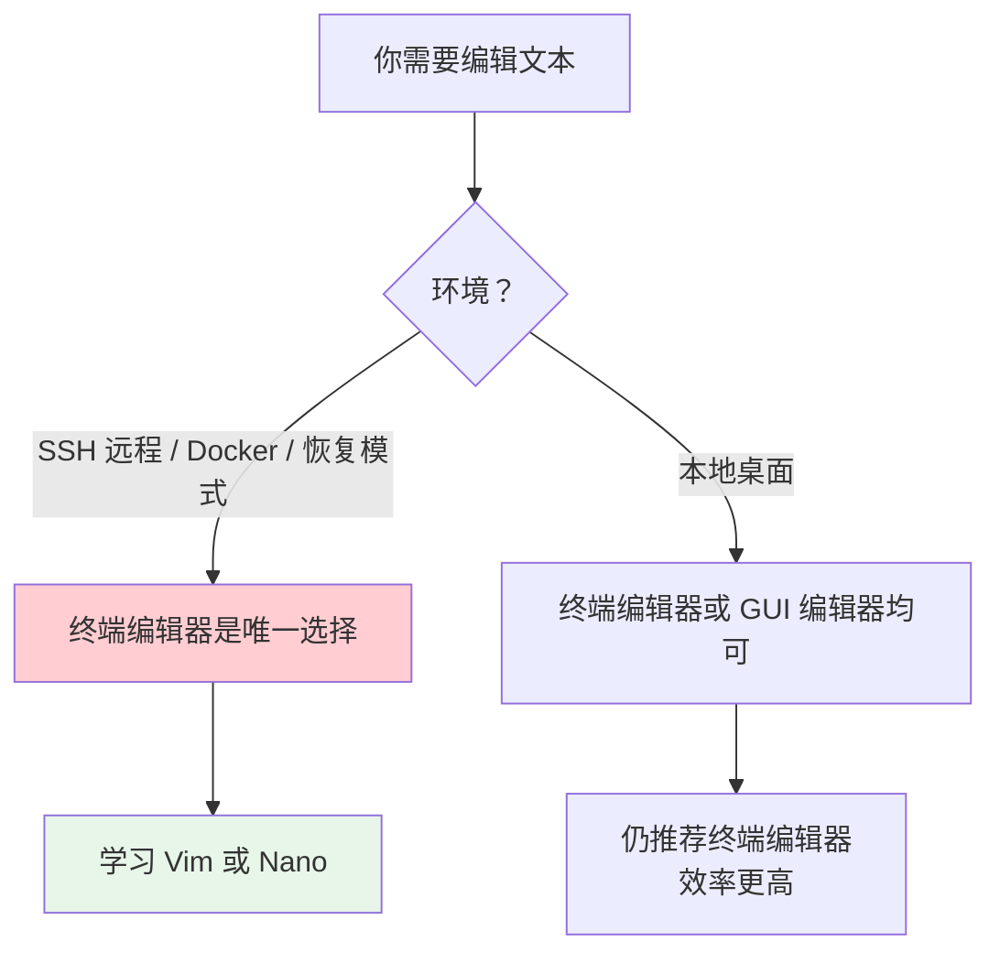

# 05 - 文本编辑器（Vim + Nano）

> 在图形化编辑器盛行的时代，终端文本编辑器依然是 Linux 用户和开发者的核心工具。远程服务器没有 GUI、Docker 容器极简环境、快速修改配置文件——这些场景下，掌握至少一个终端编辑器是刚需。本章从入门友好的 nano 开始，再深入讲 Vim 的使用哲学。

---

## 5.1 为什么必须学会终端编辑器

| 场景 | 说明 |
|------|------|
| **SSH 远程管理** | 远程服务器通常只有命令行，没有图形界面 |
| **Docker 容器** | 容器镜像为了体积最小化，通常不包含 GUI |
| **系统恢复** | 系统崩溃后的单用户模式只有终端可用 |
| **sudo 编辑系统配置** | `sudo vim /etc/nginx/nginx.conf` 比 GUI 更直接 |
| **效率** | 熟练后编辑速度远超鼠标操作 |
| **通用性** | 任何 Linux/Unix 系统都有 vi（POSIX 标准要求） |



---

## 5.2 Nano — 入门友好的编辑器

### 5.2.1 Nano 简介

Nano 是 GNU 项目的一部分，设计目标是简单直观。底部始终显示快捷键提示，上手难度极低。

### 5.2.2 基本操作

```bash
nano                      # 新建空白文件
nano file.txt             # 打开已有文件或创建新文件
nano -l file.txt          # 显示行号
nano -m file.txt          # 启用鼠标支持
nano -B file.txt          # 保存时创建备份 file.txt~
```

### 5.2.3 Nano 快捷键

所有快捷键以 `^` 表示 Ctrl 键，以 `M-` 表示 Alt/Esc 键：

| 快捷键 | 功能 | 记忆技巧 |
|--------|------|----------|
| `Ctrl+G` | 显示帮助 | **G**et Help |
| `Ctrl+O` | 保存文件（Write **O**ut） | Write **O**ut |
| `Ctrl+X` | 退出 | E**x**it |
| `Ctrl+K` | 剪切当前行 | **K**ut |
| `Ctrl+U` | 粘贴（Uncut） | **U**ncut |
| `Ctrl+W` | 搜索 | **W**here is |
| `Ctrl+\` | 搜索并替换 | |
| `Ctrl+C` | 显示光标位置 | **C**ursor position |
| `Ctrl+_` | 跳转到指定行号 | Go to line |
| `Alt+U` | 撤销 | **U**ndo |
| `Alt+E` | 重做 | R**e**do |
| `Alt+A` | 设置标记（开始选择） | M**a**rk |

### 5.2.4 Nano 配置文件

`~/.nanorc` 配置示例：

```bash
# ~/.nanorc
set linenumbers           # 显示行号
set autoindent            # 自动缩进
set tabsize 4             # Tab 宽度为 4
set tabstospaces          # Tab 转换为空格
set softwrap              # 软换行
set constantshow          # 始终显示状态栏
set mouse                 # 启用鼠标
set backup                # 保存时创建备份
syntax on                 # 语法高亮
include /usr/share/nano/*.nanorc    # 包含所有语法高亮文件
```

### 5.2.5 Nano 适合谁

- Linux 初学者
- 只需偶尔修改配置文件的用户
- 偏好简单直观操作的用户

> Nano 虽简单，但足以应对日常的配置文件编辑需求。如果你需要高效的代码编辑和复杂的文本处理，则应投入时间学习 Vim。

---

## 5.3 Vim — 程序员的编辑器

### 5.3.1 Vim 的哲学

Vim（Vi IMproved）是 Bram Moolenaar 在 1991 年发布的 Vi 增强版。Vi 本身由 Bill Joy 在 1976 年编写，是 Unix 系统的标准编辑器。

Vim 的核心设计理念：

> **编辑文本不是打字，而是一种"操作语言"。**

Vim 将编辑操作抽象为：
- **动作（motion）** — 移动光标到哪里（`w`, `b`, `j`, `/pattern`...）
- **操作符（operator）** — 做什么（`d` 删除, `y` 复制, `c` 修改...）
- **计数器（count）** — 做多少次（`3dw` = 删除 3 个词）

这三者可以自由组合，形成强大的编辑指令。

### 5.3.2 安装 Vim

```bash
# 使用你的包管理器安装
# Debian/Ubuntu:
sudo apt install vim -y

# Fedora:
sudo dnf install vim-enhanced -y

# Arch Linux:
sudo pacman -S vim

# openSUSE:
sudo zypper install vim -y
```

```bash
# 启动 vim 内置教程（推荐初学者完成此教程！）
vimtutor
```

---

## 5.4 Vim 四大模式

Vim 的模式（mode）是初学者最大的困惑来源。理解模式切换是掌握 Vim 的关键。

```mermaid
stateDiagram-v2
    [*] --> 普通模式
    普通模式 --> 插入模式: i / a / o
    普通模式 --> 可视模式: v / V / Ctrl+v
    普通模式 --> 命令模式: :
    插入模式 --> 普通模式: Esc / Ctrl+[
    可视模式 --> 普通模式: Esc
    命令模式 --> 普通模式: Esc / Enter

    note right of 普通模式: 默认模式\n导航、删除、复制
    note right of 插入模式: 编辑文本\n打字输入
    note right of 可视模式: 选择文本块
    note right of 命令模式: 保存、退出、搜索
```

### 5.4.1 普通模式（Normal Mode）

启动 Vim 后默认的模式。不能输入文本，但可以导航、删除、复制等。

```bash
vim file.txt      # 打开文件，进入普通模式
```

在任何模式下按 `Esc` 都可以回到普通模式。

### 5.4.2 插入模式（Insert Mode）

实际"打字输入"的模式。

| 进入方式 | 效果 |
|----------|------|
| `i` | 在光标前插入 |
| `I` | 在行首插入 |
| `a` | 在光标后追加（**a**ppend） |
| `A` | 在行尾追加 |
| `o` | 在下方新开一行并插入（**o**pen below） |
| `O` | 在上方新开一行并插入（**O**pen above） |
| `s` | 删除光标处字符并插入 |
| `S` | 删除整行并插入（同 `cc`） |

### 5.4.3 可视模式（Visual Mode）

用于选择文本块：

| 进入方式 | 效果 |
|----------|------|
| `v` | 字符选择模式 |
| `V` | 行选择模式 |
| `Ctrl+v` | 块选择模式（矩形选择） |

选中后可以执行：`d`（删除）、`y`（复制）、`>`（缩进）、`<`（反缩进）等。

### 5.4.4 命令模式（Command Mode）

在普通模式下按 `:` 进入，可以输入 Ex 命令：

| 命令 | 效果 |
|------|------|
| `:w` | 保存 |
| `:q` | 退出 |
| `:wq` | 保存并退出 |
| `:q!` | 强制退出（放弃修改） |
| `:x` | 保存并退出（同 `:wq`） |
| `:w filename` | 另存为 |
| `:e filename` | 打开另一个文件 |

---

## 5.5 Vim 移动（Movement）

在普通模式下，高效移动光标是基本功。**强制不用方向键**，用 hjkl 替代，是 Vim 学习的重要习惯。

### 5.5.1 基本方向键

```
        k （上）
h（左）         l（右）
        j （下）
```

| 键 | 方向 | 记忆技巧 |
|----|------|----------|
| `h` | 左 | 最左边，且 h ↔ l 对称 |
| `j` | 下 | j 像向下伸展的钩子 |
| `k` | 上 | k 像向上 |
| `l` | 右 | 最右边 |

### 5.5.2 单词级移动

| 命令 | 移动 |
|------|------|
| `w` | 下个单词的开头（**w**ord） |
| `b` | 上个单词的开头（**b**ack） |
| `e` | 当前/下个单词的结尾（**e**nd） |
| `W` | 下个大单词（仅空格分隔，忽略标点） |
| `B` | 上个大单词 |
| `E` | 大单词结尾 |

### 5.5.3 行内移动

| 命令 | 移动 |
|------|------|
| `0` | 行首（第 1 列） |
| `^` | 本行第一个非空字符 |
| `$` | 行尾 |
| `f<char>` | 行内向右查找字符并跳转（**f**ind） |
| `F<char>` | 行内向左查找字符 |
| `t<char>` | 行内向右查找字符并停在之前（**t**ill） |
| `T<char>` | 行内向左查找字符并停在之后 |

### 5.5.4 全文移动

| 命令 | 移动 |
|------|------|
| `gg` | 文件开头 |
| `G` | 文件末尾 |
| `10gg` 或 `10G` | 跳转到第 10 行 |
| `Ctrl+f` | 向下翻一页（**F**orward） |
| `Ctrl+b` | 向上翻一页（**B**ackward） |
| `Ctrl+d` | 向下翻半页（**D**own） |
| `Ctrl+u` | 向上翻半页（**U**p） |
| `H` | 屏幕顶部（**H**igh） |
| `M` | 屏幕中间（**M**iddle） |
| `L` | 屏幕底部（**L**ow） |
| `%` | 在匹配的括号之间跳转 |
| `{` / `}` | 段落间跳转 |

---

## 5.6 Vim 编辑操作

### 5.6.1 删除（Delete）

| 命令 | 效果 |
|------|------|
| `x` | 删除光标处字符 |
| `X` | 删除光标前字符 |
| `dd` | 删除整行（并将其存入寄存器） |
| `3dd` | 删除 3 行 |
| `dw` | 删除到下一个单词开头 |
| `d$` 或 `D` | 删除到行尾 |
| `d0` | 删除到行首 |
| `dG` | 删除到文件末尾 |
| `dgg` | 删除到文件开头 |

### 5.6.2 复制与粘贴（Yank & Paste）

| 命令 | 效果 |
|------|------|
| `yy` | 复制整行（**y**ank） |
| `3yy` | 复制 3 行 |
| `yw` | 复制一个单词 |
| `y$` | 复制到行尾 |
| `p` | 在光标后粘贴（**p**aste） |
| `P` | 在光标前粘贴 |
| `"ayy` | 复制到寄存器 a |
| `"ap` | 粘贴寄存器 a 的内容 |

### 5.6.3 修改（Change）

`c` 操作符 = 删除 + 进入插入模式：

| 命令 | 效果 |
|------|------|
| `cc` | 修改整行（删除行并进入插入模式） |
| `cw` | 修改到单词结尾 |
| `c$` 或 `C` | 修改到行尾 |
| `ciw` | 修改光标所在的整个单词（**c**hange **i**nner **w**ord） |
| `ci(` | 修改括号内的内容 |
| `ci"` | 修改双引号内的内容 |
| `r<char>` | 替换光标处字符为 `<char>` |
| `R` | 进入替换模式（覆盖输入） |

### 5.6.4 撤销与重做

| 命令 | 效果 |
|------|------|
| `u` | 撤销（**u**ndo） |
| `Ctrl+r` | 重做（**r**edo） |
| `U` | 恢复当前行的所有修改 |

### 5.6.5 其他常用操作

| 命令 | 效果 |
|------|------|
| `.` | 重复上一次修改（Vim 最强大的命令之一） |
| `>>` / `<<` | 缩进 / 反缩进一行 |
| `>3j` | 缩进当前行及下面 3 行 |
| `J` | 将下一行合并到当前行 |
| `~` | 切换光标字符的大小写 |
| `gUw` | 将单词转为大写 |
| `guw` | 将单词转为小写 |

---

## 5.7 Vim 搜索与替换

### 5.7.1 搜索

```vim
/pattern          " 向下搜索 pattern
?pattern          " 向上搜索 pattern
n                 " 下一个匹配
N                 " 上一个匹配
*                 " 搜索光标所在的单词（向下）
#                 " 搜索光标所在的单词（向上）
:set hlsearch     " 高亮所有搜索结果
:set nohlsearch   " 关闭高亮
:noh              " 临时关闭本次高亮
```

### 5.7.2 替换

```vim
:s/old/new/             " 替换当前行第一个匹配
:s/old/new/g            " 替换当前行所有匹配
:%s/old/new/g           " 替换文件中所有匹配
:%s/old/new/gc          " 替换文件中所有匹配（每次确认）
:10,20s/old/new/g       " 替换第 10-20 行的匹配

" 正则表达式替换
:%s/\s\+$//e            " 删除行尾空白
:%s/^#\s\(.*\)/\1/      " 取消注释（移除行首 # ）
:%s/^/\# /              " 注释所有行
```

---

## 5.8 Vim 多文件与窗口

### 5.8.1 缓冲区（Buffer）

```vim
:e file2.txt            " 编辑另一个文件
:bnext 或 :bn           " 切换到下一个缓冲区
:bprev 或 :bp           " 切换到上一个缓冲区
:ls                     " 列出所有缓冲区
:b1                     " 切换到缓冲区 1
:bd                     " 删除当前缓冲区
```

### 5.8.2 分屏

```vim
:split file.txt    或 :sp     " 水平分割
:vsplit file.txt   或 :vsp    " 垂直分割
Ctrl+w h / j / k / l           " 在分屏间移动
Ctrl+w q                       " 关闭当前分屏
Ctrl+w =                       " 均等分配大小
```

### 5.8.3 标签页

```vim
:tabnew file.txt        " 新标签页打开文件
gt                      " 切换到下一个标签页
gT                      " 切换到上一个标签页
:tabclose               " 关闭当前标签页
```

---

## 5.9 Vim 配置

### 5.9.1 `.vimrc` 基础配置

创建 `~/.vimrc` 文件：

```vim
" === 基本设置 ===
set number              " 显示行号
set relativenumber      " 显示相对行号（当前行除外）
set cursorline          " 高亮当前行
set tabstop=4           " Tab 显示宽度
set shiftwidth=4        " 缩进宽度
set expandtab           " Tab 转为空格
set autoindent          " 自动缩进
set smartindent         " 智能缩进
set hlsearch            " 搜索结果高亮
set incsearch           " 增量搜索（边输入边搜索）
set ignorecase          " 搜索忽略大小写
set smartcase           " 搜索包含大写时恢复大小写敏感
set mouse=a             " 启用鼠标
set encoding=utf-8      " UTF-8 编码
set clipboard=unnamed   " 系统剪贴板

" === 快捷键映射 ===
nnoremap <C-h> <C-w>h   " Ctrl+h 到左边分屏
nnoremap <C-j> <C-w>j   " Ctrl+j 到下边分屏
nnoremap <C-k> <C-w>k   " Ctrl+k 到上边分屏
nnoremap <C-l> <C-w>l   " Ctrl+l 到右边分屏
nnoremap <leader>w :w<CR>   " ,w 快速保存

" === 插件管理器（vim-plug）示例 ===
call plug#begin('~/.vim/plugged')
Plug 'tpope/vim-sensible'         " 合理的默认设置
Plug 'preservim/nerdtree'         " 文件树侧边栏
Plug 'junegunn/fzf.vim'           " 模糊查找
Plug 'morhetz/gruvbox'            " 配色方案
call plug#end()

colorscheme gruvbox
set background=dark
```

### 5.9.2 常用插件推荐

| 插件 | 功能 | 安装方式 |
|------|------|----------|
| **vim-plug** | 插件管理器 | `curl -fLo ~/.vim/autoload/plug.vim --create-dirs https://raw.githubusercontent.com/junegunn/vim-plug/master/plug.vim` |
| **NERDTree** | 文件树侧边栏 | vim-plug |
| **fzf.vim** | 模糊文件搜索 | vim-plug |
| **vim-airline** | 状态栏美化 | vim-plug |
| **coc.nvim** | 代码补全（LSP） | vim-plug |
| **gruvbox** | 经典配色 | vim-plug |

---

## 5.10 Vim 学习策略

### 5.10.1 分阶段学习计划

| 阶段 | 内容 | 时间 |
|------|------|------|
| **第一周** | 完成 `vimtutor`、学会基本移动（hjkl）、进入/退出插入模式、:w :q | 每天 15 分钟 |
| **第二周** | dd/yy/p、搜索 /pattern、可视模式 v | 每天 15 分钟 |
| **第三周** | 操作符+动作组合（dw, d$, ciw）、宏录制 | 日常使用 |
| **一个月** | 多文件、分屏、.vimrc 定制 | 日常使用 |
| **持续** | 逐步减少依赖鼠标，每次学一个新命令 | 终身学习 |

### 5.10.2 常见误区

| 误区 | 正确做法 |
|------|----------|
| 一直停留在插入模式 | 只在需要输入时进入插入模式，其余时间在普通模式 |
| 频繁使用 `:q!` | 养成先 `:w` 再 `:q` 的习惯 |
| 记不住 hjkl | 每天练习，禁用方向键 |
| 一次想学所有命令 | 每次只学 2-3 个新命令 |

---

## 5.11 编辑器选择建议

| 用户类型 | 推荐编辑器 | 理由 |
|----------|------------|------|
| Linux 初学者 | Nano | 简单直观，20 分钟上手 |
| 开发者 | Vim / Neovim | 效率极高，插件生态丰富 |
| 系统管理员 | Vim | SSH 标配，到处可用 |
| 重度 GUI 用户 | VS Code + Vim 插件 | 现代 UI + Vim 键位 |
| 追求极致者 | Neovim + [ARKVim](https://github.com/missercatos/ARKVim) | Lua 配置、内置 LSP、智能工具链检测、异步更快 |

### 5.11.1 Neovim 简介

Neovim 是 Vim 的一个现代化分支，兼容 Vim 插件但性能更好、架构更先进。配置使用 Lua 而非 Vimscript。如果你是 Vim 新手并且准备深入，直接从 **Neovim** 开始是更好的选择。

> **一句话建议**：先用 Nano 学会 Linux 基本操作，然后花 30 分钟完成 `vimtutor` 教程，之后在日常使用中逐步提升 Vim 熟练度。

### 5.11.2 ARKVim — 面向开发者的 Neovim 配置

[ARKVim](https://github.com/missercatos/ARKVim) 是基于 LazyVim 的 Neovim 配置发行版，核心特色在于**智能语言工具链自动检测** — 仅当系统中存在对应编译器或解释器时，才会启用相关语言的 LSP、格式化、检查与调试插件。无需繁琐的手动配置，开箱即用同时保留了充分的定制空间。

**支持的语言**：C、C++、Rust、Python、Java、JavaScript、TypeScript、HTML、CSS、Ruby、Lua

每种语言自动集成 LSP 智能补全、代码格式化、静态检查（lint）和调试器：

| 功能 | 工具（按语言自动选择） |
|------|----------------------|
| **智能补全（LSP）** | clangd / rust-analyzer / basedpyright / ts_ls / jdtls / solargraph / lua_ls ... |
| **自动格式化** | clang-format / rustfmt / ruff / prettier / stylua / rubocop ... |
| **代码检查** | clang-tidy / clippy / ruff / mypy / eslint / luacheck ... |
| **调试** | codelldb / debugpy ... |

**特色快捷键**：

| 快捷键 | 功能 |
|--------|------|
| `<space>ft` | 内置底部终端 |
| `<space>fT` | 外部终端窗口（自动检测 gnome-terminal、konsole、alacritty、kitty、wezterm、foot 等终端模拟器） |
| `<space>k` | 编译并运行当前文件（外部终端执行） |

**兼容性**：Linux（完全支持，自动识别 14 种终端模拟器）、macOS（通过 Terminal.app `.command` 临时脚本执行外部命令）、仪表盘显示 ARKVIM 渐变 ASCII 艺术字（配色自动匹配 cava 或 tokyonight 主题）。

```bash
# 安装（自动备份现有配置）
mv ~/.config/nvim ~/.config/nvim.bak
git clone https://github.com/missercatos/ARKVim.git ~/.config/nvim

# 启动 Neovim，lazy.nvim 自动安装所有插件
nvim
```

> 适合已有 Vim 基础、追求 LazyVim 生态、希望多语言开箱即用而又保留 Lua 定制能力的开发者。安装前需要 Neovim >= 0.9.0 和 git。

---

## 5.12 相关链接

- [[06-命令行基础与Shell入门]] — 命令行和 Shell 基础
- [[53-终端常用工具大全]] — 更多终端效率工具
- [[16-Bash编程基础]] — Shell 脚本编程
- [[01-Linux概述与历史]] — Linux 概述
