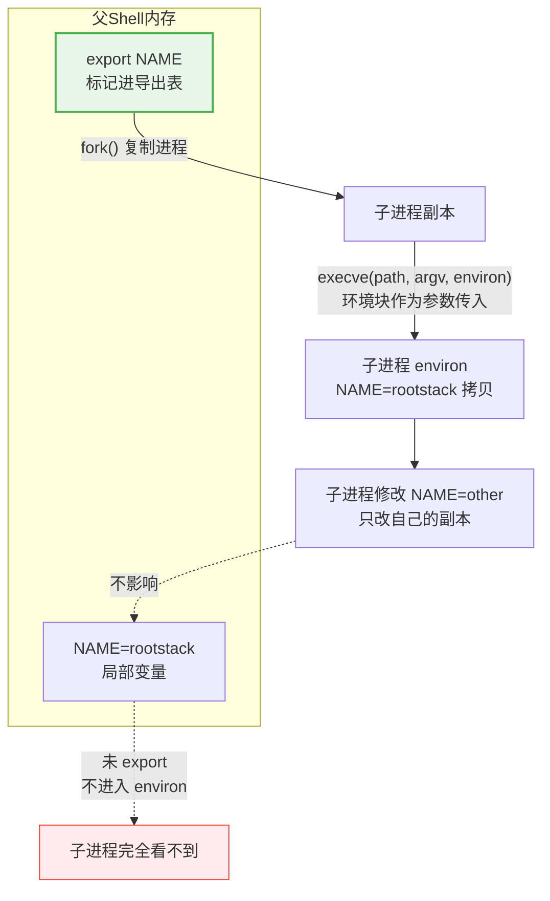
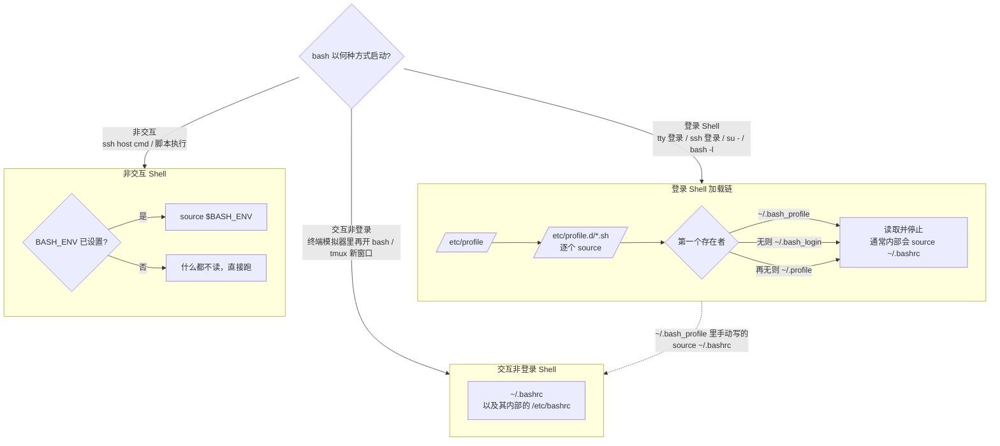
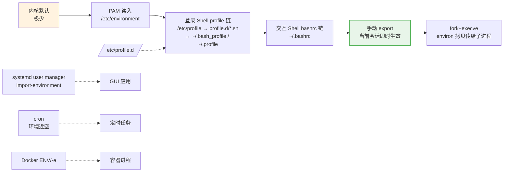

# 07 - PATH 深入与环境变量全书

> 本章是 [[06-命令行基础与Shell入门|第 6 章]] 中 6.8 环境变量（基础）一节的完整展开；快速查阅配套 → [[resources/环境变量速查|环境变量速查卡]]
> 定位说明：本章**不是概念介绍**，而是"我知道要改什么，但不知道怎么改、改了不生效、生效了又影响别处"的实操手册。每一节都围绕真实故障场景展开。

---

## 7.1 export 本质：变量如何进入子进程

### 7.1.1 一个常见误解

很多人以为 `export` 是"创建变量"。错。`export` 做的事情是：把一个**已经存在于当前 Shell 内存中**的变量，标记为"导出"，使其在后续 `fork + execve` 出来的子进程的环境块（environ）中出现一份拷贝。

```bash
NAME="rootstack"      # 创建局部变量，仅当前 Shell 可见
export NAME           # 标记为导出，子进程将能读到
export CITY="Beijing" # 赋值并导出一步完成
```

关键事实：**子进程拿到的是拷贝，不是引用**。子进程里怎么改，父进程都看不见；父进程事后怎么改，已经启动的子进程也看不见。



### 7.1.2 局部变量与 local

- 未 `export` 的变量：只在当前 Shell 进程内可见，子进程（包括脚本、管道右侧的新进程）一律看不到。
- `local VAR=value`：只能在**函数体内**使用，函数返回即销毁，比普通局部变量生命周期还短。
- 脚本里定义的变量不会"泄漏回"调用它的交互 Shell——因为脚本是子进程。

```bash
demo() {
    local inner="只在函数内"
    outer="函数内赋值但没加local"
}
demo
echo "$inner / $outer"   # 输出 "  / 函数内赋值但没加local"：local 已销毁，未加 local 的泄漏到全局了
```

### 7.1.3 env -i：从零开始理解继承链

`env -i bash` 启动一个**几乎没有任何环境变量**的 bash。用它做实验，你能清楚看到哪些行为依赖哪些变量：

```bash
env -i bash
echo $PATH        # 空！外部命令全部 command not found
export PATH=/usr/bin:/bin && ls   # 手动补上 PATH 后恢复
```

结论：环境不是凭空存在的，是一条**继承链**：内核默认 → PAM → profile 链 → bashrc 链 → 你手动 export。链条上任何一环断了，下游就缺东西。7.9 节的排查方法全部基于这个模型。

### 7.1.4 取消导出与 declare 视角

```bash
export -n NAME     # 取消导出，但变量还在当前 Shell 里
unset NAME         # 彻底删除变量

declare -p NAME    # 查看属性：declare -x NAME=... 的 -x 即已导出标记
export -p          # 列出所有已导出变量，等价于 env 但格式更精确
```

记住 `declare -x` 这个视角：`export NAME` 本质就是 `declare -x NAME`。zsh 用户注意语法略有差异（`typeset -x`）。

---

## 7.2 PATH 搜索机制深入

### 7.2.1 冒号分隔，顺序查找，先到先得

PATH 是冒号分隔的目录列表。执行一个外部命令时，Shell 从左到右逐个目录找同名可执行文件，**找到第一个就停**。

```bash
echo $PATH   # /home/a/.local/bin:/usr/local/bin:/usr/bin:/bin:/usr/sbin:/sbin
PATH="$HOME/.local/bin:$PATH"   # 前插：优先级最高
PATH="$PATH:$HOME/bin"          # 追加：优先级最低
```

推论：如果两个目录里都有 `python`，排在前面的赢。这是覆盖系统命令的原理，也是很多诡异问题的根源。

### 7.2.2 which / type / command -v / whereis 对照表

| 命令 | 找什么 | 能识别 alias | 能识别内建 | 能识别函数 | 是否受 hash 影响 |
|------|--------|:---:|:---:|:---:|:---:|
| `which` | 只搜 PATH 中的外部可执行文件 | 否 | 否 | 否 | 是 |
| `type` | alias / 函数 / 内建 / 关键字 / PATH 文件，全类型 | **是** | **是** | **是** | 是 |
| `command -v` | 同 type 的查找逻辑，但输出干净适合脚本 | 是 | 是 | 是 | 是 |
| `whereis` | 二进制 + 手册页 + 源码位置，搜固定路径 | 否 | 否 | 否 | 否 |

实操建议：`type -a python` 列出所有命中项按优先级排序（排查覆盖问题必用）；脚本里判断命令存在用 `if command -v docker >/dev/null; then ...`；`whereis nginx` 找二进制+配置+手册。

`which` 的最大陷阱：你明明设了 alias `ll`，`which ll` 却说找不到——因为它根本不看 alias。**排查"我的命令到底执行的是哪个"，永远先 `type -a`。**

### 7.2.3 hash 缓存机制

为避免每次执行命令都遍历整个 PATH，bash 会把"命令名 → 完整路径"缓存进一张 hash 表：

```bash
hash                 # 查看缓存表
# hits    command
#   12    /usr/bin/ls
#    3    /usr/bin/vim

hash -r              # 清空整张表
hash -d ls           # 只删某一条
```

由此产生两个经典现象：

1. **新装程序找不到或执行旧的**：升级替换了 `/usr/bin/foo` 的位置后，bash 可能仍按缓存的旧路径执行，直到 `hash -r`。
2. **新装程序首次执行变慢一点点**：第一次要全 PATH 搜索，之后命中缓存。

脚本场景几乎不用管 hash，交互排查看不懂行为时先 `hash -r` 再试。

### 7.2.4 把 ~/.local/bin 放最前：用法与风险

`pip install --user` 会把可执行文件装进 `~/.local/bin`，发行版通常已在 `~/.profile` 里把该目录前插进 PATH。实例演示覆盖效果：

```bash
pip install --user pipenv
hash -r && which python    # ~/.local/bin 下若有 python 包装器，它就赢了 /usr/bin/python
type -a python             # 立刻确认所有候选和实际优先级
```

风险：前插的目录里任何同名文件都会劫持系统命令。只往自己的 `~/.local/bin` 放自己了解的东西；第三方工具要求你 `export PATH=/opt/xxx/bin:$PATH` 前，先看一眼那个目录里有什么。

### 7.2.5 安全红线：不要把 . 加入 PATH

**永远不要执行 `PATH=$PATH:.`**，尤其是 root。

原理一句话：攻击者在你常去的目录（如 `/tmp`）放一个名为 `ls` 的木马脚本，你 cd 进去随手敲 `ls`，执行的就不是 `/bin/ls` 而是木马。root 场景下这就是提权后门。

另一个隐蔽陷阱：**空 PATH 段**。`PATH=:xxx` 或 `PATH=xxx:` 中间的空段等价于"当前目录"：

```bash
PATH="/usr/bin:/bin"
PATH=":$PATH"      # 开头多了个冒号 → 第一段为空 → 当前目录被隐式搜索！危险
```

写拼接逻辑时务必防御空段，或干脆避免程序化拼 PATH 时引入空串。

---

## 7.3 配置文件加载链

### 7.3.1 三种 Shell，三条加载路径

同一个 bash，启动方式不同，读的配置文件完全不同。"改了 .bashrc 不生效"九成是因为搞错了自己处在哪条路径上。



记忆要点：

- **登录 Shell 不读 `.bashrc`**——除非你的 `.bash_profile` 自己去 source 它（Ubuntu 的 `.profile` 默认没有这一步，Debian 的骨架文件有条件 source）。
- **`ssh host command` 是非交互、非登录 Shell**：`.bashrc` 和 `.profile` 通常都不读（详见 7.9 经典故障表）。
- **cron 更绝**：连 bash 都不一定起，环境近乎全空（见 7.9）。

### 7.3.2 su 与 su - 差异

```bash
su user          # 切换用户，保留当前环境（PATH 还是 root 的旧 PATH，危险且混乱）
su - user        # 登录 Shell：重走完整登录链，环境干净符合 user 本人预期
sudo -i          # 等价 su - root 的现代写法
sudo -s          # 非 login shell 的 root 交互 Shell，读 .bashrc 不读 profile
```

经验法则：需要"变成另一个人工作"就用带 `-` 的形式，否则你会遇到"为什么这个用户的命令在我这里找不到"的 PATH 错乱。

### 7.3.3 source vs 执行脚本

```bash
./setenv.sh      # 子进程执行：里面 export 的变量随子进程退出而消失，对当前 Shell 无效
source setenv.sh # 当前 Shell 内展开执行：export 生效于当前 Shell（. setenv.sh 为 POSIX 写法）
```

这就是为什么激活类脚本必须 `source venv/bin/activate` 而不能直接执行——它要修改的是**你当前这个 Shell 进程**的 PATH。

### 7.3.4 该放哪个文件？结论表

| 内容 | 推荐位置 | 原因 |
|------|----------|------|
| umask | `~/.profile` 或 `/etc/profile`（系统级） | umask 对非交互子 Shell 继承即可生效，放 rc 里对登录链反而可能漏 |
| 别名 alias | `~/.bashrc` | 只有交互 Shell 需要 alias，脚本里 alias 默认不展开 |
| PATH 修改 | `~/.profile`（登录一次设置）或 `~/.bashrc`（防嵌套重复需判断去重） | 见下方防重复写法 |
| 交互体验类（提示符、补全、HISTCONTROL） | `~/.bashrc` | 纯交互特性 |
| 全局所有用户 | `/etc/profile.d/xxx.sh` | 见 7.4 |

PATH 前插防重复的标准写法（每次嵌套开 Shell 都会重新读 rc，不判重会导致 PATH 越来越长）：

```bash
case ":$PATH:" in
    *":$HOME/.local/bin:"*) ;;
    *) PATH="$HOME/.local/bin:$PATH" ;;
esac
```

---

## 7.4 系统级配置机制

### 7.4.1 /etc/environment

- 由 **PAM**（具体是 pam_env 模块）在读登录时读入，**不是 shell 配置**。
- 格式严格受限：只有 `KEY=value` 纯赋值，**不能写 shell 语法**——没有 export、没有 `$VAR` 引用展开（部分实现支持有限引用）、没有 if。
- 因为走 PAM，所以 **GUI 会话也生效**：图形登录管理器同样经过 PAM，从这里拿到的变量会被桌面环境和从菜单启动的所有应用继承。

```bash
# /etc/environment 示例
JAVA_HOME="/opt/jdk-21"
EDITOR=vim
# 错误示例：export JAVA_HOME=... 或 PATH=$JAVA_HOME/bin:$PATH 在这里统统无效（无 export 语法、不做展开）
```

适用场景：想给"包括 GUI 应用在内的所有人"设置固定变量。不适用：任何需要计算、拼接的值。

### 7.4.2 /etc/profile.d/ 目录惯例

系统级 shell 变量的标准做法：每个功能一个独立 `.sh` 文件，而不是直接改 `/etc/profile`。

```bash
# /etc/profile.d/java.sh
export JAVA_HOME=/opt/jdk-21
export PATH=$JAVA_HOME/bin:$PATH
```

好处：包管理器升级时不会与你手改的 `/etc/profile` 冲突；卸载某个功能只需删对应文件；文件必须是 `.sh` 结尾才会被加载循环拾取。注意该目录只服务**登录 Shell**，GUI 应用不经过它。

### 7.4.3 systemd 用户会话环境

经典问题：在终端里 `export HTTP_PROXY=...` 后，从应用菜单/桌面图标点开的 GUI 应用**看不到**。原因：GUI 应用由 systemd 用户实例或 dbus activation 拉起，它们的环境来自 systemd 用户管理器，而不是你的终端进程。

解法（二选一，改完注销重登或重启用户实例）：`systemctl --user import-environment PATH HTTP_PROXY` 或 `dbus-update-activation-environment --systemd HTTP_PROXY`。

一句话总结：**终端的 export 到不了 GUI 世界，中间隔着 systemd user manager 这堵墙，上面两条命令就是凿墙工具。**

---

## 7.5 实战：开发工具链变量

### 7.5.1 JAVA_HOME

为什么需要：Maven、Gradle、Tomcat、多数 IDE 都显式寻找 `JAVA_HOME`，而不是简单依赖 PATH 里的 java。

稳妥写法——动态取值，避免 JDK 升级换目录后忘改：

```bash
# 用 alternatives 体系反查真实路径（RHEL/Debian 系通用思路）
export JAVA_HOME=$(readlink -f $(which java) | sed 's|/bin/java||')
```

或者指向固定安装目录（企业更常见，配合版本化目录名便于多版本切换），写入 `~/.profile` 或 `/etc/profile.d/java.sh`。Java 全栈视角的完整环境话题 → [[java/java目录|Java 教程]]

### 7.5.2 GOPATH / GOROOT 还重要吗

Go modules（Go 1.16+ 默认开启）时代：

- `GOROOT`：**不需要设置**。Go 二进制自带推导，设错了反而坏事。
- `GOPATH`：模块缓存和 `go install` 的 bin 目录仍默认在 `~/go`。若自定义，真正需要的只是把 `$GOPATH/bin`（或 `~/go/bin`）加进 PATH，否则 `go install` 装的工具找不到。
- 项目代码放哪都行，不再必须放 `$GOPATH/src`。

### 7.5.3 Python venv activate 到底做了什么

拆开 `venv/bin/activate` 看，核心就三件事：

```bash
VIRTUAL_ENV="/path/to/venv"; export VIRTUAL_ENV   # 1. 记录虚拟环境位置
PATH="$VIRTUAL_ENV/bin:$PATH"                     # 2. 前插——python/pip 就此被劫持为 venv 版
PS1="(venv) $PS1"                                 # 3. 改提示符做视觉提醒
```

`deactivate` 为什么是"函数"而不是命令：因为它要**还原调用方 Shell 的 PATH 和 PS1**——只有函数能在当前进程内做到这一点，外部命令（子进程）改完就丢。这也解释了为什么 deactivate 必须由 activate 注入，且换了个 Shell 就不存在。

### 7.5.4 nvm 的 PATH 切换原理

`nvm` 不是二进制，是一个几百行的 **shell 函数**（所以必须 source 进你的 bashrc）。`nvm use 20` 做的事：把 `$NVM_DIR/versions/node/v20.x.x/bin` **前插**到 PATH，同时把其他 node 版本的 bin 从 PATH 里移出去，并设置 `NVM_BIN`、`NVM_INC` 等辅助变量。

理解了"切版本 = 改 PATH 前插段"，你就明白：nvm 切换只对当前 Shell 生效；crontab、systemd 服务里永远不要指望 nvm 环境，直接写绝对路径。

### 7.5.5 RUSTUP_HOME / CARGO_HOME

rustup 安装时若想把所有东西放到数据盘：

```bash
export RUSTUP_HOME=/data/rustup CARGO_HOME=/data/cargo   # 工具链与 cargo 缓存的存放处
# 并确保 $CARGO_HOME/bin 在 PATH 中，否则 rustc/cargo 装完找不到
```

必须在**运行 rustup init 之前**设置好，安装器按当时的值落盘。

### 7.5.6 其他一句带过

- `ANDROID_HOME`（旧称 `ANDROID_SDK_ROOT`）：sdkmanager/gradle 找 SDK 的标准入口，配 `$ANDROID_HOME/platform-tools` 进 PATH。
- `JAVA_TOOL_OPTIONS`：给所有 JVM 进程统一追加参数（如 `-Dfile.encoding=UTF-8`），JVM 启动时会打印 "Picked up JAVA_TOOL_OPTIONS"。

---

## 7.6 实战：系统行为变量

### 7.6.1 代理变量族

| 变量 | 作用域 |
|------|--------|
| `http_proxy` | HTTP 流量 |
| `https_proxy` | HTTPS（CONNECT 隧道） |
| `all_proxy` | 兜底，含 socks5:// 场景 |
| `no_proxy` | 直连例外列表，逗号分隔，可用 `.example.com` 后缀匹配 |

大小写之谜：**curl 系读小写，wget 传统上读大写**（历史原因，wget 起源于环境变量习惯大写的时代，后来两者都兼容）。生产做法是大小写都设：

```bash
export http_proxy=http://127.0.0.1:7890 https_proxy=http://127.0.0.1:7890 \
       HTTP_PROXY=$http_proxy HTTPS_PROXY=$https_proxy \
       all_proxy=socks5://127.0.0.1:7890 no_proxy=localhost,127.0.0.1,.internal.corp
```

哪些程序根本不理会这些变量：不走 libc 标准 socket 封装的程序、静态编译的二进制、很多 Go/Rust 编写的 CLI（各自实现代理逻辑）、以及一切 DNS 解析（代理想接管 DNS 得靠别的手段）。此时用 **proxychains**：它的原理是通过 `LD_PRELOAD` 注入动态链接库，拦截 `connect()` 等 libc 调用强制走代理——所以对静态链接程序无效。

### 7.6.2 locale 族：LANG / LC_ALL / LC_*

locale 控制"语言、编码、日期格式、数字格式、排序规则"。优先级从高到低：

```text
LC_ALL  >  LC_<分类>  >  LANG
```

`LC_ALL` 是最强覆盖，专为"一票否决"设计，正常只在排障时临时使用；日常应设 `LANG` 再按需微调单个 `LC_*`。

`locale` 命令输出逐行解释：

```bash
$ locale
LANG=zh_CN.UTF-8              # 兜底默认值
LC_CTYPE="zh_CN.UTF-8"        # 字符分类与编码——影响正则、大小写转换
LC_NUMERIC="zh_CN.UTF-8"      # 数字格式（小数点符号）
LC_TIME="zh_CN.UTF-8"         # 日期时间格式
LC_COLLATE="zh_CN.UTF-8"      # 排序规则——影响 sort 和 glob 范围表达式
LC_MONETARY="zh_CN.UTF-8"     # 货币格式
LC_MESSAGES="zh_CN.UTF-8"     # 程序消息语言
# LC_PAPER / LC_NAME / LC_ADDRESS / LC_TELEPHONE / LC_MEASUREMENT / LC_IDENTIFICATION 同为 zh_CN.UTF-8，从略
LC_ALL=                       # 空 = 未强制覆盖，正常状态
```

常用操作：`locale -a` 列出已生成的 locale；`sudo locale-gen zh_CN.UTF-8` 在 Debian/Ubuntu 生成中文 locale；`sudo localectl set-locale LANG=zh_CN.UTF-8` 是 systemd 发行版的正规入口。

`C` locale（等价 `POSIX`）是什么场景：最小、纯 ASCII、不做任何本地化。典型用途：脚本里 `LC_ALL=C sort` 获得稳定字节序排序（快且跨机器一致）；解析英文报错输出时 `LC_ALL=C` 临时切回英文方便搜索。

### 7.6.3 EDITOR / VISUAL / PAGER / TMPDIR

- `VISUAL`（全屏编辑器）优先于 `EDITOR`（行编辑兜底），`crontab -e`、`git commit`、`less` 的 v 键都遵循这套约定，现代实践两者设同一个值。
- `PAGER` 被 git diff/log 等大量工具尊重；`MANPAGER` 专门给 man 用（man 页含退格粗体转义，随便换分页器会乱码，所以单独留一个变量）。
- `TMPDIR`：多数程序遵守它决定临时目录，否则回落 `/tmp`。`/tmp` 是 tmpfs 占内存或需要大文件中转时设置它，比改程序配置通用得多。

---

## 7.7 实战：密钥与安全变量

### 7.7.1 API_KEY 存放原则

原则三条：

1. **绝不硬编码**进脚本本体——脚本会进 git、会被复制、会在演示时投屏。
2. 密钥放 `.env` 类文件，**加入 `.gitignore`**，权限收紧：

```bash
cat > ~/.config/myapp.env <<'EOF'
API_KEY=sk-xxxxxxxx
EOF
chmod 600 ~/.config/myapp.env
# 脚本开头：set -a; source ~/.config/myapp.env; set +a —— set -a 让 source 进来的变量自动带上导出标记
```

3. 警惕 **shell history 泄漏**：`export API_KEY=sk-xxx` 直接敲在命令行会被记进 `~/.bash_history`。两种防护：

```bash
export HISTCONTROL=ignorespace    # 空格开头的命令不入历史
 export API_KEY=sk-xxx            # 注意行首有一个空格
history | tail                    # 验证上一条不在其中
```

按目录自动加载密钥的现代方案是 **direnv**：在项目目录放 `.envrc`（内容 `export API_KEY=...`，同样 gitignore），cd 进来自动加载、离开自动卸载，`direnv allow` 显式授权防误执行。

### 7.7.2 SSH_AUTH_SOCK 与 agent forwarding

`ssh-agent` 把私钥留在本机内存，签名请求发给 agent。`SSH_AUTH_SOCK` 就是"agent 的 Unix socket 地址"——任何进程只要继承了这个变量，就能请求本机 agent 代为签名。

Agent forwarding（`ssh -A` / `ForwardAgent yes`）的原理：远程机上的 SSH 客户端通过**回传隧道**连接你本地的 `SSH_AUTH_SOCK`，于是你在远程机上 git pull 私有仓库也能用本地密钥，私钥本身从未离开你的电脑。

安全边界一句话：转发期间，远程机的 root 可以复用这条 socket 以你的身份签名认证——**只转发给你信任的机器**，用完即关。

### 7.7.3 GPG_TTY 经典报错修复

gpg 在后台/重定向下签不了名，报 "Inappropriate ioctl for device"，git 提交签名、pass 密码管理器的报错大多源于此。修复一行，放进 `~/.bashrc`：`export GPG_TTY=$(tty)`

### 7.7.4 sudo 的环境重置

sudo 默认执行 `env_reset`：目标进程拿到的是一个白名单化的干净环境，你的 `http_proxy`、`PYTHONPATH` 一概不带过去。这是安全特性，不是 bug。

```bash
sudo cmd          # 干净环境
sudo -E cmd       # 保留当前全部环境——等于把你的环境完整信任给 root 进程，慎用
```

信任边界：`-E` 意味着环境里的一切（包括恶意构造的变量）都以 root 身份生效，只对你完全理解其消费方式的命令使用；白名单细节用 `sudo visudo` 查看 env_reset / env_keep。

### 7.7.5 密钥进 systemd 服务

不要在 unit 文件里明文写密钥（unit 文件常是世界可读的）。标准做法：

```ini
[Service]
EnvironmentFile=/etc/myapp/env    # KEY=value 格式，权限必须 600
ExecStart=/usr/bin/myapp
# 先用 sudo install -m 600 /dev/null /etc/myapp/env 建好权限再填内容
```

---

## 7.8 实战：服务与容器中的环境变量

### 7.8.1 sbin 不在普通用户 PATH 与 secure_path

普通用户 PATH 通常不含 `/usr/sbin`、`/sbin`，所以 `iptables`、`nft`、`useradd` 会报 command not found——这不是没装。而 `sudo iptables` 却能找到：sudoers 里的 **secure_path** 给 sudo 后的命令重置了一条固定的 root PATH：

```bash
sudo grep secure_path /etc/sudoers    # Defaults secure_path="/usr/local/sbin:/usr/local/bin:/usr/sbin:/usr/bin:/sbin:/bin"
```

知道这一点后，"普通用户找不到管理命令"就不再是谜题：要么 sudo 执行，要么绝对路径。

### 7.8.2 systemd Unit 三种注入方式

| 写法 | 作用 | 说明 |
|------|------|------|
| `Environment="KEY=value"` | unit 内联定义 | 明文写在 unit 里，适合非敏感值 |
| `EnvironmentFile=/path/file` | 从文件批量读入 | 敏感值首选，配合 600 权限 |
| `PassEnvironment=KEY1 KEY2` | 从 systemd 系统管理器透传 | 很少用，管理器自身环境里得先有 |

同名字段优先级：`Environment=` 内联 > `EnvironmentFile=`。更多服务管理细节 → [[11-systemd服务管理]]

### 7.8.3 Docker 三层区别

| 机制 | 阶段 | 说明 |
|------|------|------|
| Dockerfile `ENV` | 构建期+运行期固化进镜像 | 镜像的默认值，敏感信息严禁放这（镜像分层可见） |
| `docker run -e KEY=val` | 仅本次容器运行 | 覆盖 ENV |
| `docker run --env-file f` | 仅本次容器运行 | 批量注入，f 不进镜像 |

构建期 vs 运行期是本质区别：`ENV` 是镜像的一部分，`-e` 只属于这次运行的容器实例。容器深入 → [[46-容器技术]]

### 7.8.4 /proc/PID/environ：读取运行中进程环境

每个进程的初始环境块躺在 procfs 里：

```bash
sudo tr '\0' '\n' < /proc/$(pgrep -f mydaemon | head -1)/environ
```

用途：确认守护进程到底带着什么环境跑起来（排查"我明明配了却没用"的终极手段）。同时它是**敏感信息泄漏面**：任何能读该进程 procfs 的用户（通常是同 UID 或 root）都能看到其中的密钥——这也是"密钥别放太宽泛的位置"的又一个理由。

---

## 7.9 调试与排查

### 7.9.1 五种查看方式差异表

| 方式 | 范围 | 输出形式 | 备注 |
|------|------|----------|------|
| `env` | 仅已导出变量 | `KEY=value` 每行一条 | 不含未导出的 Shell 局部变量 |
| `printenv KEY` | 单个/多个已导出变量 | 纯值 | 脚本友好，退出码可用于判断存在性 |
| `set` | **全部**：导出+局部+函数 | 含函数定义 | 信息最全也最吵 |
| `declare -p` | 按名精确查询 | `declare -x KEY=...` 带属性 | 能看出是否导出、是否整数等属性 |
| `export -p` | 仅已导出 | `declare -x` 格式 | 可直接回放重建环境 |

判断口诀：看子进程能拿到什么用 `env`；看当前 Shell 到底有什么用 `set`；查单个变量属性用 `declare -p`。

### 7.9.2 对比差异定位配置污染

对比"正常环境"与"纯净环境"，找出你的配置到底注入了什么：

```bash
# 思路：以纯净登录环境为基准做差集，锁定是哪一层注入的变量
comm -23 <(env | sort) <(env -i bash -lc 'env' | sort)
```

实战中更常用的形态是：怀疑某个变量来源不明时，分别在 `bash --norc`、`bash -l`、完整环境中各打一次 `env | sort` 存档后 diff，即可锁定是哪一层注入的。

### 7.9.3 跟踪加载过程

```bash
bash -xlc 'exit' 2>&1 | grep -E '^\+ (source|\.)'   # 看登录链依次读了哪些文件
bash --norc --noprofile                              # 干净启动测试：排除自身配置干扰
strace -e openat -f bash -lc 'true' 2>&1 | grep -E 'profile|bashrc|environment'
```

`--norc --noprofile` 是"是不是我配置的问题"的第一测试：干净环境下正常、加上配置就坏，问题就在配置里，再用 `-x` 二分定位。

### 7.9.4 经典故障速查表

| 故障现象 | 根因 | 解决 |
|----------|------|------|
| cron 任务里 `command not found` / 行为异常 | cron 不读 `.bashrc`/`.profile`，PATH 近乎全空（常为 `/usr/bin:/bin`） | 脚本内显式 `source` 所需 env；或 crontab 顶部声明 `PATH=...`；或全部使用绝对路径 |
| `ssh host cmd` 里变量缺失 | 远程执行走非交互非登录 Shell，profile 链不加载 | 命令里显式 source；或把变量放 `/etc/environment`；或在 `.bashrc` 顶部提前放置（见下条） |
| scp/rsync 突然失败，输出混杂奇怪文本 | `.bashrc` 顶部 `[ -z "$PS1" ] && return` 之前有 echo/输出语句，污染了非交互会话的协议流 | 保证非交互路径上零输出；调试语句移到 return 之后 |
| GUI 启动的应用看不到终端 export 的变量 | GUI 应用由 systemd user manager / dbus 拉起，不经终端环境 | `systemctl --user import-environment` 或 dbus-update（见 7.4.3）后重登 |
| sudo 后 http_proxy 失效 | sudo env_reset 重置环境 | `sudo -E`（谨慎）或 sudoers `env_keep += "http_proxy"` |
| 新装/升级命令执行的还是旧行为 | hash 缓存指向旧路径 | `hash -r` |
| gpg 签名报 Inappropriate ioctl | GPG_TTY 未设置 | `export GPG_TTY=$(tty)` 写入 bashrc |

---

## 7.10 总结

一个变量从哪里来——完整的来源链思维导图：



排查任何环境问题的万能三问：

1. 这个进程是谁拉起的？（决定走了哪条加载链）
2. `tr '\0' '\n' < /proc/PID/environ` 看它实际拿到了什么？
3. 差异在哪一层注入的？回到对应的配置文件修。

延伸阅读：[[18-Bash编程基础]] 脚本变量高级用法、[[10-进程管理]] fork/exec 机制细节、[[resources/环境变量速查|环境变量速查卡]] 随手查。
