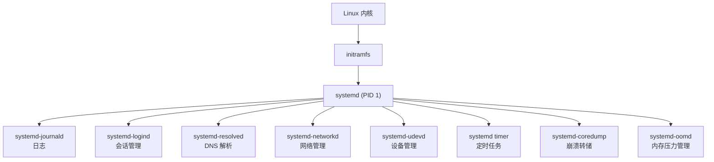

# 09 - systemd 服务管理

> systemd 是现代 Linux 发行版的事实标准初始化系统，作为 PID 1 运行，负责启动、管理并监督系统中的所有服务。本章从基础到进阶，覆盖 systemd 的完整使用体系。

---

## 9.1 systemd 是什么

systemd 是内核启动后执行的第一个用户空间进程（PID 1），它的核心职责是：

- **系统初始化**：按依赖关系并行启动所有系统服务
- **服务监督**：监控服务运行状态，支持自动重启
- **资源管理**：通过 cgroup v2 对服务进行 CPU、内存、IO 限制
- **日志系统**：journald 统一收集所有服务的输出
- **定时任务**：systemd timer 替代传统 cron

几乎所有主流发行版均已采用 systemd：Debian/Ubuntu（2015 年起）、Fedora/RHEL（2011 年起）、Arch Linux（2012 年起）、openSUSE（2011 年起）。



**systemd 组件一览：**

| 组件 | 守护进程 | 职责 |
|------|----------|------|
| PID 1 | `systemd` | 系统与服务管理器 |
| 日志 | `systemd-journald` | 二进制日志收集与存储 |
| 会话 | `systemd-logind` | 用户登录与会话管理 |
| DNS | `systemd-resolved` | 域名解析缓存 |
| 网络 | `systemd-networkd` | 网络接口配置 |
| 设备 | `systemd-udevd` | 设备热插拔管理 |
| 临时文件 | `systemd-tmpfiles` | 临时目录创建与清理 |
| 用户创建 | `systemd-sysusers` | 声明式系统用户管理 |
| 容器 | `systemd-nspawn` | 轻量级容器（增强 chroot） |
| 引导 | `systemd-boot` | UEFI 引导管理器 |
| 崩溃 | `systemd-coredump` | 核心转储收集与查询 |
| 内存 | `systemd-oomd` | OOM 守护进程 |

---

## 9.2 systemctl 基本操作

`systemctl` 是管理 systemd 系统和服务的主要命令。

```bash
# --- 服务启停 ---
sudo systemctl start nginx.service # 启动
sudo systemctl stop nginx.service # 停止
sudo systemctl restart nginx.service # 重启
sudo systemctl reload nginx.service # 重载配置（不中断服务）
sudo systemctl try-restart nginx.service # 仅在已运行时重启

# --- 开机自启 ---
sudo systemctl enable nginx.service # 设为开机自启
sudo systemctl disable nginx.service # 取消开机自启
sudo systemctl enable --now nginx # 启用并立即启动
sudo systemctl disable --now nginx # 禁用并立即停止

# --- 状态查询 ---
systemctl status nginx.service # 完整状态（推荐）
systemctl is-active nginx.service # 是否正在运行
systemctl is-enabled nginx.service # 是否开机自启
systemctl is-failed nginx.service # 是否处于失败状态

# --- 列出 Unit ---
systemctl list-units # 列出所有已加载的 Unit
systemctl list-units --type=service # 只列 service 类型
systemctl list-units --type=service --state=running # 正在运行的
systemctl list-units --failed # 处于失败状态的

# --- 列出 Unit 文件（包括未加载的） ---
systemctl list-unit-files
systemctl list-unit-files --type=service
```

### mask 与 unmask

`mask` 比 `disable` 更强硬——它将 Unit 链接到 `/dev/null`，使其完全无法启动（包括作为依赖被间接拉起）：

```bash
sudo systemctl mask NetworkManager.service
# 等价于: ln -s /dev/null /etc/systemd/system/NetworkManager.service

sudo systemctl unmask NetworkManager.service # 取消屏蔽
```

### 辅助命令

```bash
# 查看 Unit 文件完整内容（含所有 drop-in 覆盖）
systemctl cat nginx.service

# 以机器可读格式查看属性
systemctl show nginx.service
systemctl show -p MainPID nginx.service
systemctl show -p MemoryCurrent nginx.service

# 查看依赖关系
systemctl list-dependencies nginx.service
systemctl list-dependencies --reverse nginx.service
```

---

## 9.3 Unit 文件搜索路径与优先级

systemd 从多个目录加载 Unit 文件，优先级从高到低：

| 优先级 | 路径 | 用途 |
|--------|------|------|
| 1（最高） | `/etc/systemd/system/` | 管理员自定义 |
| 2 | `/run/systemd/system/` | 运行时自动生成 |
| 3（最低） | `/usr/lib/systemd/system/` | 软件包安装的默认配置 |

用户级 Unit 文件路径（`systemctl --user`）：

| 优先级 | 路径 |
|--------|------|
| 1 | `~/.config/systemd/user/` |
| 2 | `/etc/systemd/user/` |
| 3 | `/usr/lib/systemd/user/` |

**规则**：同名 Unit 文件，高优先级目录的版本会覆盖低优先级。例如，如果你在 `/etc/systemd/system/nginx.service` 中放置了修改版，它将替代 `/usr/lib/systemd/system/` 中软件包自带的版本。

---

## 9.4 Unit 类型详解

| 类型 | 后缀 | 说明 |
|------|------|------|
| service | `.service` | 系统服务或守护进程 |
| socket | `.socket` | IPC 套接字、网络端口，支持按需启动 |
| target | `.target` | 一组 Unit 的同步点（替代 SysV runlevel） |
| timer | `.timer` | 定时触发任务（替代 cron） |
| mount | `.mount` | 文件系统挂载点 |
| automount | `.automount` | 按需自动挂载 |
| device | `.device` | 硬件设备（由 udev 自动生成） |
| slice | `.slice` | cgroup 资源分组 |
| scope | `.scope` | 外部创建的进程组 |
| swap | `.swap` | 交换分区/文件 |
| path | `.path` | 基于文件系统事件的触发 |

### 常用 Target

Target 是 systemd 的"运行级别"机制，比传统 SysV init 的 runlevel 更灵活：

```bash
# 查看当前默认 target
systemctl get-default

# 设置默认 target
sudo systemctl set-default multi-user.target # 命令行模式
sudo systemctl set-default graphical.target # 图形界面

# 临时切换 target
sudo systemctl isolate multi-user.target
sudo systemctl isolate rescue.target # 救援模式（单用户）
sudo systemctl isolate emergency.target # 紧急模式（最小环境）
```

| Target | 对应功能 | 类似 SysV |
|--------|----------|-----------|
| `graphical.target` | 完整图形界面 | runlevel 5 |
| `multi-user.target` | 多用户命令行 | runlevel 3 |
| `rescue.target` | 单用户恢复模式 | runlevel 1 |
| `emergency.target` | 紧急 shell（最小化） | — |
| `poweroff.target` | 关机 | runlevel 0 |
| `reboot.target` | 重启 | runlevel 6 |
| `network-online.target` | 网络已完全就绪 | — |
| `timers.target` | 所有 timer 的汇集点 | — |
| `sockets.target` | 所有 socket 的汇集点 | — |

---

## 9.5 编写 .service 文件

### [Unit] 段——基本信息与依赖

```ini
[Unit]
Description=我的应用程序
Documentation=https://example.com/docs
Documentation=man:myapp(8)

# 继承需在指定 Unit 之后启动
After=network-online.target postgresql.service
Before=nginx.service

# 强依赖：被依赖项失败则本 Unit 也失败
Requires=postgresql.service

# 弱依赖：一起启动，但被依赖项失败不影响本 Unit
Wants=redis.service

# 绑定：被依赖项停止，本 Unit 也停止
BindsTo=dev-sda1.device

# 冲突：不能同时运行
Conflicts=iptables.service

# 条件检查（不满足则跳过，不报错）
ConditionPathExists=/etc/myapp/config.toml
ConditionVirtualization=!container
ConditionMemory=>=2G

# 断言检查（不满足则报错）
AssertPathExists=/usr/bin/myapp

# 启动失败控制
StartLimitIntervalSec=60 # 在此时间窗口内
StartLimitBurst=5 # 最多启动失败次数
StartLimitAction=reboot # 超过后执行的动作

# 失败通知
OnFailure=notify-admin@%n.service
```

### [Service] 段——运行定义

#### Type 参数

| Type | 说明 | 适用场景 |
|------|------|----------|
| `simple` | 默认值，ExecStart 进程即主进程 | 大部分现代服务 (Node.js, Go, Python) |
| `forking` | 传统 daemon：父进程 fork 后退出，子进程持续运行 | 传统 C 程序 (nginx, Apache prefork) |
| `oneshot` | 执行完就退出的一次性任务 | 初始化脚本，配合 `RemainAfterExit=yes` |
| `notify` | 服务通过 `sd_notify()` 告知 systemd 已就绪 | 支持 systemd 通知协议的服务 |
| `dbus` | 服务在 D-Bus 上注册名称后算就绪 | D-Bus 激活服务 |
| `idle` | 等待所有作业完成后才启动 | 延迟到系统空闲 |
| `exec` | 类似 simple，但 `exec()` 成功才算启动 | 需确认二进制可用 |

```ini
[Service]
Type=simple # 服务类型
User=myapp # 运行用户
Group=myapp # 运行组
DynamicUser=yes # 动态创建临时用户（更安全）
WorkingDirectory=/opt/myapp # 工作目录

# 启动/停止/重载命令
ExecStart=/usr/bin/myapp serve --config /etc/myapp/config.toml
ExecStop=/bin/kill -s SIGTERM $MAINPID
ExecReload=/bin/kill -s SIGHUP $MAINPID

# 启动前/后
ExecStartPre=/usr/bin/myapp --validate-config
ExecStartPost=/usr/local/bin/notify-ready.sh

# 超时
TimeoutStartSec=30
TimeoutStopSec=30

# 重启策略
Restart=on-failure # 仅异常退出时重启
RestartSec=5 # 重启前等待 5 秒
# 可选值: no, on-success, on-failure, on-abnormal, on-watchdog, on-abort, always

# 看门狗（需服务周期性调用 sd_notify(WATCHDOG=1)）
WatchdogSec=30

# 环境变量
Environment=NODE_ENV=production
EnvironmentFile=/etc/myapp/env # 从文件加载

# 标准输出/错误
StandardOutput=journal
StandardError=journal

# 资源限制
LimitNOFILE=65536 # 文件描述符上限
LimitNPROC=4096 # 进程数上限

# PID 文件（Type=forking 时必需）
PIDFile=/run/myapp.pid

# 退出时清理 IPC 资源
RemoveIPC=yes
```

### [Install] 段——安装行为

```ini
[Install]
WantedBy=multi-user.target # 被哪个 target 间接拉入
RequiredBy=critical-app.target # 强依赖版本（少用）
Alias=myapp.service # 别名
Also=myapp-worker.service # 同时启用的相关 Unit
```

### 完整示例

```ini
# /etc/systemd/system/myapp.service
[Unit]
Description=My Web Application
After=network-online.target postgresql.service
Wants=network-online.target
Requires=postgresql.service

[Service]
Type=simple
User=myapp
Group=myapp
DynamicUser=yes
WorkingDirectory=/opt/myapp
ExecStart=/usr/bin/myapp serve
ExecReload=/bin/kill -SIGHUP $MAINPID
Restart=on-failure
RestartSec=5
LimitNOFILE=65536
Environment=MYAPP_ENV=production
StandardOutput=journal
StandardError=journal

# 安全加固
NoNewPrivileges=yes
PrivateTmp=yes
ProtectSystem=strict
ProtectHome=yes
ReadWritePaths=/var/lib/myapp

[Install]
WantedBy=multi-user.target
```

### Type=forking 示例（传统守护进程）

```ini
# /etc/systemd/system/legacy-app.service
[Unit]
Description=Legacy Forking Application
After=network.target

[Service]
Type=forking
PIDFile=/run/legacy-app.pid
ExecStart=/usr/sbin/legacy-app --daemon
ExecReload=/bin/kill -HUP $MAINPID
Restart=on-failure

[Install]
WantedBy=multi-user.target
```

### Type=oneshot 示例（一次性任务）

```ini
# /etc/systemd/system/startup-task.service
[Unit]
Description=Run Once After Boot

[Service]
Type=oneshot
RemainAfterExit=yes # 退出后仍视为 active
ExecStart=/usr/local/bin/init.sh
ExecStop=/usr/local/bin/cleanup.sh

[Install]
WantedBy=multi-user.target
```

---

## 9.6 重载与 Drop-in 覆盖

修改 Unit 文件后必须重载：

```bash
sudo systemctl daemon-reload # 重新读取所有 Unit 文件
```

**Drop-in 覆盖**（推荐方式，不修改软件包源文件）：

```bash
# 创建覆盖文件
sudo systemctl edit nginx.service
# 这会创建 /etc/systemd/system/nginx.service.d/override.conf

# 编辑完整 Unit（创建副本，完全替换源文件）
sudo systemctl edit --full nginx.service

# 为不存在的 Unit 新建
sudo systemctl edit --force --full my-new-service.service
```

Drop-in 覆盖示例（只覆盖资源限制）：

```ini
# /etc/systemd/system/nginx.service.d/override.conf
[Service]
LimitNOFILE=65536
MemoryMax=2G
CPUQuota=200%

[Unit]
After=network-online.target
```

使用 `systemctl cat nginx.service` 可查看所有片段组合后的完整内容。

---

## 9.7 用户级 systemd 服务

以非 root 身份管理用户自己的服务，存储在 `~/.config/systemd/user/`。

```bash
# 用户级命令（不加 sudo，使用 --user）
systemctl --user daemon-reload
systemctl --user status myapp.service
systemctl --user enable --now myapp.service
systemctl --user start myapp.service

# 查看用户实例日志
journalctl --user -u myapp.service
```

```ini
# ~/.config/systemd/user/dev-server.service
[Unit]
Description=Development Server

[Service]
Type=simple
WorkingDirectory=%h/projects/myapp
ExecStart=/usr/bin/node server.js
Restart=on-failure
Environment=PORT=3000

[Install]
WantedBy=default.target
```

### enable-linger

默认情况下，用户级 systemd 实例在用户登录时启动、登出时停止。若需在未登录时保持运行：

```bash
sudo loginctl enable-linger alice
# 现在 alice 的服务开机即启动，即使未登录
```

---

## 9.8 journalctl 日志查看

[[14-日志系统]] 中有详尽说明，这里列出最常用的 systemd 日志操作：

```bash
# 查看所有日志
journalctl

# 本次启动日志
journalctl -b

# 上次启动日志
journalctl -b -1

# 列出所有启动记录
journalctl --list-boots

# 按 Unit 过滤
journalctl -u nginx.service
journalctl -u nginx.service -u php-fpm.service

# 实时跟踪
journalctl -f
journalctl -f -u nginx.service

# 按时间过滤
journalctl --since "2025-01-01 00:00:00"
journalctl --since "1 hour ago"
journalctl --since yesterday --until today

# 按优先级
journalctl -p err # 仅错误及以上
journalctl -p warning..err # 警告到错误

# 按进程/用户
journalctl _PID=1234
journalctl _UID=1000

# 内核消息
journalctl -k

# 输出格式
journalctl -o json-pretty # JSON 格式
journalctl -o short-full # 完整时间戳
journalctl -o cat # 仅消息正文

# 磁盘管理
journalctl --disk-usage # 查看占用
sudo journalctl --vacuum-time=30d # 删除 30 天前日志
sudo journalctl --vacuum-size=500M # 限制总大小 500M

# 验证日志完整性
journalctl --verify
```

**持久化配置**——默认日志存于内存 (`/run/log/journal`)，重启丢失。创建目录以持久化：

```bash
sudo mkdir -p /var/log/journal
sudo systemctl restart systemd-journald
```

或在 `/etc/systemd/journald.conf` 中设置：

```ini
[Journal]
Storage=persistent
Compress=yes
SystemMaxUse=4G
SystemMaxFileSize=128M
MaxRetentionSec=1month
```

---

## 9.9 systemd-analyze 启动分析

```bash
systemd-analyze # 总启动时间
systemd-analyze blame # 各服务启动耗时排行
systemd-analyze critical-chain # 关键路径（阻塞链）
systemd-analyze critical-chain nginx.service # 特定服务的关键链
systemd-analyze plot > boot.svg # SVG 启动时序图

# 安全审计
systemd-analyze security # 所有服务安全评分
systemd-analyze security nginx.service # 特定服务安全评分

# Unit 文件验证
systemd-analyze verify /etc/systemd/system/myapp.service

# 日历表达式验证
systemd-analyze calendar "Mon..Fri *-*-* 08:00:00"
```

---

## 9.10 systemd Timer 定时任务

systemd timer 可替代传统 cron，优势：与 journald 集成日志、支持秒级精度、错过执行可补偿、可设置随机延迟。

[[13-计划任务与自动化]] 中有完整的 cron 和 systemd timer 对比，这里快速示例：

### 单调定时器（相对时间）

```ini
# /etc/systemd/system/backup.timer
[Unit]
Description=Run Backup Every 6 Hours

[Timer]
OnBootSec=15min # 开机后 15 分钟
OnUnitActiveSec=6h # 上次执行后 6 小时
AccuracySec=1min # 触发精度
RandomizedDelaySec=30min # 随机延迟

[Install]
WantedBy=timers.target
```

### 日历定时器（绝对时间）

```ini
# /etc/systemd/system/daily-report.timer
[Unit]
Description=Daily Report at 2:30 AM

[Timer]
OnCalendar=*-*-* 02:30:00
Persistent=true # 错过后补偿执行

[Install]
WantedBy=timers.target
```

**OnCalendar 语法：**

| 表达式 | 含义 |
|--------|------|
| `daily` / `*-*-* 00:00:00` | 每天午夜 |
| `hourly` / `*-*-* *:00:00` | 每小时整点 |
| `Mon *-*-* 09:00:00` | 每周一 9 点 |
| `*-*-01,15 00:00:00` | 每月 1 日和 15 日 |
| `*-*-* *:00/5:00` | 每 5 分钟 |
| `Mon..Fri *-*-* 08..18:00:00` | 工作日 8-18 点，每小时 |
| `weekly` | 每周日零点 |

```bash
# 查看所有 timer
systemctl list-timers
systemctl list-timers --all
```

---

## 9.11 cgroup v2 资源控制

systemd 通过 cgroup v2 精细控制每个服务的资源使用：

```ini
[Service]
# CPU
CPUQuota=150% # 最多使用 1.5 个 CPU 核心
CPUWeight=100 # CPU 权重（默认 100）
CPUAffinity=0-3 # 绑定到 CPU 0-3
AllowedCPUs=0-3 # 限制可用 CPU

# 内存
MemoryMax=4G # 硬限制
MemoryHigh=3G # 软上限（超限后逐步回收）
MemoryLow=512M # 低于此值时优先保护
MemorySwapMax=1G # Swap 上限

# IO
IOWeight=100 # IO 权重
IOReadBandwidthMax=/dev/sda 100M # 读带宽上限
IOWriteBandwidthMax=/dev/sda 50M # 写带宽上限

# 任务数
TasksMax=512 # 最大进程/线程数
```

**运行时修改（无需重启服务）：**

```bash
sudo systemctl set-property nginx.service MemoryMax=8G
sudo systemctl set-property nginx.service CPUQuota=200%

# 查看 cgroup 实时状态
systemd-cgtop
systemd-cgls
```

---

## 9.12 安全沙箱选项

systemd 提供了丰富的安全隔离能力，无需额外安装 AppArmor 或 SELinux 即可增强服务安全性：

```ini
[Service]
# 文件系统隔离
ProtectSystem=strict # / 和 /usr 只读
ProtectHome=yes # /home、/root、/run/user 不可访问
PrivateTmp=yes # 私有 /tmp 和 /var/tmp
ReadWritePaths=/var/lib/myapp # 在白名单之外唯一可写路径
ReadOnlyPaths=/etc/myapp/config # 指定只读路径
InaccessiblePaths=/mnt/secret # 完全不可见

# 权限与能力限制
NoNewPrivileges=yes # 禁止提升权限（最重要）
CapabilityBoundingSet=CAP_NET_BIND_SERVICE # 仅保留绑定特权端口能力
AmbientCapabilities=CAP_NET_BIND_SERVICE

# 命名空间隔离
PrivateNetwork=yes # 独立网络命名空间
PrivateDevices=yes # 私有 /dev（仅基本设备）
PrivateUsers=yes # 独立用户命名空间
PrivateIPC=yes # 独立 IPC 命名空间

# 内核接口保护
ProtectKernelTunables=yes # /proc/sys 只读
ProtectKernelModules=yes # 禁止加载内核模块
ProtectKernelLogs=yes # 禁止读取内核日志
ProtectControlGroups=yes # cgroup 只读
ProtectHostname=yes # 禁止修改主机名
ProtectClock=yes # 禁止修改系统时钟

# 系统调用过滤
SystemCallFilter=@system-service # 允许系统服务常用调用
SystemCallFilter=~@mount @privileged @obsolete # 禁止危险调用
SystemCallArchitectures=native # 仅允许本机架构

# SUID/SGID 限制
RestrictSUIDSGID=yes # 禁止创建 SUID/SGID 文件
RestrictNamespaces=yes # 禁止创建新命名空间
RestrictRealtime=yes # 禁止实时调度
LockPersonality=yes # 锁定进程个性
MemoryDenyWriteExecute=yes # W^X 内存保护
RemoveIPC=yes # 退出时清理 System V IPC

# 地址族限制
RestrictAddressFamilies=AF_INET AF_INET6 AF_UNIX
```

使用安全审计工具检查配置：

```bash
systemd-analyze security nginx.service
# 输出安全评分和改进建议
```

---

## 9.13 Socket 激活——按需启动

Socket 激活允许 systemd 预先监听端口/套接字，当有连接时才启动实际服务进程：

```ini
# /etc/systemd/system/myapp.socket
[Unit]
Description=MyApp Socket

[Socket]
ListenStream=8080 # 监听 TCP 端口
ListenStream=/run/myapp.sock # 监听 Unix 套接字
SocketMode=0660
SocketUser=myapp
SocketGroup=myapp

[Install]
WantedBy=sockets.target
```

```ini
# /etc/systemd/system/myapp.service（不设置 WantedBy）
[Unit]
Description=MyApp Service
Requires=myapp.socket
After=myapp.socket

[Service]
Type=notify # 或 simple
ExecStart=/usr/bin/myapp
NonBlocking=true
# 服务通过 sd_listen_fds() 或 $LISTEN_FDS 获取文件描述符
```

```bash
# 仅启用 socket，不为 service 设开机自启
sudo systemctl enable --now myapp.socket

# 端口由 systemd 监听，首次连接时启动服务
```

---

## 9.14 systemd-run——临时运行

无需编写 Unit 文件，临时创建服务或 scope：

```bash
# 作为后台 service 运行
sudo systemd-run --unit=my-task /usr/local/bin/task.sh

# 作为 scope 运行（前台）
systemd-run --scope --unit=build-session make -j$(nproc)

# 带资源限制
systemd-run --scope -p MemoryMax=2G -p CPUQuota=50% ./heavy-task

# 带安全沙箱
systemd-run --scope -p ProtectHome=yes -p PrivateTmp=yes ./untrusted.sh

# 定时任务（无需 timer 文件）
systemd-run --on-calendar="*-*-* 03:00:00" /usr/local/bin/cleanup.sh

# 用户实例中运行
systemd-run --user --unit=my-task /usr/local/bin/task.sh
```

---

## 9.15 特殊变量与模板 Unit

模板 Unit 文件名包含 `@`，允许同一个 Unit 文件产生多个实例：

```ini
# /etc/systemd/system/myapp@.service
[Unit]
Description=MyApp Instance %i

[Service]
Type=simple
ExecStart=/usr/bin/myapp --instance=%i
```

```bash
sudo systemctl start myapp@worker1.service
sudo systemctl start myapp@worker2.service
```

常用特殊变量：

| 变量 | 含义 |
|------|------|
| `%n` | 完整 Unit 名称 |
| `%p` | Unit 前缀（`@` 之前） |
| `%i` | 实例名（`@` 之后） |
| `%h` | 运行用户家目录 |
| `%H` | 主机名 |
| `%t` | 运行时目录 (`/run` 或 `$XDG_RUNTIME_DIR`) |
| `%S` | 状态目录 (`/var/lib` 或 `~/.local/share`) |
| `%C` | 缓存目录 (`/var/cache` 或 `~/.cache`) |

---

## 9.16 排错与调试

```bash
# 查看失败的服务
systemctl --failed

# 重置失败状态
sudo systemctl reset-failed nginx.service

# 深入服务状态信息
systemctl status -l nginx.service

# 验证 Unit 文件语法
systemd-analyze verify /etc/systemd/system/myapp.service

# 启用 systemd 调试日志
systemd-analyze log-level debug
# 完成调试后恢复
systemd-analyze log-level info

# 跟踪 D-Bus 消息
busctl monitor

# 内核命令行添加调试参数（GRUB 启动时按 e 编辑）
# systemd.log_level=debug systemd.log_target=console
```

---

## 9.17 本章测验

> [!example] 自测题目

> [!question]- 选择题 1：修改 `.service` 文件后需要执行什么命令使其生效？
> - A. `systemctl restart`
> - B. `systemctl daemon-reload`
> - C. `systemctl reload`
> - D. `systemctl refresh`
>
> > [!success]- 点击查看答案
> > **B**。`daemon-reload` 让 systemd 重新读取所有 Unit 文件，识别配置变更。之后还需 `systemctl restart` 重启服务。

> [!question]- 选择题 2：`Wants=` 和 `Requires=` 的核心区别是？
> - A. Wants 先执行，Requires 后执行
> - B. Wants 弱依赖（失败不影响），Requires 强依赖（失败则停）
> - C. 没有区别
> - D. Wants 仅用于 timer
>
> > [!success]- 点击查看答案
> > **B**。Wants 是"希望一起启动"，Requires 是"必须一起成功"。

> [!question]- 选择题 3：Drop-in 覆盖文件默认存放在哪个位置？
> - A. `/etc/systemd/system/[name].service.d/override.conf`
> - B. `/usr/lib/systemd/system/[name].service.d/`
> - C. `/run/systemd/system/`
> - D. `/etc/systemd/system/[name].service`
>
> > [!success]- 点击查看答案
> > **A**。`systemctl edit nginx.service` 默认在 `/etc/systemd/system/nginx.service.d/` 下创建覆盖文件。

> [!question]- 判断题 4：用户级 systemd 服务默认在用户登出后继续运行
>
> > [!success]- 点击查看答案
> > 错误。默认随用户登出而停止。需要 `sudo loginctl enable-linger username` 才能保持运行。

> [!question]- 选择题 5：`systemd-analyze blame` 的作用是？
> - A. 显示失败的 Unit
> - B. 按启动耗时排行列出所有 Unit
> - C. 分析安全漏洞
> - D. 显示运行中服务
>
> > [!success]- 点击查看答案
> > **B**。`blame` 按启动耗时从多到少排序，帮助定位启动瓶颈。

> [!question]- 选择题 6：`Type=oneshot` 适用于什么场景？
> - A. 持续运行的守护进程
> - B. 执行完就退出的一次性任务
> - C. 需要 fork 子进程的服务
> - D. 监听网络端口的服务
>
> > [!success]- 点击查看答案
> > **B**。oneshot 适用于执行完退出的任务，常配合 `RemainAfterExit=yes`。

> [!question]- 判断题 7：`systemctl mask` 比 `systemctl disable` 更强硬，被 mask 的服务即使作为其他服务的依赖也不会被启动
>
> > [!success]- 点击查看答案
> > 正确。mask 将 Unit 链接到 `/dev/null`，使其在任何情况下都无法启动。

> [!question]- 选择题 8：systemd timer 中使错过执行时间后补偿执行的选项是？
> - A. `WakeSystem=yes`
> - B. `Persistent=true`
> - C. `AccuracySec=1ms`
> - D. `RandomizedDelaySec=0`
>
> > [!success]- 点击查看答案
> > **B**。`Persistent=true` 使系统关机期间错过的定时任务在下次启动后补偿执行。

> [!question]- 选择题 9：Unit 文件路径中优先级最高的是？
> - A. `/usr/lib/systemd/system/`
> - B. `/run/systemd/system/`
> - C. `/etc/systemd/system/`
> - D. 三者等价
>
> > [!success]- 点击查看答案
> > **C**。`/etc/systemd/system/` 是管理员目录，优先级最高。

> [!question]- 选择题 10：Socket 激活的主要优势是？
> - A. 提高网络吞吐量
> - B. 服务按需启动，systemd 预先监听端口
> - C. 加速服务启动
> - D. 无需编写 service 文件
>
> > [!success]- 点击查看答案
> > **B**。Socket 激活让 systemd 监听端口，收到连接时才启动实际服务，节省资源。
