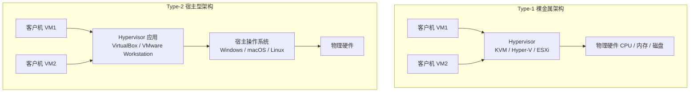
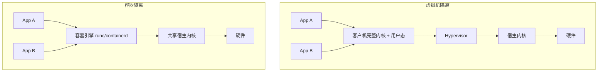
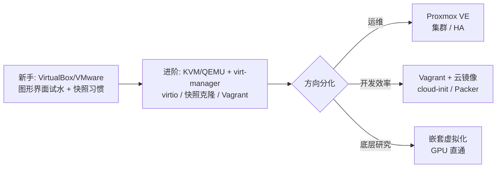

# 09 - 虚拟机配置与打包

虚拟机是学习 Linux、测试软件、隔离风险环境的基石技能。本章覆盖三大宿主操作系统（Windows / macOS / Linux）各自的虚拟机方案，以及如何把配置好的虚拟机打包成可分发的镜像。

---

## 9.1 虚拟化技术全景

### Type-1 与 Type-2 的本质差异

虚拟化层（Hypervisor，也叫 VMM）按运行位置分为两类：

- **Type-1 裸金属型**：Hypervisor 直接跑在硬件上，本身就是"宿主操作系统"。代表：KVM（Linux 内核模块形态）、Hyper-V、ESXi、Xen。
- **Type-2 宿主型**：Hypervisor 作为普通应用程序跑在操作系统之上。代表：VirtualBox、VMware Workstation / Fusion、UTM。



本质差异在**特权级与调度位置**：Type-1 的调度器直接管理所有 vCPU；Type-2 中客户机的线程只是宿主系统的普通进程，由宿主内核统一调度。现代 KVM 比较特殊——它以内核模块形式存在，让 Linux 本身成为 Hypervisor，每个 QEMU 进程就是一个普通进程，兼得两者优点。

### 硬件辅助虚拟化：Intel VT-x / AMD-V

早期纯软件虚拟化靠二进制翻译，性能损耗大。2005 年后 CPU 内置虚拟化指令，让客户机代码大部分直接在 CPU 上执行：

| 技术 | Intel | AMD | 作用 |
|---|---|---|---|
| CPU 虚拟化 | VT-x | AMD-V | 引入 root/non-root 模式 |
| 内存虚拟化 | EPT | NPT/RVI | 二级地址转换，免影子页表 |
| IO 虚拟化 | VT-d | AMD-Vi(IOMMU) | 设备直通给虚拟机 |

Linux 下检查是否开启：

```bash
grep -Ec '(vmx|svm)' /proc/cpuinfo   # 有输出说明 CPU 支持且已启用
# vmx = Intel VT-x, svm = AMD-V
```

Windows 宿主可在 PowerShell 跑 `systeminfo`，尾部"Hyper-V 要求"区段会写明检测结果。

若 `/proc/cpuinfo` 无 vmx/svm 但 CPU 规格支持，进 BIOS/UEFI 找 `Intel Virtualization Technology` 或 `SVM Mode` 开启即可。

### 半虚拟化：virtio 为什么快

全模拟要仿真真实硬件（如 Intel e1000 网卡、SATA 磁盘），每次 IO 都陷入 Hypervisor 模拟寄存器，开销大。**virtio** 是半虚拟化标准：客户机装了专用驱动后，前后端通过共享内存环形队列直接交换数据，大幅减少陷入次数——全模拟路径是"客户机驱动 -> 仿真硬件寄存器 -> QEMU 翻译 -> 宿主 syscall"，而 virtio 路径是"客户机 virtio 驱动 -> 共享内存 ring -> 宿主 QEMU/vhost 直接处理"。结论：**只要客户机支持，磁盘和网卡一律选 virtio**；Windows 客户机需在安装时加载 virtio-win 驱动 ISO。

### 虚拟化 vs 容器的隔离层级



| 维度 | 虚拟机 | 容器 |
|---|---|---|
| 隔离边界 | 内核级（各自独立内核） | 进程级（共享内核，namespace/cgroup） |
| 启动速度 | 数十秒到分钟 | 秒级甚至毫秒 |
| 性能损耗 | 低（virtio 后接近原生） | 几乎为零 |
| 能跑不同内核/系统 | 可以 | 不可以（只能同核或兼容核） |
| 安全强度 | 强（逃逸难度高） | 相对弱（内核漏洞即越界） |

深入对比见 [[46-容器技术|容器技术]]。

### 嵌套虚拟化

嵌套虚拟化 = 在虚拟机里再开虚拟机。默认情况下客户机 CPU 看不到 vmx flag，需要在宿主显式开启：

```bash
# VirtualBox
VBoxManage modifyvm <vm> --nested-hw-virt on

# libvirt:改 XML 后重启生效
virsh edit <vm-name>   # <cpu mode='host-passthrough'/>

# 验证(在客户机内执行,输出大于 0 即成功)
grep -c vmx /proc/cpuinfo
```

典型用途：在云主机里搭 KVM 实验、CI 里跑容器、安全研究沙箱。

---

## 9.2 创建与配置虚拟机

### VirtualBox 全流程

新建虚拟机向导的关键决策点：

**CPU / 内存经验值**：

| 用途 | vCPU | 内存 | 磁盘 |
|---|---|---|---|
| Linux 服务器（无桌面） | 2 核起步 | 2 GB | 20 GB |
| Linux 桌面环境 | 4 核 | 4 GB | 30 GB+ |
| 轻量桌面（XFCE/LXQt） | 2 核 | 2 GB | 20 GB |
| 编译/开发重型项目 | 4-8 核 | 8 GB+ | 50 GB+ |

原则：vCPU 不超过宿主物理核心数；内存给到宿主总量的 1/4 到 1/2，留足宿主自身余量。

**磁盘类型选择**：VDI 动态分配按需增长省空间，适合大多数场景，性能略有碎片化损耗；VDI 固定大小一次分配全部空间，性能稍好更稳定，适合生产或长期使用的 VM；VMDK/VHD/VHDX 用于跨平台互操作（见 9.3 格式科普表）。

**EFI vs BIOS**：新系统（尤其 Windows 11 ARM、需要 GPT 引导的盘、Secure Boot 场景）选 EFI；老系统或追求简单用 BIOS。注意 EFI 一旦装完系统再改会导致无法引导，创建时就要定好。

**Guest Additions 装了有什么**：

```bash
# 客户机内安装(Ubuntu 示例),或挂载 VBoxGuestAdditions.iso 手动编译
sudo apt install virtualbox-guest-utils virtualbox-guest-x11
```

收益清单：剪贴板双向共享、动态分辨率（拖动窗口自适应）、共享文件夹挂载为 `vboxsf` 类型、无缝模式、3D 加速、时间同步。

```bash
sudo mount -t vboxsf shared_name /mnt/shared   # 共享文件夹手动挂载
```

### VMware Workstation 要点

`.vmx` 文件是 VM 的核心配置（纯文本），常用参数：

```ini
memsize = "4096"            # 内存 MB
numvcpus = "4"              # vCPU 数
firmware = "efi"            # UEFI 引导
scsi0.virtualDev = "pvscsi" # 半虚拟化 SCSI 控制器(性能优于 LSI Logic)
ethernet0.virtualDev = "vmxnet3"  # 半虚拟化网卡
mainMem.useNamedFile = "FALSE"    # 不生成 .vmem 文件省磁盘(Linux 宿主)
```

- **增强型键盘**：解决 Ctrl/Alt/Win 组合键传递问题，对跑 Linux 桌面调试快捷键很有用。
- **VMware Tools / open-vm-tools**：等价于 Guest Additions，Linux 客户机推荐直接用发行版的 open-vm-tools 包。
- 快照管理器、链接克隆、共享文件夹能力与 VirtualBox 大体对应但完成度更高。
### KVM/QEMU：Linux 正统方案

```bash
# Debian/Ubuntu
sudo apt install qemu-kvm libvirt-daemon-system virtinst virt-manager
sudo usermod -aG kvm,libvirt $USER && newgrp
# Fedora: sudo dnf install @virtualization
```

**virt-install 命令模板**（Ubuntu Server 24.04 完整示例）：

```bash
virt-install \
  --name ubuntu-server \
  --memory 4096 \
  --vcpus 2 \
  --cpu host \
  --disk path=/var/lib/libvirt/images/ubuntu.qcow2,size=30,format=qcow2,bus=virtio \
  --network network=default,model=virtio \
  --cdrom /path/to/ubuntu-24.04-live-server-amd64.iso \
  --os-variant ubuntu24.04 \
  --boot uefi
```

日常管理：`virsh list --all` 列出虚拟机、`virsh start/destroy <name>` 启停、`virsh autostart <name>` 设为宿主开机自启；GUI 用 `virt-manager`。

virt-manager 操作要点：向导最后一步勾选"在安装前自定义配置"，把磁盘总线改成 VirtIO、网卡改成 virtio，再开始安装。

**qcow2 磁盘格式优势**：

- **稀疏**：文件按实际写入增长，不占满声明大小；
- **快照**：内置快照链支持（`qemu-img snapshot`）；
- **压缩与转换**：`qemu-img convert -c` 可压缩导出；
- 支持后端镜像（backing file），实现链接克隆。

**virtio vs 全模拟性能对比**（典型量级参考）：

| 设备 | 全模拟 | virtio | 说明 |
|---|---|---|---|
| 磁盘 | IDE/SATA 基准 1x | virtio-blk 约 2-5x，virtio-scsi 更佳 | IO 密集场景差距显著 |
| 网卡 | e1000/rtl8139 基准 | virtio-net 数倍吞吐，延迟更低 | vhost-net 进一步降低开销 |
| 显示 | std/VGA 基准 | virtio-gpu | 桌面流畅度提升 |
| 内存气球 | 无 | virtio-balloon | 动态回收内存，见 9.6 |

### Vagrant：声明式开发环境

理念一句话：**一个 Vagrantfile 描述环境，`vagrant up` 一键重建，任何人任何机器得到完全一致的开发环境**。

```ruby
# -*- mode: ruby -*-
Vagrant.configure("2") do |config|
  config.vm.box = "ubuntu/jammy64"       # box：预构建的基础镜像

  config.vm.network "forwarded_port", guest: 80, host: 8080   # 端口转发
  config.vm.network "private_network", ip: "192.168.56.10"    # 私有网络

  config.vm.synced_folder "./data", "/vagrant_data"

  config.vm.provider "virtualbox" do |vb|
    vb.memory = "2048"
    vb.cpus = 2
  end

  # 首次 up 时自动执行的初始化脚本
  config.vm.provision "shell", inline: <<-SHELL
    apt-get update && apt-get install -y nginx
    systemctl enable nginx
  SHELL
end
```

常用命令：`vagrant init <box>` 生成初始 Vagrantfile、`vagrant up` 启动并自动 provision、`vagrant ssh` 进入、`vagrant destroy` 销毁重来、`vagrant provision` 只重跑初始化。

box 生态：Vagrant Cloud（app.vagrantup.com）托管官方与社区 box，搜索发行版名即可。

### 快照策略

- **实验前打快照**：任何危险操作（升级内核、改分区、试新软件）前先拍快照，搞砸了一键回滚，这是虚拟机相对物理机最大的红利。
- **Linked Clone 省盘**：基于快照的链接克隆只存差异数据，批量开多台实验机时磁盘占用骤降；缺点是依赖父镜像，不能单独移动。
- **备份 vs 快照**：快照是某一时刻的差异记录，存在依赖链，父镜像坏了整条链失效，不能当备份用；备份是独立完整副本。长期保存请导出 OVA 或复制完整磁盘文件。

```bash
VBoxManage snapshot "vm-name" take before-upgrade      # 拍摄
VBoxManage snapshot "vm-name" restore before-upgrade   # 回滚

virsh snapshot-create-as <vm> clean-state   # virsh 外部快照
```

---

## 9.3 虚拟机打包与分发

### 格式科普表

| 格式 | 全称/本质 | 归属生态 | 特点 |
|---|---|---|---|
| OVF | Open Virtualization Format | 开放标准 | 目录形式，含 .ovf 描述 + .mf 清单 + .vmdk 磁盘 |
| OVA | OVF Archive | 开放标准 | OVF 打包成单个 tar 文件，最通用交换格式 |
| VMDK | Virtual Machine Disk | VMware 系 | 也被 VirtualBox/QEMU 广泛支持 |
| VDI | Virtual Disk Image | VirtualBox 原生 | 一般不外发，先转成 VMDK/qcow2 |
| VHD/VHDX | Virtual Hard Disk | Hyper-V/Microsoft | VHDX 支持最大 64TB、抗断电 |
| qcow2 | QEMU Copy On Write v2 | KVM/QEMU 原生 | 稀疏、快照、压缩、后端镜像 |
| RAW | 裸镜像 | 通用中间格式 | 无元数据开销，转换枢纽，体积大 |

互转工具：QEMU 的 `qemu-img`、VMware 的 `ovftool`、VirtualBox 的 `VBoxManage`。

### VirtualBox 导出

命令行方式详解：

```bash
# 导出为 OVA(OVF 2.0 兼容性最好)
VBoxManage export "my-vm" -o my-vm.ova --ovf-version=2.0
# 导出为 OVF 目录(磁盘单独存放)
VBoxManage export "my-vm" -o /tmp/out/my-vm.ovf --ovf-version=2.0
```

要点说明：

- `--ovf-version=2.0`：指定 OVF 标准 2.0 版，导入 VMware/Hyper-V 时兼容性最佳。
- 导出前建议：删除多余快照（合并成基础状态）、清理临时文件、关机（导出要求电源关闭或仅保存状态被丢弃）。
- GUI 路径（文字描述）：菜单 File -> Export Appliance，左侧列表选中 VM，右侧填写输出路径与格式（OVF 2.0），Next 页可编辑 Name/Description 等元数据，最后 Write in OVA format 等待打包完成。

对方导入：`VBoxManage import my-vm.ova`；不确定参数时可先 `--dry-run` 预览 OVA 内容。

### ovftool 跨平台转换

VMware 官方免费工具，OVA/OVF 世界的瑞士军刀：

```bash
# OVA 转 VMware Workstation 格式(vmx+vmdk)
ovftool my-vm.ova my-vm.vmx
# OVA 导入 ESXi(远程部署)
ovftool --datastore=datastore1 --network="VM Network" \
  my-vm.ova vi://user@esxi-host/
```

qcow2 与 VMDK 互转（qemu-img 是最可靠的磁盘层转换器）：

```bash
qemu-img convert -f qcow2 -O vmdk disk.qcow2 disk.vmdk   # qcow2 转 VMDK
qemu-img convert -f vmdk -O qcow2 disk.vmdk disk.qcow2   # VMDK 转 qcow2
qemu-img convert -f qcow2 -O qcow2 -c a.qcow2 b.qcow2    # 压缩导出(空隙置零)
qemu-img info disk.qcow2 && qemu-img check disk.qcow2    # 查看信息与一致性检查
```

注意：转换的是**磁盘**而非整机配置，CPU/内存/网卡等设置需在目标平台重新指定（这正是 OVA 存在的意义——描述整机）。

### KVM 导出

KVM 世界没有一键"导出 OVA"，标准做法是三步拼装：```bash
# 1. 保存虚拟机定义
virsh dumpxml my-vm > my-vm.xml

# 2. 关机后导出磁盘为独立 qcow2(合并内部快照)
virsh shutdown my-vm
qemu-img convert -f qcow2 -O qcow2 \
  /var/lib/libvirt/images/my-vm.qcow2 my-vm-final.qcow2

# 3. xml + qcow2 打包分发;接收方注册定义(磁盘路径需按实际修改 xml)
virsh define my-vm.xml && virsh start my-vm
```

可选：用 **libguestfs** 套件（`virt-sysprep` 清理个性化信息等）制作标准 OVF，或走 Packer 等自动化工具产出多平台镜像；多数场景"xml + qcow2"已够用。### Hyper-V 导出与模板

- GUI：Hyper-V 管理器右键 VM -> Export，得到含配置、快照、VHD(X) 的完整目录；PowerShell 用 `Export-VM -Name my-vm -Path D:\export`。
- 制作模板：先对 VM 执行 **sysprep /generalize** 通用化（去除 SID 等机器特定信息），再把 VHDX 复制出来作黄金镜像，避免批量部署机器 SID 冲突。

### Vagrant package 打 box

```bash
vagrant package --output my-env.box          # 打当前环境为 box
vagrant box add my-box my-env.box            # 接收方添加本地 box
# Vagrantfile 中: config.vm.box = "my-box"
```

上传 Vagrant Cloud 流程：注册账号 -> 创建新 box 名称 -> `vagrant cloud publish <org>/<box> 1.0.0 virtualbox my-env.box --description "..."` -> 用户即可 `vagrant init <org>/<box>` 直接使用，版本化管理你的开发环境基线。

### 云镜像路线

如果目标是"可复制的干净系统"，其实**根本不需要自己装机**：各大发行版官方提供 cloud-image（如 Ubuntu Cloud Images 的 qcow2），自带 cloud-init 支持，首次启动时注入 SSH 公钥、hostname、用户与脚本即可定制。深入展开见 [[64-自定义系统打包与分发|自定义系统打包]]；ISO 级定制见本章 9.7。

---

## 9.4 Windows 宿主机

### Hyper-V

Windows 专业版/企业版/教育版可用（家庭版没有 Hyper-V）。启用方式二选一：

- 图形界面：设置 -> 应用 -> 可选功能 -> 更多 Windows 功能 -> 勾选 Hyper-V -> 重启。
- PowerShell（管理员）：

```powershell
Enable-WindowsOptionalFeature -Online -FeatureName Microsoft-Hyper-V -All
```

特性要点：**快速创建**（Quick Create）内置 Ubuntu 等 Linux 镜像一键下载建机，是新手最省事的入口；**增强会话模式**基于 RDP 通道提供剪贴板共享、驱动器重定向（部分 Linux 发行版需装 xrdp 配合）；**检查点（Checkpoint）**就是快照，分标准检查点（含内存状态）与生产检查点（仅磁盘，卷影副本保证一致性）；WSL2 与 Hyper-V 同底层——WSL2 本质上就是跑在轻量 Hyper-V 虚拟机里的真 Linux 内核 → [[WSL/01-WSL入门与安装|WSL 入门]]。

### VirtualBox on Windows

家庭版的现实选择。历史上 VirtualBox 与 Hyper-V 互相排斥（一个占用 VT-x 另一个就用不了）；**VirtualBox 6.1 起可与 Hyper-V 共存**——当检测到 Hyper-V 在运行时自动降级为 Hyper-V API 之上运行，能用但性能明显下降。建议：重度用 VirtualBox 就关掉 Hyper-V 功能（`bcdedit /set hypervisorlaunchtype off` 重启生效），需要 WSL2 时再打开。

### VMware Workstation Pro 个人免费

2024 年起 Broadcom 宣布 **Workstation Pro 对个人使用免费**（商用仍需授权），个人下载注册 Broadcom 账号即可获取，性价比极高，成为 Windows 上跑 Linux 虚拟机的主流之选。

### 三者对比决策表

| 维度 | Hyper-V | VirtualBox | VMware Workstation Pro |
|---|---|---|---|
| 家庭版可用 | 否 | 是 | 是 |
| 性能 | 最优(Type-1) | 共存时降级，独占时良好 | 优秀 |
| 3D 加速 | 有限 | 有限 | 较好 |
| GPU 直通 | DDA 仅服务器版 | 基本不支持 | 较难配置 |
| 快照能力 | 检查点完善 | 完善 | 完善，链接克隆好用 |
| 价格 | 随专业版 | 免费 | 个人免费，商用付费 |
| 易用性 | 一般(功能分散) | 高，教程最多 | 高，体验精致 |

**Windows 里跑 Linux 虚拟机的典型用途**：

1. 干净测试环境：软件行为验证不受本机污染，测完即弃。
2. 恶意样本分析隔离：断网 + 快照回滚是样本分析的标配安全姿势。
3. 学习多发行版：一台机器轮换体验 Ubuntu/Fedora/Arch，配合 [[02-多发行版安装指南|02 章]] 的安装知识逐个上手。

---

## 9.5 macOS 宿主机

### Apple Silicon（ARM）的现实

M 系列芯片是 ARM64 架构，Virtualization.framework 只能虚拟化 **ARM 系统**：ARM Ubuntu/Debian/Fedora、Windows 11 ARM 原生虚拟化性能接近原生；x86/x86_64 系统（老 Linux、常规 Windows x64）只能靠 QEMU 的 TCG 指令翻译，能用但慢一到两个数量级，仅作应急。选镜像时务必认准 arm64/aarch64 版本，这是 Mac 新手最常见的坑。

### UTM（免费开源）

QEMU + Apple Virtualization.framework 的图形化封装，Mac 上开源首选：

- ARM 系统优先走 "Virtualize" 模式（调用系统框架，速度快）；x86 系统只能走 "Emulate" 模式（QEMU 翻译，慢）；
- Windows 11 ARM 要点：获取 ARM 版 ISO、安装时加载 VirtIO 驱动、装 SPICE 工具补齐剪贴板与动态分辨率；
- ARM Ubuntu 要点：官网下 Ubuntu for ARM 的 ISO，UTM 选 Virtualize -> Linux，默认 VirtIO 设备即可。

### Parallels Desktop

商业最强方案，订阅制：

- 针对 Apple Silicon 深度优化，ARM Windows 11 开箱即用（甚至自动下载安装）；
- **Coherence 模式**：Linux/Windows 应用窗口直接混排在 macOS 桌面上，像本机应用一样；
- 资源调度、共享剪贴板、Retina 适配都是同类最佳体验；缺点是订阅费不低。

### VMware Fusion

2024 年起**个人使用免费**，与 Workstation 同源，功能全面，Apple Silicon 支持 ARM 虚拟化，是 Parallels 之外的稳妥商业级选择。

Intel Mac（老机型）：无架构限制，VirtualBox 和 VMware Fusion 全功能可用，x86 镜像随便跑，生态与 Windows 宿主基本一致。

### 选型表

| 方案 | 价格 | Apple Silicon | Intel Mac | 适用人群 |
|---|---|---|---|---|
| UTM | 免费 | 好(Virtualize) | 好(QEMU) | 开源党/预算有限 |
| Parallels | 订阅 | 最佳 | 最佳 | 追求极致体验 |
| VMware Fusion | 个人免费 | 良好 | 良好 | 商业软件偏好者 |
| VirtualBox | 免费 | 不支持 M 系列 | 良好 | Intel 老机器 |

**macOS 宿主跑 Linux 的典型用途**：

1. iPhone/iOS 开发的交叉编译与 CI 环境：很多 iOS 构建依赖的 Linux 工具链跑在 Mac 上的 Linux VM 里做预演；
2. Docker Desktop for Mac 底层其实就是一个轻量 Linux 虚拟机（macOS 无法原生跑 Linux 容器），理解这点能解释 Mac 上 Docker 的诸多性能现象。

---

## 9.6 Linux 宿主机

### KVM/QEMU + virt-manager

桌面用户的正统方案：libvirt 统一管理 + virt-manager 出图形界面，9.2 已给出完整流程。优势在于虚拟机成为系统服务（systemd 级生命周期、开机自启、远程 virsh 管理），而不是一个"应用窗口"。

### GNOME Boxes

GNOME 官方的极简前端，拖个 ISO 进去就能跑，自动配置合理默认值，适合"临时试用一个发行版"的场景。缺点是高级配置（自定义 virtio 参数、直通）暴露有限，重度使用还是回 virt-manager。

### cockpit-machines

Cockpit Web 控制台的虚拟机插件，浏览器里完成创建、启停、控制台操作：

```bash
sudo apt install cockpit cockpit-machines
sudo systemctl enable --now cockpit.socket   # 浏览器访问 https://server-ip:9090
```

适合无显示器的家用服务器/远程主机管理。

### Proxmox VE

基于 Debian 的专用虚拟化平台发行版，把整台机器变成带 Web 管理界面的虚拟化集群节点：

- KVM 虚拟机 + LXC 容器双形态；
- Web 界面覆盖存储、网络、备份、HA、集群；
- 家用服务器 All in One（软路由 + NAS + 家庭实验室合一）的热门底座。

运维向深入属于另一条线，此处建立概念即可。

### GPU 直通（vfio-pci）

把一块物理 GPU 通过 IOMMU（VT-d/AMD-Vi）整个交给某台虚拟机，客户机获得接近原生的显卡性能，是"游戏虚拟机"/生产力虚拟机的核心技术。流程：BIOS 开启 VT-d/IOMMU 并在内核参数加 `intel_iommu=on` -> 用 vfio-pci 驱动在宿主侧"绑走"GPU（阻止宿主显卡驱动占用）-> libvirt XML 里 `<hostdev>` 把 PCI 设备挂给 VM。常见形态是宿主用核显亮机、独显直通给 Windows 虚拟机打游戏。坑集中在 IOMMU 分组与 Reset Bug，动手前先查主板与 GPU 型号的社区经验。

### 资源分配建议

- **CPU overcommit**：vCPU 总数可超卖（如 1:3），IO 型负载没问题；计算密集型超卖会造成调度抖动，延迟敏感的 VM 别超卖。
- **内存 balloon（virtio-balloon）**：客户机空闲内存可被气球回收还给宿主实现超售；客户机回收压力大时变慢，关键业务别激进超售。
- **KSM（Kernel Same-page Merging）**：内核定期合并相同内容内存页，跑多个相似 VM 时省内存显著；有安全侧信道顾虑，默认保守开启即可。

### virtio 最佳实践速查

| 设备类别 | 推荐配置 | 备注 |
|---|---|---|
| 磁盘 | bus=virtio 或 virtio-scsi | 通用选 virtio-scsi，纯性能选 virtio-blk |
| 网络 | model=virtio | 配合 vhost-net（默认）更低开销 |
| 显示 | virtio-gpu | 桌面流畅度优于 std VGA |
| 内存 | virtio-balloon | 需要动态回收时启用 |
| RNG | virtio-rng | 解决客户机熵不足 |
| 串口/控制台 | virtio-console | 串口运维通道 |

一句话总结：**设备列表里凡是能选 virtio 的地方都选 virtio**，唯一例外是需要装旧版 Windows 且没驱动时先用临时 SATA/IDE 装系统再切回 virtio。

---

## 9.7 自定义 ISO 打包

目标：做一个**带预装软件和自动配置的可分发安装盘**或 live 演示盘。三条主流路线：

### live-build（Debian 系）

Debian/Ubuntu 系官方工具链，纯配置文件驱动：

```bash
sudo apt install live-build
mkdir live && cd live

lb config \
  --distribution bookworm \
  --archive-areas "main contrib non-free non-free-firmware" \
  --packages "vim curl git htop xfce4 lightdm" \
  --bootappend-live "boot=live components username=demo"

# 追加自定义钩子脚本(chroot 内执行)
printf '#!/bin/sh\napt-get update && DEBIAN_FRONTEND=noninteractive apt-get install -y nginx\n' \
  > config/hooks/0100-custom.hooks.chroot
chmod +x config/hooks/0100-custom.hooks.chroot

sudo lb build     # 产出 live-image-amd64.iso
```

产物可直接刻录/U 盘启动，也可做成持久化 live 系统。配置目录可整体纳入 git，环境变更即代码提交。

### archiso（Arch 系）

Arch 官方 ISO 就是 archiso 构建的，结构清晰：

```
releng/                    # 官方示例 profile
├── packages.x86_64        # live 环境软件包清单(一行一个包)
├── airootfs/              # 直接覆盖到 live 根文件系统的文件树
│   └── etc/hostname       # 例:自定义主机名,服务单元同理
└── profiledef.sh          # profile 元数据与构建选项
```

构建流程：

```bash
sudo pacman -S archiso
cp -r /usr/share/archiso/configs/releng/ my-profile
vim my-profile/packages.x86_64      # 加上 vim git nginx ...
sudo ./my-profile/build.sh -v       # 产出 archlinux-my.iso
```

思路：**airootfs 目录里放什么，ISO 启动后的系统就长什么样**，直观度最高。

### mkosi（systemd 生态新贵）

单个 INI 文件描述构建，跨发行版通吃（Fedora/Debian/Arch/openSUSE 都能当输入），由 systemd 作者主导维护，也是新一代系统级镜像构建的事实候选标准：

```ini
# mkosi.conf — 最小可用示例
[Distribution]
Distribution=arch

[Output]
Format=disk
Output=myimage.raw

[Packages]
Packages=vim git nginx

[Content]
Hostname=labs
Autologin=yes
```

```bash
mkosi -f     # 构建镜像
mkosi boot   # systemd-nspawn 或 qemu 直接启动验证
```

定位偏向"构建可启动的 OS 镜像/raw 镜像"，与 live-build 的"live ISO"侧重不同，但都能引出可分发介质。

### 三种方式对比

| 维度 | live-build | archiso | mkosi |
|---|---|---|---|
| 上手难度 | 中（概念多但文档全） | 低（抄 releng 改） | 低（一个 ini） |
| 可定制深度 | 深（钩子/包列表/引导全可控） | 中深（文件树覆盖 + 包列表） | 深（分区/内核/服务均可控） |
| 目标产物 | Live ISO | Live/Install ISO | raw/tar/disk 镜像族 |
| 发行版范围 | Debian 系 | Arch 系 | 多发行版 |
| 维护活跃度 | 稳定 | 活跃 | 非常活跃 |

### 自动化安装补充

不想手工点安装向导的话，各系都有应答文件机制：**Debian preseed** 用 preseed.cfg 应答文件 + ISO 引导参数注入，装什么分区怎么分全自动；**Kickstart（RHEL/Fedora/Rocky）** 用 ks.cfg 应答文件，红帽系事实标准，%packages/%post 段落还能装后跑脚本；**archinstall** 是 Arch 官方交互式/配置文件驱动安装器，一条命令完成传统上纯手动的安装。这些与本章打包技术组合，即可实现"全自动无人值守安装盘"，深入展开见 [[64-自定义系统打包与分发]]。

---

## 学习路线建议



建议节奏：先用 VirtualBox 建立直觉（一周足够），尽快迁移到 KVM 体会性能与服务化管理，最后按职业方向选 Proxmox（运维）或云镜像流水线（开发/发布）。## 关联阅读

- [[WSL/01-WSL入门与安装|不想双系统的轻量方案 WSL]]
- [[40-引导流程与GRUB|GRUB 与引导]]
- [[12-存储管理与磁盘操作|磁盘与镜像]]
