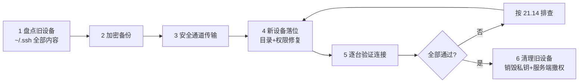
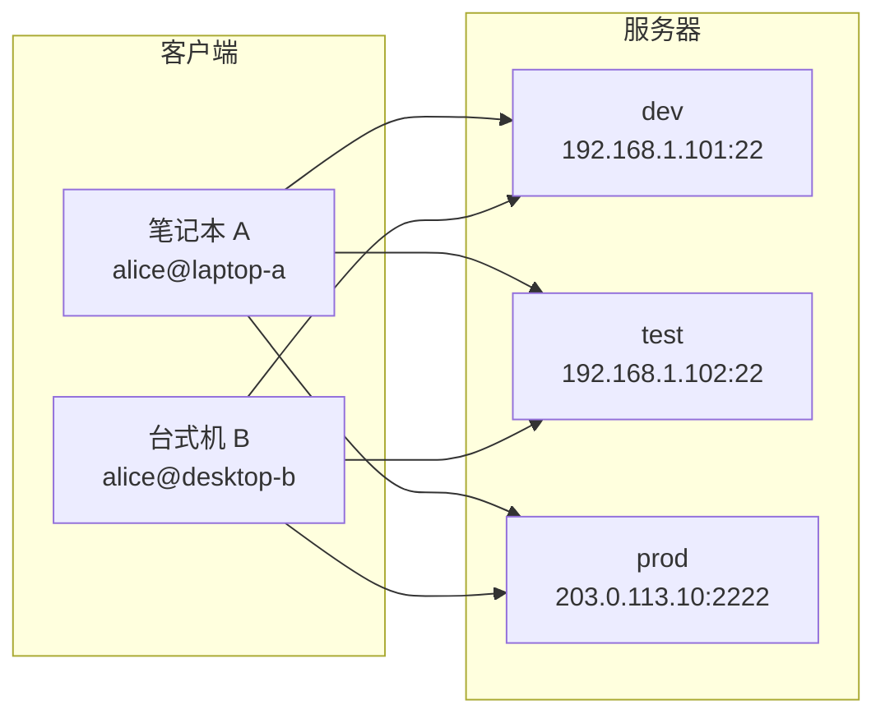

# 21 - SSH 远程管理

> SSH（Secure Shell）是 Linux 系统管理的基石协议。它提供了加密的远程登录、命令执行、文件传输和端口转发能力。无论是管理云服务器、维护本地服务还是搭建隧道穿透内网，SSH 都是不可或缺的核心技能。本章从 SSH 协议原理讲起，深入客户端配置、密钥认证、端口转发、sshd 服务端配置及安全加固等实战内容，并覆盖密钥的全生命周期：生成、分发、使用、**跨设备迁移**、销毁，以及配套的**端到端模拟流程**与**意外风险应急处置**。

---

## 21.1 SSH 概述

### 什么是 SSH

SSH 协议通过不安全的网络建立安全的加密通道。它取代了传统的 telnet、rlogin、rsh 等明文协议：

```
┌──────────┐ 加密通道 ┌──────────┐
│ SSH │ ════════════════════════ │ SSH │
│ Client │ 端口: 22 │ Server │
└──────────┘ └──────────┘
 │ │
 ├── 远程命令执行 │
 ├── SFTP 文件传输 │
 ├── 端口转发 / 隧道 │
 └── X11 转发 │
```

| 组件 | 说明 |
|------|------|
| OpenSSH | Linux 上最流行的 SSH 实现 |
| ssh | 客户端程序 |
| sshd | 服务端守护进程 |
| ssh-keygen | 密钥生成工具 |
| ssh-copy-id | 公钥分发工具 |
| ssh-agent | 密钥代理（缓存解密后的私钥） |

### 安装 OpenSSH

不同发行版的安装方式：

```bash
# Debian / Ubuntu
sudo apt install openssh-client openssh-server

# RHEL / Fedora
sudo dnf install openssh-clients openssh-server

# openSUSE
sudo zypper install openssh

# Arch
sudo pacman -S openssh
```

> 几乎所有 Linux 发行版都预装了 OpenSSH 客户端。服务器端可能需要额外安装。

---

## 21.2 SSH 客户端基础

### 基本连接

```bash
# 最简方式：使用当前用户名连接
ssh 192.168.1.100

# 指定用户名
ssh user@192.168.1.100

# 指定端口（默认 22）
ssh -p 2222 user@192.168.1.100

# 指定私钥
ssh -i ~/.ssh/my_key user@192.168.1.100

# 详细输出（调试用）
ssh -v user@192.168.1.100
ssh -vv user@192.168.1.100 # 更详细
ssh -vvv user@192.168.1.100 # 最详细

# 仅执行一条命令
ssh user@server "uptime"
ssh user@server "sudo systemctl restart nginx"

# 执行本地脚本
ssh user@server 'bash -s' < local_script.sh
```

### 首次连接与 known_hosts

首次连接时 SSH 会提示确认主机指纹：

```
The authenticity of host '192.168.1.100' can't be established.
ED25519 key fingerprint is SHA256:xxxxxxxxxxxxxxx.
Are you sure you want to continue connecting (yes/no)?
```

确认后，主机公钥会保存到 `~/.ssh/known_hosts`：

```bash
# 查看已知主机
cat ~/.ssh/known_hosts

# 移除某台主机的记录
ssh-keygen -R 192.168.1.100
ssh-keygen -R "[192.168.1.100]:2222" # 带端口
```

---

## 21.3 密钥认证

密钥认证比密码认证更安全，也是自动化脚本的基础。

### 生成密钥对

```bash
# 推荐：Ed25519（现代、安全、短密钥）
ssh-keygen -t ed25519 -C "your_email@example.com"

# 传统：RSA 4096（兼容性好）
ssh-keygen -t rsa -b 4096 -C "your_email@example.com"

# ECDSA（备选）
ssh-keygen -t ecdsa -b 521 -C "your_email@example.com"

# 输出文件（默认）：
# ~/.ssh/id_ed25519 私钥（绝不要分享！）
# ~/.ssh/id_ed25519.pub 公钥（放到服务器上）
```

交互式提示：

```
Enter file in which to save the key: # 回车使用默认路径
Enter passphrase: # 设置私钥密码（推荐）
Enter same passphrase again:
```

### 分发公钥到服务器

```bash
# 方法一：ssh-copy-id（最方便）
ssh-copy-id user@192.168.1.100
ssh-copy-id -i ~/.ssh/id_ed25519.pub user@192.168.1.100

# 方法二：手动复制
cat ~/.ssh/id_ed25519.pub | ssh user@server "mkdir -p ~/.ssh && cat >> ~/.ssh/authorized_keys"

# 方法三：scp
scp ~/.ssh/id_ed25519.pub user@server:~/
ssh user@server "cat ~/id_ed25519.pub >> ~/.ssh/authorized_keys && rm ~/id_ed25519.pub"
```

### 权限设置（服务器端）

SSH 对权限检查非常严格，权限不对会拒绝认证：

```bash
# 在服务器上执行
chmod 700 ~/.ssh
chmod 600 ~/.ssh/authorized_keys
chmod 644 ~/.ssh/id_*.pub # 公钥可读
chmod 600 ~/.ssh/id_* # 私钥仅自己读写
```

| 文件 | 权限 | 说明 |
|------|------|------|
| `~/.ssh/` | 700 | 仅自己可进入 |
| `~/.ssh/authorized_keys` | 600 | 仅自己可读写 |
| `~/.ssh/id_ed25519` | 600 | 私钥 |
| `~/.ssh/id_ed25519.pub` | 644 | 公钥 |
| `~/.ssh/config` | 600 | 客户端配置 |
| `~/.ssh/known_hosts` | 644 | 已知主机列表 |

---

## 21.4 SSH 客户端配置文件

`~/.ssh/config` 可以简化连接，支持主机别名、代理跳转、密钥指定等。

```ssh-config
# ~/.ssh/config

# === 基本格式 ===
Host myserver
 HostName 192.168.1.100
 Port 2222
 User alice
 IdentityFile ~/.ssh/id_ed25519

# === 通用默认值 ===
Host *
 ServerAliveInterval 60
 ServerAliveCountMax 3
 TCPKeepAlive yes
 Compression yes
 ForwardAgent no
 ForwardX11 no

# === 跳板机 / 代理跳转 ===
Host production
 HostName 10.0.1.50
 User deploy
 ProxyJump jump-host

Host jump-host
 HostName jump.example.com
 User admin
 IdentityFile ~/.ssh/bastion_key

# === 多级跳转 ===
Host deep-server
 HostName 10.0.2.100
 User root
 ProxyJump admin@gateway:22,root@internal:22

# === 不同的密钥 ===
Host github.com
 HostName github.com
 User git
 IdentityFile ~/.ssh/github_key
 IdentitiesOnly yes

Host gitlab.com
 HostName gitlab.com
 User git
 IdentityFile ~/.ssh/gitlab_key
 IdentitiesOnly yes

# === 按网段匹配 ===
Host 10.0.*
 User admin
 IdentityFile ~/.ssh/internal_key
 StrictHostKeyChecking no # 开发环境可放宽
 UserKnownHostsFile /dev/null

# === IPv6 连接 ===
Host ipv6-server
 HostName 2001:db8::1
 User alice
 AddressFamily inet6
```

配置生效后即可简化为：

```bash
ssh myserver # 等同于 ssh -p 2222 -i ~/.ssh/id_ed25519 alice@192.168.1.100
ssh production # 自动通过跳板机
```

---

## 21.5 端口转发（SSH 隧道）

SSH 端口转发可以在加密通道内传输任意 TCP 流量。这是 SSH 最强大但常被忽视的功能之一。

### 本地端口转发（-L）

将本地端口转发到远程目标。访问本地端口 = 访问远程目标：

```bash
# 语法：ssh -L 本地端口:目标主机:目标端口 user@ssh_server

# 示例：将本地 8080 转发到远端服务器的 80
ssh -L 8080:localhost:80 user@server
# 现在访问 http://localhost:8080 等同于访问 server 的 80 端口

# 示例：通过跳板机访问内网数据库
ssh -L 5432:10.0.1.100:5432 user@jump.example.com
# 本地 psql -h localhost -p 5432 连接到内网 PostgreSQL

# 多端口转发
ssh -L 8080:localhost:80 -L 8443:localhost:443 user@server
```

```
┌──────────┐ 加密隧道 ┌──────────┐ 普通连接 ┌──────────┐
│ 本地 │ ═══════════════════ │ SSH │ ──────────-> │ 目标 │
│ :8080 │ │ Server │ │ :80 │
│ 访问本地 │ │ │ │ (内部服务) │
└──────────┘ └──────────┘ └──────────┘
```

### 远程端口转发（-R）

将远程端口转发到本地。让远程主机能访问本地的服务：

```bash
# 语法：ssh -R 远程端口:目标主机:目标端口 user@ssh_server

# 示例：让远程服务器能访问本机 3000 端口
ssh -R 9000:localhost:3000 user@server
# 在 server 上访问 localhost:9000 等同于访问本机 3000 端口

# 示例：将内网服务暴露到公网 VPS
ssh -R 0.0.0.0:80:localhost:3000 user@public_vps
# 公网 VPS 的 80 端口流量转发到内网本机的 3000
```

> 注意：`GatewayPorts yes` 需在 sshd_config 中设置才能绑定到 0.0.0.0。

### 动态端口转发（-D）

创建 SOCKS5 代理，将 SSH 服务器作为代理出口：

```bash
# 创建 SOCKS5 代理
ssh -D 1080 user@server

# 在浏览器中设置 SOCKS5 代理为 localhost:1080
# 或在终端中使用
export ALL_PROXY=socks5://127.0.0.1:1080
curl https://httpbin.org/ip

# Firefox 使用 SOCKS5（自动配置）
# 设置 → 网络设置 → SOCKS 主机: 127.0.0.1 端口: 1080
```

```
┌──────────┐ SOCKS5 ┌──────────┐ 普通连接 ┌──────────┐
│ 本地 │ ═══════════=> │ SSH │ ──────────> │ Internet│
│ 浏览器 │ │ Server │ │ │
│ curl │ │ │ │ │
└──────────┘ └──────────┘ └──────────┘
```

### 后台保持隧道

```bash
# -f: 后台运行, -N: 不执行命令, -T: 不分配终端
ssh -fNT -L 8080:localhost:80 user@server

# 配合 autossh 自动重连
autossh -M 0 -fNT -L 8080:localhost:80 user@server
```

---

## 21.6 SCP 与 rsync over SSH

### SCP（安全拷贝）

```bash
# 本地 → 远程
scp file.txt user@server:/path/
scp -r mydir user@server:/path/ # 递归目录

# 远程 → 本地
scp user@server:/remote/file.txt ./local/

# 远程 → 远程
scp user@host1:/file.txt user@host2:/dest/

# 指定端口
scp -P 2222 file.txt user@server:/path/

# 压缩传输
scp -C large_file.bin user@server:/path/

# 保留属性
scp -p file.txt user@server:/path/ # 小写 p 保留时间戳
```

> SCP 协议已逐渐被更安全的 SFTP 协议替代。现代 scp 命令实际使用 SFTP 协议。

### SFTP（SSH 文件传输协议）

```bash
# 交互式 SFTP 客户端
sftp user@server

sftp> ls
sftp> cd /var/www
sftp> get file.txt # 下载
sftp> put file.txt # 上传
sftp> get -r mydir/ # 递归下载
sftp> rm file.txt
sftp> mkdir dirname
sftp> bye
```

### rsync over SSH

rsync 是更强大的文件同步工具，支持增量传输、断点续传：

```bash
# 基本用法
rsync -avz ./local_dir/ user@server:/remote_dir/

# 常用参数
rsync -avzP /src/ user@server:/dst/ # P=进度+断点续传
rsync -avz --delete /src/ user@server:/dst/ # 镜像同步
rsync -avz --exclude='node_modules' --exclude='.cache' /src/ server:/dst/

# 通过自定义端口
rsync -avz -e "ssh -p 2222" /src/ user@server:/dst/

# 通过跳板机
rsync -avz -e "ssh -J jump" /src/ target:/dst/

# 生成备份快照（硬链接去重）
rsync -avz --link-dest=/backup/latest/ /src/ /backup/$(date +%Y%m%d)/
```

| 特性 | scp | rsync |
|------|-----|-------|
| 增量传输 | 否 | 是 |
| 断点续传 | 否 | 是 |
| 压缩 | 支持 | 支持（更好） |
| 符号链接处理 | 简单 | 丰富选项 |
| 文件过滤 | 否 | 支持 exclude/include |
| 适用场景 | 少量文件快速复制 | 大量文件、备份、同步 |

---

## 21.7 SSHD 服务端配置

### 配置文件结构

主配置文件 `/etc/ssh/sshd_config`：

```bash
# 备份原配置
sudo cp /etc/ssh/sshd_config /etc/ssh/sshd_config.bak

# 验证配置语法
sudo sshd -t

# 查看当前生效的配置
sudo sshd -T
```

### 关键安全设置

```ini
# /etc/ssh/sshd_config（推荐的安全配置）

# === 端口 ===
Port 22 # 可改为非标准端口减少扫描噪

# === 监听 ===
ListenAddress 0.0.0.0 # 限制监听特定 IP
# ListenAddress 192.168.1.100

# === 用户认证 ===
PermitRootLogin no # 禁止 root 直接登录
PubkeyAuthentication yes # 启用密钥认证
PasswordAuthentication no # 禁用密码认证（密钥认证就绪后）
ChallengeResponseAuthentication no # 禁用挑战响应
UsePAM yes # 使用 PAM 认证

# === 限制登录 ===
AllowUsers alice bob # 白名单（推荐）
AllowGroups sshusers # 按组白名单
# DenyUsers baduser # 黑名单
# DenyGroups badgroup

# === 登录限制 ===
MaxAuthTries 3 # 最大认证尝试次数
MaxSessions 10 # 单连接最大会话数
LoginGraceTime 30 # 登录超时（秒）

# === 密钥认证 ===
AuthorizedKeysFile .ssh/authorized_keys
HostKey /etc/ssh/ssh_host_ed25519_key

# === 保活 ===
ClientAliveInterval 300 # 每 5 分钟发一次保活包
ClientAliveCountMax 2 # 连续 2 次无响应则断开

# === 转发控制 ===
X11Forwarding no # 禁用 X11 转发
AllowAgentForwarding no # 禁用 agent 转发（多用户场景）
AllowTcpForwarding yes # 端口转发（按需）
GatewayPorts no # 禁止远程端口转发绑定 0.0.0.0

# === SFTP 隔离 ===
# Subsystem sftp internal-sftp # 使用内部 SFTP
# Match Group sftponly # 限制 SFTP 用户
# ChrootDirectory /srv/sftp
# ForceCommand internal-sftp
# X11Forwarding no
# AllowTcpForwarding no

# === 加密算法（现代安全级别）===
KexAlgorithms curve25519-sha256,curve25519-sha256@libssh.org,diffie-hellman-group16-sha512,diffie-hellman-group18-sha512
Ciphers chacha20-poly1305@openssh.com,aes256-gcm@openssh.com,aes128-gcm@openssh.com
MACs hmac-sha2-256-etm@openssh.com,hmac-sha2-512-etm@openssh.com

# === 日志 ===
SyslogFacility AUTH
LogLevel VERBOSE # 记录指纹方便审计
```

### 配置变更后

```bash
# 验证配置
sudo sshd -t

# 重载配置（不中断现有连接）
sudo systemctl reload sshd
# 或
sudo kill -HUP $(pidof sshd)
```

### 查看当前连接

```bash
# 查看 SSHD 连接
sudo ss -tnp | grep :22
sudo lsof -i :22

# 查看当前登录用户
w
who

# 踢出特定会话
sudo pkill -u username sshd
```

---

## 21.8 SSH Agent 转发

ssh-agent 缓存解密后的私钥，避免反复输入密码短语。

### 本地使用

```bash
# 启动 agent（大多数桌面环境已自动启动）
eval $(ssh-agent)

# 添加密钥
ssh-add ~/.ssh/id_ed25519
ssh-add -l # 列出已加载的密钥
ssh-add -L # 列出已加载的公钥
ssh-add -d ~/.ssh/id_ed25519 # 删除指定密钥
ssh-add -D # 删除所有密钥

# 设置密钥有效期
ssh-add -t 3600 ~/.ssh/id_ed25519 # 1 小时后自动移除
```

### Agent 转发（谨慎使用）

Agent 转发允许在服务器上使用本地的密钥认证：

```bash
# 方式一：命令行
ssh -A user@server

# 方式二：配置文件
Host server
 ForwardAgent yes
```

> **安全警告**：Agent 转发存在安全风险。如果有 root 权限的恶意用户登录了同一台跳板机，可以利用你的 agent socket 进行认证。生产环境建议使用 ProxyJump 或 `ssh -J` 代替 agent 转发。

### 安全的替代方案：ProxyJump

```bash
# 不使用 agent 转发，用 ProxyJump 替代
ssh -J user@jump-host user@target-host

# ~/.ssh/config 配置
Host target
 ProxyJump jump-host
```

---

## 21.9 tmux / screen 持久化会话

通过 SSH 运行长时间任务时，断开连接会导致进程终止。终端复用器解决了这个问题。详见 [[55-终端常用工具大全]]。

### tmux 快速入门

```bash
# 安装
# Debian/Ubuntu: sudo apt install tmux
# RHEL/Fedora: sudo dnf install tmux
# Arch: sudo pacman -S tmux

# 基本操作
tmux # 创建新会话
tmux new -s mywork # 命名会话
tmux ls # 列出所有会话
tmux attach -t mywork # 重新连接会话

# 常用快捷键（默认前缀 Ctrl+b）：
# Ctrl+b % 水平分割窗口
# Ctrl+b " 垂直分割窗口
# Ctrl+b 方向键 切换窗格
# Ctrl+b d 脱离会话（detach）
# Ctrl+b c 创建新窗口
# Ctrl+b [ 进入滚动模式
# Ctrl+b x 关闭当前窗格
```

### screen 快速入门

```bash
# 安装
# Debian/Ubuntu: sudo apt install screen
# RHEL/Fedora: sudo dnf install screen

screen -S mywork # 创建命名会话
screen -ls # 列出会话
screen -r mywork # 重新连接
screen -d mywork # 强制分离

# 快捷键（默认前缀 Ctrl+a）：
# Ctrl+a c 创建新窗口
# Ctrl+a d 脱离会话
# Ctrl+a " 窗口列表
# Ctrl+a ' 切换窗口
```

### SSH + tmux 最佳实践

```bash
# 一键连接并创建/重连会话
ssh user@server -t 'tmux new -A -s work'

# 在 ~/.ssh/config 中配置
Host myserver
 HostName 192.168.1.100
 User alice
 RequestTTY yes
 RemoteCommand tmux new -A -s work
```

---

## 21.10 密钥迁移与设备更换

> 换电脑、重装系统、旧设备退役……SSH 密钥的迁移是最容易被忽视却最容易出事的环节。本节给出一套标准化流程：**盘点 → 加密备份 → 安全传输 → 落位修复 → 逐台验证 → 清理旧设备**，顺序不能乱，任何一步都不跳过。

### 迁移全景



### 第一步：盘点旧设备

```bash
ls -la ~/.ssh/
```

典型输出解读：

| 文件 | 是否迁移 | 说明 |
|------|---------|------|
| `id_ed25519` | 必须 | 私钥，新设备免密的根基 |
| `id_ed25519.pub` | 必须 | 公钥，与服务端 authorized_keys 对应用 |
| `config` | 必须 | 别名、端口、跳板规则全在这 |
| `known_hosts` | 建议迁移 | 免去新设备上逐台确认指纹 |
| `authorized_keys` | 不用迁 | 那是服务端的东西，客户端上有也只是残留 |

提取需要接管的服务器清单（来自 config——这也是平时坚持把每台服务器写进 config 的理由之一）：

```bash
grep -E "^Host " ~/.ssh/config | grep -v "\*"
```

加密打包备份：

```bash
tar -C ~ -czf /tmp/ssh-backup.tar.gz .ssh
gpg -c /tmp/ssh-backup.tar.gz      # 口令加密，生成 ssh-backup.tar.gz.gpg
rm /tmp/ssh-backup.tar.gz          # 立刻删除未加密副本，只留 .gpg
```

> 裸的 tar 包等同于把所有服务器的钥匙串挂在腰带上。备份产物只有 gpg 加密后的版本有资格离开本机。

### 第二步：传输到新设备

| 方式 | 适用场景 | 注意事项 |
|------|---------|---------|
| scp 直传 | 新旧设备都能互通 | 走 SSH 加密，首选 |
| U 盘离线拷贝 | 无网络/隔离环境 | 全程不离手，用完格式化 |
| gpg 加密包走网盘/邮箱 | 只能中转公网时 | 必须先加密，密钥口令另走渠道 |
| 明文发聊天软件/网盘 | **禁止** | 一旦上网即视为已泄露 |

```bash
# 新设备上先建好目录（scp 不能自动创建目标目录）
ssh newuser@new-machine "mkdir -p ~/.ssh && chmod 700 ~/.ssh"

# 旧设备上传送文件（scp 默认保留内容但会按 umask 落盘，权限下一步统一修）
cd ~/.ssh
scp id_ed25519 id_ed25519.pub config known_hosts newuser@new-machine:.ssh/
```

### 第三步：新设备落位与权限修复

```bash
# 在新设备上执行
chmod 700 ~/.ssh
chmod 600 ~/.ssh/id_ed25519        # 私钥：仅本人读写
chmod 600 ~/.ssh/config
chmod 644 ~/.ssh/id_ed25519.pub
chmod 644 ~/.ssh/known_hosts

# 校验指纹与旧设备一致（两边各跑一次人工比对）
ssh-keygen -lf ~/.ssh/id_ed25519
# 输出示例：256 SHA256:xxxxxxxxxxxxxxxx your_email@example.com (ED25519)

# 加载 agent 并试连第一台
eval $(ssh-agent)
ssh-add ~/.ssh/id_ed25519
ssh dev                            # 用 config 别名直连
```

指纹对不上说明传输被调包或拿错了文件，立刻停止重新传。权限不修 SSH 会直接拒绝使用私钥：`WARNING: UNPROTECTED PRIVATE KEY FILE!`。

### 第四步：逐台验证

```bash
for h in dev test prod; do
    echo "== $h =="
    ssh -o BatchMode=yes -o ConnectTimeout=5 "$h" 'echo OK $(hostname)'
done
```

`BatchMode=yes` 禁止交互输密码：能输出 OK 说明纯密钥认证通过；报 `Permission denied (publickey,password)` 的服务器单独排查（多半是服务端 authorized_keys 或权限问题，见 21.14）。

### 第五步：清理旧设备

确认新设备一切正常**之后**再处理旧设备，顺序不能反：

```bash
# 销毁私钥（shred 覆写后删除；普通 rm 可被数据恢复工具捞回）
shred -u ~/.ssh/id_ed25519
rm -f ~/.ssh/id_ed25519.pub ~/.ssh/config ~/.ssh/known_hosts

# 旧设备要转交他人？最稳妥的做法是直接重装系统
```

如果旧设备是被盗或丢失而非可控交接，跳过本机清理，直接进入 21.12 场景 3 的紧急轮换流程。

### 服务端侧的迁移

换的是服务器而不是客户端时：

```bash
# 新服务器安装并启用 sshd
sudo apt install openssh-server && sudo systemctl enable --now sshd

# 迁移授权列表与配置（从旧服务器拉取）
scp oldadmin@old-server:.ssh/authorized_keys ~/.ssh/
sudo scp oldadmin@old-server:/etc/ssh/sshd_config /tmp/sshd_config.old
diff /etc/ssh/sshd_config /tmp/sshd_config.old      # 先比对差异再决定覆盖项
sudo sshd -t && sudo systemctl reload sshd
```

> 主机密钥（`/etc/ssh/ssh_host_*_key`）**不要**迁移复用：克隆主机密钥会让所有客户端把两台机器当成同一台，既干扰排错也给中间人攻击留口子。唯一例外是负载均衡后端的完全镜像节点。

### 多设备同步策略

| 策略 | 做法 | 优点 | 缺点 |
|------|------|------|------|
| 每台设备独立密钥对（推荐） | 笔记本/台式机各生成一对，公钥都加进服务器 | 丢一台只吊销一把；可按设备审计登录来源 | authorized_keys 行数多 |
| 全设备共享同一对密钥 | 同一份私钥拷来拷去 | 管理简单 | 丢即全丢，无法区分来源 |
| 按用途拆分 | 工作钥 / 个人钥 / GitHub 钥分开 | 泄露影响面最小 | config 稍复杂 |

推荐的 authorized_keys 组织方式——一行一设备，靠注释字段区分归属：

```
# 服务端 ~/.ssh/authorized_keys
ssh-ed25519 AAAA...alice@laptop-a
ssh-ed25519 AAAA...alice@desktop-b
ssh-ed25519 AAAA...ci-runner
```

吊销某台设备就是删掉对应一行：

```bash
for h in dev test prod; do
    ssh "$h" 'sed -i "/alice@laptop-a/d" ~/.ssh/authorized_keys'
done
```

config 这类不含私密内容的文件可以用 dotfiles Git 仓库跨设备同步；**私钥永远不进 Git**。

---

## 21.11 完整模拟流程

> 把本章所有知识点串成一个端到端场景：运维工程师 Alice 刚入职，拿到一台笔记本和一台台式机，需要管理内网开发机、测试机和一台公网生产机。每一步都给出目标、命令、预期结果和验证方法，可以在自己的虚拟机上完整重演。

### 场景拓扑

| 角色 | 地址 | 说明 |
|------|------|------|
| 笔记本 A | 本地 | Alice 的主力机 |
| 台式机 B | 本地 | 备用机，同样要能管理全部服务器 |
| dev-server | 192.168.1.101:22 | 内网开发机，默认端口 |
| test-server | 192.168.1.102:22 | 内网测试机，默认端口 |
| prod-server | 203.0.113.10:2222 | 公网生产机，非标端口 |



### 第 1 步：两台客户端各生成密钥对

目标：一机一钥，注释字段标明归属。

```bash
# 笔记本 A 上执行
ssh-keygen -t ed25519 -C "alice@laptop-a"
# 台式机 B 上执行
ssh-keygen -t ed25519 -C "alice@desktop-b"
```

预期：各自生成 `~/.ssh/id_ed25519(.pub)`，passphrase 设了非空口令。
验证：`ssh-keygen -lf ~/.ssh/id_ed25519` 能看到指纹且尾部注释分别是 laptop-a / desktop-b。

### 第 2 步：分发公钥到三台服务器

目标：两台客户端的公钥都进入三台服务器的 authorized_keys。

```bash
# 笔记本 A 上执行（首次分发需要输一次服务器密码）
ssh-copy-id -i ~/.ssh/id_ed25519.pub alice@192.168.1.101          # dev
ssh-copy-id -i ~/.ssh/id_ed25519.pub alice@192.168.1.102          # test
ssh-copy-id -i ~/.ssh/id_ed25519.pub -p 2222 alice@203.0.113.10   # prod

# 台式机 B 重复同样三条命令
```

`ssh-copy-id` 会自动在远端创建 `~/.ssh`、修正权限并追加公钥，不需要手工 cat >>。

### 第 3 步：验证免密登录与服务端状态

```bash
ssh -o BatchMode=yes alice@192.168.1.101 'echo ok'        # 直接输出 ok 即成功
ssh -o BatchMode=yes alice@192.168.1.102 'echo ok'
ssh -o BatchMode=yes -p 2222 alice@203.0.113.10 'echo ok'

# 登录 prod 抽查服务端
ssh -p 2222 alice@203.0.113.10
stat -c '%a %n' ~/.ssh ~/.ssh/authorized_keys   # 期望输出 700 和 600
cat ~/.ssh/authorized_keys                      # 应看到 laptop-a 与 desktop-b 两行
```

### 第 4 步：写客户端 config 别名

两台客户端写入相同内容的 `~/.ssh/config`（记得 `chmod 600`）：

```ssh-config
Host dev
    HostName 192.168.1.101
    User alice
    IdentityFile ~/.ssh/id_ed25519

Host test
    HostName 192.168.1.102
    User alice
    IdentityFile ~/.ssh/id_ed25519

Host prod
    HostName 203.0.113.10
    Port 2222
    User alice
    IdentityFile ~/.ssh/id_ed25519
    ServerAliveInterval 60
```

此后三台机器就是 `ssh dev`、`ssh test`、`ssh prod`。

### 第 5 步：IP 与端口的分配逻辑

目标：理解这套环境的 IP 和端口是怎么定下来的，以及如何自己分配。

IP 层面：内网机器由路由器/DHCP 分配 192.168.1.0/24 段地址。服务器类设备必须在 DHCP 里做**静态租约绑定**（按 MAC 地址固定 IP），否则某天重启后地址漂移，SSH 就连不上了。公网的 prod 则由云平台分配弹性公网 IP。网络层机制详见 [[13-网络配置基础]]。

端口层面：prod 改成 2222 的操作在生产机上完成：

```bash
# prod-server 上
sudo sed -i 's/^#\?Port .*/Port 2222/' /etc/ssh/sshd_config
grep "^Port" /etc/ssh/sshd_config        # Port 2222
sudo sshd -t && sudo systemctl reload sshd

# 防火墙放行新端口（ufw 为例；iptables/nftables 见下一章）
sudo ufw allow 2222/tcp
```

RHEL 系还要给 SELinux 登记端口标签：`sudo semanage port -a -t ssh_port_t -p tcp 2222`。

> 改端口前**保持一个已登录会话不断开**，另开窗口验证新端口能通后再退旧会话。改端口只是减少扫描噪音，不是安全边界——真正的防线仍是密钥认证加防火墙。

### 第 6 步：端口转发实战

场景：test-server 上的 PostgreSQL 只监听 127.0.0.1:5432，Alice 要在本机用图形客户端调试它。

```bash
ssh -L 15432:localhost:5432 test -N
# 保持该窗口运行；本机另开终端：
psql -h localhost -p 15432 -U alice -d appdb
```

本地 15432 即穿透到了 test 的 5432。原理与其他转发模式见 21.5。

### 第 7 步：换设备——笔记本 A 更换为笔记本 C

公司给 Alice 配了新笔记本 C，旧的 A 要归还 IT。执行 21.10 的标准流程：

```bash
# ===== 新设备 C =====
ssh-keygen -t ed25519 -C "alice@laptop-c"

# C 的公钥追加到三台服务器（A 还没归还，处于双保险期）
ssh-copy-id -i ~/.ssh/id_ed25519.pub alice@192.168.1.101
ssh-copy-id -i ~/.ssh/id_ed25519.pub alice@192.168.1.102
ssh-copy-id -i ~/.ssh/id_ed25519.pub -p 2222 alice@203.0.113.10

# 同步 config（dotfiles 仓库或直接从台式机 B 拉）
scp desktop-b:.ssh/config ~/.ssh/config && chmod 600 ~/.ssh/config

# 逐台验证（BatchMode 确认纯密钥可用）
for h in dev test prod; do ssh -o BatchMode=yes "$h" 'echo OK'; done

# ===== 旧设备 A 归还前 =====
shred -u ~/.ssh/id_ed25519

# 从三台服务器吊销 laptop-a 的公钥行
for h in dev test prod; do
    ssh "$h" 'sed -i "/alice@laptop-a/d" ~/.ssh/authorized_keys'
done
```

注意顺序：先让 C 全面可用，再销毁 A——双保险期保证任何时刻都至少有一把钥匙能进门。

### 第 8 步：模拟意外——台式机 B 被盗

某天办公室失窃，B 连同硬盘一起消失。A 与 C 未受影响。因为采用了一机一钥策略，处置被限制在一行删除：

```bash
# 三台服务器上吊销 desktop-b 的公钥
for h in dev test prod; do
    ssh "$h" 'sed -i "/alice@desktop-b/d" ~/.ssh/authorized_keys'
done

# 审计失窃期间是否有该设备的成功登录
ssh prod 'sudo journalctl -u sshd --since "7 days ago" | grep -i accepted'
# 对照时间线与登录来源 IP 判断是否有人用丢失的私钥进来过；
# 有记录则升级为 21.12 场景 3 的全量轮换流程
```

---

## 21.12 意外风险与应急处理

> 密钥体系的事故九成源于两类根因：**权限不对**和**把自己锁在门外**。本节按"事故矩阵 → 分场景处置 → 黄金法则"组织，建议先通读一遍再实操。

### 事故矩阵速查

| # | 场景 | 可否预防 | 核心处置动作 |
|---|------|---------|-------------|
| 1 | 客户端私钥误删 | 是（有备份习惯） | 重生成 → 重分发 |
| 2 | passphrase 遗忘 | 否，无法恢复 | 视同私钥丢失，直接换钥 |
| 3 | 私钥疑似泄露/被盗 | 部分 | 紧急轮换四步法 |
| 4 | 服务端权限错误导致免密失效 | 是 | 修复属主与权限位 |
| 5 | sshd 配置错误把自己锁死 | 是 | 保住现有会话 + 回滚 |
| 6 | 主机指纹变更告警 | 部分 | 辨别合法重装还是中间人 |
| 7 | 服务器被入侵、authorized_keys 被篡改 | 部分 | 审计 + 全量轮换 |

### 场景 1：客户端私钥误删

现象：连接时报 `no such identity`，或回退到密码认证提示输密码。

```bash
ls ~/.ssh/                     # 确认真的没了
# 有 gpg 备份则恢复；没有就走重生成：
ssh-keygen -t ed25519 -C "alice@laptop-c"
ssh-copy-id -i ~/.ssh/id_ed25519.pub dev
ssh-copy-id -i ~/.ssh/id_ed25519.pub test
ssh-copy-id -i ~/.ssh/id_ed25519.pub -p 2222 alice@203.0.113.10
```

预防：把 21.10 第二步的加密备份纳入每月例行维护。

### 场景 2：passphrase 遗忘

passphrase 不存储在任何地方，没有任何找回手段——忘了就等于私钥永久不可用。正确做法是视同私钥丢失，直接走场景 1 重生成。日常缓解：passphrase 存进口令管理器，或日常用 ssh-agent 缓存解锁状态减少输入次数。

### 场景 3：私钥疑似泄露（紧急轮换）

触发条件举例：笔记本丢失且当时未关机、私钥曾被误传到网盘或公开仓库、U 盘借出过、旧设备未 shred 就转手。

先判断是否真的发生过入侵（决定善后力度）：

```bash
ssh prod 'sudo journalctl -u sshd --since "30 days ago" \
    | grep "Accepted.*publickey" | tail -30'
# 对照登录时间与来源 IP：出现陌生来源说明有人用过你的钥匙，
# 除轮换 SSH 密钥外还要排查系统是否已被入侵
```

无论是否发现入侵痕迹，密钥本身都要立即轮换，四步法：


```bash
# 1 生成（注释里带上日期方便日后审计）
ssh-keygen -t ed25519 -C "alice-emergency-$(date +%F)"

# 2 分发（趁旧钥还能用时最省事；旧钥已失效就走云控制台）
ssh-copy-id -i ~/.ssh/id_ed25519.pub dev
ssh-copy-id -i ~/.ssh/id_ed25519.pub test
ssh-copy-id -i ~/.ssh/id_ed25519.pub -p 2222 alice@203.0.113.10

# 3 验证
for h in dev test prod; do ssh -o BatchMode=yes "$h" 'echo OK'; done

# 4 吊销旧钥
for h in dev test prod; do
    ssh "$h" 'sed -i "/alice-emergency\|alice@laptop-c/d;/^ssh-ed25519 .*alice@old/d" ~/.ssh/authorized_keys'
done
```

若私钥曾进入公开仓库，应假定已被自动化爬虫秒收：除 SSH 外，同一批次的云平台 API Key、Git 托管令牌也要全部撤销重发。

### 场景 4：服务端权限错误，免密突然失效

现象：昨天还能免密，今天要求输密码。日志里能看到根因：

```bash
ssh prod 'sudo journalctl -u sshd -n 50 | grep -i refused'
# Authentication refused: bad ownership or modes for file /home/alice/.ssh/authorized_keys
```

这是 sshd 的 `StrictModes`（默认开启）在保护你：当 authorized_keys 或其上级目录对组/其他人可写时，任何能写这个文件的人都能给自己发通行证，所以 sshd 宁可拒绝认证。

```bash
# 能以密码登入时，登上去修复：
chmod go-w ~/ ~/.ssh
chmod 700 ~/.ssh && chmod 600 ~/.ssh/authorized_keys
```

连密码也登不上（PasswordAuthentication 已禁用的生产机）：用云厂商 VNC 控制台、物理键盘或 IPMI 进入系统执行同样的修复命令。

预防：任何脚本递归修改家目录权限前先想清楚——`chmod -R 777 ~` 是这类事故的经典源头。

### 场景 5：sshd 配置错误把自己锁死

典型事故链：改 sshd_config → restart → 配置有语法错误 → 服务起不来 → 远程再也连不上。

三条保命规则：

1. **改远程配置前，保住手上已建立的 SSH 会话不断开**——reload 不会杀死现有连接，它是你的救援通道；
2. 永远先 `sudo sshd -t` 再 reload/restart；
3. 用 reload 而不是 restart：配置有问题时 reload 失败但旧进程还在服务。

标准操作序列：

```bash
sudo cp /etc/ssh/sshd_config /etc/ssh/sshd_config.bak.$(date +%F)   # 改前备份
sudo vim /etc/ssh/sshd_config
sudo sshd -t                          # 语法检查，无输出=通过
sudo systemctl reload sshd            # 出问题也不影响现有会话
# 另开一个终端验证新连接 OK 之后，才允许退出旧会话
```

已经锁死了怎么办：云控制台 / VNC / IPMI 登录后 `sudo sshd -t` 看报错行号，或直接还原备份文件再启动服务。物理机房则找带外管理口。这也是 21.12 开头说的"永远留一条带外通道"的意义。

### 场景 6：主机指纹变更告警

现象：

```
WARNING: REMOTE HOST IDENTIFICATION HAS CHANGED!
IT IS POSSIBLE THAT SOMEONE IS DOING SOMETHING NASTY!
```

这个告警的含义是"对面这台机器不是我记忆中的那台"。先辨别再动手，两种情形处理方式完全不同：

| 情形 | 判断依据 | 处置 |
|------|---------|------|
| 合法变更（重装系统/换主机） | 你或团队确实动过这台机器 | `ssh-keygen -R` 清旧记录；重连时到控制台核对显示的新指纹再接受 |
| 未知变更（潜在中间人攻击） | 没人承认动过机器 | **停止连接**，走带外渠道核实主机密钥，检查所在网络路径是否可疑（公共 WiFi 等） |

```bash
ssh-keygen -R 192.168.1.101
ssh-keygen -R "[203.0.113.10]:2222"     # 非标端口必须带方括号写法
```

绝不要因为嫌烦就把 `StrictHostKeyChecking no` 写进全局配置——那等于亲手关掉中间人攻击的唯一报警器。

### 场景 7：服务器被入侵，authorized_keys 被篡改

攻击者拿到 shell 后的第一件事往往就是往 authorized_keys 里塞自己的公钥，确保你改了密码他也进得来。

排查：

```bash
wc -l ~/.ssh/authorized_keys                    # 条目数和记忆中对不上就有问题
diff ~/.ssh/authorized_keys /path/to/good_backup
stat ~/.ssh/authorized_keys                     # mtime 显示最近被谁的时间点改过

sudo journalctl -u sshd --since "-30 days" | grep -i accepted   # 入侵时间线
last | head -20                                                  # 历史登录记录
```

处置顺序：隔离（断网/防火墙只留管理口）→ 清除陌生公钥 → **全量轮换**（所有用户密钥 + 主机密钥：`sudo rm /etc/ssh/ssh_host_*` 后按发行版方式重新生成，Debian 系可用 `sudo dpkg-reconfigure openssh-server`）→ 排查持久化后门（crontab、systemd unit、异常 SUID）→ 从干净备份恢复业务。更完整的应急响应展开见 [[28-系统安全加固与审计]]。

### 应急黄金法则

1. **永远留一条带外通道**：云控制台、VNC、IPMI 至少有一个可用，且动手前就知道怎么进；
2. **改任何远程配置前，先保住手上的会话**；
3. **吊销成本决定事故半径**：一机一钥 + 注释字段规范，吊销一把钥匙就是删一行；
4. **怀疑泄露就当泄露处理**：轮换一把钥匙只要十分钟，赌它没泄可能赔掉整台服务器。

---

## 21.13 SSH 安全最佳实践

### 检查清单

```bash
# 1. 检查密钥配置
ssh-keygen -l -f ~/.ssh/id_ed25519 # 查看密钥指纹
sudo cat /var/log/auth.log | grep "Failed password"

# 2. 检查 sshd 配置
sudo sshd -t
sudo sshd -T | grep -E "(permitroot|passwordauth|pubkeyauth)"

# 3. 查看当前安全级别
ssh -o PreferredAuthentications=publickey user@server 2>&1
```

### 额外安全措施

| 措施 | 命令/配置 | 说明 |
|------|----------|------|
| 禁用短密钥 | `HostKeyAlgorithms +ssh-ed25519` | 拒绝 RSA < 2048 |
| 禁用弱算法 | `Ciphers` 只保留现代加密 | 去掉 3des-cbc 等 |
| 双因素认证 | 配合 `pam_google_authenticator.so` | PAM 层的 2FA |
| 登录通知 | `pam_exec` 调用脚本 | 新登录通知管理员 |
| 端口敲门 | `knockd` 服务 | 隐藏 SSH 端口 |
| 限速 | iptables `-m recent` | 限制尝试频率 |

### SSH 证书认证（进阶）

比传统公钥认证更易管理的方案：

```bash
# 生成 CA 密钥
ssh-keygen -t ed25519 -f ~/ssh_ca

# 签发用户证书（有效期 24 小时）
ssh-keygen -s ~/ssh_ca -I user_id -n alice -V +24h ~/.ssh/id_ed25519.pub

# 在服务器上信任 CA（/etc/ssh/sshd_config）
TrustedUserCAKeys /etc/ssh/trusted_ca.pub

# 撤销证书
ssh-keygen -k -f /etc/ssh/revoked_keys ~/ssh_ca -u user_id.id_revoke
```

证书认证的优势：无需在每个服务器上配置 authorized_keys，集中管理证书的签发和吊销。

---

## 21.14 常见问题排查

```bash
# SSH 连接超时
ssh -v user@server # 查看调试输出
ping server_ip # 检查网络连通性
sudo ss -tlnp | grep 22 # 确认 sshd 监听

# 权限问题
ls -la ~/.ssh/ # 检查客户端权限
# 服务端日志
sudo journalctl -u sshd -f # systemd 系统
sudo tail -f /var/log/auth.log # Debian/Ubuntu
sudo tail -f /var/log/secure # RHEL/Fedora

# 密钥被拒绝
ssh -vvv user@server 2>&1 | grep -i "permission\|auth\|key"
ssh-keygen -y -f ~/.ssh/id_ed25519 # 从私钥提取公钥验证

# 加密算法不兼容
ssh -Q cipher # 列出支持的加密算法
ssh -Q mac # 列出支持的 MAC 算法
ssh -Q kex # 列出支持的密钥交换算法

# 主机密钥变更警告
# WARNING: REMOTE HOST IDENTIFICATION HAS CHANGED!
# 可能是正当的（服务器重装）也可能是 MITM 攻击
ssh-keygen -R hostname # 删除旧记录
# 联系管理员确认新的主机指纹
```

---

## 21.15 参考资源与关联章节

| 资源 | 说明 |
|------|------|
| `man ssh` | SSH 客户端手册 |
| `man sshd_config` | SSHD 配置选项 |
| `man ssh_config` | 客户端配置选项 |
| OpenSSH 官方 | https://www.openssh.com/ |

相关章节：
- [[24-防火墙与安全]] — 防火墙配置，SSH 端口访问控制
- [[28-系统安全加固与审计]] — 系统级安全加固，fail2ban 配置
- [[55-终端常用工具大全]] — tmux、screen 等终端工具详解
- [[13-网络配置基础]] — 网络基础知识

---

> **小结**：SSH 是 Linux 远程管理的核心协议。掌握密钥认证、config 配置、端口转发和 sshd 安全加固是每个系统管理员的基本功。密钥是有生命周期的：生成时分设备、分发时留注释、迁移时先验证后清理、丢失时按应急四步法轮换。生产环境中务必遵循最小权限原则：禁用密码登录、禁止 root 直连、限制可登录用户、使用 ed25519 密钥、定期审计 authorized_keys，并永远保留一条带外管理通道。
