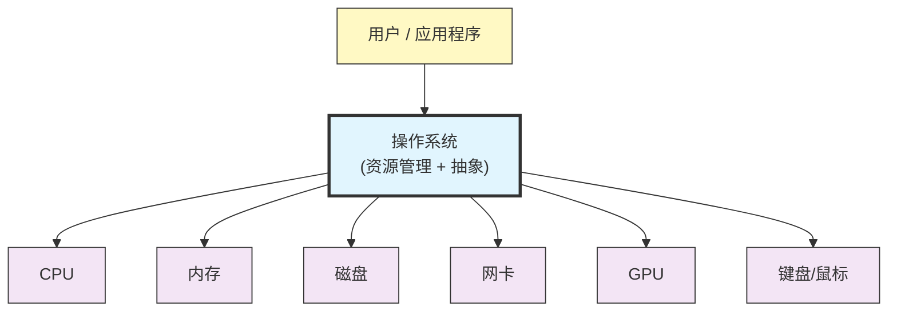
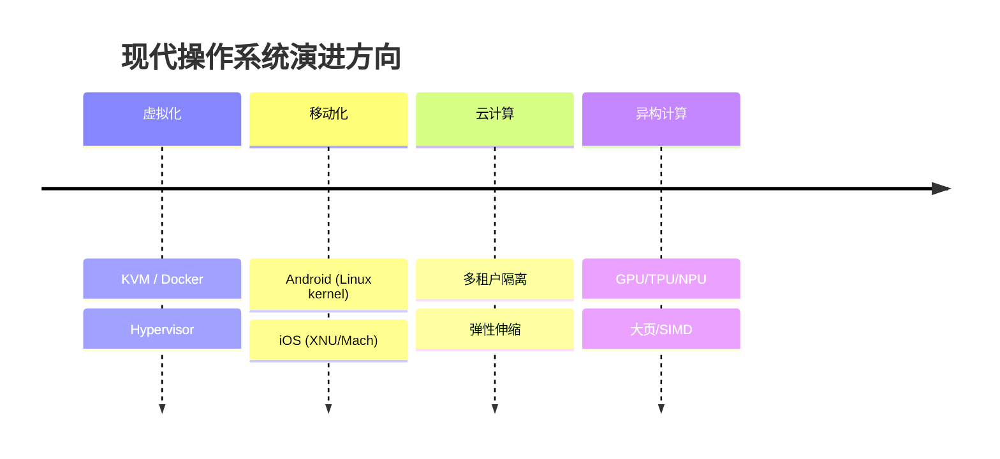
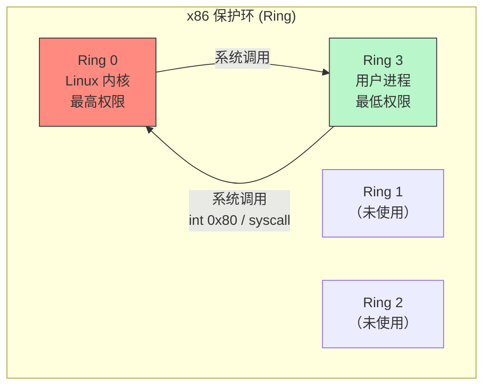
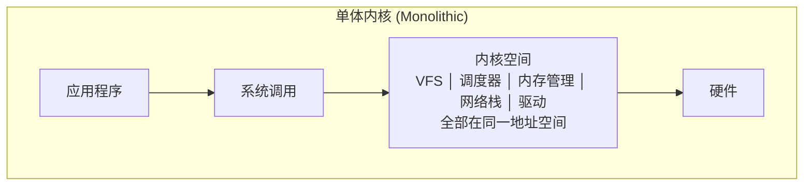
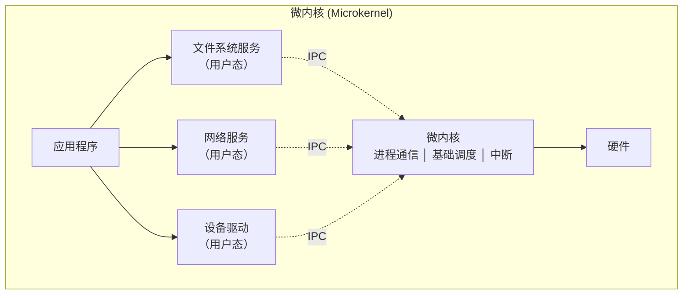
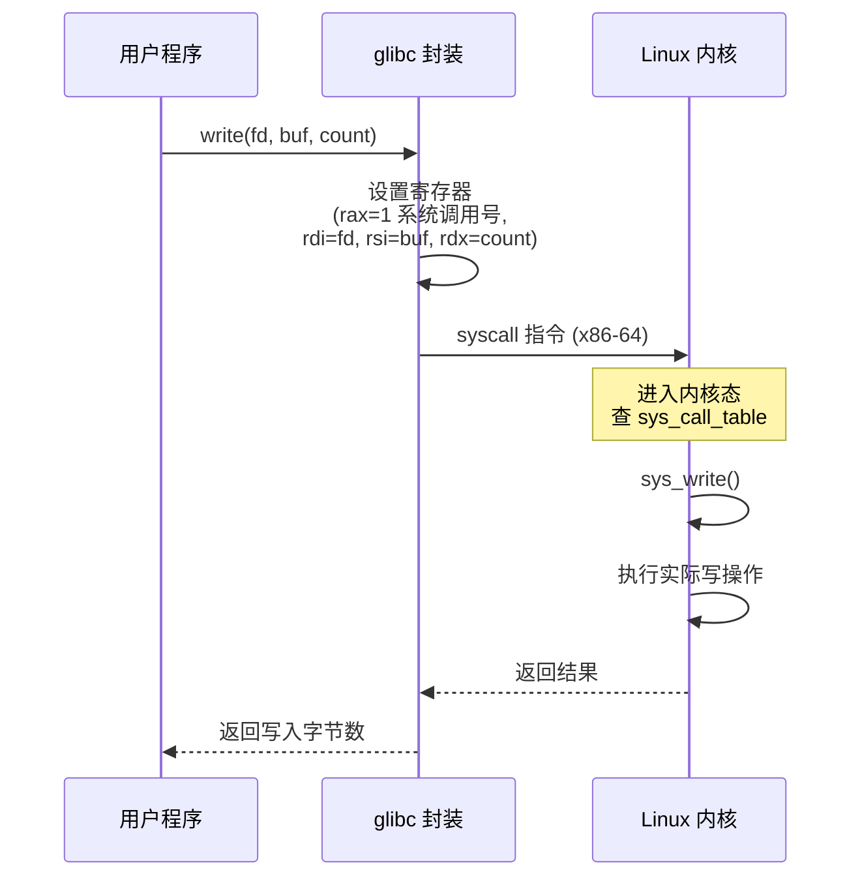
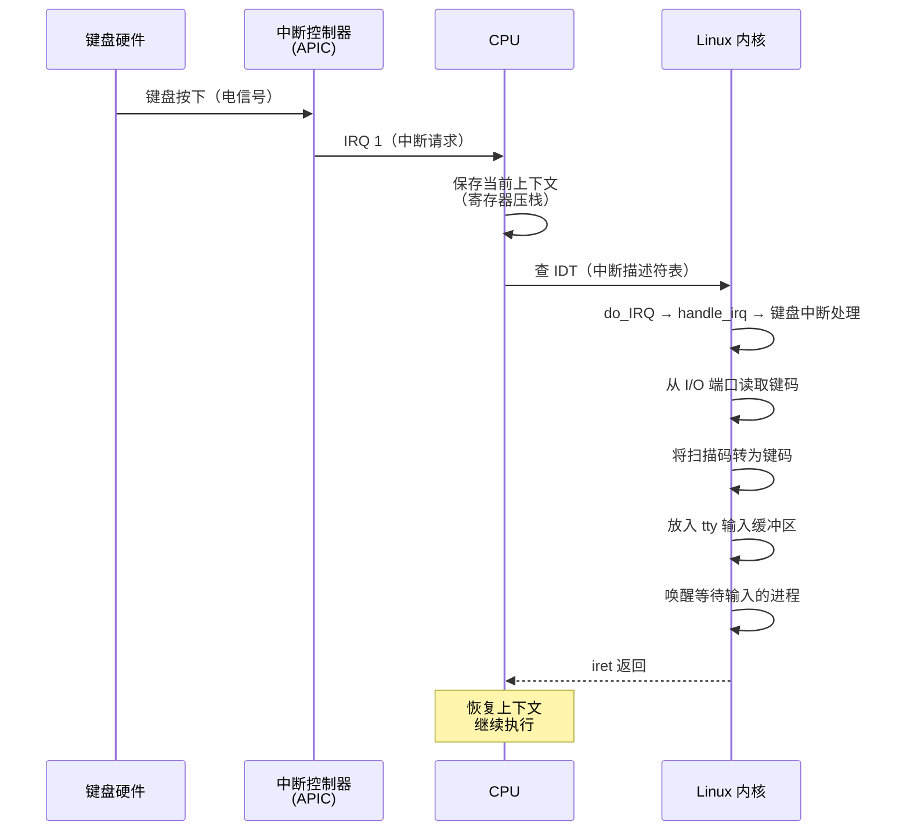
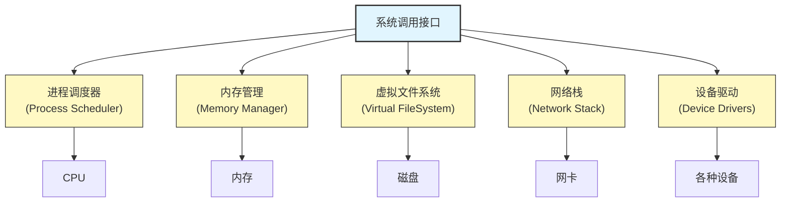
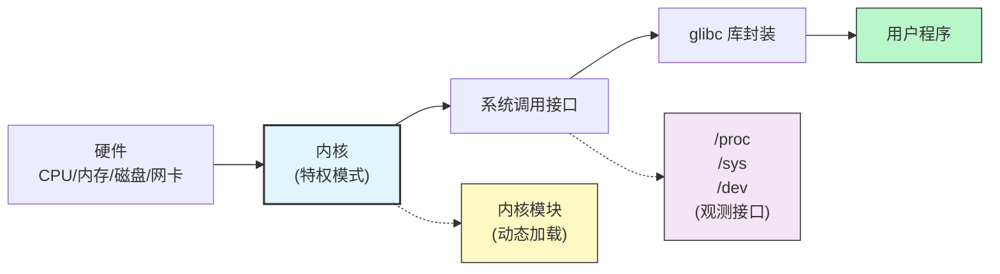

# 27 - 操作系统概述与结构

> 操作系统是计算机系统中最底层的软件，它既是硬件的资源管理器，也是用户与硬件之间的抽象层。理解操作系统的结构，是深入掌握 Linux 乃至任何计算机系统的基石。本章以 Linux 为核心实例，将操作系统原理的抽象概念具象化。

---

## 27.1 什么是操作系统

### 操作系统 = 资源管理器 + 抽象层



操作系统承担两个核心角色：

| 角色 | 说明 | 在 Linux 中的体现 |
|------|------|-------------------|
| **资源管理器** | 管理 CPU 时间、内存空间、I/O 设备、文件存储，在竞争进程间公平分配 | CFS 调度器、buddy 内存分配器、VFS 文件系统 |
| **抽象层** | 将复杂的硬件操作封装为简洁的接口，使用户程序不直接操作物理硬件 | 系统调用、`/dev` 设备文件、`/proc` 虚拟文件系统 |

> **核心洞察**：操作系统本质上解决的是"共享"与"隔离"的矛盾——既要让多个程序高效地共享硬件资源，又要保证它们彼此不干扰。Linux 通过内核态/用户态分离、虚拟内存、权限系统等多层机制共同实现这一目标。

---

## 27.2 操作系统的历史演进

### 从手工到批处理

| 阶段 | 年代 | 特征 | 核心问题 |
|------|------|------|---------|
| **手工操作** | 1940s | 程序员直接操作开关和插线板 | 人机速度严重不匹配 |
| **批处理系统** | 1950s | 将多个作业编组，由常驻监控程序顺序执行 | 内存划分保护、中断处理 |
| **多道批处理** | 1960s | 内存中同时驻留多道作业，CPU 在 I/O 等待时切换 | 资源争抢、作业调度 |
| **分时系统** | 1960s-70s | 多个用户通过终端同时交互，CPU 时间片轮转 | CTSS、Multics、Unix |

### Unix 的诞生与 Linux 的继承

```
1969: Ken Thompson 在 PDP-7 上编写 Unix（汇编）
1972: Dennis Ritchie 发明 C 语言，Unix 用 C 重写
1977: BSD（Berkeley Software Distribution）出现
1983: Richard Stallman 启动 GNU 项目
1987: Andrew Tanenbaum 发布 Minix（教学用）
1991: Linus Torvalds 发布 Linux 0.01
```

> Unix 哲学的核心原则在 Linux 中完整保留：**一切皆文件**、**小而专一的工具**、**管道组合**。这些设计理念至今仍是 Linux 生态的基石。

### 现代操作系统的四大趋势



---

## 27.3 内核空间与用户空间

### 两级权限模型

现代 CPU 通过保护环（Protection Ring）实现权限分级：



在 Linux 中，大量信息暴露于 `/proc` 文件系统，以可读形式展示内核空间与用户空间的界限：

```bash
# 内核空间占用的物理内存（不可换出）
cat /proc/meminfo | grep -E "KernelStack|Slab|PageTables"

# 当前进程在用户态和内核态的 CPU 耗时
cat /proc/$$/stat | awk '{print "utime:",$14,"stime:",$15}'
# utime = 用户态 tick 数，stime = 内核态 tick 数

# 查看系统调用统计
cat /proc/syscalls 2>/dev/null || echo "需要 CONFIG_SYSCALL_STATS"
```

**上下文切换** 是用户空间与内核空间之间最核心的性能开销：

```bash
# 查看上下文切换次数
grep ctxt /proc/$$/status
# voluntary_ctxt_switches: 主动切换（如等待 I/O）
# nonvoluntary_ctxt_switches: 被动切换（时间片耗尽）

# 系统级别的上下文切换统计
vmstat 1 5
# cs 列：每秒上下文切换次数
```

---

## 27.4 内核架构：单体 vs 微内核 vs 混合

### 三种经典架构对比





| 特性 | 单体内核 (Linux) | 微内核 (seL4 / QNX) | 混合内核 (Windows / macOS) |
|------|------------------|---------------------|---------------------------|
| **核心思想** | 所有服务在内核态运行 | 最小化内核，大部分服务在用户态 | 微内核结构，但关键服务在内核态 |
| **性能** | 函数调用，快速 | IPC 通信，相对慢 | 折中 |
| **稳定性** | 一个驱动崩溃可能拖垮内核 | 服务崩溃不影响内核 | 折中 |
| **可扩展性** | 编译时选择模块 | 服务可以热替换 | 模块化 |
| **代表系统** | Linux, Unix, BSD | Minix, QNX, seL4, GNU Hurd | Windows NT, macOS (XNU) |

### Linux 内核模块：单体内核的灵活性

Linux 虽然是单体内核，但通过 **可加载内核模块（LKM）** 实现了灵活扩展：

```bash
# 查看已加载的内核模块
lsmod | head -20
# 输出：模块名、大小、被哪些模块依赖

# 查看模块信息
modinfo ext4
# 输出：路径、描述、许可协议、依赖、参数

# 动态加载模块（例如 loop 设备）
sudo modprobe loop

# 查看模块参数
cat /sys/module/ext4/parameters/ 2>/dev/null && ls /sys/module/ext4/parameters/

# 动态卸载模块
sudo modprobe -r loop
```

```c
// 一个最小的内核模块示例 (hello.c)
#include <linux/module.h>
#include <linux/kernel.h>

MODULE_LICENSE("GPL");
MODULE_AUTHOR("Student");
MODULE_DESCRIPTION("A minimal kernel module");

static int __init hello_init(void) {
    printk(KERN_INFO "Hello from kernel space!\n");
    return 0;
}

static void __exit hello_exit(void) {
    printk(KERN_INFO "Goodbye from kernel space!\n");
}

module_init(hello_init);
module_exit(hello_exit);
```

> Linux 的单体内核架构选择体现了 **实用主义**：虽然微内核在理论上更优雅，但单体内核通过函数调用避免 IPC 开销，获得了更高的性能。内核模块机制又在保持性能的同时提供了模块化能力。详见 [[36-Linux内核基础与模块]]。

---

## 27.5 系统调用：用户空间冲向内核的桥梁

### 系统调用原理

当用户程序需要执行特权操作（读写文件、创建进程、网络通信等），必须通过系统调用请求内核代为执行：



### 常见系统调用

| 系统调用 | 函数 | 类别 | 说明 |
|---------|------|------|------|
| `read` | `read(fd, buf, count)` | 文件 I/O | 从文件描述符读取数据 |
| `write` | `write(fd, buf, count)` | 文件 I/O | 向文件描述符写入数据 |
| `open` | `open(pathname, flags, mode)` | 文件 I/O | 打开或创建文件 |
| `close` | `close(fd)` | 文件 I/O | 关闭文件描述符 |
| `fork` | `fork()` | 进程管理 | 创建子进程 |
| `execve` | `execve(path, argv, envp)` | 进程管理 | 执行新程序 |
| `exit` | `exit(status)` | 进程管理 | 终止进程 |
| `wait` | `waitpid(pid, status, options)` | 进程管理 | 等待子进程状态变化 |
| `mmap` | `mmap(addr, length, prot, flags, fd, offset)` | 内存管理 | 映射文件或匿名内存 |
| `brk` | `brk(addr)` | 内存管理 | 修改数据段大小 |
| `clone` | `clone(fn, stack, flags, arg)` | 进程/线程 | 创建新进程或线程 |

### 在 Linux 中追踪系统调用

```bash
# strace: 追踪进程的系统调用
strace -c ls /tmp          # 统计汇总
strace -e trace=open,close ls   # 只看文件打开/关闭
strace -p $(pgrep nginx) -f     # 附加到正在运行的进程

# 示例输出片段（strace ls）
# openat(AT_FDCWD, "/etc/ld.so.cache", O_RDONLY|O_CLOEXEC) = 3
# mmap(NULL, 8192, PROT_READ|PROT_WRITE, ...) = 0x7f1234567000
# write(1, "file1  file2\n", 13) = 13

# perf: 统计系统调用频率
sudo perf stat -e 'syscalls:sys_enter_*' -- ls 2>&1

# /proc 接口查看系统调用表
cat /proc/kallsyms | grep sys_call_table
```

---

## 27.6 中断与异常：当按下键盘时发生了什么

### 中断处理流程



### 中断与异常的区别

| 类型 | 来源 | 同步/异步 | 示例 |
|------|------|----------|------|
| **中断（Interrupt）** | 外部硬件 | 异步 | 键盘输入、网卡收包、磁盘 I/O 完成 |
| **异常（Exception）** | CPU 执行指令 | 同步 | 除零错误、缺页（page fault）、非法指令 |
| **软中断（Software Interrupt）** | int/syscall 指令 | 同步 | 系统调用、调试断点 |

### Linux 中的中断观测

```bash
# 查看所有中断统计
cat /proc/interrupts
# 输出列：IRQ号 CPU0计数 CPU1计数 ... 中断控制器 设备名
# IRQ 1: 键盘中断
# IRQ 12: 鼠标中断

# 查看中断的实时变化
watch -n 1 cat /proc/interrupts

# 查看软中断统计
cat /proc/softirqs
# 输出：HI(高优先级tasklet) TIMER NET_TX NET_RX BLOCK ...
```

---

## 27.7 Linux 内核架构概览

### 五大子系统



### 各子系统详解

#### 进程调度器（Process Scheduler）

负责 CPU 时间分配。Linux 使用 **CFS（完全公平调度器）**：

```bash
# 查看当前调度器的信息
cat /proc/sched_debug | head -80

# 查看特定进程的调度详情
cat /proc/$$/sched
# se.sum_exec_runtime: 总运行时间
# se.vruntime: 虚拟运行时间（CFS 的核心排序键）

# 查看进程的调度策略
chrt -p $$
# pid 12345's current scheduling policy: SCHED_OTHER
# pid 12345's current scheduling priority: 0
```

详见 [[31-处理机调度]]。

#### 内存管理（Memory Manager）

负责分配物理内存、管理虚拟地址空间、处理缺页：

```bash
# 查看内存区域分布
cat /proc/meminfo
# MemTotal, MemFree, Cached, SwapTotal, ...

# 查看进程地址空间布局
cat /proc/$$/maps | head -20
# 输出示例：
# 555555554000-555555555000 r--p ... /usr/bin/bash   (代码段)
# 555555555000-5555555a0000 r-xp ... /usr/bin/bash   (代码段可执行)
# 5555555a0000-5555555c4000 r--p ... /usr/bin/bash   (只读数据)
# 7ffff7c00000-7ffff7c28000 r--p ... /usr/lib/libc.so

# 查看大页信息
grep Huge /proc/meminfo
```

详见 [[32-存储管理]] 和 [[33-虚拟存储与页面置换]]。

#### 虚拟文件系统（VFS）

为不同类型的文件系统提供统一接口：

```bash
# 查看当前支持的文件系统
cat /proc/filesystems
# nodev sysfs
# nodev proc
#       ext4
#       btrfs
#       xfs

# 查看挂载点与文件系统类型
findmnt -t ext4,xfs,btrfs

# VFS 的核心数据结构可通过代码查看
# include/linux/fs.h: struct super_block, struct inode, struct file
```

详见 [[34-文件系统设计]] 和 [[40-文件系统深入]]。

#### 网络栈（Network Stack）

实现 TCP/IP 协议族：

```bash
# 查看网络协议统计
cat /proc/net/snmp       # SNMP MIB
cat /proc/net/netstat    # 网络统计扩展
cat /proc/net/sockstat   # 各类套接字使用量

# 查看路由表
cat /proc/net/route
ip route show

# 查看网络设备
cat /proc/net/dev
```

#### 设备驱动（Device Drivers）

内核中最大的代码体，约占总代码量的 60%：

```bash
# 查看已加载驱动的设备
cat /proc/devices
# Character devices 和 Block devices 两大类

# 查看 PCI 设备
lspci -k | head -20
# -k 显示每块设备使用的驱动

# 通过 sysfs 查看设备树
ls /sys/devices/
```

详见 [[35-I-O设备管理]] 和 [[41-硬件驱动与设备管理]]。

---

## 27.8 POSIX 标准

### 什么是 POSIX

POSIX（Portable Operating System Interface）由 IEEE 制定（IEEE Std 1003），旨在定义操作系统应有的标准接口，确保程序可以在不同 Unix-like 系统间移植。

| 标准 | 内容 |
|------|------|
| POSIX.1 (1003.1) | 基础系统接口：进程、信号、文件 I/O、管道 |
| POSIX.1b (1003.1b) | 实时扩展：信号量、消息队列、共享内存、定时器 |
| POSIX.1c (1003.1c) | 线程扩展：pthread |
| POSIX.2 (1003.2) | Shell 和工具 |

### Linux 的 POSIX 兼容性

```bash
# 检查 glibc 是否提供 POSIX 兼容的接口
man 7 posixoptions

# 获取系统支持的 POSIX 选项
getconf -a | grep POSIX
# POSIX_V7_ILP32_OFF32  支持
# POSIX_V7_ILP32_OFFBIG 支持
# ...

# 查看系统是否遵循 LSB（Linux Standard Base）
lsb_release -a 2>/dev/null || echo "Arch Linux 默认不安装 lsb-release"
```

> POSIX 是 Linux 生态便携性的基石。C 程序员依赖的 `unistd.h`、`fcntl.h`、`pthread.h` 等头文件均源自 POSIX 规范。跨 Unix 平台开发的 C 程序，只要遵循 POSIX，理论上在 Linux、macOS、FreeBSD 上均可编译运行。

---

## 27.9 内核版本与源码

### 理解内核版本号

```
6.12.8-arch1-1
│  │  │    │
│  │  │    └── 发行版补丁版本
│  │  └────── 稳定版修正号
│  └───────────── 次版本号（奇数=开发版，偶数=稳定版，Linux 2.6 之后取消此约定）
└──────────────── 主版本号
```

```bash
# 查看完整版本信息
uname -r
cat /proc/version

# 内核编译配置
zcat /proc/config.gz 2>/dev/null | head -50 || \
zcat /proc/config.gz 2>/dev/null | head -50 || \
echo "CONFIG 文件在 /boot/config-$(uname -r)"

# 查看编译时使用的编译器
cat /proc/version
# Linux version 6.9.7-arch1-1 (linux@archlinux) (gcc (GCC) 14.1.1) #1 SMP PREEMPT_DYNAMIC ...
```

### 浏览内核源码（在线与本地）

```bash
# Arch Linux 的方法：用 asp 获取 PKGBUILD
asp export linux

# 或者直接下载 tarball
# 内核源码位于 kernel.org
# 在线浏览：https://elixir.bootlin.com/linux/latest/source

# 查看模块源码结构
# fs/          — 文件系统
# mm/          — 内存管理
# kernel/      — 核心调度
# net/         — 网络栈
# drivers/     — 设备驱动（最大子目录）
# arch/        — 架构相关代码
# include/     — 头文件
```

详见 [[22-内核编译与定制]]。

---

## 27.10 核心概念速查



| 概念 | 一句话解释 | 观测命令 |
|------|-----------|---------|
| 内核空间 | CPU Ring 0，可直接访问硬件 | `cat /proc/meminfo \| grep Kernel` |
| 用户空间 | CPU Ring 3，受限权限 | `cat /proc/$$/stat` |
| 系统调用 | 用户程序请求内核服务的唯一入口 | `strace ls` |
| 中断 | 硬件通知 CPU 的异步信号 | `cat /proc/interrupts` |
| 上下文切换 | 在两个进程或线程间切换 CPU | `vmstat 1` |
| 内核模块 | 可动态加载的内核代码 | `lsmod` |
| POSIX | 操作系统可移植接口标准 | `getconf -a` |
| VFS | 文件系统抽象层 | `cat /proc/filesystems` |

---

## 相关链接

- [[28-进程与线程]] — 了解进程的生命周期与线程模型
- [[08-进程管理]] — 日常进程管理命令与技巧
- [[31-处理机调度]] — CPU 调度算法与 Linux CFS
- [[32-存储管理]] — 物理内存与虚拟内存管理
- [[34-文件系统设计]] — 文件系统原理与 Linux VFS
- [[35-I-O设备管理]] — I/O 子系统与设备驱动
- [[36-Linux内核基础与模块]] — 内核模块深入开发
- [[22-内核编译与定制]] — 从源码编译自定义内核
- [[18-Linux基础与文件系统路径]] — 用户空间基础与 FHS
