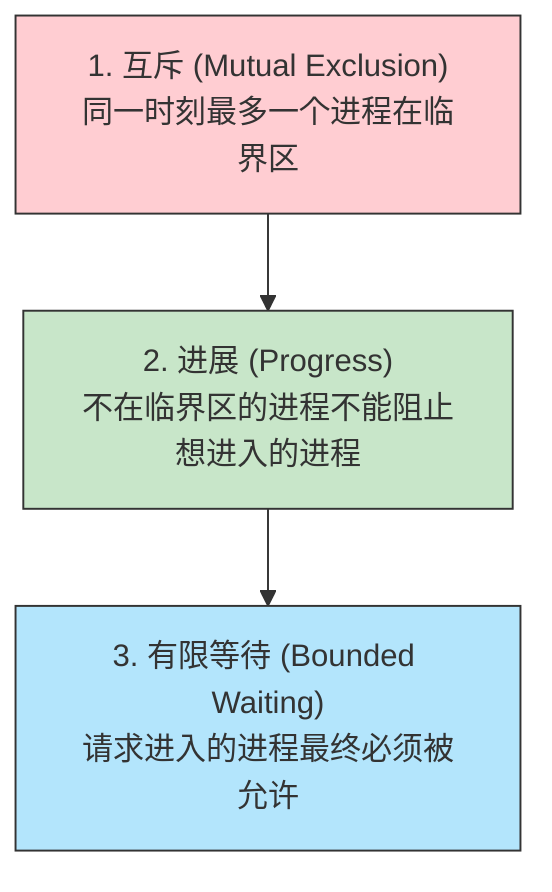
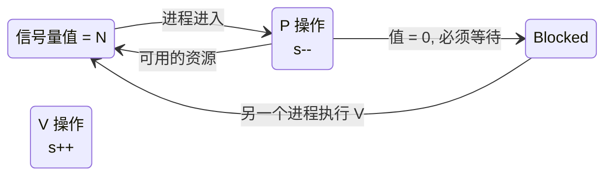
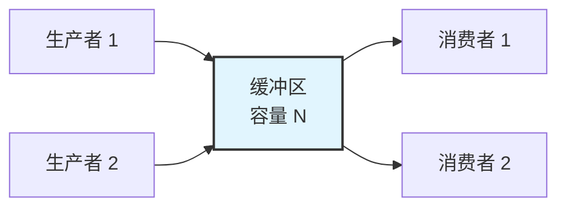
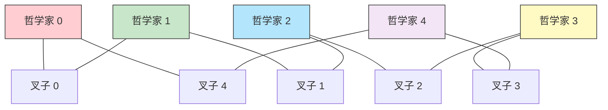
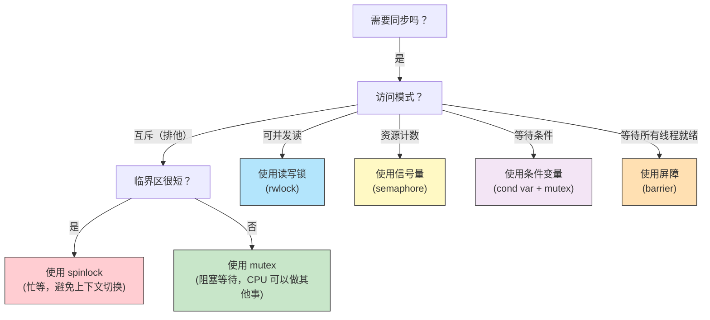

# 29 - 进程同步与互斥

> 多个进程或线程并发访问共享资源时，如果不加控制，数据的完整性就会遭到破坏——这就是竞态条件（Race Condition）。进程同步与互斥是操作系统中最精妙的设计之一，本章从经典理论出发，逐一落实到 Linux 的 POSIX 同步原语实现。

---

## 29.1 竞态条件：当并发遇见共享

### 一个致命的数据竞争

```c
// 两个线程同时执行 counter++
// counter++ 实际包含三步操作：
// 1. 从内存读取 counter 到寄存器
// 2. 寄存器值加 1
// 3. 将寄存器值写回内存
//
// 如果两个线程交错执行（线程A读 → 线程B读 → A写 → B写）
// 两次 ++ 操作只让 counter 增加了 1，而非 2
```

```bash
# 用 bash 演示竞态条件（并发向同一文件追加）
cat > /tmp/race.sh << 'EOF'
#!/bin/bash
file=/tmp/race_counter.txt
echo 0 > $file

inc() {
 for i in {1..1000}; do
 val=$(cat $file)
 echo $((val + 1)) > $file
 done
}

inc & inc &
wait
echo "Expected: 2000, Got: $(cat $file)"
EOF
bash /tmp/race.sh
# 典型输出：Expected: 2000, Got: 1024（远少于预期！）
```

> 竞态条件的根本问题：**操作的原子性被破坏**。Mutex、信号量等同步原语就是让临界区重新变得"看起来像原子的"。

---

## 29.2 临界区问题

### 临界区的三个条件

任何临界区问题的解决方案都必须满足：



### 临界区的代码结构

```c
// 临界区标准写法
do {
 // ===== 进入区 (Entry Section) =====
 // 请求进入临界区的权限
 
 // ===== 临界区 (Critical Section) =====
 // 访问共享资源
 
 // ===== 退出区 (Exit Section) =====
 // 释放临界区的权限
 
 // ===== 剩余区 (Remainder Section) =====
 // 其他不访问共享资源的代码
} while (true);
```

---

## 29.3 Peterson 解法：纯软件的互斥

Peterson 算法是为两个进程设计的纯软件互斥方案，无需任何硬件支持：

```c
#include <stdbool.h>
#include <stdio.h>
#include <pthread.h>
#include <unistd.h>

bool flag[2] = {false, false}; // 进程 i 想进入临界区
int turn; // 轮到谁了

void *process(void *arg) {
 int i = *(int *)arg; // 0 或 1
 int j = 1 - i; // 对方
 
 for (int round = 0; round < 100000; round++) {
 // ===== 进入区 =====
 flag[i] = true; // 声明请求
 turn = j; // 谦让对方
 while (flag[j] && turn == j); // 等待对方
 
 // ===== 临界区 =====
 // ... 访问共享资源 ...
 
 // ===== 退出区 =====
 flag[i] = false; // 释放
 
 // ===== 剩余区 =====
 }
 return NULL;
}
```

**Peterson 的局限性**：
- 仅适用于两个进程
- 需要 `flag` 数组和 `turn` 变量的读写有序（依赖内存屏障）
- 在现代编译器优化和乱序执行的 CPU 上需要额外的内存屏障指令

---

## 29.4 硬件同步支持

### Test-and-Set 指令

```c
// 伪代码：硬件原子操作
bool test_and_set(bool *lock) {
 bool old = *lock;
 *lock = true; // 设置为 true
 return old; // 返回旧值
}

// 互斥锁的简单实现
bool lock = false;

void acquire(bool *lock) {
 while (test_and_set(lock)); // 自旋等待
}

void release(bool *lock) {
 *lock = false;
}
```

### Compare-and-Swap（CAS）

```c
// 伪代码：比较并交换
bool compare_and_swap(int *value, int expected, int new_value) {
 if (*value == expected) {
 *value = new_value;
 return true;
 }
 return false;
}
// CAS 是实现无锁数据结构（lock-free queue/stack）的基础
```

### Linux 中的原子操作

```bash
# GCC 内建的原子操作（不需要 <stdatomic.h>）
# __sync_fetch_and_add, __sync_bool_compare_and_swap 等

# 查看 /usr/include/ 中的原子操作头文件
grep -r "atomic" /usr/include/stdc-predef.h 2>/dev/null

# 内核中使用的原子类型和操作
# include/linux/atomic.h: atomic_t, atomic64_t
# 硬件层面：x86 使用 LOCK 前缀指令、ARM 使用 LDREX/STREX
```

---

## 29.5 互斥锁（Mutex）

### pthread_mutex 详解

```c
#include <pthread.h>
#include <stdio.h>

pthread_mutex_t mutex = PTHREAD_MUTEX_INITIALIZER;
int shared_counter = 0;

void *increment(void *arg) {
 int n = *(int *)arg;
 for (int i = 0; i < n; i++) {
 pthread_mutex_lock(&mutex);
 shared_counter++; // 临界区：安全
 pthread_mutex_unlock(&mutex);
 }
 return NULL;
}

int main() {
 pthread_t t1, t2;
 int n = 1000000;
 pthread_create(&t1, NULL, increment, &n);
 pthread_create(&t2, NULL, increment, &n);
 pthread_join(t1, NULL);
 pthread_join(t2, NULL);
 printf("Counter: %d (expected %d)\n", shared_counter, n * 2);
 // Counter: 2000000 (expected 2000000) — 完全正确
 return 0;
}
```

### Mutex 类型

| 类型 | 行为 | 使用场景 |
|------|------|---------|
| `PTHREAD_MUTEX_NORMAL` | 不检测死锁，重复锁定导致死锁 | 快速但不安全 |
| `PTHREAD_MUTEX_ERRORCHECK` | 重复锁定返回错误 | 调试、检测逻辑错误 |
| `PTHREAD_MUTEX_RECURSIVE` | 同一线程可重复锁定（需等次数解锁） | 递归函数中的锁定 |
| `PTHREAD_MUTEX_DEFAULT` | 未定义行为（Linux 实现为 NORMAL） | 标准用法 |

```c
// 递归锁示例
pthread_mutex_t rec_mutex;
pthread_mutexattr_t attr;
pthread_mutexattr_init(&attr);
pthread_mutexattr_settype(&attr, PTHREAD_MUTEX_RECURSIVE);
pthread_mutex_init(&rec_mutex, &attr);

void recursive_func(int depth) {
 pthread_mutex_lock(&rec_mutex);
 printf("Depth: %d, locked\n", depth);
 if (depth > 0) recursive_func(depth - 1);
 pthread_mutex_unlock(&rec_mutex);
}
```

### trylock 与非阻塞尝试

```c
// 尝试获取锁，不阻塞
if (pthread_mutex_trylock(&mutex) == 0) {
 // 成功获取，执行临界区
 pthread_mutex_unlock(&mutex);
} else {
 // 锁被占用，做其他事情
 do_alternative_work();
}
```

---

## 29.6 信号量（Semaphore）

### 概念：P 和 V 操作

信号量由 Edsger Dijkstra 于 1965 年提出。P 和 V 来自荷兰语：

| 操作 | 荷兰语 | 含义 | 伪代码 |
|------|--------|------|--------|
| **P (Proberen)** | 尝试 | 等待（如果值 > 0 则减 1，否则阻塞） | `while (s <= 0); s--;` |
| **V (Verhogen)** | 增加 | 信号（值加 1，唤醒一个等待者） | `s++;` |



### POSIX 信号量在 Linux 中的使用

```c
#include <semaphore.h>
#include <pthread.h>
#include <stdio.h>

sem_t sem;
int shared_count = 0;

void *worker(void *arg) {
 for (int i = 0; i < 100000; i++) {
 sem_wait(&sem); // P 操作
 shared_count++;
 sem_post(&sem); // V 操作
 }
 return NULL;
}

int main() {
 sem_init(&sem, 0, 1); // 0=进程内共享, 1=初始值(二进制信号量)
 
 pthread_t t1, t2;
 pthread_create(&t1, NULL, worker, NULL);
 pthread_create(&t2, NULL, worker, NULL);
 pthread_join(t1, NULL);
 pthread_join(t2, NULL);
 
 printf("Count: %d\n", shared_count);
 sem_destroy(&sem);
 return 0;
}
```

### 二进制信号量 vs 计数信号量

| 类型 | 初始值 | 用途 | 等价于 |
|------|--------|------|--------|
| 二进制信号量 | 1 (最大值 1) | 互斥（类似 Mutex） | Mutex（但有区别） |
| 计数信号量 | > 1 | 控制资源池的并发访问 | N 个许可的并发控制 |

> **信号量 vs Mutex**：Mutex 有**所有权**概念（谁锁定谁解锁），信号量则无。Mutex 可用于优先级继承（解决优先级反转），POSIX 信号量则无此机制。

```bash
# 使用信号量保护共享文件的 Bash 示例
# 基于 flock 命令（文件锁，不是 POSIX 信号量，但概念相同）
(
 flock -x 200 # 获取排他锁（P 操作等价）
 echo "$(date): start critical section"
 sleep 1
 echo "$(date): end critical section"
) 200>/tmp/my_lockfile
```

---

## 29.7 经典同步问题

### 问题一：生产者-消费者（Bounded Buffer）



```c
// 使用三个信号量解决生产者-消费者问题
#include <pthread.h>
#include <semaphore.h>
#include <stdio.h>

#define BUFFER_SIZE 10
int buffer[BUFFER_SIZE];
int in = 0, out = 0;

sem_t empty; // 空槽位数（初始 = BUFFER_SIZE）
sem_t full; // 已填充槽位数（初始 = 0）
pthread_mutex_t mutex; // 保护缓冲区访问

void *producer(void *arg) {
 for (int i = 0; i < 100; i++) {
 sem_wait(&empty); // 等待空槽
 pthread_mutex_lock(&mutex);
 buffer[in] = i; // 生产
 in = (in + 1) % BUFFER_SIZE;
 printf("Produced: %d\n", i);
 pthread_mutex_unlock(&mutex);
 sem_post(&full); // 信号：有数据了
 }
 return NULL;
}

void *consumer(void *arg) {
 for (int i = 0; i < 100; i++) {
 sem_wait(&full); // 等待数据
 pthread_mutex_lock(&mutex);
 int item = buffer[out]; // 消费
 out = (out + 1) % BUFFER_SIZE;
 printf("Consumed: %d\n", item);
 pthread_mutex_unlock(&mutex);
 sem_post(&empty); // 信号：有空槽了
 }
 return NULL;
}
```

### 问题二：读者-写者

```c
// 读者优先策略（读者可以同时读取，写者互斥）
pthread_mutex_t rw_mutex = PTHREAD_MUTEX_INITIALIZER;
pthread_mutex_t mutex = PTHREAD_MUTEX_INITIALIZER;
int read_count = 0;

void *reader(void *arg) {
 pthread_mutex_lock(&mutex);
 read_count++;
 if (read_count == 1) // 第一个读者锁定资源
 pthread_mutex_lock(&rw_mutex);
 pthread_mutex_unlock(&mutex);

 // --- 读操作 ---
 printf("Reading data: %d\n", shared_data);

 pthread_mutex_lock(&mutex);
 read_count--;
 if (read_count == 0) // 最后一个读者释放资源
 pthread_mutex_unlock(&rw_mutex);
 pthread_mutex_unlock(&mutex);
 return NULL;
}

void *writer(void *arg) {
 pthread_mutex_lock(&rw_mutex);

 // --- 写操作 ---
 shared_data++;
 printf("Writing data: %d\n", shared_data);

 pthread_mutex_unlock(&rw_mutex);
 return NULL;
}
```

### 问题三：哲学家就餐



```c
// 用限制同时就餐人数避免死锁
#include <semaphore.h>
#define N 5

sem_t chopsticks[N];
sem_t dining_limit; // 最多 N-1 人同时就餐

void *philosopher(void *arg) {
 int i = *(int *)arg;
 while (1) {
 think(i);
 
 sem_wait(&dining_limit); // 限制人数
 sem_wait(&chopsticks[i]); // 拿左边叉子
 sem_wait(&chopsticks[(i+1)%N]); // 拿右边叉子
 
 eat(i);
 
 sem_post(&chopsticks[i]);
 sem_post(&chopsticks[(i+1)%N]);
 sem_post(&dining_limit);
 }
 return NULL;
}
```

### 问题四：睡眠理发师

```c
// 一个理发师，N 把椅子，顾客和理发师之间的同步
#define CHAIRS 5

sem_t customers = {0}; // 等待中的顾客数
sem_t barber = {0}; // 理发师是否可用
pthread_mutex_t mutex;
int waiting = 0; // 当前等待人数

void *barber_func(void *arg) {
 while (1) {
 sem_wait(&customers); // 等顾客（没顾客就睡）
 pthread_mutex_lock(&mutex);
 waiting--;
 pthread_mutex_unlock(&mutex);
 sem_post(&barber); // 唤一个顾客
 
 cut_hair(); // 理发
 }
}

void *customer_func(void *arg) {
 pthread_mutex_lock(&mutex);
 if (waiting < CHAIRS) {
 waiting++;
 sem_post(&customers); // 通知理发师有顾客
 pthread_mutex_unlock(&mutex);
 sem_wait(&barber); // 等待被理发师唤入
 get_haircut();
 } else {
 pthread_mutex_unlock(&mutex);
 leave(); // 没位置，走了
 }
}
```

---

## 29.8 管程（Monitor）与条件变量

### 管程的概念

管程是比信号量更高级的同步抽象，将共享数据、操作和同步条件封装在一起：

```java
// 管程的思想（以 Java 为例）
class BoundedBuffer {
 private int[] buffer = new int[10];
 private int count = 0, in = 0, out = 0;
 
 public synchronized void put(int item) throws InterruptedException {
 while (count == buffer.length) wait(); // 缓冲区满，等待
 buffer[in] = item;
 in = (in + 1) % buffer.length;
 count++;
 notifyAll(); // 唤醒消费者
 }
 
 public synchronized int take() throws InterruptedException {
 while (count == 0) wait(); // 缓冲区空，等待
 int item = buffer[out];
 out = (out + 1) % buffer.length;
 count--;
 notifyAll(); // 唤醒生产者
 return item;
 }
}
```

### Linux 中的条件变量（pthread_cond）

```c
#include <pthread.h>
#include <stdio.h>

pthread_mutex_t mutex = PTHREAD_MUTEX_INITIALIZER;
pthread_cond_t cond = PTHREAD_COND_INITIALIZER;
int ready = 0;

void *waiter(void *arg) {
 pthread_mutex_lock(&mutex);
 while (!ready) { // 用 while 而非 if (防虚假唤醒)
 pthread_cond_wait(&cond, &mutex);// 原子地释放 mutex 并等待
 }
 printf("Waiter: proceeding\n");
 pthread_mutex_unlock(&mutex);
 return NULL;
}

void *signaler(void *arg) {
 sleep(1);
 pthread_mutex_lock(&mutex);
 ready = 1;
 pthread_cond_signal(&cond); // 唤醒一个等待者
 // pthread_cond_broadcast(&cond); // 唤醒所有等待者
 pthread_mutex_unlock(&mutex);
 return NULL;
}
```

> **为什么用 `while (!condition)` 而不是 `if (!condition)`？** 因为可能存在**虚假唤醒（Spurious Wakeup）**——条件变量被唤醒但条件并未满足（例如被信号中断）。`while` 循环确保唤醒后重新检查条件。

---

## 29.9 Linux 同步工具全景

### 用户空间同步原语一览

| 原语 | 头文件 | 初始化 | 获取 | 释放 |
|------|--------|--------|------|------|
| pthread_mutex | `<pthread.h>` | `PTHREAD_MUTEX_INITIALIZER` | `pthread_mutex_lock()` | `pthread_mutex_unlock()` |
| pthread_rwlock | `<pthread.h>` | `PTHREAD_RWLOCK_INITIALIZER` | `pthread_rwlock_rdlock/wrlock()` | `pthread_rwlock_unlock()` |
| pthread_spinlock | `<pthread.h>` | `pthread_spin_init()` | `pthread_spin_lock()` | `pthread_spin_unlock()` |
| pthread_cond | `<pthread.h>` | `PTHREAD_COND_INITIALIZER` | `pthread_cond_wait()` | `pthread_cond_signal()` |
| POSIX semaphore | `<semaphore.h>` | `sem_init()` | `sem_wait()` | `sem_post()` |
| pthread_barrier | `<pthread.h>` | `pthread_barrier_init()` | `pthread_barrier_wait()` | (自动释放) |
| futex | `<linux/futex.h>` | 通过 `syscall(SYS_futex)` | FUTEX_WAIT | FUTEX_WAKE |

### futex：Linux 锁性能的秘密武器

```c
// futex (Fast Userspace muTEX) 是 Linux 特有的机制
// 它在无竞争时完全在用户空间完成锁定（原子操作）
// 只在有竞争时才进入内核进行等待

// 伪代码：基于 futex 的 mutex 实现
void mutex_lock(int *lock) {
 if (atomic_cas(lock, 0, 1)) return; // 无竞争，快速路径（用户态）
 
 // 有竞争，进入内核等待
 while (1) {
 if (atomic_cas(lock, 0, 1)) return;
 futex(lock, FUTEX_WAIT, 1, NULL); // 内核态等待
 }
}

void mutex_unlock(int *lock) {
 atomic_set(lock, 0);
 futex(lock, FUTEX_WAKE, 1); // 唤醒一个等待者
}
```

```bash
# 查看 futex 相关的系统调用
strace -e futex ./threaded_app 2>&1 | head -10

# 查看 futex 的等待情况
cat /proc/locks | head -10
```

---

## 29.10 选择同步原语的决策树



> **核心经验**：默认使用 mutex；在需要频繁读写的场景使用 rwlock；在资源池管理场景使用信号量；在需要等待某个条件成熟的场景使用条件变量。永远优先考虑现有的库函数，而不是自己实现同步原语——因为正确的实现需要考虑内存序、false sharing、优先级反转等大量细节。

---

## 相关链接

- [[28-进程与线程]] — 进程与线程的基础概念
- [[30-死锁]] — 同步不当导致的死锁问题
- [[31-处理机调度]] — CPU 调度与优先级反转
- [[16-Bash编程基础]] — Shell 编程中的并发控制

