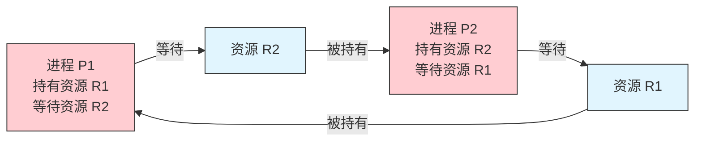
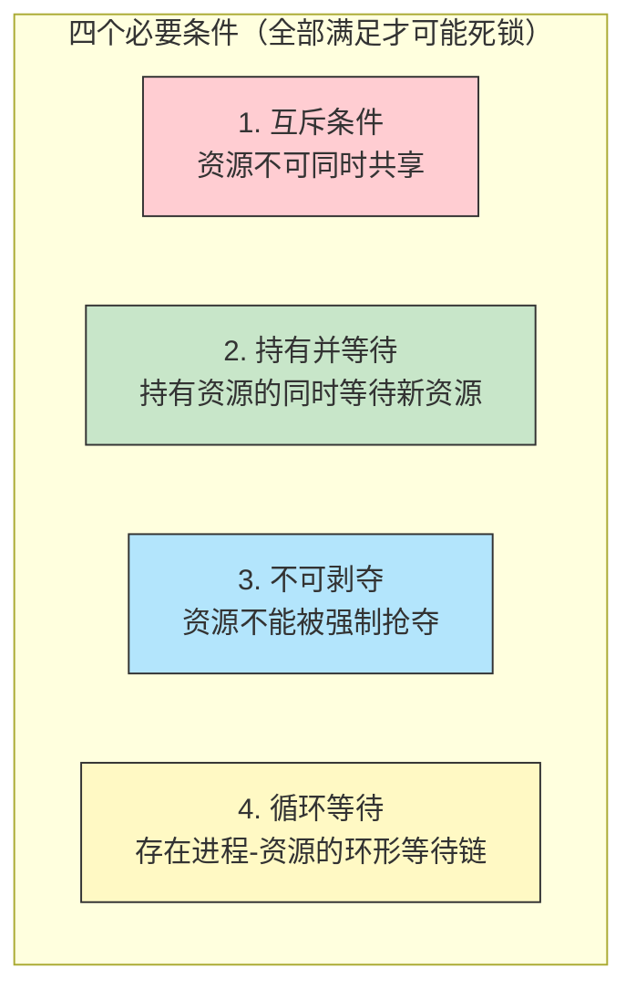
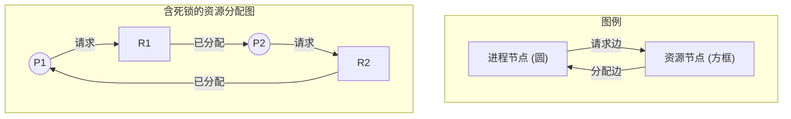

# 30 - 死锁

> 当多个进程各自持有资源并互相等待对方释放资源时，系统就陷入了死锁——一种谁也动不了的僵局。死锁是并发编程中最令人头疼的问题之一，操作系统理论为此提供了系统的分析框架和解决策略。

---

## 30.1 死锁的定义与特征

### 什么是死锁

死锁（Deadlock）是一组进程中每个进程都在等待一个只有该组中其他进程才能触发的事件（通常是释放资源），从而导致所有进程都无法推进的状态。



### 用代码制造一个死锁

```c
#include <stdio.h>
#include <pthread.h>
#include <unistd.h>

pthread_mutex_t mutex_A = PTHREAD_MUTEX_INITIALIZER;
pthread_mutex_t mutex_B = PTHREAD_MUTEX_INITIALIZER;

void *thread1_func(void *arg) {
 pthread_mutex_lock(&mutex_A);
 printf("Thread 1: locked A\n");
 sleep(1); // 确保 thread2 先锁定 B
 
 pthread_mutex_lock(&mutex_B); // 等待 B（但 B 被 thread2 持有了）
 printf("Thread 1: locked B\n"); // 永远不会执行到这
 
 pthread_mutex_unlock(&mutex_B);
 pthread_mutex_unlock(&mutex_A);
 return NULL;
}

void *thread2_func(void *arg) {
 pthread_mutex_lock(&mutex_B);
 printf("Thread 2: locked B\n");
 sleep(1); // 确保 thread1 先锁定 A
 
 pthread_mutex_lock(&mutex_A); // 等待 A（但 A 被 thread1 持有了）
 printf("Thread 2: locked A\n"); // 永远不会执行到这
 
 pthread_mutex_unlock(&mutex_A);
 pthread_mutex_unlock(&mutex_B);
 return NULL;
}

int main() {
 pthread_t t1, t2;
 pthread_create(&t1, NULL, thread1_func, NULL);
 pthread_create(&t2, NULL, thread2_func, NULL);
 pthread_join(t1, NULL); // 永远不会返回
 pthread_join(t2, NULL);
 return 0;
}
```

```bash
# 编译并运行（按 Ctrl+C 退出）
gcc -pthread -o /tmp/deadlock /tmp/deadlock.c
timeout 5 /tmp/deadlock
# Thread 1: locked A
# Thread 2: locked B
# ... 然后卡死（timeout 5 秒后强制退出）
```

---

## 30.2 死锁的四个必要条件

死锁的四个条件是 **必要且充分** 的——全部满足则必然死锁，缺一个则不死锁：



| 条件 | 含义 | 打破方法 |
|------|------|---------|
| 互斥 | 共享资源必须互斥访问 | 用共享访问替代互斥（如读锁、Copy-on-Write） |
| 持有并等待 | 进程已持有资源却继续请求新资源 | 一次性申请所有资源，或请求前释放已有资源 |
| 不可剥夺 | 资源只能由持有者自愿释放 | 允许系统强制回收资源（如 Linux OOM Killer） |
| 循环等待 | P0 → P1 → P2 → ... → P0 形成环 | 资源分配按全局顺序（总是先锁 A 再锁 B） |

> **核心策略**：四个条件中，循环等待是最容易在实践中打破的——只要定义全局锁获取顺序并严格遵守，就可以避免大多数死锁。

---

## 30.3 资源分配图

### 图的构成

资源分配图（Resource Allocation Graph）是分析死锁的可视化工具：



### 判断死锁的存在

- 如果资源分配图中 **没有环** → 无死锁
- 如果每个资源类型只有一个实例 → **有环 ≡ 有死锁**
- 如果资源类型有多个实例 → 有环不一定是死锁（可能有另一个实例可用于打破环）

---

## 30.4 死锁预防：打破四个条件

### 实践中的死锁预防

#### 方法一：打破"持有并等待"

```c
// 灾难模式：逐步获取锁
pthread_mutex_lock(&lockA); // 持有 A
pthread_mutex_lock(&lockB); // 请求 B（可能死锁）

// 预防模式：一次性获取全部
if (pthread_mutex_trylock(&lockA) == 0) {
 if (pthread_mutex_trylock(&lockB) == 0) {
 // 成功获取两个锁
 } else {
 pthread_mutex_unlock(&lockA); // 释放已获取的
 // 稍后重试
 }
}
```

#### 方法二：打破"循环等待"（定序法）

```c
// 坏：顺序不一致导致死锁
void transfer_bad(Account *from, Account *to, int amount) {
 pthread_mutex_lock(&from->lock); // 先锁 from
 pthread_mutex_lock(&to->lock); // 再锁 to
 // ... 如果另一个线程执行 transfer(to, from) 则死锁
}

// 好：按地址排序获取锁
void transfer_good(Account *a, Account *b, int amount) {
 Account *first = (uintptr_t)a < (uintptr_t)b ? a : b;
 Account *second = (uintptr_t)a < (uintptr_t)b ? b : a;
 
 pthread_mutex_lock(&first->lock);
 pthread_mutex_lock(&second->lock);
 // 安全！所有线程都按相同顺序获取锁
 pthread_mutex_unlock(&second->lock);
 pthread_mutex_unlock(&first->lock);
}
```

#### 方法三：Linux 中的 lockdep（内核锁排序检测器）

```bash
# Linux 内核的 lockdep 是一个运行时锁依赖检测系统
# 它通过记录每个锁的获取顺序来发现潜在的循环等待

# 查看 lockdep 是否启用
sudo cat /proc/lockdep 2>/dev/null || echo "需要 CONFIG_LOCKDEP=y"
cat /proc/lockdep_stats 2>/dev/null

# 如果在内核日志中看到 lockdep 警告
sudo dmesg | grep -i "lockdep\|possible circular locking"
# 输出示例：
# [ 123.456] ======================================================
# [ 123.456] WARNING: possible circular locking dependency detected
# [ 123.456] 5.15.0 in lockdep.c:...
# [ 123.456] ------------------------------------------------------
```

---

## 30.5 死锁避免：银行家算法

### 安全状态

系统处于 **安全状态** 当存在一个执行序列，使得所有进程都能运行完成而不引发死锁。银行家算法的核心是 **只在分配后系统仍处于安全状态时才批准请求**。

### 数据结构

| 符号 | 含义 |
|------|------|
| `Available[j]` | 资源 j 的当前可用数量 |
| `Max[i][j]` | 进程 i 对资源 j 的最大需求 |
| `Allocation[i][j]` | 进程 i 已获得资源 j 的数量 |
| `Need[i][j]` = Max - Allocation | 进程 i 还需要的资源 j 数量 |

### 银行家算法详细步骤

```c
// 安全状态检查算法
int is_safe(int n_proc, int n_res, int Available[], int Max[][], 
 int Allocation[][]) {
 int Work[n_res], Finish[n_proc];
 
 // 1. 初始化
 for (int j = 0; j < n_res; j++)
 Work[j] = Available[j];
 for (int i = 0; i < n_proc; i++)
 Finish[i] = 0; // false
 
 int Need[n_proc][n_res];
 for (int i = 0; i < n_proc; i++)
 for (int j = 0; j < n_res; j++)
 Need[i][j] = Max[i][j] - Allocation[i][j];
 
 // 2. 寻找可以满足需求的进程
 int found;
 do {
 found = 0;
 for (int i = 0; i < n_proc; i++) {
 if (!Finish[i]) {
 int can_meet = 1;
 for (int j = 0; j < n_res; j++)
 if (Need[i][j] > Work[j])
 can_meet = 0;
 
 if (can_meet) {
 // 假设该进程完成，释放其资源
 for (int j = 0; j < n_res; j++)
 Work[j] += Allocation[i][j];
 Finish[i] = 1;
 found = 1;
 printf(" Process P%d runs and finishes\n", i);
 }
 }
 }
 } while (found);
 
 // 3. 检查所有进程是否都能完成
 for (int i = 0; i < n_proc; i++)
 if (!Finish[i]) {
 printf("UNSAFE: P%d cannot finish\n", i);
 return 0;
 }
 printf("SAFE: all processes can finish\n");
 return 1;
}
```

### 手动演示例题

```
假设 3 个进程 (P0,P1,P2)，3 种资源 (A,B,C)
Available = [3, 3, 2]

 Allocation Max Need
 A B C A B C A B C
P0 0 1 0 7 5 3 7 4 3
P1 2 0 0 3 2 2 1 2 2
P2 3 0 2 9 0 2 6 0 0

步骤：
1. Work = [3, 3, 2]
2. P1 的 Need [1,2,2] ≤ Work [3,3,2] → P1 完成后释放
 Work = [3,3,2] + P1.Alloc [2,0,0] = [5, 3, 2]
3. P2 的 Need [6,0,0] ≤ Work [5,3,2] 
 P0 的 Need [7,4,3] ≤ Work [5,3,2] 
 P2 的需求中 A=6 > Work.A=5，无法执行 → 但我们刚错了...
 
 重新：P2 Need [6,0,0] 需要 A=6, Work.A=5 → 不够
 检查 P3...没有 P3。那就只能看还剩下...实际上在 [5,3,2] 下：
 P0 Need [7,4,3] → 7>5, 4>3 → 不行
 P2 Need [6,0,0] → 6>5 → 不行
 所以这个序列 [P1→?] 不是安全的！
 
 试试其他顺序：
 从 Available=[3,3,2] 开始，P1 Need [1,2,2] 可满足 → 释放后 Work=[5,3,2]
 P2 Need [6,0,0] 不行，P0 Need [7,4,3] 不行
 
 如果 P0 请求 [0,1,0]，我们要用银行家算法判断是否批准...
```

> 银行家算法在理论上优雅，但在现实操作系统中很少直接实现，原因是：
> 1. 最大资源需求 Max 很难预先知道
> 2. 进程数量动态变化
> 3. 资源数量本身可能变化（热插拔等）

---

## 30.6 死锁检测与恢复

### 检测算法

死锁检测使用类似银行家算法的变体，但放松了假设——它不需要知道 Max：

```bash
# Linux: 使用 /proc/locks 手动检测
cat /proc/locks
# 输出格式：锁编号 类型 模式 类型 主设备号:次设备号 inode 范围起始-结束
# 1: POSIX ADVISORY READ 12345 08:01:524288 0 EOF
# 2: FLOCK ADVISORY WRITE 12346 08:01:524289 0 EOF
# 如果两个进程相互持有对方需要的锁，就是死锁

# 使用 lslocks 查看系统锁
lslocks | head -20

# 使用 lsof 查看文件被哪些进程打开并可能持有锁
lsof /var/lib/mysql/mysql.sock
```

### 死锁的恢复方法

| 方法 | 操作 | 代价 |
|------|------|------|
| **进程终止** | 杀掉一个或多个死锁进程 | 丢失该进程的工作 |
| **资源抢占** | 从进程中强夺资源分配给其他进程 | 需要回滚和恢复机制 |
| **回滚** | 将进程回滚到检查点，释放资源后再分配 | 检查点存储开销 |

```bash
# 强制终止卡死的进程
kill -9 <PID>

# 查找处于 D 状态（不可中断睡眠）的进程——可能是 I/O 死锁
ps aux | awk '$8 ~ /D/ {print $2, $11}'
```

---

## 30.7 活锁与饥饿

### 活锁（Livelock）

死锁是"大家都在等"，活锁是"大家都在忙但一事无成"：

```c
// 活锁示例：两个线程不断尝试获取两把锁，不断失败
void *thread_func(void *arg) {
 while (1) {
 if (pthread_mutex_trylock(&lockA) == 0) {
 if (pthread_mutex_trylock(&lockB) == 0) {
 // 成功！
 do_work();
 pthread_mutex_unlock(&lockB);
 pthread_mutex_unlock(&lockA);
 break;
 } else {
 pthread_mutex_unlock(&lockA);
 usleep(100); // 重试
 }
 } else {
 usleep(100); // 重试
 }
 }
 return NULL;
}
// 如果两个线程的休眠时间相同，它们可能永远同时重试 → 活锁！
```

**解决方案**：引入随机退避（exponential backoff with jitter）：

```c
// 改进：随机退避
int backoff = 1;
while (1) {
 if (try_acquire()) break;
 usleep((rand() % backoff) * 100); // 随机等待
 backoff = min(backoff * 2, 1000); // 指数增长，上限 100ms
}
```

### 饥饿（Starvation）

饥饿是指某个进程长期无法获得所需资源，而其他进程不断获得：

```bash
# 模拟饥饿：低优先级进程被饿死
# 不断创建高优先级进程
while true; do
 nice -n -20 dd if=/dev/zero of=/dev/null bs=1M count=100 &
done

# 在另一个终端，低优先级进程永远抢不到 CPU
nice -n 19 dd if=/dev/zero of=/dev/null bs=1M count=10
# 这个命令可能需要非常长的时间才能完成
```

> 饥饿与死锁的核心区别：死锁是所有相关进程都卡住，饥饿是某个进程长期得不到服务但系统整体还在运转。

---

## 30.8 实际场景中的死锁

### 场景一：数据库事务死锁

```sql
-- 事务 1 -- 事务 2
BEGIN; BEGIN;
UPDATE accounts SET balance UPDATE accounts SET balance
 = balance - 100 = balance - 200
 WHERE id = 1; -- 锁定行 1 WHERE id = 2; -- 锁定行 2

UPDATE accounts SET balance UPDATE accounts SET balance
 = balance + 100 = balance + 200
 WHERE id = 2; -- 等待行 2 WHERE id = 1; -- 等待行 1
 ... 死锁！ ... 死锁！
```

```bash
# PostgreSQL 自动检测死锁并回滚其中一个事务
# 查看 PostgreSQL 日志
sudo journalctl -u postgresql | grep deadlock

# MySQL/MariaDB
mysql -e "SHOW ENGINE INNODB STATUS\G" | grep -A 30 "LATEST DETECTED DEADLOCK"
```

### 场景二：文件锁死锁

```bash
# 终端 1：对 a.txt 加排他锁
exec 3>/tmp/a.txt
flock -x 3
echo "Terminal 1: locked a.txt"
sleep 10
# 然后尝试锁 b.txt...
# flock -x /tmp/b.txt # 还未执行

# 终端 2：对 b.txt 加排他锁
exec 4>/tmp/b.txt
flock -x 4
echo "Terminal 2: locked b.txt"
sleep 10
# 然后尝试锁 a.txt...
# flock -x /tmp/a.txt # 还未执行

# 如果两个终端几乎同时执行后续的部分 → 死锁
```

### 场景三：Mutex 排序错误

这是最常见也最容易避免的死锁——只要确保所有代码路径按相同顺序获取锁即可。大规模代码库中可以使用 `clang` 的 ThreadSanitizer 检测：

```bash
# 使用 ThreadSanitizer (TSan) 编译和检测
gcc -fsanitize=thread -g -pthread -o /tmp/app /tmp/app.c
/tmp/app
# TSan 会输出潜在的数据竞争和死锁警告
```

---

## 30.9 Linux 死锁调试工具集

### 工具速查

```bash
# 1. /proc/locks — 内核文件锁信息
cat /proc/locks

# 2. /proc/PID/stack — 进程的内核栈（看卡在哪个函数）
sudo cat /proc/$(pgrep myapp)/stack
# [<0>] pipe_wait+0x6b/0x90
# [<0>] ... 这提示进程卡在 pipe_wait 上

# 3. 使用 gdb 附加卡死的进程
sudo gdb -p $(pgrep myapp)
# (gdb) info threads
# (gdb) thread apply all bt # 所有线程的调用栈

# 4. perf 追踪锁竞争
sudo perf lock record -- ./myapp
sudo perf lock report

# 5. 查看 futex 等待
cat /proc/locks # POSIX 锁
sudo trace-cmd record -e syscalls:sys_enter_futex

# 6. 系统级别死锁检测
sudo dmesg | grep -i "deadlock\|hung_task"
# hung_task 警告进程在 D 状态停留超过 120 秒
```

### 编写防死锁代码的检查清单

```bash
# 代码审查时可以 grep 检查潜在的死锁风险
grep -n "pthread_mutex_lock" *.c
# 检查：是否所有代码路径按相同顺序获取锁？
# 检查：是否存在锁后调用可能持有其他锁的回调？
# 检查：是否需要在异常路径上释放锁？
# 检查：有没有用 trylock 替代 lock 的场景？
```

---

## 30.10 经典问题速查

| 问题 | 症状 | 根本原因 | 解决 |
|------|------|---------|------|
| **死锁 (Deadlock)** | 所有线程永久卡住 | 四个条件同时满足 | 打破任一条件 |
| **活锁 (Livelock)** | 线程忙但无法前进 | 过度礼貌的互让 | 随机退避 |
| **饥饿 (Starvation)** | 某线程永远得不到服务 | 调度策略不公 | 公平调度、老化 |
| **优先级反转** | 高优先级进程被低优先级间接阻塞 | 锁被低优先级持有 | 优先级继承 |
| **护航效应 (Convoying)** | 进程排队等待一个长时间运行的进程 | 锁持有时间过长 | 减小锁粒度 |
| **虚假唤醒 (Spurious Wakeup)** | 条件变量被无故唤醒 | 内核/硬件限制 | 用 while 重新检查条件 |

---

## 相关链接

- [[29-进程同步与互斥]] — 同步原语（Mutex、信号量、条件变量）
- [[28-进程与线程]] — 并发编程基础
- [[31-处理机调度]] — CPU 调度与优先级反转

