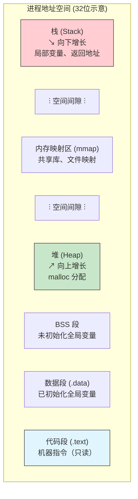
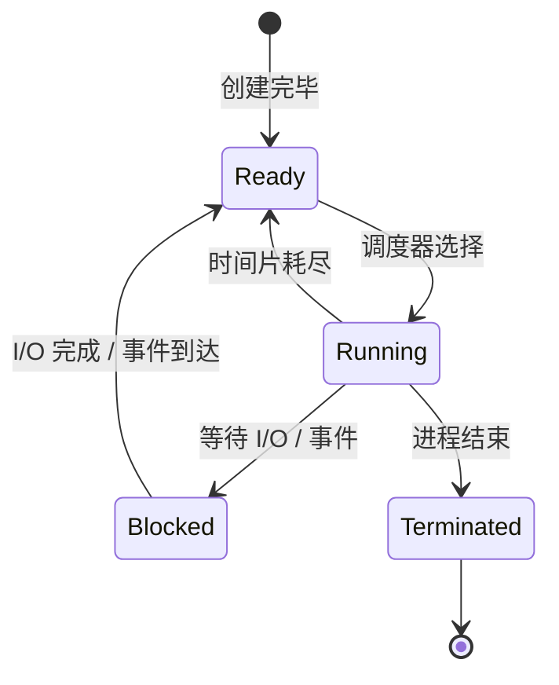
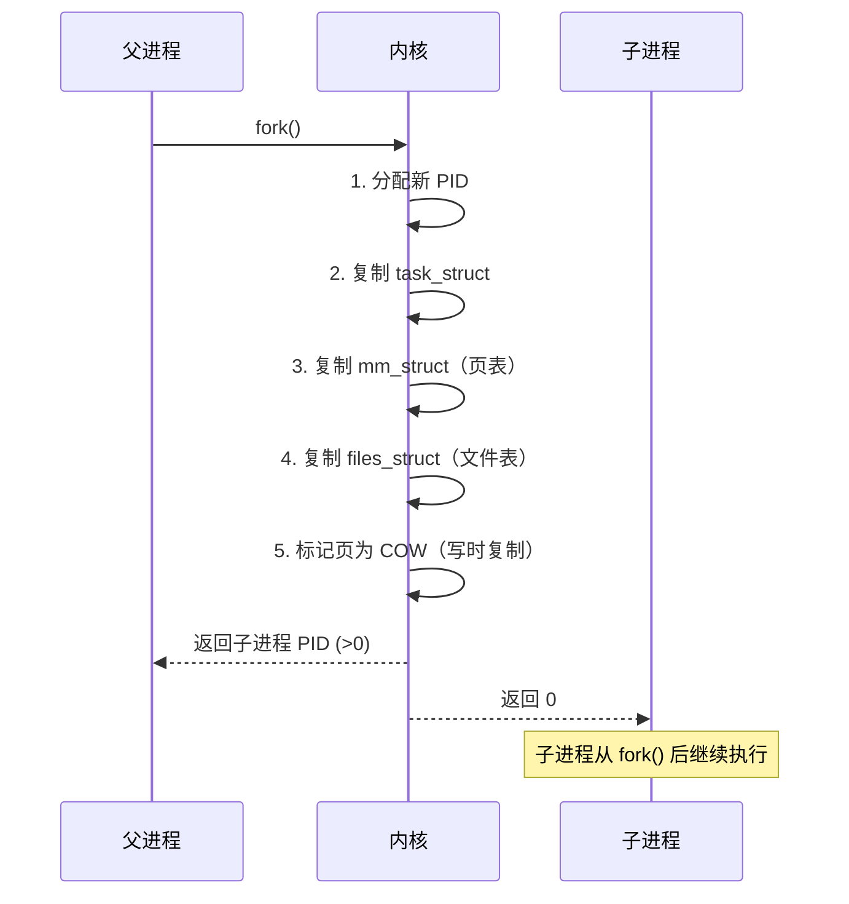
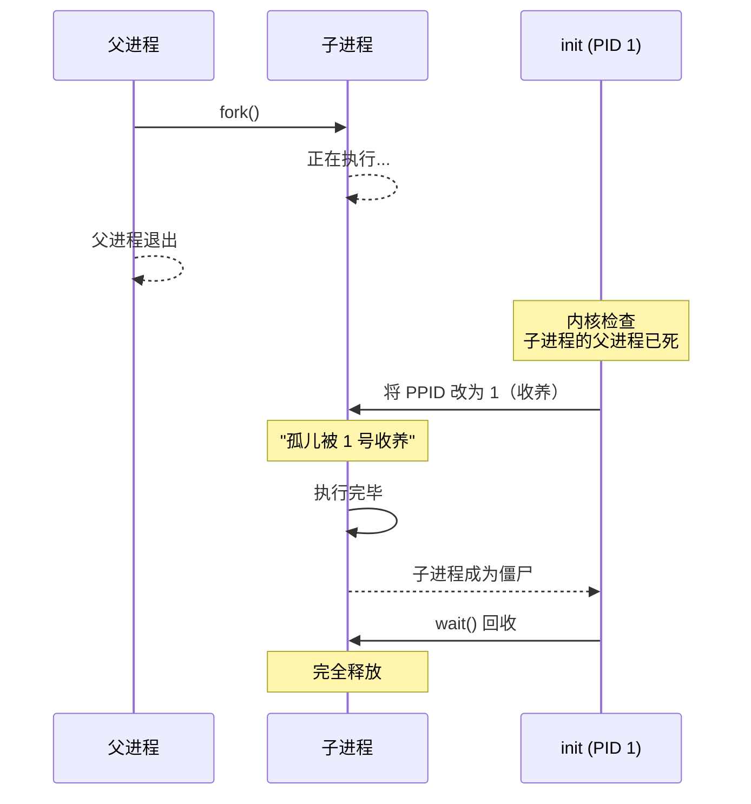
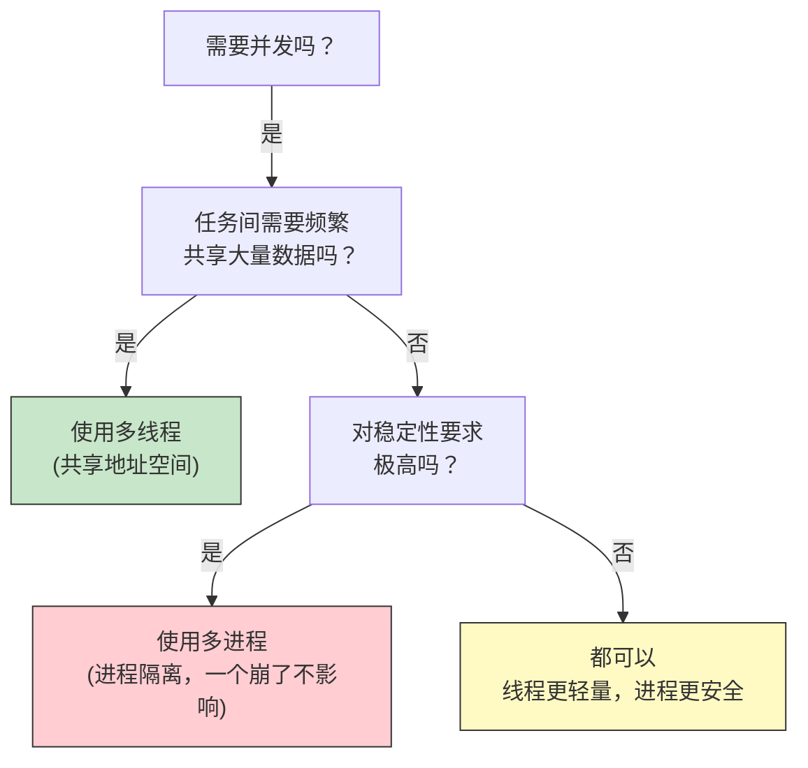

# 28 - 进程与线程

> 进程是操作系统中最重要的抽象之一——它是"正在运行的程序"。从内核的 task_struct 到用户空间的 fork()，本章将进程与线程的经典理论映射到 Linux 的实际实现中，让每一个概念都有对应的观测命令和代码。

---

## 28.1 进程概念

### 进程 = 程序 + 执行上下文

```
程序 (Program) 进程 (Process)
─────────────── ──────────────
静态文件（磁盘上的 ELF） → 动态实体（内存中运行）
一个程序 多个进程（同一程序可多次运行）
被动 主动（拥有 CPU 时间的实体）
```

进程的完整上下文包括：

```bash
# 查看进程的完整地址空间布局
cat /proc/$$/maps | head -30
# 555555554000-555555555000 r--p text（代码段，只读）
# 555555555000-5555555a0000 r-xp text（代码段，可执行）
# 5555555a0000-5555555c4000 r--p rodata（只读数据）
# 5555555c4000-5555555c8000 rw-p 数据段（已初始化全局变量）
# 5555555c8000-5555555d1000 rw-p BSS 段（未初始化全局变量）
# 7ffff7c00000-7ffff7c28000 r--p libc.so 映射
# 7ffffffde000-7ffffffff000 rw-p 栈（局部变量、返回地址）

# 堆空间的增长方向
cat /proc/$$/maps | grep heap
# 01742000-01763000 rw-p 00000000 00:00 0 [heap]
```

### 进程地址空间的经典布局



---

## 28.2 进程状态

### 五种基本状态



### Linux 中的进程状态码

| 状态码 | 名称 | 说明 | 如何产生 |
|--------|------|------|---------|
| **R** | Running/Runnable | 正在运行或在运行队列中等待 | CPU 密集型任务 |
| **S** | Sleeping (Interruptible) | 可中断睡眠，等待事件 | `sleep()`, `read()` 等待数据 |
| **D** | Disk Sleep (Uninterruptible) | 不可中断睡眠（通常在等待 I/O） | `write()` 同步到磁盘 |
| **T** | Stopped | 被信号暂停 | `Ctrl+Z` (SIGSTOP) |
| **t** | Tracing Stop | 被 ptrace 暂停（调试器） | `gdb` 附加 |
| **Z** | Zombie | 已退出但未被父进程回收 | 子进程 exit 后父进程未 wait |
| **X** | Dead | 正在被回收（瞬间状态，很难观测到） | 父进程调用 wait |

```bash
# 查看所有进程的状态
ps aux | awk '{print $8, $11}' | sort | uniq -c | sort -rn

# 查看特定进程的详细状态
cat /proc/$$/status | grep State
# State: S (sleeping)

# 统计各状态进程数量
ps -eo stat | sed 's/^\(.\).*/\1/' | sort | uniq -c | sort -rn
```

### 状态转换实战

```bash
# 观察 D 状态（需要 root 权限和恰好进行的 I/O）
# 在一个终端执行大量同步写
dd if=/dev/zero of=/tmp/testfile bs=1M count=1000 oflag=sync &
# 在另一个终端查看
ps aux | grep ' D' # 看到 D 状态

# 观察 Z 状态（僵尸进程）
bash -c '
( sleep 1 & ) # 创建子进程
sleep 3 # 子进程在 1 秒后退出，父进程存活
# 在这 2 秒窗口内观察僵尸
' &
sleep 1.5; ps aux | grep ' Z'
```

---

## 28.3 进程控制块（PCB）与 task_struct

### task_struct：Linux 的 PCB 实现

Linux 中每个进程在内核中由一个 `task_struct` 结构表示（定义于 `include/linux/sched.h`），其大小约 1.7KB（随版本变化）：

```c
// task_struct 的核心字段（简化版）
struct task_struct {
 pid_t pid; // 进程 ID
 pid_t tgid; // 线程组 ID（主线程的 PID）
 volatile long state; // 当前状态（-1=不可运行, 0=可运行, >0=停止）
 struct mm_struct *mm; // 内存描述符（地址空间）
 struct files_struct *files; // 打开的文件表
 struct signal_struct *signal; // 信号处理
 struct list_head children; // 子进程链表
 struct list_head sibling; // 兄弟进程链表
 u64 start_time; // 进程启动时间（纳秒）
 // ... 还有大量字段
};
```

### 通过 /proc 观察 task_struct

```bash
# /proc/PID/ 就是该进程的 task_struct 的用户空间视图
ls -la /proc/$$/ | head -20

# PID 与 TGID 的观察（线程场景）
cat /proc/$$/status | grep -E "^Pid|^Tgid|^PPid"
# Pid: 12345 当前轻量级进程 ID
# PPid: 12344 父进程 ID
# Tgid: 12345 线程组 ID

# 进程的命名空间
ls -la /proc/$$/ns/
# cgroup ipc mnt net pid pid_for_children time time_for_children user uts

# 打开的文件描述符
ls -la /proc/$$/fd/ | head -20
# 0 -> /dev/pts/1 (stdin)
# 1 -> /dev/pts/1 (stdout)
# 2 -> /dev/pts/1 (stderr)
```

---

## 28.4 进程创建：fork、vfork、clone

### fork() 的原理



```c
// fork 基础示例
#include <stdio.h>
#include <unistd.h>
#include <sys/wait.h>

int main() {
 pid_t pid = fork();
 
 if (pid < 0) {
 perror("fork failed");
 return 1;
 } else if (pid == 0) {
 // 子进程：fork 返回 0
 printf("Child: PID=%d, PPID=%d\n", getpid(), getppid());
 _exit(0);
 } else {
 // 父进程：fork 返回子进程 PID
 printf("Parent: PID=%d, Child PID=%d\n", getpid(), pid);
 wait(NULL); // 等待子进程结束
 }
 return 0;
}
```

### clone()：Linux 的真正创建原语

```c
// fork、vfork 和 pthread_create 最终都调用 clone()
// clone 的不同 flag 组合产生了进程或线程

// clone() 的调用等价关系：
// fork() ≈ clone(SIGCHLD, 0);
// vfork() ≈ clone(CLONE_VFORK | CLONE_VM | SIGCHLD, 0);
// pthread_create ≈ clone(CLONE_VM | CLONE_FS | CLONE_FILES | 
// CLONE_SIGHAND | CLONE_THREAD, 0);
```

| 系统调用 | 控制权 | 地址空间 | 文件表 | 信号处理 |
|---------|--------|---------|--------|---------|
| `fork()` | 父子并发执行 | COW 写时复制 | 复制 | 复制 |
| `vfork()` | 父进程阻塞直到子进程 exec/exit | **共享**（慎用） | 共享 | 共享 |
| `clone()` | 取决于 flags | 取决于 flags | 取决于 flags | 取决于 flags |

```bash
# 使用 strace 观察 clone 调用
strace -e clone bash -c 'ls' 2>&1 | head -5

# 观察创建进程时内核的详细行为
sudo bpftrace -e 'kprobe:copy_process { printf("new PID=%d\n", ((struct task_struct *)retval)->pid); }'
```

### fork 的性能影响：写时复制（COW）

```bash
# 实验：验证 COW 效果
# 编译并运行以下 C 程序
cat > /tmp/cow_test.c << 'EOF'
#include <stdio.h>
#include <unistd.h>
#include <sys/wait.h>
#include <stdlib.h>
#include <string.h>

#define SIZE (100 * 1024 * 1024) // 100MB

int main() {
 char *buf = malloc(SIZE);
 memset(buf, 0, SIZE);
 
 printf("Before fork, check /proc/%d/status VmRSS\n", getpid());
 getchar(); // 暂停，方便查看内存
 
 pid_t pid = fork();
 if (pid == 0) {
 printf("Child: PID=%d, check VmRSS now (should be low)\n", getpid());
 getchar(); // COW 阶段，内存未真正复制
 
 // 修改内存，触发实际复制
 for (int i = 0; i < SIZE; i += 4096)
 buf[i] = 1;
 
 printf("Child: after writing, VmRSS should be ~100MB higher\n");
 getchar();
 _exit(0);
 } else {
 wait(NULL);
 }
 return 0;
}
EOF
gcc -o /tmp/cow_test /tmp/cow_test.c
# 运行并在另一个终端用 top/htop 观察 VmRSS 变化
```

---

## 28.5 进程终止与等待

### exit、_exit 与返回的区别

| 函数 | 行为 | 典型使用 |
|------|------|---------|
| `exit(status)` | C 库函数：调用 atexit 注册的函数，刷新 stdio 缓冲，调用 _exit | 正常退出 |
| `_exit(status)` | 系统调用：直接终止，不做任何清理 | fork 出的子进程退出 |
| `return n` | 在 main 中等价于 exit(n) | main 函数返回 |

```c
#include <stdio.h>
#include <unistd.h>
#include <stdlib.h>

int main() {
 printf("Hello"); // 无换行，在 stdout 缓冲区
 // _exit(0); // 直接退出，"Hello" 不会输出！
 exit(0); // exit 会刷新缓冲区，"Hello" 会输出
 return 0;
}
```

### wait / waitpid 详解

```c
#include <sys/wait.h>

// waitpid 的宏，用于解析子进程退出状态
int status;
pid_t child = waitpid(-1, &status, 0);

if (WIFEXITED(status)) {
 // 正常退出
 printf("exit code: %d\n", WEXITSTATUS(status));
} else if (WIFSIGNALED(status)) {
 // 被信号杀死
 printf("killed by signal: %d\n", WTERMSIG(status));
 printf("core dumped: %d\n", WCOREDUMP(status));
} else if (WIFSTOPPED(status)) {
 printf("stopped by signal: %d\n", WSTOPSIG(status));
}
```

```bash
# 命令层面查看退出状态
false; echo "exit code: $?" # 1
true; echo "exit code: $?" # 0

# 查看信号值
kill -l
# 1) SIGHUP 2) SIGINT 3) SIGQUIT 4) SIGILL 5) SIGTRAP
# 6) SIGABRT 7) SIGBUS 8) SIGFPE 9) SIGKILL 10) SIGUSR1
# ...
```

---

## 28.6 exec 家族：换壳运行

### exec 函数族对比

```c
// 六个 exec 变体的区别在于参数传递方式
#include <unistd.h>

// 列表形式 (l): 参数逐个列出，以 NULL 结尾
int execl(const char *path, const char *arg0, ..., (char *)NULL);
int execlp(const char *file, const char *arg0, ..., (char *)NULL);

// 数组形式 (v): 参数放在数组中
int execv(const char *path, char *const argv[]);
int execvp(const char *file, char *const argv[]);

// 环境变量形式 (e): 显式指定环境变量
int execle(const char *path, const char *arg0, ..., (char *)NULL, char *const envp[]);
int execve(const char *path, char *const argv[], char *const envp[]);
```

| 前缀 | 含义 | 路径解析 |
|------|------|---------|
| `execve` | **底层系统调用**（唯一真正的系统调用） | 基于给定路径 |
| `execv` | 参数为数组 | 基于给定路径 |
| `execvp` | 参数为数组 | **在 PATH 中搜索** |
| `execl` | 参数为列表（可变参数） | 基于给定路径 |
| `execlp` | 参数为列表 | **在 PATH 中搜索** |
| `execle` | 参数为列表 + 环境变量 | 基于给定路径 |

```bash
# strace 观察：ls 命令实际调用的是 execve
strace -e execve ls /tmp 2>&1 | head -3
# execve("/usr/bin/ls", ["ls", "/tmp"], 0x7fff... /* 72 vars */)

# /proc/PID/exe 是一个符号链接，指向进程的可执行文件
ls -la /proc/$$/exe
# lrwxrwxrwx 1 root root 0 ... /proc/12345/exe -> /usr/bin/bash

# /proc/PID/cmdline：启动时的完整命令行
cat /proc/$$/cmdline | tr '\0' ' '
```

---

## 28.7 僵尸进程与孤儿进程

### 僵尸进程（Zombie）

当子进程退出时，内核不会立即释放它的 task_struct，而是保留退出状态供父进程通过 `wait()` 获取：

```bash
# 制造一个僵尸进程（1 秒后父进程 wait 之前）
(sleep 0.1 &) && sleep 2 &
PID=$!
sleep 1
ps -o pid,ppid,stat,comm -p $(pgrep -P $PID sleep)
# STAT = Z 或 Z+，证明僵尸存在

# 查找系统上所有僵尸进程
ps aux | awk '$8 ~ /Z/ {print}'

# 查看僵尸进程的退出状态（/proc/ZOMBIE_PID/status）
# State: Z (zombie) 即使 zombie，/proc 目录依然可用
```

### 孤儿进程与 init 收养

当父进程先于子进程退出时，子进程变成孤儿，由 init（PID 1，现在通常是 systemd）收养：

```bash
# 制造孤儿进程
bash -c '
bash -c "sleep 5; echo orphan says hi; ps -o pid,ppid,stat,comm -p \$\$" &
echo parent exiting...
' 
# 父进程 (外层 bash) 立即退出，内层子进程被 systemd(PID 1) 收养

# 验证：孤儿进程的 PPID 变为 1
ps -eo pid,ppid,stat,comm | awk '$3 == 1 {print}'
```



---

## 28.8 线程：轻量级进程

### 进程 vs 线程

| 维度 | 进程 | 线程 |
|------|------|------|
| **地址空间** | 独立（通过 MMU 隔离） | 共享（同一进程内的线程共享地址空间） |
| **创建开销** | 高（复制页表和文件表） | 低（仅复制少量结构） |
| **上下文切换** | 需要切换 MMU 上下文（刷新 TLB） | 不需要切换地址空间 |
| **通信方式** | IPC：管道、共享内存、消息队列、信号 | 直接读写共享内存 |
| **隔离性** | 强（一个进程崩溃不影响其他） | 弱（一个线程的野指针可破坏整个进程） |
| **在 Linux 中** | 通过 fork/clone 创建 | 通过 clone(CLONE_VM|CLONE_THREAD) / pthread_create 创建 |

### POSIX 线程（Pthread）基础

```c
#include <pthread.h>
#include <stdio.h>
#include <unistd.h>

void *worker(void *arg) {
 int id = *(int *)arg;
 printf("Thread %d: PID=%d, TID=%lu\n", id, getpid(), pthread_self());
 sleep(1);
 return (void *)(long)(id * 10);
}

int main() {
 pthread_t threads[3];
 int ids[] = {1, 2, 3};
 void *retvals[3];

 for (int i = 0; i < 3; i++)
 pthread_create(&threads[i], NULL, worker, &ids[i]);

 for (int i = 0; i < 3; i++) {
 pthread_join(threads[i], &retvals[i]);
 printf("Thread %d returned: %ld\n", i, (long)retvals[i]);
 }
 return 0;
}
```

```bash
# 编译
gcc -pthread -o /tmp/thread_test thread_test.c
/tmp/thread_test

# 运行时用 htop 观察（F2 → Display Options → Show custom thread names）
# 或使用 ps 查看线程关系
ps -eLf | grep thread_test
# PID 相同，LWP（轻量级进程 ID）不同，NLWP（线程数）> 1
```

### NPTL：Linux 的线程实现

Linux 历史上经历过 LinuxThreads 到 NPTL（Native POSIX Thread Library）的演进：

```bash
# 查看当前线程库（现代 Linux 使用 NPTL through glibc）
getconf GNU_LIBPTHREAD_VERSION
# NPTL 2.39

# 查看线程相关限制
ulimit -u # 用户最大进程/线程数
cat /proc/sys/kernel/threads-max # 系统级最大线程数
```

```bash
# 查看线程的信息
cat /proc/$$/status | grep Threads
# Threads: 1

# 多线程程序：每个线程都是一个 task_struct
# 它们共享 mm_struct，但拥有各自的栈（由 glibc 分配）
cat /proc/$$/maps | grep stack
# 7ffff7ffe000-7ffff7fff000 ---p (guard page，防止栈溢出)
# 7ffff7ffe000-7ffff8000000 rw-p (线程栈)
```

### 线程模型对比

| 模型 | 描述 | 优缺点 |
|------|------|--------|
| **用户级线程 (1:1 之前的方案)** | 线程在用户空间调度，内核不可见 | 快但一个线程阻塞整个进程都阻塞 |
| **内核级线程 (1:1)** | 每个用户线程对应一个内核线程 | **NPTL 采用此方案**，真正的并发 |
| **混合模型 (M:N)** | M 个用户线程映射到 N 个内核线程 | 复杂，Go 的 goroutine 采用类似思路 |

---

## 28.9 /proc 文件系统深度探索

### 进程信息宝库

```bash
# 关键文件一览
PID=$$ # 当前 shell 的 PID

cat /proc/$PID/status # 进程状态总览
cat /proc/$PID/stat # 进程状态（机器可读）
cat /proc/$PID/statm # 内存使用（页为单位）
cat /proc/$PID/limits # 资源限制
cat /proc/$PID/environ # 环境变量（\0 分隔）
cat /proc/$PID/io # I/O 统计（需要 root）
cat /proc/$PID/fd/ # 打开的文件描述符
cat /proc/$PID/maps # 内存映射
cat /proc/$PID/smaps # 详细内存映射（含 RSS、PSS）
cat /proc/$PID/sched # 调度信息
cat /proc/$PID/stack # 内核栈回溯
cat /proc/$PID/mountinfo # 挂载信息
cat /proc/$PID/oom_score # OOM killer 评分
cat /proc/$PID/oom_score_adj # OOM 评分调整

# stat 的输出字段详解
cat /proc/$PID/stat | awk '{
 print "PID:", $1
 print "Comm:", $2
 print "State:", $3
 print "PPID:", $4
 print "PGRP:", $5
 print "Session:", $6
 print "utime:", $14 # 用户态时间
 print "stime:", $15 # 内核态时间
 print "starttime:", $22 # 启动时间
 print "vsize:", $23 # 虚拟内存大小
 print "rss:", $24 # 常驻内存（页）
}'
```

### 进程观察命令大全

```bash
# ps 的高级用法
ps -eo pid,ppid,pgid,sid,stat,pri,ni,wchan:20,cmd --sort=-%mem | head -10
# pri = 动态优先级 (越低越优先)
# ni = nice 值
# wchan = 等待通道（进程在等什么）

# pstree：进程树
pstree -a -p -s $$ # 显示当前 shell 的进程祖先
pstree -a $$ # 显示当前 shell 的进程后代

# pgrep：按名称查找 PID
pgrep -a bash # 所有 bash 进程
pgrep -u root -l # root 用户的进程

# htop（更友好）
# F2 进入设置 → Display options → Show custom thread names
# F6 按列排序
# F9 向进程发送信号
```

---

## 28.10 实际场景：多进程与多线程的选择

### 决策框架



### IPC 性能对比

| 方法 | 延迟（相对） | 吞吐量 | 复杂度 | 适用场景 |
|------|------------|--------|--------|---------|
| 共享内存 | **最低** | **最高** | 高（需同步） | 大数据量、高频通信 |
| Unix Domain Socket | 低 | 高 | 中 | 本地 CS 模式通信 |
| 管道 (pipe) | 低 | 中 | 低 | 父子进程简单通信 |
| 消息队列 (POSIX) | 中 | 中 | 中 | 结构化消息异步处理 |
| TCP 环回 | 中 | 中 | 低 | 跨网络通信 |

> **经验法则**：在不需强隔离保护的场景下，多线程因共享地址空间而通信高效；在多服务解耦架构（如微服务）下，多进程虽然通信成本更高，但提供了更强的故障隔离。Linux 的进程创建（fork+COW）已经很高效，使得多进程在服务器端依然常见。

---

## 相关链接

- [[29-操作系统概述与结构]] — 内核架构与系统调用基础
- [[31-进程同步与互斥]] — 解决多进程/多线程的数据竞争
- [[32-死锁]] — 同步引发的经典问题
- [[33-处理机调度]] — CPU 如何选择下一个运行的进程
- [[10-进程管理]] — 日常进程管理命令实践

