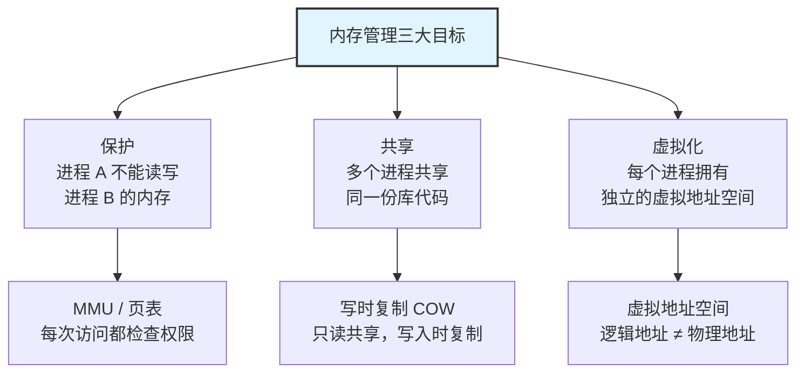
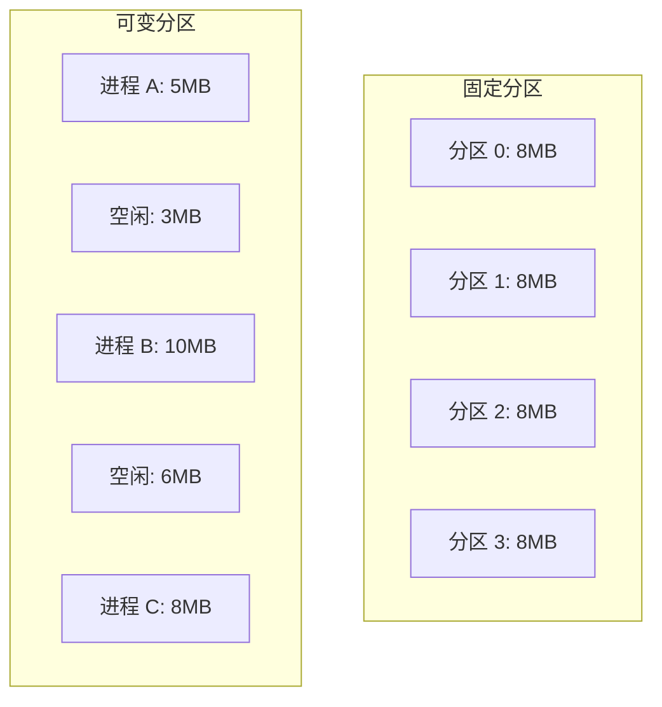
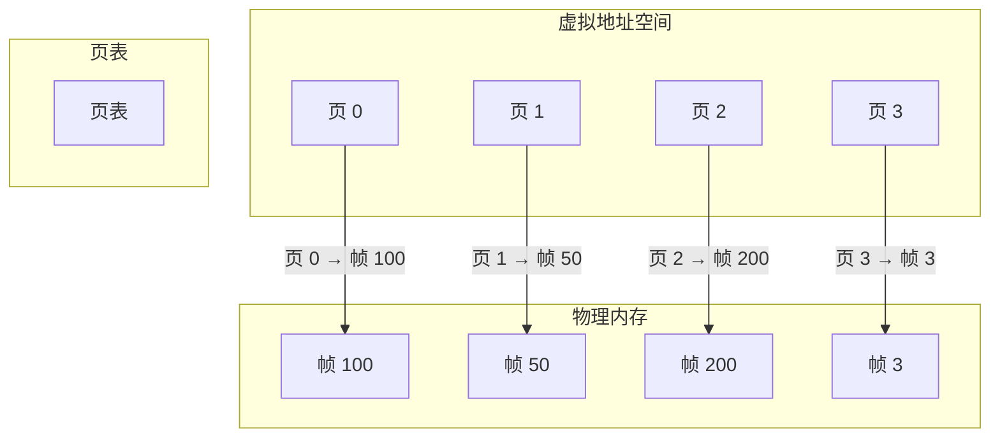
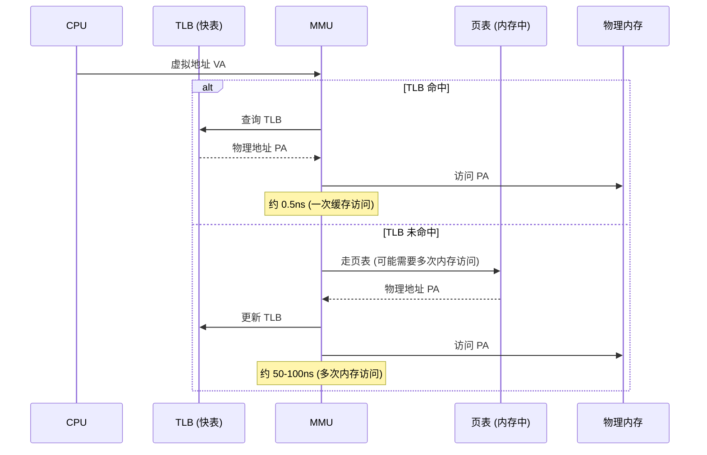
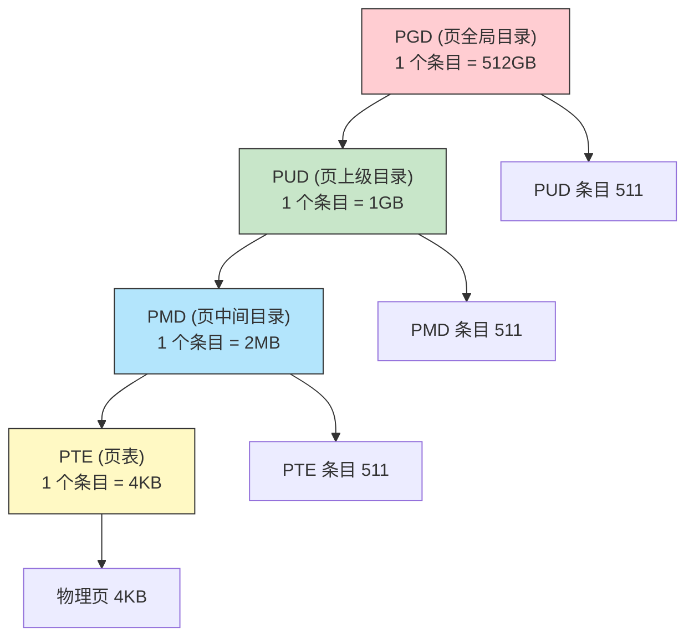

# 32 - 存储管理

> 内存是计算机中最宝贵的资源之一。操作系统内存管理的核心任务是：保护（不让进程互相干扰）、共享（让进程高效共享代码/数据）、虚拟化（让每个进程感觉拥有整个地址空间）。Linux 通过分页、段机制和一系列精巧的分配器实现了这些目标。

---

## 32.1 内存管理目标

### 三大核心目标



```bash
# 验证进程间的内存隔离
# 终端 1: 启动一个进程并查看其内存映射
sleep 1000 &
PID1=$!
cat /proc/$PID1/maps | head -5

# 终端 2: 尝试读写该进程的内存（正常用户无法跨进程访问）
# cat /proc/$PID1/mem 会失败（除非 root 且有 ptrace 权限）

# 查看内核保护的物理内存布局
sudo cat /proc/iomem | head -20
# 输出：物理内存地址范围和用途
# 00000000-00000fff : Reserved
# 00100000-7fffffff : System RAM
# ...
```

---

## 32.2 地址绑定与地址空间

### 从源代码到物理内存


### 地址绑定的三个阶段

| 绑定时间 | 何时确定 | 特点 |
|---------|---------|------|
| **编译时** | 编译器已知进程的绝对地址 | 不灵活，嵌入式系统 |
| **加载时** | 程序加载到内存时 | 可重定位，但不能运行时移动 |
| **执行时** | 指令执行时由 MMU 动态翻译 | **现代 OS 使用此方案**（支持换入换出） |

### 逻辑地址 vs 物理地址

```bash
# 逻辑地址（虚拟地址）：进程看到的地址，从 0 开始
cat /proc/$$/maps | head -5
# 555555554000-555555555000 r--p 00000000 08:01 1234567 /usr/bin/bash
# ^^^^^^^^^^^^ 这是虚拟地址！不是物理内存地址

# 物理地址：内存芯片上的实际地址
# 用户态程序无法直接看到物理地址（这是安全的基石）

# 查看物理内存布局（需要 root）
sudo cat /proc/iomem | head -10

# 查看页表：从虚拟地址到物理地址的映射
sudo cat /proc/$$/pagemap 2>/dev/null | xxd | head -5
# pagemap 是一个二进制文件，每个页对应 8 字节
```

---

## 32.3 连续内存分配与碎片

### 固定分区 vs 可变分区



### 两种碎片

| 碎片类型 | 定义 | 示例 |
|---------|------|------|
| **外部碎片** | 空闲空间总和足够但分散成小块，无法满足一个大请求 | 两个 3MB 空闲块，但需要 5MB 连续空间 |
| **内部碎片** | 分配的空间比请求的大（多余部分被浪费） | 请求 47KB，分得 64KB 的块（13KB 浪费） |

```bash
# 查看内存碎片情况（通过 /proc/buddyinfo）
cat /proc/buddyinfo
# Node 0, zone DMA 1 1 0 1 2 1 1 0 1 1 3 
# Node 0, zone DMA32 567 442 234 123 67 34 12 3 1 1 0
# Node 0, zone Normal 12345 9876 5432 2345 1234 567 234 123 45 12 3
# 
# 每列代表 2^order 个连续页面块的数量
# order 0: 2^0 = 1 个页面 (4KB)
# order 1: 2^1 = 2 个页面 (8KB) 连续块
# ...
# order 10: 2^10 = 1024 个页面 (4MB)
# 
# 如果高阶 order 的值很小 → 内存碎片化严重
```

---

## 32.4 分页（Paging）

### 分页的基本原理



### 页表条目（PTE）的结构

```
PTE (Page Table Entry) — x86-64:
┌─────────────────────────────────────────────────────────────┐
│ 物理页框号 (PFN) │ AVL │ G │ PAT │ D │ A │ PCD │ PWT │ U/S │ R/W │ P │
│ 位 63-M │ │ │ │ │ │ │ │ │ │ │
└─────────────────────────────────────────────────────────────┘
P (Present): 1 = 页在内存中
R/W (Read/Write): 0 = 只读, 1 = 可读写
U/S (User/Supervisor): 0 = 仅内核, 1 = 用户可访问
A (Accessed): 1 = 曾被访问过
D (Dirty): 1 = 曾被写入过（用于判断是否需要写回磁盘）
```

### MMU 与 TLB



```bash
# 查看 TLB 相关信息
# TLB 是 CPU 硬件结构，无法从 /proc 直接查看
# 但可以通过性能计数器间接观察

# 查看 TLB shootdown 的影响（多核系统中刷新 TLB 的 IPI）
sudo perf stat -e 'dtlb_load_misses.miss_causes_a_walk,dtlb_store_misses.miss_causes_a_walk' -- sleep 3

# 查看页大小
getconf PAGE_SIZE
# 4096 (4KB，标准页大小)

# 查看是否启用了大页
grep Huge /proc/meminfo
# HugePages_Total: 0
# Hugepagesize: 2048 kB (2MB 大页)
```

---

## 32.5 多级页表

### 为什么需要多级

32 位系统，4KB 页，每个 PTE 4 字节：
- 总页数：4GB / 4KB = 1,048,576 页
- 页表总大小：1M × 4B = **4MB**（每个进程！）
- 100 个进程 → 400MB 仅用于页表

**多级页表**允许不存在的映射部分不分配页表：



### x86-64 的五级页表（Linux 命名）

| 级别 | 名称 | 偏移位数 | 寻址范围 |
|------|------|---------|---------|
| 1 | PGD (Page Global Directory) | bits 47:39 | 512GB |
| 2 | P4D (Page 4th-level Directory) | bits 38:30 | 1GB |
| 3 | PUD (Page Upper Directory) | bits 29:21 | 2MB |
| 4 | PMD (Page Middle Directory) | bits 20:12 | 4KB |
| 5 | PTE (Page Table Entry) | bits 11:0 | 页内偏移 |

```bash
# 查看内核页表占用的内存（需要 root）
grep PageTables /proc/meminfo
# PageTables: 123456 kB — 所有进程页表占用的总内存

# 查看每个进程的页表大小
sudo cat /proc/$$/status | grep -E "VmPTE|VmPMD"
# VmPTE: 页表条目占用的虚拟内存
```

---

## 32.6 分段（Segmentation）

### 段的概念

段是一段**有逻辑意义的连续内存区域**：

```
代码段 (.text) — 可执行、只读、固定大小
数据段 (.data) — 可读写、固定大小
堆 (Heap) — 可读写、动态增长
栈 (Stack) — 可读写、动态增长
内存映射段 (mmap) — 共享库、文件映射等
```

### 分段与分页的结合

Intel x86 历史上使用"段:偏移"的地址模型（分段+分页），但实际上 Linux 将段平坦化了：

```bash
# 查看段寄存器（Linux 对所有用户进程使用相同的平坦段）
# cs/ss/ds/es 等段寄存器都指向相同的平坦内存区域

# Linux 的段布局：base=0, limit=4GB（32位）或全 64 位范围
# 实际的内存保护仅由分页机制（页表的 R/W、U/S 位）完成
```

---

## 32.7 Linux 内存分配器

### Buddy System（伙伴系统）

Buddy System 是 Linux 物理内存分配的核心算法：


```bash
# 查看 Buddy System 状态（各区各阶的空闲块数）
cat /proc/buddyinfo
# Node 0, zone Normal 1234 567 234 89 34 12 5 2 1 0 0
# ^^^^ order 0 (4KB)
# ^^^ order 1 (8KB)
# ... ^ order 10 (4MB)

# 查看各区的详细信息
cat /proc/pagetypeinfo | head -30
# 显示每种页面迁移类型的可用页数
```

### Slab / Slub Allocator

Slab 分配器是 Buddy 之上的缓存层，用于内核对象（task_struct、inode 等）的高效分配：

```bash
# 查看 slab 缓存信息
cat /proc/slabinfo | head -20
# slabinfo - version: 2.1
# name <active_objs> <num_objs> <objsize> <objperslab> ...
# task_struct 1234 1280 2752 11 ...
# inode_cache 5678 6000 1088 30 ...
# dentry 8765 9000 256 32 ...

# 查看 slab 总体内存占用
grep Slab /proc/meminfo
# Slab: 123456 kB

# 用 slabtop 实时查看（需要 root）
sudo slabtop -o 2>/dev/null | head -20
```

### kmalloc / vmalloc

| 分配器 | 特点 | 映射方式 | 使用场景 |
|--------|------|---------|---------|
| `kmalloc()` | 分配**物理连续**内存 | 直接映射区（线性映射） | 小对象、DMA 缓冲区 |
| `vmalloc()` | 分配**虚拟连续**内存（物理可以不连续） | 单独映射（需要建立页表） | 大缓冲区、内核模块 |

```bash
# 查看 vmalloc 区域使用情况
cat /proc/vmallocinfo | head -20
# 0xffffc90000000000-0xffffc90000005000 20480 module_1+0x0/0x...
```

---

## 32.8 /proc 内存接口总览

```bash
# 1. 全局内存统计（最常用）
cat /proc/meminfo
# MemTotal: 总物理内存
# MemFree: 完全空闲内存
# MemAvailable: 可用内存（包括可回收的缓存）
# Buffers: 块设备缓冲区
# Cached: 页面缓存
# SwapTotal: 交换空间总量
# SwapFree: 空闲交换空间
# Dirty: 等待写回磁盘的脏页
# Writeback: 正在写回磁盘的页
# AnonPages: 匿名页（堆、栈等）
# Mapped: 被映射的文件页
# Shmem: tmpfs 使用的内存
# KReclaimable: 可回收的内核内存（如 slab 缓存）
# Slab: slab 分配器使用的内存
# PageTables: 页表占用的内存
# KernelStack: 内核栈占用的内存

# 2. 查看特定进程的内存
cat /proc/$$/status | grep -E "VmSize|VmRSS|VmData|VmStk|VmExe|VmLib|VmPTE|VmSwap"
# VmSize: 虚拟内存总大小
# VmRSS: 常驻物理内存（Resident Set Size）
# VmData: 数据段（堆 + 静态数据）
# VmStk: 栈大小
# VmExe: 代码段（text）
# VmLib: 映射的共享库
# VmSwap: 被换出的内存

# 3. 内存映射详情
cat /proc/$$/smaps | head -50
# 每个映射区域的详细信息，包括 RSS、PSS、匿名/文件映射

# 4. 查看 NUMA 内存分配
cat /proc/$$/numa_maps 2>/dev/null | head
```

---

## 32.9 地址空间随机化（ASLR）

### ASLR 的工作原理

ASLR（Address Space Layout Randomization）为进程的各个内存区域添加随机偏移，使攻击者难以预测代码/数据的地址：

```bash
# 查看当前 ASLR 设置
cat /proc/sys/kernel/randomize_va_space
# 0 = 关闭
# 1 = 随机化共享库、栈、mmap、VDSO
# 2 = 完全随机化（包括 brk/堆，默认值）

# 验证 ASLR 效果：两次运行同一个程序，地址不同
cat /proc/self/maps | head -5
cat /proc/self/maps | head -5
# 每次输出中的地址范围都不同

# 临时禁用 ASLR
echo 0 | sudo tee /proc/sys/kernel/randomize_va_space

# 以禁用 ASLR 的方式运行单个程序
setarch $(uname -m) -R bash -c 'cat /proc/self/maps | head -3'
```

---

## 32.10 内存管理命令速查

| 命令 | 作用 | 示例 |
|------|------|------|
| `free -h` | 查看系统内存使用概况 | `free -h` |
| `vmstat 1` | 实时查看内存/交换/CPU | `vmstat 1 5` |
| `top` / `htop` | 按内存排序查看进程 | `htop`, 按 M 键 |
| `pmap -x PID` | 查看进程的内存映射详情 | `pmap -x $$` |
| `smem -k` | 按 PSS/USS 查看内存占用 | `sudo smem -k -s pss` |
| `slabtop` | 查看内核 slab 缓存 | `sudo slabtop -o` |
| `numastat` | 查看 NUMA 内存统计 | `numastat -m` |
| `cat /proc/buddyinfo` | 查看 Buddy 分配器状态 | `cat /proc/buddyinfo` |
| `cat /proc/slabinfo` | 查看 Slab 缓存详情 | `cat /proc/slabinfo` |

---

## 相关链接

- [[33-虚拟存储与页面置换]] — 虚拟内存、缺页中断、页面置换算法
- [[39-内存管理深入]] — 更深入的内存管理机制
- [[28-进程与线程]] — 进程的地址空间
- [[08-进程管理]] — 日常进程内存查看
