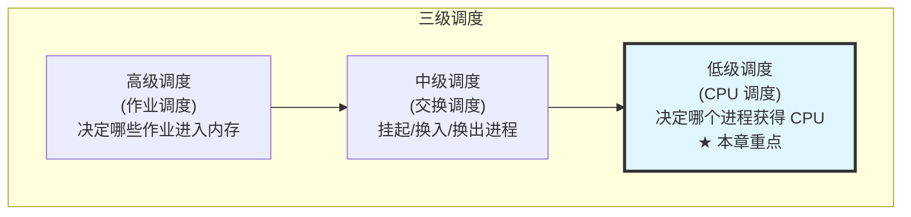
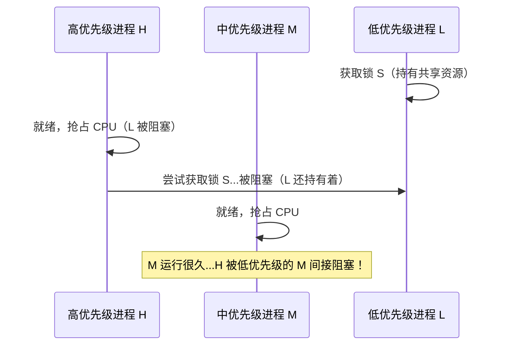
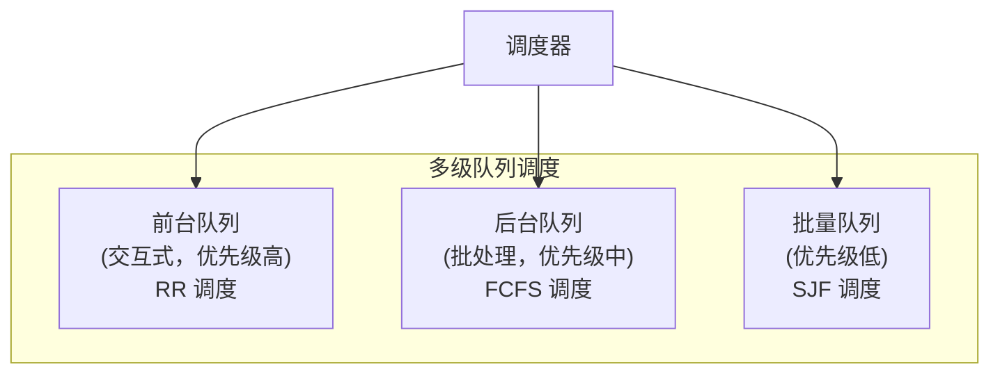
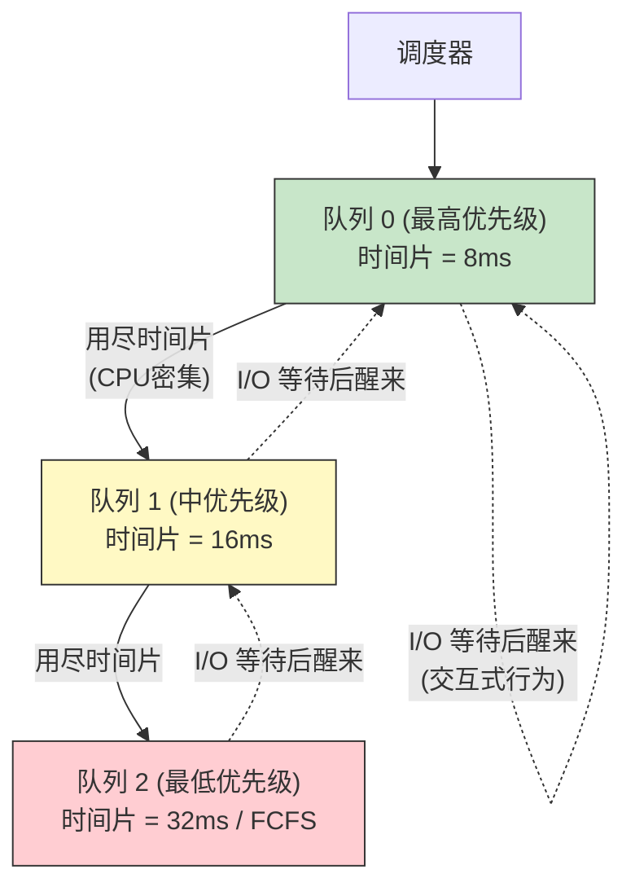
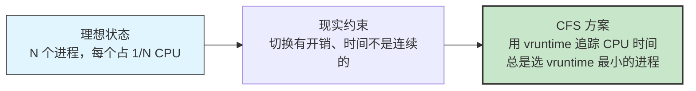
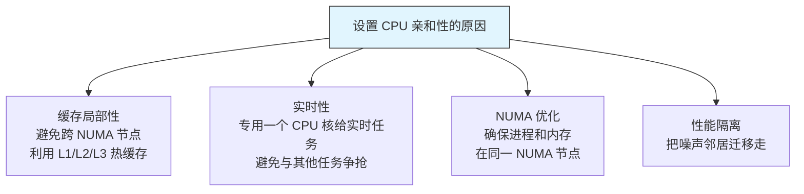

# 31 - 处理机调度

> 在多道程序系统中，CPU 是最宝贵的资源。调度器的任务是在就绪进程之间分配 CPU 时间，目标是最大化吞吐量、最小化响应时间、保证公平性。Linux 的 CFS（完全公平调度器）是工程实践中的经典之作，本章将理论与实现结合讲解。

---

## 31.1 调度概念与目标

### 调度的层次



### 调度算法的评价指标

| 指标 | 含义 | 注重该指标的系统 |
|------|------|-----------------|
| **CPU 利用率** | CPU 忙的时间百分比 | 批处理系统 |
| **吞吐量** | 单位时间完成的进程数 | 批处理系统 |
| **周转时间** | 从提交到完成的时间 | 批处理系统 |
| **等待时间** | 在就绪队列中等待的时间 | 交互式系统 |
| **响应时间** | 从提交请求到首次响应的时间 | 交互式系统 |

```bash
# 在 Linux 中查看 CPU 时间分配
# 进程的用户态和内核态 CPU 时间（以 jiffies 为单位）
cat /proc/$$/stat | awk '{print "utime:",$14,"stime:",$15,"cutime:",$16,"cstime:",$17}'
# utime: 用户态时间, stime: 内核态时间
# cutime: 所有已终止子进程的用户态时间之和
# cstime: 所有已终止子进程的内核态时间之和

# 进程的启动时间（system boot 以来的 jiffies）
cat /proc/$$/stat | awk '{print "starttime:",$22}'

# 查看进程等待 I/O 的时间
sudo cat /proc/$$/io | grep -E "read_bytes|write_bytes"
```

---

## 31.2 抢占式 vs 非抢占式

| 类型 | 描述 | 何时切换 |
|------|------|---------|
| **非抢占式 (Non-preemptive)** | 进程自愿放弃 CPU 才切换 | 进程终止、I/O 等待、主动 yield |
| **抢占式 (Preemptive)** | 调度器可以强制剥夺 CPU | 时间片耗尽、更高优先级进程就绪、中断触发 |

```bash
# 查看内核是否为抢占式（CONFIG_PREEMPT）
zcat /proc/config.gz 2>/dev/null | grep PREEMPT || \
gunzip -c /boot/config-$(uname -r) 2>/dev/null | grep PREEMPT
# CONFIG_PREEMPT=y — 低延迟桌面/实时内核
# CONFIG_PREEMPT_VOLUNTARY=y — 服务器内核
# CONFIG_PREEMPT_NONE=y — 无抢占（2.6 之前的内核）

# 查看内核抢占模型
cat /sys/kernel/debug/sched/preempt 2>/dev/null
```

> Linux 2.6+ 是抢占式内核。当高优先级进程变为可运行时，调度器可以中断正在运行的低优先级进程，甚至在系统调用执行期间（通过抢占检查点）。

---

## 31.3 经典调度算法

### 先来先服务（FCFS）

```
就绪队列: [P1] → [P2] → [P3]
执行顺序: P1 → P2 → P3（按到达顺序）

优点：简单公平
缺点：短作业被长作业堵在后面（护航效应）
 比如 P1 需要 100ms, P2/P3 各 1ms
 平均等待时间 = (0 + 100 + 101)/3 ≈ 67ms（糟糕！）
```

### 短作业优先（SJF / SRTF）

| 变体 | 抢占？ | 说明 |
|------|--------|------|
| **SJF (非抢占)** | 否 | 选择预计 CPU 突发时间最短的进程运行到完成 |
| **SRTF (抢占)** | 是 | 如果新到达进程的剩余时间更短，抢占当前进程 |

```
问题：如何知道进程的 CPU 执行时间？
答案：指数平均预测法
 τ(n+1) = α·t(n) + (1-α)·τ(n)
 其中 t(n) 是第 n 次实际执行时间
 τ(n) 是第 n 次的预测值
 α 是历史权重系数（0 < α < 1，通常 α = 0.5）
```

### 优先级调度

每个进程分配一个优先级，调度器总是选择最高优先级的进程：

```bash
# Linux 优先级系统（用户视角）
# nice 值：-20（最高优先级）到 +19（最低优先级），默认 0
# 内核优先级（prio）：0-139，数值越小优先级越高
# 0-99: 实时优先级
# 100-139: 普通进程优先级（nice 值映射）

nice -n 10 sleep 100 & # 以较低优先级启动
renice -n -5 -p $(pgrep firefox) 2>/dev/null # 调整运行中进程的优先级（需要 root）

# 查看进程优先级
ps -eo pid,pri,ni,comm | head -10
# pri = 动态优先级（内核计算，考虑了历史行为）
# ni = nice 值（用户可设置）
```

**优先级反转问题**：



解决方案：**优先级继承（Priority Inheritance）**——当高优先级进程 H 等待低优先级进程 L 持有的锁时，L 临时继承 H 的优先级，直到释放锁。

```bash
# Linux 的 rt_mutex 支持优先级继承
# 查看哪些互斥锁启用了 PI（Priority Inheritance）
cat /proc/locks | grep -i rt_mutex
```

### 时间片轮转（Round Robin）

```bash
# 查看 Linux 的时间片长度（动态计算，不是固定值）
cat /proc/sys/kernel/sched_rr_timeslice_ms
# 默认值：约 100ms（对于 SCHED_RR 实时策略）

# CFS 不使用固定时间片，而是根据权重动态计算
# 通过公式：time_slice = (weight / total_weight) * sched_period
```

### 多级队列



### 多级反馈队列（MLFQ）★★★★★

MLFQ 无需预知作业长度，根据进程的行为**动态调整**优先级：



MLFQ 的精髓——**三条规则**：
1. 优先级高的队列优先执行
2. 同优先级队列内使用 RR
3. CPU 密集型进程逐步降级，I/O 密集型进程保持在高优先级

---

## 31.4 Linux CFS（完全公平调度器）

### CFS 的哲学



> CFS 不按优先级分配固定量，而是**模拟理想的多任务处理器**，保证每个进程获得的 CPU 时间与其权重成比例。

### vruntime：CFS 的核心概念

```c
// CFS 的核心公式（简化）
// vruntime = actual_runtime * (1024 / weight)
// 
// weight 由 nice 值映射而来：
// nice=0 → weight=1024 (基准)
// nice=1 → weight≈820 (少得 20% CPU)
// nice=-1 → weight≈1277 (多得 25% CPU)

// 调度器选择 vruntime 最小的进程运行
// vruntime 增长慢的进程（高权重）优先被调度
```

```bash
# 查看进程的 vruntime（需要 root）
cat /proc/$$/sched
# 输出中的关键字段：
# se.sum_exec_runtime : 实际运行时间 (ns)
# se.vruntime : 虚拟运行时间 (ns)
# se.statistics.wait_start : 等待开始时间
# se.statistics.wait_sum : 总等待时间
# se.load.weight : 权重

# 查看不同 nice 值的权重表
cat /proc/sys/kernel/sched_latency_ns # 调度周期（默认约 6ms）
cat /proc/sys/kernel/sched_min_granularity_ns # 最小时间片（约 0.75ms）
```

### CFS 的数据结构：红黑树

```
CFS 使用红黑树（不是队列！）组织就绪进程
键 = vruntime

 100ns (P2)
 / \
 50ns (P1) 200ns (P3)
 \
 350ns (P4)

最左节点 (P1, vruntime=50ns) = 下一个运行的进程
插入/删除 O(log n)，查找最小 O(1)
```

```bash
# 查看调度器的红黑树统计（需要内核支持调试）
sudo cat /proc/sched_debug | head -100
# 输出中会看到每个 CPU 运行队列的 cfs_rq 信息
# .exec_clock : 执行时钟
# .MIN_vruntime : 当前最小 vruntime
# .nr_running : 就绪进程数
# .nr_spread_over : 时间片分摊次数

# 查看各 CPU 的调度域信息
cat /proc/sys/kernel/sched_domain/ 2>/dev/null
```

---

## 31.5 实时调度

### 三类调度策略

```bash
# Linux 支持的调度策略
chrt -m
# SCHED_OTHER : 普通分时调度（CFS）
# SCHED_BATCH : 批处理（不需要交互响应的 CPU 密集型进程）
# SCHED_IDLE : 极低优先级（仅在空闲时运行）
# SCHED_FIFO : 实时先入先出（无时间片，运行到主动放弃或被更高优先级抢占）
# SCHED_RR : 实时轮转（有时间片）
# SCHED_DEADLINE : 最晚完成时间约束（EDF，最早截止时间优先）
```

| 策略 | 优先级范围 | 抢占 | 时间片 | 使用场景 |
|------|-----------|------|--------|---------|
| `SCHED_OTHER` | nice -20~+19 | 是（CFS） | 动态 | 普通用户进程 |
| `SCHED_FIFO` | 1~99 | 是（更高优先级） | 无 | 对时间敏感的任务 |
| `SCHED_RR` | 1~99 | 是 | 100ms | 实时多进程轮流 |
| `SCHED_DEADLINE` | — | 是（EDF） | 动态 | 有硬截止时间的任务 |
| `SCHED_BATCH` | nice -20~+19 | 是（但不愿意抢占） | 动态 | 长时间批处理 |
| `SCHED_IDLE` | 极低 | 是 | 动态 | 仅 CPU 空闲时运行 |

### 使用实时调度

```bash
# 以 SCHED_FIFO 策略运行，优先级 50
sudo chrt -f 50 -- stress -c 1 &
# 查看
chrt -p $(pgrep stress)
# pid 12345's current scheduling policy: SCHED_FIFO
# pid 12345's current scheduling priority: 50

# 以 SCHED_RR 优先级 30 运行
sudo chrt -r 30 -- ffmpeg ...

# 以 SCHED_DEADLINE 运行（需要指定运行时间、截止时间、周期）
# Runtime: 5ms, Deadline: 10ms, Period: 10ms
sudo chrt -d --sched-runtime 5000000 --sched-deadline 10000000 \
 --sched-period 10000000 0 -- my_realtime_app
```

```c
// 程序内部设置实时优先级（需要 CAP_SYS_NICE）
#include <sched.h>
#include <stdio.h>

int main() {
 struct sched_param param;
 param.sched_priority = 50; // 实时优先级 1-99
 
 if (sched_setscheduler(0, SCHED_FIFO, &param) == -1) {
 perror("sched_setscheduler failed");
 return 1;
 }
 
 printf("Running with SCHED_FIFO, priority %d\n", param.sched_priority);
 // 实时任务代码...
 return 0;
}
```

> **警告**：实时进程会抢占一切普通进程，包括系统关键进程。一个有问题的实时进程（例如死循环）可能让系统无法响应，包括 SSH 和 console。仅在确实需要时使用，并始终设定监控和超时机制。

---

## 31.6 CPU 亲和性（Affinity）

### 将进程绑定到指定 CPU

```bash
# 查看进程的 CPU 亲和性掩码
taskset -p $$
# pid 12345's current affinity mask: ffffff
# ffffff = 24 位全 1 = 所有 0-23 号 CPU 均可运行

# 将进程限制在 CPU 0 和 CPU 2 上
taskset -cp 0,2 $$
taskset -p $$
# pid 12345's current affinity mask: 5 (0b0101 = CPU 0 和 2)

# 用掩码启动新进程
taskset 0x1 stress -c 1 # 仅在 CPU 0 上运行

# 查看每个进程当前运行的 CPU
ps -eo pid,psr,comm | head -20
# PSR 列：进程当前所在的 CPU
```

### 为什么要控制 CPU 亲和性



```bash
# 查看 NUMA 拓扑
numactl --hardware 2>/dev/null || lscpu | grep NUMA
# 输出：每个 NUMA 节点的 CPU 和内存范围

# 在指定 NUMA 节点上运行进程
numactl --cpunodebind=0 --membind=0 stress -c 1
```

### IRQ 亲和性

```bash
# 设置网卡中断的 CPU 亲和性（分散 IRQ 到多核，减少单核瓶颈）
cat /proc/interrupts | grep eth0
# 80: ... IR-PCI-MSI ... eth0

echo 3 > /proc/irq/80/smp_affinity # 绑定到 CPU 0 和 CPU 1
# 3 = 0b0011

# 或者使用 irqbalance 自动分配
systemctl status irqbalance
```

---

## 31.7 调度器观测与调试

### /proc 观测接口

```bash
# 1. 查看具体进程的调度信息
cat /proc/$$/sched
# 输出包含：
# policy (SCHED_NORMAL/SCHED_FIFO/...)
# prio (内核优先级，越低越优先)
# se.exec_start (上次开始运行的时间)
# se.sum_exec_runtime (累计 CPU 时间)
# se.vruntime (CFS 虚拟运行时间)
# se.statistics.wait_sum (总等待时间)

# 2. 查看全局调度器统计
cat /proc/schedstat
# 输出（每行一个 CPU）：
# version 15
# timestamp 1234567890
# cpu0 0 0 0 0 0 0 123456789 ...
# 字段含义：yld_count, sched_switch, sched_count, ...

# 3. 调度器调试信息（需要 CONFIG_SCHED_DEBUG）
sudo cat /proc/sched_debug | head -200
# 包含每个 CPU 的运行队列详情

# 4. 调度器统计指标
cat /proc/loadavg
# 0.52 0.38 0.25 2/856 12345
# 1min, 5min, 15min 平均负载, 运行/总 进程数, 最新 PID
```

### 性能工具

```bash
# perf sched: 调度器的性能分析工具
sudo perf sched record -- sleep 5
sudo perf sched latency # 调度延迟分析
sudo perf sched script # 调度事件时间线
sudo perf sched map # 可视化调度事件

# 查看上下文切换频率（每秒）
vmstat 1 5
# cs 列：每秒上下文切换次数

# 更详细的上下文切换信息
sudo perf stat -e 'sched:sched_switch' -a -- sleep 5
# 输出：在 5 秒内发生了多少次进程切换

# 查看就绪队列长度
sar -q 1 5 2>/dev/null || cat /proc/loadavg
# runq-sz: 运行队列长度
# plist-sz: 系统中进程/线程总数
```

---

## 31.8 CFS 参数的调优

### 关键 sysctl 参数

```bash
# 调优参数一览（位于 /proc/sys/kernel/）
# 
# sched_latency_ns: 调度周期（targeted scheduling latency）
# CFS 尝试在此时间内让所有就绪进程至少运行一次
# 默认：6ms（毫秒级），随 CPU 数量增大而增大
cat /proc/sys/kernel/sched_latency_ns

# sched_min_granularity_ns: 最小时间片
# 进程不会被分配比这更短的时间片
# 防止过度切换
cat /proc/sys/kernel/sched_min_granularity_ns

# sched_wakeup_granularity_ns: 唤醒粒度
# 被唤醒的进程必须比当前进程的 vruntime 超出此值才会触发抢占
# 防止频繁的"乒乓"效应
cat /proc/sys/kernel/sched_wakeup_granularity_ns

# sched_migration_cost_ns: 迁移成本估计
# 进程上次切换 CPU 之后多久可以再次被迁移
cat /proc/sys/kernel/sched_migration_cost_ns 2>/dev/null
```

### 调优场景

```bash
# 场景 1: 桌面系统 — 低延迟高交互
sudo sysctl -w kernel.sched_latency_ns=6000000
sudo sysctl -w kernel.sched_min_granularity_ns=750000
sudo sysctl -w kernel.sched_wakeup_granularity_ns=1000000

# 场景 2: 服务器 — 高吞吐量
sudo sysctl -w kernel.sched_latency_ns=24000000
sudo sysctl -w kernel.sched_min_granularity_ns=3000000
sudo sysctl -w kernel.sched_wakeup_granularity_ns=4000000

# 持久化配置（临时修改，重启失效；永久修改需写 /etc/sysctl.d/）
echo "kernel.sched_latency_ns = 6000000" | sudo tee /etc/sysctl.d/99-sched.conf
sudo sysctl --system
```

---

## 31.9 多核调度与负载均衡

### NUMA 感知调度

```bash
# 查看 NUMA 拓扑结构
lscpu | grep -E "^CPU|^NUMA|^Thread|^Core|^Socket"
numactl --hardware 2>/dev/null

# 查看调度域（Scheduling Domain）
ls /proc/sys/kernel/sched_domain/ 2>/dev/null
# 调度域的层次：SMT → MC → DIE → NUMA
# SMT: 同一物理核的超线程之间
# MC: 同一 CPU 封装内的多核之间
# DIE: 同一芯片的不同 Die 之间
# NUMA: 不同 NUMA 节点之间

# 查看进程的 NUMA 内存统计
cat /proc/$$/numa_maps 2>/dev/null | head -10
```

### 负载均衡

CFS 的每个 CPU 运行队列上的**负载均衡**由内核周期性触发：

```bash
# 查看各 CPU 的负载
cat /proc/stat | grep cpu
# cpu 123456 7890 234567 8901234 5678 0 1234 0 0 0
# 各列：user nice system idle iowait irq softirq steal guest guest_nice

# mpstat 查看各 CPU 负载（需要 sysstat 包）
mpstat -P ALL 1 3
```

---

## 31.10 核心公式与速查

| 算法 | 周转时间公式 | 特点 |
|------|------------|------|
| FCFS | T = 完成时间 - 到达时间 | 简单，护航效应 |
| SJF | T 最短（最优） | 需预知 CPU 突发，可能饥饿 |
| RR | T 取决于时间片大小 | 响应时间好，时间片太小→切换开销大 |
| MLFQ | 自适应的 | 未知作业长度的最佳选择 |
| CFS | 公平 = 按权重比例 | Linux 实际采用的方案 |

| 术语 | 定义 | 观测手段 |
|------|------|---------|
| Jiffy | 内核的定时器中断间隔（通常 1ms/4ms） | `cat /proc/timer_list` |
| Ticks | 进程的 CPU 时间计数单位 | `cat /proc/$$/stat` |
| Nice | 用户可设置的"谦让值" —20 到 +19 | `ps -eo pid,ni` |
| Prio | 内核动态优先级（考虑了行为和 nice） | `ps -eo pid,pri` |
| Cgroup | 控制组，可以限制进程组的 CPU 配额 | `cat /sys/fs/cgroup/` |

---

## 相关链接

- [[10-进程管理]] — 进程管理的日常操作
- [[30-进程与线程]] — 进程与线程的生命周期
- [[32-死锁]] — 并发中可能遇到的死锁问题
- [[39-系统调优与性能分析]] — 系统层面的性能优化
