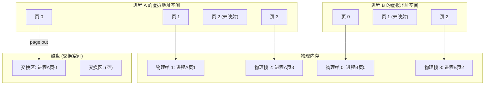
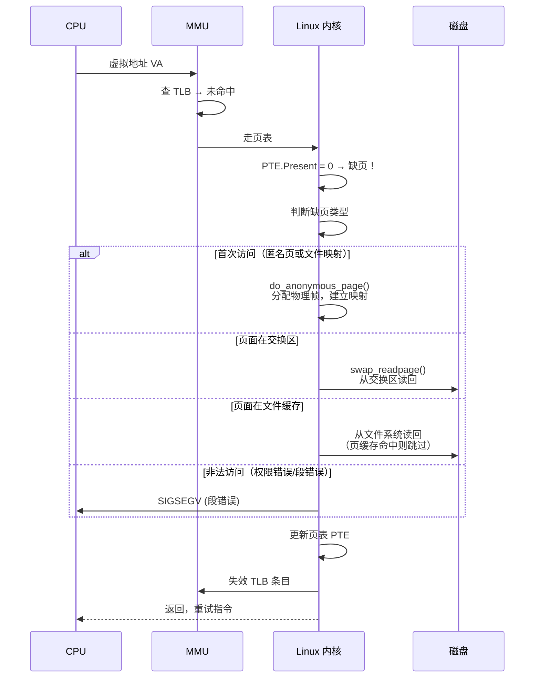
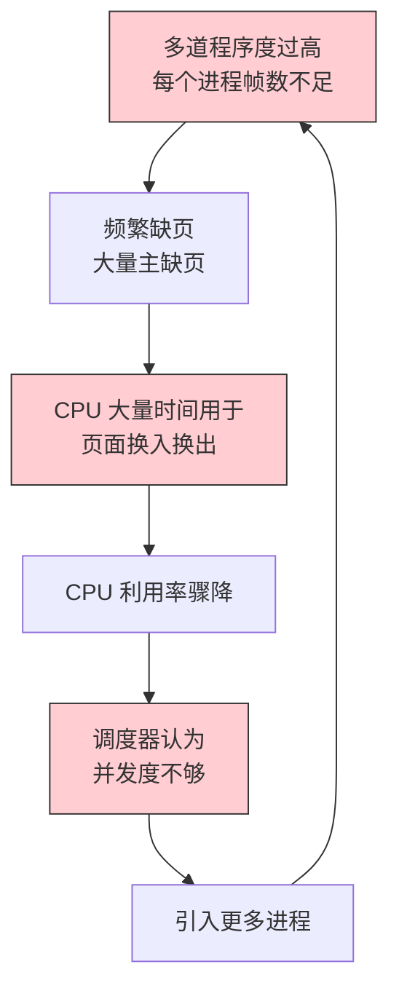
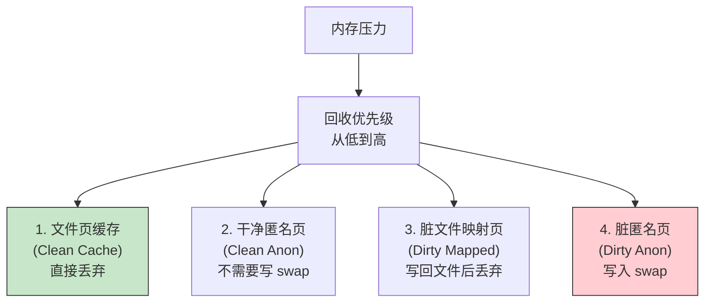

# 33 - 虚拟存储与页面置换

> 虚拟存储是现代操作系统的标志性技术——它让每个进程独占 4GB（或更大）的地址空间，超出的部分可以透明地交换到磁盘。当物理内存吃紧时，页面置换算法决定哪些页该被踢出、哪些页该留在内存中。本章深入 Linux 的虚拟内存实现，将理论具象化。

---

## 33.1 虚拟内存概念

### 什么是虚拟内存

虚拟内存（Virtual Memory）将进程的**逻辑地址空间**与物理内存**解耦**。进程看到的是连续的大地址空间，实际的物理内存分配可以是不连续的、按需的、甚至部分在磁盘上。



### 需求分页（Demand Paging）

进程启动时，只有必要的页面被加载到内存，其余页面在**第一次访问时**才被加载：

```bash
# 观察进程的实际内存占用（虚拟 vs 物理）
cat /proc/$$/status | grep -E "VmSize|VmRSS|VmData"
# VmSize: 8120 kB ← 虚拟内存总大小（所有映射，不管是否在内存中）
# VmRSS: 3652 kB ← 常驻内存（实际占用的物理页面）
# VmData: 1432 kB ← 数据段虚拟大小

# VmRSS << VmSize → 这就是需求分页的效果
# 很多虚拟页面从未被访问，因此无需分配物理帧
```

---

## 33.2 缺页中断（Page Fault）

### 缺页的处理流程



### 次缺页 vs 主缺页

| 类型 | 含义 | 需要 I/O？ | 示例 |
|------|------|-----------|------|
| **次缺页 (Minor Fault)** | 页面已在内存（在页缓存或其他进程中），只需建立页表映射 | **否** | COW 页面首次写入、共享库已映射 |
| **主缺页 (Major Fault)** | 页面不在内存，必须从磁盘读取 | **是** | 首次加载程序代码、从 swap 读回 |
| **非法缺页 (Invalid Fault)** | 访问不可能合法的地址 | 进程被杀死 | 空指针解引用、写只读页面 |

```bash
# 查看进程的缺页统计
cat /proc/$$/stat | awk '{print "minflt:",$10,"majflt:",$12}'
# minflt: 次缺页次数（不需要磁盘 I/O）
# majflt: 主缺页次数（需要磁盘 I/O）

# 全局缺页统计
cat /proc/vmstat | grep -E "pgfault|pgmajfault|pswpin|pswpout"
# pgfault: 所有缺页次数（大部分是次缺页）
# pgmajfault: 主缺页次数
# pswpin: 从 swap 换入的页数
# pswpout: 换出到 swap 的页数

# 实时监控缺页
sar -B 1 5 2>/dev/null
# pgpgin/s: 每秒从磁盘读入的页数
# pgpgout/s: 每秒写出到磁盘的页数
# fault/s: 每秒缺页次数
# majflt/s: 每秒主缺页次数
```

---

## 33.3 页面置换算法

当物理内存不足，需要选择**哪一页换出**时，页面置换算法登场。

### OPT（最优置换，理论基准）

```
OPT: 选择未来最长时间不再使用的页面置换
问题：无法预知未来 → 仅用作理论性能上界
用途：作为衡量其他算法的参照标准
```

### FIFO 与 Belady 异常

```
FIFO: 置换驻留时间最长的页面（最简单的队列）

Belady 异常：增加物理帧数，缺页次数反而增加！
示例：
 页面引用串: 1 2 3 4 1 2 5 1 2 3 4 5
 3 个帧: 9 次缺页
 4 个帧: 10 次缺页 ← 更多帧却更差！
```

```python
# 用 Python 验证 Belady 异常
def fifo_page_faults(pages, num_frames):
 frames = []
 faults = 0
 for page in pages:
 if page not in frames:
 faults += 1
 if len(frames) < num_frames:
 frames.append(page)
 else:
 frames.pop(0) # FIFO
 frames.append(page)
 return faults

ref_string = [1, 2, 3, 4, 1, 2, 5, 1, 2, 3, 4, 5]
print(f"3 frames: {fifo_page_faults(ref_string, 3)} faults")
print(f"4 frames: {fifo_page_faults(ref_string, 4)} faults")
# 3 frames: 9 faults
# 4 frames: 10 faults ← Belady 异常！
```

### LRU（最近最少使用）

```
LRU: 置换最久没有被使用的页面
 利用"局部性原理"：最近用过的页面更可能再次被使用

实现方案：
 1. 计数器方案：每次访问记录时间戳，置换时找最小
 → 需要硬件支持（每条内存访问指令更新计数器）
 2. 栈方案：维护页号栈，被访问的页移到栈顶
 → O(1) 更新但需要维护链表

纯 LRU 需要硬件支持，普通系统很少直接实现
```

### CLOCK（二次机会）算法 ★

CLOCK 是 LRU 的近似，Linux 实际使用其增强版本：

```c
// CLOCK 算法伪代码
// 使用页表条目的 Accessed (A) 位

struct page {
 int referenced; // 访问位（由硬件设置，OS 可清零）
};

// 循环指针（时钟指针）
int clock_hand = 0;

page_t *select_victim() {
 while (1) {
 if (pages[clock_hand].referenced == 0) {
 // 找到牺牲页
 return &pages[clock_hand];
 } else {
 // 给第二次机会，清零访问位
 pages[clock_hand].referenced = 0;
 }
 clock_hand = (clock_hand + 1) % num_pages;
 }
}
```

### 增强 CLOCK（Linux 使用的方案）

增强 CLOCK 同时考虑**访问位（A）**和**修改位（D）**：

| A (Accessed) | D (Dirty) | 类别 | 优先置换顺序 |
|:---:|:---:|------|:---:|
| 0 | 0 | 既没访问也没修改 | **1st**（最佳牺牲品） |
| 0 | 1 | 没访问但修改过（需写回） | 2nd |
| 1 | 0 | 访问过但干净 | 3rd |
| 1 | 1 | 访问过也修改过 | **4th**（最不应置换） |

```bash
# Linux 当前使用的页面回收算法
cat /sys/kernel/mm/lru_gen/enabled 2>/dev/null && echo "LRU Gen" || \
echo "使用传统 LRU 链表"

# 查看内核页面回收相关的配置
grep -r "LRU" /boot/config-$(uname -r) 2>/dev/null | head -10
```

---

## 33.4 页面分配策略

### 固定分配 vs 可变分配

| 策略 | 描述 | 优点 | 缺点 |
|------|------|------|------|
| 固定分配 | 每个进程分配固定数量的帧 | 简单可预测 | 不适应动态需求 |
| 可变分配 | 帧数根据缺页频率动态调整 | 自适应，效率高 | 实现复杂 |

### 全局置换 vs 局部置换

```c
// 全局置换：可以选择任何进程的页面置换
// 优点：灵活，全局最优
// 缺点：一个进程缺页过多会影响其他进程

// 局部置换：只能从本进程的页面中选择置换
// 优点：隔离性好，不影响其他进程
// 缺点：可能本进程的页面都不适合置换

// Linux 默认使用全局置换，但通过 cgroup 可以限制
```

```bash
# 用 cgroup 限制进程的内存（局部置换的现代等价物）
# 创建带内存限制的 cgroup
sudo mkdir /sys/fs/cgroup/memory_limit
echo "512M" | sudo tee /sys/fs/cgroup/memory_limit/memory.max
echo "512M" | sudo tee /sys/fs/cgroup/memory_limit/memory.high

# 在该 cgroup 中运行进程
sudo sh -c 'echo $$ > /sys/fs/cgroup/memory_limit/cgroup.procs'
# 进程内存超过 512M 时会触发回收，仅影响本 cgroup 内的进程
```

---

## 33.5 系统颠簸（Thrashing）

### 颠簸的定义与检测



```bash
# 检测颠簸的几种方法

# 1. 查看 交换 I/O 速率
vmstat 1 5
# si (swap in) 和 so (swap out) 持续很高 → 可能在颠簸

# 2. 查看缺页频率
sar -B 1 5
# majflt/s 持续很高

# 3. 查看 I/O 等待
iostat -x 1 5
# %iowait 很高，但系统没有磁盘瓶颈 → 可能在颠簸

# 4. 查看负载平均值
uptime
# load average 远大于 CPU 核数 → 很多进程在等待（可能是 I/O 等待）
```

### 工作集模型

工作集（Working Set, WS）是进程在 Δ 时间窗口内访问的页面集合：

```
WS(t, Δ) = { 进程在 [t-Δ, t] 时间内访问过的页面集合 }

如果分配给进程的帧数 < |WS| → 频繁缺页 → 颠簸
如果分配给进程的帧数 ≥ |WS| → 缺页频率可接受
```

```bash
# 估算进程的工作集（需要采样）
# 通过 /proc/PID/clear_refs 和 /proc/PID/smaps 结合
# 1. 重置访问位
echo 1 | sudo tee /proc/$$/clear_refs
# 2. 等待一段时间（Δ）
sleep 10
# 3. 查看哪些页面被访问了
cat /proc/$$/smaps | grep -E "^[0-9a-f]|Referenced:" | grep -B1 "Referenced:.*[1-9]"
# 被访问过的页面（PSS 或 Referenced > 0 表明被访问）

# 这是定性分析，操作系统内核会持续追踪但不会暴露原始工作集数据
```

---

## 33.6 Linux OOM Killer

### 何时触发 OOM

当系统内存严重不足，内核无法通过页面回收和 swap 满足内存请求时，OOM Killer（Out-Of-Memory Killer）会被激活：

```bash
# 查看 OOM Killer 是否最近触发过
dmesg | grep -i "out of memory\|oom-killer\|killed process"
sudo journalctl -k | grep -i oom

# 查看当前的 OOM 状态
cat /proc/sys/vm/panic_on_oom # 0=救急, 1=内核panic
cat /proc/sys/vm/oom_kill_allocating_task # 0=选最耗内存的, 1=杀触发OOM的

# OOM Killer 的选择算法（badness score）
# 每个进程有一个 oom_score，值越高越可能被杀
cat /proc/$$/oom_score
# 分数范围：(0-1000)，由内核根据内存占用、CPU 时间等计算

# oom_score_adj: 手动调整 OOM 评分
# 范围：-1000 到 +1000
# -1000: 完全豁免（永远不被杀，如 sshd）
# +1000: 优先被杀
cat /proc/$$/oom_score_adj
```

```bash
# 保护关键进程不被 OOM Killer 杀死
# 例如保护 sshd
echo -1000 | sudo tee /proc/$(pgrep sshd)/oom_score_adj

# 查看哪些进程被保护
for pid in $(ls /proc | grep -E '^[0-9]+$'); do
 adj=$(cat /proc/$pid/oom_score_adj 2>/dev/null)
 if [ "$adj" = "-1000" ]; then
 echo "PID $pid ($(cat /proc/$pid/comm 2>/dev/null)): OOM protected"
 fi
done | head -20
```

---

## 33.7 Swap 空间

### Swap 的原理与作用

Swap 是磁盘上的一块区域，用于存放被换出的匿名页（堆、栈等内存）。文件映射的页面则直接写回原文件。

```bash
# 查看 swap 使用情况
swapon --show
# NAME TYPE SIZE USED PRIO
# /dev/sda3 partition 8G 2.3G -2
# /swapfile file 2G 0B -3

free -h | grep Swap

# 查看每个进程的 swap 使用量
for pid in $(ls /proc | grep -E '^[0-9]+$' | head -20); do
 swap=$(awk '/VmSwap/{print $2}' /proc/$pid/status 2>/dev/null)
 [ -n "$swap" ] && echo "PID $pid: ${swap} kB"
done

# 查看全局 swap 统计
cat /proc/vmstat | grep -E "pswpin|pswpout"
```

### 创建和管理 Swap

```bash
# 方法 1: 创建 swap 文件
sudo dd if=/dev/zero of=/swapfile bs=1M count=4096 # 4GB
sudo chmod 600 /swapfile
sudo mkswap /swapfile
sudo swapon /swapfile

# 永久生效
echo '/swapfile none swap defaults 0 0' | sudo tee -a /etc/fstab

# 方法 2: 使用 swap 分区
# 在分区工具中创建类型为 82 (Linux swap) 的分区
sudo mkswap /dev/sdXY
sudo swapon /dev/sdXY

# 移除 swap
sudo swapoff /swapfile
sudo rm /swapfile
```

### Swappiness：控制换出激进程度

```bash
# swappiness 范围 0-100（默认 60）
# 0: 尽量不 swap（仅当内存耗尽时）
# 100: 积极 swap（尽早换出匿名页）

cat /proc/sys/vm/swappiness # 默认值

# 对于桌面系统，降低 swappiness 可以让 UI 更流畅
echo 10 | sudo tee /proc/sys/vm/swappiness

# 对于数据库服务器，通常也设为较低值
echo 1 | sudo tee /proc/sys/vm/swappiness

# 持久化
echo "vm.swappiness = 10" | sudo tee /etc/sysctl.d/99-swap.conf
sudo sysctl --system
```

---

## 33.8 大页（Huge Pages）

### 为什么需要大页

TLB（Translation Lookaside Buffer）的条目数有限（典型值数百条）。使用更大的页面可以减少 TLB 条目的消耗：

| 页面大小 | 覆盖 1GB 需 TLB 条目 | TLB 覆盖上限 (256 条目) |
|---------|---------------------|------------------------|
| 4KB | 262,144 条 | 1 MB |
| 2MB | 512 条 | **512 MB** |
| 1GB | 1 条 | **256 GB** |

```bash
# 查看大页配置
grep Huge /proc/meminfo
# HugePages_Total: 128 # 预留的大页总数
# HugePages_Free: 128 # 空闲大页数
# HugePages_Rsvd: 0 # 已预留但未映射
# HugePages_Surp: 0 # 超过预留的大页
# Hugepagesize: 2048 kB # 大页大小 (2MB)

# 查看透明大页状态
cat /sys/kernel/mm/transparent_hugepage/enabled
# always [madvise] never
# always: 始终使用 THP
# madvise: 仅当程序显式通过 madvise() 请求时使用
# never: 禁用 THP

# 查看 THP 使用统计
cat /sys/kernel/mm/transparent_hugepage/khugepaged/pages_collapsed
grep thp /proc/vmstat
# thp_fault_alloc: THP 缺页分配次数
# thp_collapse_alloc: khugepaged 合并分配次数
# thp_split: THP 被拆分为 4KB 页的次数
```

### 预留大页

```bash
# 创建 128 个 2MB 大页（= 256MB 预留）
echo 128 | sudo tee /proc/sys/vm/nr_hugepages

# 持久保留（通过 sysctl）
echo "vm.nr_hugepages = 128" | sudo tee /etc/sysctl.d/99-hugepages.conf

# 挂载 hugetlbfs
sudo mkdir -p /mnt/huge
sudo mount -t hugetlbfs none /mnt/huge
# 或者添加到 /etc/fstab
echo "none /mnt/huge hugetlbfs defaults 0 0" | sudo tee -a /etc/fstab

# 查看内存中 1GB 大页的情况（x86-64 支持 1GB 页）
cat /proc/cpuinfo | grep pdpe1gb
# 如果有 pdpe1gb 标志 → CPU 支持 1GB 大页
```

---

## 33.9 页面回收与缓存

### Linux 的页面类型

```bash
# 查看各类页面的统计
cat /proc/meminfo | grep -E "^AnonPages|^Mapped|^Cached|^Buffers|^Dirty|^Writeback|^Shmem"
# AnonPages: 匿名页（堆、栈、malloc）
# Mapped: 文件映射页（被 mmap 的文件）
# Cached: 页面缓存（文件数据在内存中的副本）
# Buffers: 块设备缓冲区（文件系统元数据）
# Dirty: 已修改但尚未写回磁盘的页
# Writeback: 正在写回磁盘的页
# Shmem: tmpfs 用的共享内存

# 匿名页：回收时写入 swap
# 文件映射页：回收时写回原文件（如果脏）
# 缓冲/缓存页：回收时写回磁盘（如果脏）或直接丢弃
```

### 页面回收的优先级



```bash
# 查看内核页面回收的活动
cat /proc/vmstat | grep -E "pgscan|pgsteal|pgrotated"
# pgscan_kswapd: kswapd 扫描的页数
# pgscan_direct: 直接回收扫描的页数（更紧急）
# pgsteal_kswapd: kswapd 成功回收的页数
# pgsteal_direct: 直接回收成功的页数

# 如果 pgscan_direct 显著 > 0 → 内存压力很大
# kswapd（后台回收）来不及处理，必须同步等待回收
```

---

## 33.10 虚拟内存观测命令汇总

```bash
# 全局一览
cat /proc/meminfo # 内存使用全景
cat /proc/vmstat # 虚拟内存统计（大量计数器）
vmstat 1 5 # 实时内存/CPU/交换统计
sar -r 1 5 2>/dev/null # 内存使用历史
sar -B 1 5 2>/dev/null # 页面 I/O 历史
sar -S 1 5 2>/dev/null # 交换空间使用

# 进程级别
cat /proc/PID/status # 进程内存概况
cat /proc/PID/smaps # 详细内存映射
cat /proc/PID/smaps_rollup # smaps 汇总
pmap -x PID # 进程内存映射（人类可读）

# 页面与交换
cat /proc/buddyinfo # Buddy 分配器状态
cat /proc/slabinfo # Slab 分配器详情
swapon --show # Swap 设备/文件

# OOM 相关
cat /proc/PID/oom_score # OOM 杀手评分
cat /proc/PID/oom_score_adj # OOM 调整值
dmesg | grep -i oom # OOM 历史事件

# 大页
grep Huge /proc/meminfo # 大页统计
cat /sys/kernel/mm/transparent_hugepage/enabled # THP 状态
```

| 场景 | 诊断命令 | 关注指标 |
|------|---------|---------|
| 内存泄漏 | `watch -n1 'cat /proc/PID/status \| grep VmRSS'` | VmRSS 持续增长 |
| 频繁 swap | `vmstat 1 \| awk '{print $7, $8}'` | si/so 持续非零 |
| 颠簸 | `sar -B 1` | majflt/s 很高 |
| OOM 风险 | `dmesg \| tail` | 找到 oom-killer 记录 |
| 内存碎片化 | `cat /proc/buddyinfo` | 高阶 order 的空闲块很少 |

---

## 相关链接

- [[32-存储管理]] — 物理内存管理与地址转换
- [[39-内存管理深入]] — Linux 内存管理的详细机制
- [[40-文件系统深入]] — 页缓存与文件系统的交互

