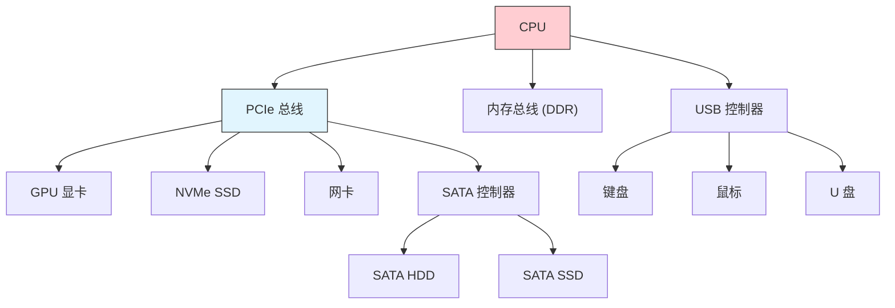
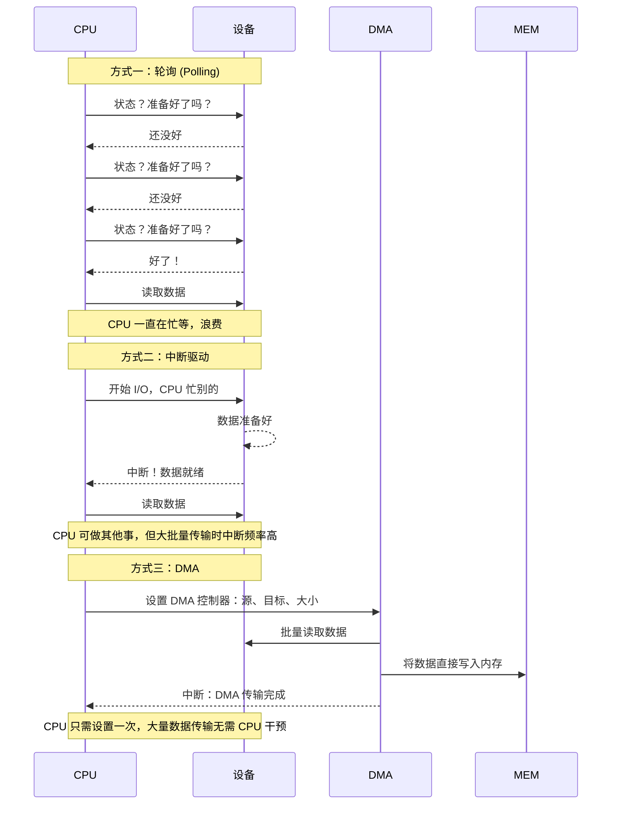
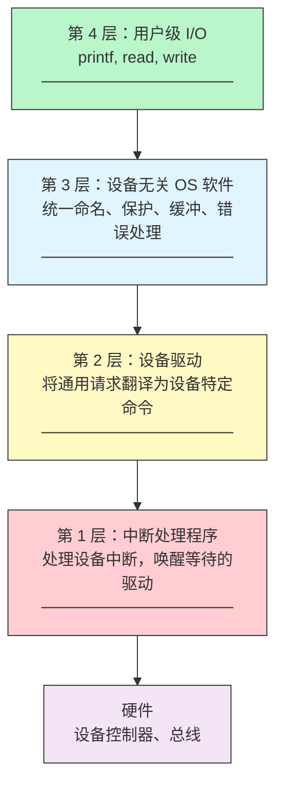
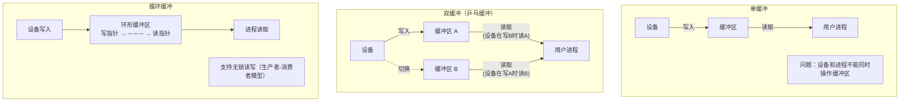
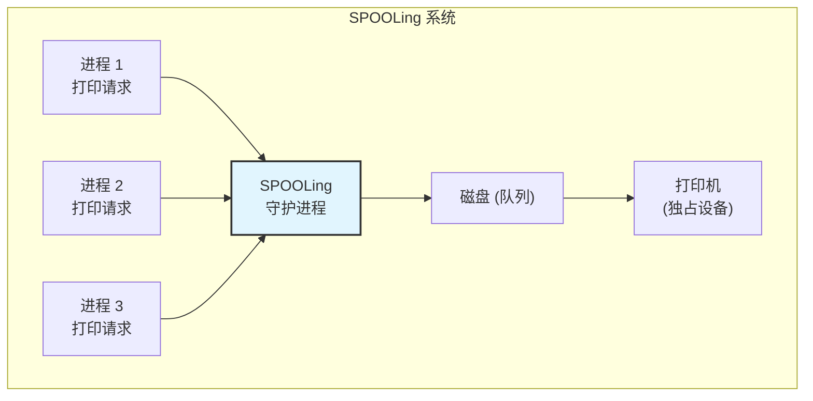

# 35 - I/O设备管理

> 现代计算机系统中，I/O 子系统的代码量远超 CPU 和内存管理——这反映了一个事实：硬件多样性是操作系统面临的最大挑战之一。Linux 通过分层驱动模型、统一的设备文件接口和 sysfs 信息模型，优雅地管理着成千上万种设备。本章从 I/O 的底层原理到 Linux 的高层抽象，逐一展开。

---

## 35.1 I/O 硬件概览

### 设备如何连接到系统



### 设备类型：端口、总线、控制器

| 组件 | 描述 | Linux 中的体现 |
|------|------|---------------|
| **I/O 端口** | CPU 通过专用指令 (in/out) 访问的设备寄存器 | `/proc/ioports` |
| **内存映射 I/O (MMIO)** | 设备寄存器映射到物理地址空间 | `/proc/iomem` |
| **总线** | 连接设备的通信通道 | PCI、USB、I2C、SPI |
| **控制器** | 管理总线上的设备 | USB 控制器、SATA 控制器 |

```bash
# 查看 I/O 端口分配
cat /proc/ioports | head -20
# 0000-0cf7 : PCI Bus 0000:00
#   0000-001f : dma1
#   0020-0021 : pic1
#   0040-0043 : timer0
#   0060-0060 : keyboard

# 查看 MMIO 范围（设备寄存器映射到物理内存地址）
cat /proc/iomem | head -20
# 00000000-00000fff : Reserved
# 00001000-0009ffff : System RAM
# 000a0000-000bffff : PCI Bus 0000:00
# 000c0000-000c7fff : Video ROM

# 查看 PCI 设备树（所有连接到 PCI/PCIe 总线的设备）
lspci -t -v
lspci -nnk
# -nnk: 显示设备 ID + 使用的内核驱动
```

---

## 35.2 I/O 的三种方法

### 轮询 (Polling) vs 中断驱动 vs DMA



| 方法 | CPU 开销 | 延迟 | 适用场景 |
|------|---------|------|---------|
| **轮询** | 极高（忙等） | 最低 | 极低延迟、CPU 无其他任务的场景 |
| **中断驱动** | 中（每次中断上下文切换） | 低 | 少量、间歇性 I/O（键盘、鼠标） |
| **DMA** | 低（只需设置+中断通知） | 中 | 大量数据传输（磁盘、网络、GPU） |

```bash
# 查看 DMA 引擎信息
ls /sys/class/dma/ 2>/dev/null

# 查看直接内存访问的相关统计
cat /proc/interrupts | grep -i dma

# DMA 在现代系统中无处不在：
# - 网卡的 scatter-gather DMA
# - NVMe 的队列直接映射到用户空间（SPDK）
# - GPU 的 DMA-BUF 用于零拷贝共享缓冲区
```

---

## 35.3 I/O 软件层次

### 四层模型



### 各层在 Linux 中的对应

| 层 | Linux 实现 | 可见位置 |
|----|-----------|---------|
| 用户级 I/O | 系统调用封装（glibc） | `strace write` |
| 设备无关软件 | VFS、通用块层、网络协议栈 | 内核源码 `fs/`, `block/`, `net/` |
| 设备驱动 | nvme.ko, e1000e.ko, xhci_hcd.ko | `lsmod`, `/lib/modules/` |
| 中断处理 | irq_handler, tasklet, workqueue | `/proc/interrupts`, `/proc/softirqs` |

---

## 35.4 块设备 vs 字符设备

| 特性 | 块设备 | 字符设备 |
|------|--------|---------|
| **访问方式** | 随机访问（按块/扇区） | 顺序字符流 |
| **是否有缓存** | 是（页缓存/缓冲区） | 否（直接 I/O） |
| **典型示例** | 硬盘、SSD、光盘 | 键盘、鼠标、串口、声卡 |
| **设备号** | b, 主:次 | c, 主:次 |
| **mount 支持** | 是 | 否 |

```bash
# 查看系统中的块设备
lsblk
# NAME   MAJ:MIN RM  SIZE RO TYPE MOUNTPOINTS
# sda      8:0    0  256G  0 disk
# ├─sda1   8:1    0  512M  0 part /boot
# └─sda2   8:2    0  255G  0 part /
# nvme0n1 259:0  0  512G  0 disk
# └─nvme0n1p1 259:1 0 512G 0 part /home

# 查看字符设备
ls -la /dev/tty* /dev/null /dev/zero /dev/random
# crw-rw-rw- 1 root root 1, 3 ... /dev/null
# ^c = 字符设备    ^1 = 主设备号  ^3 = 次设备号

# 查看 /proc/devices 中的设备注册
cat /proc/devices | head -30
# Character devices:
#   1 mem       4 /dev/vc/0    4 tty      5 /dev/tty
# Block devices:
#   7 loop      8 sd         9 md       43 nbd
```

---

## 35.5 设备文件与 udev

### /dev 目录：设备的入口

```bash
# 设备文件的主次设备号
ls -la /dev/sda
# brw-rw---- 1 root disk 8, 0 ... /dev/sda
#                       ^^^^
#                       8 = 主设备号 (SCSI 磁盘)
#                       0 = 次设备号 (第一个磁盘)

# 创建设备节点（手动，通常由 udev 自动管理）
sudo mknod /dev/mydevice c 240 0
# c = 字符设备, 240 = 主设备号, 0 = 次设备号

# 查看 /dev 下的设备分类
ls /dev/disk/
# by-id/    — 按设备 ID（制造商、序列号）
# by-path/  — 按物理路径（PCI 总线位置）
# by-uuid/  — 按文件系统 UUID
# by-label/ — 按文件系统标签
# by-partuuid/ — 按分区 UUID

ls -la /dev/disk/by-uuid/
# lrwxrwxrwx ... a1b2c3d4... -> ../../sda2
```

### udev：动态设备管理

```bash
# udev 是现代 Linux 的设备管理器
systemctl status systemd-udevd

# 查看 udev 规则
ls /etc/udev/rules.d/
ls /usr/lib/udev/rules.d/

# 示例：自定义 udev 规则，当 U 盘插入时自动挂载
cat > /tmp/99-usb-mount.rules << 'EOF'
ACTION=="add", SUBSYSTEM=="block", KERNEL=="sd[a-z]1", \
  RUN+="/usr/local/bin/usb-mount.sh %k"
EOF
sudo cp /tmp/99-usb-mount.rules /etc/udev/rules.d/
sudo udevadm control --reload-rules

# 监控 udev 事件（插入/拔出设备）
sudo udevadm monitor
sudo udevadm monitor --property  # 显示详细属性

# 查询设备属性
sudo udevadm info --query=all --name=/dev/sda
sudo udevadm info --attribute-walk --name=/dev/sda
```

---

## 35.6 缓冲与缓存

### 单缓冲、双缓冲、循环缓冲



```bash
# Linux 的页面缓存（Page Cache）是 I/O 缓冲的核心
# 查看页面缓存占用
grep -E "^Cached|^Buffers" /proc/meminfo
# Cached:     4194304 kB  (文件内容缓存)
# Buffers:     524288 kB  (文件系统元数据缓存)

# 查看脏页（待写回磁盘的缓冲数据）
grep -E "^Dirty|^Writeback" /proc/meminfo
# Dirty:        10240 kB  (修改了但还没写回磁盘)
# Writeback:        0 kB  (正在写回磁盘)

# 手动触发写回
sync
# 或调整脏页写回参数
cat /proc/sys/vm/dirty_ratio          # 脏页比例触发后台写回
cat /proc/sys/vm/dirty_background_ratio  # 脏页比例触发强制同步
```

---

## 35.7 Linux 页缓存与缓冲区缓存

### 页缓存 (Page Cache) vs 缓冲区缓存 (Buffer Cache)

```
Linux 2.4 及之前：
  Page Cache: 缓存文件内容页
  Buffer Cache: 缓存块设备原始块
  → 两个独立的缓存，可能导致同一数据缓存两次

Linux 2.6 及之后：
  统一为 Page Cache
  Buffer Cache 是 Page Cache 的附属（buffer_head 附加在 page 上）
```

```bash
# 查看页缓存的统计
cat /proc/meminfo | grep -E "Cached|Buffers|Dirty|Mapped|SwapCached"

# 查看某个文件的缓存状态
vmtouch /usr/bin/bash  # 需要安装 vmtouch
# Files: 1
# Resident Pages: 150/250  1M/1.6M  65.7%
# 表示 65.7% 的页面在内存中

# 清除页缓存（用于性能测试，生产环境慎用！）
sudo sh -c 'echo 1 > /proc/sys/vm/drop_caches'   # 释放页面缓存
sudo sh -c 'echo 2 > /proc/sys/vm/drop_caches'   # 释放 dentry + inode 缓存
sudo sh -c 'echo 3 > /proc/sys/vm/drop_caches'   # 释放所有缓存
```

---

## 35.8 SPOOLing

### 假脱机技术（SPOOLing）

SPOOLing（Simultaneous Peripheral Operations OnLine）将独占设备改造成**共享设备**：



*   输入井：暂存来自输入设备的数据
*   输出井：暂存要输出到设备的数据
*   输入/输出进程：负责在井和设备间传输数据

```bash
# Linux 的打印系统 CUPS 实现了 SPOOLing 的概念
lpstat -t                    # 查看打印机队列状态
lp /tmp/document.pdf         # 提交打印任务
lpq                          # 查看自己的打印任务
lprm 123                     # 取消任务 123

# CUPS 的后台守护进程
systemctl status cups

# 查看打印队列中的文件
ls /var/spool/cups/
# 这就是 SPOOLing 中"输出井"的物理位置
```

---

## 35.9 /sys 文件系统（sysfs）

### sysfs：内核对象模型

```bash
# sysfs 按总线、设备、驱动等层次组织
ls /sys/
# block/  bus/  class/  dev/  devices/  firmware/  fs/  
# kernel/  module/  power/

# 查看块设备属性
ls /sys/block/sda/
# alignment_offset  dev  discard_alignment  holders/  inflight
# power/  queue/  range  removable  ro  sda1/  sda2/  size
# slaves/  stat  subsystem/  trace/  uevent

# 查看磁盘的 I/O 统计
cat /sys/block/sda/stat
# 输出 17 个字段（以空格分隔）
# 字段1: 完成读请求数
# 字段5: 完成写请求数
# 字段11: I/O 花费的毫秒数
# ...

# 查看设备是否可移动（USB 设备）
cat /sys/block/sdb/removable
# 1 = 可移动设备

# 以树状浏览 sysfs
ls /sys/devices/pci0000:00/
```

### 从 sysfs 获取硬件信息

```bash
# 查看网卡速度
cat /sys/class/net/eth0/speed 2>/dev/null
# 1000 (Mbps)

# 查看电池状态（笔记本）
cat /sys/class/power_supply/BAT0/capacity 2>/dev/null
cat /sys/class/power_supply/BAT0/status 2>/dev/null

# 查看背光亮度
cat /sys/class/backlight/intel_backlight/brightness
cat /sys/class/backlight/intel_backlight/max_brightness

# CPU 拓扑
lscpu -p
cat /sys/devices/system/cpu/cpu0/topology/thread_siblings_list
```

---

## 35.10 设备查看命令

```bash
# 系统硬件总览
lscpu                        # CPU 信息
lsmem                        # 内存信息
lsblk -f                     # 块设备 + 文件系统
lspci -k                     # PCI/PCIe 设备 + 驱动
lsusb -t                     # USB 设备树
lshw -short 2>/dev/null      # 所有硬件（可能需要安装）

# 磁盘与存储
sudo fdisk -l                # 分区表
sudo blkid                   # 块设备 UUID 和文件系统类型
iostat -x 1 5                # 磁盘 I/O 统计
iotop -o                     # 按进程排序的 I/O

# 网络设备
ip link show                 # 网络接口
ethtool eth0                 # 网卡详细信息（速度、双工、驱动）

# PCI 设备的详细寄存器
sudo setpci -s 00:02.0 DUMP 2>/dev/null
```

---

## 35.11 设备驱动基础

### 字符设备驱动最小示例

```c
// 一个极简的字符设备驱动（概念演示）
#include <linux/module.h>
#include <linux/fs.h>
#include <linux/cdev.h>
#include <linux/uaccess.h>

#define DEVICE_NAME "mychardev"
static int major;

static int my_open(struct inode *inode, struct file *file) {
    printk(KERN_INFO "mychardev: opened\n");
    return 0;
}

static ssize_t my_read(struct file *file, char __user *buf, 
                       size_t count, loff_t *pos) {
    char data[] = "Hello from mychardev!\n";
    size_t len = strlen(data);
    if (*pos >= len) return 0;
    if (copy_to_user(buf, data, len)) return -EFAULT;
    *pos += len;
    return len;
}

static struct file_operations fops = {
    .owner = THIS_MODULE,
    .open = my_open,
    .read = my_read,
};

static int __init my_init(void) {
    major = register_chrdev(0, DEVICE_NAME, &fops);
    if (major < 0) return major;
    printk(KERN_INFO "mychardev: registered with major %d\n", major);
    return 0;
}

static void __exit my_exit(void) {
    unregister_chrdev(major, DEVICE_NAME);
}

module_init(my_init);
module_exit(my_exit);
MODULE_LICENSE("GPL");
```

```bash
# 编译和加载上述驱动
# Makefile:
# obj-m += mychardev.o
# 编译: make -C /lib/modules/$(uname -r)/build M=$(pwd) modules

# 加载模块
sudo insmod mychardev.ko
# 查看日志
dmesg | tail
# mychardev: registered with major 240

# 创建设备节点
sudo mknod /dev/mychardev c 240 0

# 测试
cat /dev/mychardev
# Hello from mychardev!

# 卸载
sudo rmmod mychardev
```

### 查看驱动绑定

```bash
# 查看每个 PCI 设备使用的驱动
lspci -k | head -20
# 00:02.0 VGA compatible controller: Intel Corporation ...
#         Kernel driver in use: i915

# 查看驱动和设备之间的绑定关系
ls /sys/bus/pci/drivers/ | head -20
# agpgart-amd64  ahci  e1000e  i915  nvme  xhci_hcd  ...

# 查看驱动绑定的设备
ls /sys/bus/pci/drivers/nvme/
# 0000:01:00.0 -> ../../../../devices/pci0000:00/0000:00:01.0/0000:01:00.0

# 解除绑定并重新绑定（调试用途）
echo "0000:01:00.0" | sudo tee /sys/bus/pci/drivers/nvme/unbind
echo "0000:01:00.0" | sudo tee /sys/bus/pci/drivers/nvme/bind
```

---

## 35.12 I/O 性能分析工具

```bash
# iostat: 块设备 I/O 统计
iostat -x 1 5
# r/s, w/s: 读写请求数/秒
# rkB/s, wkB/s: 读写 KB/秒
# await: 平均等待时间
# %util: 设备利用率（对于 SSD 可能不准，因为并发）

# iotop: 按进程的 I/O 统计
sudo iotop -o          # 只显示有 I/O 活动的进程

# perf: I/O 相关的追踪
sudo perf trace -e 'syscalls:sys_enter_read,syscalls:sys_enter_write' -a sleep 5

# blktrace + blkparse: 块层详细追踪
sudo blktrace -d /dev/sda -o - | blkparse -i - 2>/dev/null | head -50
# 显示每个 I/O 请求的完整生命周期

# bpftrace: eBPF 自定义 I/O 分析
sudo bpftrace -e 'kprobe:blk_account_io_done { 
    @bytes[comm] = sum(arg2); 
}' -c 'sleep 5'
# 按进程统计块 I/O 字节数
```

---

## 35.13 I/O 概念速查

| 概念 | 一句话 | 观测方式 |
|------|--------|---------|
| **I/O 端口** | CPU 通过 in/out 指令访问的设备寄存器 | `cat /proc/ioports` |
| **MMIO** | 映射到物理地址空间的设备寄存器 | `cat /proc/iomem` |
| **DMA** | 不经过 CPU 的直接内存数据传输 | `ls /sys/class/dma/` |
| **IRQ** | 设备向 CPU 请求服务的中断 | `cat /proc/interrupts` |
| **块设备** | 按块随机访问的存储设备 | `lsblk` |
| **字符设备** | 按字节流顺序访问的设备 | `ls -la /dev/tty*` |
| **udev** | 动态设备节点管理器 | `sudo udevadm monitor` |
| **sysfs** | 内核对象模型向用户空间导出的接口 | `ls /sys/` |
| **页缓存** | 文件数据在内存中的副本 | `grep Cached /proc/meminfo` |
| **SPOOLing** | 将独占设备虚拟化为共享设备 | CUPS 打印系统 |
| **IOMMU** | 为设备提供虚拟地址（类似 MMU 但用于 I/O） | `dmesg \| grep -i iommu` |

---

## 相关链接

- [[41-硬件驱动与设备管理]] — 驱动开发与硬件管理深入
- [[36-Linux内核基础与模块]] — 内核模块编程
- [[34-文件系统设计]] — 磁盘 I/O 与文件系统
- [[40-文件系统深入]] — 文件系统实现细节

