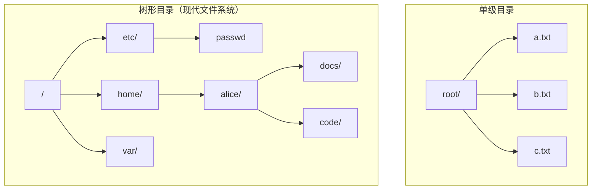
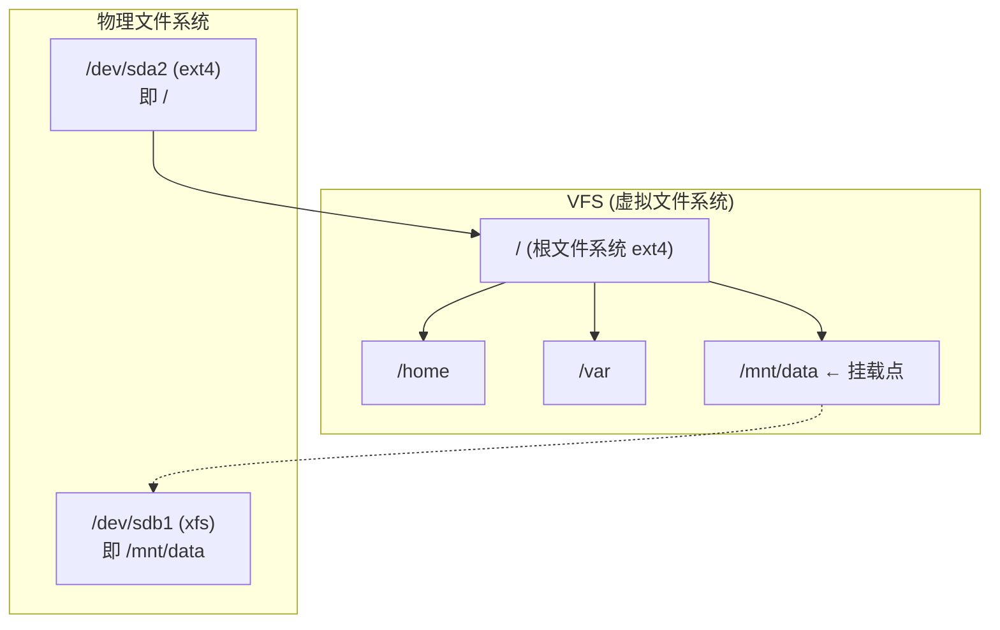
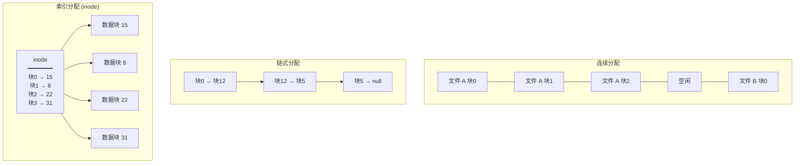
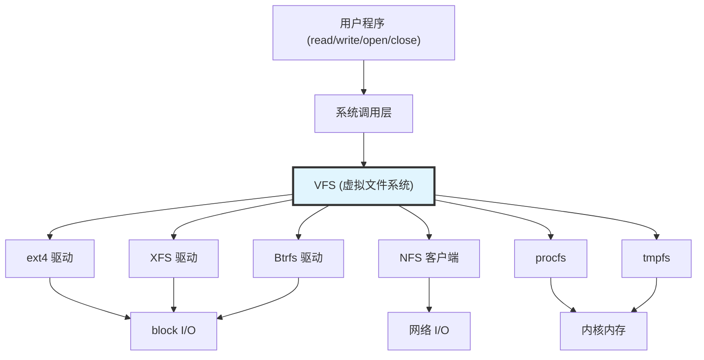
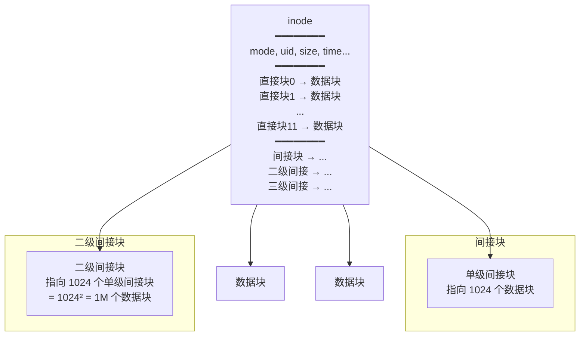
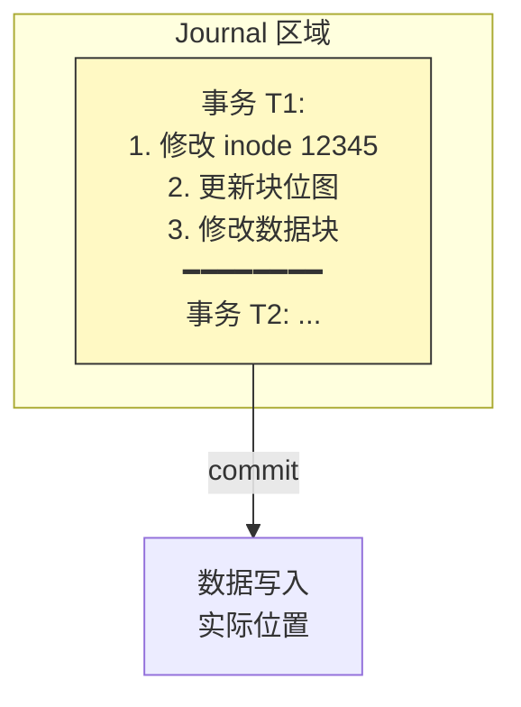

# 34 - 文件系统设计

> 文件系统是操作系统中最持久化的子系统——它负责将数据组织存储在磁盘（或 SSD）上，并为上层应用提供统一的访问接口。Linux 的 VFS（虚拟文件系统）抽象层使得系统可以同时支持数十种不同的文件系统，而用户和应用程序完全无感。本章从文件系统的设计原理出发，逐步深入到 Linux 的具体实现。

---

## 34.1 文件的概念与属性

### 文件是什么

文件是命名的、存储在辅助存储器上的信息集合。从用户视角看，它是数据持久化的最小逻辑单元；从操作系统视角看，它是字节序列到磁盘块的映射。

```bash
# 查看文件的完整属性
stat /etc/passwd
# File: /etc/passwd
# Size: 2897 — 文件大小（字节）
# Blocks: 8 — 分配的 512B 块数
# IO Block: 4096 — 最优 I/O 块大小
# Device: 259,2 — 所在设备（主:次 设备号）
# Inode: 12345678 — inode 编号
# Links: 1 — 硬链接数
# Access: (0644/-rw-r--r--) — 权限
# Uid: (0/root) — 所有者
# Gid: (0/root) — 所属组
# Access: 2024-01-15 — atime
# Modify: 2023-12-01 — mtime
# Change: 2023-12-01 — ctime
# Birth: - — 创建时间（ext4 不支持）

# 查看 inode 编号
ls -i /etc/passwd
# 12345678 /etc/passwd

# 查看打开该文件的进程
lsof /etc/passwd
fuser -v /etc/passwd
```

### 文件类型

```bash
# Linux 中的文件类型（通过 ls -l 第一个字符识别）
# - 普通文件
# d 目录
# l 符号链接
# c 字符设备
# b 块设备
# p 命名管道 (FIFO)
# s Unix 域套接字

# 创建各种文件类型
touch regular_file
mkdir my_dir
ln -s regular_file symlink
mknod my_fifo p # 命名管道
# 字符/块设备由 mknod 和 udev 管理，通常不需要手动创建
```

---

## 34.2 文件访问方法

### 三种访问方法

| 方法 | 描述 | 实现 | 适用场景 |
|------|------|------|---------|
| **顺序访问** | 从文件头到文件尾按顺序读写 | 文件指针维护当前位置 | 日志文件、流媒体 |
| **直接访问**（随机访问） | 跳到任意位置读写 | `lseek()` 系统调用 | 数据库、索引文件 |
| **索引访问** | 通过索引表查找记录位置 | 在文件之上构建索引结构（如 B+ 树） | 大型数据库、ISAM 文件 |

```bash
# 顺序访问示例
cat access.log # 从头到尾

# 直接访问（随机访问）
dd if=/dev/sda of=backup.bin bs=512 count=1 skip=2048
# skip=2048: 从第 2048 个扇区开始读取（随机访问）

# 通过 lseek 进行随机 I/O（C 语言）
# lseek(fd, offset, SEEK_SET); // 跳到 offset 位置
# lseek(fd, 0, SEEK_END); // 跳到文件末尾
```

---

## 34.3 目录结构

### 目录结构的演化



### acyclic graph directory（非循环图目录）

通过符号链接和硬链接，目录结构实际上是一个有向图：

```bash
# 硬链接：共享同一个 inode
echo "data" > original
ln original hardlink
ls -i original hardlink
# 12345 hardlink
# 12345 original ← 相同的 inode 号
stat original | grep Links
# Links: 2 ← 同一个 inode 有两个名字

# 符号链接：独立的 inode，内容为目标路径
ln -s original symlink
ls -i original symlink
# 12345 original
# 54321 symlink ← 不同的 inode 号
readlink symlink
# original

# 硬链接的局限性
# - 不能链接到目录（防止循环）
# - 不能跨文件系统（inode 号是文件系统内的）
```

---

## 34.4 文件系统挂载

### 挂载原理



```bash
# 查看当前挂载
mount | column -t
findmnt --real # 类似但更结构化

# 查看 /etc/fstab（启动时自动挂载配置）
cat /etc/fstab
# 格式：设备 挂载点 文件系统类型 选项 dump fsck_order

# 手动挂载
sudo mount -t ext4 /dev/sdb1 /mnt/data
sudo mount -o ro,noatime /dev/sdc1 /mnt/backup

# 卸载
sudo umount /mnt/data
# 如果设备被占用（"target is busy"）
sudo lsof +D /mnt/data # 查看哪些进程在使用

# 强制卸载（在 NFS 不可达时特别有用）
sudo umount -l /mnt/data # lazy unmount
sudo umount -f /mnt/data # force unmount
```

---

## 34.5 文件分配方法

### 三种分配策略对比



| 分配方法 | 优点 | 缺点 | 在 Linux 中的使用 |
|---------|------|------|------------------|
| **连续分配** | 访问快（一次 seek）、简单 | 外部碎片、文件大小不易扩展 | 几乎不用 |
| **链式分配** | 无外部碎片、文件易扩展 | 随机访问慢（需遍历链）、可靠性差 | FAT 文件系统 |
| **索引分配** | 支持直接访问、无外部碎片 | inode 占用空间、大文件需要多级索引 | **ext4、XFS、Btrfs 等现代文件系统** |

---

## 34.6 空闲空间管理

### 四种方法

| 方法 | 数据结构 | 查找空闲 | Linux 实现 |
|------|---------|---------|-----------|
| **位图 (Bit Vector)** | 每个块用 1 bit 表示空闲/占用 | O(n) 扫描，但可加速 | ext4 的块位图 |
| **空闲链表** | 将空闲块串联为链表 | O(1) 分配，O(1) 释放 | 少量使用 |
| **分组** | 将空闲块地址集中存储 | 快速找到相邻空闲块 | 作为辅助 |
| **计数** | 记录连续空闲块的首地址和长度 | 支持大块连续分配 | ext4 的 extent tree（延伸树） |

```bash
# 查看 ext4 文件系统的空闲空间
sudo dumpe2fs /dev/sda2 2>/dev/null | grep -E "Block count|Free blocks|Block size|Inode count|Free inodes"
# Block count: 26214400 (总块数)
# Free blocks: 10485760 (空闲块数)
# Block size: 4096 (块大小)
# Inode count: 6553600 (总 inode 数)
# Free inodes: 5000000 (空闲 inode 数)

# 文件系统级的使用情况
df -h /
df -i /
# -h: 块使用率
# -i: inode 使用率

# 查看 extent-based 分配（ext4 的 extent tree）
sudo debugfs -R "stat /etc/passwd" /dev/sda2 2>/dev/null | grep -A 20 EXTENTS
# Extents:
# (0-3): 123456-123459
# 表示文件从逻辑块 0 到 3，映射到物理块 123456 到 123459
```

---

## 34.7 磁盘调度算法

### 为什么需要磁盘调度

对于机械硬盘（HDD），磁头移动（seek time）是最大的性能瓶颈。磁盘调度算法通过重排序 I/O 请求来最小化总的寻道时间。SSD 没有机械部件，但仍需要 I/O 调度来管理并发请求。

| 算法 | 策略 | 特点 |
|------|------|------|
| **FCFS** | 按请求到达顺序服务 | 公平，但寻道距离可能很长 |
| **SSTF** | 最短寻道时间优先 | 贪婪，可能饥饿远端请求 |
| **SCAN**（电梯算法） | 磁头往复扫描 | 避免饥饿，但两端请求等待长 |
| **C-SCAN** | 单向扫描，到头后跳回起点 | 等待时间更均匀 |
| **LOOK** | SCAN 改进，只到最远请求而非最边缘 | 更高效 |
| **C-LOOK** | C-SCAN 改进，只到最远请求 | 更高效 |

### Linux I/O 调度器

```bash
# 查看当前 I/O 调度器
cat /sys/block/sda/queue/scheduler
# [mq-deadline] kyber bfq none
# 方括号表示当前使用的调度器

# 查看所有块设备的调度器
for dev in /sys/block/sd* /sys/block/nvme*; do
 [ -f $dev/queue/scheduler ] && echo "$(basename $dev): $(cat $dev/queue/scheduler)"
done

# 更改调度器
echo bfq | sudo tee /sys/block/sda/queue/scheduler
```

| 调度器 | 全称 | 适用场景 |
|--------|------|---------|
| **mq-deadline** | Multi-Queue Deadline | 通用（SSD 和 HDD），确保请求不会超时 |
| **bfq** | Budget Fair Queueing | HDD / 桌面系统，防止单个进程独占磁盘 |
| **kyber** | — | 低延迟场景，用令牌桶调节请求速率 |
| **none** | — | NVMe SSD，多队列并行，无需块层调度 |

```bash
# NVMe SSD 的最佳实践：设置 none + 高队列深度
cat /sys/block/nvme0n1/queue/nr_requests # 队列深度
echo none | sudo tee /sys/block/nvme0n1/queue/scheduler

# 查看 read-ahead 设置
cat /sys/block/sda/queue/read_ahead_kb
# 预读可以提高顺序读性能
```

---

## 34.8 Linux VFS（虚拟文件系统）

### VFS 的架构



VFS 定义了四个核心对象，它们的操作通过函数指针表实现多态：

| 对象 | 数据结构 | 作用 | 对应内核代码 |
|------|---------|------|-------------|
| **super_block** | `struct super_block` | 表示一个已挂载的文件系统 | `fs/super.c` |
| **inode** | `struct inode` | 表示一个文件（元数据+数据块指针） | `fs/inode.c` |
| **dentry** | `struct dentry` | 目录项缓存，加速路径解析 | `fs/dcache.c` |
| **file** | `struct file` | 表示一个打开的文件（进程视角） | `fs/file_table.c` |

```bash
# 查看当前挂载的文件系统
cat /proc/mounts | column -t

# 查看已注册的文件系统类型
cat /proc/filesystems

# VFS 缓存的统计
cat /proc/sys/fs/dentry-state
# 输出：dentry entries, unused, age_limit, want_pages, ...
grep dentry /proc/slabinfo | head -5
```

---

## 34.9 Inode 结构详解

### Inode 的直接/间接块



以 4KB 块大小为例，ext4 inode 的可寻址范围：

| 索引级别 | 指针数量 | 可寻址块数 | 可寻址文件大小 |
|---------|---------|-----------|---------------|
| 直接块 | 12 | 12 | 48 KB |
| 单级间接 | 1024 | 1,024 | 4 MB |
| 二级间接 | 1024² | 1,048,576 | 4 GB |
| 三级间接 | 1024³ | 1,073,741,824 | **4 TB** |

```bash
# 查看文件的 inode 信息
sudo debugfs -R "stat <12345>" /dev/sda2 2>/dev/null
# 或用 stat 查看高级属性
stat /etc/passwd

# 查看 ext4 文件系统的 inode 大小
sudo tune2fs -l /dev/sda2 | grep "Inode size"
# Inode size: 256 (ext4 默认为 256 字节，ext3 为 128)

# ext4 的 Extent Tree（替代了间接块，效率更高）
# Extent 直接记录 (逻辑块起始, 物理块起始, 连续块数) 三元组
# 比间接块更紧凑、更快
```

---

## 34.10 日志文件系统（Journaling）

### 为什么需要日志

考虑一个操作：向文件追加 4KB 数据。需要同时更新：
1. 数据块（写入新数据）
2. inode（更新文件大小、修改时间、块指针）
3. 块位图（标记新块为已占用）

如果系统在步骤 2 和 3 之间崩溃 → **文件系统不一致**！

### 日志的三种模式



| 模式 | mount 选项 | 记录什么 | 安全性 | 性能 |
|------|-----------|---------|--------|------|
| **data=journal** | `-o data=journal` | 元数据 + 数据都记日志 | 最高 | 最低（数据写两次） |
| **data=ordered** | `-o data=ordered` (默认) | 仅元数据记日志；数据先于元数据写回 | 高 | 适中 |
| **data=writeback** | `-o data=writeback` | 仅元数据记日志；数据可晚于元数据写回 | 低（崩溃后文件可能含垃圾数据） | 最高 |

```bash
# 查看挂载选项（是否使用 journal）
findmnt / | grep -o 'data=[a-z]*'
# 输出 data=ordered

# 查看 ext4 文件系统的 journal 信息
sudo dumpe2fs /dev/sda2 2>/dev/null | grep -i journal
# Journal inode: 8
# Journal backup: inode blocks
# Journal features: journal_incompat_revoke journal_64bit
# Journal size: 128M
# Journal length: 32768 (4KB 块)
# Journal sequence: 0x00123456

# 查看 journal 的大小
sudo tune2fs -l /dev/sda2 | grep "Journal"

# XFS 日志类似但独立实现
# 查看 XFS 日志大小
sudo xfs_info /mnt/xfs 2>/dev/null | grep log
```

---

## 34.11 文件系统检查与修复

```bash
# fsck: 文件系统一致性检查（必须在未挂载或只读挂载时运行）
sudo fsck -n /dev/sda2 # 只检查不修复
sudo fsck -y /dev/sda2 # 自动修复所有问题

# 不同类型文件系统的专用工具
# ext4: fsck.ext4 或 e2fsck
# XFS: xfs_repair
# Btrfs: btrfs check

# 强制在下次启动时检查文件系统
sudo touch /forcefsck # 传统方式（可能不再支持）
sudo tune2fs -c 1 /dev/sda2 # 设置挂载 N 次后自动检查

# 查看文件系统最后一次检查时间
sudo tune2fs -l /dev/sda2 | grep "Last checked"
# Last checked: Tue Jan 15 10:30:00 2024
sudo dumpe2fs /dev/sda2 2>/dev/null | grep "Mount count"
# Mount count: 23
# Maximum mount count: -1 (禁用基于计数的检查)
```

---

## 34.12 文件系统命令速查

| 命令 | 作用 |
|------|------|
| `stat FILE` | 查看文件/目录的完整属性（inode、权限、时间戳） |
| `ls -i` | 显示文件的 inode 号 |
| `df -h / -i` | 查看文件系统空间/inode 使用情况 |
| `mount \| findmnt` | 查看挂载信息 |
| `du -sh DIR` | 查看目录/文件的磁盘占用 |
| `tune2fs -l /dev/sdx` | 查看 ext 文件系统超级块参数 |
| `dumpe2fs /dev/sdx` | 查看 ext 文件系统详细布局 |
| `xfs_info /mnt` | 查看 XFS 文件系统信息 |
| `btrfs filesystem show` | 查看 Btrfs 文件系统信息 |
| `lsof FILE` | 查看哪些进程打开了该文件 |
| `fuser -v FILE` | 同上（轻量级） |
| `filefrag FILE` | 查看文件的磁盘碎片情况 |

---

## 相关链接

- [[03-FHS文件系统层次标准]] — Linux 目录结构与 FHS 标准
- [[42-文件系统深入]] — ext4、XFS、Btrfs 等文件系统深入对比
- [[04-文件与目录管理]] — 日常文件操作命令
- [[34-存储管理]] — 内存与磁盘存储的关系
- [[37-I-O设备管理]] — 磁盘硬件与 I/O 调度
