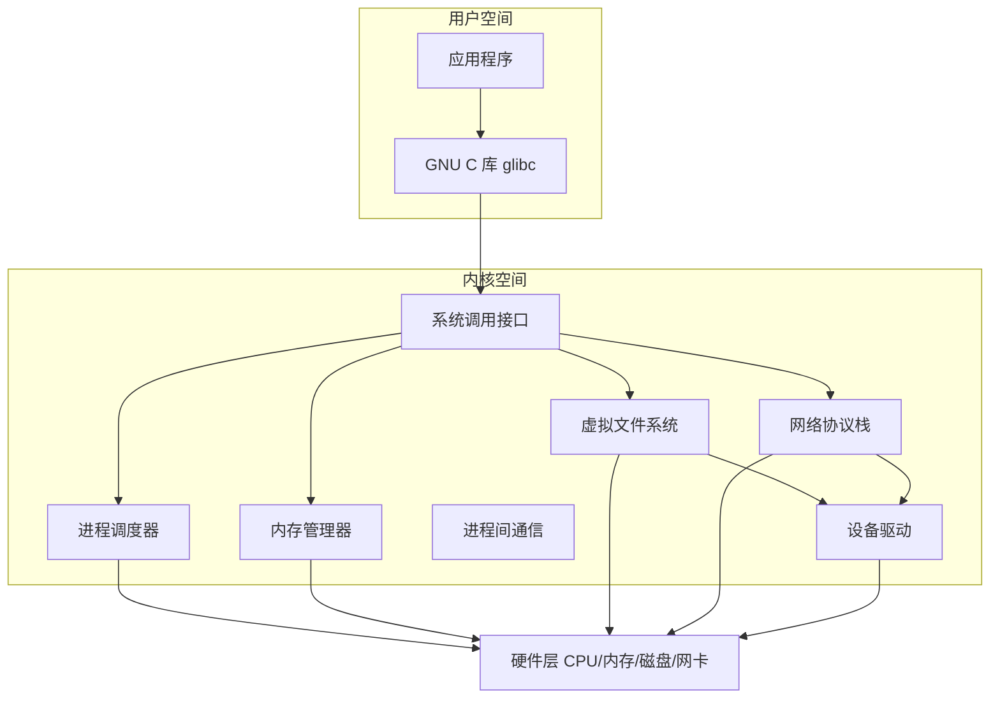

# 36 - Linux 内核基础与模块

> Linux 内核是整个操作系统的核心引擎。从进程调度到内存分配，从文件系统到网络协议栈，内核决定了系统的性能、稳定性和能力边界。本章从架构原理到实战操作，系统讲解内核版本管理、模块机制、参数调优、编译定制的完整知识体系。

---

## 36.1 内核架构概览

Linux 内核采用单体式架构，但通过模块机制实现了灵活的功能扩展。所有核心组件运行在内核空间，共享同一地址空间，确保了极高的运行效率。



### 五大核心子系统

| 子系统 | 职责 | 关键概念 |
|--------|------|----------|
| 进程调度器 | CPU 时间分配、进程优先级、多核调度 | CFS、EEVDF、抢占模式 |
| 内存管理器 | 虚拟内存、物理页分配、内存回收 | 伙伴系统、slab、页缓存、swap |
| 虚拟文件系统（VFS） | 统一文件操作接口、文件抽象 | inode、dentry、superblock |
| 网络协议栈 | TCP/IP 协议族、socket 接口、数据包处理 | netfilter、流量控制、BPF |
| 设备驱动 | 硬件抽象、设备管理、中断处理 | 字符/块/网络设备、设备树 |

### 内核空间与用户空间

```bash
# 查看内存划分
cat /proc/meminfo | grep -E "^MemTotal|^MemFree|^KernelStack|^PageTables"

# 查看系统调用次数（大致了解用户态/内核态切换频率）
vmstat 1 5
```

内核运行在最高特权级（Ring 0），可以直接访问所有硬件和内存；用户程序运行在受限环境（Ring 3），必须通过系统调用请求内核服务。这种设计确保了系统的安全性与稳定性。

---

## 36.2 内核版本体系

### 版本号含义

Linux 内核版本号格式：**主版本.次版本.修订号**

```
例如：6.9.3
 │ │ └── 修订号（patch）：bug 修复和安全更新
 │ └──── 次版本（minor）：新功能和改进
 └────── 主版本（major）：重大里程碑
```

### 版本分支

| 分支类型 | 说明 | 示例 |
|----------|------|------|
| **mainline** | Linus Torvalds 维护的主线，最新功能 | 6.10-rc1 |
| **stable** | 最新稳定版本，每个 mainline 发布后进入 | 6.9.3 |
| **longterm（LTS）** | 长期支持版本，维护 2-6 年 | 6.6.x, 6.1.x, 5.15.x |
| **linux-next** | 汇集各子系统开发分支，用于集成测试 | linux-next-20240701 |
| **distribution** | 各发行版基于上游内核添加的补丁版本 | 如 Ubuntu 的 linux-image |

### 内核发布周期

```
开发周期（约 9-10 周）：

合并窗口（2 周）→ rc1 → rc2 → ... → rc7/rc8 → 正式发布
 │ │
 │ └── 只接受 bug 修复
 └── 接受新功能合并
```

当前 LTS 版本维护情况：

| LTS 版本 | 发布时间 | 维护截止（预计） |
|----------|----------|------------------|
| 6.6 | 2023.10 | 2026.12 |
| 6.1 | 2022.12 | 2026.12 |
| 5.15 | 2021.10 | 2026.10 |
| 5.10 | 2020.12 | 2026.12 |

```bash
# 查看当前运行内核版本
uname -r

# 查看完整内核信息
uname -a

# 查看已安装的内核包（Debian/Ubuntu）
dpkg -l | grep linux-image

# 查看已安装的内核包（RHEL/Fedora）
rpm -q kernel

# 查看已安装的内核包（Arch）
pacman -Q linux linux-lts linux-zen 2>/dev/null

# 获取源码版本信息
cat /proc/version
```

### 发行版内核策略对比

| 发行版 | 内核策略 | 更新方式 |
|--------|----------|----------|
| Arch Linux | 紧跟主线稳定版 | 滚动更新，约 1-2 周更新一次 |
| Debian Stable | 一个发布周期固定一个版本 | 安全修复回移植 |
| Ubuntu LTS | 使用对应的上游 LTS 或 HWE | HWE 可切换到较新内核 |
| Fedora | 紧跟主线 | 每个版本生命周期内多次升级 |
| RHEL/Alma/Rocky | 基于特定版本长期维护 | 大量回移植补丁 |
| openSUSE Tumbleweed | 滚动更新，紧跟主线 | 频繁更新 |

---

## 36.3 /proc 与 /sys 接口

### /proc 文件系统

`/proc` 是一个虚拟文件系统，提供了内核与进程的运行时信息，不占用磁盘空间。

```bash
# CPU 信息
cat /proc/cpuinfo
cat /proc/stat # CPU 使用统计

# 内存信息
cat /proc/meminfo
cat /proc/vmstat

# 磁盘信息
cat /proc/diskstats # 磁盘 I/O 统计
cat /proc/partitions # 分区信息

# 内核信息
cat /proc/version # 内核版本
cat /proc/cmdline # 引导参数
cat /proc/uptime # 运行时间和空闲时间
cat /proc/loadavg # 系统负载

# 进程信息（PID 号为例）
ls /proc/1/ # PID 1（systemd/init）的信息
cat /proc/1/status # 进程状态
cat /proc/1/limits # 资源限制
cat /proc/1/maps # 内存映射
ls -l /proc/1/fd/ # 打开的文件描述符

# 文件系统信息
cat /proc/filesystems # 内核支持的文件系统
cat /proc/mounts # 当前挂载点（比 /etc/mtab 更权威）

# 网络信息
cat /proc/net/tcp # TCP 连接原始数据
cat /proc/net/dev # 网络设备统计

# 内核参数（可读写）
cat /proc/sys/kernel/hostname
ls /proc/sys/ # 可调参数入口
```

### /sys 文件系统

`/sys`（sysfs）导出了内核设备模型，以层次结构展示设备、驱动、总线关系。

```bash
# 设备层次结构
ls /sys/devices/
ls /sys/class/ # 按设备类型分类（net, block, tty, drm...）
ls /sys/bus/ # 按总线类型分类（pci, usb, i2c, platform...）

# 块设备信息
cat /sys/block/sda/size # 磁盘扇区数
cat /sys/block/sda/queue/scheduler # I/O 调度器
cat /sys/block/nvme0n1/queue/rotational # 0=SSD, 1=HDD

# 网络设备信息
cat /sys/class/net/eth0/speed # 网卡速率
cat /sys/class/net/eth0/address # MAC 地址

# 电源管理
ls /sys/power/
cat /sys/power/state # 支持的休眠状态

# 内核模块参数
cat /sys/module/i915/parameters/enable_guc
ls /sys/module/nvidia/parameters/

# 内核追踪（debugfs 与 tracefs）
ls /sys/kernel/debug/ # 调试接口
ls /sys/kernel/tracing/ # ftrace 接口
```

`/proc` 与 `/sys` 的核心区别：

| 特性 | /proc | /sys |
|------|-------|------|
| 设计目的 | 进程信息和内核状态 | 设备模型和驱动配置 |
| 数据结构 | 自由文本格式 | 结构化层次模型 |
| 可写入性 | 部分文件可写（/proc/sys/） | 大量属性文件可读写 |
| 典型用途 | 系统监控、进程信息 | 设备配置、电源管理 |

---

## 36.4 内核模块管理

内核模块（`.ko` 文件）是可以在运行时动态加载和卸载的内核功能扩展。模块化设计使内核本身保持精简，需要时才加载对应功能。

### 模块管理工具链

```bash
# --- lsmod：列出已加载模块 ---
lsmod
lsmod | sort -k 3 -rn | head -20 # 按使用计数排序

# 输出格式：Module | Size | Used by
# nvidia 62512128 1322 nvidia_modeset
# 表示 nvidia 模块占用约 60MB 内存，被 1322 个地方引用

# --- modinfo：查看模块信息 ---
modinfo i915
modinfo -p i915 # 仅显示可用参数
modinfo -n i915 # 显示模块文件路径
modinfo -d nvidia # 显示模块描述

# --- modprobe：智能加载/卸载（自动处理依赖）---
sudo modprobe i915 # 加载模块
sudo modprobe -r i915 # 卸载模块（含未被使用的依赖）
modprobe --show-depends nvidia # 展示依赖关系（不实际加载）
sudo modprobe i915 enable_guc=2 # 带参数加载

# --- insmod/rmmod：底层加载/卸载（不处理依赖）---
sudo insmod /path/to/module.ko # 直接加载指定文件
sudo rmmod module_name # 直接卸载

# --- depmod：生成模块依赖数据库 ---
sudo depmod -a # 扫描所有模块并生成依赖索引
```

### 模块配置持久化

**加载选项配置**（`/etc/modprobe.d/`）：

```bash
# /etc/modprobe.d/i915.conf
options i915 enable_guc=3 enable_fbc=1

# /etc/modprobe.d/nvidia.conf
options nvidia_drm modeset=1 fbdev=1

# /etc/modprobe.d/blacklist.conf
blacklist nouveau
blacklist pcspkr
install nouveau /bin/false # 彻底阻止加载
```

**开机自动加载**（`/etc/modules-load.d/`）：

```bash
# 系统启动时自动加载 vfio-pci 模块
echo "vfio-pci" | sudo tee /etc/modules-load.d/vfio-pci.conf
```

**查看模块参数运行时值**：

```bash
cat /sys/module/i915/parameters/enable_guc
ls /sys/module/i915/parameters/
```

### DKMS 机制

DKMS（Dynamic Kernel Module Support）让外部模块在内核升级时自动重新编译：

```
传统方式：内核升级 → 第三方模块失效 → 手动重新编译
DKMS 方式：内核升级 → DKMS 自动重新编译模块 → 模块继续工作
```

```bash
# 安装 DKMS
sudo apt install dkms # Debian/Ubuntu
sudo dnf install dkms # Fedora/RHEL
sudo pacman -S dkms # Arch

# 查看 DKMS 模块状态
dkms status

# 输出示例：
# nvidia/550.78, 6.9.3-generic, x86_64: installed
```

常见使用 DKMS 的场景包括：NVIDIA 显卡驱动、VirtualBox 内核模块、ZFS 模块、v4l2loopback 虚拟摄像头等。

---

## 36.5 内核参数调优（sysctl）

内核运行时参数位于 `/proc/sys/` 下，可通过 `sysctl` 命令或直接读写文件进行临时修改，通过配置文件进行永久修改。

### sysctl 基本操作

```bash
# 查看所有参数
sysctl -a

# 查看特定类别参数
sysctl vm
sysctl net.ipv4
sysctl kernel

# 查看单个参数
sysctl vm.swappiness
cat /proc/sys/vm/swappiness

# 临时修改（重启后失效）
sudo sysctl -w vm.swappiness=10
echo 10 | sudo tee /proc/sys/vm/swappiness

# 应用配置文件（立即生效）
sudo sysctl -p /etc/sysctl.d/99-custom.conf
sudo sysctl --system # 加载所有配置文件
```

### 配置文件体系

| 路径 | 用途 | 优先级 |
|------|------|--------|
| `/etc/sysctl.conf` | 传统主配置文件 | 低 |
| `/etc/sysctl.d/*.conf` | 模块化配置目录 | 覆盖前者 |
| `/usr/lib/sysctl.d/*.conf` | 软件包提供的默认配置 | 最低 |
| `/run/sysctl.d/*.conf` | 运行时临时配置 | 最高 |

典型配置示例（`/etc/sysctl.d/99-custom.conf`）：

```ini
# === 内存管理 ===
vm.swappiness=10 # 减少 swap 倾向（默认 60）
vm.vfs_cache_pressure=50 # 保留 inode/dentry 缓存
vm.dirty_ratio=10 # 脏页比例上限
vm.dirty_background_ratio=5 # 后台刷脏页阈值
vm.overcommit_memory=0 # 内存过量分配策略（0=启发式）

# === 网络优化 ===
net.core.somaxconn=65535 # 监听队列最大长度
net.core.netdev_max_backlog=65535 # 网卡接收队列长度
net.core.rmem_max=16777216 # 接收缓冲区最大值
net.core.wmem_max=16777216 # 发送缓冲区最大值
net.ipv4.tcp_fastopen=3 # TCP Fast Open
net.ipv4.tcp_tw_reuse=1 # 快速复用 TIME_WAIT 连接
net.ipv4.ip_local_port_range=1024 65535

# === 安全加固 ===
net.ipv4.conf.all.rp_filter=1 # 反向路径过滤（防 IP 欺骗）
net.ipv4.conf.default.accept_redirects=0
net.ipv4.icmp_echo_ignore_broadcasts=1
kernel.dmesg_restrict=1 # 限制非特权用户读取 dmesg
kernel.kptr_restrict=2 # 隐藏内核指针（地址）
kernel.yama.ptrace_scope=2 # 限制 ptrace（仅 root 可追踪子进程）

# === 文件系统 ===
fs.file-max=2097152 # 系统级最大打开文件数
fs.inotify.max_user_watches=524288 # inotify 监控数上限
```

---

## 36.6 内核编译与定制

编译自己的内核可以裁剪不需要的功能、针对特定 CPU 优化、应用补丁或启用实验性特性。

### 获取内核源码

```bash
# 方法一：从 kernel.org 下载
curl -OL https://cdn.kernel.org/pub/linux/kernel/v6.x/linux-6.9.3.tar.xz
tar xf linux-6.9.3.tar.xz
cd linux-6.9.3

# 验证签名
unxz linux-6.9.3.tar.xz
gpg --locate-keys torvalds@kernel.org
gpg --verify linux-6.9.3.tar.sign linux-6.9.3.tar

# 方法二：从 Git 仓库克隆
git clone --depth 1 --branch v6.9.3 \
 https://git.kernel.org/pub/scm/linux/kernel/git/stable/linux.git

# Linus Torvalds 的主线仓库：
# https://github.com/torvalds/linux
# https://git.kernel.org/pub/scm/linux/kernel/git/torvalds/linux.git

# 方法三：使用发行版源码包
# Debian/Ubuntu:
apt source linux
# Fedora/RHEL:
dnf download --source kernel
# Arch:
pkgctl repo clone linux
```

### 内核配置

配置保存在 `.config` 文件中，每个选项有三种状态：`y`（编译进内核）、`m`（编译为模块）、`n`（不编译）。

```bash
# 获取初始配置
zcat /proc/config.gz > .config # 基于当前运行内核
cp /boot/config-$(uname -r) .config # Debian/Ubuntu 方式

# 更新配置到新内核版本
make oldconfig # 交互式逐个询问新选项
make olddefconfig # 新选项全部使用默认值

# 图形化配置界面
make menuconfig # ncurses 界面（最常用）
make nconfig # 增强版 ncurses 界面
make xconfig # Qt 图形界面
make gconfig # GTK 图形界面

# 自动化配置策略
make defconfig # 默认配置
make localmodconfig # 仅保留当前已加载模块的配置
make tinyconfig # 最小配置（嵌入式用）
make allnoconfig # 全部不选
make allyesconfig # 全部选为编译进内核
```

`make menuconfig` 操作方式：

| 按键 | 功能 |
|------|------|
| 方向键 | 导航菜单 |
| Enter | 进入子菜单 |
| Y / M / N | 编译进内核 / 编译为模块 / 不编译 |
| / | 搜索配置项 |
| ? | 查看选项帮助 |
| Esc Esc | 返回上级 |

### 关键配置区域

```
General setup --->
 Preemption Model --->
 (X) Voluntary Kernel Preemption # 服务器推荐
 ( ) Preemptible Kernel # 桌面推荐（低延迟）

File systems --->
 <*> Ext4 # 必选
 <*> Btrfs # 根据需要
 <*> XFS # 根据需要
 <*> F2FS # SSD 优化
 DOS/FAT/EXFAT --->
 <*> VFAT # EFI 分区需要
 <*> exFAT # 大容量 U 盘

Device Drivers --->
 NVMe support --->
 <*> NVM Express # NVMe SSD
 USB support --->
 <*> xHCI HCD # USB 3.0
 Graphics support --->
 <M> AMD GPU / Intel Graphics

Security options --->
 [*] AppArmor support # Debian/Ubuntu 默认
 [*] SELinux support # RHEL/Fedora 默认
 [*] Lockdown (Kernel lockdown feature)
```

### 编译与安装

```bash
# 编译内核（-j 使用所有 CPU 核心）
make -j$(nproc)

# 编译内核模块
make modules

# 安装模块到 /lib/modules/
sudo make modules_install

# 安装内核到 /boot
sudo make install
# 这会复制 bzImage、System.map，并自动更新引导加载器

# 手动安装方式（更精细控制）
sudo cp arch/x86/boot/bzImage /boot/vmlinuz-linux-custom
sudo cp System.map /boot/System.map-linux-custom

# 生成 initramfs（工具取决于发行版）
# Debian/Ubuntu:
sudo update-initramfs -c -k <内核版本>
# Fedora/RHEL/openSUSE:
sudo dracut --kver <内核版本> --force
# Arch:
sudo mkinitcpio -k <内核版本> -g /boot/initramfs-linux-custom.img

# 更新引导配置
# GRUB（通用）:
sudo grub-mkconfig -o /boot/grub/grub.cfg
# systemd-boot（UEFI 系统）:
sudo bootctl update
```

### 发行版特定的内核打包方式

不同发行版有各自的推荐编译方式：

| 发行版 | 推荐打包方式 | 说明 |
|--------|-------------|------|
| Debian/Ubuntu | `make deb-pkg` | 生成 `.deb` 包，通过 dpkg 管理 |
| Fedora/RHEL | `make rpm-pkg` | 生成 `.rpm` 包，通过 rpm/dnf 管理 |
| Arch Linux | makepkg + PKGBUILD | 生成 `.pkg.tar.zst` 包 |
| openSUSE | `make rpm-pkg` / OBS | 或使用开放构建服务 |
| Gentoo | `genkernel` / 手动 | 灵活度最高 |

使用发行版打包方式的好处是：内核可以通过包管理器正常安装、升级和卸载。

### 使用 scripts/config 批量修改配置

```bash
scripts/config --enable CONFIG_BTRFS_FS
scripts/config --disable CONFIG_BLUETOOTH
scripts/config --module CONFIG_DRM_AMDGPU
scripts/config --set-str CONFIG_LOCALVERSION "-custom"
scripts/config --set-val CONFIG_NR_CPUS 16
scripts/config --undefine CONFIG_OLD_FEATURE_TODO_REMOVE

make olddefconfig # 让依赖选项自动调整
```

### 编译优化选项

| 优化技术 | 说明 | 配置项 |
|----------|------|--------|
| Clang LTO | 链接时优化，跨编译单元优化 | `CONFIG_LTO_CLANG_THIN` |
| PGO | 基于运行时 profile 的优化 | `CONFIG_PGO_CLANG` |
| CPU 微架构 | 针对特定 CPU 系列优化 | `CONFIG_MNATIVE_AMD` / `CONFIG_MNATIVE_INTEL` |

---

## 36.7 initramfs 工具链对比

initramfs 是在内存中运行的临时根文件系统，负责加载必要驱动后挂载真正的根分区。

| 工具 | 默认使用的发行版 | 特点 |
|------|-----------------|------|
| **mkinitcpio** | Arch Linux | 配置基于 HOOKS 管道，镜像精简 |
| **initramfs-tools** | Debian/Ubuntu | 基于脚本，兼容性好 |
| **dracut** | Fedora/RHEL/openSUSE | 事件驱动、模块化、通用性强 |
| **booster** | 新兴工具 | 速度极快，用 Go 编写 |

生成 initramfs 的核心逻辑相同：都将内核模块、关键工具、初始化脚本打包成一个 cpio 归档文件，由内核在启动时解压并执行。

详细的 initramfs 配置参考 [[40-引导流程与GRUB]]。

---

## 36.8 内核命令行参数

内核命令行参数在引导时传递给内核，影响系统行为。

```bash
# 查看当前启动参数
cat /proc/cmdline

# 常用内核参数
# root=UUID=xxxx 指定根分区
# rw / ro 根分区读写/只读挂载
# quiet 减少启动日志输出
# loglevel=3 （0=紧急, 7=调试）
# nomodeset 禁用 KMS（显卡故障时）
# init=/bin/bash 直接进入 shell（绕过 init）
# systemd.unit=rescue.target 救援模式
# systemd.unit=emergency.target 紧急模式
# mitigations=off 禁用 CPU 漏洞缓解（性能优先）
# intel_iommu=on / amd_iommu=on 启用 IOMMU
# nvidia-drm.modeset=1 NVIDIA DRM 模式设置
```

**GRUB 中配置**（编辑 `/etc/default/grub`）：

```bash
GRUB_CMDLINE_LINUX_DEFAULT="quiet loglevel=3"
GRUB_CMDLINE_LINUX=""
```

修改后运行 `sudo grub-mkconfig -o /boot/grub/grub.cfg` 生效。

**systemd-boot 中配置**（编辑 `/boot/loader/entries/*.conf`）：

```ini
options root=UUID=xxxx rw quiet loglevel=3
```

不需要重新生成配置，直接编辑即生效。

---

## 36.9 内核调试与追踪

### dmesg 与内核日志

```bash
# 查看内核环形缓冲区
dmesg
dmesg -H # 人类可读格式（时间戳+颜色）
dmesg -T # 显示可读时间戳
dmesg -w # 实时跟踪（类似 tail -f）
dmesg -l err,warn # 按级别过滤（emerg,alert,crit,err,warn,notice,info,debug）

# printk 日志级别
# 0 KERN_EMERG 系统不可用
# 1 KERN_ALERT 必须立即处理
# 2 KERN_CRIT 严重错误
# 3 KERN_ERR 错误
# 4 KERN_WARNING 警告
# 5 KERN_NOTICE 一般通知
# 6 KERN_INFO 信息（默认）
# 7 KERN_DEBUG 调试

# 控制终端显示的日志级别
cat /proc/sys/kernel/printk # 四个值：console_loglevel, default_level, minimum_console_level, default_console_level
echo "3 4 1 7" | sudo tee /proc/sys/kernel/printk
```

### ftrace 内核函数追踪

```bash
# 挂载 tracefs（通常已自动挂载）
mount -t tracefs tracefs /sys/kernel/tracing

# 查看可用追踪器
cat /sys/kernel/tracing/available_tracers

# 启用 function_graph 追踪器
echo function_graph > /sys/kernel/tracing/current_tracer
echo 1 > /sys/kernel/tracing/tracing_on

# 过滤特定函数
echo 'schedule' > /sys/kernel/tracing/set_ftrace_filter

# 查看追踪结果
cat /sys/kernel/tracing/trace

# 停止追踪
echo 0 > /sys/kernel/tracing/tracing_on
echo nop > /sys/kernel/tracing/current_tracer
```

**使用 trace-cmd 简化操作**：

```bash
# 安装
sudo apt install trace-cmd # Debian/Ubuntu
sudo dnf install trace-cmd # Fedora
sudo pacman -S trace-cmd # Arch

# 记录调度器活动
trace-cmd record -p function_graph -g schedule

# 查看报告
trace-cmd report
```

### kprobes 动态探针

```bash
# 在 do_sys_open 函数入口设置探针
echo 'p:myprobe do_sys_openat2 dfd=%di filename=%si' \
 > /sys/kernel/tracing/kprobe_events

# 启用探针
echo 1 > /sys/kernel/tracing/events/kprobes/myprobe/enable

# 查看输出
cat /sys/kernel/tracing/trace

# 清理
echo 0 > /sys/kernel/tracing/events/kprobes/myprobe/enable
echo '-:myprobe' > /sys/kernel/tracing/kprobe_events
```

### eBPF / bpftrace

```bash
# 安装 bpftrace
sudo apt install bpftrace # Debian/Ubuntu
sudo dnf install bpftrace # Fedora

# 追踪所有 open 系统调用
sudo bpftrace -e 'tracepoint:syscalls:sys_enter_openat { printf("%s %s\n", comm, str(args->filename)); }'

# 统计每个进程的系统调用次数
sudo bpftrace -e 'tracepoint:raw_syscalls:sys_enter { @[comm] = count(); }'

# 查看磁盘 I/O 延迟
sudo bpftrace -e 'kprobe:blk_account_io_done { @latency[comm] = hist(nsecs); }'
```

更多追踪工具参考 [[50-BPF与系统追踪]]。

---

## 36.10 内核安全更新

确保内核安全是系统维护的核心任务之一：

```bash
# 检查当前内核中是否有已知 CVE（Debian/Ubuntu）
apt list --upgradable | grep linux-image

# 检查内核版本对应的安全公告
# kernel.org 安全公告: https://www.kernel.org/category/security.html

# 使用 spectre-meltdown-checker 检查漏洞缓解状态
git clone https://github.com/speed47/spectre-meltdown-checker.git
cd spectre-meltdown-checker
sudo ./spectre-meltdown-checker.sh

# 查看当前启用的 CPU 漏洞缓解措施
cat /sys/devices/system/cpu/vulnerabilities/*
```

### 内核安全加固选项速查

```bash
# 查看内核编译的安全配置
zcat /proc/config.gz | grep -E "_HARDEN|_RANDOM|LOCKDOWN|_STRONG|CFI"
```

常用的安全内核参数：

```
mitigations=auto|off CPU 漏洞缓解策略
lockdown=integrity|confidentiality 内核锁定模式
init_on_alloc=1 分配时初始化内存
init_on_free=1 释放时初始化内存
slab_nomerge 禁止 slab 合并
page_alloc.shuffle=1 页面分配随机化
randomize_kstack_offset=on 内核栈偏移随机化
```

---

## 36.11 内核模块编写入门

```c
// hello.c - 最简单的内核模块
#include <linux/init.h>
#include <linux/module.h>
#include <linux/kernel.h>

MODULE_LICENSE("GPL");
MODULE_AUTHOR("Your Name");
MODULE_DESCRIPTION("A simple hello world module");
MODULE_VERSION("1.0");

static int __init hello_init(void)
{
 pr_info("Hello, kernel!\n");
 return 0;
}

static void __exit hello_exit(void)
{
 pr_info("Goodbye, kernel!\n");
}

module_init(hello_init);
module_exit(hello_exit);
```

**Makefile**：

```makefile
obj-m += hello.o
KDIR := /lib/modules/$(shell uname -r)/build

all:
	make -C $(KDIR) M=$(PWD) modules

clean:
	make -C $(KDIR) M=$(PWD) clean
```

```bash
# 确保已安装内核头文件
sudo apt install linux-headers-$(uname -r) # Debian/Ubuntu
sudo dnf install kernel-devel # Fedora/RHEL

# 编译
make

# 加载
sudo insmod hello.ko

# 查看输出
dmesg | tail

# 查看已加载模块
lsmod | grep hello

# 卸载
sudo rmmod hello
```

---

## 36.12 小结

| 主题 | 关键要点 |
|------|----------|
| 内核架构 | 进程调度、内存管理、VFS、网络栈、设备驱动五大子系统 |
| 版本管理 | mainline → stable → LTS 三级体系 |
| 信息接口 | /proc 提供进程和系统状态，/sys 提供设备和驱动配置 |
| 模块管理 | modprobe（智能）、insmod（底层）、DKMS（自动重编译） |
| 参数调优 | sysctl 运行时调整，配置文件永久生效 |
| 编译定制 | menuconfig 配置 → make 编译 → modules_install + install |
| 跨发行版 | 不同 initramfs 工具但原理一致，推荐使用发行版打包方式 |
| 调试 | dmesg、ftrace、kprobes、eBPF/bpftrace |
| 安全 | 关注 CVE、启用内核锁定、控制 printk 权限 |

---

## 36.13 资源链接

- **Linux 内核官网**：https://kernel.org
- **Linus Torvalds 源码仓库**：https://github.com/torvalds/linux
- **内核参数官方文档**：https://www.kernel.org/doc/html/latest/admin-guide/kernel-parameters.html
- **Linux 内核邮件列表（LKML）**：https://lkml.org/
- **内核安全公告**：https://www.kernel.org/category/security.html

---

## 36.14 本章测验

> [!example] 自测题目

> [!question]- 选择题 1：Linux 内核配置中，选项状态 `m` 表示什么？
> - A. 不编译该功能
> - B. 编译进内核（built-in）
> - C. 编译为可加载模块
> - D. 标记为实验性
>
> > 答案
> > **C**
> > `m` 表示编译为可加载内核模块（.ko 文件），需要时通过 modprobe 动态加载；`y` 是编译进内核；`n` 是不编译。

> [!question]- 选择题 2：`/proc` 与 `/sys` 的核心区别是什么？
> - A. `/proc` 是真实文件，`/sys` 是虚拟文件系统
> - B. `/proc` 侧重进程信息和系统状态，`/sys` 侧重设备模型和驱动配置
> - C. `/proc` 只读，`/sys` 可写
> - D. 两者功能完全相同
>
> > 答案
> > **B**
> > `/proc` 最初设计用于进程信息，后来扩展了系统状态；`/sys`（sysfs）专门设计用于导出内核设备模型。

> [!question]- 选择题 3：`make localmodconfig` 的作用是什么？
> - A. 使用最小配置
> - B. 仅保留当前已加载的模块配置
> - C. 恢复默认配置
> - D. 从 /proc/config.gz 导入配置
>
> > 答案
> > **B**
> > 根据当前系统已加载的内核模块自动精简配置，只保留实际使用的模块，大幅缩短编译时间。

> [!question]- 选择题 4：`modprobe` 与 `insmod` 的主要区别是？
> - A. 没有区别
> - B. modprobe 会自动处理模块依赖
> - C. insmod 速度更快
> - D. modprobe 只能加载模块不能卸载
>
> > 答案
> > **B**
> > `modprobe` 会读取 `depmod` 生成的依赖数据库，自动加载被依赖的模块；`insmod` 只加载指定的单个 `.ko` 文件。

> [!question]- 选择题 5：DKMS 的主要功能是什么？
> - A. 管理内核源代码
> - B. 内核升级时自动重新编译外部模块
> - C. 提供内核安全加固功能
> - D. 管理多个内核的引导菜单
>
> > 答案
> > **B**
> > DKMS（Dynamic Kernel Module Support）在内核升级时自动为新内核重新编译注册的外部模块。

> [!question]- 选择题 6：`sysctl` 配置文件应放在哪个目录以实现永久生效？
> - A. /proc/sys/
> - B. /etc/sysctl.d/
> - C. /sys/kernel/
> - D. /usr/lib/sysctl/
>
> > 答案
> > **B**
> > 在 `/etc/sysctl.d/` 下创建 `.conf` 文件可以持久化内核参数配置。

> [!question]- 判断题 7：Linux 内核的 LTO（链接时优化）目前支持 GCC 和 Clang 两种编译器。
> - A. 正确
> - B. 错误
>
> > 答案
> > **B. 错误**
> > 内核 LTO（`CONFIG_LTO_CLANG_THIN` / `CONFIG_LTO_CLANG_FULL`）目前仅支持 Clang 编译器。

> [!question]- 选择题 8：Debian/Ubuntu 推荐的内核编译打包方式是？
> - A. `make install`
> - B. `make deb-pkg`
> - C. `makepkg`
> - D. `make rpm-pkg`
>
> > 答案
> > **B**
> > `make deb-pkg` 生成 `.deb` 包，通过 dpkg 管理。Fedora/RHEL 用 `make rpm-pkg`，Arch 用 makepkg。

> [!question]- 判断题 9：`make mrproper` 只清理编译产物，不会删除 `.config` 文件。
> - A. 正确
> - B. 错误
>
> > 答案
> > **B. 错误**
> > `make mrproper` 是彻底清理，包括 `.config` 文件。只清理编译产物保留配置应使用 `make clean`。

> [!question]- 选择题 10：ftrace 中，`/sys/kernel/tracing/current_tracer` 设为 `function_graph` 表示什么？
> - A. 统计函数调用次数
> - B. 记录函数调用关系和执行时间
> - C. 禁用所有追踪
> - D. 启动内核断点调试
>
> > 答案
> > **B**
> > `function_graph` 追踪器记录函数调用的进入和退出，形成调用图，是分析内核执行路径的核心工具。

---

> **交叉链接**：内核是操作系统的基石。理解其架构后，可进一步学习 [[29-操作系统概述与结构]]、[[40-引导流程与GRUB]] 和 [[39-系统调优与性能分析]]。
