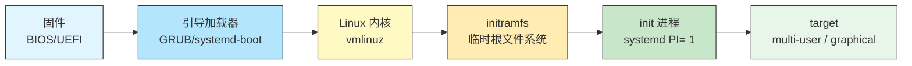
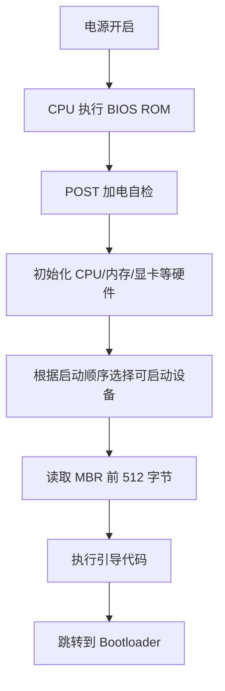
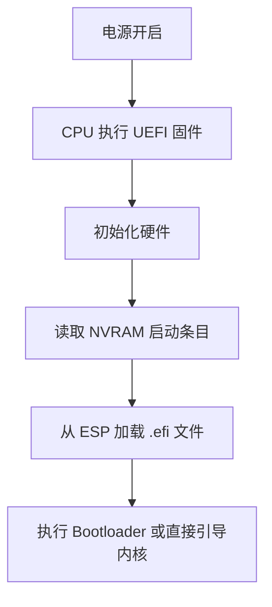

# 38 - 引导流程与 GRUB

> 从按下电源键到登录界面出现，Linux 系统经历了一段精密的多阶段启动过程。掌握从固件到内核再到 init 进程的完整启动链，是排查引导故障、配置多系统共存、优化开机速度的基础。本章以 GRUB2 为核心，覆盖 BIOS/UEFI 启动、引导加载器配置、initramfs 机制与启动故障修复。

---

## 38.1 完整启动链概述



| 阶段 | 主要任务 | 成功标志 |
|------|----------|----------|
| BIOS/UEFI | POST 自检、初始化硬件、选择启动设备 | 加载引导器 |
| 引导加载器 | 显示菜单、加载内核和 initramfs | 跳转到内核入口 |
| 内核 | 解压自身、初始化子系统、挂载 initramfs | 执行 /init |
| initramfs | 加载驱动、挂载根文件系统 | switch_root |
| init (systemd) | 启动服务、到达启动目标 | 登录界面出现 |

```bash
# 检查启动模式：UEFI 还是 BIOS
ls /sys/firmware/efi
# 目录存在且有内容 → UEFI 模式
# 目录不存在 → BIOS（Legacy）模式

# 启动耗时分析
systemd-analyze
# Startup finished in 3.2s (firmware) + 1.1s (loader) + 0.5s (kernel) + 4.2s (userspace) = 9.0s

# firmware: BIOS/UEFI 初始化
# loader: 引导加载器阶段
# kernel: 内核初始化阶段
# userspace: systemd 启动服务阶段
```

---

## 38.2 BIOS 与 UEFI 启动对比

### BIOS（传统 Legacy 启动）



BIOS 启动特点：
- MBR（Master Boot Record）分区表，最多 4 个主分区
- 引导代码位于磁盘第一个扇区（512 字节）
- 不支持大于 2TB 的磁盘作为启动盘（需 GPT + BIOS 引导分区）
- 启动流程长，依赖 16 位实模式

### UEFI（现代启动方式）



UEFI 启动特点：
- GPT 分区表，支持 128 个分区，支持大于 2TB 的磁盘
- ESP（EFI System Partition）：FAT32 格式的专用引导分区
- 引导文件是 `.efi` 可执行程序
- 支持 Secure Boot（安全启动）
- 支持直接引导内核（EFI stub），可不经引导器

```bash
# 查看 ESP 挂载点
lsblk -f | grep -i fat
mount | grep -i efi

# 查看 UEFI 启动条目
efibootmgr -v
# BootCurrent: 0001
# BootOrder: 0001,0000
# Boot0000* Fedora HD(1,GPT,...)/File(\EFI\fedora\shimx64.efi)
# Boot0001* Debian HD(1,GPT,...)/File(\EFI\debian\grubx64.efi)
```

### 各发行版 ESP 挂载惯用路径

| 发行版 | 默认 ESP 挂载点 |
|--------|----------------|
| Debian/Ubuntu | `/boot/efi` |
| Fedora/RHEL | `/boot/efi` |
| Arch Linux | `/boot` 或 `/efi` |
| openSUSE | `/boot/efi` |

---

## 38.3 GRUB2 全面指南

GRUB（GRand Unified Bootloader）是应用最广泛的 Linux 引导加载器，同时支持 BIOS 和 UEFI 启动。

### GRUB 配置文件体系

```
/etc/default/grub ← 主配置文件（用户编辑此文件）
 │
 └── grub-mkconfig ──→ /boot/grub/grub.cfg ← 自动生成的最终配置
 │
/etc/grub.d/ ← 配置脚本片段目录
 ├── 00_header # 标题和全局设置
 ├── 10_linux # 检测 Linux 内核
 ├── 20_memtest86+ # 内存测试条目
 ├── 30_os-prober # 检测其他操作系统
 └── 40_custom # 用户自定义条目
```

**`/etc/default/grub` 关键配置项**：

```bash
# 默认启动条目（0 = 第一个，saved = 上次选择）
GRUB_DEFAULT=0

# 启动菜单超时（秒，-1 = 等待按键）
GRUB_TIMEOUT=5

# 发行版名称
GRUB_DISTRIBUTOR="Debian"

# 普通启动的内核参数
GRUB_CMDLINE_LINUX_DEFAULT="quiet loglevel=3"

# 所有启动条目共用的内核参数（含恢复模式）
GRUB_CMDLINE_LINUX=""

# 是否启用 os-prober 检测其他系统
GRUB_DISABLE_OS_PROBER=false

# 控制台分辨率（gfxpayload=keep 保留图形模式）
GRUB_GFXMODE=1920x1080

# 主题
GRUB_THEME=/boot/grub/themes/theme/theme.txt
```

### GRUB 安装命令

```bash
# === UEFI 系统安装 GRUB ===
# 以下以 Debian/Ubuntu 为例，ESP 挂载在 /boot/efi
sudo grub-install --target=x86_64-efi --efi-directory=/boot/efi --bootloader-id=GRUB

# Fedora/RHEL（ESP 在 /boot/efi）
sudo grub2-install --target=x86_64-efi --efi-directory=/boot/efi --bootloader-id=Fedora

# Arch（ESP 通常挂载在 /boot）
sudo grub-install --target=x86_64-efi --efi-directory=/boot --bootloader-id=GRUB

# === BIOS 系统安装 GRUB ===
sudo grub-install --target=i386-pc /dev/sda
```

```bash
# 生成/更新 GRUB 配置
# Debian/Ubuntu:
sudo update-grub
# 等效：sudo grub-mkconfig -o /boot/grub/grub.cfg

# Fedora/RHEL（UEFI 和 BIOS 路径不同）：
sudo grub2-mkconfig -o /boot/grub2/grub.cfg # BIOS
sudo grub2-mkconfig -o /boot/efi/EFI/fedora/grub.cfg # UEFI

# Arch:
sudo grub-mkconfig -o /boot/grub/grub.cfg
```

### 多内核管理

GRUB 自动检测 `/boot` 中的所有内核镜像并为每个生成菜单条目：

```bash
# 查看检测到的内核
ls -lh /boot/vmlinuz-*

# 示例：同时安装标准内核和 LTS 内核
# Debian/Ubuntu:
sudo apt install linux-image-amd64 linux-image-cloud-amd64
# Fedora:
sudo dnf install kernel kernel-lt # 来自 ELRepo
# Arch:
sudo pacman -S linux linux-lts
```

设置默认启动项：

```bash
# /etc/default/grub
GRUB_DEFAULT=saved # 记住上次选择
GRUB_SAVEDEFAULT=true

# 或指定子菜单中的条目：
# GRUB_DEFAULT="1>2" # 第二个顶级菜单下的第三个条目
```

### GRUB 自定义菜单条目

在 `/etc/grub.d/40_custom` 中添加自定义条目：

```bash
#!/bin/sh
exec tail -n +3 $0
# This file provides an easy way to add custom menu entries.

menuentry "Custom Linux Kernel" {
 insmod gzio
 insmod part_gpt
 insmod ext2
 search --no-floppy --fs-uuid --set=root 12345678-abcd-...
 linux /boot/vmlinuz-custom root=UUID=12345678-abcd-... rw
 initrd /boot/initramfs-custom.img
}
```

---

## 38.4 systemd-boot（UEFI 专用引导器）

systemd-boot（原 gummiboot）是 systemd 项目自带的轻量级 UEFI 引导管理器，仅支持 UEFI 平台。

### 对比表

| 特性 | GRUB | systemd-boot |
|------|------|-------------|
| 启动支持 | BIOS + UEFI | 仅 UEFI |
| 配置复杂度 | 较高（需自动生成配置） | 低（纯文本手动编写） |
| 文件系统支持 | 多种（ext4, Btrfs, XFS...） | 仅 FAT（ESP） |
| 自动检测内核 | 支持（grub-mkconfig 扫描） | 需手动创建条目 |
| 多系统检测 | 通过 os-prober 自动 | 需手动添加条目 |
| 图形主题 | 支持 | 仅文本菜单 |
| LUKS 加密 /boot | 支持 | 不支持 |
| 安全启动 | 支持（需 shim） | 支持 |
| 代码量 | 大而复杂 | 极小 |

### systemd-boot 安装与配置

```bash
# 安装（systemd 发行版通常自带，但可能需要手动部署）
sudo bootctl install
# 这会在 ESP 上安装 systemd-boot 的 EFI 文件

# 文件结构概览
# ESP（如 /boot 或 /efi）/
# ├── EFI/
# │ ├── BOOT/
# │ │ └── BOOTX64.EFI
# │ └── systemd/
# │ └── systemd-bootx64.efi
# ├── loader/
# │ ├── loader.conf ← 主配置
# │ └── entries/
# │ ├── arch.conf ← 启动条目
# │ └── arch-fallback.conf
# ├── vmlinuz-linux
# └── initramfs-linux.img
```

**主配置文件** `/boot/loader/loader.conf`：

```ini
default debian.conf
timeout 3
console-mode max
editor no # 禁止在启动时编辑参数
```

**启动条目** `/boot/loader/entries/debian.conf`：

```ini
title Debian GNU/Linux
linux /vmlinuz-linux
initrd /initramfs-linux.img
options root=UUID=12345678-abcd-efgh-ijkl-123456789012 rw quiet
```

**更新 systemd-boot**：

```bash
sudo bootctl update
bootctl status # 查看当前状态
bootctl list # 列出所有启动条目
```

---

## 38.5 initramfs 深入

initramfs 是一个压缩的临时根文件系统（gzip 压缩的 cpio 归档），由内核在启动时解压到内存中运行。它的用途是在挂载真正根文件系统之前，完成必要的准备工作。

### initramfs 的核心任务

```
1. 内核将 initramfs 解压到 tmpfs（内存文件系统）
2. 执行 /init 脚本
3. 加载必要的内核模块（磁盘控制器、文件系统驱动等）
4. 处理 LUKS 加密分区（输入密码解密）
5. 组装软 RAID（mdadm）和 LVM 卷
6. 识别并挂载真正的根文件系统
7. switch_root：切换到真正的根文件系统
8. 执行真正根文件系统上的 /sbin/init（systemd）
```

### 各发行版的 initramfs 工具

| 工具 | 默认使用的发行版 | 驱动方式 | 配置文件 |
|------|-----------------|----------|----------|
| **mkinitcpio** | Arch Linux | HOOKS 管道（声明式） | `/etc/mkinitcpio.conf` |
| **initramfs-tools** | Debian/Ubuntu | Shell 脚本驱动 | `/etc/initramfs-tools/initramfs.conf` |
| **dracut** | Fedora, RHEL, openSUSE | 模块化、事件驱动 | `/etc/dracut.conf` |
| **booster** | 第三方 | Go 实现，启动极快 | `/etc/booster.yaml` |

### mkinitcpio（Arch Linux）

```bash
# 配置文件 /etc/mkinitcpio.conf

# 需要预加载的内核模块
MODULES=(ext4 btrfs)

# HOOKS 决定了 initramfs 的功能
HOOKS=(base udev autodetect microcode modconf kms keyboard keymap consolefont block filesystems fsck)
```

| Hook | 作用 |
|------|------|
| `base` | 基础工具和脚本 |
| `udev` | 设备管理、动态加载模块 |
| `autodetect` | 自动检测并只包含当前系统需要的模块 |
| `kms` | 早期加载显卡驱动（避免模式切换闪烁）|
| `block` | 块设备驱动 |
| `encrypt` | LUKS 加密支持 |
| `lvm2` | LVM 逻辑卷支持 |
| `filesystems` | 文件系统驱动 |
| `fsck` | 文件系统检查 |
| `resume` | 休眠恢复支持 |

```bash
# 重新生成所有 initramfs
sudo mkinitcpio -P

# 仅生成特定内核的
sudo mkinitcpio -p linux

# 查看 initramfs 内容
lsinitcpio /boot/initramfs-linux.img
```

### initramfs-tools（Debian/Ubuntu）

```bash
# 配置文件 /etc/initramfs-tools/initramfs.conf
# MODULES=most # 包含所有可能需要的模块
# MODULES=dep # 仅包含依赖检测到的模块

# /etc/initramfs-tools/modules 中添加需要预加载的模块
echo "ext4" | sudo tee -a /etc/initramfs-tools/modules

# 重新生成
sudo update-initramfs -u -k all # 为所有内核更新
sudo update-initramfs -c -k $(uname -r) # 为当前内核新建
```

### dracut（Fedora/RHEL/openSUSE）

```bash
# 重新生成 initramfs
sudo dracut --force

# 为特定内核版本生成
sudo dracut --force --kver $(uname -r)

# 查看 dracut 模块
ls /usr/lib/dracut/modules.d/

# 添加特定模块
sudo dracut --force --add "lvm crypt" --kver $(uname -r)

# 配置文件 /etc/dracut.conf 或 /etc/dracut.conf.d/
```

---

## 38.6 内核命令行参数

内核命令行参数在引导时传递给内核，控制系统的启动行为。

```bash
# 查看当前启动使用的参数
cat /proc/cmdline
```

### 常用内核参数分类

**基础参数**：

| 参数 | 说明 |
|------|------|
| `root=UUID=xxxx` | 指定根文件系统分区 |
| `root=/dev/sda1` | 设备名指定根分区 |
| `rw` / `ro` | 根分区读写/只读挂载 |
| `init=/bin/bash` | 指定 init 程序（调试用） |

**日志与调试**：

| 参数 | 说明 |
|------|------|
| `quiet` | 减少启动日志输出 |
| `loglevel=3` | 内核日志级别（0-7，7=debug） |
| `systemd.log_level=debug` | systemd 调试日志 |
| `debug` | 增加日志详细程度 |

**救援与调试模式**：

| 参数 | 说明 |
|------|------|
| `single` / `1` | 单用户模式（SysV init） |
| `systemd.unit=rescue.target` | systemd 救援模式 |
| `systemd.unit=emergency.target` | systemd 紧急模式（最小化） |
| `rd.shell` | initramfs 故障时进入 shell |
| `break=mount` | 在 initramfs 挂载前中断（initramfs-tools） |

**硬件与驱动**：

| 参数 | 说明 |
|------|------|
| `nomodeset` | 禁用 KMS（显卡故障应急） |
| `acpi=off` | 禁用 ACPI（电源管理问题） |
| `noapic` | 禁用 APIC（中断问题） |
| `intel_iommu=on` / `amd_iommu=on` | 启用 IOMMU |
| `nvidia-drm.modeset=1` | NVIDIA DRM 模式设置 |
| `mitigations=off` | 禁用 CPU 漏洞缓解（性能优先） |
| `mem=4G` | 限制可用内存 |

### 各引导器配置参数的方法

**GRUB**：编辑 `/etc/default/grub` 后 `grub-mkconfig` 重新生成，或启动时在菜单中按 `e` 临时编辑。

**systemd-boot**：直接编辑 `/boot/loader/entries/*.conf` 的 `options` 行，立即生效。

**rEFInd**：编辑 `/boot/refind_linux.conf`。

---

## 38.7 引导故障排查与修复

### rescue 模式（救援模式）

系统启动了基本服务，文件系统已挂载为读写，网络可能未启用：

```bash
# 在 GRUB 菜单中进入：
# 1. 选择启动条目，按 e 编辑
# 2. 在 linux 行末尾添加：systemd.unit=rescue.target
# 3. 按 Ctrl+X 启动

# 或从正在运行的系统切换
sudo systemctl isolate rescue.target

# 退出救援模式
systemctl default
# 或 reboot
```

### emergency 模式（紧急模式）

最小化环境，只有根文件系统以只读方式挂载，几乎无服务运行：

```bash
# 内核参数添加：systemd.unit=emergency.target 或 emergency

# 在 emergency 模式下修复：
mount -o remount,rw / # 重新以读写方式挂载根分区
mount -a # 挂载 fstab 中的所有分区

# 编辑配置文件修复问题后：
exit # 或 Ctrl+D 继续正常启动
# reboot
```

### 进入 initramfs Shell

当根分区无法挂载时，不同 initramfs 工具提供不同的急救方式：

```bash
# dracut (Fedora/RHEL):
# 内核参数添加 rd.break=pre-mount 会在挂载根分区前进入 shell

# initramfs-tools (Debian/Ubuntu):
# 内核参数添加 break=mount

# mkinitcpio (Arch):
# 内核参数添加 break=premount
```

### 使用 Live ISO 修复

当系统完全无法启动时，使用安装介质启动进入 Live 环境：

```bash
# 1. 从 Live USB 启动

# 2. 挂载系统分区
mount /dev/sda2 /mnt # 根分区
mount /dev/sda1 /mnt/boot # 启动分区（或 /boot/efi）

# 如果使用 Btrfs 子卷
mount -o subvol=@ /dev/sda2 /mnt
mount -o subvol=@home /dev/sda2 /mnt/home

# 如果使用加密分区
cryptsetup open /dev/sda2 cryptroot
mount /dev/mapper/cryptroot /mnt

# 如果使用 LVM
vgscan && vgchange -ay
mount /dev/vg0/root /mnt

# 3. chroot 进入系统
mount -t proc /proc /mnt/proc
mount -t sysfs /sys /mnt/sys
mount --rbind /dev /mnt/dev
mount --rbind /run /mnt/run
chroot /mnt /bin/bash

# 或使用 arch-chroot / debian-etc chroot 工具

# 4. 在 chroot 中执行修复
# 修复引导（GRUB）
grub-install --target=x86_64-efi --efi-directory=/boot/efi --bootloader-id=GRUB
grub-mkconfig -o /boot/grub/grub.cfg
# 修复引导（systemd-boot）
bootctl install

# 重装内核
apt reinstall linux-image-$(uname -r) # Debian/Ubuntu
dnf reinstall kernel # Fedora

# 重建 initramfs
update-initramfs -u -k all # Debian/Ubuntu
dracut --force # Fedora/RHEL
mkinitcpio -P # Arch

# 5. 退出 chroot 并重启
exit
umount -R /mnt
reboot
```

### 常见引导故障速查

| 现象 | 可能原因 | 修复方法 |
|------|----------|----------|
| GRUB 命令行提示符 `grub>` | GRUB 找不到配置文件或内核 | 手动指定内核路径启动后重建配置 |
| `Kernel panic - not syncing` | 内核模块不匹配、文件系统损坏 | 使用 LTS 内核、Live USB 修复 |
| `Cannot find root filesystem` | UUID 错误、initramfs 缺少驱动 | 检查 fstab UUID、重建 initramfs |
| 卡在 loading initramfs | initramfs 损坏或配置错误 | Live USB 进入后重建 initramfs |
| `Failed to mount /boot/efi` | ESP 损坏或挂载参数错误 | 修复 fstab、检查 ESP 文件系统 |
| 黑屏无任何输出 | 显卡驱动与 KMS 冲突 | 添加 `nomodeset` 内核参数 |

---

## 38.8 UEFI Secure Boot

Secure Boot 是 UEFI 的一项安全功能，确保只有经过签名验证的引导代码才能执行，防止引导过程中的恶意软件注入（bootkit）。

### Secure Boot 工作方式

```
系统固件
 └── 验证签名 → shimx64.efi（微软签名）
 └── 验证签名 → grubx64.efi（发行版签名）
 └── 加载 → 内核（需签名或信任链验证）
 └── 加载 → 内核模块（需签名或禁用模块签名验证）
```

### 各发行版 Secure Boot 支持状态

| 发行版 | Secure Boot 支持情况 |
|--------|---------------------|
| Ubuntu | 原生支持，shim + GRUB |
| Fedora | 原生支持，shim + 签名内核 |
| Debian | 支持，需手动配置 shim |
| openSUSE | 原生支持 |
| RHEL | 原生支持 |
| Arch Linux | 不支持开箱即用，需手动配置 |

```bash
# 检查 Secure Boot 状态
mokutil --sb-state
# SecureBoot enabled / disabled

# 查看已安装的 MOK（Machine Owner Key）
mokutil --list-enrolled
```

### 进入固件设置（UEFI 设置界面）

```bash
# 从 Linux 中直接重启到固件设置界面
systemctl reboot --firmware-setup
```

---

## 38.9 启动性能优化

```bash
# 分析启动耗时
systemd-analyze
systemd-analyze blame # 各服务耗时排序
systemd-analyze critical-chain # 启动关键路径
systemd-analyze plot > /tmp/boot.svg # 可视化启动时间线

# 常见优化措施
# 1. 禁用不需要的启动服务
sudo systemctl disable bluetooth.service
sudo systemctl disable NetworkManager-wait-online.service

# 2. 减少 GRUB 菜单超时
# /etc/default/grub: GRUB_TIMEOUT=1

# 3. 使用 systemd-boot 替代 GRUB（UEFI 系统）

# 4. 使用 SSD 作为系统盘

# 5. 精简 initramfs（仅包含必需的模块和 hook）
```

---

## 38.10 小结

| 阶段 | 关键组件 | 排查要点 |
|------|----------|----------|
| 固件 | BIOS/UEFI | `/sys/firmware/efi` 存在性、Secure Boot 状态 |
| 引导器 | GRUB/systemd-boot/rEFInd | 配置文件、内核文件、内核参数 |
| initramfs | dracut/mkinitcpio/initramfs-tools | HOOKS/模块列表、加密/LVM/RAID配置 |
| 内核 | vmlinuz | `/proc/cmdline`、dmesg 错误信息 |
| init | systemd (PID 1) | `journalctl -b`、`systemctl --failed` |

核心原则：保留一个备用内核（LTS 版本），在引导器配置中最令人安心的一道保险。

---

## 38.11 本章测验

> [!example] 自测题目

> [!question]- 选择题 1：如何判断当前系统是以 UEFI 还是 BIOS 模式启动的？
> - A. 查看 /proc/cpuinfo
> - B. 查看 /sys/firmware/efi 目录是否存在
> - C. 运行 uname -a
> - D. 查看 /etc/fstab
>
> > 答案
> > **B**
> > 如果 `/sys/firmware/efi` 目录存在且有内容，说明系统以 UEFI 模式启动。

> [!question]- 选择题 2：GRUB 配置文件 `/etc/default/grub` 中的 `GRUB_CMDLINE_LINUX_DEFAULT` 用于什么？
> - A. 设置系统主机名
> - B. 指定默认启动的内核版本
> - C. 向内核传递启动参数（正常启动时）
> - D. 设置 GRUB 菜单语言
>
> > 答案
> > **C**
> > 用于向内核传递普通启动时的命令行参数，如 quiet、loglevel 等。

> [!question]- 选择题 3：Fedora/RHEL 中默认使用哪个 initramfs 工具？
> - A. mkinitcpio
> - B. initramfs-tools
> - C. dracut
> - D. booster
>
> > 答案
> > **C**
> > dracut 是 Fedora/RHEL/openSUSE 的默认 initramfs 工具，以模块化和事件驱动为特点。

> [!question]- 选择题 4：systemd-boot 相比 GRUB 的一个核心限制是什么？
> - A. 不支持 UEFI 启动
> - B. 只能读取 FAT 格式的 ESP，不能读取加密分区
> - C. 需要 BIOS 兼容模式
> - D. 无法手动配置启动条目
>
> > 答案
> > **B**
> > systemd-boot 仅支持读取 FAT 格式的 ESP，不能从 ext4/Btrfs/LUKS 加密的 /boot 分区加载内核。

> [!question]- 选择题 5：内核参数 `systemd.unit=emergency.target` 的作用是？
> - A. 正常启动到图形界面
> - B. 进入最小化环境，根文件系统只读挂载
> - C. 启动网络救援模式
> - D. 跳过 initramfs 阶段
>
> > 答案
> > **B**
> > emergency.target 是最小化的启动环境，只以只读方式挂载根文件系统，几乎无服务运行。

> [!question]- 选择题 6：Secure Boot 使用哪个组件来桥接微软签名和发行版签名的信任链？
> - A. GRUB
> - B. systemd-boot
> - C. shim
> - D. rEFInd
>
> > 答案
> > **C**
> > shim 是一个由微软签名的轻量级 EFI 引导程序，负责加载和验证下一个阶段的引导器（如 GRUB）。

> [!question]- 判断题 7：`systemctl reboot --firmware-setup` 可以重启系统并直接进入 UEFI 固件设置界面。
> - A. 正确
> - B. 错误
>
> > 答案
> > **A. 正确**
> > 该命令要求系统重启后进入固件设置界面，无需手动按 F2/Del 等键。

> [!question]- 选择题 8：在 Live ISO 中修复已安装系统时，`arch-chroot /mnt`（或等效的 chroot）之前必须先挂载哪些虚拟文件系统？
> - A. /proc, /sys, /dev, /run
> - B. 仅 /proc
> - C. /boot, /home
> - D. 不需要挂载任何虚拟文件系统
>
> > 答案
> > **A**
> > 进入 chroot 前必须挂载 /proc, /sys, /dev, /run 等虚拟文件系统，包管理、内核工具都依赖它们。

> [!question]- 判断题 9：BIOS 启动模式下，引导代码存储在磁盘的第一个扇区（MBR 前 512 字节）中。
> - A. 正确
> - B. 错误
>
> > 答案
> > **A. 正确**
> > BIOS 模式下，引导代码位于 MBR（Master Boot Record）的前 446 字节引导区。

> [!question]- 选择题 10：要分析启动耗时最长的服务，应使用什么命令？
> - A. systemctl status
> - B. systemd-analyze blame
> - C. journalctl --boot-time
> - D. systemctl list-timers
>
> > 答案
> > **B**
> > `systemd-analyze blame` 按启动耗时从长到短列出所有服务。

---

> **交叉链接**：深入理解内核在引导过程中的角色参考 [[38-Linux内核基础与模块]]。init 进程的详细运作机制参考 [[11-systemd服务管理]]，启动完成后的系统故障排查参考 [[45-系统错误排查与日志分析]]。
