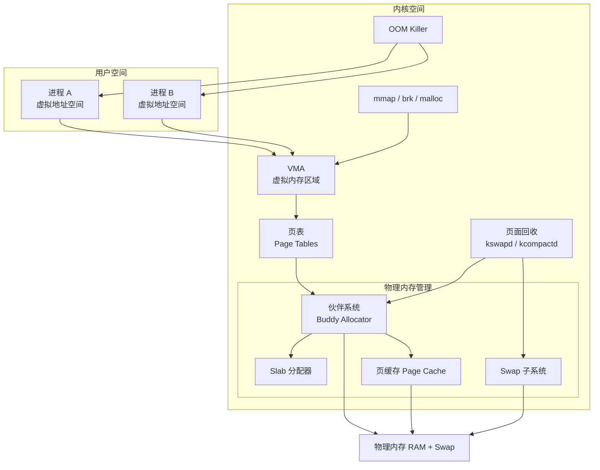

# 39 - 内存管理深入

> 内存管理是操作系统最核心的功能之一。从虚拟地址到物理页框，从页面换出到 OOM Killer，Linux 的内存子系统精妙而复杂。本章深入讲解虚拟内存机制、内核分配器、页面回收、大页、NUMA 等进阶主题，帮助你理解"可用内存"和"空闲内存"之间的本质区别。

---

## 39.1 Linux 内存管理架构



整个内存管理分层为：

| 层级 | 组件 | 职责 |
|------|------|------|
| 用户接口 | malloc / mmap / brk | 进程申请内存的入口 |
| 虚拟内存 | VMA + 页表 + TLB | 虚拟地址到物理地址的映射 |
| 物理分配 | 伙伴系统 + Slab | 物理页框的高效分配 |
| 缓存层 | Page Cache / Buffer Cache | 加速磁盘读写 |
| 回收层 | kswapd / 页面置换 | 内存不足时回收页面 |
| 保护层 | OOM Killer | 极端情况下选择性杀进程 |

---

## 39.2 虚拟内存核心机制

### 虚拟地址空间

每个进程都拥有独立的虚拟地址空间（32 位系统为 4GB，64 位系统为 2^48 字节 = 256TB），这提供了：

- **隔离性**：进程 A 和进程 B 的地址空间互不可见
- **安全性**：一个进程崩溃不会破坏其他进程
- **灵活性**：可以不连续地使用物理内存

```
进程虚拟地址空间布局（简化）：

高地址 0x7FFFFFFFFFFFFFFF
 ┌────────────────────┐
 │ 栈 Stack │ ← 函数调用、局部变量（向下增长）
 ├────────────────────┤
 │ mmap 区域 │ ← 动态库、文件映射、匿名映射
 ├────────────────────┤
 │ 堆 Heap │ ← malloc/new（向上增长）
 ├────────────────────┤
 │ BSS（未初始化数据）│
 ├────────────────────┤
 │ Data（已初始化数据）│
 ├────────────────────┤
 │ Text（代码段） │
 └────────────────────┘
低地址 0x0000000000400000
```

```bash
# 查看进程的内存映射
cat /proc/self/maps
# 地址范围 权限 偏移 设备 inode 路径
# 5603a0000000-5603a0001000 r--p 00000000 08:02 12345 /usr/bin/bash
# 5603a0001000-5603a000a000 r-xp 00001000 08:02 12345 /usr/bin/bash ← Text
# 5603a000a000-5603a000e000 r--p 0000a000 08:02 12345 /usr/bin/bash ← Data
# 5603a000e000-5603a000f000 rw-p 0000e000 08:02 12345 /usr/bin/bash ← BSS
# 7f1234000000-7f1234001000 rw-p 00000000 00:00 0 ← Heap
# 7fff12340000-7fff12360000 rw-p 00000000 00:00 0 [stack] ← Stack

# 查看进程详细内存统计
cat /proc/self/smaps
# 比 maps 多了每个映射区域的详细统计：
# Pss（Proportional Set Size）：按比例分摊共享内存
# Rss（Resident Set Size）：实际驻留在物理内存中的大小
# Swap：被换出到 swap 的量
# Private_Clean / Private_Dirty
# Shared_Clean / Shared_Dirty
```

### 页表与 TLB

```
虚拟地址 → [页表] → 物理地址
 │ ↑
 └──→ [TLB 缓存] ──────┘ （Translation Lookaside Buffer，快速查找）
```

- **页表**：多级结构（x86-64 使用 4 级或 5 级页表），存储虚拟页到物理页框的映射
- **TLB**：CPU 内部的硬件缓存，缓存最近使用的页表项，避免每次访存都查页表
- **页大小**：标准页为 4KB，也支持 2MB（大页）和 1GB（巨型页）

```bash
# 查看系统页大小
getconf PAGE_SIZE # 通常为 4096（4KB）

# 查看 TLB 信息（x86）
cpuid -1 | grep -i tlb # 需安装 cpuid 工具
# 或
lscpu | grep -i "address sizes"
```

---

## 39.3 内核内存分配器

### 伙伴系统（Buddy Allocator）

伙伴系统是 Linux 物理页框分配的核心机制，将物理内存组织为 2^n 个连续页的链表：

```
order 0: 1 页 (4KB) → [4K] [4K] [4K] [4K] ...
order 1: 2 页 (8KB) → [8K] [8K] ...
order 2: 4 页 (16KB) → [16K] [16K] ...
order 3: 8 页 (32KB) → [32K] ...
...
order 10: 1024 页 (4MB)
```

分配时找到合适的 order，如果不够则从更大的 order 中分裂；释放时检查相邻伙伴是否也空闲，是则合并为更大的 order。

```bash
# 查看伙伴系统状态
cat /proc/buddyinfo
# Node 0, zone Normal 100 200 150 80 40 20 10 5 2 1 0
# order: 0 1 2 3 4 5 6 7 8 9 10
# 数字表示该 order 的空闲块数
```

### Slab / Slub / Slob 分配器

伙伴系统以页为单位分配（至少 4KB），但内核经常需要分配几十到几百字节的小对象（如 inode、dentry）。Slab 分配器在伙伴系统之上提供高效的小对象分配：

| 分配器 | 特点 | Linux 版本 |
|--------|------|------------|
| **Slab** | 传统，缓存友好但复杂 | 早期版本 |
| **Slub** | Slab 简化版，当前默认 | 2.6.23 至今 |
| **Slob** | 极度精简，嵌入式用 | 已废弃 |

```bash
# 查看 slab 信息
cat /proc/slabinfo | head
# 或使用 slabtop
slabtop -s c # 按缓存大小排序
```

### kmalloc vs vmalloc vs malloc

| 函数 | 分配区域 | 连续性 | 适用场景 |
|------|----------|--------|----------|
| `kmalloc()` | 物理连续 | 物理 + 虚拟均连续 | 小对象（< 128KB），DMA 需要 |
| `vmalloc()` | 虚拟连续 | 仅虚拟连续 | 大块分配，不需要物理连续 |
| `malloc()` | 用户空间 | 虚拟连续（内核代为管理） | 用户态 C 程序 |

`kmalloc` 返回的物理地址连续，适合 DMA 操作；`vmalloc` 返回虚拟连续但物理不连续的内存，开销较大。

---

## 39.4 页缓存与缓冲区缓存

### 页缓存（Page Cache）

Linux 使用空闲内存作为磁盘读写的缓存，大幅减少磁盘 I/O：

```
文件读取：
 进程 read() → 检查 Page Cache → 命中？直接返回
 → 未命中？从磁盘读入 Page Cache 再返回

文件写入（writeback 模式）：
 进程 write() → 写入 Page Cache → 标记为 dirty
 → 稍后由后台线程（flusher）异步写入磁盘
```

```bash
# 查看页缓存使用情况
cat /proc/meminfo | grep -i cache
# Cached: 已使用的页缓存（含 tmpfs）
# SwapCached: 页缓存中的 swap 条目
# Dirty: 待写入磁盘的脏页
# Writeback: 当前正在写入磁盘的脏页

# 查看脏页和回写活动
cat /proc/vmstat | grep -E "nr_dirty|nr_writeback"

# 手动触发缓存刷新
sync
echo 3 | sudo tee /proc/sys/vm/drop_caches # 清理缓存（谨慎使用）
```

Linux 的 `free` 输出中，"free" 列较低并不代表系统内存不足——大部分"缺失"的内存实际被用于文件缓存（buff/cache），可随时被回收。

---

## 39.5 Swapping 与页面置换

### Swap 基础

Swap 是磁盘上的一块区域（可以是独立分区或文件），当物理内存不足时，将不活跃的页面换出到 swap 中。

```bash
# 创建 swap 文件
sudo fallocate -l 8G /swapfile
sudo chmod 600 /swapfile
sudo mkswap /swapfile
sudo swapon /swapfile
echo '/swapfile none swap sw 0 0' | sudo tee -a /etc/fstab

# 查看 swap 使用情况
swapon --show
free -h | grep Swap
cat /proc/swaps

# 设置 swap 优先级（-2 到 32767，越高越优先）
sudo swapon -p 10 /dev/sda2

# 禁用 swap
sudo swapoff /dev/sda2
```

### swappiness 参数

```bash
# swappiness 控制内核回收内存时对 swap 的倾向程度（0-200，默认 60）
cat /proc/sys/vm/swappiness

# 0： 尽可能避免使用 swap（纯内存回收）
# 1-59：偏向于回收文件缓存
# 60： 默认值
# 100：平等对待文件缓存和匿名页
# >100：激进换出匿名页

sudo sysctl -w vm.swappiness=10 # 大内存服务器常用值
```

### kswapd 与页面回收

`kswapd` 是内核的页面回收守护进程，当内存水位降低到阈值以下时被唤醒，执行页面回收：

```
水位线（以 zone 为单位）：
 high 水位：高于此，kswapd 休眠
 low 水位：低于此，kswapd 被唤醒
 min 水位：低于此，触发直接回收（direct reclaim，进程阻塞）
```

```bash
# 查看内存区域与水位线
cat /proc/zoneinfo | grep -E "Node|zone|free|high|low|min|scanned|reclaimed"
```

---

## 39.6 OOM Killer（Out-of-Memory Killer）

当系统内存极度匮乏、连内核都无法分配内存时，OOM Killer 会选择并杀死一个进程来释放内存。

```bash
# 查看 OOM Killer 日志
dmesg | grep -i "out of memory"
journalctl -b | grep -i oom

# OOM 日志关键信息：
# Out of memory: Killed process 1234 (firefox) total-vm:8GB, anon-rss:2GB
# oom_score_adj=0 ← 分数，越高越容易被杀
```

### 调整 OOM 倾向

```bash
# 查看进程的 OOM 分数
cat /proc/$(pgrep firefox)/oom_score # 当前分数（动态）
cat /proc/$(pgrep firefox)/oom_score_adj # 调整值（默认 0）

# 让某个进程更不容易被杀（-1000 到 1000，越低越不容易）
echo -500 | sudo tee /proc/$(pgrep mysqld)/oom_score_adj

# 让某个进程完全免疫 OOM
echo -1000 | sudo tee /proc/$(pgrep sshd)/oom_score_adj

# 通过 systemd service 设置
# Service 段中添加：OOMScoreAdjust=-500
```

### systemd-oomd

现代 Linux 上（systemd 247+），`systemd-oomd` 提供比内核 OOM Killer 更精细的 OOM 处理策略：

```bash
# 检查 systemd-oomd 状态
systemctl status systemd-oomd

# 配置文件 /etc/systemd/oomd.conf
# [OOM]
# SwapUsedLimit=90%
# DefaultMemoryPressureLimit=80%
```

---

## 39.7 内存过量分配（Memory Overcommit）

Linux 默认允许进程申请的虚拟内存总和超过实际物理内存（因为进程通常不会用满所有申请的内存），这称为"内存过量分配"。

```bash
# 查看 overcommit 策略
cat /proc/sys/vm/overcommit_memory
# 0：启发式过度分配（默认）
# 1：始终允许过度分配
# 2：不允许过度分配，commit 上限 = (物理内存 * overcommit_ratio / 100) + Swap

cat /proc/sys/vm/overcommit_ratio # 默认 50

# 查看当前 commit 状态
cat /proc/meminfo | grep Commit
# CommitLimit: 已承诺上限
# Committed_AS: 当前已承诺的总量
```

设置为 `overcommit_memory=2` 可获得更可预测的行为，适合对稳定性要求高的服务器。

---

## 39.8 大页（Huge Pages）

标准页大小为 4KB，对于数据库、JVM 等大量使用内存的应用，4KB 页导致页表项过多、TLB 命中率低。大页通过使用 2MB 或 1GB 页减少页表项数量。

```bash
# 查看当前大页配置
cat /proc/meminfo | grep -i huge
# HugePages_Total: 0 # 系统允许的大页总数
# HugePages_Free: 0 # 空闲大页数
# Hugepagesize: 2048 kB # 大页大小（2MB）
# HugePages_Rsvd: 0 # 已预留但未分配的大页

# 配置大页数量
echo 1024 | sudo tee /proc/sys/vm/nr_hugepages # 分配 1024 个大页 = 2GB
# 或
sudo sysctl -w vm.nr_hugepages=1024
```

### 透明大页（Transparent Huge Pages, THP）

THP 自动将连续的大块内存合并为大页，无需应用程序显式使用：

```bash
# 查看 THP 状态
cat /sys/kernel/mm/transparent_hugepage/enabled
# always [madvise] never

# always: 始终尝试使用 THP
# madvise: 仅当程序通过 madvise 请求时使用
# never: 禁用 THP

# 临时切换
echo always | sudo tee /sys/kernel/mm/transparent_hugepage/enabled

# 查看 THP 统计
cat /sys/kernel/mm/transparent_hugepage/defrag
```

> 数据库（如 Redis、MongoDB）通常推荐禁用 THP，因为大页分配和拆分可能引入性能抖动。

---

## 39.9 NUMA 感知

多 CPU 服务器上，内存被划分为多个节点，每个 CPU 拥有自己"本地"的内存节点（访问更快）和"远程"节点（访问较慢），这就是 NUMA 架构。

```bash
# 安装 NUMA 工具
sudo apt install numactl # Debian/Ubuntu
sudo dnf install numactl # Fedora/RHEL

# 查看 NUMA 拓扑
numactl --hardware
# available: 2 nodes (0-1)
# node 0 cpus: 0-15
# node 0 size: 64 GB
# node 1 cpus: 16-31
# node 1 size: 64 GB
# node distances:
# node 0 1
# 0: 10 21 ← 本地访问 cost 10，远程 cost 21

# 查看 NUMA 统计
numastat
numastat -p 1234 # 特定进程的内存分布

# 将进程绑定到特定 NUMA 节点
numactl --cpunodebind=0 --membind=0 ./my_program

lscpu | grep NUMA
```

---

## 39.10 内存 cgroups（cgroups v2）

通过 cgroups v2 可以为服务或用户组设置严格的内存限制：

```bash
# 查看内存 cgroup 控制器
cat /sys/fs/cgroup/cgroup.controllers

# 查看特定 systemd 服务的内存使用
cat /sys/fs/cgroup/system.slice/nginx.service/memory.current
cat /sys/fs/cgroup/system.slice/nginx.service/memory.max
cat /sys/fs/cgroup/system.slice/nginx.service/memory.stat

# 设置内存限制（通过 systemd service override）
sudo systemctl edit nginx
```

```ini
[Service]
MemoryMax=2G
MemoryHigh=1.5G
# MemoryMax: 硬限制，达到后 OOM Kill
# MemoryHigh: 软限制，达到后触发内存回收
```

---

## 39.11 内存排查实战

### 定位内存泄漏

```bash
# 1. 查看总体趋势
sar -r 1 10 # 每 1 秒采样 10 次

# 2. 找出内存增长最快的进程
smem -s pss -H 1 # 按 PSS 排序
# 多次采样，观察哪个进程 PSS 持续增长

# 3. 深入分析可疑进程
cat /proc/<PID>/smaps | grep Pss | awk '{sum+=$2} END{print sum " kB"}'

# 4. 查看该进程的 mmap 区域
pmap -x <PID> # 显示进程所有映射区域及大小

# 5. 追踪内存分配（开发环境）
# valgrind --leak-check=full ./program
# heaptrack ./program
```

### 理解 meminfo

```bash
# 内存使用计算公式
# MemTotal = MemFree + MemUsed + Buffers + Cached + ...
# MemUsed = 实际被进程和内核占用的物理内存
# Cached = 可回收的页缓存

# 判断真正可用内存时看 MemAvailable
cat /proc/meminfo | grep MemAvailable
# MemAvailable 考虑了可回收缓存，是系统认为"可分配给新进程"的内存
```

---

## 39.12 小结

| 主题 | 关键要点 |
|------|----------|
| 虚拟内存 | 页表 + TLB 实现地址翻译，进程地址空间独立安全 |
| 伙伴系统 | 物理页框分配基础，order 0-10，合并/分裂策略 |
| Slab/Slub | 内核小对象分配器，缓存友好 |
| 页缓存 | 利用空闲内存缓存文件 I/O，可随时回收 |
| Swap | 物理内存不足时的后备，swappiness 控制回收倾向 |
| OOM Killer | 极端情况下杀进程，可通过 oom_score_adj 调节 |
| 大页 | 2MB/1GB 页减少 TLB miss，THP 自动合并 |
| NUMA | 多 CPU 服务器的内存局部性优化 |
| cgroups | 进程组级别的内存硬/软限制 |

---

> **交叉链接**：内存管理与进程调度紧密相连，可延伸阅读 [[34-存储管理]]、[[35-虚拟存储与页面置换]]。性能优化视角参考 [[39-系统调优与性能分析]]。OOM Killer 与 cgroups 策略在 [[11-systemd服务管理]] 中也有涉及。
