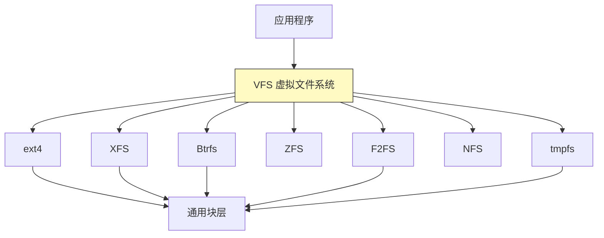

# 40 - 文件系统深入

> 文件系统是操作系统与存储设备之间的桥梁。从 ext4 的日志机制到 Btrfs 的写时复制，从 XFS 的分配组到 ZFS 的检查池，Linux 生态拥有丰富多样的文件系统选择。本章深入 VFS 层架构，对比主流文件系统的内部设计，讲解挂载策略、文件系统检查与创建，以及性能基准测试。

---

## 40.1 磁盘基础：扇区、分区与分区表

### 磁盘物理结构

```
磁盘（/dev/sda, /dev/nvme0n1）
 └── 扇区（Sector）：最小物理读写单位（通常 512 字节或 4096 字节）
 └── 分区（Partition）：磁盘上的逻辑区域
 └── 文件系统：组织分区内数据的结构
```

```bash
# 查看磁盘扇区信息
fdisk -l /dev/sda
# Sector size (logical/physical): 512 bytes / 4096 bytes
# 逻辑扇区 512B（软件兼容），物理扇区 4KB（硬件实际）

# 查看 NVMe 扇区
sudo nvme id-ns /dev/nvme0n1 | grep -i size

# 查看块设备队列参数
cat /sys/block/sda/queue/physical_block_size
cat /sys/block/sda/queue/logical_block_size
```

### MBR vs GPT

| 特性 | MBR（传统） | GPT（现代） |
|------|-----------|----------|
| 最大磁盘容量 | 2TB | 9.4ZB（理论无限） |
| 最大分区数 | 4 个主分区（或 3 + 扩展） | 128 个（可扩展） |
| 冗余备份 | 无（分区表保存在磁盘首部） | 有（头部 + 尾部各一份） |
| CRC 校验 | 无 | 有 |
| 引导方式 | BIOS Legacy | UEFI（也支持 BIOS 兼容） |
| 分区标识 | 1 字节类型码 | GUID（全局唯一标识符） |

```bash
# 查看分区表类型
sudo fdisk -l /dev/sda | grep "Disklabel type"
# Disklabel type: gpt / dos

sudo parted /dev/sda print | head
```

---

## 40.2 VFS：虚拟文件系统层

VFS（Virtual File System）是 Linux 内核中的一个抽象层，为所有文件系统提供统一的操作接口。



VFS 的四个核心对象：

| 对象 | 内核数据结构 | 含义 | 示例 |
|------|-------------|------|------|
| **superblock** | `struct super_block` | 描述已挂载的文件系统 | 每个挂载点一个 |
| **inode** | `struct inode` | 描述一个文件（不含文件名） | 权限、大小、数据块位置 |
| **dentry** | `struct dentry` | 目录项，关联文件名与 inode | 路径查找 |
| **file** | `struct file` | 描述一个打开的文件 | 读写位置、文件标志 |

```
路径查找过程（以 /home/user/file.txt 为例）：
 根 dentry → "home" dentry → "user" dentry → "file.txt" dentry → inode → 数据块
```

```bash
# 查看当前支持的文件系统
cat /proc/filesystems

# 查看 VFS 缓存统计
cat /proc/sys/vm/vfs_cache_pressure # 默认 100，降低此值可保留更多 dentry 缓存
cat /proc/slabinfo | grep dentry # dentry 缓存使用情况
```

---

## 40.3 ext4 文件系统

ext4 是 Linux 上使用最广泛的文件系统，是 ext3/ext2 的演进版本。

### 核心特性

| 特性 | 说明 |
|------|------|
| **extents（区段）** | 替代 ext3 的间接块映射，降低大文件寻址开销 |
| **journal（日志）** | 元数据变更先写日志，保证文件系统一致性 |
| **延迟分配（delayed allocation）** | 写入时先分配缓存，提交到磁盘时才分配物理块 |
| **多块分配** | 一次分配多个连续块，减少碎片 |
| **在线碎片整理** | e4defrag |
| **文件系统校验** | e2fsck，并支持元数据校验和 |

### 日志模式

| 模式 | 挂载选项 | 行为 | 风险 |
|------|----------|------|------|
| **data=ordered** | 默认 | 元数据日志化，数据先于元数据写入 | 最低风险 |
| **data=writeback** | data=writeback | 仅元数据日志化，不保证数据顺序 | 可能产生文件垃圾 |
| **data=journal** | data=journal | 所有数据写入日志（两次写入） | 最安全但最慢 |

```bash
# 创建 ext4 文件系统
sudo mkfs.ext4 -L "data" /dev/sda1

# 创建时指定参数
sudo mkfs.ext4 -b 4096 -i 16384 -I 256 -O ^has_journal /dev/sda1
# -b 块大小 -i inode 比（每多少字节一个 inode）
# -I inode 大小 -O ^has_journal 关闭日志

# 查看 ext4 文件系统信息
sudo tune2fs -l /dev/sda1
sudo dumpe2fs -h /dev/sda1

# 文件系统检查
sudo e2fsck -f /dev/sda1 # 强制检查
sudo e2fsck -p /dev/sda1 # 自动修复（preen）

# 碎片整理
sudo e4defrag /mnt/data # 整理整个分区
sudo e4defrag /path/to/file # 整理单个文件

# 调整 ext4 文件系统大小
sudo resize2fs /dev/sda1 # 扩展到分区大小
sudo resize2fs /dev/sda1 100G # 指定目标大小（需分区先扩展/缩小）
```

### superblock 与 inode

```bash
# 查看 superblock 信息
sudo dumpe2fs /dev/sda1 | grep -i "superblock\|block count\|inode count"

# 备份 superblock 的位置
sudo dumpe2fs /dev/sda1 | grep "Backup superblock"
# 主 superblock 损坏时可用备用手动恢复：
# sudo e2fsck -b 32768 /dev/sda1
```

---

## 40.4 XFS 文件系统

XFS 是由 SGI 开发的高性能 64 位日志文件系统，是 RHEL/Fedora 的默认选择。

### 核心特性

| 特性 | 说明 |
|------|------|
| **分配组（Allocation Groups）** | 将文件系统划分为多个独立管理区域，支持并行 I/O |
| **B+ 树索引** | 所有元数据使用 B+ 树组织，查找效率高 |
| **延迟分配** | 写入时最大化分配连续空间 |
| **在线扩展** | 支持在线增大文件系统（不支持缩小） |
| **预分配** | 对追加写入场景（日志文件）的预留空间 |

```bash
# 创建 XFS 文件系统
sudo mkfs.xfs -L "data" /dev/sda1
sudo mkfs.xfs -b size=4096 -d agcount=4 /dev/sda1 # 指定块大小和分配组数

# 查看 XFS 信息
sudo xfs_info /mnt/data
sudo xfs_admin -l /dev/sda1 # 查看 label
sudo xfs_admin -u /dev/sda1 # 查看 UUID

# 在线扩展（XFS 不支持缩小）
sudo xfs_growfs /mnt/data
sudo xfs_growfs -D 100000 /mnt/data # 指定数据块数

# 文件系统检查与修复
sudo xfs_repair /dev/sda1 # 检查并修复（需未挂载）
sudo xfs_repair -n /dev/sda1 # 仅检查不修复
sudo xfs_db -c "check" /dev/sda1 # 基础健康检查

# 碎片整理
sudo xfs_fsr /mnt/data # 整理整个文件系统
sudo xfs_fsr -v /path/to/file # 整理特定文件

# 冻结/解冻（备份时使用）
sudo xfs_freeze -f /mnt/data # 冻结写入
sudo xfs_freeze -u /mnt/data # 解冻
```

### XFS 与 ext4 选择建议

| 场景 | 推荐 | 理由 |
|------|------|------|
| 通用桌面 | ext4 | 兼容性最好，工具链成熟 |
| 大文件服务器 | XFS | 分配组设计，并行 I/O 好 |
| 数据库 | XFS | 延迟分配、预分配，适合大块随机 I/O |
| 需要缩容 | ext4 | XFS 不支持缩小 |
| RHEL/Fedora 默认 | XFS | RHEL 7+ 默认文件系统 |

---

## 40.5 Btrfs 文件系统

Btrfs（B-tree File System）是 Linux 的现代写时复制（CoW）文件系统，内置了卷管理、快照、压缩等高级功能。

### 核心特性

| 特性 | 说明 |
|------|------|
| **写时复制（CoW）** | 修改数据时先写新位置，再更新引用，保证数据一致性 |
| **子卷（Subvolume）** | 文件系统内部的独立命名空间，可分别挂载 |
| **快照（Snapshot）** | 子卷的时间点只读/可写副本，空间效率高 |
| **压缩** | 透明压缩（zlib, lzo, zstd），以文件或卷为单位 |
| **RAID 支持** | 内置 RAID0/1/10/5/6（RAID5/6 有已知问题） |
| **数据校验** | 数据和元数据均有校验和 |
| **在线扩展/缩小** | 支持在线调整大小 |
| **去重** | 离线或在线去重（duperemove, bees） |

```bash
# 创建 Btrfs 文件系统
sudo mkfs.btrfs -L "data" /dev/sda1
sudo mkfs.btrfs -m raid1 -d raid1 /dev/sdb /dev/sdc # RAID1
sudo mkfs.btrfs -m raid0 -d raid0 /dev/sdb /dev/sdc # RAID0

# 查看文件系统信息
sudo btrfs filesystem show /
sudo btrfs filesystem df / # 空间使用（比 df 更准确）
sudo btrfs filesystem usage /

# 子卷操作
sudo btrfs subvolume create /mnt/btrfs/@home
sudo btrfs subvolume list /mnt/btrfs
sudo btrfs subvolume delete /mnt/btrfs/@snap

# 快照
sudo btrfs subvolume snapshot /mnt/btrfs/@home /mnt/btrfs/@home_snap
sudo btrfs subvolume snapshot -r /mnt/btrfs/@home /mnt/btrfs/@home_ro_snap
# 快照几乎瞬间完成，占用空间极小（共享未修改数据）

# 压缩
sudo btrfs filesystem defrag -czstd -r /path # zstd 压缩
sudo mount -o compress=zstd /dev/sda1 /mnt # 挂载时指定压缩算法
sudo chattr +c /mnt/data # 标记为自动压缩

# 清除与平衡
sudo btrfs scrub start / # 数据校验检查
sudo btrfs scrub status /
sudo btrfs balance start / # 平衡数据分布

# 磁盘替换与扩容
sudo btrfs device add /dev/sdd /mnt # 添加磁盘
sudo btrfs device remove /dev/sda /mnt # 移除磁盘（迁移数据）

# 修复
sudo btrfs check /dev/sda1 # 文件系统检查（未挂载）
sudo btrfs check --repair /dev/sda1 # 修复（谨慎！）
sudo btrfs rescue super-recover /dev/sda1 # superblock 恢复
```

### Btrfs 成熟度说明

Btrfs 在单磁盘和 RAID1（元数据和数据双份）上已相当稳定，openSUSE 和 Fedora 已将 Btrfs 作为默认文件系统。RAID5/6 存在已知问题，不建议用于生产环境。

更多 Btrfs 详细用法参考 [[distro/arch/desktop/10-Btrfs高级玩法]]。

---

## 40.6 ZFS 文件系统

ZFS 是一个将文件系统、卷管理器、RAID 控制器融为一体的综合存储方案，以数据完整性、快照和数据压缩为核心优势。

### 核心概念

```
zpool（存储池） ← 由 vdev（虚拟设备）组成
 └── vdev ← 由物理磁盘组成（mirror, raidz, raidz2...）
 └── zfs dataset ← 数据集（文件系统或 zvol）
 └── files / blocks
```

| 特性 | 说明 |
|------|------|
| **数据完整性** | 所有数据和元数据均有端到端校验和 |
| **快照与克隆** | 几乎零成本的快照，可写克隆 |
| **发送与接收** | zfs send / recv 用于增量备份和同步 |
| **压缩** | 透明压缩（lz4, zstd, gzip 等多种算法） |
| **去重** | 在线去重（dedup） |
| **自适应替换缓存（ARC）** | 智能内存缓存 |
| **ZIL / SLOG** | 意图日志 / 独立日志设备，加速同步写 |

```bash
# 安装 ZFS
# Ubuntu:
sudo apt install zfsutils-linux
# Debian: 需要添加 contrib 源
# Fedora: 从 RPM Fusion 或自行编译
# RHEL: 使用 OpenZFS 仓库或 kmod 包

# 创建存储池
sudo zpool create tank mirror /dev/sdb /dev/sdc # 镜像池
sudo zpool create tank raidz /dev/sdb /dev/sdc /dev/sdd # RAIDZ1（类似 RAID5）
sudo zpool create tank raidz2 /dev/sdb /dev/sdc /dev/sdd /dev/sde # RAIDZ2

# 创建数据集
sudo zfs create tank/data
sudo zfs create tank/data/documents
sudo zfs set compression=lz4 tank/data
sudo zfs set atime=off tank/data

# 快照
sudo zfs snapshot tank/data@backup-2024-01-01
sudo zfs rollback tank/data@backup-2024-01-01

# 发送/接收（增量备份）
sudo zfs send tank/data@snap1 | ssh remote sudo zfs recv backup/data

# 增量发送
sudo zfs send -i tank/data@snap1 tank/data@snap2 | ...

# 空间管理
sudo zfs list
sudo zpool list
sudo zpool status
sudo zfs get all tank/data
```

ZFS 因为许可问题（CDDL），多数 Linux 发行版不将其包含在主线内核中，需要额外安装模块。Ubuntu 是重要的例外，提供了较好的 ZFS 支持。

---

## 40.7 F2FS 与闪存优化

F2FS（Flash-Friendly File System）是三星专门为 NAND 闪存存储（SSD、eMMC、UFS）设计的文件系统。

### 为什么需要 F2FS

传统文件系统（ext4、XFS）是为旋转磁盘（HDD）设计的，不充分理解 SSD 的内部结构：

- **FTL（Flash Translation Layer）**：SSD 内部将逻辑地址映射到物理块
- **垃圾回收（GC）**：SSD 内部需要定期清理无效页
- **写放大（Write Amplification）**：文件系统写入 4KB，SSD 内部可能写入 16KB+

F2FS 通过日志结构（Log-structured）设计减少写放大，与 SSD 的 FTL 更协调。

```bash
# 创建 F2FS 文件系统
sudo mkfs.f2fs /dev/sdc1
sudo mkfs.f2fs -l "ssd-data" -O extra_attr,inode_checksum /dev/sdc1

# 挂载建议选项
sudo mount -o noatime,nodiratime,background_gc=on,discard /dev/sdc1 /mnt/ssd

# 查看 F2FS 信息
sudo fsck.f2fs /dev/sdc1
```

---

## 40.8 tmpfs 与 ramfs

这两种文件系统将数据存储在内存中（而非磁盘），特点是极快的读写速度和系统重启后数据丢失。

| 特性 | tmpfs | ramfs |
|------|-------|-------|
| 大小限制 | 可限制（默认 RAM 的 50%） | 无限制（可能导致 OOM） |
| 和 swap 的关系 | 内存不足时可换出到 swap | 始终驻留在 RAM 中 |
| 推荐使用 | 是 | 否（除非有特殊需求） |

```bash
# tmpfs 示例（/tmp 通常是 tmpfs）
mount | grep tmpfs

# 手动挂载 tmpfs
sudo mount -t tmpfs -o size=2G,mode=1777 tmpfs /mnt/ramdisk

# 常见的 tmpfs 挂载点
# /dev/shm: 共享内存（POSIX shm）
# /run: 系统运行时数据
# /tmp: 临时文件（部分发行版）

# 查看 tmpfs 使用量
df -h /dev/shm /run /tmp
```

---

## 40.9 挂载选项与 /etc/fstab

### 常用挂载选项

| 选项 | 效果 | 推荐场景 |
|------|------|----------|
| `defaults` | rw, suid, dev, exec, auto, nouser, async | 通用 |
| `noatime` | 不更新访问时间 | 所有场景（性能优化） |
| `relatime` | 只在 mtime/ctime 更新时更新 atime | 通用（Linux 默认） |
| `nodiratime` | 不更新目录访问时间 | 配合 noatime |
| `data=ordered` | ext4 数据顺序写入 | ext4 默认，推荐 |
| `compress=zstd` | Btrfs 透明压缩 | Btrfs |
| `autodefrag` | Btrfs 自动碎片整理 | Btrfs |
| `discard` / `discard=async` | SSD TRIM 支持 | SSD |
| `nofail` | 挂载失败不阻止启动 | 非关键分区 |
| `exec` / `noexec` | 允许/禁止执行二进制文件 | 安全加固 |
| `nosuid` | 忽略 SUID/SGID 位 | 安全加固 |
| `nodev` | 不解释字符/块设备 | 安全加固 |
| `ro` | 只读挂载 | 恢复模式 / 归档 |

### fstab 格式

```bash
# /etc/fstab 格式
# <设备/UUID> <挂载点> <文件系统类型> <选项> <dump> <fsck顺序>

# 示例
UUID=12345678-abcd-... / ext4 defaults,noatime 0 1
UUID=abcd1234-ef12-... /boot ext4 defaults 0 2
UUID=FEDC-abcd1234 /boot/efi vfat umask=0077 0 1
# swap
UUID=7890abcd-... none swap sw 0 0
# tmpfs
tmpfs /tmp tmpfs size=4G,noatime 0 0
# 网络文件系统
server:/export /mnt/nfs nfs defaults,_netdev 0 0
```

```bash
# 查看分区 UUID
sudo blkid
ls -l /dev/disk/by-uuid/

# 测试挂载（不实际写入 fstab）
sudo mount -a --fake

# 验证 fstab 配置
sudo findmnt --verify
```

---

## 40.10 文件系统检查与修复

### fsck 原理

`fsck` 在系统启动时根据 fstab 中 `pass` 列（第 6 列）的值决定检查顺序：

| pass 值 | 含义 |
|---------|------|
| 0 | 不检查 |
| 1 | 根文件系统，最先检查 |
| 2 | 其他文件系统，可以并行检查 |

```bash
# 强制下次启动时检查根文件系统
sudo touch /forcefsck # 大多数发行版
sudo tune2fs -c 1 /dev/sda1 # ext4：每挂载 1 次后检查

# 查看 ext4 文件系统下次检查的条件
sudo tune2fs -l /dev/sda1 | grep -E "Mount count|Maximum mount count|Last checked|Check interval"

# 手动检查（必须先卸载或只读挂载）
sudo e2fsck -f /dev/sda1 # ext4
sudo xfs_repair /dev/sda1 # XFS
sudo btrfs check /dev/sda1 # Btrfs（未挂载）
sudo fsck.f2fs /dev/sdc1 # F2FS
```

---

## 40.11 文件系统性能基准测试

### fio（Flexible I/O Tester）

```bash
# 安装
sudo apt install fio
sudo dnf install fio

# 随机读取测试（4K 随机读，模拟日常）
fio --name=randread --ioengine=libaio --rw=randread \
 --bs=4k --numjobs=4 --size=1G --runtime=30 --time_based \
 --filename=/mnt/testfile

# 随机写入测试
fio --name=randwrite --ioengine=libaio --rw=randwrite \
 --bs=4k --numjobs=4 --size=1G --runtime=30 --time_based \
 --filename=/mnt/testfile

# 顺序读取
fio --name=seqread --ioengine=libaio --rw=read \
 --bs=1M --numjobs=1 --size=4G --runtime=30 --time_based \
 --filename=/mnt/testfile

# 顺序写入
fio --name=seqwrite --ioengine=libaio --rw=write \
 --bs=1M --numjobs=1 --size=4G --runtime=30 --time_based \
 --filename=/mnt/testfile

# 混合读写（70% 读 30% 写）
fio --name=mixed --ioengine=libaio --rw=randrw --rwmixread=70 \
 --bs=4k --numjobs=4 --size=1G --runtime=30 --time_based \
 --filename=/mnt/testfile
```

### bonnie++

```bash
# 安装
sudo apt install bonnie++
sudo dnf install bonnie++

# 运行测试
bonnie++ -d /mnt/data -s 4G -n 0 -m bonnie-test -x 3 -r 2G
# -s: 测试文件大小（需大于 RAM 避免缓存）
# -n: 小文件数（0=不测试）
# -x: 重复次数
# -r: RAM 大小（正确指导缓存排除）
```

### 简单对比测试

```bash
# 使用 dd 粗略测试顺序写入速度
dd if=/dev/zero of=/mnt/data/testfile bs=1M count=4096 conv=fdatasync

# 使用 dd 粗略测试顺序读取速度（清除缓存后）
echo 3 | sudo tee /proc/sys/vm/drop_caches
dd if=/mnt/data/testfile of=/dev/null bs=1M count=4096

# 注意：dd 测试可能受缓存影响，fio 更精确
```

---

## 40.12 文件系统选择指南

| 场景 | 推荐文件系统 | 理由 |
|------|-------------|------|
| 通用桌面 Linux | ext4 | 稳定、兼容性最好 |
| 通用服务器 | XFS | 大规模扩展性好、大文件 I/O 强 |
| 数据库 | XFS / ext4 | 成熟稳定，工具链丰富 |
| NAS / 数据归档 | ZFS / Btrfs | 快照、校验和、数据自愈合 |
| SSD 专用 | F2FS / Btrfs | F2FS 闪存优化、Btrfs 压缩 |
| 容器 / 不可变系统 | Btrfs / overlay2 | 快照、写时复制、高效分层 |
| 嵌入式系统 | ext4 / F2FS | 轻量、广泛支持 |
| 安装程序默认 | 跟随发行版 | RHEL/Fedora → XFS，Ubuntu → ext4，openSUSE → Btrfs |

---

## 40.13 小结

| 文件系统 | 设计哲学 | 核心优势 | 核心局限 |
|----------|----------|----------|----------|
| ext4 | 传统日志型 | 极端稳定，工具链完善 | 缺乏现代特性（CoW、快照） |
| XFS | 高性能并行 | 大文件 I/O 出色 | 不支持缩小 |
| Btrfs | CoW + 卷管理一体 | 快照、压缩、子卷 | RAID5/6 不成熟 |
| ZFS | 存储池 + 完整性 | 数据校验、快照、去重 | 许可限制，内存占用大 |
| F2FS | 闪存原生优化 | 低写放大，SSD 友好 | 年轻，桌面支持有限 |
| tmpfs | 纯内存文件系统 | 极致速度 | 重启数据丢失 |

---

## 40.14 本章测验

> [!example] 自测题目

> [!question]- 选择题 1：GPT 分区表相比 MBR 的一个核心优势是什么？
> - A. 支持更大的磁盘容量（超过 2TB）
> - B. 读取速度更快
> - C. 不需要文件系统
> - D. 必须搭配 UEFI 使用
>
> > 答案
> > **A**
> > GPT 支持理论无限的磁盘容量，MBR 因 32 位寻址限制只能支持最大 2TB。

> [!question]- 选择题 2：VFS 层中，`dentry`（目录项）的作用是什么？
> - A. 管理磁盘块分配
> - B. 关联文件名与 inode，加速路径查找
> - C. 提供文件数据压缩
> - D. 管理文件锁
>
> > 答案
> > **B**
> > dentry 是目录项缓存，将路径中的文件名映射到 inode，是 VFS 路径解析的核心。

> [!question]- 选择题 3：Btrfs 的写时复制（CoW）机制的好处不包括？
> - A. 防止部分写入造成数据损坏
> - B. 支持快照
> - C. 提升随机写入性能
> - D. 数据变更时写入新位置
>
> > 答案
> > **C**
> > CoW 在某些情况下会增加随机写入的开销（碎片）。其他三个选项都是 CoW 的好处。

> [!question]- 选择题 4：`mount -o noatime` 的效果是什么？
> - A. 禁用文件读写
> - B. 不更新文件的访问时间（atime），减少磁盘写入
> - C. 使用 atime 作为文件排序依据
> - D. 禁用文件修改
>
> > 答案
> > **B**
> > `noatime` 禁用文件访问时间的更新，避免每次读取文件都产生一次元数据写入，是常见的性能优化选项。

> [!question]- 选择题 5：XFS 的一个主要限制是什么？
> - A. 不支持 extents
> - B. 文件系统只能扩展，不能缩小
> - C. 不支持日志
> - D. 文件系统最大 16TB
>
> > 答案
> > **B**
> > XFS 支持在线扩展（xfs_growfs），但不支持缩小文件系统大小。

> [!question]- 选择题 6：`fio --rw=randrw --rwmixread=70` 中的 `--rwmixread=70` 表示什么？
> - A. 70% 的 CPU 用于读取
> - B. 随机混合读写中 70% 为读操作，30% 为写操作
> - C. 读取速率为 70MB/s
> - D. 使用 70 个线程读取
>
> > 答案
> > **B**
> > `rwmixread=70` 在混合读写模式下设置读写的比例，70% 读意味着 30% 写。

> [!question]- 判断题 7：`/etc/fstab` 中第 6 列（pass）设为 0 表示该文件系统不会被 fsck 检查。
> - A. 正确
> - B. 错误
>
> > 答案
> > **A. 正确**
> > pass=0 表示跳过该文件系统的启动时文件系统检查。

> [!question]- 选择题 8：ZFS 中使用 `zfs send` / `zfs recv` 可以实现什么？
> - A. 实时文件同步
> - B. 基于快照的增量备份和远程复制
> - C. 文件系统加密
> - D. 磁盘碎片整理
>
> > 答案
> > **B**
> > `zfs send` 将快照流输出，`zfs recv` 在目标端接收。配合 `-i` 参数可实现增量发送，是 ZFS 的杀手级功能之一。

> [!question]- 判断题 9：tmpfs 在内存不足时会使用 swap 空间，ramfs 始终驻留在 RAM 中。
> - A. 正确
> - B. 错误
>
> > 答案
> > **A. 正确**
> > tmpfs 可换出到 swap，ramfs 完全不接触 swap。ramfs 如果不够约束可能因无上限而导致 OOM。

> [!question]- 选择题 10：ext4 的 `data=ordered` 日志模式与 `data=writeback` 的主要区别是什么？
> - A. ordered 不使用日志
> - B. ordered 保证数据先于元数据写入磁盘
> - C. writeback 更快因为不使用元数据日志
> - D. 没有区别
>
> > 答案
> > **B**
> > `data=ordered` 确保文件数据先于其元数据（如 inode 的 size 值）写入磁盘，保证即使崩溃后也不会出现垃圾数据。`data=writeback` 不保证此顺序，但写入更快。

---

> **交叉链接**：文件系统知识与存储管理紧密相连，延伸阅读 [[12-存储管理与磁盘操作]] 和 [[36-文件系统设计]]。具体发行版的 Btrfs 深度玩法见 [[distro/arch/desktop/10-Btrfs高级玩法]]。文件系统的备份恢复参考 [[17-备份与恢复]]。
