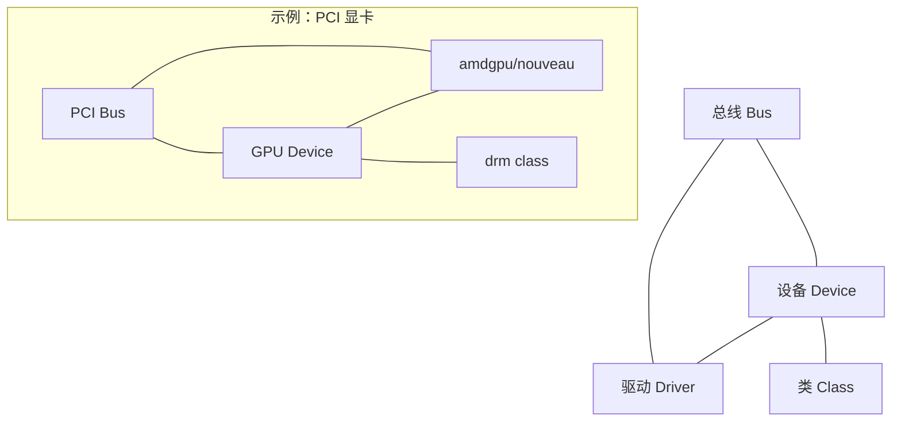

# 41 - 硬件驱动与设备管理

> Linux 的设备驱动体系是操作系统与硬件的交界面。从 sysfs 设备层级到 udev 动态管理，从内核模块驱动到用户空间驱动，Linux 提供了丰富的硬件交互手段。本章讲解 Linux 设备模型、硬件检测工具、各子系统驱动概览，以及 GPIO/I2C/SPI 等嵌入式接口。

---

## 41.1 Linux 设备模型

Linux 内核建立了一套统一的设备模型，将所有设备和驱动都组织在树形层次结构中，通过 sysfs 导出到用户空间。

### 核心抽象



| 概念 | 说明 | sysfs 路径示例 |
|------|------|---------------|
| **Bus（总线）** | 设备连接通道，匹配设备与驱动 | `/sys/bus/pci/` |
| **Device（设备）** | 物理或虚拟设备实例 | `/sys/devices/pci0000:00/` |
| **Driver（驱动）** | 控制设备的代码（通常为内核模块） | `/sys/bus/pci/drivers/amdgpu/` |
| **Class（类）** | 按功能分类（如 net, block, drm） | `/sys/class/net/` |

### sysfs 设备层次结构

```bash
# 系统总线一览
ls /sys/bus/
# pci usb i2c scsi platform serio ...

# 按类别查看设备
ls /sys/class/
# net block tty drm sound backlight ...

# 设备层级树
ls /sys/devices/
ls /sys/devices/pci0000:00/

# 查看特定设备的属性
ls /sys/class/net/eth0/
# addr_len address carrier device duplex flags mtu speed statistics ...

# 块设备信息
cat /sys/block/sda/size # 扇区数
cat /sys/block/nvme0n1/queue/rotational # 0=SSD, 1=HDD 旋转介质
cat /sys/block/sda/queue/scheduler # I/O 调度器
```

---

## 41.2 udev：动态设备管理

udev 是 Linux 的用户空间设备管理器，负责在内核创建设备节点时动态生成 `/dev` 下的设备文件，并执行基于规则的自定义操作。

### udev 工作流程

```
内核检测到新设备
 → 内核通过 netlink 发送 uevent
 → udevd 接收 uevent
 → 匹配 udev 规则（/etc/udev/rules.d/ 和 /usr/lib/udev/rules.d/）
 → 创建 /dev/ 下的设备节点
 → 设置权限、创建符号链接
 → 触发 RUN 脚本（如果有）
```

### udev 规则语法

规则文件位置：
- `/usr/lib/udev/rules.d/` — 软件包安装的默认规则
- `/etc/udev/rules.d/` — 管理员自定义规则（优先级高）

规则格式：

```
匹配键（多个以逗号分隔）, 赋值键
```

| 匹配键 | 说明 | 匹配键 | 说明 |
|--------|------|--------|------|
| `KERNEL` | 内核设备名 | `SUBSYSTEM` | 子系统（usb, block, net...） |
| `ATTR{key}` | 设备属性 | `ATTRS{key}` | 父设备属性 |
| `ENV{key}` | 环境变量 | `ACTION` | 动作（add, remove, change） |
| `DRIVER` | 驱动名 | `PROGRAM` | 执行程序取输出 |

| 赋值键 | 说明 |
|--------|------|
| `NAME` | 设备节点名称 |
| `SYMLINK` | 创建符号链接 |
| `OWNER, GROUP, MODE` | 权限设置 |
| `RUN` | 设备事件触发时执行的命令 |
| `TAG` | 标签（如 uaccess 授予登录用户访问权限） |
| `ENV{key}` | 设置环境变量 |

### 获取设备信息以编写规则

```bash
# 最重要的调试命令：查看设备属性
udevadm info -a /dev/ttyUSB0
udevadm info -a -n /dev/sda

# 监控实时设备事件
udevadm monitor
udevadm monitor --property

# 测试规则（不实际执行动作）
udevadm test /sys/class/tty/ttyUSB0

# 重新加载规则
sudo udevadm control --reload-rules
sudo udevadm trigger
```

### 实用 udev 规则示例

```bash
# === 1. USB 串口设备固定名称 ===
# /etc/udev/rules.d/99-usb-serial.rules
SUBSYSTEM=="tty", ATTRS{idVendor}=="1a86", ATTRS{idProduct}=="7523", \
 SYMLINK+="arduino", MODE="0666"

# === 2. 自动挂载 U 盘 ===
# /etc/udev/rules.d/99-usb-automount.rules
ACTION=="add", SUBSYSTEM=="block", KERNEL=="sd[a-z][0-9]", \
 ENV{ID_FS_TYPE}!="", \
 RUN+="/usr/bin/systemd-mount --no-block --automount=yes /dev/%k /mnt/%k"
ACTION=="remove", SUBSYSTEM=="block", KERNEL=="sd[a-z][0-9]", \
 RUN+="/usr/bin/systemd-umount /mnt/%k"

# === 3. 给定 USB 设备读写权限 ===
# /etc/udev/rules.d/99-device-perm.rules
SUBSYSTEM=="usb", ATTRS{idVendor}=="054c", ATTRS{idProduct}=="0ce6", \
 MODE="0666", TAG+="uaccess"

# === 4. 禁用特定 USB 设备自动挂起 ===
ACTION=="add", SUBSYSTEM=="usb", TEST=="power/autosuspend", \
 ATTR{power/autosuspend}="-1"

# === 5. 网络接口固定命名 ===
# /etc/udev/rules.d/10-network.rules
SUBSYSTEM=="net", ACTION=="add", ATTR{address}=="aa:bb:cc:dd:ee:ff", \
 NAME="lan0"
```

---

## 41.3 设备文件与 /dev

### /dev 目录详解

`/dev` 中的设备文件由 udev 动态创建，每个设备文件由主设备号（major number）和次设备号（minor number）标识：

| 类型 | 标识 | 示例 |
|------|------|------|
| 块设备（block） | `b` | `/dev/sda`, `/dev/nvme0n1` |
| 字符设备（char） | `c` | `/dev/tty`, `/dev/null`, `/dev/random` |

```bash
# 查看设备文件信息
ls -l /dev/sda
# brw-rw---- 1 root disk 8, 0 Jul 24 10:00 /dev/sda
# ↑ ↑
# 主设备号 次设备号

# 主设备号 (8) 标识 SCSI/SATA 磁盘驱动
# 次设备号 (0) 标识第一个磁盘

# 查看已分配的设备号
cat /proc/devices

# 基于 UUID/LABEL 的持久设备路径
ls -l /dev/disk/by-uuid/
ls -l /dev/disk/by-id/
ls -l /dev/disk/by-path/
```

### 特殊设备文件

```bash
/dev/null # 数据黑洞（丢弃所有写入）
/dev/zero # 无限供应零字节
/dev/random # 真随机数（阻塞直到有足够熵）
/dev/urandom # 伪随机数（不阻塞）
/dev/full # 空间已满模拟（写入失败 ENOSPC）
/dev/loop* # 回环设备（将文件当作块设备挂载）
/dev/shm # POSIX 共享内存（tmpfs）
```

---

## 41.4 设备驱动与内核模块

内核模块（`.ko` 文件）是 Linux 驱动的主要承载形式，可在运行时加载和卸载。

```bash
# 查看已加载驱动
lsmod
lsmod | head -20

# 查看特定驱动的模块信息
modinfo i915
modinfo -p i915 # 可用参数
modinfo -d nvidia # 驱动描述

# 加载/卸载驱动
sudo modprobe i915
sudo modprobe -r i915

# 驱动参数配置（/etc/modprobe.d/）
# 例如 /etc/modprobe.d/i915.conf：
# options i915 enable_guc=3 enable_fbc=1

# 开机自动加载模块（/etc/modules-load.d/）
echo "vfio-pci" | sudo tee /etc/modules-load.d/vfio-pci.conf

# 屏蔽驱动（/etc/modprobe.d/blacklist.conf）
# blacklist nouveau
# install nouveau /bin/false
```

详细模块管理参考 [[38-Linux内核基础与模块]]。

---

## 41.5 硬件检测工具

### 核心硬件检测命令

```bash
# --- lspci：PCI 设备列表 ---
lspci # 基本列表
lspci -v # 详细模式
lspci -vvv # 最详细模式
lspci -k # 显示每个设备使用的内核驱动
lspci -nn # 显示厂商和设备 ID
lspci | grep -i vga # 查找显卡
lspci | grep -i network # 查找网卡
lspci | grep -i nvme # 查找 NVMe

# --- lsusb：USB 设备列表 ---
lsusb # 基本列表
lsusb -v # 详细模式
lsusb -t # 树形结构（展示 USB 控制器层级）

# --- lscpu：CPU 信息 ---
lscpu
lscpu -J # JSON 格式输出

# --- lsblk：块设备列表 ---
lsblk # 树形显示
lsblk -f # 显示文件系统类型和 UUID
lsblk -o NAME,SIZE,TYPE,MOUNTPOINT,MODEL,SERIAL

# --- lshw：综合硬件信息（推荐）---
sudo apt install lshw # Debian/Ubuntu
sudo dnf install lshw # Fedora
sudo lshw -short # 简短列表
sudo lshw -class disk # 仅显示磁盘
sudo lshw -class network # 仅显示网络
sudo lshw -html > hardware.html # 生成 HTML 报告

# --- dmidecode：DMI/SMBIOS 硬件信息 ---
sudo dmidecode -t system # 系统信息（厂商、型号、序列号）
sudo dmidecode -t memory # 内存信息（容量、速度、类型）
sudo dmidecode -t bios # BIOS 版本
sudo dmidecode -t processor # CPU 插槽信息

# --- /proc/cpuinfo 和 /proc/meminfo ---
cat /proc/cpuinfo
grep "model name" /proc/cpuinfo
cat /proc/meminfo
```

---

## 41.6 GPU 驱动概览

### NVIDIA 驱动

| 方案 | 适用场景 | 特点 |
|------|----------|------|
| **nouveau** | 开源驱动，内核自带 | 基本 KMS 和 2D，3D 性能有限 |
| **nvidia（专有）** | 高性能需求 | 完整 CUDA、NVENC、DLSS 支持 |
| **nvidia-open** | 较新 GPU（Turing+） | 内核模块部分开源 |

```bash
# 查看当前加载的 GPU 驱动
lspci -k | grep -A 3 VGA
# Kernel driver in use: nvidia / nouveau / amdgpu / i915

# 查看 NVIDIA 驱动版本
nvidia-smi
```

### AMD 驱动

AMD 显卡在 Linux 上享有最好的开源支持：

| 方案 | 适用场景 |
|------|----------|
| **amdgpu** | 开源驱动，GCN 及更新架构（推荐） |
| **radeon** | 开源驱动，较老的 Radeon 卡 |
| **AMDGPU-PRO** | 专有驱动，需 OpenCL 专业应用时 |

### Intel 驱动

Intel 集显使用 `i915` 内核驱动，开源且开箱即用：

```bash
# Intel GPU 参数调优
# /etc/modprobe.d/i915.conf
options i915 enable_guc=3 enable_fbc=1 enable_psr=1
```

具体发行版的显卡配置参考 [[distro/arch/desktop/06-显卡驱动配置]]。

---

## 41.7 音频系统架构

Linux 音频架构经历了多次演进：

```
硬件 → ALSA（内核驱动层） → PulseAudio / PipeWire（用户空间音频服务器）→ 应用程序
```

| 组件 | 层级 | 角色 |
|------|------|------|
| **ALSA** | 内核层 | 硬件驱动、混音器控制 |
| **PulseAudio** | 用户层（传统） | 音频混音、设备管理、网络音频 |
| **PipeWire** | 用户层（现代） | 统一音视频流处理，替代 PulseAudio + JACK |
| **JACK** | 用户层 | 专业低延迟音频连接 |

```bash
# 查看 ALSA 音频设备
aplay -l # 播放设备
arecord -l # 录音设备
cat /proc/asound/cards # 声卡列表
amixer scontrols # 混音器控制项

# 查看音频服务器状态
pactl info # PulseAudio
pw-cli info # PipeWire
```

详细音频系统参考 [[52-PipeWire与音频系统]]。

---

## 41.8 蓝牙（Bluetooth）子系统

Linux 蓝牙栈基于 BlueZ，分为内核层（`bluetooth` 子系统）和用户空间守护进程（`bluetoothd`）。

```bash
# 检查蓝牙服务状态
sudo systemctl status bluetooth

# 使用 bluetoothctl 交互管理
bluetoothctl
# [bluetooth]# power on
# [bluetooth]# scan on
# [bluetooth]# devices
# [bluetooth]# pair XX:XX:XX:XX:XX:XX
# [bluetooth]# connect XX:XX:XX:XX:XX:XX
# [bluetooth]# trust XX:XX:XX:XX:XX:XX

# 命令行操作
bluetoothctl power on
bluetoothctl devices
bluetoothctl connect XX:XX:XX:XX:XX:XX
```

---

## 41.9 USB 子系统

```bash
# 查看 USB 设备树
lsusb -t

# 查看 USB 控制器信息
cat /sys/kernel/debug/usb/devices

# USB 电源管理
ls /sys/bus/usb/devices/*/power/
cat /sys/bus/usb/devices/1-1/power/autosuspend
cat /sys/bus/usb/devices/1-1/power/control

# 禁用特定 USB 设备自动挂起
echo "on" | sudo tee /sys/bus/usb/devices/1-1/power/control
```

### USB Gadget 模式简介

USB Gadget 允许 Linux 设备（如树莓派、开发板）模拟为 USB 外设（键盘、网卡、U 盘等）。通过 configfs 配置：

```bash
# 检查硬件支持
ls /sys/class/udc/ # 列出 USB Device Controller

# 加载框架模块
sudo modprobe libcomposite
```

---

## 41.10 GPIO、I2C、SPI（嵌入式接口）

### GPIO 控制（libgpiod）

```bash
# 安装
sudo apt install gpiod # Debian/Ubuntu
sudo dnf install libgpiod # Fedora
sudo pacman -S libgpiod # Arch

# 列出 GPIO 芯片
gpiodetect

# 查看引脚信息
gpioinfo gpiochip0

# 读取/设置 GPIO
gpioget gpiochip0 17 # 读取引脚 17
gpioset gpiochip0 17=1 # 设置高电平
gpioset gpiochip0 17=0 # 设置低电平

# 监控引脚变化
gpiomon gpiochip0 17
gpiomon --rising-edge gpiochip0 17
```

### I2C 工具

```bash
# 安装
sudo apt install i2c-tools

# 加载内核模块
sudo modprobe i2c-dev

# 列出 I2C 总线
i2cdetect -l

# 扫描总线上的设备
sudo i2cdetect -y 1

# 读取/写入设备寄存器
sudo i2cget -y 1 0x48 0x00 # 总线1, 地址0x48, 寄存器0x00
sudo i2cset -y 1 0x48 0x01 0xFF

# 导出全部寄存器
sudo i2cdump -y 1 0x48
```

### SPI

```bash
# 加载模块
sudo modprobe spidev

# 查看 SPI 设备
ls /dev/spidev*

# spi-tools（需单独安装）
spi-config -d /dev/spidev0.0 -q
spi-pipe -d /dev/spidev0.0 -s 1000000 < data.bin
```

---

## 41.11 嵌入式交叉编译

```bash
# 安装交叉编译工具链
# Debian/Ubuntu:
sudo apt install gcc-aarch64-linux-gnu gcc-arm-linux-gnueabihf
# Fedora:
sudo dnf install gcc-aarch64-linux-gnu

# 交叉编译 Hello World
aarch64-linux-gnu-gcc -o hello hello.c
file hello
# hello: ELF 64-bit LSB executable, ARM aarch64, ...

# CMake 交叉编译工具链文件示例
cat > toolchain-aarch64.cmake << 'EOF'
set(CMAKE_SYSTEM_NAME Linux)
set(CMAKE_SYSTEM_PROCESSOR aarch64)
set(CMAKE_C_COMPILER aarch64-linux-gnu-gcc)
set(CMAKE_CXX_COMPILER aarch64-linux-gnu-g++)
set(CMAKE_FIND_ROOT_PATH /usr/aarch64-linux-gnu)
set(CMAKE_FIND_ROOT_PATH_MODE_PROGRAM NEVER)
set(CMAKE_FIND_ROOT_PATH_MODE_LIBRARY ONLY)
set(CMAKE_FIND_ROOT_PATH_MODE_INCLUDE ONLY)
EOF

cmake -B build -DCMAKE_TOOLCHAIN_FILE=toolchain-aarch64.cmake
cmake --build build
```

---

## 41.12 键盘自定义

### keyd（守护进程级键位映射）

```bash
# 安装
sudo apt install keyd # 或从源码编译

# 配置示例 /etc/keyd/default.conf
# [ids]
# *
# [main]
# capslock = overload(control, esc) # 按=Esc, 长按=Ctrl
# rightalt = layer(nav)
# [nav]
# h = left
# j = down
# k = up
# l = right

sudo systemctl enable --now keyd
```

### XKB（Xorg/Wayland 级键盘配置）

```bash
# 查看当前布局
setxkbmap -query

# CapsLock 映射为 Ctrl
setxkbmap -option ctrl:nocaps

# CapsLock 映射为 Escape
setxkbmap -option caps:escape

# 持久化（/etc/X11/xorg.conf.d/00-keyboard.conf）
Section "InputClass"
 Identifier "keyboard"
 Option "XkbOptions" "caps:escape,compose:ralt"
EndSection
```

---

## 41.13 小结

| 主题 | 关键工具 | 核心功能 |
|------|----------|----------|
| 设备模型 | sysfs, udev | 设备发现、驱动绑定、动态节点管理 |
| 硬件检测 | lspci, lsusb, lscpu, lsblk, lshw, dmidecode | 全面了解系统硬件组成 |
| GPU 驱动 | amdgpu, nvidia, i915, nouveau | 图形性能与兼容性 |
| 音频 | ALSA + PulseAudio/PipeWire | 音频硬件驱动与混音 |
| 蓝牙 | BlueZ + bluetoothctl | 蓝牙设备配对与管理 |
| 嵌入式接口 | libgpiod, i2c-tools, spidev | 单板计算机的外围器件通信 |
| 交叉编译 | gcc-aarch64-linux-gnu 等 | 为不同架构编译程序 |

---

> **交叉链接**：硬件驱动是内核模块的主要应用场景，延伸阅读 [[38-Linux内核基础与模块]]。深入 I/O 设备管理参考 [[37-I-O设备管理]]。音频系统深度配置参考 [[52-PipeWire与音频系统]]。发行版特定的显卡驱动安装参考 [[distro/arch/desktop/06-显卡驱动配置]]。
