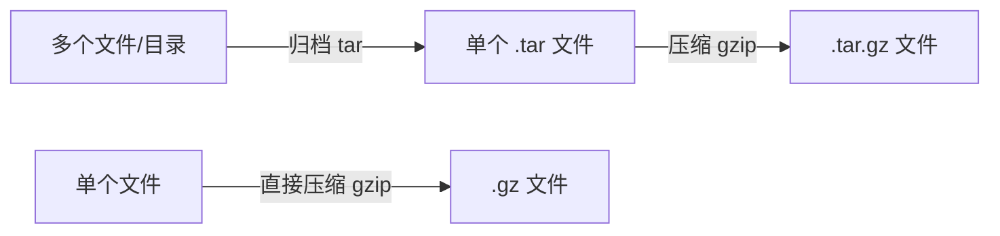
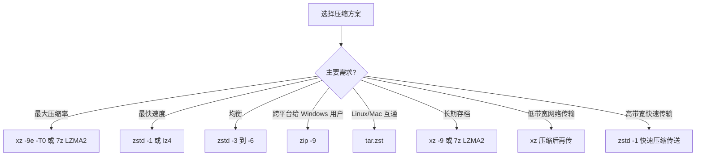

# 42 - 压缩与归档工具大全

> 数据压缩是系统管理的基本功。从日常文件打包到增量备份方案，从 tar 管道到 zstd 极速压缩，掌握各类压缩归档工具及其适用场景，能在效率与空间之间找到最佳平衡点。本章系统讲解 Linux 下所有主流压缩归档工具的使用方法与最佳实践。

---

## 42.1 归档与压缩的概念区别

归档和压缩是两个独立但常被组合使用的操作：

| 概念 | 说明 | 类比 |
|------|------|------|
| **归档（Archive）** | 将多个文件/目录合并为单个文件 | 多本书放进一个箱子 |
| **压缩（Compress）** | 通过算法减小文件体积 | 用真空袋压缩体积 |
| **归档 + 压缩** | 先归档再压缩（最常见操作） | 装箱后再抽真空 |



关键区别：

- `tar` 只做归档（打包），不压缩
- `gzip`、`bzip2`、`xz` 等只做压缩，不归档
- `tar` 可以调用压缩算法实现"归档+压缩"
- `zip`、`7z` 则以内部逻辑同时完成归档和压缩

---

## 42.2 tar 完全指南

`tar`（Tape Archive）是 Linux 下最核心的归档工具。

### 核心操作符

| 操作 | 含义 | 操作 | 含义 |
|------|------|------|------|
| `-c` | Create 创建归档 | `-x` | Extract 解压归档 |
| `-t` | List 列出内容 | `-r` | Append 追加文件 |
| `-u` | Update 更新 | `--delete` | Delete 删除文件 |

### 常用选项

| 选项 | 含义 |
|------|------|
| `-f` | 指定归档文件名（几乎必须） |
| `-v` | 详细输出（显示处理的文件） |
| `-z` | 使用 gzip 压缩/解压 |
| `-j` | 使用 bzip2 压缩/解压 |
| `-J` | 使用 xz 压缩/解压 |
| `--zstd` | 使用 zstd 压缩/解压 |
| `-C` | 指定解压目标目录 |
| `-p` | 保留文件权限 |
| `--acls` | 保留 ACL |
| `--xattrs` | 保留扩展属性 |

### 最常用命令组合

```bash
# 创建 gzip 压缩归档
tar -czf archive.tar.gz /path/to/directory

# 创建 xz 压缩归档（最高压缩率）
tar -cJf archive.tar.xz /path/to/directory

# 创建 zstd 压缩归档（速度与压缩率最佳平衡）
tar --zstd -cf archive.tar.zst /path/to/directory

# 解压任意格式（tar 自动识别压缩格式）
tar -xf archive.tar.gz
tar -xf archive.tar.xz
tar -xf archive.tar.zst

# 解压到指定目录
tar -xf archive.tar.gz -C /target/directory

# 查看归档内容（不解压）
tar -tvf archive.tar.gz

# 只解压特定文件
tar -xf archive.tar.gz path/to/specific/file

# 追加文件（仅对未压缩的 .tar）
tar -rf archive.tar newfile.txt
```

### 增量备份

`tar` 支持基于快照文件的增量备份：

```bash
# 第一次：完整备份（创建快照文件）
tar --listed-incremental=/backup/snapshot.snar \
 -czf /backup/full-backup-$(date +%F).tar.gz \
 /home/user/documents

# 第二次：增量备份（只备份变化的内容）
tar --listed-incremental=/backup/snapshot.snar \
 -czf /backup/incr-backup-$(date +%F).tar.gz \
 /home/user/documents

# 恢复：先恢复完整备份，再依次恢复增量备份
tar --listed-incremental=/dev/null -xf /backup/full-backup.tar.gz
tar --listed-incremental=/dev/null -xf /backup/incr-backup.tar.gz
```

### 排除文件

```bash
# 排除特定文件/目录
tar -czf backup.tar.gz --exclude='*.log' --exclude='.cache' /home/user

# 使用排除文件列表
cat > /tmp/exclude-list.txt << 'EOF'
*.log
node_modules
.git
__pycache__
.cache
EOF
tar -czf backup.tar.gz --exclude-from=/tmp/exclude-list.txt /home/user

# 排除版本控制目录
tar -czf source.tar.gz --exclude-vcs /path/to/project
```

### 保留完整元数据

```bash
# 备份时保留完整属性
tar --acls --xattrs --xattrs-include='*' --selinux \
 -cpf backup.tar /important/data

# 恢复
tar --acls --xattrs --xattrs-include='*' --selinux \
 -xpf backup.tar -C /restore/path
```

### 管道操作

```bash
# 通过管道直接传输（不创建中间文件）
tar -czf - /source/dir | tar -xzf - -C /dest/dir

# 配合 pv 显示进度
tar -cf - /large/dir | pv | gzip > backup.tar.gz

# 通过 SSH 直接远程传输
tar -czf - /local/data | ssh user@remote "cat > /backup/data.tar.gz"
ssh user@remote "tar -czf - /remote/data" | tar -xzf - -C /local/path

# 带进度条的远程传输
tar -cf - /large/dir | pv | ssh user@remote "tar -xf - -C /dest"
```

### 分卷压缩

```bash
# 创建归档后用 split 分卷（每卷 4GB，适合 FAT32 U 盘）
tar -czf - /large/directory | split -b 4G - backup.tar.gz.part_

# 合并分卷并解压
cat backup.tar.gz.part_* | tar -xzf -
```

---

## 42.3 gzip / gunzip

gzip 是最经典的 Unix 压缩工具，使用 DEFLATE 算法（LZ77 + Huffman）。

```bash
# 压缩（原文件被替换为 .gz）
gzip file.txt # → file.txt.gz
gzip -k file.txt # 保留原文件
gzip -9 file.txt # 最高压缩率（1=最快, 9=最小, 默认6）
gzip -1 file.txt # 最快速度

# 解压
gunzip file.txt.gz
gzip -d file.txt.gz

# 查看压缩文件内容（不解压）
zcat file.txt.gz
zless file.txt.gz
zgrep "pattern" file.txt.gz

# 多线程 gzip（pigz）
# 安装：sudo apt install pigz / sudo dnf install pigz
pigz -p 8 file.txt # 8 线程压缩
tar -cf - /data | pigz > data.tar.gz # 配合 tar
```

---

## 42.4 bzip2 / bunzip2

bzip2 使用 Burrows-Wheeler 变换 + Huffman 编码，压缩率优于 gzip 但速度较慢。

```bash
bzip2 file.txt # → file.txt.bz2
bzip2 -k file.txt # 保留原文件
bzip2 -9 file.txt # 最高压缩率
bunzip2 file.txt.bz2 # 解压

# 查看内容
bzcat file.txt.bz2
bzgrep "pattern" file.txt.bz2

# 多线程 bzip2（pbzip2）
pbzip2 -p8 file.txt # 8 线程
```

---

## 42.5 xz（LZMA2 算法）

xz 使用 LZMA2 算法，提供最高的压缩率。

```bash
xz file.txt # → file.txt.xz
xz -k file.txt # 保留原文件
xz -9 file.txt # 常规最高（0-9）
xz -9e file.txt # 极限模式（更慢，更小）
xz -T0 file.txt # 使用所有 CPU 核心
xz -9 --memlimit=1GiB file.txt # 内存限制（防 OOM）

# 解压
unxz file.txt.xz
xz -d file.txt.xz

# 查看
xzcat file.txt.xz
xzgrep "pattern" file.txt.xz

# 配合 tar
tar -cJf archive.tar.xz /data
XZ_OPT='-9 -T0' tar -cJf archive.tar.xz /data
```

---

## 42.6 zstd（Zstandard）

zstd 由 Facebook 开发，在速度和压缩率之间取得最佳平衡，是当前推荐的通用压缩工具。

```bash
# 安装：sudo apt install zstd / sudo dnf install zstd

zstd file.txt # → file.txt.zst
zstd -k file.txt # 保留原文件
zstd -1 file.txt # 最快（比 gzip 快且更小）
zstd -19 file.txt # 最高常规压缩
zstd --ultra -22 file.txt # Ultra 模式（1-22）
zstd -T0 file.txt # 多线程（自动使用所有核心）

# 解压
zstd -d file.txt.zst
unzstd file.txt.zst

# 查看
zstdcat file.txt.zst
zstdgrep "pattern" file.txt.zst

# 配合 tar
tar --zstd -cf archive.tar.zst /data
ZSTD_CLEVEL=19 tar --zstd -cf archive.tar.zst /data
```

### 字典压缩

对于大量相似的小文件（JSON API 响应、日志条目），字典压缩效果惊人：

```bash
# 从样本中学习数据模式
zstd --train /path/to/samples/* -o /tmp/dict

# 用字典压缩
zstd -D /tmp/dict file.json

# 用字典解压
zstd -d -D /tmp/dict file.json.zst
```

---

## 42.7 7z（p7zip / 7-Zip）

7z 是强大的跨平台压缩工具，使用 LZMA2 算法，支持加密、分卷、多格式。

```bash
# 安装
sudo apt install p7zip-full # Debian/Ubuntu
sudo dnf install p7zip # Fedora
sudo pacman -S p7zip # Arch

# 创建 7z 归档
7z a archive.7z /path/to/files
7z a -mx=9 archive.7z /data # 极限压缩（-mx=0~9）

# 解压
7z x archive.7z # 保留目录结构
7z e archive.7z # 解压到当前目录（扁平化）
7z x archive.7z -o/output # 指定输出目录

# 列出内容
7z l archive.7z

# 测试完整性
7z t archive.7z

# 加密压缩
7z a -p archive.7z /private # 密码保护
7z a -p -mhe=on archive.7z /private # 同时加密文件名
# 解压时会提示输入密码

# 分卷压缩（每卷 100MB）
7z a -v100m archive.7z /large/data
# 解压分卷：7z x archive.7z.001

# 创建/解压 ZIP
7z a archive.zip /data
7z x archive.zip

# 排除文件
7z a archive.7z /data -x'!*.log' -x'!.git'
```

---

## 42.8 zip / unzip

zip 格式是与 Windows 用户交换文件的最佳选择。

```bash
# 安装：sudo apt install zip unzip

# 创建
zip archive.zip file1.txt file2.txt
zip -r archive.zip /path/to/directory # 递归
zip -9 -r archive.zip /data # 最高压缩

# 加密
zip -e -r archive.zip /private # 提示输入密码

# 分卷
zip -s 100m -r archive.zip /large/data

# 解压
unzip archive.zip
unzip archive.zip -d /target/dir

# 列出内容
unzip -l archive.zip

# 测试
unzip -t archive.zip

# 处理中文文件名（指定编码）
unzip -O CP936 chinese_archive.zip # GBK
unzip -O UTF-8 archive.zip
```

---

## 42.9 rar / unrar

```bash
# 安装（解压工具在官方仓库，压缩工具可能需额外安装）
sudo apt install unrar # Debian/Ubuntu
sudo dnf install unrar # Fedora

# 解压
unrar x archive.rar # 保留目录结构
unrar l archive.rar # 列出内容
unrar t archive.rar # 测试

# 创建 rar（需安装 rar 包）
rar a archive.rar /path/to/files
rar a -m5 archive.rar /data # 最高压缩（-m0~5）
rar a -p archive.rar /private # 加密
rar a -v100m archive.rar /data # 分卷
```

---

## 42.10 压缩算法全面对比

| 工具 | 算法 | 压缩率 | 压缩速度 | 解压速度 | 多线程 | 内存占用 |
|------|------|--------|----------|----------|--------|----------|
| lz4 | LZ4 | ★★☆☆☆ | ★★★★★+ | ★★★★★+ | 原生 | 极低 |
| gzip | DEFLATE | ★★☆☆☆ | ★★★★☆ | ★★★★★ | pigz | 低 |
| zstd | Zstandard | ★★★★☆ | ★★★★★ | ★★★★★ | 原生 -T | 中 |
| bzip2 | BWT | ★★★☆☆ | ★★☆☆☆ | ★★☆☆☆ | pbzip2 | 中 |
| xz | LZMA2 | ★★★★★ | ★☆☆☆☆ | ★★★☆☆ | 原生 -T | 高 |
| 7z | LZMA2 | ★★★★★ | ★☆☆☆☆ | ★★★☆☆ | 原生 | 高 |

### 实际基准测试参考（1GB 混合数据）

| 工具 + 级别 | 压缩后大小 | 压缩时间 | 解压时间 |
|-------------|-----------|----------|----------|
| lz4 | ~420MB | ~1s | ~0.5s |
| gzip -6 | ~340MB | ~12s | ~3s |
| zstd -3 | ~310MB | ~3s | ~1.5s |
| zstd -19 | ~230MB | ~90s | ~1.5s |
| bzip2 -9 | ~280MB | ~60s | ~25s |
| xz -6 | ~240MB | ~120s | ~8s |
| xz -9 | ~220MB | ~300s | ~8s |

---

## 42.11 场景推荐方案



| 场景 | 推荐方案 | 命令示例 |
|------|----------|----------|
| 日常归档 | tar + zstd | `tar --zstd -cf file.tar.zst dir/` |
| 代码源码包 | tar + xz | `tar -cJf src.tar.xz project/` |
| 发给 Windows 用户 | zip | `zip -r file.zip dir/` |
| 最大压缩率 | 7z LZMA2 | `7z a -m0=lzma2 -mx=9 file.7z dir/` |
| 增量备份 | tar + --listed-incremental | 见 42.2 节 |
| 数据库备份 | zstd 流式 | `pg_dump | zstd -T0 > db.sql.zst` |
| 日志压缩 | zstd + 字典 | 训练字典后批量压缩 |
| 网络传输 | tar + ssh + zstd | `tar --zstd -cf - dir \| ssh ...` |

### 备份脚本示例

```bash
#!/bin/bash
# 系统增量备份脚本

BACKUP_DIR="/backup"
DATE=$(date +%F_%H%M)
SNAPSHOT="$BACKUP_DIR/snapshot.snar"

cat > /tmp/backup-exclude.txt << 'EOF'
/proc/*
/sys/*
/dev/*
/run/*
/tmp/*
/mnt/*
/media/*
/swapfile
/home/*/.cache/*
EOF

# 增量备份（远程服务器）
tar --listed-incremental="$SNAPSHOT" \
 --exclude-from=/tmp/backup-exclude.txt \
 --acls --xattrs --numeric-owner \
 -cf - / | \
 zstd -T0 -6 | \
 ssh backup@server "cat > /backups/system-${DATE}.tar.zst"

echo "Backup completed: system-${DATE}.tar.zst"
```

---

## 42.12 小结

| 工具 | 一句话总结 |
|------|-----------|
| tar | 万能归档工具，组合 gzip/xz/zstd 实现归档+压缩 |
| zstd | 当代最佳平衡，速度快压缩率高，推荐为默认压缩工具 |
| xz | 最高压缩率，适合归档和终极节省空间场景 |
| gzip | 经典快速，兼容性最广泛 |
| 7z | 跨平台能力强，加密 + 分卷 + 极致压缩 |
| zip | Windows 互通首选 |

---

> **交叉链接**：归档与备份紧密相连，备份策略参考 [[17-备份与恢复]]。文件目录管理基础参考 [[04-文件与目录管理]]。磁盘存储和文件系统参考 [[12-存储管理与磁盘操作]] 和 [[42-文件系统深入]]。
