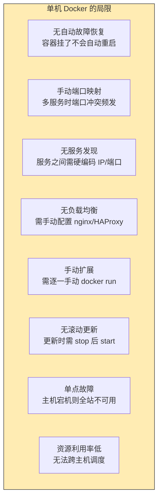
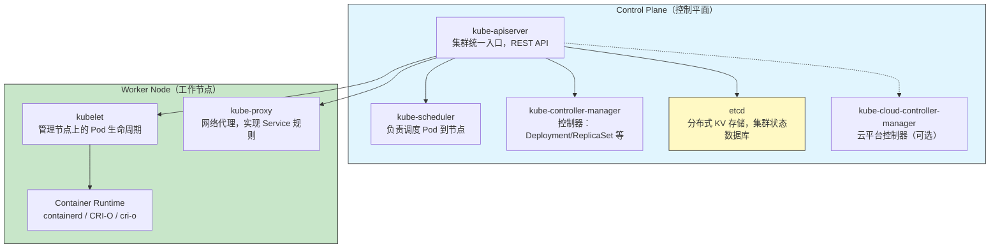
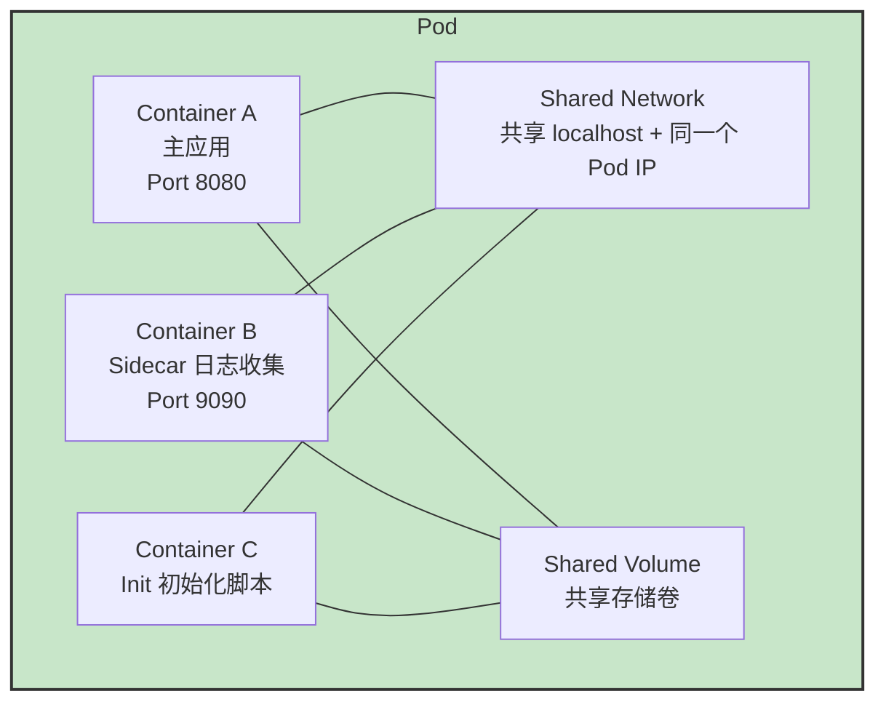
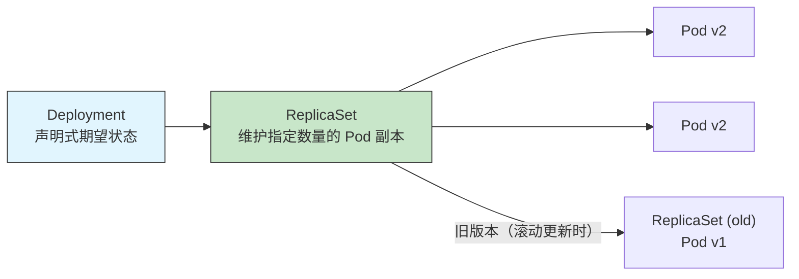
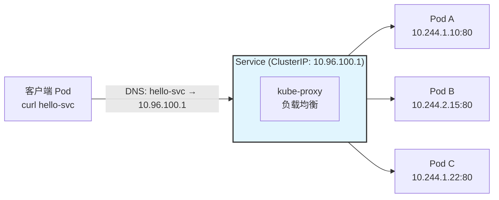

# 45 - 容器编排与 Kubernetes 入门

> 当单机 Docker 运行的服务数量从个位数增长到数十、数百个时，手动管理容器生命周期、网络、存储、健康检查和滚动更新就变得不可持续。容器编排系统正是为了解决这一问题而生——它让你以声明式的方式描述应用的期望状态，由系统自动调度和维护。本章从编排需求讲起，深入 Kubernetes 核心架构，覆盖 Pod、Deployment、Service、ConfigMap、Secret、Namespace 等核心概念，并构建一个从零到可访问的 hello-world 应用。

---

## 45.1 为什么需要容器编排

### 45.1.1 单机 Docker 的天花板

在 [[44-容器技术]] 中我们学习了如何使用 Docker 和 Podman 管理单个容器。但当应用规模增长时，单纯使用 `docker run` 会遇到以下瓶颈：



### 45.1.2 容器编排解决什么问题

| 痛点 | 编排系统的能力 |
|------|--------------|
| 容器故障 | 自动重启/替换，自愈机制 |
| 服务发现 | 内置 DNS，通过服务名访问 |
| 负载均衡 | 自动分发流量到多个副本 |
| 滚动更新 | 逐批替换，不中断服务 |
| 自动扩缩 | 基于 CPU/内存/QPS 增减副本数 |
| 配置管理 | 集中管理配置和密钥 |
| 存储编排 | 自动挂载持久卷 |
| 多主机调度 | 集群范围内最优放置容器 |

### 45.1.3 主流编排工具

```
工具              定位                    特点
────────────────────────────────────────────────────────
Kubernetes        企业级容器编排平台        功能最全，生态最丰富
Docker Swarm      轻量级编排                Docker 内置，配置简单
Nomad             HashiCorp 生态            支持非容器化工作负载
Apache Mesos      通用资源调度              架构成熟但复杂
```

**Kubernetes**（简称 K8s）已事实上成为容器编排的标准。它由 Google 基于 Borg 系统的经验开源开发，现由 CNCF 托管。

---

## 45.2 Kubernetes 架构概述

### 45.2.1 控制平面与工作节点



### 45.2.2 核心组件详解

**控制平面组件：**

| 组件 | 职责 |
|------|------|
| `kube-apiserver` | 集群的 REST API 网关，所有操作都通过它。支持认证、授权和准入控制 |
| `etcd` | 分布式一致性的 KV 存储，保存所有集群状态数据。使用 Raft 共识算法 |
| `kube-scheduler` | 监视新创建的未调度 Pod，选择最优节点运行 |
| `kube-controller-manager` | 运行各种控制器：Node Controller（节点健康）、Replication Controller（副本数）、Deployment Controller（滚动更新）、Service Controller（负载均衡）等 |

**工作节点组件：**

| 组件 | 职责 |
|------|------|
| `kubelet` | 每个节点上的"管家"。接收 PodSpec，确保容器按声明运行。报告节点和 Pod 状态 |
| `kube-proxy` | 维护节点上的网络规则（iptables/IPVS），实现 Service 的流量转发 |
| `Container Runtime` | 实际运行容器的组件，通过 CRI 接口接入。常见选择：containerd、CRI-O |

### 45.2.3 etcd：集群的大脑

```bash
# etcd 的核心作用：存储整个集群的状态
# 所有 Kubernetes 对象（Pod、Service、ConfigMap 等）都以 JSON 格式存储在 etcd 中

# 查看 etcd 中的 key（需要在控制平面节点上）
ETCDCTL_API=3 etcdctl get / --prefix --keys-only 2>/dev/null | head -20

# 典型的 etcd key 路径：
# /registry/pods/default/nginx-xxxxx
# /registry/services/endpoints/default/nginx
# /registry/deployments/default/nginx
# /registry/configmaps/default/my-config
```

> **架构启示**：Kubernetes 是一个完全声明式的系统。你通过 API 声明"我想要 3 个 nginx 副本"，控制器持续对比"当前状态"与"期望状态"，驱动系统朝期望状态收敛。这种"控制循环"（Control Loop）是 K8s 的核心设计哲学。

---

## 45.3 本地开发环境：minikube 与 kind

### 45.3.1 minikube

```bash
# minikube：单节点 K8s 集群，适合学习和本地开发
# 支持多种驱动：Docker、VirtualBox、KVM、none（裸机）

# 安装（Arch Linux）
sudo pacman -S minikube kubectl

# 启动集群
minikube start --driver=docker
minikube start --cpus=4 --memory=8192   # 指定资源

# 查看状态
minikube status
minikube ip
minikube dashboard                      # 打开 Web 控制台

# 常用操作
minikube stop        # 停止集群
minikube delete      # 删除集群
minikube addons list # 列出可用插件
minikube addons enable ingress  # 启用 Ingress 插件

# 使用 minikube 内置的 Docker 守护进程
eval $(minikube docker-env)  # 直接构建镜像到 minikube 中
```

### 45.3.2 kind（Kubernetes IN Docker）

```bash
# kind：在 Docker 容器中运行 K8s 节点，启动快，适合 CI/CD
# 每个 K8s "节点" 实际上是一个 Docker 容器

# 安装
go install sigs.k8s.io/kind@latest

# 创建单节点集群
kind create cluster --name my-cluster

# 创建多节点集群（通过配置文件）
cat <<EOF | kind create cluster --config -
kind: Cluster
apiVersion: kind.x-k8s.io/v1alpha4
nodes:
- role: control-plane
- role: worker
- role: worker
EOF

# 管理
kind get clusters
kind delete cluster --name my-cluster
kind load docker-image my-app:latest --name my-cluster  # 加载镜像到集群
```

### 45.3.3 minikube vs kind

| 特性 | minikube | kind |
|------|----------|------|
| 启动速度 | 较慢（分钟级） | 快（10~30 秒） |
| 资源占用 | 较高 | 较低 |
| 多节点 | 支持 | 原生支持 |
| CI/CD 友好 | 一般 | 非常好（GitHub Actions 官方支持） |
| 镜像加载 | `minikube image load` | `kind load docker-image` |
| 持久化 | 支持 | 无持久化（重启丢数据） |

---

## 45.4 kubectl 基础操作

### 45.4.1 上下文与集群切换

```bash
# kubectl 通过 kubeconfig 文件（~/.kube/config）管理多集群连接
# 查看当前配置
kubectl config view

# 查看当前上下文
kubectl config current-context

# 列出所有上下文
kubectl config get-contexts

# 切换上下文
kubectl config use-context minikube
kubectl config use-context kind-my-cluster

# 切换命名空间
kubectl config set-context --current --namespace=production
```

> **kubectx 与 kubens**：kubectl 原生命令切换上下文和命名空间较冗长，推荐安装 kubectx 和 kubens 增强工具：
> ```bash
> sudo pacman -S kubectx
> kubectx                    # 列出并交互式切换上下文
> kubectx minikube           # 直接切换到指定上下文
> kubens                     # 列出并切换命名空间
> ```

### 45.4.2 核心 CRUD 命令

```bash
# ========== get：查询资源 ==========
kubectl get nodes                          # 列出节点
kubectl get nodes -o wide                  # 显示更多信息
kubectl get pods                           # 列出 Pod（当前命名空间）
kubectl get pods -A                        # 列出所有命名空间的 Pod
kubectl get pods -n kube-system            # 指定命名空间
kubectl get deployments                    # 列出 Deployment
kubectl get services                       # 列出 Service
kubectl get all                            # 列出几乎所有资源

# 输出格式
kubectl get pods -o wide                   # 显示节点、IP 等额外信息
kubectl get pods -o yaml                   # 以 YAML 输出完整定义
kubectl get pods -o json | jq .            # JSON 格式 + jq 过滤
kubectl get pods --show-labels             # 显示标签
kubectl get pods -l app=nginx              # 按标签过滤

# ========== describe：查看详情 ==========
kubectl describe node minikube             # 节点详情：容量、条件、事件
kubectl describe pod nginx-xxxxx           # Pod 详情：容器状态、事件列表

# ========== logs：查看日志 ==========
kubectl logs pod-name                      # 查看 Pod 日志
kubectl logs pod-name -c container-name    # 多容器 Pod 指定容器
kubectl logs -f pod-name                   # 跟踪日志（类似 tail -f）
kubectl logs --tail=50 pod-name            # 最后 50 行
kubectl logs -l app=nginx --all-containers # 按标签查看所有匹配 Pod 的日志
kubectl logs --previous pod-name           # 查看上一次崩溃的容器日志

# ========== exec：进入容器 ==========
kubectl exec -it pod-name -- /bin/bash     # 执行交互式 shell
kubectl exec -it pod-name -c container-name -- sh  # 指定容器
kubectl exec pod-name -- ls /app           # 执行单次命令

# ========== apply：声明式创建/更新 ==========
kubectl apply -f deployment.yaml           # 创建或更新资源
kubectl apply -f .                         # 应用目录下所有 YAML 文件
kubectl apply -k ./overlays/production/    # 使用 Kustomize 应用

# ========== delete：删除资源 ==========
kubectl delete pod pod-name                # 删除 Pod
kubectl delete -f deployment.yaml          # 按文件删除
kubectl delete deployment nginx            # 按名称和类型删除
kubectl delete pods -l app=nginx           # 按标签删除
kubectl delete pods --all                  # 删除当前命名空间所有 Pod

# ========== 其他常用命令 ==========
kubectl run nginx --image=nginx --port=80  # 快速创建临时 Pod
kubectl expose deployment nginx --port=80 --type=NodePort  # 暴露服务
kubectl scale deployment nginx --replicas=5  # 调整副本数
kubectl rollout history deployment/nginx   # 查看部署历史
kubectl rollout undo deployment/nginx      # 回滚到上一版本
kubectl top pods                           # 查看资源使用（需安装 metrics-server）
kubectl top nodes
```

---

## 45.5 Pod：最小调度单元

### 45.5.1 什么是 Pod

**Pod 是 Kubernetes 中创建和管理的最小可部署单元。** 一个 Pod 包含一个或多个紧密耦合的容器，它们共享网络命名空间和存储卷。



**Pod 内容器之间的通信：**
- 通过 `localhost` + 各自端口直接通信
- 共享相同的 IP 地址（Pod IP）
- 共享相同的存储卷（Volume）

**多容器 Pod 的设计模式：**
- **Sidecar**：辅助容器，如日志收集、代理
- **Ambassador**：代理主容器与外部系统通信
- **Adapter**：统一输出格式（如标准化日志）
- **Init Container**：在主容器启动前执行初始化任务

### 45.5.2 Pod 的生命周期

```
Pending → Running → Succeeded / Failed
           ↓
     CrashLoopBackOff（反复崩溃）
           ↓
       Unknown（节点失联）
```

```bash
# 查看 Pod 状态演进
kubectl get pods --watch

# 查看 Pod 事件（排错的关键信息来源）
kubectl describe pod nginx-xxxxx | grep -A 20 Events
```

### 45.5.3 第一个 Pod YAML

```yaml
# hello-pod.yaml
apiVersion: v1
kind: Pod
metadata:
  name: hello-pod
  labels:
    app: hello
    env: dev
spec:
  containers:
  - name: hello-container
    image: nginx:alpine
    ports:
    - containerPort: 80
      protocol: TCP
    env:
    - name: WELCOME_MSG
      value: "Hello from Kubernetes"
    resources:
      requests:
        memory: "64Mi"
        cpu: "250m"       # 250 millicores = 0.25 CPU
      limits:
        memory: "128Mi"
        cpu: "500m"
    livenessProbe:        # 存活探针：检查容器是否存活
      httpGet:
        path: /
        port: 80
      initialDelaySeconds: 5
      periodSeconds: 10
    readinessProbe:       # 就绪探针：检查是否可接受流量
      httpGet:
        path: /
        port: 80
      initialDelaySeconds: 3
      periodSeconds: 5
  restartPolicy: Always   # Always / OnFailure / Never
```

```bash
# 应用并查看
kubectl apply -f hello-pod.yaml
kubectl get pod hello-pod
kubectl logs hello-pod
kubectl port-forward pod/hello-pod 8080:80  # 端口转发到本地
# 访问 http://localhost:8080
```

---

## 45.6 Deployment：声明式副本与更新

### 45.6.1 Deployment 架构

Deployment 是管理无状态应用的推荐方式。它通过 ReplicaSet 间接管理 Pod，提供声明式的副本控制、滚动更新和回滚能力。



### 45.6.2 Deployment YAML

```yaml
# hello-deploy.yaml
apiVersion: apps/v1
kind: Deployment
metadata:
  name: hello-deploy
  labels:
    app: hello
spec:
  replicas: 3                        # 期望副本数
  selector:                          # 如何找到此 Deployment 管理的 Pod
    matchLabels:
      app: hello
  template:                          # Pod 模板
    metadata:
      labels:
        app: hello
        version: v1
    spec:
      containers:
      - name: hello
        image: nginx:alpine
        ports:
        - containerPort: 80
        resources:
          requests:
            memory: "64Mi"
            cpu: "100m"
          limits:
            memory: "128Mi"
            cpu: "200m"
  strategy:                          # 更新策略
    type: RollingUpdate
    rollingUpdate:
      maxUnavailable: 1              # 更新期间最多不可用的 Pod 数
      maxSurge: 1                    # 更新期间最多新增的 Pod 数（超出 replicas）
```

```bash
kubectl apply -f hello-deploy.yaml

# 查看 Deployment、ReplicaSet 和 Pod 的层次关系
kubectl get deployment
kubectl get replicaset
kubectl get pods -l app=hello

# 查看滚动更新状态
kubectl rollout status deployment/hello-deploy

# 更新镜像
kubectl set image deployment/hello-deploy hello=nginx:1.25-alpine
# 或修改 YAML 后重新 kubectl apply -f hello-deploy.yaml

# 暂停/恢复滚动更新
kubectl rollout pause deployment/hello-deploy
kubectl rollout resume deployment/hello-deploy

# 历史与回滚
kubectl rollout history deployment/hello-deploy
kubectl rollout history deployment/hello-deploy --revision=3
kubectl rollout undo deployment/hello-deploy         # 回滚到上一版本
kubectl rollout undo deployment/hello-deploy --to-revision=2

# 扩缩容
kubectl scale deployment/hello-deploy --replicas=5
```

---

## 45.7 Service：服务发现与负载均衡

### 45.7.1 为什么需要 Service

Pod 是**临时的**（IP 会变化），Deployment 管理的 Pod 经常被替换。Service 提供**稳定的访问入口**：一个固定的虚拟 IP（ClusterIP）和 DNS 名称。



### 45.7.2 Service 类型

| 类型 | 访问范围 | 说明 |
|------|---------|------|
| **ClusterIP** | 集群内部 | 默认类型，仅集群内部可访问。分配集群内部 IP |
| **NodePort** | 节点 IP:端口 | 在每个节点上打开固定端口（30000-32767），可从集群外部访问 |
| **LoadBalancer** | 外部 IP | 使用云厂商的负载均衡器（AWS NLB、GCP LB），生产环境首选 |
| **ExternalName** | DNS 别名 | 将 Service 映射到外部 DNS 名称（如 `external-db.example.com`） |
| **Headless** | 无 ClusterIP | `clusterIP: None`，不分配 IP，返回 Pod IP 列表（用于 StatefulSet） |

### 45.7.3 Service YAML

```yaml
# hello-svc.yaml
apiVersion: v1
kind: Service
metadata:
  name: hello-svc
  labels:
    app: hello
spec:
  type: ClusterIP        # ClusterIP | NodePort | LoadBalancer
  selector:              # 通过标签选择目标 Pod
    app: hello
  ports:
  - name: http
    protocol: TCP
    port: 80             # Service 对外暴露的端口
    targetPort: 80       # 后端 Pod 上容器的端口
```

```yaml
# NodePort 示例
apiVersion: v1
kind: Service
metadata:
  name: hello-nodeport
spec:
  type: NodePort
  selector:
    app: hello
  ports:
  - port: 80
    targetPort: 80
    nodePort: 30080      # 指定节点端口（可选，默认自动分配）
```

```bash
kubectl apply -f hello-svc.yaml

# 查看 Service
kubectl get svc
kubectl get endpoints hello-svc     # 查看 Service 后端的 Pod IP

# DNS 测试（在集群内的 Pod 中）
kubectl run -it --rm debug --image=alpine -- sh
# 在容器中：
nslookup hello-svc                  # DNS 解析
wget -qO- http://hello-svc          # 通过 Service 访问
```

---

## 45.8 ConfigMap 与 Secret

### 45.8.1 ConfigMap：非敏感配置

```bash
# 从字面值创建
kubectl create configmap app-config \
  --from-literal=DATABASE_HOST=db.example.com \
  --from-literal=LOG_LEVEL=debug

# 从文件创建
kubectl create configmap nginx-config --from-file=nginx.conf

# 从目录创建
kubectl create configmap app-files --from-file=./configs/

# 查看
kubectl get configmap app-config -o yaml
```

```yaml
# 在 Pod 中使用 ConfigMap
apiVersion: v1
kind: Pod
metadata:
  name: app-with-config
spec:
  containers:
  - name: app
    image: my-app:latest
    # 方式 1：环境变量
    envFrom:
    - configMapRef:
        name: app-config
    # 方式 2：单独引用某个 key
    env:
    - name: DB_URL
      valueFrom:
        configMapKeyRef:
          name: app-config
          key: DATABASE_HOST
    # 方式 3：挂载为文件
    volumeMounts:
    - name: config-volume
      mountPath: /etc/config
  volumes:
  - name: config-volume
    configMap:
      name: nginx-config
```

### 45.8.2 Secret：敏感数据

```bash
# 从字面值创建
kubectl create secret generic db-credentials \
  --from-literal=username=admin \
  --from-literal=password='S3cr3t!P@ss'

# 从文件创建
kubectl create secret generic tls-cert \
  --from-file=tls.crt \
  --from-file=tls.key

# 创建 docker-registry 类型的 Secret（用于拉取私有镜像）
kubectl create secret docker-registry my-registry \
  --docker-server=registry.example.com \
  --docker-username=user \
  --docker-password=pass
```

```yaml
# 在 Pod 中使用 Secret
apiVersion: v1
kind: Pod
metadata:
  name: app-with-secret
spec:
  containers:
  - name: app
    image: my-app:latest
    envFrom:
    - secretRef:
        name: db-credentials
    volumeMounts:
    - name: secret-volume
      mountPath: /etc/secrets
      readOnly: true
  volumes:
  - name: secret-volume
    secret:
      secretName: tls-cert
```

```bash
# 查看 Secret（值已 base64 编码）
kubectl get secret db-credentials -o jsonpath='{.data.password}' | base64 -d
```

> **安全注意事项**：Secret 默认以 base64 编码存储（非加密）。生产环境应配合 etcd 加密、RBAC 权限控制和外部密钥管理（Vault、Sealed Secrets）使用。

---

## 45.9 Namespaces：逻辑隔离

```bash
# 查看命名空间
kubectl get namespaces
# NAME              STATUS   AGE
# default           Active   ...
# kube-system       Active   ...
# kube-public       Active   ...
# kube-node-lease   Active   ...

# 创建命名空间
kubectl create namespace production
kubectl create namespace staging

# 在特定命名空间中操作
kubectl get pods -n production
kubectl apply -f deployment.yaml -n production

# 删除命名空间（会级联删除其中所有资源！）
kubectl delete namespace staging
```

**命名空间的典型划分：**

```
Cluster
├── kube-system        # K8s 系统组件（CoreDNS、kube-proxy 等）
├── monitoring          # Prometheus、Grafana
├── ingress-nginx       # Ingress Controller
├── production          # 生产环境应用
├── staging             # 预发布环境
├── development         # 开发测试环境
└── default             # 默认命名空间
```

---

## 45.10 从零构建 hello-world 应用

### 45.10.1 完整部署文件

```yaml
# 完整工作负载：deploy + svc + configmap
# 保存为 hello-k8s.yaml

---
apiVersion: v1
kind: ConfigMap
metadata:
  name: hello-config
data:
  index.html: |
    <html>
    <head><title>Hello Kubernetes</title></head>
    <body>
      <h1>Hello from Kubernetes!</h1>
      <p>Pod: <strong>%%POD_NAME%%</strong></p>
      <p>Namespace: <strong>%%POD_NAMESPACE%%</strong></p>
      <p>Node: <strong>%%POD_NODE%%</strong></p>
    </body>
    </html>
---
apiVersion: apps/v1
kind: Deployment
metadata:
  name: hello-k8s
  labels:
    app: hello-k8s
spec:
  replicas: 3
  selector:
    matchLabels:
      app: hello-k8s
  template:
    metadata:
      labels:
        app: hello-k8s
    spec:
      containers:
      - name: nginx
        image: nginx:alpine
        ports:
        - containerPort: 80
        resources:
          requests:
            memory: "32Mi"
            cpu: "50m"
          limits:
            memory: "64Mi"
            cpu: "200m"
        env:
        - name: POD_NAME
          valueFrom:
            fieldRef:
              fieldPath: metadata.name
        - name: POD_NAMESPACE
          valueFrom:
            fieldRef:
              fieldPath: metadata.namespace
        - name: POD_NODE
          valueFrom:
            fieldRef:
              fieldPath: spec.nodeName
        volumeMounts:
        - name: nginx-index
          mountPath: /usr/share/nginx/html
      volumes:
      - name: nginx-index
        configMap:
          name: hello-config
---
apiVersion: v1
kind: Service
metadata:
  name: hello-k8s
spec:
  type: NodePort
  selector:
    app: hello-k8s
  ports:
  - port: 80
    targetPort: 80
    nodePort: 30080
```

### 45.10.2 部署与验证

```bash
# 1. 创建命名空间（可选）
kubectl create namespace demo

# 2. 部署
kubectl apply -f hello-k8s.yaml -n demo

# 3. 观察部署过程
kubectl get all -n demo
kubectl rollout status deployment/hello-k8s -n demo

# 4. 验证 Pod 已就绪
kubectl get pods -n demo -l app=hello-k8s -o wide

# 5. 访问应用
# NodePort 方式（minikube）:
minikube service hello-k8s -n demo
# 或直接端口转发（跳过 Service，直接到 Pod）:
kubectl port-forward -n demo deployment/hello-k8s 8080:80
# curl http://localhost:8080

# 6. 检查 Service 端点
kubectl get endpoints -n demo hello-k8s

# 7. 扩容测试
kubectl scale deployment/hello-k8s --replicas=5 -n demo
kubectl get pods -n demo -l app=hello-k8s -w

# 8. 自愈测试：删除一个 Pod，观察自动重建
kubectl delete pod -n demo -l app=hello-k8s --wait=false
kubectl get pods -n demo -l app=hello-k8s -w

# 9. 清理
kubectl delete namespace demo
```

---

## 45.11 总结

本章从编排需求出发，深入理解了 Kubernetes 的核心架构和关键概念：

1. **控制平面**（apiserver、etcd、scheduler、controller-manager）维护集群状态
2. **Pod** 是最小调度单元，一个或多个容器共享网络和存储
3. **Deployment** 提供声明式的副本管理和滚动更新
4. **Service** 提供稳定的服务发现和负载均衡
5. **ConfigMap / Secret** 实现配置与代码分离
6. **Namespace** 实现多租户逻辑隔离

Kubernetes 的学习曲线较陡，但掌握这些核心概念后，就已经具备了部署和管理生产级应用的基础能力。

> [!note] 深入学习方向
> - **Ingress**：HTTP(S) 路由，将外部流量导向 Service
> - **PersistentVolume / PVC**：有状态应用的持久化存储
> - **StatefulSet**：有状态应用的有序部署和扩缩
> - **DaemonSet**：每个节点运行一个 Pod（如日志收集器）
> - **Helm**：K8s 的包管理器，模板化部署
> - **RBAC**：基于角色的访问控制
> - **NetworkPolicy**：Pod 间的网络访问控制
> - **HPA**：基于 CPU / 内存 / 自定义指标的水平自动扩缩

---

> [!question]- 选择题 1：以下哪个组件是 Kubernetes 的分布式 KV 存储，保存所有集群状态？
> - A. kube-apiserver
> - B. kube-scheduler
> - C. etcd
> - D. kube-controller-manager
>
> > [!success]- 点击查看答案
> > **C. etcd**。它使用 Raft 共识算法提供强一致性存储，集群的所有对象（Pod、Service 等）都以 JSON 格式存储其中。

> [!question]- 选择题 2：一个 Pod 包含两个容器 A 和 B。以下哪种说法是正确的？
> - A. A 和 B 拥有不同的 IP 地址
> - B. 容器 A 可以通过 `localhost:port` 访问容器 B
> - C. A 和 B 必须使用不同的持久卷
> - D. A 和 B 必须运行相同镜像
>
> > [!success]- 点击查看答案
> > **B**。同一 Pod 内的容器共享网络命名空间，因此可以通过 `localhost` 相互通信。

> [!question]- 选择题 3：Deployment 的滚动更新策略中，`maxUnavailable: 1` 的含义是什么？
> - A. 最多允许 1 个 Pod 正常运行
> - B. 每次只能更新 1 个 Pod
> - C. 更新过程中最多允许 1 个 Pod 处于不可用状态
> - D. 至少保留 1 个旧版本 Pod
>
> > [!success]- 点击查看答案
> > **C**。`maxUnavailable` 指定在滚动更新过程中，最多有多少个 Pod 可以同时不可用。

> [!question]- 判断题 4：Service 的 ClusterIP 类型会为每个节点分配单独的静态 IP，使得服务可以从外部直接访问。
> - A. ✓ 正确
> - B. ✗ 错误
>
> > [!success]- 点击查看答案
> > **B. ✗ 错误**。ClusterIP 仅在集群内部可访问，分配的是一个集群内部的虚拟 IP。要从外部直接访问，应使用 NodePort 或 LoadBalancer 类型，或配置 Ingress。

> [!question]- 选择题 5：ConfigMap 和 Secret 的主要区别是什么？
> - A. ConfigMap 只能用于环境变量，Secret 只能用于卷挂载
> - B. ConfigMap 存储非敏感配置，Secret 用于存储敏感数据
> - C. ConfigMap 是全局的，Secret 只能在同一命名空间内使用
> - D. ConfigMap 不支持超过 1MB 的数据
>
> > [!success]- 点击查看答案
> > **B**。ConfigMap 设计用于非敏感的配置数据，Secret 用于密码、令牌、密钥等敏感数据。两者都支持环境变量和卷挂载两种使用方式，并且都受限于命名空间。

---

## 延伸阅读

- [[44-容器技术]] — Docker 与 Podman 容器核心技术
- [[59-CI-CD基础]] — 持续集成与持续部署基础
- [[46-不可变系统]] — 面向不可变基础设施的系统设计
- [[48-BPF与系统追踪]] — 通过 BPF 理解 K8s 容器网络包流
- K8s 官方文档：https://kubernetes.io/docs/
- CNCF Landscape：https://landscape.cncf.io/
