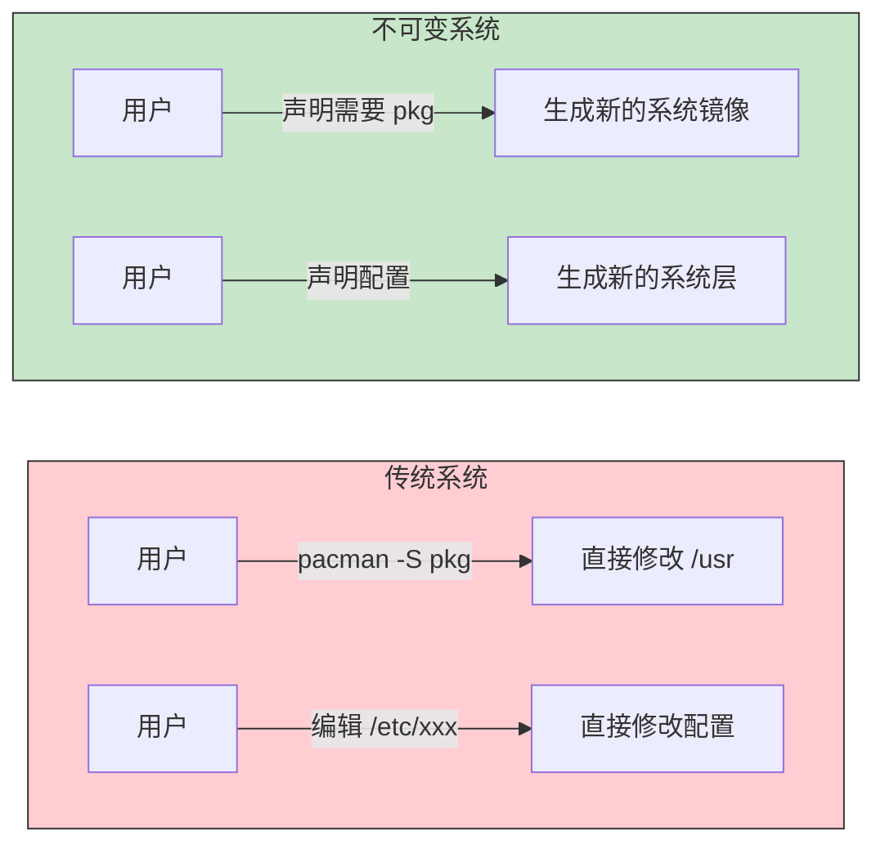
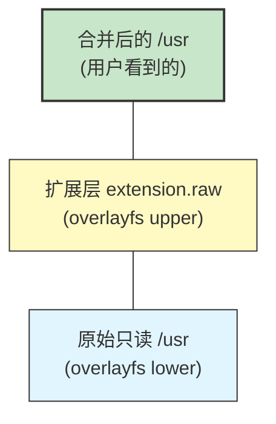
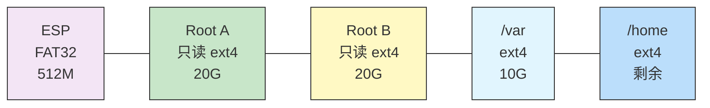
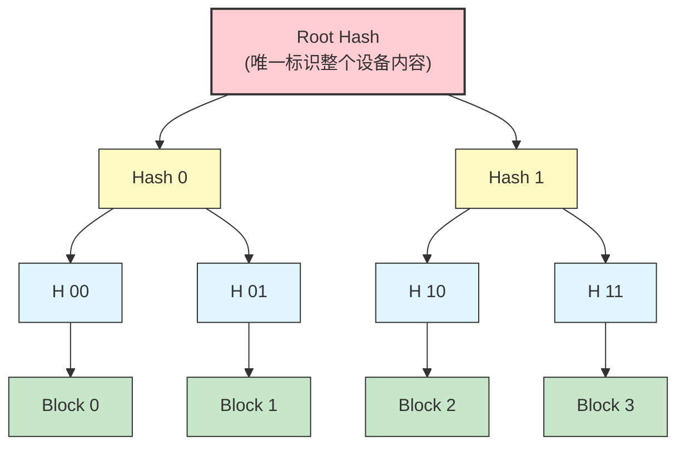
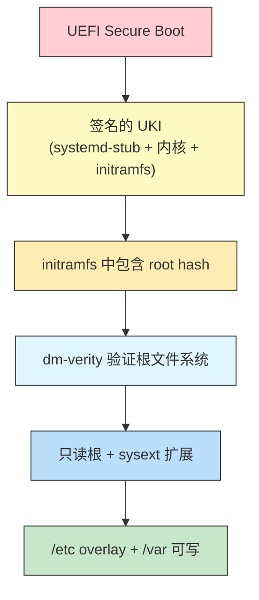
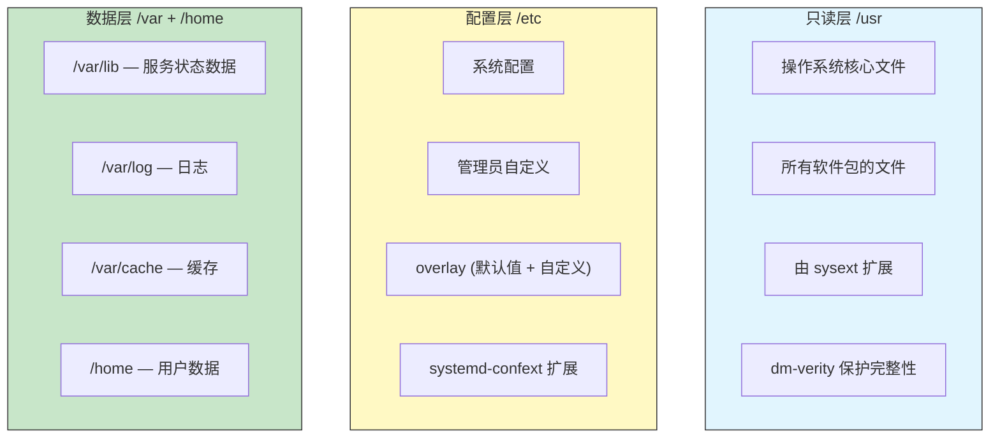
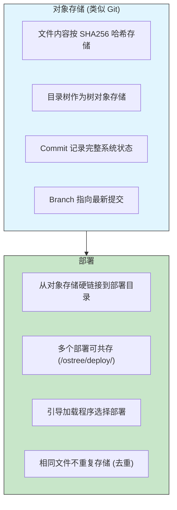
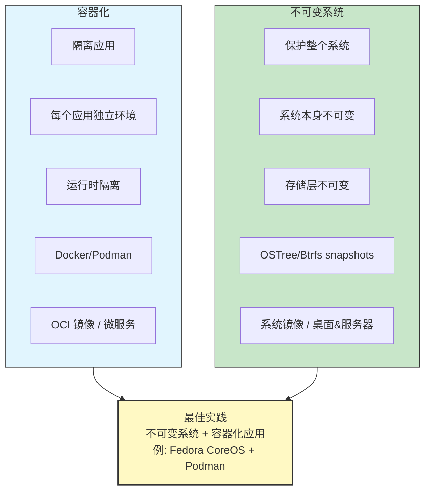

# 33 - 不可变系统与系统扩展

> 不可变（Immutable）操作系统是 Linux 发行版的新趋势。通过将根文件系统设为只读、采用原子更新和声明式配置，不可变系统在安全性、可复现性和可回滚性方面带来了革命性改进。本章将全面探讨不可变系统的理念、各发行版的实现，以及如何在 Arch Linux 上实现类似特性。

---

## 33.1 什么是不可变系统

### 核心理念

不可变系统的基本原则：


**只读根文件系统：**

- `/usr` 为只读，包含所有系统文件
- 运行时不可修改系统文件
- 软件安装通过镜像层或事务机制完成

**声明式配置：**

- 系统状态由配置文件完整描述
- 相同配置产生相同系统
- 版本控制友好

**原子更新：**

- 更新过程中系统始终处于一致状态
- 更新失败可自动回滚
- 不存在"半更新"状态

### 为什么要不可变

| 优势 | 说明 |
|------|------|
| 安全性 | 恶意软件无法修改系统文件 |
| 可复现性 | 完全相同的配置产生完全相同的系统 |
| 可回滚性 | 更新失败可一键回滚到之前的版本 |
| 稳定性 | 系统文件不会被意外修改 |
| 可审计性 | 可以验证系统文件的完整性 |
| 简化运维 | 系统状态可预测，减少"配置漂移" |

### 传统 vs 不可变



---

## 33.2 不可变系统全景

### Fedora Silverblue / Kinoite

基于 rpm-ostree 的不可变桌面系统：

```bash
# 系统更新（原子操作）
rpm-ostree upgrade

# 安装/卸载软件包（需要重启生效）
rpm-ostree install vim
rpm-ostree uninstall firefox

# 回滚到上一版本
rpm-ostree rollback

# 查看状态
rpm-ostree status

# Pin 特定部署防止被清理
rpm-ostree pin 0

# 覆盖替换包
rpm-ostree override replace ./my-package.rpm
rpm-ostree override remove package-name
```

**特点：**

- 基于 OSTree 进行系统镜像管理
- `/usr` 只读，`/etc` 和 `/var` 可写
- 应用程序通过 Flatpak 安装
- 容器中使用 toolbox/distrobox 进行开发

### openSUSE MicroOS

面向容器和服务器的不可变系统：

```bash
# 事务更新
transactional-update pkg install vim
transactional-update dup

# 回滚
transactional-update rollback

# 清理旧快照
transactional-update cleanup

# 在事务中运行 shell
transactional-update shell
```

**特点：**

- 基于 Btrfs 快照的事务更新
- 每次更新创建新快照，重启切换
- GRUB 引导菜单显示快照列表
- 可选桌面版本（MicroOS Desktop）

### NixOS

完全声明式的操作系统：

```nix
# /etc/nixos/configuration.nix
{ config, pkgs, ... }:
{
 boot.loader.systemd-boot.enable = true;

 networking.hostName = "my-nixos";

 environment.systemPackages = with pkgs; [
 vim
 git
 firefox
 ];

 services.openssh.enable = true;

 users.users.myuser = {
 isNormalUser = true;
 extraGroups = [ "wheel" ];
 };

 system.stateVersion = "24.05";
}
```

```bash
# 重建系统
sudo nixos-rebuild switch

# 回滚
sudo nixos-rebuild switch --rollback

# 列出代系
nix-env --list-generations

# 垃圾回收
nix-collect-garbage -d
```

**特点：**

- Nix store（`/nix/store`）中所有包按哈希存储
- 完全声明式：整个系统由一个配置文件描述
- 多代系管理，任意回滚
- 函数式包管理器
- 可复现构建（reproducible builds）

### GNOME OS

GNOME 项目的参考操作系统：

- 基于 OSTree
- 专注于 GNOME 桌面体验
- 主要用于 GNOME 开发和测试
- 使用 Flatpak 安装应用

### Vanilla OS

用户友好的不可变发行版：

```bash
# Vanilla OS 2.0 使用 Vib（Vanilla Image Builder）
# 基于 OCI 容器镜像构建系统

# apx：在容器中管理包
apx install vim # 在默认容器中安装
apx --dnf install vim # 在 Fedora 容器中安装
apx --apt install vim # 在 Debian 容器中安装

# 使用 Distrobox 进行开发
distrobox create -n dev -i archlinux
distrobox enter dev
```

### blendOS

多发行版融合：

- 支持同时运行 Arch、Fedora、Ubuntu 等的包管理器
- 基于容器技术无缝集成
- 声明式配置 (`/system.yaml`)
- 原子更新

```yaml
# /system.yaml
repo: 'https://pkg-repo.blendos.co'
impl: 'https://github.com/user/track.git'
packages:
 - firefox
 - vim
services:
 - bluetooth
 - NetworkManager
user:
 shell: /bin/zsh
```

### carbonOS

专注于安全和简洁的不可变系统：

- 完全不可变的 `/usr`
- Flatpak 唯一的应用安装方式
- 基于 OSTree
- GNOME 桌面

### Universal Blue

基于 Fedora Silverblue 的定制镜像：

```bash
# 切换到 Universal Blue 镜像
rpm-ostree rebase \
 ostree-unverified-registry:ghcr.io/ublue-os/silverblue-main:latest

# 提供开箱即用的驱动和编解码器
# Bazzite（游戏向）、Bluefin（开发向）等变体
```

---

## 33.3 在 Arch 上实现不可变特性

### Btrfs 只读快照 + 回滚

```bash
# 前提：使用 Btrfs 文件系统，推荐子卷布局
# @ → /
# @home → /home
# @log → /var/log
# @cache → /var/cache
# @pkgs → /var/cache/pacman/pkg

# 创建只读快照（更新前）
btrfs subvolume snapshot -r / /.snapshots/$(date +%Y%m%d-%H%M%S)

# 查看快照
btrfs subvolume list -s /

# 回滚到快照
# 1. 启动到 Live USB
# 2. 挂载 Btrfs 分区
mount /dev/sda2 /mnt

# 3. 移除当前根子卷
mv /mnt/@ /mnt/@.broken

# 4. 从快照创建可写副本
btrfs subvolume snapshot /mnt/.snapshots/20240101-120000 /mnt/@

# 5. 重启
reboot
```

**使用 snapper 自动管理快照：**

```bash
pacman -S snapper snap-pac

# 创建配置
snapper -c root create-config /

# 配置 snapper
cat /etc/snapper/configs/root
```

```ini
# /etc/snapper/configs/root
SUBVOLUME="/"
FSTYPE="btrfs"
ALLOW_GROUPS=""
ALLOW_USERS=""
TIMELINE_CREATE="yes"
TIMELINE_CLEANUP="yes"
TIMELINE_MIN_AGE="1800"
TIMELINE_LIMIT_HOURLY="5"
TIMELINE_LIMIT_DAILY="7"
TIMELINE_LIMIT_WEEKLY="4"
TIMELINE_LIMIT_MONTHLY="3"
TIMELINE_LIMIT_YEARLY="1"
NUMBER_CLEANUP="yes"
NUMBER_MIN_AGE="1800"
NUMBER_LIMIT="50"
```

```bash
# snap-pac：pacman 操作前后自动创建快照
# 安装 snap-pac 后自动生效

# 查看快照
snapper list

# 比较快照
snapper diff 1..2

# 回滚
snapper rollback

# 手动创建快照
snapper create -d "before risky change"

# 删除快照
snapper delete 5
```

### overlayfs 根文件系统

将根文件系统设为只读，使用 overlayfs 叠加可写层：

```bash
# 方案：只读根 + overlayfs 可写层

# 1. 在 initramfs 中配置 overlayfs
# /etc/mkinitcpio.conf 中添加 hook

# 自定义 initcpio hook:
# /etc/initcpio/hooks/overlay-root
```

```bash
#!/usr/bin/ash
run_hook() {
 # 挂载只读根
 mount -o ro /dev/sda2 /new_root

 # 创建 overlayfs 所需目录（使用 tmpfs 或独立分区）
 mount -t tmpfs tmpfs /overlay
 mkdir -p /overlay/upper /overlay/work

 # 挂载 overlayfs
 mount -t overlay overlay \
 -o lowerdir=/new_root,upperdir=/overlay/upper,workdir=/overlay/work \
 /new_root
}
```

```bash
# 验证
mount | grep overlay
# overlay on / type overlay (rw,lowerdir=/mnt/readonly,upperdir=/mnt/rw/upper,workdir=/mnt/rw/work)
```

### systemd-sysext 系统扩展

在只读 `/usr` 基础上叠加扩展：

```bash
# 创建系统扩展
mkdir -p /tmp/myext/usr/bin
mkdir -p /tmp/myext/usr/lib/extension-release.d

# 放入需要扩展的文件
cp /path/to/custom-tool /tmp/myext/usr/bin/

# 创建扩展元数据
cat > /tmp/myext/usr/lib/extension-release.d/extension-release.myext <<EOF
ID=arch
ARCHITECTURE=x86-64
EOF

# 方式 1：使用目录
cp -r /tmp/myext /var/lib/extensions/myext

# 方式 2：创建 raw 镜像
mkfs.erofs /var/lib/extensions/myext.raw /tmp/myext

# 方式 3：创建 squashfs 镜像
mksquashfs /tmp/myext /var/lib/extensions/myext.raw

# 合并扩展到系统
systemd-sysext merge

# 检查状态
systemd-sysext status

# 取消合并
systemd-sysext unmerge

# 刷新（取消 + 重新合并）
systemd-sysext refresh

# 自动合并（开机时）
systemctl enable systemd-sysext
```

**扩展叠加原理：**



### systemd-confext 配置扩展

类似 sysext，但用于 `/etc`：

```bash
# 创建配置扩展
mkdir -p /tmp/myconfext/etc/myapp
mkdir -p /tmp/myconfext/etc/extension-release.d

cat > /tmp/myconfext/etc/extension-release.d/extension-release.myconfext <<EOF
ID=arch
EOF

cp /path/to/myapp.conf /tmp/myconfext/etc/myapp/

# 放到配置扩展目录
cp -r /tmp/myconfext /var/lib/confexts/myconfext

# 合并
systemd-confext merge
systemd-confext status
systemd-confext unmerge
```

### dm-verity 完整性验证

详见下一节。

### A/B 分区方案



```bash
# A/B 方案工作流程：
# 1. 当前从 Root A 启动
# 2. 更新时将新系统写入 Root B
# 3. 更新引导加载程序指向 Root B
# 4. 重启到 Root B
# 5. 如果失败，回退到 Root A

# 使用 systemd-repart 管理 A/B 分区
cat > /etc/repart.d/10-root-a.conf <<EOF
[Partition]
Type=root
Label=root-a
SizeMinBytes=20G
SizeMaxBytes=20G
EOF

cat > /etc/repart.d/11-root-b.conf <<EOF
[Partition]
Type=root-secondary
Label=root-b
SizeMinBytes=20G
SizeMaxBytes=20G
EOF

# 使用 systemd-boot 的自动发现功能（Discoverable Partitions Spec）
# systemd-boot 可以自动识别 A/B 分区并选择正确的根分区
```

---

## 33.4 dm-verity 深入

### 工作原理

dm-verity 使用 Merkle hash tree（默克尔哈希树）验证块设备数据的完整性：



**原理说明：**

1. 将设备分成固定大小的数据块（默认 4096 字节）
2. 计算每个数据块的哈希值
3. 将哈希值逐层向上合并，形成树状结构
4. 最终得到一个根哈希（root hash）
5. 读取数据时，计算数据块哈希并沿树验证到根哈希
6. 任何数据篡改都会导致哈希不匹配

### 创建 verity 设备

```bash
# 安装工具
pacman -S device-mapper

# 准备数据设备（只读根文件系统）
# 假设 /dev/sda3 是只读根分区

# 1. 创建 verity 哈希
veritysetup format /dev/sda3 /dev/sda4
# 输出：
# VERITY header information for /dev/sda4
# UUID: xxxxxxxx-xxxx-xxxx-xxxx-xxxxxxxxxxxx
# Hash type: 1
# Data blocks: 262144
# Data block size: 4096
# Hash block size: 4096
# Hash algorithm: sha256
# Salt: xxxxxxxxxx...
# Root hash: abcdef1234567890... ← 记下这个值！

# 2. 打开 verity 设备
veritysetup open /dev/sda3 verified-root /dev/sda4 abcdef1234567890...

# 3. 挂载验证后的设备
mount -o ro /dev/mapper/verified-root /mnt

# 4. 验证完整性（读取时自动验证）
# 如果任何块被篡改，读取会返回 I/O 错误
```

```bash
# 使用文件而非分区
# 创建数据镜像
dd if=/dev/zero of=rootfs.img bs=1M count=1024
mkfs.ext4 rootfs.img
# ... 填充文件系统内容 ...

# 创建哈希镜像
veritysetup format rootfs.img hash.img
# 记录 root hash

# 使用 loop 设备
losetup /dev/loop0 rootfs.img
losetup /dev/loop1 hash.img
veritysetup open /dev/loop0 verified-root /dev/loop1 <root-hash>
mount -o ro /dev/mapper/verified-root /mnt
```

### 与 initramfs 集成

```bash
# 在 initramfs 中设置 dm-verity
# 需要在 mkinitcpio 中添加 dm-verity 支持

# /etc/mkinitcpio.conf
MODULES=(dm-verity)
HOOKS=(base udev autodetect modconf block filesystems)

# 内核命令行参数
# root=/dev/mapper/verified-root
# systemd.verity=yes
# systemd.verity_root_data=/dev/sda3
# systemd.verity_root_hash=/dev/sda4
# systemd.verity_root_hash=<root-hash-value>
```

### 在 systemd 中使用 dm-verity

systemd 内置了 dm-verity 支持：

```bash
# 内核命令行选项
systemd.verity=yes
systemd.verity_root_data=PARTUUID=xxxx
systemd.verity_root_hash=PARTUUID=yyyy
systemd.verity_root_hash=<root-hash>

# 或使用 Discoverable Partitions Specification
# GPT 分区类型 ID 自动识别数据分区和哈希分区
```

```ini
# /etc/veritytab（类似 crypttab）
# name data_device hash_device root_hash options
verified-root /dev/sda3 /dev/sda4 abcdef1234567890... root-hash-signature=/path/to/sig
```

```bash
# 使用 systemd-veritysetup
systemd-veritysetup attach verified-root /dev/sda3 /dev/sda4 abcdef1234567890...
systemd-veritysetup detach verified-root

# systemd-veritysetup-generator 可以从内核命令行自动生成 Unit
```

### 保护根文件系统完整性

完整的 dm-verity 保护方案：



```bash
# 将 root hash 嵌入 UKI
ukify build \
 --linux=/boot/vmlinuz-linux \
 --initrd=/boot/initramfs-linux.img \
 --cmdline="root=/dev/mapper/verified-root ro \
 systemd.verity=yes \
 systemd.verity_root_data=PARTUUID=xxxx \
 systemd.verity_root_hash=PARTUUID=yyyy \
 systemd.verity_root_hash=abcdef1234..." \
 --output=/boot/EFI/Linux/arch-verity.efi \
 --sign-kernel \
 --secureboot-private-key=db.key \
 --secureboot-certificate=db.crt
```

---

## 33.5 用户状态文件（三层分离模型）

### 文件系统分层

不可变系统将文件系统分为三层：



### /etc 作为配置状态

```bash
# 传统方式：/etc 中的文件是软件包安装 + 管理员修改的混合
# 问题：难以区分哪些是默认值，哪些是管理员自定义

# 不可变方式：
# 1. 默认配置存放在 /usr/lib/ 或 /usr/share/factory/etc/
# 2. /etc 只包含管理员的覆盖/自定义
# 3. 系统优先读取 /etc，找不到则回退到 /usr/lib/

# systemd 的配置搜索顺序
# /etc/systemd/system.conf ← 管理员自定义
# /run/systemd/system.conf ← 运行时覆盖
# /usr/lib/systemd/system.conf ← 包默认值
```

### /var 作为可变数据

```bash
# /var 子目录约定
/var/lib/ # 持久化状态数据（数据库、包管理器状态等）
/var/log/ # 日志文件
/var/cache/ # 可重建的缓存
/var/spool/ # 待处理的队列数据
/var/tmp/ # 重启后保留的临时文件
/var/run/ → /run # 运行时数据（符号链接）
```

### systemd-tmpfiles 管理 /etc 默认值

```ini
# /usr/lib/tmpfiles.d/etc-defaults.conf
# 当 /etc 中的文件不存在时，从 /usr/share/factory/etc/ 复制

# 复制文件（如果目标不存在）
C /etc/hostname - - - - /usr/share/factory/etc/hostname
C /etc/locale.conf - - - - /usr/share/factory/etc/locale.conf
C /etc/vconsole.conf - - - - /usr/share/factory/etc/vconsole.conf

# 创建符号链接（如果目标不存在）
L /etc/os-release - - - - ../usr/lib/os-release
L /etc/localtime - - - - ../usr/share/zoneinfo/UTC

# 创建目录
d /etc/sysctl.d 0755 root root -
d /etc/tmpfiles.d 0755 root root -
```

### /usr 只读 + /etc overlay 模式

```bash
# 实现方案：/usr 只读挂载，/etc 使用 overlayfs

# 1. /usr 直接只读挂载（dm-verity 保护）
# 2. /etc 的 lower 层为 /usr/share/factory/etc/（默认配置）
# 3. /etc 的 upper 层为 /var/lib/etc-overlay/（管理员修改）

mount -t overlay overlay \
 -o lowerdir=/usr/share/factory/etc,upperdir=/var/lib/etc-overlay/upper,workdir=/var/lib/etc-overlay/work \
 /etc

# 这样：
# - 未修改的文件来自 /usr/share/factory/etc/（只读）
# - 管理员修改的文件存储在 /var/lib/etc-overlay/upper/
# - 可以清楚看到管理员做了哪些自定义
```

```bash
# 查看管理员自定义了哪些文件
ls /var/lib/etc-overlay/upper/

# 重置某个配置到默认值
rm /var/lib/etc-overlay/upper/hostname
# 下次读取 /etc/hostname 时会回退到 /usr/share/factory/etc/hostname
```

---

## 33.6 OSTree 原理

OSTree 是一个基于内容寻址的文件系统版本管理工具：



```bash
# OSTree 基本操作
ostree --repo=/ostree/repo summary -u
ostree --repo=/ostree/repo log <ref>
ostree --repo=/ostree/repo ls <commit>
ostree --repo=/ostree/repo diff <commit1> <commit2>

# 目录结构
/ostree/
├── repo/ # 对象存储
│ ├── objects/ # SHA256 哈希的文件/目录对象
│ ├── refs/ # 分支引用
│ └── config # 仓库配置
└── deploy/
 └── arch/ # 部署
 ├── deploy/
 │ ├── <checksum1>/ # 部署 1
 │ └── <checksum2>/ # 部署 2
 └── var/ # 共享的 /var
```

**OSTree vs Git：**

| 特性 | Git | OSTree |
|------|-----|--------|
| 设计目标 | 源代码 | 操作系统文件 |
| 对象类型 | blob, tree, commit, tag | file, dirtree, dirmeta, commit |
| 文件权限 | 有限（仅可执行位） | 完整（uid, gid, mode, xattr） |
| 大文件 | 性能差 | 设计考虑 |
| 硬链接 | 不支持 | 支持（用于部署） |
| 增量下载 | 有限 | 支持静态 delta |

---

## 33.7 容器化 vs 不可变系统



两者是互补关系：

- 不可变系统保护宿主操作系统
- 容器化隔离应用程序
- 组合使用实现最大安全性和灵活性

---

## 33.8 Flatpak/Snap 在不可变系统中的角色

在只读系统上安装 GUI 应用：

```bash
# Flatpak（不可变系统的首选）
pacman -S flatpak

# 添加 Flathub
flatpak remote-add --if-not-exists flathub https://dl.flathub.org/repo/flathub.flatpakrepo

# 安装应用
flatpak install flathub org.mozilla.firefox
flatpak install flathub com.visualstudio.code

# 运行
flatpak run org.mozilla.firefox

# 更新
flatpak update

# 查看已安装
flatpak list

# 权限管理
flatpak override --user --filesystem=home org.example.App
flatpak permission-list
```

**Flatpak 在不可变系统中的优势：**

| 特性 | 说明 |
|------|------|
| 沙箱隔离 | 使用 Bubblewrap 沙箱 |
| 独立运行时 | 自带依赖，不依赖系统库 |
| Portal | 通过 Portal 安全访问系统资源 |
| 去重 | 共享运行时减少空间 |
| 不触碰 /usr | 安装在 /var/lib/flatpak 或 ~/.local/share/flatpak |
| 独立更新 | 应用更新不需要系统更新 |

**Distrobox / Toolbox 用于开发：**

```bash
# 在不可变系统上进行开发
pacman -S distrobox

# 创建开发环境
distrobox create -n arch-dev -i archlinux:latest
distrobox create -n ubuntu-dev -i ubuntu:24.04

# 进入开发环境
distrobox enter arch-dev

# 在容器中安装任何东西
sudo pacman -S gcc cmake python nodejs

# 导出应用到宿主
distrobox-export --app code
distrobox-export --bin /usr/bin/gcc --export-path ~/.local/bin
```

---

## 33.9 不可变系统的局限性与折中

### 局限性

| 局限 | 说明 |
|------|------|
| 学习曲线 | 需要改变传统的系统管理习惯 |
| 灵活性降低 | 无法随意安装系统级软件 |
| 调试困难 | 只读系统上排错需要额外步骤 |
| 兼容性 | 某些需要修改系统文件的软件不兼容 |
| 磁盘空间 | 快照/多版本占用更多空间 |
| 更新延迟 | 更新通常需要重启才能生效 |
| 驱动问题 | 内核模块和驱动管理更复杂 |

### 折中方案

```bash
# 在 Arch 上渐进式采用不可变特性：

# 级别 1：Btrfs 快照（最简单）
# - 使用 snapper + snap-pac
# - 更新前自动快照
# - 保持传统使用方式

# 级别 2：只读 /usr + overlay /etc
# - /usr 挂载为只读
# - /etc 使用 overlayfs
# - 需要更新时临时 remount

# 级别 3：dm-verity + sysext
# - 完全验证的只读根
# - 软件通过 sysext 扩展
# - 最高安全性，灵活性最低

# 级别 4：A/B 分区 + 原子更新
# - 类似 ChromeOS/Android 的方案
# - 更新写入备用分区
# - 失败自动回退
```

### 在 Arch 上的实践建议

```bash
# 推荐的渐进式方案：

# 1. 使用 Btrfs 子卷布局
mkfs.btrfs /dev/sda2
mount /dev/sda2 /mnt
btrfs subvolume create /mnt/@
btrfs subvolume create /mnt/@home
btrfs subvolume create /mnt/@var
btrfs subvolume create /mnt/@snapshots

# 2. 安装 snapper + snap-pac
pacman -S snapper snap-pac grub-btrfs

# 3. 配置自动快照
snapper -c root create-config /

# 4. 使用 systemd-sysext 管理额外软件
# 5. 使用 Flatpak 安装桌面应用
# 6. 使用 Distrobox 进行开发

# 这样在保持 Arch 灵活性的同时获得不可变系统的部分优势
```

---

## 33.10 构建自定义不可变 Arch 系统

完整的构建流程：

```bash
#!/usr/bin/env bash
# build-immutable-arch.sh

set -euo pipefail

WORK_DIR="/tmp/immutable-build"
OUTPUT_DIR="/srv/images"
ROOT_IMG="$OUTPUT_DIR/rootfs.img"
HASH_IMG="$OUTPUT_DIR/hash.img"

# 1. 创建根文件系统镜像
truncate -s 4G "$ROOT_IMG"
mkfs.ext4 "$ROOT_IMG"
mkdir -p "$WORK_DIR/rootfs"
mount "$ROOT_IMG" "$WORK_DIR/rootfs"

# 2. 安装基础系统
pacstrap "$WORK_DIR/rootfs" base linux linux-firmware systemd

# 3. 基本配置
arch-chroot "$WORK_DIR/rootfs" bash -c "
 ln -sf /usr/share/zoneinfo/Asia/Shanghai /etc/localtime
 echo 'LANG=en_US.UTF-8' > /etc/locale.conf
 echo 'immutable-arch' > /etc/hostname
 systemctl enable systemd-networkd systemd-resolved
"

# 4. 将 /etc 默认值复制到 /usr/share/factory/etc
cp -a "$WORK_DIR/rootfs/etc" "$WORK_DIR/rootfs/usr/share/factory/etc"

# 5. 卸载并创建 dm-verity 哈希
umount "$WORK_DIR/rootfs"
veritysetup format "$ROOT_IMG" "$HASH_IMG" | tee "$OUTPUT_DIR/verity-info.txt"

ROOT_HASH=$(grep "Root hash:" "$OUTPUT_DIR/verity-info.txt" | awk '{print $3}')
echo "Root hash: $ROOT_HASH"

# 6. 创建 UKI
ukify build \
 --linux="$WORK_DIR/rootfs/boot/vmlinuz-linux" \
 --initrd="$WORK_DIR/rootfs/boot/initramfs-linux.img" \
 --cmdline="root=/dev/mapper/verified-root ro systemd.verity=yes \
 systemd.verity_root_data=/dev/sda3 \
 systemd.verity_root_hash=$ROOT_HASH" \
 --output="$OUTPUT_DIR/arch-immutable.efi"

echo "Build complete!"
echo "Root hash: $ROOT_HASH"
```

---

## 33.11 未来展望

不可变系统的发展趋势：

```
现在 未来
─────────────────────────────────────────────
传统包管理器 → 镜像化系统 + 容器化应用
就地更新 → 原子更新 + A/B 切换
手动配置 → 声明式配置 + GitOps
信任执行 → dm-verity + Secure Boot
单一系统 → 系统 + 扩展（sysext）
```

关键技术：

- **composefs**: EROFS + overlayfs 组合，用于高效的只读文件系统叠加
- **systemd-sysupdate**: 原子系统更新工具
- **mkosi**: 构建系统镜像的声明式工具
- **UKI**: 统一内核镜像简化安全启动
- **Confidential Computing**: 保护运行时数据

不可变系统代表了 Linux 系统管理的未来方向。即使你选择继续使用传统的 Arch Linux，理解这些概念也将帮助你更好地理解现代基础设施和容器技术。

---

## 33.12 本章测验

> [!example] 自测题目

> [!question]- 选择题 1：不可变系统的三个核心要素不包括以下哪项？
> - A. 只读根文件系统
> - B. 声明式配置
> - C. 实时内存加密
> - D. 原子更新
>
> > [!success]- 点击查看答案
> > **C**
> > 不可变系统的三要素是：只读根文件系统、声明式配置和原子更新。实时内存加密属于 Confidential Computing，不是不可变系统的核心特性。

> [!question]- 选择题 2：dm-verity 使用什么数据结构来验证块设备完整性？
> - A. 链表
> - B. Merkle hash tree（默克尔哈希树）
> - C. B+ 树
> - D. 红黑树
>
> > [!success]- 点击查看答案
> > **B**
> > dm-verity 使用 Merkle hash tree（默克尔哈希树）验证块设备数据。它将设备分成固定大小的块，逐层计算哈希值，最终得到一个根哈希值（root hash）。

> [!question]- 判断题 3：OSTree 的设计类似 Git，但专门针对操作系统文件系统进行了优化，支持完整的文件权限和硬链接部署。
> - A. 正确
> - B. 错误
>
> > [!success]- 点击查看答案
> > **A. 正确**
> > OSTree 借鉴了 Git 的内容寻址设计，但支持完整的 UNIX 文件权限（uid、gid、mode、xattr），并使用硬链接进行高效部署。

> [!question]- 选择题 4：在不可变系统的文件系统三层分离模型中，`/var` 属于哪一层？
> - A. 只读层
> - B. 配置层
> - C. 数据层
> - D. 扩展层
>
> > [!success]- 点击查看答案
> > **C**
> > `/var` 和 `/home` 属于数据层（可变数据），存储服务状态、日志、缓存和用户数据。`/usr` 是只读层，`/etc` 是配置层。

> [!question]- 选择题 5：`systemd-sysext` 的作用是什么？
> - A. 管理系统扩展镜像，在只读 /usr 基础上叠加额外文件
> - B. 扩展系统分区大小
> - C. 安装系统更新补丁
> - D. 扩展交换空间
>
> > [!success]- 点击查看答案
> > **A**
> > `systemd-sysext` 使用 overlayfs 在只读的 `/usr` 之上叠加系统扩展镜像，使得可以在不修改基础系统的情况下添加额外软件。

> [!question]- 判断题 6：Fedora Silverblue 上安装的软件包修改立即生效，无需重启。
> - A. 正确
> - B. 错误
>
> > [!success]- 点击查看答案
> > **B. 错误**
> > Fedora Silverblue 基于 rpm-ostree，通过 `rpm-ostree install` 安装的软件包需要重启才能生效，因为系统是以原子方式更新到新的部署。

> [!question]- 选择题 7：在 Arch Linux 上实现不可变特性的渐进方案中，哪种方案提供最高安全性但灵活性最低？
> - A. Btrfs 快照
> - B. 只读 /usr + overlay /etc
> - C. dm-verity + sysext
> - D. 使用 snapper 自动快照
>
> > [!success]- 点击查看答案
> > **C**
> > dm-verity + sysext 方案提供完全验证的只读根文件系统，安全性最高，但灵活性最低，因为所有软件必须通过 sysext 扩展方式安装。

> [!question]- 选择题 8：NixOS 与传统发行版最大的区别是什么？
> - A. 使用 Btrfs 文件系统
> - B. 整个系统由一个声明式配置文件完整描述
> - C. 只能运行容器化应用
> - D. 不支持图形界面
>
> > [!success]- 点击查看答案
> > **B**
> > NixOS 的核心特点是完全声明式——整个系统由 `/etc/nixos/configuration.nix` 配置文件描述，相同配置产生完全相同的系统，支持多代系管理和任意回滚。

> [!question]- 判断题 9：A/B 分区方案中，更新失败时可以自动回退到之前的分区。
> - A. 正确
> - B. 错误
>
> > [!success]- 点击查看答案
> > **A. 正确**
> > A/B 分区方案将新系统写入备用分区，如果启动失败可以自动回退到原分区，确保系统始终可用。

> [!question]- 选择题 10：不可变系统中推荐使用什么方式安装 GUI 桌面应用？
> - A. 直接使用包管理器安装到 /usr
> - B. 编译源码安装
> - C. Flatpak
> - D. 手动复制二进制文件
>
> > [!success]- 点击查看答案
> > **C**
> > 不可变系统推荐使用 Flatpak 安装 GUI 应用，因为 Flatpak 安装在 `/var/lib/flatpak` 中，不触碰只读的 `/usr`，且自带沙箱隔离和独立运行时。
