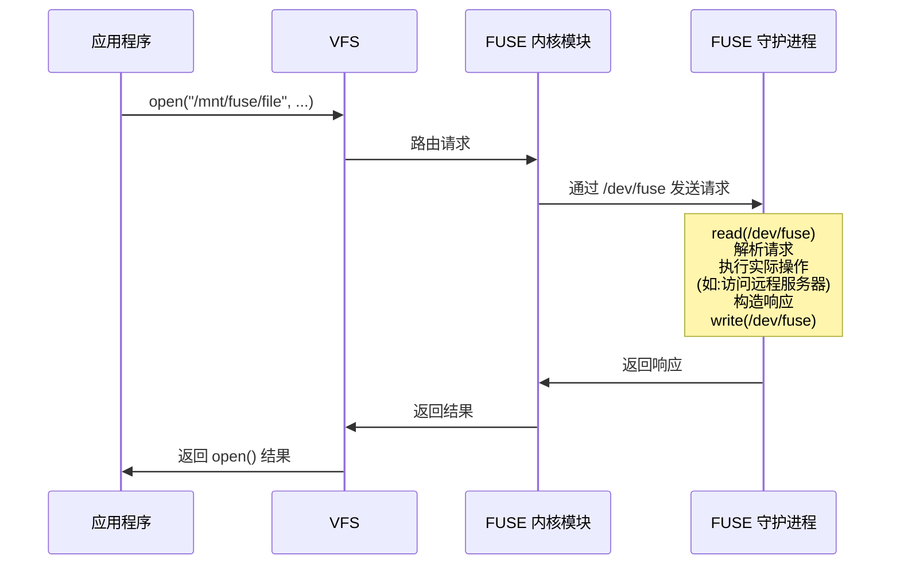

# 34 - FUSE 与虚拟文件系统

> 文件系统是操作系统的核心抽象之一。传统上文件系统运行在内核态，开发和调试都极为困难。FUSE（Filesystem in Userspace）打破了这一限制，让普通用户也能编写和使用自定义文件系统。本章将深入探讨 FUSE、overlayfs、virtiofs、EROFS 等关键文件系统技术，以及它们在容器、虚拟化和不可变系统中的应用。

---

## 34.1 什么是 FUSE

### 内核态 vs 用户态文件系统


### FUSE 架构

FUSE 由三个核心组件组成：

| 组件 | 说明 |
|------|------|
| `/dev/fuse` | 内核提供的字符设备，用于内核与用户空间通信 |
| `fuse.ko` | 内核模块，注册 FUSE 文件系统类型到 VFS |
| `libfuse` | 用户空间库，简化 FUSE 文件系统开发 |
| `fusermount3` | 挂载/卸载辅助工具（setuid 程序） |

### 工作原理（请求转发流程）



**性能特征：**

- 每次文件操作涉及至少 2 次用户/内核态切换
- 相比内核文件系统有额外开销
- 可通过 `splice`、`writeback cache`、`max_read` 等优化
- libfuse3 的多线程模式可提高并发性能

---

## 34.2 FUSE 安装与基本使用

```bash
# 安装 FUSE 3（Arch Linux 默认）
pacman -S fuse3

# FUSE 2 兼容层（部分旧工具需要）
pacman -S fuse2

# 检查 FUSE 内核模块
lsmod | grep fuse
modprobe fuse

# 检查 /dev/fuse
ls -la /dev/fuse
# crw-rw-rw- 1 root root 10, 229 ... /dev/fuse
```

**挂载与卸载：**

```bash
# 挂载（以 sshfs 为例）
sshfs user@host:/path /mnt/remote

# 查看 FUSE 挂载
mount | grep fuse
findmnt -t fuse,fuse.sshfs

# 卸载
fusermount3 -u /mnt/remote

# 强制卸载（lazy unmount）
fusermount3 -uz /mnt/remote

# /etc/fuse.conf 配置
cat /etc/fuse.conf
```

```ini
# /etc/fuse.conf
# 允许非 root 用户使用 allow_other 选项
user_allow_other

# mount_max = 1000
```

---

## 34.3 常见 FUSE 文件系统

### sshfs — 远程文件系统

通过 SSH 协议挂载远程目录：

```bash
# 安装
pacman -S sshfs

# 基本挂载
sshfs user@server:/remote/path /mnt/remote

# 带选项挂载
sshfs user@server:/remote/path /mnt/remote \
 -o reconnect \
 -o ServerAliveInterval=15 \
 -o ServerAliveCountMax=3 \
 -o allow_other \
 -o IdentityFile=~/.ssh/id_ed25519 \
 -o compression=yes \
 -o cache=yes \
 -o cache_timeout=300 \
 -o dir_cache=yes \
 -o port=2222

# 通过跳板机
sshfs user@target:/path /mnt/remote \
 -o ProxyJump=user@jump-host

# 卸载
fusermount3 -u /mnt/remote
```

```ini
# /etc/fstab 中配置 sshfs
user@server:/remote/path /mnt/remote fuse.sshfs defaults,_netdev,users,idmap=user,IdentityFile=/home/user/.ssh/id_ed25519,reconnect,allow_other 0 0
```

```ini
# 使用 systemd automount
# /etc/systemd/system/mnt-remote.mount
[Unit]
Description=SSHFS Mount
After=network-online.target
Wants=network-online.target

[Mount]
What=user@server:/remote/path
Where=/mnt/remote
Type=fuse.sshfs
Options=_netdev,users,idmap=user,IdentityFile=/home/user/.ssh/id_ed25519,reconnect,allow_other

[Install]
WantedBy=multi-user.target
```

### rclone mount — 云存储挂载

支持 40+ 种云存储服务：

```bash
# 安装
pacman -S rclone

# 配置远程存储
rclone config

# 挂载 Google Drive
rclone mount gdrive: /mnt/gdrive \
 --vfs-cache-mode full \
 --vfs-cache-max-size 10G \
 --vfs-read-chunk-size 64M \
 --vfs-read-chunk-size-limit 1G \
 --buffer-size 256M \
 --dir-cache-time 72h \
 --poll-interval 15s \
 --allow-other \
 --daemon

# 挂载 S3 兼容存储
rclone mount s3:mybucket /mnt/s3 \
 --vfs-cache-mode writes \
 --no-modtime \
 --daemon

# 挂载 SFTP
rclone mount sftp:/ /mnt/sftp \
 --vfs-cache-mode off \
 --daemon
```

```ini
# systemd service 管理 rclone mount
# ~/.config/systemd/user/rclone-gdrive.service
[Unit]
Description=RClone Mount Google Drive
After=network-online.target
Wants=network-online.target

[Service]
Type=notify
ExecStart=/usr/bin/rclone mount gdrive: %h/gdrive \
 --vfs-cache-mode full \
 --vfs-cache-max-size 5G \
 --allow-other
ExecStop=/usr/bin/fusermount3 -uz %h/gdrive
Restart=on-failure
RestartSec=10

[Install]
WantedBy=default.target
```

### ntfs-3g / ntfs3 — NTFS 支持

```bash
# ntfs-3g（FUSE 实现，成熟稳定）
pacman -S ntfs-3g
mount -t ntfs-3g /dev/sdb1 /mnt/windows

# 内核原生 ntfs3 驱动（Linux 5.15+，性能更好）
mount -t ntfs3 /dev/sdb1 /mnt/windows

# ntfs-3g 常用选项
mount -t ntfs-3g -o uid=1000,gid=1000,dmask=022,fmask=133 /dev/sdb1 /mnt/windows

# fstab 配置
# /dev/sdb1 /mnt/windows ntfs3 defaults,uid=1000,gid=1000 0 0
```

### gocryptfs / cryfs — 加密文件系统

```bash
# gocryptfs（推荐，性能好）
pacman -S gocryptfs

# 初始化加密目录
gocryptfs -init /path/to/cipher

# 挂载
gocryptfs /path/to/cipher /mnt/plain

# 反向挂载（用于加密备份）
gocryptfs -reverse /path/to/plain /mnt/cipher-view

# 查看信息
gocryptfs -info /path/to/cipher

# cryfs（更好的元数据隐藏）
pacman -S cryfs

# 创建并挂载
cryfs /path/to/cipher /mnt/plain

# 卸载
fusermount3 -u /mnt/plain
```

**gocryptfs vs cryfs 对比：**

| 特性 | gocryptfs | cryfs |
|------|-----------|-------|
| 加密方式 | 文件级 | 块级 |
| 文件名加密 | 是 | 是 |
| 隐藏目录结构 | 否 | 是 |
| 隐藏文件大小 | 否 | 是 |
| 性能 | 更快 | 较慢 |
| 适用场景 | 通用加密 | 高隐私需求 |

### archivemount — 挂载压缩包

```bash
# 安装
pacman -S archivemount

# 挂载 tar.gz
archivemount archive.tar.gz /mnt/archive

# 挂载 zip
archivemount archive.zip /mnt/archive -o readonly

# 卸载
fusermount3 -u /mnt/archive
```

### s3fs — S3 挂载

```bash
# 安装
pacman -S s3fs-fuse

# 配置凭证
echo "ACCESS_KEY:SECRET_KEY" > ~/.passwd-s3fs
chmod 600 ~/.passwd-s3fs

# 挂载
s3fs mybucket /mnt/s3 \
 -o passwd_file=~/.passwd-s3fs \
 -o url=https://s3.amazonaws.com \
 -o use_path_request_style \
 -o allow_other

# MinIO 等兼容 S3 服务
s3fs mybucket /mnt/s3 \
 -o passwd_file=~/.passwd-s3fs \
 -o url=https://minio.example.com \
 -o use_path_request_style
```

### mergerfs — 合并多个目录

```bash
# 安装
pacman -S mergerfs

# 将多个目录/磁盘合并为一个
mergerfs /mnt/disk1:/mnt/disk2:/mnt/disk3 /mnt/merged \
 -o defaults,allow_other,use_ino \
 -o category.create=mfs \
 -o moveonenospc=true \
 -o dropcacheonclose=true \
 -o cache.files=auto-full \
 -o minfreespace=10G

# 策略选项
# create 策略:
# mfs - 最多可用空间
# lfs - 最少可用空间
# epmfs - 已有路径优先，否则 mfs
# rand - 随机
# newest - 最新的分支
```

```ini
# /etc/fstab
/mnt/disk1:/mnt/disk2:/mnt/disk3 /mnt/merged fuse.mergerfs defaults,allow_other,use_ino,category.create=mfs,moveonenospc=true,minfreespace=10G 0 0
```

**mergerfs + SnapRAID 组合（家庭 NAS 方案）：**

```bash
# mergerfs 合并数据盘
# SnapRAID 提供奇偶校验保护
# 比传统 RAID 更灵活，允许不同大小的磁盘

pacman -S snapraid

# /etc/snapraid.conf
# parity /mnt/parity1/snapraid.parity
# content /mnt/disk1/snapraid.content
# data d1 /mnt/disk1/
# data d2 /mnt/disk2/
# data d3 /mnt/disk3/
# exclude /lost+found/
# exclude *.tmp

# 同步校验
snapraid sync
snapraid status
snapraid fix
```

---

## 34.4 fuse-overlayfs 详解

### 什么是 overlayfs

overlayfs 是一种联合文件系统，将多个目录层叠在一起：

```
┌─────────────────────────┐
│ merged（合并视图） │ ← 用户看到的
├─────────────────────────┤
│ upper（可写层） │ ← 修改存储在这里
├─────────────────────────┤
│ lower（只读层） │ ← 基础层（可多个）
└─────────────────────────┘
```

### 内核态 overlayfs vs fuse-overlayfs

| 特性 | 内核 overlayfs | fuse-overlayfs |
|------|---------------|----------------|
| 运行位置 | 内核态 | 用户态 |
| 性能 | 更快 | 较慢（FUSE 开销） |
| 权限要求 | 需要 root 或 CAP | 非特权用户可用 |
| rootless 容器 | 不支持 | 支持 |
| 可用性 | Linux 3.18+ | 任何有 FUSE 的系统 |

### 为什么需要 fuse-overlayfs

```
问题：
 内核 overlayfs 需要 CAP_SYS_ADMIN 能力
 rootless 容器运行在用户命名空间中，没有此能力
 → 无法使用内核 overlayfs

解决：
 fuse-overlayfs 在用户态实现相同功能
 通过 FUSE 接口工作
 不需要特权
 → rootless 容器可以使用联合文件系统
```

### 安装与使用

```bash
# 安装
pacman -S fuse-overlayfs

# 基本使用
mkdir -p /tmp/lower /tmp/upper /tmp/work /tmp/merged

# 向 lower 添加文件
echo "original" > /tmp/lower/file.txt
mkdir /tmp/lower/dir1

# 挂载
fuse-overlayfs \
 -o lowerdir=/tmp/lower \
 -o upperdir=/tmp/upper \
 -o workdir=/tmp/work \
 /tmp/merged

# 查看合并后的内容
ls /tmp/merged/
cat /tmp/merged/file.txt # "original"

# 修改文件（写入 upper 层）
echo "modified" > /tmp/merged/file.txt
cat /tmp/upper/file.txt # "modified"
cat /tmp/lower/file.txt # "original"（不变）

# 创建新文件
touch /tmp/merged/new-file.txt
ls /tmp/upper/ # file.txt new-file.txt

# 删除文件（创建 whiteout）
rm /tmp/merged/dir1
ls -la /tmp/upper/ # 出现 dir1 的 whiteout 标记

# 卸载
fusermount3 -u /tmp/merged
```

### 层级概念

```
多层 lower 目录:

fuse-overlayfs \
 -o lowerdir=/layer3:/layer2:/layer1 \
 -o upperdir=/upper \
 -o workdir=/work \
 /merged

优先级（从左到右递减）:
 /layer3 > /layer2 > /layer1

同名文件取最高优先级层的版本
```

**写时复制（Copy-on-Write）行为：**

```bash
# 1. 读取文件 → 从最高优先级的层读取
# 2. 修改文件 → 复制到 upper 层后修改
# 3. 创建文件 → 直接在 upper 层创建
# 4. 删除文件 → 在 upper 层创建 whiteout
# 5. lower 层永远不会被修改
```

### 与 Podman rootless 容器集成

```bash
# Podman rootless 默认使用 fuse-overlayfs
podman info | grep graphDriver
# graphDriverName: overlay

# 存储配置
cat ~/.config/containers/storage.conf
```

```ini
# ~/.config/containers/storage.conf
[storage]
driver = "overlay"

[storage.options.overlay]
mount_program = "/usr/bin/fuse-overlayfs"
mountopt = "nodev,metacopy=on"
```

```bash
# 验证 Podman 使用 fuse-overlayfs
podman run --rm alpine cat /etc/os-release
mount | grep fuse-overlayfs

# 查看容器层
podman image tree alpine
ls ~/.local/share/containers/storage/overlay/
```

### 与 Docker rootless 集成

```bash
# 安装 Docker rootless
dockerd-rootless-setuptool.sh install

# Docker rootless 也可以使用 fuse-overlayfs
# ~/.config/docker/daemon.json
```

```json
{
 "storage-driver": "fuse-overlayfs"
}
```

```bash
# 或者如果内核支持 unprivileged overlayfs (5.11+)
# 可以使用原生 overlay2
# sysctl kernel.unprivileged_userns_clone=1
```

### 性能特性

```
fuse-overlayfs 性能优化:
 - metacopy=on : 仅复制元数据，延迟复制数据
 - noacl : 禁用 ACL（减少开销）
 - squash_to_uid : 简化 UID 映射
 - squash_to_gid : 简化 GID 映射

基准对比（相对于内核 overlayfs）:
 顺序读取: ~90% 性能
 顺序写入: ~85% 性能
 随机 I/O: ~70-80% 性能
 元数据操作: ~60-70% 性能
```

---

## 34.5 virtiofs 详解

### 什么是 virtiofs

virtiofs 是专为虚拟机设计的高性能共享文件系统：

```
┌──────────────────────────┐
│ 虚拟机 (Guest) │
│ mount -t virtiofs ... │
│ │ │
│ ┌──────┴──────┐ │
│ │ virtiofs │ │
│ │ 客户端驱动 │ │
│ └──────┬──────┘ │
├──────────┼───────────────┤
│ ┌──────┴──────┐ │
│ │ virtio │ │ ← virtio 传输层
│ │ transport │ │
│ └──────┬──────┘ │
├──────────┼───────────────┤
│ ┌──────┴──────┐ │
│ │ virtiofsd │ │ ← 宿主机守护进程
│ │ (host) │ │
│ └──────┬──────┘ │
│ │ │
│ 宿主机文件系统 │
└──────────────────────────┘
```

### 与 9p 对比

| 特性 | virtiofs | 9p (virtio-9p) |
|------|----------|----------------|
| 性能 | 接近原生 | 较慢 |
| 缓存 | DAX 支持，内存映射 | 基本缓存 |
| 一致性 | 强一致性 | 弱一致性 |
| 功能 | 完整 POSIX | 有限 POSIX |
| mmap 支持 | 是 (DAX) | 有限 |
| 锁支持 | 完整 | 有限 |
| 适用场景 | 生产环境 | 简单共享 |

### QEMU/KVM 中配置 virtiofs

```bash
# 1. 启动 virtiofsd（宿主机）
/usr/lib/virtiofsd \
 --socket-path=/tmp/virtiofs.sock \
 --shared-dir=/path/to/share \
 --cache=always \
 --thread-pool-size=8

# 新版 virtiofsd (Rust 实现)
virtiofsd \
 --socket-path=/tmp/virtiofs.sock \
 --shared-dir=/path/to/share \
 --cache=always

# 2. 启动 QEMU 并添加 virtiofs 设备
qemu-system-x86_64 \
 -machine q35,accel=kvm,memory-backend=mem \
 -m 4G \
 -object memory-backend-memfd,id=mem,size=4G,share=on \
 -chardev socket,id=char0,path=/tmp/virtiofs.sock \
 -device vhost-user-fs-pci,chardev=char0,tag=myshare,queue-size=1024 \
 -drive file=disk.qcow2,format=qcow2 \
 ...
```

### 在虚拟机中挂载 host 目录

```bash
# 在 Guest 中挂载
mount -t virtiofs myshare /mnt/shared

# /etc/fstab
myshare /mnt/shared virtiofs defaults 0 0

# systemd mount
# /etc/systemd/system/mnt-shared.mount
```

```ini
[Unit]
Description=VirtioFS Shared Directory

[Mount]
What=myshare
Where=/mnt/shared
Type=virtiofs
Options=defaults

[Install]
WantedBy=multi-user.target
```

### DAX（直接访问）模式

DAX 允许虚拟机直接映射宿主机的文件页面缓存，避免数据复制：

```bash
# 宿主机启动 virtiofsd 时启用缓存
virtiofsd \
 --socket-path=/tmp/virtiofs.sock \
 --shared-dir=/path/to/share \
 --cache=always

# QEMU 配置中指定缓存窗口大小
qemu-system-x86_64 \
 ... \
 -device vhost-user-fs-pci,chardev=char0,tag=myshare,cache-size=2G \
 ...

# Guest 中挂载时启用 DAX
mount -t virtiofs -o dax=always myshare /mnt/shared
# dax=always - 总是使用 DAX
# dax=never - 不使用 DAX
# dax=inode - 按 inode 决定
```

**DAX 性能优势：**

```
无 DAX:
 Guest read → virtio 请求 → Host 读取 → 数据复制到 Guest → Guest 缓存

有 DAX:
 Guest read → 直接映射 Host 页面缓存 → 零复制

性能提升:
 大文件顺序读取: ~50% 提升
 随机读取: ~30% 提升
 内存映射 (mmap): ~90% 提升（接近原生）
 内存使用: 大幅减少（共享宿主机缓存）
```

### 在 libvirt/virt-manager 中配置

```xml
<!-- 在 domain XML 中添加 -->
<domain type='kvm'>
 <memoryBacking>
 <source type='memfd'/>
 <access mode='shared'/>
 </memoryBacking>

 <devices>
 <filesystem type='mount' accessmode='passthrough'>
 <driver type='virtiofs' queue='1024'/>
 <source dir='/path/to/share'/>
 <target dir='myshare'/>
 </filesystem>
 </devices>
</domain>
```

```bash
# 使用 virsh 编辑
virsh edit myvm

# 或使用 virt-manager GUI:
# 1. 打开 VM 设置
# 2. 添加硬件 → 文件系统
# 3. 驱动选择 virtiofs
# 4. 源路径: /path/to/share
# 5. 目标路径: myshare
# 6. 注意: 需要在 VM 的 XML 中手动添加 memoryBacking 配置
```

---

## 34.6 OverlayFS（内核态）

### 工作原理

```
mount -t overlay overlay \
 -o lowerdir=/lower1:/lower2,upperdir=/upper,workdir=/work \
 /merged

文件操作行为:
┌──────────────┬──────────────────────────────────┐
│ 操作 │ 行为 │
├──────────────┼──────────────────────────────────┤
│ 读取文件 │ 从最高层读取 │
│ 修改文件 │ copy-up 到 upper 层后修改 │
│ 创建文件 │ 在 upper 层创建 │
│ 删除文件 │ 在 upper 层创建 whiteout 字符设备 │
│ 删除目录 │ 在 upper 层创建 opaque 目录 │
│ 重命名 │ copy-up 后在 upper 层重命名 │
│ 硬链接 │ 可能触发 copy-up │
└──────────────┴──────────────────────────────────┘
```

### 手动挂载 overlayfs

```bash
# 创建层级
mkdir -p /tmp/overlay/{lower,upper,work,merged}

# 准备 lower 层
echo "base file" > /tmp/overlay/lower/readme.txt
mkdir /tmp/overlay/lower/config
echo "default=true" > /tmp/overlay/lower/config/app.conf

# 挂载
mount -t overlay overlay \
 -o lowerdir=/tmp/overlay/lower,upperdir=/tmp/overlay/upper,workdir=/tmp/overlay/work \
 /tmp/overlay/merged

# 验证
cat /tmp/overlay/merged/readme.txt # "base file"
cat /tmp/overlay/merged/config/app.conf # "default=true"

# 修改文件
echo "modified file" > /tmp/overlay/merged/readme.txt

# 检查 upper 层
cat /tmp/overlay/upper/readme.txt # "modified file"
cat /tmp/overlay/lower/readme.txt # "base file"（不变）

# 多层 lower（只读层堆叠）
mount -t overlay overlay \
 -o lowerdir=/layer3:/layer2:/layer1,upperdir=/upper,workdir=/work \
 /merged

# 只读 overlay（无 upper 层）
mount -t overlay overlay \
 -o lowerdir=/layer3:/layer2:/layer1 \
 /merged
```

### Docker 使用 overlay2 存储驱动

```bash
# Docker 默认使用 overlay2
docker info | grep "Storage Driver"
# Storage Driver: overlay2

# 查看镜像层
docker image inspect alpine | jq '.[0].RootFS.Layers'

# 查看容器的 overlay 挂载
docker inspect <container> | jq '.[0].GraphDriver.Data'
# {
# "LowerDir": "/var/lib/docker/overlay2/xxx/diff:...",
# "MergedDir": "/var/lib/docker/overlay2/xxx/merged",
# "UpperDir": "/var/lib/docker/overlay2/xxx/diff",
# "WorkDir": "/var/lib/docker/overlay2/xxx/work"
# }

# 在宿主机上查看
mount | grep overlay
ls /var/lib/docker/overlay2/
```

### 只读层 + 可写层模型

```
Docker 容器文件系统:

┌─────────────────────────────┐
│ 容器可写层 (Container Layer) │ ← 容器运行时修改
├─────────────────────────────┤
│ 镜像层 4 (Image Layer) │ ← CMD, ENTRYPOINT
├─────────────────────────────┤
│ 镜像层 3 (Image Layer) │ ← COPY app /app
├─────────────────────────────┤
│ 镜像层 2 (Image Layer) │ ← RUN apt install
├─────────────────────────────┤
│ 镜像层 1 (Base Layer) │ ← FROM ubuntu:24.04
└─────────────────────────────┘

所有镜像层只读，共享于所有使用该镜像的容器
容器删除后可写层销毁
使用 volume 持久化数据
```

---

## 34.7 EROFS（Enhanced Read-Only File System）

### 设计目标

EROFS 是一个高性能的只读压缩文件系统：

```
设计目标:
 高压缩率（接近 SquashFS）
 高性能随机读取（远超 SquashFS）
 低内存开销
 支持页面级缓存（Page Cache friendly）
 支持 FSDAX（直接访问）
 固定大小输出块（对闪存友好）
```

### 与 SquashFS 对比

| 特性 | EROFS | SquashFS |
|------|-------|----------|
| 压缩率 | 高（LZ4/LZMA/DEFLATE） | 高（gzip/lzo/xz/zstd） |
| 随机读取性能 | 优秀（固定大小块） | 一般（变长块） |
| 内存开销 | 低 | 较高 |
| 页面缓存 | 友好 | 不够友好 |
| 启动速度 | 快 | 较慢 |
| 内核支持 | 5.4+（mainline） | 很早（2.6.x） |
| 适用场景 | Android、容器、嵌入式 | 通用只读存储 |
| 文件内联 | 支持 | 不支持 |
| 多线程解压 | 支持 | 有限 |
| 碎片合并 | 支持 | 支持 |

### mkfs.erofs 创建镜像

```bash
# 安装
pacman -S erofs-utils

# 基本创建
mkfs.erofs output.erofs /path/to/source/

# 指定压缩算法
mkfs.erofs -zlz4hc,12 output.erofs /path/to/source/
mkfs.erofs -zlzma,9 output.erofs /path/to/source/
mkfs.erofs -zdeflate,9 output.erofs /path/to/source/

# 指定块大小
mkfs.erofs -C65536 output.erofs /path/to/source/ # 64K 块

# 排除文件
mkfs.erofs --exclude-regex="\.git" output.erofs /path/to/source/

# 使用 4K 块对齐（适合闪存）
mkfs.erofs -E force-inode-compact output.erofs /path/to/source/

# 查看镜像信息
dump.erofs output.erofs
dump.erofs --nid=0 output.erofs # 查看根目录
fsck.erofs output.erofs # 检查完整性
```

### 挂载与使用

```bash
# 直接挂载
mount -t erofs output.erofs /mnt/erofs

# 使用 loop 设备
mount -o loop -t erofs output.erofs /mnt/erofs

# 查看挂载信息
mount | grep erofs
findmnt -t erofs

# fstab 配置
# /path/to/image.erofs /mnt/erofs erofs defaults,loop 0 0
```

### 在 Android 中的应用

```
Android 12+ 使用 EROFS 作为系统分区文件系统:

/system → EROFS (只读)
/vendor → EROFS (只读)
/product → EROFS (只读)
/odm → EROFS (只读)

优势:
 - 比 ext4 只读模式节省 ~10-20% 空间
 - 随机读取性能提升 ~20-50%
 - 启动速度更快
 - OTA 更新更高效
```

### 在容器镜像中的应用

```bash
# 使用 EROFS 作为容器镜像层的存储格式
# 相比 tar+gzip，EROFS 提供:
# - 按需解压（lazy decompression）
# - 直接挂载（无需解压整个层）
# - 更好的启动性能

# 与 containerd/nydus 集成
# Nydus 是一个容器镜像加速项目，使用 EROFS 作为后端
# https://github.com/dragonflyoss/nydus

# 创建 nydus 格式镜像
nydusify convert \
 --source docker.io/library/ubuntu:24.04 \
 --target myregistry/ubuntu:24.04-nydus

# nydus 优势:
# - 按需加载（不需要拉取整个镜像）
# - 去重（跨镜像共享层）
# - 加密和签名
```

### composefs（EROFS + overlayfs 组合）

composefs 是一个新的文件系统方案，结合 EROFS 和 overlayfs：

```
composefs 架构:
┌─────────────────────────────────┐
│ 合并视图 (merged) │
├─────────────────────────────────┤
│ composefs 层 │
│ ┌───────────────────────────┐ │
│ │ EROFS 元数据镜像 │ │ ← 文件名、权限、目录结构
│ │ (小型，内存映射) │ │
│ ├───────────────────────────┤ │
│ │ 内容寻址对象存储 │ │ ← 实际文件内容
│ │ (按 SHA256 哈希存储) │ │ 可通过 fs-verity 验证
│ └───────────────────────────┘ │
└─────────────────────────────────┘
```

```bash
# composefs 用于:
# - OSTree 的下一代存储后端
# - 容器镜像的本地存储
# - 不可变系统的文件系统层

# 优势:
# 1. 文件内容去重（内容寻址）
# 2. fs-verity 完整性验证（per-file）
# 3. 高效的元数据存储（EROFS）
# 4. 兼容内核 overlayfs

# 安装 composefs 工具
pacman -S composefs

# 创建 composefs 镜像
mkcomposefs /path/to/source /path/to/output.cfs

# 挂载
mount -t composefs /path/to/output.cfs /mnt/cfs \
 -o basedir=/path/to/objects

# 启用 fs-verity
mkcomposefs --digest-store=/path/to/objects /path/to/source /path/to/output.cfs
```

---

## 34.8 编写简单的 FUSE 文件系统

### Python 示例（使用 pyfuse3）

```bash
# 安装依赖
pacman -S python-pyfuse3
```

```python
#!/usr/bin/env python3
"""简单的内存文件系统 - FUSE 示例"""

import pyfuse3
import errno
import os
import stat
import time
import trio

class MemoryFS(pyfuse3.Operations):
 def __init__(self):
 super().__init__()
 self.files = {}
 self.data = {}
 self.next_inode = pyfuse3.ROOT_INODE + 1

 now = time.time_ns()
 self.files[pyfuse3.ROOT_INODE] = {
 'name': b'.',
 'children': {},
 'is_dir': True,
 'mode': 0o755,
 'atime': now,
 'mtime': now,
 'ctime': now,
 }

 hello_inode = self._add_file(
 pyfuse3.ROOT_INODE, b'hello.txt',
 b'Hello from FUSE!\n'
 )

 def _add_file(self, parent_inode, name, content=b''):
 inode = self.next_inode
 self.next_inode += 1
 now = time.time_ns()
 self.files[inode] = {
 'name': name,
 'is_dir': False,
 'mode': 0o644,
 'atime': now,
 'mtime': now,
 'ctime': now,
 'size': len(content),
 }
 self.data[inode] = content
 self.files[parent_inode]['children'][name] = inode
 return inode

 async def getattr(self, inode, ctx=None):
 if inode not in self.files:
 raise pyfuse3.FUSEError(errno.ENOENT)
 entry = pyfuse3.EntryAttributes()
 f = self.files[inode]
 entry.st_ino = inode
 entry.st_mode = (stat.S_IFDIR | f['mode']) if f['is_dir'] \
 else (stat.S_IFREG | f['mode'])
 entry.st_nlink = 2 if f['is_dir'] else 1
 entry.st_uid = os.getuid()
 entry.st_gid = os.getgid()
 entry.st_size = f.get('size', 0)
 entry.st_atime_ns = f['atime']
 entry.st_mtime_ns = f['mtime']
 entry.st_ctime_ns = f['ctime']
 return entry

 async def lookup(self, parent_inode, name, ctx=None):
 if parent_inode not in self.files:
 raise pyfuse3.FUSEError(errno.ENOENT)
 children = self.files[parent_inode].get('children', {})
 if name not in children:
 raise pyfuse3.FUSEError(errno.ENOENT)
 return await self.getattr(children[name])

 async def opendir(self, inode, ctx):
 if inode not in self.files:
 raise pyfuse3.FUSEError(errno.ENOENT)
 return inode

 async def readdir(self, fh, start_id, token):
 children = self.files[fh].get('children', {})
 items = list(children.items())
 for i, (name, inode) in enumerate(items[start_id:], start=start_id):
 attr = await self.getattr(inode)
 if not pyfuse3.readdir_reply(token, name, attr, i + 1):
 break

 async def open(self, inode, flags, ctx):
 if inode not in self.files:
 raise pyfuse3.FUSEError(errno.ENOENT)
 return pyfuse3.FileInfo(fh=inode)

 async def read(self, fh, offset, size):
 data = self.data.get(fh, b'')
 return data[offset:offset + size]

 async def write(self, fh, offset, buf):
 data = self.data.get(fh, b'')
 data = data[:offset] + buf + data[offset + len(buf):]
 self.data[fh] = data
 self.files[fh]['size'] = len(data)
 self.files[fh]['mtime'] = time.time_ns()
 return len(buf)

 async def create(self, parent_inode, name, mode, flags, ctx):
 inode = self._add_file(parent_inode, name)
 self.files[inode]['mode'] = mode & 0o7777
 return (pyfuse3.FileInfo(fh=inode), await self.getattr(inode))


def main():
 import sys
 if len(sys.argv) != 2:
 print(f"Usage: {sys.argv[0]} <mountpoint>")
 sys.exit(1)

 mountpoint = sys.argv[1]
 fs = MemoryFS()

 fuse_options = set(pyfuse3.default_options)
 fuse_options.add('fsname=memoryfs')

 pyfuse3.init(fs, mountpoint, fuse_options)
 try:
 trio.run(pyfuse3.main)
 finally:
 pyfuse3.close()


if __name__ == '__main__':
 main()
```

```bash
# 运行
mkdir -p /tmp/memfs
python3 memoryfs.py /tmp/memfs

# 在另一个终端
ls /tmp/memfs/
cat /tmp/memfs/hello.txt
echo "test" > /tmp/memfs/new.txt
cat /tmp/memfs/new.txt

# 卸载
fusermount3 -u /tmp/memfs
```

### C 示例（使用 libfuse3）

```c
/* passthrough_fs.c - 透传文件系统 */
#define FUSE_USE_VERSION 35

#include <fuse3/fuse.h>
#include <stdio.h>
#include <string.h>
#include <errno.h>
#include <fcntl.h>
#include <unistd.h>
#include <sys/stat.h>
#include <dirent.h>

static const char *source_dir = "/tmp/source";

static void make_path(char *dest, const char *path, size_t size) {
 snprintf(dest, size, "%s%s", source_dir, path);
}

static int pt_getattr(const char *path, struct stat *stbuf,
 struct fuse_file_info *fi) {
 (void)fi;
 char full[PATH_MAX];
 make_path(full, path, sizeof(full));
 if (lstat(full, stbuf) == -1)
 return -errno;
 return 0;
}

static int pt_readdir(const char *path, void *buf, fuse_fill_dir_t filler,
 off_t offset, struct fuse_file_info *fi,
 enum fuse_readdir_flags flags) {
 (void)offset; (void)fi; (void)flags;
 char full[PATH_MAX];
 make_path(full, path, sizeof(full));
 DIR *dp = opendir(full);
 if (!dp)
 return -errno;
 struct dirent *de;
 while ((de = readdir(dp)) != NULL) {
 if (filler(buf, de->d_name, NULL, 0, 0))
 break;
 }
 closedir(dp);
 return 0;
}

static int pt_open(const char *path, struct fuse_file_info *fi) {
 char full[PATH_MAX];
 make_path(full, path, sizeof(full));
 int fd = open(full, fi->flags);
 if (fd == -1)
 return -errno;
 fi->fh = fd;
 return 0;
}

static int pt_read(const char *path, char *buf, size_t size, off_t offset,
 struct fuse_file_info *fi) {
 (void)path;
 ssize_t res = pread(fi->fh, buf, size, offset);
 if (res == -1)
 return -errno;
 return res;
}

static int pt_write(const char *path, const char *buf, size_t size,
 off_t offset, struct fuse_file_info *fi) {
 (void)path;
 ssize_t res = pwrite(fi->fh, buf, size, offset);
 if (res == -1)
 return -errno;
 return res;
}

static int pt_release(const char *path, struct fuse_file_info *fi) {
 (void)path;
 close(fi->fh);
 return 0;
}

static const struct fuse_operations pt_ops = {
 .getattr = pt_getattr,
 .readdir = pt_readdir,
 .open = pt_open,
 .read = pt_read,
 .write = pt_write,
 .release = pt_release,
};

int main(int argc, char *argv[]) {
 return fuse_main(argc, argv, &pt_ops, NULL);
}
```

```bash
# 编译
gcc -Wall passthrough_fs.c -o passthrough_fs $(pkg-config --cflags --libs fuse3)

# 运行
mkdir -p /tmp/source /tmp/mount
echo "hello" > /tmp/source/test.txt
./passthrough_fs /tmp/mount

# 访问
cat /tmp/mount/test.txt # "hello"
echo "world" > /tmp/mount/new.txt
cat /tmp/source/new.txt # "world"

# 卸载
fusermount3 -u /tmp/mount
```

---

## 34.9 性能对比

### 基准测试方法

```bash
# 使用 fio 进行基准测试
pacman -S fio

# 顺序读取测试
fio --name=seqread --rw=read --bs=1M --size=1G \
 --numjobs=1 --runtime=30 --group_reporting \
 --directory=/mnt/test

# 随机读取测试
fio --name=randread --rw=randread --bs=4K --size=1G \
 --numjobs=4 --runtime=30 --group_reporting \
 --directory=/mnt/test

# 顺序写入测试
fio --name=seqwrite --rw=write --bs=1M --size=1G \
 --numjobs=1 --runtime=30 --group_reporting \
 --directory=/mnt/test

# 随机写入测试
fio --name=randwrite --rw=randwrite --bs=4K --size=1G \
 --numjobs=4 --runtime=30 --group_reporting \
 --directory=/mnt/test

# 元数据测试（使用 mdtest）
mdtest -d /mnt/test -n 10000 -i 3
```

### ext4 vs FUSE vs virtiofs vs 9p

```
典型性能对比（相对于 ext4 原生 = 100%）:

┌─────────────────────┬────────┬──────────┬──────────┬────────┐
│ 操作 │ ext4 │ FUSE* │ virtiofs │ 9p │
├─────────────────────┼────────┼──────────┼──────────┼────────┤
│ 顺序读取 (MB/s) │ 100% │ 70-85% │ 90-95% │ 50-70% │
│ 顺序写入 (MB/s) │ 100% │ 60-80% │ 85-95% │ 40-60% │
│ 随机读取 4K (IOPS) │ 100% │ 40-60% │ 80-90% │ 30-50% │
│ 随机写入 4K (IOPS) │ 100% │ 35-55% │ 75-85% │ 25-45% │
│ 元数据操作 (ops/s) │ 100% │ 30-50% │ 70-85% │ 20-40% │
│ mmap 读取 │ 100% │ 50-70% │ 95-100%† │ 40-60% │
├─────────────────────┴────────┴──────────┴──────────┴────────┤
│ * FUSE 性能因实现而异（sshfs 较慢，passthrough 较快） │
│ † virtiofs DAX 模式下接近原生性能 │
└─────────────────────────────────────────────────────────────┘
```

### 各种 FUSE 文件系统性能排名

```
性能从高到低（典型场景）:

1. virtiofs (DAX) ★★★★★ 接近原生
2. virtiofs (no DAX) ★★★★☆ 略低于原生
3. FUSE passthrough ★★★★☆ 简单转发，开销小
4. gocryptfs ★★★☆☆ 加密开销
5. mergerfs ★★★☆☆ 合并操作开销
6. rclone mount ★★★☆☆ 取决于网络和缓存
7. ntfs-3g ★★☆☆☆ NTFS 格式复杂性
8. sshfs ★★☆☆☆ 网络 + SSH 加密开销
9. s3fs ★★☆☆☆ 网络延迟 + HTTP 开销
10. archivemount ★☆☆☆☆ 压缩包随机访问差
```

### 优化建议

```bash
# FUSE 通用优化
mount -t fuse.xxx ... -o \
 max_read=131072, # 最大读取大小
 max_write=131072, # 最大写入大小
 async_read, # 异步读取
 big_writes, # 大写入（FUSE 2）
 writeback_cache, # 回写缓存
 splice_read, # 使用 splice 优化读取
 splice_write, # 使用 splice 优化写入
 splice_move, # 使用 splice 优化数据移动
 no_remote_lock, # 禁用远程锁
 kernel_cache # 启用内核缓存

# sshfs 优化
sshfs user@host:/path /mnt \
 -o Ciphers=aes128-gcm@openssh.com \
 -o Compression=no \
 -o cache=yes \
 -o kernel_cache \
 -o large_read \
 -o max_conns=4 \
 -o reconnect

# rclone mount 优化
rclone mount remote: /mnt \
 --vfs-cache-mode full \
 --vfs-cache-max-size 20G \
 --vfs-read-chunk-size 128M \
 --buffer-size 512M \
 --transfers 8 \
 --checkers 8 \
 --dir-cache-time 168h
```

---

## 34.10 文件系统选型指南

根据使用场景选择合适的文件系统：

| 场景 | 推荐方案 |
|------|----------|
| 远程开发目录 | sshfs / virtiofs |
| 云存储访问 | rclone mount |
| Windows 分区 | ntfs3（内核原生） |
| 加密存储 | gocryptfs |
| 合并多磁盘 | mergerfs |
| 容器存储 | overlay2（Docker）/ fuse-overlayfs（rootless） |
| VM 共享目录 | virtiofs（QEMU/KVM） |
| 只读系统镜像 | EROFS / SquashFS |
| 容器镜像加速 | EROFS + composefs |
| 挂载压缩包 | archivemount（临时用） |
| S3 对象存储 | s3fs / rclone mount |
| 开发/测试自定义 FS | libfuse3（C）/ pyfuse3（Python） |

```
决策流程:

需要文件系统?
├── 远程/网络访问?
│ ├── SSH → sshfs
│ ├── 云存储 → rclone mount
│ ├── S3 → s3fs / rclone mount
│ └── VM 共享 → virtiofs
├── 安全/加密?
│ ├── 全盘加密 → dm-crypt/LUKS
│ ├── 目录加密 → gocryptfs
│ └── 完整性验证 → dm-verity
├── 层叠/联合?
│ ├── 有 root → overlay2
│ ├── rootless → fuse-overlayfs
│ └── 不可变系统 → composefs
├── 只读/压缩?
│ ├── 高性能 → EROFS
│ ├── 通用 → SquashFS
│ └── 容器 → EROFS + nydus
└── 合并/聚合?
 └── 多磁盘合并 → mergerfs
```

---

