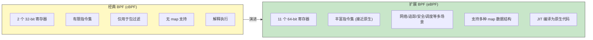
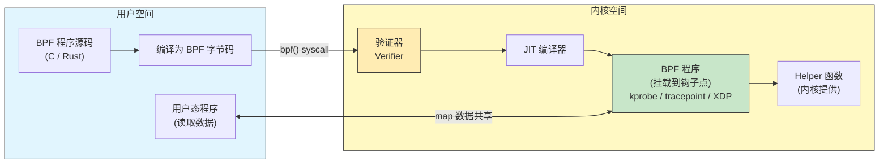
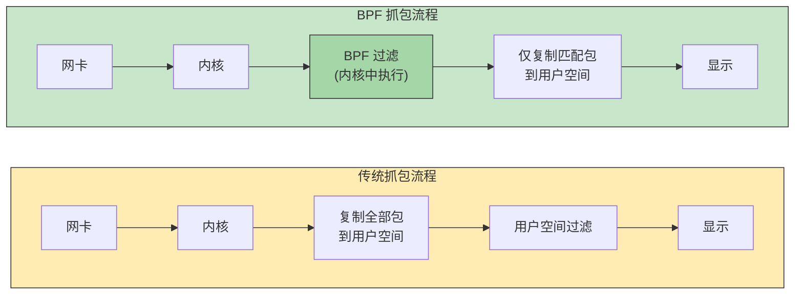

# 35 - BPF 与系统追踪

> eBPF 被称为 Linux 内核的"超能力"——它允许你在不修改内核源码、不加载内核模块的前提下，安全地在内核中运行自定义程序。从网络抓包到性能分析，从安全监控到故障排查，BPF/eBPF 已经成为现代 Linux 系统观测与追踪的核心技术栈。本章将从经典 BPF 讲起，深入 eBPF 架构，覆盖 tcpdump、perf、bpftrace 等核心工具的实战使用。

---

## 35.1 eBPF 概述

### 35.1.1 什么是 BPF/eBPF

BPF（Berkeley Packet Filter）最初于 1992 年被设计为一种高效的网络包过滤机制。eBPF（extended BPF）是其现代扩展，将 BPF 从单纯的包过滤器演化为一个通用的内核内虚拟机，可以在内核的各种钩子点运行用户自定义的沙箱程序。



### 35.1.2 从 cBPF 到 eBPF 的演进

| 特性 | cBPF (经典) | eBPF (扩展) |
|------|------------|-------------|
| 引入时间 | 1992 年 | 2014 年 (Linux 3.18) |
| 寄存器 | 2 个 32-bit (A, X) | 11 个 64-bit (R0-R10) |
| 指令宽度 | 32-bit | 64-bit |
| map 支持 | 无 | 哈希表、数组、栈等多种 |
| 调用约定 | 无函数调用 | 支持 helper 函数调用 |
| JIT | 部分架构 | 主流架构全部支持 |
| 使用场景 | 网络包过滤 | 追踪/网络/安全/调度 |
| 验证器 | 简单检查 | 全路径验证 |

### 35.1.3 eBPF 架构

eBPF 的核心架构由以下组件组成：



**验证器 (Verifier)**：确保 BPF 程序安全运行，不会崩溃内核：
- 检查所有路径是否终止（无无限循环）
- 验证内存访问边界
- 确保无未初始化变量使用
- 限制程序复杂度（指令数上限）

**JIT 编译器**：将 BPF 字节码编译为原生机器码，性能接近手写内核模块。

**Maps**：内核与用户空间之间共享数据的数据结构：

| Map 类型 | 说明 |
|---------|------|
| `BPF_MAP_TYPE_HASH` | 哈希表 |
| `BPF_MAP_TYPE_ARRAY` | 数组 |
| `BPF_MAP_TYPE_PERCPU_HASH` | 每 CPU 哈希表 |
| `BPF_MAP_TYPE_PERCPU_ARRAY` | 每 CPU 数组 |
| `BPF_MAP_TYPE_PERF_EVENT_ARRAY` | perf 事件缓冲区 |
| `BPF_MAP_TYPE_RINGBUF` | 环形缓冲区（推荐） |
| `BPF_MAP_TYPE_LRU_HASH` | LRU 淘汰哈希表 |
| `BPF_MAP_TYPE_STACK_TRACE` | 栈追踪 |
| `BPF_MAP_TYPE_LPM_TRIE` | 最长前缀匹配树 |

**Helper 函数**：内核提供给 BPF 程序调用的安全 API：

```c
// 常见 helper 函数
bpf_map_lookup_elem() // 查找 map 元素
bpf_map_update_elem() // 更新 map 元素
bpf_map_delete_elem() // 删除 map 元素
bpf_probe_read() // 安全读取内核内存
bpf_probe_read_user() // 安全读取用户空间内存
bpf_ktime_get_ns() // 获取内核时间戳
bpf_get_current_pid_tgid() // 获取当前 PID/TGID
bpf_get_current_comm() // 获取当前进程名
bpf_perf_event_output() // 向用户空间发送事件
bpf_ringbuf_output() // 通过 ringbuf 发送事件
bpf_trace_printk() // 调试输出到 trace_pipe
bpf_get_stackid() // 获取栈 ID
bpf_skb_load_bytes() // 从网络包读取数据
```

### 35.1.4 eBPF 程序类型

```
程序类型 挂载点 用途
────────────────────────────────────────────────────────
BPF_PROG_TYPE_KPROBE 内核函数入口/返回 动态追踪内核函数
BPF_PROG_TYPE_TRACEPOINT 内核静态追踪点 稳定的内核事件追踪
BPF_PROG_TYPE_RAW_TRACEPOINT 原始追踪点 低开销追踪
BPF_PROG_TYPE_PERF_EVENT perf 事件 性能计数器/采样
BPF_PROG_TYPE_XDP 网络设备驱动入口 高性能网络包处理
BPF_PROG_TYPE_SCHED_CLS TC 分类器 流量控制
BPF_PROG_TYPE_CGROUP_SKB cgroup 网络 cgroup 级网络过滤
BPF_PROG_TYPE_CGROUP_SOCK cgroup socket socket 级别控制
BPF_PROG_TYPE_LSM LSM 钩子 安全策略
BPF_PROG_TYPE_STRUCT_OPS 内核结构体操作 替换内核调度器等
BPF_PROG_TYPE_FENTRY 函数入口（BTF） 低开销函数追踪
BPF_PROG_TYPE_FEXIT 函数出口（BTF） 函数返回值追踪
```

### 35.1.5 为什么 eBPF 是 Linux 观测性的未来

1. **安全性**：验证器保证程序不会崩溃内核
2. **高性能**：JIT 编译，开销极低
3. **灵活性**：可编程，按需定制观测逻辑
4. **无需重启**：动态加载/卸载，无需重启内核
5. **生产就绪**：Google、Meta、Netflix 等大规模使用
6. **生态丰富**：bcc、bpftrace、Cilium、Falco 等工具链

---

## 35.2 BPF 与网络抓包

### 35.2.1 BPF 在网络抓包中的角色

BPF 最初就是为了高效过滤网络数据包而设计的。传统抓包需要将所有数据包从内核复制到用户空间再过滤，BPF 允许在内核中直接过滤，大幅减少复制开销。



### 35.2.2 BPF 过滤语法

BPF 过滤表达式是一种人类可读的语法，由 `libpcap` 库编译为 BPF 字节码：

```bash
# 基本语法元素
# 类型限定词：host, net, port, portrange
# 方向限定词：src, dst, src or dst, src and dst
# 协议限定词：ether, ip, ip6, arp, tcp, udp, icmp

# 过滤语法示例
host 192.168.1.1 # 源或目标为指定 IP
src host 10.0.0.1 # 源 IP
dst host 10.0.0.1 # 目标 IP
net 192.168.1.0/24 # 子网
port 80 # 源或目标端口
src port 443 # 源端口
portrange 8000-9000 # 端口范围
tcp # TCP 协议
udp # UDP 协议
icmp # ICMP 协议

# 逻辑组合
host 10.0.0.1 and port 80 # AND
host 10.0.0.1 or host 10.0.0.2 # OR
not port 22 # NOT
(host 10.0.0.1 or host 10.0.0.2) and port 80 # 括号分组
```

### 35.2.3 查看编译后的 BPF 字节码

```bash
# 使用 tcpdump -d 查看 BPF 指令
tcpdump -d 'tcp port 80'

# 输出示例：
# (000) ldh [12]
# (001) jeq #0x86dd jt 2 jf 8
# (002) ldb [20]
# (003) jeq #0x6 jt 4 jf 19
# ...
```

---

## 35.3 tcpdump 深入

### 35.3.1 安装与基本使用

```bash
# Arch Linux 安装
sudo pacman -S tcpdump

# 查看版本
tcpdump --version

# 列出可用网络接口
tcpdump -D
# 或
tcpdump --list-interfaces

# 基本抓包（需要 root 权限）
sudo tcpdump -i eth0

# 限制抓包数量
sudo tcpdump -i eth0 -c 100

# 不解析主机名（提高速度）
sudo tcpdump -i eth0 -n

# 不解析主机名和端口名
sudo tcpdump -i eth0 -nn

# 显示详细信息
sudo tcpdump -i eth0 -v # 详细
sudo tcpdump -i eth0 -vv # 更详细
sudo tcpdump -i eth0 -vvv # 最详细

# 显示数据包内容（十六进制 + ASCII）
sudo tcpdump -i eth0 -X

# 显示数据包内容（仅十六进制）
sudo tcpdump -i eth0 -xx

# 显示链路层头部
sudo tcpdump -i eth0 -e

# 设置抓包长度（snaplen）
sudo tcpdump -i eth0 -s 0 # 抓取完整包
sudo tcpdump -i eth0 -s 96 # 只抓前 96 字节

# 抓取所有接口
sudo tcpdump -i any
```

### 35.3.2 过滤表达式详解

```bash
# === 主机过滤 ===
sudo tcpdump -i eth0 host 192.168.1.100
sudo tcpdump -i eth0 src host 192.168.1.100
sudo tcpdump -i eth0 dst host 192.168.1.100

# === 网络过滤 ===
sudo tcpdump -i eth0 net 192.168.1.0/24
sudo tcpdump -i eth0 src net 10.0.0.0/8

# === 端口过滤 ===
sudo tcpdump -i eth0 port 80
sudo tcpdump -i eth0 src port 443
sudo tcpdump -i eth0 dst port 22
sudo tcpdump -i eth0 portrange 8000-9000

# === 协议过滤 ===
sudo tcpdump -i eth0 tcp
sudo tcpdump -i eth0 udp
sudo tcpdump -i eth0 icmp
sudo tcpdump -i eth0 arp
sudo tcpdump -i eth0 ip6

# === 组合过滤 ===
sudo tcpdump -i eth0 'host 10.0.0.1 and port 80'
sudo tcpdump -i eth0 'src host 10.0.0.1 and dst port 443'
sudo tcpdump -i eth0 'host 10.0.0.1 or host 10.0.0.2'
sudo tcpdump -i eth0 'not port 22'
sudo tcpdump -i eth0 'tcp and not port 22'
sudo tcpdump -i eth0 '(dst port 80 or dst port 443) and src net 192.168.0.0/16'
```

### 35.3.3 高级过滤

```bash
# === TCP 标志位过滤 ===
# TCP flags: FIN=0x01, SYN=0x02, RST=0x04, PSH=0x08, ACK=0x10, URG=0x20

# 只抓 SYN 包
sudo tcpdump -i eth0 'tcp[tcpflags] & tcp-syn != 0'
# 或
sudo tcpdump -i eth0 'tcp[13] & 2 != 0'

# 只抓 SYN 包（不含 SYN-ACK）
sudo tcpdump -i eth0 'tcp[tcpflags] == tcp-syn'

# 抓 SYN 和 SYN-ACK
sudo tcpdump -i eth0 'tcp[tcpflags] & tcp-syn != 0'

# 抓 RST 包
sudo tcpdump -i eth0 'tcp[tcpflags] & tcp-rst != 0'

# 抓 FIN 包
sudo tcpdump -i eth0 'tcp[tcpflags] & tcp-fin != 0'

# === VLAN 过滤 ===
sudo tcpdump -i eth0 'vlan 100'
sudo tcpdump -i eth0 'vlan and host 192.168.1.1'

# === 数据包大小过滤 ===
sudo tcpdump -i eth0 'greater 1000' # 大于 1000 字节
sudo tcpdump -i eth0 'less 100' # 小于 100 字节

# === 基于字节偏移的过滤 ===
# 过滤 HTTP GET 请求（TCP 载荷以 "GET " 开头）
sudo tcpdump -i eth0 'tcp[((tcp[12:1] & 0xf0) >> 2):4] = 0x47455420'

# 过滤 HTTP POST 请求
sudo tcpdump -i eth0 'tcp[((tcp[12:1] & 0xf0) >> 2):4] = 0x504f5354'
```

### 35.3.4 保存与读取 pcap 文件

```bash
# 保存抓包数据到文件
sudo tcpdump -i eth0 -w capture.pcap

# 限制文件大小（每 100MB 轮转）
sudo tcpdump -i eth0 -w capture-%Y%m%d%H%M%S.pcap -C 100

# 限制文件数量（保留最近 10 个文件）
sudo tcpdump -i eth0 -w capture.pcap -C 100 -W 10

# 按时间轮转（每 3600 秒 = 1 小时）
sudo tcpdump -i eth0 -w capture-%Y%m%d%H%M%S.pcap -G 3600

# 读取 pcap 文件
tcpdump -r capture.pcap

# 读取并过滤
tcpdump -r capture.pcap 'host 10.0.0.1 and port 80'

# 读取并统计
tcpdump -r capture.pcap -nn | wc -l
```

### 35.3.5 常用抓包场景

```bash
# === DNS 查询抓包 ===
sudo tcpdump -i eth0 -nn 'port 53'
# 更详细的 DNS 信息
sudo tcpdump -i eth0 -nn -vv 'port 53'

# === HTTP 流量 ===
sudo tcpdump -i eth0 -nn -A 'tcp port 80'

# === HTTPS 握手（TLS ClientHello）===
sudo tcpdump -i eth0 -nn 'tcp port 443 and (tcp[((tcp[12] & 0xf0) >> 2)] = 0x16)'

# === TCP 三次握手 ===
sudo tcpdump -i eth0 -nn 'tcp[tcpflags] & (tcp-syn|tcp-ack) != 0' -c 20

# === ICMP（ping）===
sudo tcpdump -i eth0 -nn 'icmp'

# === ARP ===
sudo tcpdump -i eth0 -nn 'arp'

# === SSH 流量（仅元数据）===
sudo tcpdump -i eth0 -nn 'tcp port 22' -c 50

# === 抓取特定进程的流量（结合 ss 获取端口）===
# 先查看进程端口
ss -tnp | grep nginx
# 然后抓包
sudo tcpdump -i eth0 -nn 'tcp port 80 or tcp port 443'

# === 排查网络不通问题 ===
sudo tcpdump -i eth0 -nn 'host 10.0.0.1' -e # 包含 MAC 地址
```

### 35.3.6 与 Wireshark/tshark 配合

```bash
# 安装 wireshark-cli（提供 tshark）
sudo pacman -S wireshark-cli

# tcpdump 抓包后用 tshark 分析
sudo tcpdump -i eth0 -w /tmp/capture.pcap -c 1000
tshark -r /tmp/capture.pcap

# 实时管道传输到 tshark
sudo tcpdump -i eth0 -U -w - | tshark -r -

# 远程抓包 + 本地 Wireshark 分析
ssh root@remote-server 'tcpdump -i eth0 -w - -c 500' > remote_capture.pcap
wireshark remote_capture.pcap

# tshark 常用分析命令
tshark -r capture.pcap -q -z conv,tcp # TCP 会话统计
tshark -r capture.pcap -q -z io,stat,1 # 每秒流量统计
tshark -r capture.pcap -q -z http,tree # HTTP 请求统计
tshark -r capture.pcap -q -z dns,tree # DNS 查询统计
tshark -r capture.pcap -Y 'http.request' # 显示 HTTP 请求
tshark -r capture.pcap -Y 'tcp.analysis.retransmission' # 重传包
```

### 35.3.7 性能注意事项

```bash
# 1. 使用 -n/-nn 避免 DNS 反查
sudo tcpdump -i eth0 -nn # 推荐

# 2. 限制抓包长度（如果不需要完整载荷）
sudo tcpdump -i eth0 -s 96 # 只抓头部

# 3. 使用 BPF 过滤减少内核到用户态的复制
sudo tcpdump -i eth0 'port 80' # 内核中过滤

# 4. 使用 -B 增大缓冲区（高流量场景）
sudo tcpdump -i eth0 -B 4096 # 4MB 缓冲区

# 5. 监控丢包
# tcpdump 退出时会显示：
# X packets captured
# Y packets received by filter
# Z packets dropped by kernel <-- 关注此数值

# 6. 高流量场景使用 -w 写入文件（而非实时输出到终端）
sudo tcpdump -i eth0 -w /tmp/capture.pcap -nn 'port 80'
```

---

## 35.4 perf 性能分析

### 35.4.1 perf 是什么

`perf` 是 Linux 内核自带的性能分析工具，基于内核的 `perf_events` 子系统，支持硬件性能计数器（PMU）、软件事件、追踪点等多种事件源。

### 35.4.2 安装

```bash
# Arch Linux 安装
sudo pacman -S perf

# 验证安装
perf version

# 查看可用事件
perf list

# 查看硬件事件
perf list hw

# 查看软件事件
perf list sw

# 查看追踪点
perf list tracepoint
```

### 35.4.3 perf stat（计数器统计）

```bash
# 统计命令的性能计数器
perf stat ls -la /

# 输出示例：
# Performance counter stats for 'ls -la /':
#
# 1.28 msec task-clock # 0.712 CPUs utilized
# 0 context-switches # 0.000 /sec
# 0 cpu-migrations # 0.000 /sec
# 115 page-faults # 89.844 K/sec
# 3329841 cycles # 2.601 GHz
# 2851193 instructions # 0.86 insn per cycle
# 593522 branches # 463.689 M/sec
# 21563 branch-misses # 3.63% of all branches

# 指定事件
perf stat -e cycles,instructions,cache-misses,cache-references ls

# 重复运行取平均值
perf stat -r 5 ./my_program

# 统计运行中的进程（5 秒）
perf stat -p $(pidof nginx) sleep 5

# 全系统统计（5 秒）
perf stat -a sleep 5

# 详细信息
perf stat -d ls # 更多事件
perf stat -dd ls # 更详细
perf stat -ddd ls # 最详细
```

### 35.4.4 perf record / perf report（采样分析）

```bash
# 采样分析（默认以 cycles 事件采样）
perf record ./my_program

# 指定采样频率（每秒 99 次采样，避免与时钟同步）
perf record -F 99 ./my_program

# 采样指定进程
perf record -p $(pidof nginx) sleep 30

# 全系统采样
perf record -a sleep 10

# 包含调用栈（使用 DWARF 回溯）
perf record -g ./my_program
perf record --call-graph dwarf ./my_program

# 包含调用栈（使用帧指针回溯，需要 -fno-omit-frame-pointer 编译）
perf record --call-graph fp ./my_program

# 查看报告
perf report

# 交互式 TUI 报告
perf report --tui

# 文本输出
perf report --stdio

# 按函数排序
perf report --sort=comm,dso,sym

# 显示调用图
perf report -g graph,0.5,caller
```

### 35.4.5 perf top（实时热点）

```bash
# 实时查看系统热点函数（类似 top）
sudo perf top

# 指定进程
sudo perf top -p $(pidof nginx)

# 指定事件
sudo perf top -e cache-misses

# 显示调用栈
sudo perf top -g
```

### 35.4.6 perf trace（系统调用跟踪）

```bash
# 类似 strace 但开销更低
perf trace ls

# 跟踪指定进程
perf trace -p $(pidof nginx)

# 只跟踪特定系统调用
perf trace -e open,read,write,close ls

# 显示调用耗时统计
perf trace --summary ls

# 跟踪指定 cgroup
perf trace --cgroup=docker/abc123 sleep 10
```

### 35.4.7 perf sched（调度器分析）

```bash
# 记录调度事件
perf sched record sleep 5

# 显示调度延迟
perf sched latency

# 显示调度地图
perf sched map

# 显示调度时间线
perf sched timehist

# 重放调度事件
perf sched replay
```

### 35.4.8 perf mem（内存访问分析）

```bash
# 记录内存访问事件（需要硬件支持）
perf mem record ./my_program

# 生成内存访问报告
perf mem report

# 分析内存加载延迟
perf mem record -t load ./my_program
perf mem report --sort=mem,sym,dso
```

### 35.4.9 火焰图生成

```bash
# 安装 FlameGraph 工具
git clone https://github.com/brendangregg/FlameGraph.git /opt/FlameGraph

# 步骤 1：采样
perf record -F 99 -g -a sleep 30

# 步骤 2：生成折叠栈
perf script | /opt/FlameGraph/stackcollapse-perf.pl > out.folded

# 步骤 3：生成火焰图 SVG
/opt/FlameGraph/flamegraph.pl out.folded > flamegraph.svg

# 一键生成
perf record -F 99 -g -a sleep 30 && \
 perf script | /opt/FlameGraph/stackcollapse-perf.pl | \
 /opt/FlameGraph/flamegraph.pl > flamegraph.svg

# 生成反向火焰图（冰柱图）
/opt/FlameGraph/flamegraph.pl --reverse out.folded > icicle.svg

# 差分火焰图（比较两次采样）
/opt/FlameGraph/difffolded.pl out1.folded out2.folded | \
 /opt/FlameGraph/flamegraph.pl > diff.svg
```

### 35.4.10 常见性能分析场景

```bash
# === CPU 瓶颈分析 ===
perf record -F 99 -g -p $(pidof my_app) sleep 30
perf report -g graph

# === 缓存命中率分析 ===
perf stat -e cache-references,cache-misses,L1-dcache-loads,L1-dcache-load-misses \
 ./my_program

# === 分支预测分析 ===
perf stat -e branches,branch-misses ./my_program

# === 上下文切换分析 ===
perf stat -e context-switches,cpu-migrations -p $(pidof my_app) sleep 10

# === 锁竞争分析 ===
perf lock record ./my_program
perf lock report

# === NUMA 分析 ===
perf stat -e node-loads,node-load-misses,node-stores,node-store-misses ./my_program
```

---

## 35.5 bpftrace 详解

### 35.5.1 什么是 bpftrace

`bpftrace` 是一种高级 eBPF 追踪语言和工具，灵感来自 awk 和 DTrace。它允许用简洁的一行命令或脚本编写内核/用户空间追踪程序，非常适合快速诊断和探索。

### 35.5.2 安装

```bash
# Arch Linux 安装
sudo pacman -S bpftrace

# 验证安装
bpftrace --version

# 列出所有探针
sudo bpftrace -l

# 搜索特定探针
sudo bpftrace -l 'tracepoint:syscalls:sys_enter_*'
sudo bpftrace -l 'kprobe:tcp_*'
```

### 35.5.3 语法基础

bpftrace 程序的基本结构：

```
probe /filter/ { action }
```

```
BEGIN { # 程序开始时执行
 printf("开始追踪...\n");
}

probe /条件/ { # 当探针触发且条件为真时执行
 @map[key] = value; # map 操作
 printf("...\n"); # 输出
}

END { # 程序结束时执行（Ctrl-C）
 printf("追踪结束。\n");
}
```

### 35.5.4 内置变量

| 变量 | 说明 |
|------|------|
| `pid` | 进程 ID |
| `tid` | 线程 ID |
| `uid` | 用户 ID |
| `gid` | 组 ID |
| `nsecs` | 纳秒时间戳 |
| `elapsed` | 自 bpftrace 启动后的纳秒数 |
| `cpu` | 当前 CPU 编号 |
| `comm` | 进程名 |
| `kstack` | 内核栈追踪 |
| `ustack` | 用户空间栈追踪 |
| `arg0..argN` | 探针函数参数 |
| `retval` | 函数返回值（kretprobe/uretprobe） |
| `args` | 追踪点参数结构体（tracepoint） |
| `curtask` | 当前 task_struct 指针 |
| `cgroup` | 当前 cgroup ID |

### 35.5.5 探针类型

```bash
# === kprobe / kretprobe ===
# 动态内核函数追踪
sudo bpftrace -e 'kprobe:do_sys_openat2 { printf("%s opened a file\n", comm); }'
sudo bpftrace -e 'kretprobe:do_sys_openat2 { printf("返回值: %d\n", retval); }'

# === tracepoint ===
# 稳定的内核追踪点
sudo bpftrace -e 'tracepoint:syscalls:sys_enter_openat { printf("%s %s\n", comm, str(args.filename)); }'

# === usdt ===
# 用户态静态定义追踪点
sudo bpftrace -e 'usdt:/usr/lib/libc.so.6:* { printf("%s\n", probe); }'

# === profile ===
# 定时采样
sudo bpftrace -e 'profile:hz:99 { @[kstack] = count(); }'

# === interval ===
# 定时输出
sudo bpftrace -e 'interval:s:1 { printf("每秒触发\n"); }'

# === software ===
# 软件事件
sudo bpftrace -e 'software:page-faults:1 { @[comm] = count(); }'

# === hardware ===
# 硬件性能计数器
sudo bpftrace -e 'hardware:cache-misses:1000 { @[comm] = count(); }'

# === fentry / fexit（BTF，推荐） ===
sudo bpftrace -e 'fentry:do_sys_openat2 { printf("%s\n", comm); }'
```

### 35.5.6 Map 操作

```bash
# === 计数 ===
# 统计各进程系统调用次数
sudo bpftrace -e 'tracepoint:raw_syscalls:sys_enter { @[comm] = count(); }'

# === 求和 ===
sudo bpftrace -e 'tracepoint:block:block_rq_complete { @bytes[comm] = sum(args.nr_sector * 512); }'

# === 最大/最小/平均 ===
sudo bpftrace -e 'kprobe:vfs_read { @size[comm] = stats(arg2); }'

# === 直方图 ===
# 读取大小分布（2 的幂次直方图）
sudo bpftrace -e 'kretprobe:vfs_read /retval > 0/ { @size = hist(retval); }'

# 线性直方图
sudo bpftrace -e 'kretprobe:vfs_read /retval > 0/ { @size = lhist(retval, 0, 10000, 1000); }'

# === 删除 map ===
sudo bpftrace -e 'kprobe:vfs_read { @start[tid] = nsecs; }
 kretprobe:vfs_read /@start[tid]/ { @us = hist((nsecs - @start[tid]) / 1000); delete(@start[tid]); }'
```

### 35.5.7 单行命令实战集

```bash
# === 追踪文件打开 ===
sudo bpftrace -e 'tracepoint:syscalls:sys_enter_openat { printf("%-6d %-16s %s\n", pid, comm, str(args.filename)); }'

# === 追踪进程创建 ===
sudo bpftrace -e 'tracepoint:syscalls:sys_enter_execve { printf("%-6d %s", pid, str(args.filename));
 join(args.argv); }'

# === 追踪进程退出 ===
sudo bpftrace -e 'tracepoint:sched:sched_process_exit { printf("%-6d %-16s 退出\n", pid, comm); }'

# === 追踪 TCP 连接（主动连接）===
sudo bpftrace -e 'kprobe:tcp_connect { $sk = (struct sock *)arg0;
 printf("%-6d %-16s → %s:%d\n", pid, comm,
 ntop($sk->__sk_common.skc_daddr), $sk->__sk_common.skc_dport); }'

# === 追踪 TCP 接受连接 ===
sudo bpftrace -e 'kretprobe:inet_csk_accept { $sk = (struct sock *)retval;
 printf("%-6d %-16s ← %s:%d\n", pid, comm,
 ntop($sk->__sk_common.skc_daddr), $sk->__sk_common.skc_num); }'

# === 追踪磁盘 I/O ===
sudo bpftrace -e 'tracepoint:block:block_rq_issue { printf("%-6d %-16s %s %d\n",
 pid, comm, args.rwbs, args.nr_sector * 512); }'

# === I/O 延迟直方图 ===
sudo bpftrace -e 'tracepoint:block:block_rq_issue { @start[args.dev, args.sector] = nsecs; }
 tracepoint:block:block_rq_complete /@start[args.dev, args.sector]/ {
 @usecs = hist((nsecs - @start[args.dev, args.sector]) / 1000);
 delete(@start[args.dev, args.sector]); }'

# === 追踪系统调用延迟 ===
sudo bpftrace -e 'tracepoint:raw_syscalls:sys_enter { @start[tid] = nsecs; }
 tracepoint:raw_syscalls:sys_exit /@start[tid]/ {
 @ns[comm] = hist(nsecs - @start[tid]); delete(@start[tid]); }'

# === 统计每秒系统调用次数 ===
sudo bpftrace -e 'tracepoint:raw_syscalls:sys_enter { @syscalls = count(); }
 interval:s:1 { print(@syscalls); clear(@syscalls); }'

# === 内存分配追踪 ===
sudo bpftrace -e 'tracepoint:kmem:kmalloc { @bytes[comm] = sum(args.bytes_alloc); }'

# === 文件系统延迟 ===
sudo bpftrace -e 'kprobe:vfs_read { @start[tid] = nsecs; }
 kretprobe:vfs_read /@start[tid]/ {
 @us[comm] = hist((nsecs - @start[tid]) / 1000); delete(@start[tid]); }'

# === CPU 运行队列延迟 ===
sudo bpftrace -e 'tracepoint:sched:sched_wakeup { @qstart[args.pid] = nsecs; }
 tracepoint:sched:sched_switch {
 if (@qstart[args.next_pid]) {
 @usecs = hist((nsecs - @qstart[args.next_pid]) / 1000);
 delete(@qstart[args.next_pid]); } }'

# === 页面错误统计 ===
sudo bpftrace -e 'software:page-faults:1 { @[comm] = count(); }'

# === 信号追踪 ===
sudo bpftrace -e 'tracepoint:signal:signal_generate {
 printf("%-6d %-16s → %-6d signal %d\n", pid, comm, args.pid, args.sig); }'
```

### 35.5.8 编写 bpftrace 脚本

```bash
#!/usr/bin/env bpftrace
// tcp_life.bt - 追踪 TCP 连接生命周期

BEGIN
{
 printf("%-8s %-6s %-16s %-4s ", "TIME", "PID", "COMM", "IP");
 printf("%-15s %-5s %-15s %-5s %-6s\n",
 "SADDR", "SPORT", "DADDR", "DPORT", "MS");
}

kprobe:tcp_set_state
{
 $sk = (struct sock *)arg0;
 $newstate = arg1;

 if ($newstate == 7) { // TCP_CLOSE
 $lport = $sk->__sk_common.skc_num;
 $dport = $sk->__sk_common.skc_dport;
 $saddr = ntop($sk->__sk_common.skc_rcv_saddr);
 $daddr = ntop($sk->__sk_common.skc_daddr);

 printf("%-8d %-6d %-16s %-4s ", elapsed / 1000000, pid, comm, "4");
 printf("%-15s %-5d %-15s %-5d\n", $saddr, $lport, $daddr, $dport);
 }
}
```

保存并运行：

```bash
sudo bpftrace tcp_life.bt
```

### 35.5.9 与 bcc 工具集对比

| 特性 | bpftrace | bcc |
|------|----------|-----|
| 语言 | 专用高级语言 | Python / C |
| 适合场景 | 快速诊断、一行命令 | 复杂工具、生产级 |
| 学习曲线 | 低 | 中等 |
| 灵活性 | 中等 | 高 |
| 工具集 | 较少内置工具 | 80+ 现成工具 |
| 安装 | `pacman -S bpftrace` | `pacman -S bcc bcc-tools python-bcc` |

```bash
# 安装 bcc 工具集
sudo pacman -S bcc bcc-tools python-bcc

# 常用 bcc 工具
sudo /usr/share/bcc/tools/execsnoop # 追踪进程执行
sudo /usr/share/bcc/tools/opensnoop # 追踪文件打开
sudo /usr/share/bcc/tools/biolatency # 块 I/O 延迟直方图
sudo /usr/share/bcc/tools/biosnoop # 块 I/O 追踪
sudo /usr/share/bcc/tools/tcpconnect # 追踪 TCP 主动连接
sudo /usr/share/bcc/tools/tcpaccept # 追踪 TCP 被动连接
sudo /usr/share/bcc/tools/tcplife # TCP 连接生命周期
sudo /usr/share/bcc/tools/runqlat # CPU 运行队列延迟
sudo /usr/share/bcc/tools/profile # CPU 采样火焰图数据
sudo /usr/share/bcc/tools/cachestat # 页缓存命中率
sudo /usr/share/bcc/tools/filetop # 文件 I/O 排行
```

---

## 35.6 其他追踪工具

### 35.6.1 ftrace（内核 function tracer）

```bash
# ftrace 通过 tracefs 文件系统操作
# 挂载点：/sys/kernel/tracing 或 /sys/kernel/debug/tracing

# 查看可用追踪器
cat /sys/kernel/tracing/available_tracers
# 输出：hwlat blk mmiotrace function_graph wakeup_dl wakeup_rt wakeup function nop

# === 函数追踪 ===
# 启用 function tracer
echo function > /sys/kernel/tracing/current_tracer
echo 1 > /sys/kernel/tracing/tracing_on

# 查看追踪输出
cat /sys/kernel/tracing/trace

# 停止追踪
echo 0 > /sys/kernel/tracing/tracing_on

# 只追踪特定函数
echo 'do_sys_openat2' > /sys/kernel/tracing/set_ftrace_filter
echo function > /sys/kernel/tracing/current_tracer
echo 1 > /sys/kernel/tracing/tracing_on

# 清除过滤器
echo > /sys/kernel/tracing/set_ftrace_filter

# === 函数图追踪（显示调用关系）===
echo function_graph > /sys/kernel/tracing/current_tracer
echo 1 > /sys/kernel/tracing/tracing_on
cat /sys/kernel/tracing/trace

# 恢复默认
echo nop > /sys/kernel/tracing/current_tracer
```

### 35.6.2 trace-cmd

```bash
# 安装
sudo pacman -S trace-cmd

# trace-cmd 是 ftrace 的前端工具

# 记录所有事件
sudo trace-cmd record -e all sleep 5

# 记录特定事件
sudo trace-cmd record -e sched_switch -e sched_wakeup sleep 5

# 记录函数追踪
sudo trace-cmd record -p function -l 'tcp_*' sleep 5

# 查看报告
trace-cmd report

# 实时追踪
sudo trace-cmd stream -e sched_switch

# 生成延迟分析
sudo trace-cmd record -p function_graph -l 'do_sys_openat2' sleep 5
trace-cmd report
```

### 35.6.3 strace / ltrace

```bash
# 安装
sudo pacman -S strace ltrace

# === strace：系统调用追踪 ===
# 追踪命令的系统调用
strace ls

# 只追踪特定系统调用
strace -e trace=open,read,write ls

# 分类过滤
strace -e trace=network curl -s https://example.com
strace -e trace=file ls
strace -e trace=process bash -c 'echo hello'
strace -e trace=memory ls
strace -e trace=signal ls

# 追踪正在运行的进程
strace -p $(pidof nginx)

# 显示时间戳
strace -t ls # 时:分:秒
strace -tt ls # 微秒精度
strace -T ls # 显示每个系统调用耗时

# 统计系统调用
strace -c ls

# 跟踪子进程
strace -f bash -c 'ls; pwd'

# 输出到文件
strace -o /tmp/strace.log ls

# === ltrace：库函数调用追踪 ===
ltrace ls
ltrace -e malloc+free ls
ltrace -c ls # 统计
```

### 35.6.4 SystemTap

```bash
# SystemTap 在 Arch 上不如 bpftrace 流行，但仍可用
# 需要安装 AUR 包
# yay -S systemtap

# SystemTap 脚本示例
# probe begin { println("hello") }
# probe syscall.open { printf("%s(%d) open\n", execname(), pid()) }
# probe end { println("bye") }

# 对于 Arch Linux，推荐使用 bpftrace 替代 SystemTap
```

---

## 35.7 实战综合案例

### 35.7.1 案例一：诊断 Web 应用响应慢

```bash
# 步骤 1：确认 CPU 是否繁忙
perf stat -p $(pidof node) sleep 10

# 步骤 2：CPU 采样生成火焰图
perf record -F 99 -g -p $(pidof node) sleep 30
perf script | /opt/FlameGraph/stackcollapse-perf.pl | /opt/FlameGraph/flamegraph.pl > node_flame.svg

# 步骤 3：追踪网络延迟
sudo bpftrace -e 'kprobe:tcp_sendmsg { @start[tid] = nsecs; }
 kretprobe:tcp_sendmsg /@start[tid]/ {
 @us[comm] = hist((nsecs - @start[tid]) / 1000); delete(@start[tid]); }'

# 步骤 4：检查磁盘 I/O
sudo bpftrace -e 'tracepoint:block:block_rq_issue /comm == "node"/ {
 printf("%-6d %s %d bytes\n", pid, args.rwbs, args.nr_sector * 512); }'

# 步骤 5：检查系统调用延迟
perf trace --summary -p $(pidof node) sleep 10
```

### 35.7.2 案例二：追踪文件被谁修改

```bash
# 使用 bpftrace 追踪特定文件的写入
sudo bpftrace -e 'tracepoint:syscalls:sys_enter_openat
 /str(args.filename) == "/etc/passwd"/ {
 printf("%-6d %-16s 打开了 /etc/passwd flags=%d\n", pid, comm, args.flags); }'

# 追踪所有写入 /etc 目录的操作
sudo bpftrace -e 'tracepoint:syscalls:sys_enter_openat
 /strncmp(str(args.filename), "/etc/", 5) == 0 && (args.flags & 1)/ {
 printf("%-6d %-16s %s\n", pid, comm, str(args.filename)); }'
```

### 35.7.3 案例三：网络连接问题排查

```bash
# 步骤 1：用 tcpdump 抓包
sudo tcpdump -i eth0 -nn 'host 10.0.0.50 and tcp' -w /tmp/debug.pcap -c 1000

# 步骤 2：分析 TCP 重传
tshark -r /tmp/debug.pcap -Y 'tcp.analysis.retransmission' -T fields \
 -e frame.time -e ip.src -e ip.dst -e tcp.srcport -e tcp.dstport

# 步骤 3：追踪 TCP 重传事件
sudo bpftrace -e 'tracepoint:tcp:tcp_retransmit_skb {
 printf("%-8d %-16s %s:%d → %s:%d state=%d\n",
 pid, comm, ntop(args.saddr), args.sport, ntop(args.daddr), args.dport, args.state); }'

# 步骤 4：追踪 TCP 连接状态变化
sudo bpftrace -e 'tracepoint:sock:inet_sock_set_state {
 printf("%-16s %-6d %s:%d → %s:%d %d → %d\n",
 comm, pid, ntop(args.saddr), args.sport,
 ntop(args.daddr), args.dport, args.oldstate, args.newstate); }'

# 步骤 5：检查连接队列溢出
sudo bpftrace -e 'tracepoint:tcp:tcp_drop {
 printf("TCP drop: %s:%d → %s:%d\n",
 ntop(args.saddr), args.sport, ntop(args.daddr), args.dport); }'
```

### 35.7.4 案例四：内存泄漏排查

```bash
# 使用 bcc 的 memleak 工具
sudo /usr/share/bcc/tools/memleak -p $(pidof my_app)

# 使用 bpftrace 追踪 malloc/free
sudo bpftrace -e '
uprobe:/usr/lib/libc.so.6:malloc { @allocs[comm, ustack] = count(); @bytes[comm] = sum(arg0); }
uprobe:/usr/lib/libc.so.6:free { @frees[comm] = count(); }
interval:s:5 { print(@bytes); }'

# perf 追踪页面错误
perf record -e page-faults -g -p $(pidof my_app) sleep 30
perf report
```

### 35.7.5 工具选择指南

```
需求 推荐工具
──────────────────────────────────────────────
快速网络抓包 tcpdump
深入协议分析 tshark / Wireshark
CPU 热点函数 perf record + 火焰图
系统调用追踪（简单） strace
系统调用追踪（高性能） perf trace
一行命令内核追踪 bpftrace
复杂追踪工具开发 bcc (Python + C)
内核函数调用图 ftrace / trace-cmd
实时系统性能概览 perf top
定制化内核观测 eBPF (libbpf + CO-RE)
```

---

> **小结**：BPF/eBPF 生态已经成为 Linux 系统观测的事实标准。掌握 tcpdump 用于网络排查，perf 用于性能分析，bpftrace 用于灵活追踪——这三者的组合能覆盖绝大多数生产环境中的诊断需求。建议在 Arch Linux 上安装 `perf bpftrace bcc-tools tcpdump wireshark-cli` 组成完整的工具箱。

---

