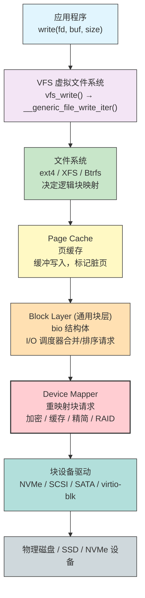
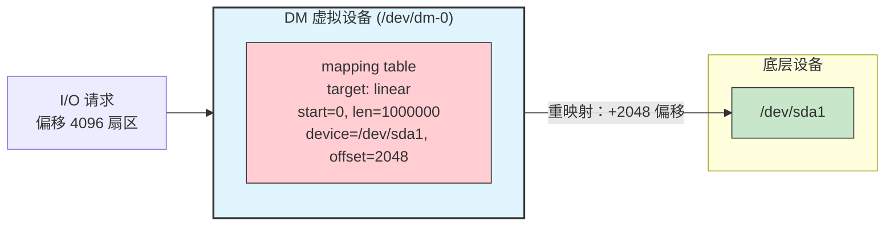
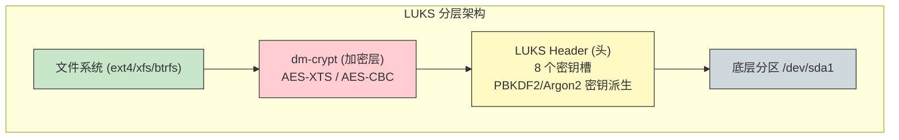
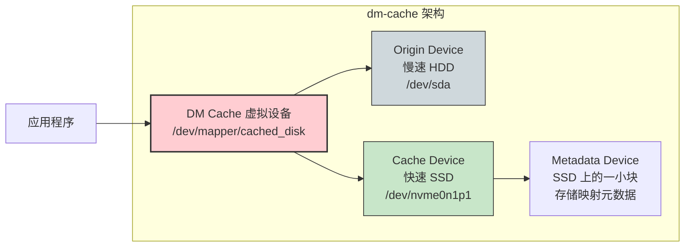
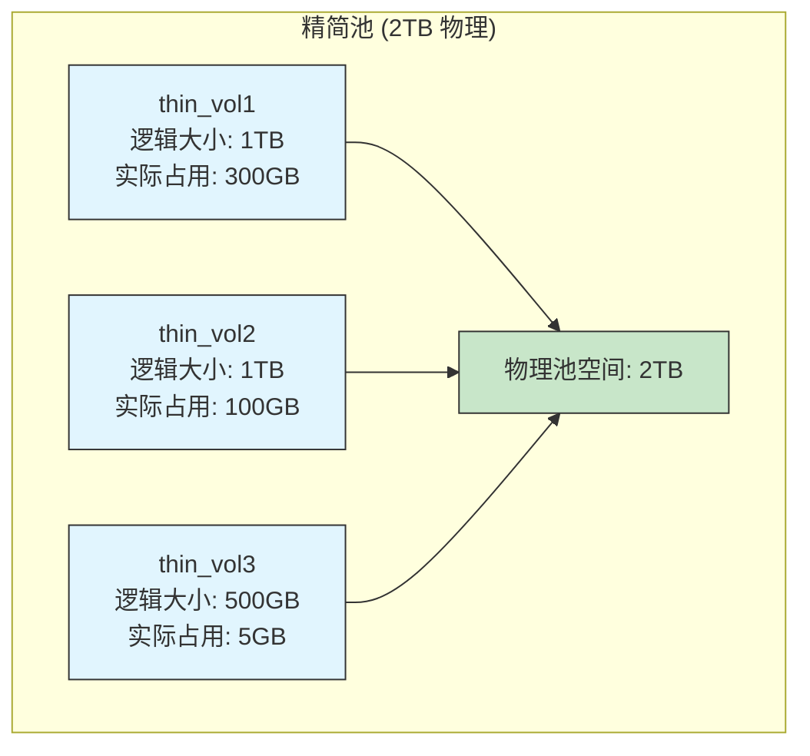
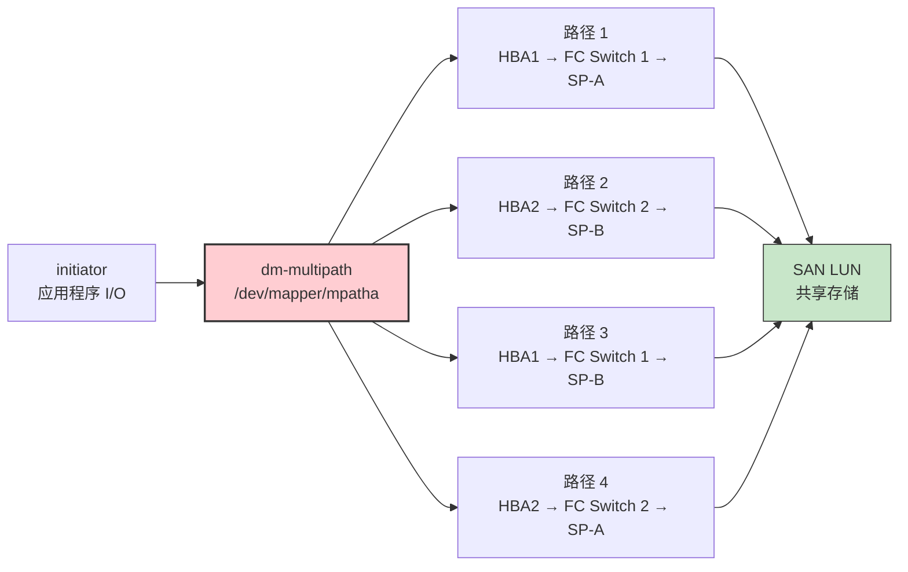
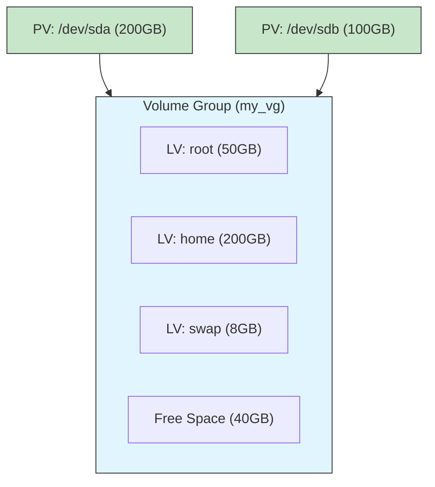

# 52 - Device Mapper 与存储栈

> Linux 的存储栈是操作系统中层级最丰富的子系统之一：从应用程序的 `write()` 调用，到 VFS 层找到 inode，到文件系统决定块分配，到块层合并请求，直到 Device Mapper 进行重映射——每一步都在为最终的磁盘写入铺路。Device Mapper（DM）是这个栈中一座关键的桥梁，它的"任意块设备到任意块设备"映射能力，使得块设备加密、缓存、精简配置、RAID、多路径等高级功能得以模块化组合。本章从存储栈全景讲起，深入 Device Mapper 原理，逐一解构 dm-crypt、dm-cache、dm-thin、dm-raid、dm-multipath 和 dm-verity，并介绍其上的 LVM2 抽象层与实战操作。

---

## 52.1 Linux 存储栈概览

### 52.1.1 从 write() 到磁盘



### 52.1.2 各层职责

| 层级 | 数据结构 | 主要职责 |
|------|---------|---------|
| **VFS** | `file`, `dentry`, `inode` | 统一 POSIX 文件操作接口，路径解析，权限检查 |
| **文件系统** | `ext4_inode`, `xfs_bmap` | 文件→逻辑块映射，日志，写时复制 |
| **Page Cache** | `page`, `folio` | 缓冲 I/O，预读，回写调度 |
| **块层** | `bio` | 扇区级 I/O 请求构造，合并调度，统计 |
| **Device Mapper** | `dm_target` | 块设备重映射：加密/缓存/精简/RAID/多路径 |
| **驱动层** | SCSI command, NVMe SQ | 硬件协议封装，中断处理，DMA |

### 52.1.3 块设备层次的可视化命令

```bash
# lsblk：文件系统无关的块设备树，直观展示 Device Mapper 的层次结构
lsblk
# NAME        MAJ:MIN RM   SIZE RO TYPE  MOUNTPOINTS
# nvme0n1     259:0    0 953.9G  0 disk
# ├─nvme0n1p1 259:1    0   512M  0 part  /boot
# ├─nvme0n1p2 259:2    0 953.4G  0 part
# │ └─luks    254:0    0 953.4G  0 crypt  ← dm-crypt 设备
# │   └─vg0-root 254:1  0   100G  0 lvm   /    ← LVM 逻辑卷
# └─nvme0n1p3 259:3    0     8G  0 part  [SWAP]

# 查看设备映射关系
lsblk -o NAME,TYPE,FSTYPE,MOUNTPOINTS,SIZE,MAJ:MIN

# dmsetup：Device Mapper 专用工具
sudo dmsetup ls           # 列出所有 DM 设备
sudo dmsetup table        # 列出每个 DM 设备的映射表
sudo dmsetup info luks    # 查看特定 DM 设备的信息

# 查看块设备和 DM 设备的主次编号
ls -la /dev/mapper/
# lrwxrwxrwx 1 root root 7 Jul 24 12:00 luks -> ../dm-0
# lrwxrwxrwx 1 root root 7 Jul 24 12:00 vg0-root -> ../dm-1

# 查看 I/O 统计
cat /sys/block/dm-0/stat  # DM 设备的 I/O 统计
```

---

## 52.2 Device Mapper 框架原理

### 52.2.1 什么是 Device Mapper

Device Mapper（DM）是 Linux 内核中一个通用的块设备映射框架。它将一个虚拟块设备划分为扇区分块，通过**映射表**函数将每个 I/O 请求重定向到真实的底层设备。



### 52.2.2 映射目标（Target Types）

每个 DM 设备由一个或多个 target 定义。每个 target 代表一种转换类型：

```
Target 类型            用途                         对应工具
────────────────────────────────────────────────────────────
linear                  线性映射（1:1 偏移映射）          LVM
stripe                  条带化（RAID 0）                  LVM
mirror                  镜像（RAID 1）                    LVM
snapshot                快照                          LVM, dmsetup
snapshot-origin         快照源                        LVM
snapshot-merge          快照合并                        LVM
thin-pool               精简池                        LVM, dmsetup
thin                    精简卷                        LVM, dmsetup
crypt                   块加密 (dm-crypt)              cryptsetup
cache                   SSD 缓存 (dm-cache)           lvmcache
writecache              写回缓存 (dm-writecache)       lvmcache
verity                  只读完整性验证 (dm-verity)       veritysetup
integrity               读写完整性保护 (dm-integrity)    integritysetup
delay                   延迟注入（测试用）               dmsetup
error                   错误注入（测试用）               dmsetup
zero                    零块设备返回全零                 dmsetup
multipath               多路径 I/O                     multipathd
raid                    软件 RAID (dm-raid)            mdadm, lvm
```

### 52.2.3 dmsetup 底层操作

```bash
# dmsetup 直接操作 DM 设备，不经过 LVM 封装
# 创建简单的 linear 映射设备

# 1. 创建回环文件作为底层存储
dd if=/dev/zero of=/tmp/dm_test_backing bs=1M count=100
LOOP=$(sudo losetup -f --show /tmp/dm_test_backing)

# 2. 创建 DM 设备（手动指定映射表）
# 映射表格式：<start_sector> <num_sectors> <target_type> <target_params>
# 示例：0 204800 linear /dev/loopX 0
#       从扇区 0 开始，204800 个扇区（100MB），linear 映射到 loop 设备的扇区 0
echo "0 204800 linear $LOOP 0" | sudo dmsetup create dm_test

# 3. 查看创建的设备
sudo dmsetup ls            # dm_test 会出现在列表中
sudo dmsetup table dm_test  # 查看映射表
ls -la /dev/mapper/dm_test
sudo lsblk /dev/mapper/dm_test

# 4. 创建文件系统并挂载
sudo mkfs.ext4 /dev/mapper/dm_test
sudo mount /dev/mapper/dm_test /mnt/test
df -h /mnt/test

# 5. 移除
sudo umount /mnt/test
sudo dmsetup remove dm_test
sudo losetup -d $LOOP
rm /tmp/dm_test_backing
```

---

## 52.3 dm-crypt：全盘加密与 LUKS

### 52.3.1 LUKS 架构

LUKS（Linux Unified Key Setup）是建立在 dm-crypt 之上的加密规范，提供密钥管理和多密钥槽功能。



### 52.3.2 实战：创建 LUKS 加密卷

```bash
# === 步骤 1：格式化分区为 LUKS 加密卷 ===
# 警告：此操作会销毁分区上的所有数据！
sudo cryptsetup luksFormat /dev/sdb1

# LUKS2 格式（推荐）
sudo cryptsetup luksFormat --type luks2 /dev/sdb1

# 指定加密算法和密钥派生函数
sudo cryptsetup luksFormat --type luks2 \
  --cipher aes-xts-plain64 \
  --key-size 512 \
  --hash sha512 \
  --pbkdf argon2id \
  --iter-time 5000 \
  /dev/sdb1

# === 步骤 2：打开加密卷 ===
sudo cryptsetup open /dev/sdb1 my_encrypted_volume
# 此命令会创建 /dev/mapper/my_encrypted_volume

# 验证
sudo dmsetup table my_encrypted_volume
lsblk | grep my_encrypted

# === 步骤 3：创建文件系统 ===
sudo mkfs.ext4 /dev/mapper/my_encrypted_volume

# === 步骤 4：挂载使用 ===
sudo mount /dev/mapper/my_encrypted_volume /mnt/secure

# 检查加密卷状态
sudo cryptsetup status my_encrypted_volume
# 输出：
# /dev/mapper/my_encrypted_volume is active.
#   type:    LUKS2
#   cipher:  aes-xts-plain64
#   keysize: 512 bits
#   device:  /dev/sdb1
```

### 52.3.3 LUKS 密钥管理

```bash
# === 查看 LUKS 头信息 ===
sudo cryptsetup luksDump /dev/sdb1
# 显示密钥槽占用情况、加密参数等

# === 添加新密钥（需要提供现有密钥） ===
sudo cryptsetup luksAddKey /dev/sdb1
# 交互式输入现有密码，然后输入新密码

# 从文件添加密钥（用于自动挂载脚本）
echo -n "strong-key-material" | sudo cryptsetup luksAddKey /dev/sdb1 --key-file=-
# 生成随机密钥文件
sudo dd if=/dev/urandom of=/etc/cryptkey bs=32 count=1
sudo cryptsetup luksAddKey /dev/sdb1 /etc/cryptkey

# === 删除密钥 ===
sudo cryptsetup luksRemoveKey /dev/sdb1     # 交互式删除
sudo cryptsetup luksKillSlot /dev/sdb1 2   # 删除指定密钥槽

# === 修改密码 ===
sudo cryptsetup luksChangeKey /dev/sdb1    # 交互式修改

# === 安全擦除 LUKS 头（紧急销毁数据） ===
# 极端危险操作！擦除后数据将无法恢复
sudo cryptsetup luksErase /dev/sdb1
```

### 52.3.4 LUKS 加密卷的持久化挂载

```bash
# /etc/crypttab 配置：系统启动时自动解锁加密卷
sudo tee -a /etc/crypttab <<'EOF'
# <映射名>  <设备>        <密钥文件>  <选项>
my_crypt    /dev/sdb1      /etc/cryptkey    luks,discard
EOF

# /etc/fstab 配置：解锁后自动挂载
sudo tee -a /etc/fstab <<'EOF'
/dev/mapper/my_crypt  /mnt/secure  ext4  defaults,noatime  0  2
EOF

# 重新加载 systemd cryptsetup 服务
sudo systemctl daemon-reload
sudo systemctl start systemd-cryptsetup@my_crypt
```

### 52.3.5 加密性能注意事项

```bash
# 查看 CPU 是否支持 AES-NI（硬件加速加密）
grep -o "aes" /proc/cpuinfo | head -5

# 检测加密卷的 I/O 性能
sudo cryptsetup benchmark
# 输出各密码算法和模式的吞吐量

# 示例输出：
# aes-xts  256b  1500.0 MiB/s
# aes-xts  512b  1200.0 MiB/s

# 对已打开的加密卷进行性能测试
sudo dd if=/dev/zero of=/dev/mapper/my_crypt bs=1M count=1024 oflag=direct
```

> 拥有 AES-NI 指令集的 CPU 下，AES-XTS 加密的吞吐损失通常在 5-10% 以内。不具备硬件加速的系统加密性能下降可能超过 50%。详见 [[26-系统安全加固与审计]] 中的 dm-verity 部分。

---

## 52.4 dm-cache：SSD 加速 HDD

### 52.4.1 dm-cache 工作原理

dm-cache 将快速设备（SSD/NVMe）作为慢速设备（HDD）的缓存层，提供三种缓存策略：

```
策略          写入行为                         适用场景
──────────────────────────────────────────────────────────
writeback     先写 SSD，异步回写 HDD             写入密集型
writethrough  同时写入 SSD 和 HDD                数据安全性优先
writearound   绕过 SSD 直写 HDD，仅缓存读          大文件流式写入
passthrough   绕过缓存（维护/降级模式）            故障时临时用
```



### 52.4.2 使用 lvmcache 创建 dm-cache

```bash
# 通过 LVM 使用 dm-cache 是最简单的方式（lvmcache 封装了底层 dm-cache）

# 创建 PV
sudo pvcreate /dev/sda /dev/nvme0n1

# 创建 VG
sudo vgcreate my_vg /dev/sda /dev/nvme0n1

# 在慢速设备上创建 LV（数据卷）
sudo lvcreate -n data_lv -L 500G my_vg /dev/sda

# 在快速设备上创建 LV（缓存卷）
sudo lvcreate -n cache_lv -L 50G my_vg /dev/nvme0n1

# 在快速设备上创建 LV（缓存元数据卷，约缓存大小的千分之一）
sudo lvcreate -n cache_meta -L 1G my_vg /dev/nvme0n1

# 创建缓存池
sudo lvconvert --type cache-pool --poolmetadata my_vg/cache_meta my_vg/cache_lv

# 将缓存池附加到数据卷
sudo lvconvert --type cache --cachepool my_vg/cache_lv my_vg/data_lv

# 查看缓存状态
sudo lvs -a my_vg
# LV         VG    Attr       LSize  Pool       Origin   Cachemode
# data_lv    my_vg Cwi-aocC-- 500.00g [cache_lv] [data_lv_corig] writethrough

# 修改缓存模式
sudo lvchange --cachemode writeback my_vg/data_lv

# 分离缓存
sudo lvconvert --splitcache my_vg/data_lv
```

---

## 52.5 dm-thin：精简配置

### 52.5.1 精简配置的概念

传统存储中，LV 创建时就占用了全部物理空间。精简配置（Thin Provisioning）允许创建超过物理容量的虚拟卷，仅在数据写入时分配空间。



### 52.5.2 实战：LVM 精简配置

```bash
# === 创建精简池 ===
sudo vgcreate thin_vg /dev/sdb

# 创建精简数据 LV（物理容量）
sudo lvcreate -n thinpool_data -L 20G thin_vg

# 创建精简元数据 LV（约为数据卷的千分之一到百分之一）
sudo lvcreate -n thinpool_meta -L 500M thin_vg

# 将两者合并为精简池
sudo lvconvert --type thin-pool \
  --poolmetadata thin_vg/thinpool_meta \
  thin_vg/thinpool_data

# === 从精简池创建精简卷 ===
# 创建逻辑大小远超物理空间的精简卷
sudo lvcreate --thin -n customerA_vol -V 100G thin_vg/thinpool_data
sudo lvcreate --thin -n customerB_vol -V 100G thin_vg/thinpool_data
sudo lvcreate --thin -n customerC_vol -V 50G thin_vg/thinpool_data

# 查看物理占用 vs 逻辑大小
sudo lvs -a thin_vg
# LV             VG      Attr       LSize   Pool           Origin Data%  Meta%
# thinpool_data  thin_vg twi-a-tz--  20.00g                      10.42  5.33
# customerA_vol  thin_vg Vwi-a-tz-- 100.00g thinpool_data         2.10
# customerB_vol  thin_vg Vwi-a-tz-- 100.00g thinpool_data         1.50
# customerC_vol  thin_vg Vwi-a-tz--  50.00g thinpool_data         0.05

# === 使用精简卷 ===
sudo mkfs.ext4 /dev/thin_vg/customerA_vol
sudo mount /dev/thin_vg/customerA_vol /mnt/customer_a

# === 创建一个文件来观察空间分配 ===
sudo dd if=/dev/urandom of=/mnt/customer_a/testfile bs=1M count=500
sudo lvs -a thin_vg  # Data% 会上升

# === 精简卷快照（极快且空间高效） ===
sudo lvcreate --snapshot -n snap_customera -L 1G thin_vg/customerA_vol

# === 监控精简池空间 ===
sudo lvs thin_vg/thinpool_data -o lv_name,data_percent
# 当 Data% 接近 100% 时需要紧急扩容
```

### 52.5.3 精简池空间耗尽的风险

```bash
# 精简池空间耗尽时，所有精简卷上的写操作都会失败
# 这在虚拟化环境中尤其危险（所有 VM 磁盘同时挂起）

# 预防措施 1：设置水位线监控
sudo lvmconf --enable lvmpolld    # 启用 LVM 轮询守护进程

# 预防措施 2：扩展精简池
sudo lvextend -L +10G thin_vg/thinpool_data

# 预防措施 3：启用 dm-thin 的自动扩展（LVM 配置）
# 编辑 /etc/lvm/lvm.conf
sudo tee -a /etc/lvm/lvm.conf <<'EOF'
activation {
    thin_pool_autoextend_threshold = 70   # 使用达 70% 时自动扩展
    thin_pool_autoextend_percent = 20     # 扩展 20%
}
EOF

# 预防措施 4：设置 fstrim 回收已删除的空间
sudo fstrim -v /mnt/customer_a
# 或在 /etc/fstab 中启用 discard 实现 TRIM 传递
```

---

## 52.6 dm-raid：通过 DM 的软件 RAID

### 52.6.1 dm-raid vs mdadm

| 特性 | mdadm | dm-raid |
|------|-------|---------|
| 集成度 | 独立子系统 | 集成于 DM 框架 |
| LVM 集成 | 松散（LVM on md） | 紧密（LVM 原生 RAID） |
| 工具 | `mdadm` | `lvcreate --type raid*` |
| 监控 | 通过 mdmonitor | 通过 LVM 事件 |
| 引导集成 | 需要 mdadm initrd | systemd 原生支持 |

### 52.6.2 通过 LVM 创建 RAID

```bash
# === RAID 1（镜像） ===
sudo pvcreate /dev/sda /dev/sdb
sudo vgcreate raid_vg /dev/sda /dev/sdb

# 创建 RAID 1 逻辑卷
sudo lvcreate --type raid1 -m 1 -n mirror_lv -L 100G raid_vg
# -m 1 表示复制 1 份（即总共 2 份镜像）

# === RAID 5 ===
sudo pvcreate /dev/sda /dev/sdb /dev/sdc
sudo vgcreate raid5_vg /dev/sda /dev/sdb /dev/sdc
sudo lvcreate --type raid5 -i 2 -n raid5_lv -L 200G raid5_vg
# -i 2 表示 2 条数据盘（共 3 盘：2 数据 + 1 校验）

# === RAID 10 ===
sudo pvcreate /dev/sda /dev/sdb /dev/sdc /dev/sdd
sudo vgcreate raid10_vg /dev/sda /dev/sdb /dev/sdc /dev/sdd
sudo lvcreate --type raid10 -m 1 -i 2 -n raid10_lv -L 200G raid10_vg
# -m 1 镜像数 1（每份数据 2 副本）
# -i 2 条带数 2

# === 查看 RAID 状态 ===
sudo lvs -a -o name,raid_mismatch_count,raid_sync_action,raid_write_behind raid_vg
sudo lvdisplay -m raid_vg/mirror_lv
```

### 52.6.3 RAID 修复与维护

```bash
# 模拟磁盘故障后的修复
sudo vgreduce --removemissing raid_vg
# 此命令会尝试从 VG 中移除已丢失的 PV

# 更换故障磁盘后恢复
sudo pvcreate /dev/sde
sudo vgextend raid_vg /dev/sde

# 修复镜像（至少需要 --mirrors 指定的副本数）
sudo lvconvert --repair raid_vg/mirror_lv

# 替换 RAID LV 中的设备
sudo lvconvert --replace /dev/sda raid_vg/mirror_lv /dev/sde

# 开始/查看同步进度
sudo lvchange --syncaction check raid_vg/mirror_lv
sudo lvs -a -o name,raid_sync_action,sync_percent raid_vg
```

---

## 52.7 dm-multipath：SAN 多路径 I/O

### 52.7.1 多路径架构

在企业 SAN（存储区域网络）环境中，一台主机可能通过多条物理路径连接到同一块存储（通过多个 HBA 卡、多条光纤、多个交换机）。dm-multipath 将这些路径合并为一个虚拟设备，提供故障切换和负载均衡。



### 52.7.2 配置 multipath

```bash
# 安装 multipath 工具
sudo pacman -S multipath-tools

# 启用服务
sudo systemctl enable --now multipathd

# 扫描并识别多路径设备
sudo multipath -ll
# 示例输出：
# mpatha (36005076400810387c000000000000000) dm-3 LENOVO,S700
# size=1.0T features='1 queue_if_no_path' hwhandler='0' wp=rw
# `-+- policy='service-time 0' prio=1 status=active
#   |- 1:0:0:0 sdb 8:16  active ready running
#   |- 2:0:0:0 sdc 8:32  active ready running
#   |- 3:0:0:0 sdd 8:48  active ready running
#   `- 4:0:0:0 sde 8:64  active ready running
```

```bash
# /etc/multipath.conf 示例配置
sudo tee /etc/multipath.conf <<'EOF'
defaults {
    user_friendly_names     yes     # 使用 mpathX 而非 WWID
    find_multipaths         yes     # 仅聚合实际多路径的设备
    path_grouping_policy    multibus  # 所有路径处于同一组
    failback                immediate  # 路径恢复后立即切回
    no_path_retry           queue   # 无可用路径时排队 I/O 而非失败
}
devices {
    device {
        vendor              "LENOVO"
        product             "S700"
        path_grouping_policy    group_by_prio
        path_selector           "service-time 0"
        path_checker            tur     # Test Unit Ready
        features                "1 queue_if_no_path"
        failback                immediate
    }
}
blacklist {
    # 黑名单：不聚合本地启动盘
    wwid 35000000000000001
    devnode "^(ram|raw|loop|fd|md|dm-|sr|scd|st)[0-9]*"
    devnode "^sd[a]$"  # 系统盘
}
EOF

# 重新加载配置
sudo systemctl reload multipathd

# 管理命令
sudo multipath -F    # 刷新所有多路径设备
sudo multipath -v2   # 详细扫描
sudo multipath -r    # 重置多路径设备
```

---

## 52.8 dm-verity：只读完整性验证

dm-verity 为只读块设备提供透明完整性验证，是现代只读根文件系统、可信启动和容器镜像签名的底层机制。

### 工作原理

```
数据块 → 哈希树 (Merkle Tree) 叶子 → 逐级向根哈希验证 → 与预期的根哈希比对
                                                         ↓
                                              不匹配 → 返回 I/O 错误
                                              匹配   → 返回数据块
```

> **dm-verity 的详细配置**（包括 veritysetup、Systemd 集成、与 Secure Boot 的配合）将在 [[26-系统安全加固与审计]] 中深入讲解，其中涵盖了从内核命令行签名到 IMA/EVM 的完整验证链路。

---

## 52.9 LVM2：建构于 Device Mapper 之上

### 52.9.1 为什么 LVM 需要 Device Mapper

LVM 本质上是一个用户空间框架，其所有卷管理能力都依赖 Device Mapper 实现。每个 LVM 逻辑卷背后都是 DM 设备。

```
LVM 概念层            DM 映射
─────────────────────────────────────────
Linear LV      →     linear target     (1:1 映射)
Striped LV     →     striped target    (RAID 0)
Mirrored LV    →     mirror target     (RAID 1)
Snapshot LV    →     snapshot target
Thin LV        →     thin pool + thin target
Cache LV       →     cache target
RAID LV        →     raid target
```

```bash
# 查看 LVM 设备背后的 DM 映射
sudo lvdisplay -m /dev/mapper/my_vg-my_lv
# --- Logical volume ---
# LV Name                my_lv
# VG Name                my_vg
# Segments               1  (segment 是对底层设备的映射片段)
# Logical extent 0 to 1023:
#   Type                linear
#   Physical volume     /dev/sda
#   Physical extents    2048 to 3071
```

### 52.9.2 LVM 核心概念回顾

| 概念 | 缩写 | 说明 |
|------|------|------|
| **Physical Volume** | PV | 物理卷：物理磁盘或分区 |
| **Volume Group** | VG | 卷组：一个或多个 PV 组成存储池 |
| **Logical Volume** | LV | 逻辑卷：从 VG 中分配的逻辑块设备 |
| **Physical Extent** | PE | 物理扩展块：PV 的最小分配单元（通常 4MB） |
| **Logical Extent** | LE | 逻辑扩展块：LV 的最小分配单元，与 PE 一一对应 |



### 52.9.3 LVM 基础操作速查

```bash
# === PV 操作 ===
sudo pvcreate /dev/sdc1                   # 创建 PV
sudo pvs                                  # 列出 PV
sudo pvdisplay                            # 详细 PV 信息
sudo pvmove /dev/sdc1                     # 将数据迁出 PV（移除前必须执行）
sudo pvremove /dev/sdc1                   # 删除 PV

# === VG 操作 ===
sudo vgcreate data_vg /dev/sdc1 /dev/sdd1  # 创建 VG
sudo vgextend data_vg /dev/sde1            # 扩展 VG（添加 PV）
sudo vgreduce data_vg /dev/sdd1            # 缩减 VG（移除 PV）
sudo vgdisplay data_vg                     # 详细 VG 信息
sudo vgs                                   # 列出所有 VG

# === LV 操作 ===
sudo lvcreate -n data_lv -L 100G data_vg   # 创建线性 LV
sudo lvextend -L +50G data_vg/data_lv      # 扩展 LV
sudo lvextend -l +100%FREE data_vg/data_lv  # 扩展到所有可用空间
sudo lvresize -L -10G data_vg/data_lv      # 缩减 LV（需要 FS 支持）

# 扩展 LV 后，必须扩展文件系统
sudo resize2fs /dev/data_vg/data_lv        # ext4 在线扩展
sudo xfs_growfs /mnt/data                  # XFS 在线扩展（需要先挂载）

# === 快照操作 ===
sudo lvcreate -s -n snap_lv -L 5G data_vg/data_lv  # 创建快照
sudo lvremove data_vg/snap_lv                       # 删除快照

# === 重命名 ===
sudo lvrename data_vg data_lv backup_lv
```

> 详细的 LVM 实战操作请参见 [[10-存储管理与磁盘操作]]，其中包括分区表管理、文件系统创建和挂载的完整流程。

---

## 52.10 存储栈调试与监控

### 52.10.1 I/O 路径追踪

```bash
# blktrace + blkparse：块层 I/O 追踪
sudo blktrace /dev/sda -o - | blkparse -i -
# 显示每个 I/O 请求的完成时间、延迟、队列深度等

# iostat：I/O 统计
iostat -x 1 5        # 扩展统计，每秒刷新，共 5 次
# await：平均 I/O 等待时间
# util：设备利用率

# 块层队列参数
for f in /sys/block/sda/queue/*; do
    echo "$(basename $f): $(cat $f)"
done
# scheduler: 调度算法 (mq-deadline / kyber / bfq)
# nr_requests: 最大队列深度
# max_sectors_kb: 单次 I/O 最大扇区数
```

### 52.10.2 Device Mapper 消息与事件

```bash
# 向 DM 设备发送消息
sudo dmsetup message my_thinpool 0 "create_thin 0"
# 消息格式取决于 target 类型

# 监控 DM 设备事件
sudo dmsetup wait my_crypt
# 阻塞等待设备事件（例如 cryptsetup close 后释放）

# 查看 DM 设备的目标状态
cat /sys/block/dm-0/dm/*
# 显示设备名称、UUID、暂停标志等信息

# 列出所有 DM target 模块
ls /lib/modules/$(uname -r)/kernel/drivers/md/dm-*
```

---

## 52.11 总结

本章从 Linux 存储栈全景到 Device Mapper 底层原理，涵盖了块设备映射框架在加密、缓存、精简配置、RAID、多路径和完整性验证中的核心应用：

1. **存储栈**是一个从 `write()` 到物理磁盘的九层调用链，Device Mapper 位于块层之下、驱动之上
2. **dm-crypt + LUKS** 提供透明的全盘加密，AES-NI 硬件加速可将性能损失控制在 10% 以内
3. **dm-cache** 通过 SSD 加速 HDD，支持 writeback / writethrough / writearound 三种策略
4. **dm-thin** 实现精简配置，允许超额分配逻辑空间，需密切监控物理使用率
5. **dm-raid** 通过 LVM 原生支持 RAID 1/5/6/10，深度集成于 LVM 事件系统
6. **dm-multipath** 在企业 SAN 环境中聚合多路径实现故障切换和负载均衡
7. **dm-verity** 提供只读块设备的完整性验证，是现代安全启动链的重要一环
8. **LVM2** 将上述所有 Device Mapper 能力封装为简洁的管理命令（`pvcreate` / `vgcreate` / `lvcreate`）

> [!note] 深入学习方向
> - **dm-writecache**：使用持久内存（PMEM）或 NVMe 作为写缓存
> - **dm-integrity**：为每个扇区追加校验和，检测静默数据损坏
> - **dm-era**：追踪哪些块在上次快照后被修改（增量备份用途）
> - **dm-dust**：模拟坏块，测试文件系统容错能力
> - **stratisd**：基于 DM 的新一代存储管理守护进程
> - **VDO**：内联重复数据删除和压缩的虚拟数据优化器

---

> [!question]- 选择题 1：Device Mapper 在 Linux 存储栈中的位置是？
> - A. VFS 之上，应用程序之下
> - B. 文件系统之上，VFS 之下
> - C. 块层或文件系统之下，设备驱动之上
> - D. 物理磁盘硬件内部
>
> > [!success]- 点击查看答案
> > **C**。Device Mapper 位于块层之下、设备驱动之上。它可以被文件系统直接使用（如 dm-crypt），也可以被块层使用（如 LVM 线性卷）。

> [!question]- 选择题 2：LUKS 密钥槽 (Keyslot) 的作用是？
> - A. 限制加密卷的写入速度
> - B. 存储用不同密码加密的主密钥副本，支持多密码和解锁
> - C. 为不同的文件系统分配不同的密钥
> - D. 存储 LUKS 头的备份
>
> > [!success]- 点击查看答案
> > **B**。LUKS 提供 8 个密钥槽，每个槽存储用独立密码加密的相同主密钥。这意味着可以设置多个不同的密码，任意一个都能解锁卷。

> [!question]- 选择题 3：精简池的 Data% 达到 100% 后会发生什么？
> - A. 系统自动从交换空间分配额外暂存容量
> - B. 所有通过此池分配的 LV 上的写入操作都将失败
> - C. 系统自动删除最早的快照以释放空间
> - D. 写入请求自动排队直到有管理员扩容
>
> > [!success]- 点击查看答案
> > **B**。精简池空间耗尽时，所有关联精简卷上的写入都会返回 I/O 错误（EIO），这可能导致文件系统变为只读。因此生产环境中必须配置监控和自动扩展。

> [!question]- 判断题 4：dm-cache 的 writethrough 模式将数据同时写入 SSD 缓存和 HDD，因此数据安全性最高。
> - A. ✓ 正确
> - B. ✗ 错误
>
> > [!success]- 点击查看答案
> > **A. ✓ 正确**。writethrough 模式确保数据始终被同步写入后端慢速设备，即使 SSD 缓存故障，数据也不会丢失，但写入性能受限于 HDD。

> [!question]- 选择题 5：dm-multipath 的 `path_grouping_policy` 设置为 `multibus` 意味着？
> - A. 一次只能使用一条路径，其余为备用
> - B. 所有可用路径同时使用，实现 I/O 负载均衡
> - C. 按存储设备优先级分组使用路径
> - D. 仅使用单条路径且链路上的 HBA 自动切换
>
> > [!success]- 点击查看答案
> > **B**。`multibus` 策略将所有路径放入同一组，同时使用所有可用路径进行 I/O，以最大化吞吐量和负载均衡。`failover` 策略则只有一个活动路径组。

---

## 延伸阅读

- [[10-存储管理与磁盘操作]] — 分区表、文件系统创建、挂载管理与 LVM 基础
- [[40-文件系统深入]] — VFS 层架构、ext4/XFS/Btrfs/ZFS/F2FS 内部设计
- [[26-系统安全加固与审计]] — dm-verity 完整性保护、Secure Boot、磁盘加密安全策略
- [[38-引导流程与GRUB]] — LUKS 加密的根文件系统引导流程
- [[36-Linux内核基础与模块]] — 内核模块加载与 Device Mapper 驱动管理
- [[43-系统错误排查与日志分析]] — I/O 错误日志分析与存储故障诊断
- Kernel Device Mapper 文档：https://docs.kernel.org/admin-guide/device-mapper/
- cryptsetup 手册：https://gitlab.com/cryptsetup/cryptsetup
