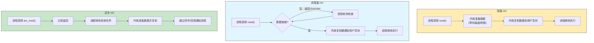
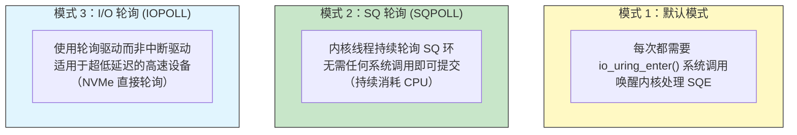

# 51 - io_uring 与异步 I/O

> Linux 的 I/O 模型经历了从阻塞 I/O 到 select/poll，再到 epoll 的演进，但始终缺少一种真正高效、通用的异步 I/O 机制。io_uring 的出现改变了这一切——它通过共享环形缓冲区实现了零拷贝（或极低拷贝）的 I/O 提交与完成通知，在某些场景下可将 I/O 吞吐量提升数倍。本章从 I/O 模型基础讲起，深入 io_uring 的架构设计，介绍 liburing 的使用方法，并对比 io_uring 与 epoll、AIO 的性能差异。

---

## 51.1 I/O 模型演进

### 51.1.1 五种 I/O 模型

Linux 提供了五种 I/O 模型，理解它们之间的区别是掌握 io_uring 的基础：



| I/O 模型 | 描述 | 典型系统调用 | 适用场景 |
|----------|------|-------------|---------|
| **阻塞 I/O** | 进程挂起直到 I/O 完成 | `read()`, `write()` | 简单程序、单任务 |
| **非阻塞 I/O** | 立即返回，需轮询是否就绪 | `read()` + `O_NONBLOCK` | 需手动管理的场景 |
| **I/O 多路复用** | 单线程监视多个 fd | `select()`, `poll()`, `epoll_wait()` | 网络服务器 |
| **信号驱动 I/O** | 通过 SIGIO 信号通知 | `fcntl(F_SETOWN)` + `F_SETSIG` | 较少使用 |
| **异步 I/O** | 内核完成所有操作后通知 | `aio_read()`, `io_uring_enter()` | 高性能 I/O |

### 51.1.2 传统 I/O 的开销来源

每次 `read()` / `write()` 系统调用都会产生以下开销：

```
应用程序发起 I/O
 └── 系统调用（上下文切换：用户态 → 内核态）
 └── 内核将数据从设备读取到内核缓冲区
 └── 内核将数据从内核缓冲区复制到用户空间缓冲区
 └── 系统调用返回（上下文切换：内核态 → 用户态）
```

在高速设备（NVMe SSD、100GbE 网卡）上，系统调用本身的开销可能超过 I/O 操作本身，成为性能瓶颈。**io_uring 的核心设计目标就是将这部分开销降到最低。**

---

## 51.2 Linux AIO（libaio）及其局限

### 51.2.1 Linux AIO 简介

Linux AIO（Asynchronous I/O）是内核提供的原生异步 I/O 接口，通过以下系统调用使用：

```c
#include <linux/aio_abi.h>
#include <libaio.h>

// 设置异步 I/O 上下文
io_context_t ctx;
io_setup(128, &ctx); // 最多 128 个并发 I/O

// 准备 I/O 控制块 (iocb)
struct iocb cb;
io_prep_pread(&cb, fd, buf, count, offset);

// 提交 I/O 请求
struct iocb *cbs[1] = { &cb };
io_submit(ctx, 1, cbs);

// 获取完成事件
struct io_event events[128];
int n = io_getevents(ctx, 1, 128, events, NULL);
```

### 51.2.2 Linux AIO 的主要局限性

| 限制 | 说明 |
|------|------|
| **仅 Direct I/O** | 必须使用 `O_DIRECT` 打开文件，绕过页缓存。普通缓冲 I/O 回退为同步 |
| **无 socket 支持** | 不支持网络 I/O（socket、pipe 等） |
| **状态机复杂** | 需要手动管理 iocb 的生命周期和状态 |
| **提交与完成需两次系统调用** | `io_submit()` + `io_getevents()`，无法批量完成 |
| **内核实现古老** | 基于 `aio-thread` 内核线程池，效率低下 |
| **错误处理脆弱** | 某些文件系统（如 ext4）的特定场景下行为不可靠 |

```bash
# 验证系统是否支持 AIO
grep -i aio /proc/sys/fs/aio-nr # 当前分配的 AIO 上下文数
grep -i aio /proc/sys/fs/aio-max-nr # 最大分配数

# libaio 包（Arch Linux）
pacman -Ql libaio # 已安装的核心库
```

由于上述局限，Linux AIO 始终未能成为通用的高性能 I/O 方案。2019 年 Jens Axboe（Linux 块层维护者）提出了 io_uring，从根本上解决了这些问题。

---

## 51.3 io_uring 架构原理

### 51.3.1 核心概念：共享环形缓冲区

io_uring 的本质是一个**内核与用户空间之间的共享环形缓冲区对**。两个环被映射到同一块共享内存，用户空间写入 SQ 环、内核写入 CQ 环，**无需任何系统调用即可在大多数情况下完成 I/O 提交和完成通知**。

```mermaid
graph LR
 subgraph app["用户空间"]
 SQ["Submission Queue<br/>提交队列<br/>（用户写入，待处理请求）"]
 CQ["Completion Queue<br/>完成队列<br/>（内核写入，已完成请求）"]
 end

 subgraph kernel["内核空间"]
 KERN["io_uring 内核线程<br/>"io_wq" 工作队列"]
 end

 SQ -- "映射到内核" --> KERN
 KERN -- "映射到用户空间" --> CQ
 SQ -. "用户插入 SQE" .-> SQ
 CQ -. "内核插入 CQE" .-> CQ

 style SQ fill:#c8e6c9,stroke:#333
 style CQ fill:#e1f5fe,stroke:#333
 style KERN fill:#fff9c4,stroke:#333
```

### 51.3.2 SQ 和 CQ 的详细结构

```c
// Submission Queue Entry（提交队列条目），简化表示
struct io_uring_sqe {
 __u8 opcode; // 操作码：IORING_OP_READ, IORING_OP_WRITE, ...
 __u8 flags; // 标志位
 __u16 ioprio; // I/O 优先级
 __s32 fd; // 文件描述符
 __u64 off; // 文件偏移量
 __u64 addr; // 缓冲区地址
 __u32 len; // 数据长度
 __u32 rw_flags; // 读/写标志
 __u64 user_data; // 用户自定义数据（关联 SQE 与 CQE）
 // ... 更多字段
};

// Completion Queue Entry（完成队列条目），简化表示
struct io_uring_cqe {
 __u64 user_data; // 与 SQE 中的 user_data 对应
 __s32 res; // 操作结果：字节数（成功）或 -errno（失败）
 __u32 flags; // 标志位
};
```

**SQ 环的尾部/头部指针：**
- **SQ tail**：用户空间递增，表示已提交但尚未被内核看见的 SQE
- **SQ head**：内核递增，表示内核已消费到的 SQE 位置
- **CQ head**：用户空间递增，表示已处理到的 CQE 位置
- **CQ tail**：内核递增，表示内核已写入的 CQE 位置

这种设计的精妙之处在于：用户和内核各自拥有独立的头/尾指针，通过共享内存中的变量协商进度，**大多数操作无需系统调用即可完成**。

### 51.3.3 三种操作模式

io_uring 支持三种操作模式，灵活性与性能逐级提升：



| 模式 | 标志 | 特点 | 延迟 | CPU 开销 |
|------|------|------|------|---------|
| 默认模式 | 无 | 标准模型，适合通用场景 | 中等 | 低 |
| SQPOLL | `IORING_SETUP_SQPOLL` | 内核线程持续轮询 SQ | 极低 | 高（单个核心常驻） |
| IOPOLL | `IORING_SETUP_IOPOLL` | 轮询硬件而非中断 | 极低（< 10μs） | 高（要求支持设备） |
| SQPOLL + IOPOLL | 两者组合 | 零系统调用，轮询硬件 | < 5μs | 非常高 |

---

## 51.4 io_uring 的关键优势

### 51.4.1 对比传统 I/O

```
操作 read() io_uring (默认) io_uring (SQPOLL)
────────────────────────────────────────────────────────────────────────
系统调用次数 1 次 0~1 次 0 次
上下文切换 2 次 0~2 次 0 次
内存拷贝 内核→用户 内核→用户 内核→用户
批量操作 不支持 支持（一次提交 N 个） 支持（批量+零 syscall）
```

### 51.4.2 核心优势

| 优势 | 说明 |
|------|------|
| **批量提交与完成** | 一次系统调用可提交/收割多个 I/O 操作（Batching） |
| **固定缓冲区（Fixed Buffers）** | 预先注册缓冲区，避免每次 I/O 的映射/解映射开销 |
| **零拷贝提交** | 通过共享内存读写 SQ/CQ 环，大部分操作无需系统调用 |
| **文件注册（Fixed Files）** | 预先注册文件描述符，批量 I/O 时跳过查找和引用计数 |
| **链接操作** | 将多个操作串联，前一个成功才执行下一个（原子管道） |
| **超时与取消** | 支持 I/O 超时和取消操作 |
| **轮询模式** | 牺牲 CPU 换取极低延迟 |
| **统一接口** | 同时支持文件 I/O 和网络 I/O（socket） |

### 51.4.3 支持的操作类型

```
操作类型 操作码 说明
──────────────────────────────────────────────────────────────────
文件读写 IORING_OP_READ/WRITE 普通文件 I/O
网络 I/O IORING_OP_SEND/RECV socket 收发
连接 IORING_OP_CONNECT 异步连接
接受连接 IORING_OP_ACCEPT 异步 accept
文件系统操作 IORING_OP_FSYNC/FSYNC3 同步到磁盘
 IORING_OP_FALLOCATE 预分配空间
 IORING_OP_OPENAT/CLOSE 打开/关闭文件
 IORING_OP_STATX 获取文件信息
 IORING_OP_RENAMEAT/MKDIRAT/... 各种文件操作
超时 IORING_OP_TIMEOUT 定时操作
取消 IORING_OP_ASYNC_CANCEL 取消已提交的操作
Poll IORING_OP_POLL_ADD/REMOVE 对 fd 的 epoll 风格监视
Buffer Group IORING_OP_PROVIDE_BUFFERS 为读操作提供缓冲区池
零拷贝发送 IORING_OP_SEND_ZC 零拷贝网络发送
```

---

## 51.5 liburing 基础使用

### 51.5.1 liburing 简介

liburing 是 io_uring 的官方用户空间辅助库，封装了底层的 `io_uring_setup()` 和 `io_uring_enter()` 系统调用，提供了简洁的 API。

```bash
# 安装 liburing（Arch Linux）
sudo pacman -S liburing

# 查看版本和头文件位置
pkg-config --cflags --libs liburing
# -I/usr/include -luring

# 最小化的手动编译
# gcc -o io_uring_test io_uring_test.c -luring
```

### 51.5.2 基础使用模式（概念代码）

```c
/*
 * io_uring 基础的读文件示例（概念性代码）
 * 展示核心 API 的使用流程
 */

#include <liburing.h>
#include <stdio.h>
#include <fcntl.h>
#include <stdlib.h>

#define QUEUE_DEPTH 1

int main(void) {
 struct io_uring ring;
 struct io_uring_sqe *sqe;
 struct io_uring_cqe *cqe;
 int fd, ret;
 char buf[4096];

 // 步骤 1：初始化 io_uring 实例
 // QUEUE_DEPTH 指定 SQ 的大小（能容纳的 SQE 数量）
 io_uring_queue_init(QUEUE_DEPTH, &ring, 0);

 // 步骤 2：打开要读取的文件
 fd = open("/etc/hostname", O_RDONLY);
 if (fd < 0) {
 perror("open");
 return 1;
 }

 // 步骤 3：获取一个 SQE（Submission Queue Entry）
 sqe = io_uring_get_sqe(&ring);
 if (!sqe) {
 fprintf(stderr, "Failed to get SQE\n");
 return 1;
 }

 // 步骤 4：在 SQE 中准备读操作
 // 参数：fd, 用户缓冲区, 长度, 文件偏移量
 io_uring_prep_read(sqe, fd, buf, sizeof(buf), 0);

 // 设置 user_data 以在完成时识别该请求
 io_uring_sqe_set_data(sqe, (void *)1);

 // 步骤 5：提交 SQE 到内核
 ret = io_uring_submit(&ring);
 if (ret < 0) {
 fprintf(stderr, "io_uring_submit failed\n");
 return 1;
 }

 // 步骤 6：等待完成事件
 ret = io_uring_wait_cqe(&ring, &cqe);
 if (ret < 0) {
 fprintf(stderr, "io_uring_wait_cqe failed\n");
 return 1;
 }

 // 步骤 7：检查结果
 if (cqe->res < 0) {
 // 返回值是 -errno
 fprintf(stderr, "Read error: %s\n", strerror(-cqe->res));
 } else {
 // res 是实际读取的字节数
 printf("Read %d bytes: %s\n", cqe->res, buf);
 }

 // 验证 user_data 以匹配请求
 if ((long)io_uring_cqe_get_data(cqe) != 1) {
 fprintf(stderr, "User data mismatch\n");
 }

 // 步骤 8：标记 CQE 已处理
 io_uring_cqe_seen(&ring, cqe);

 // 步骤 9：清理
 close(fd);
 io_uring_queue_exit(&ring);
 return 0;
}
```

### 51.5.3 批量提交与收割

io_uring 的真正威力在于批量执行多个 I/O 操作：

```c
/*
 * 批量提交多个读请求的概念示例
 */

#define QUEUE_DEPTH 128
#define NUM_IOS 128

void batch_read_example(void) {
 struct io_uring ring;
 struct io_uring_sqe *sqe;
 struct io_uring_cqe *cqe;
 int fds[NUM_IOS];
 char *bufs[NUM_IOS];

 io_uring_queue_init(QUEUE_DEPTH, &ring, 0);

 // 打开多个文件，准备多个请求
 for (int i = 0; i < NUM_IOS; i++) {
 char path[256];
 snprintf(path, sizeof(path), "/data/file_%d.dat", i);

 fds[i] = open(path, O_RDONLY | O_DIRECT);
 posix_memalign((void **)&bufs[i], 4096, 4096);

 // 获取 SQE
 sqe = io_uring_get_sqe(&ring);
 if (!sqe) break;

 // 准备请求
 io_uring_prep_read(sqe, fds[i], bufs[i], 4096, 0);
 io_uring_sqe_set_data(sqe, (void *)(long)i);
 }

 // 一次性批量提交所有 SQE
 int submitted = io_uring_submit(&ring);
 printf("Submitted %d I/Os in one syscall\n", submitted);

 // 收割所有完成事件
 int completed = 0;
 while (completed < submitted) {
 int ret = io_uring_wait_cqe(&ring, &cqe);

 if (ret == 0) {
 if (cqe->res > 0) {
 // 成功读取
 completed++;
 }

 // 标记已处理
 io_uring_cqe_seen(&ring, cqe);
 }
 }

 // 清理
 for (int i = 0; i < NUM_IOS; i++) {
 close(fds[i]);
 free(bufs[i]);
 }
 io_uring_queue_exit(&ring);
}
```

这种方法将**128 次 I/O 提交和收割变成了 1（或极少数）次系统调用**，在高吞吐场景下性能提升显著。

### 51.5.4 高级特性示例

```c
/*
 * 高级特性：固定缓冲区 (Fixed Buffers) 和链接操作 (Linked Operations)
 */

void advanced_example(void) {
 struct io_uring ring;
 struct io_uring_sqe *sqe;
 struct iovec iov;
 void *buf;
 int fd;

 // 创建带选项的 io_uring 实例
 struct io_uring_params params = {0};
 io_uring_queue_init_params(256, &ring, &params);

 // --- 固定缓冲区注册 ---
 // 分配并注册 buffer，避免每次 I/O 的映射/解映射
 posix_memalign(&buf, 4096, 4096 * 64); // 64 个 4KB 的缓冲区
 iov.iov_base = buf;
 iov.iov_len = 4096 * 64;

 // 注册缓冲区，后续 SQE 可以通过 buffer_index 引用
 io_uring_register_buffers(&ring, &iov, 1);

 // --- 文件描述符注册 ---
 fd = open("/path/to/large_file", O_RDONLY | O_DIRECT);

 // 固定文件描述符注册，减少每次 I/O 的 fd 查找开销
 io_uring_register_files(&ring, &fd, 1);

 // --- 链接操作 ---
 // 获取第一个 SQE：读取文件
 sqe = io_uring_get_sqe(&ring);
 io_uring_prep_read(sqe, 0, buf, 4096, 0); // fd=0（已注册的 fd 索引）
 sqe->flags |= IOSQE_FIXED_FILE; // 使用固定文件模式
 sqe->flags |= IOSQE_IO_LINK; // 链接：下一个 SQE 依赖于此

 // 获取第二个 SQE：在读取完成后关闭文件（链接操作）
 sqe = io_uring_get_sqe(&ring);
 io_uring_prep_close(sqe, 0); // 链接操作：仅在前者成功后执行

 io_uring_submit(&ring);

 // ... 处理完成事件

 io_uring_unregister_buffers(&ring);
 io_uring_queue_exit(&ring);
}
```

---

## 51.6 io_uring vs epoll 用于网络 I/O

### 51.6.1 epoll 的工作方式

```c
// 传统 epoll 网络模型：
// 1. epoll_wait() 等待事件
// 2. 遍历就绪列表
// 3. 对每个就绪的 fd 调用 read()/write() 系统调用
// 4. 返回步骤 1

// 每个 accept/read/write/send 都是独立的系统调用
// 在高并发场景下（C10K+），系统调用开销显著
```

### 51.6.2 io_uring 统一网络 + 文件 I/O

```c
/*
 * io_uring 统一处理 accept + read + write
 * 所有操作通过同一个 ring 提交和完成
 */

void uring_echo_server(int listen_fd) {
 struct io_uring ring;
 io_uring_queue_init(4096, &ring, 0);

 // 提交初始 accept 请求
 struct io_uring_sqe *sqe = io_uring_get_sqe(&ring);
 io_uring_prep_accept(sqe, listen_fd, NULL, NULL, 0);
 io_uring_sqe_set_data(sqe, NULL);
 io_uring_submit(&ring);

 while (1) {
 struct io_uring_cqe *cqe;
 io_uring_wait_cqe(&ring, &cqe);

 int fd = cqe->res; // 对于 accept，ce→res 是新连接的 fd
 if (fd >= 0) {
 // 提交新的 accept 请求（边沿触发）
 sqe = io_uring_get_sqe(&ring);
 io_uring_prep_accept(sqe, listen_fd, NULL, NULL, 0);
 io_uring_sqe_set_data(sqe, NULL);

 // 提交读请求
 sqe = io_uring_get_sqe(&ring);
 char *buf = malloc(4096);
 io_uring_prep_recv(sqe, fd, buf, 4096, 0);
 io_uring_sqe_set_data(sqe, buf);
 }

 io_uring_submit(&ring);
 io_uring_cqe_seen(&ring, cqe);
 }
}
```

### 51.6.3 性能对比

| 维度 | epoll | io_uring |
|------|-------|----------|
| 事件提交 | `epoll_ctl()` 系统调用 | 直接写入 SQ 环（无 syscall） |
| 读取数据 | `read()`/`recv()` + syscall | 直接写入 SQ 环（无 syscall） |
| 批量操作 | 不支持，需逐个调用 | 批量提交 N 个请求 |
| 文件 I/O | 不支持（epoll 不能监视文件） | 统一支持文件 + 网络 |
| 内存拷贝 | 内核 → 用户空间 | 内核 → 用户空间（可配合注册缓冲区优化） |
| 适用场景 | 传统网络服务器 | 新一代高性能网络/存储 |

> **epoll 并不过时**：对于中等并发、延迟不敏感的纯网络 I/O，epoll 仍然是成熟且稳定的选择。io_uring 在需要超高并发、混合文件+网络 I/O、低延迟的场景中优势显著。

---

## 51.7 内核版本与硬件要求

### 51.7.1 内核版本要求

| 内核版本 | io_uring 能力 |
|----------|--------------|
| **5.1** | io_uring 首次引入，基础功能 |
| **5.3** | 支持 IORING_OP_TIMEOUT、IORING_OP_ACCEPT |
| **5.4** | 支持固定文件 (IORING_REGISTER_FILES) 和固定缓冲区 (IORING_REGISTER_BUFFERS) |
| **5.5** | 支持轮询（IORING_SETUP_SQPOLL）、支持 socket recv/send |
| **5.6** | 支持 IORING_SETUP_IOPOLL（NVMe 直接轮询） |
| **5.7** | 支持固定文件更新、IORING_OP_CONNECT |
| **5.12** | 支持受限 ring（IORING_SETUP_R_DISABLED）、IORING_OP_RECVMSG/ZC |
| **5.15** | 支持 buffer rings 提供缓冲区组、IORING_OP_SENDMSG_ZC |
| **5.19** | 支持多 shot accept/recv、IORING_SETUP_DEFER_TASKRUN |
| **6.1+** | 大量优化和新增特性，生产就绪 |

```bash
# 检查当前内核是否支持 io_uring
uname -r
# 输出示例：6.6.10-arch1-1

# 确认 io_uring 内核配置已启用
zgrep CONFIG_IO_URING /proc/config.gz
# CONFIG_IO_URING=y

# 查看 io_uring 相关统计
ls -la /sys/kernel/debug/uring/
# 如果没有挂载 debugfs:
# sudo mount -t debugfs none /sys/kernel/debug
```

### 51.7.2 硬件支持建议

```
特性 建议配置
───────────────────────────────────────
存储介质 NVMe SSD（IOPOLL 模式需要）
网络 10GbE+（才能跑满 io_uring 的吞吐）
CPU 核心 多核，SQPOLL 模式需独占一个核心
内存 较大内存用于固定缓冲区注册
BIOS 禁用 C-states 以降低延迟（SQPOLL 模式）
```

---

## 51.8 实际应用案例

### 51.8.1 数据库

- **ScyllaDB**：使用 io_uring 替换 AIO，将 I/O 吞吐量提升 2-3 倍
- **RocksDB**：使用 io_uring 作为默认 I/O 后端的大规模 KV 存储
- **PostgreSQL**：从 v14 开始支持 io_uring 后端（通过 `io_method` 参数）

### 51.8.2 Web 服务器与代理

- **NGINX**：从 1.21 版本开始实验性支持 io_uring（`aio uring` 配置）
- **Envoy**：使用 io_uring 改善代理层的文件 I/O
- **Caddy**：在日志和文件传输中使用 io_uring

### 51.8.3 文件服务器与对象存储

- **Samba**：采用 io_uring 改善 SMB 文件传输延迟
- **QEMU**：从 6.0 版本使用 io_uring 作为虚拟磁盘的 I/O 后端
- **MinIO**：在高吞吐对象存储中使用 io_uring 优化

---

## 51.9 总结

io_uring 代表了 Linux I/O 模型的一次范式转变：

1. **共享环形缓冲区**消除了 I/O 提交/完成中的冗余系统调用和内存拷贝
2. **灵活的轮询模式**（SQPOLL、IOPOLL）在延迟敏感场景提供亚微秒级 I/O
3. **固定缓冲区和文件注册**进一步降低了高频 I/O 的元数据开销
4. **统一网络与文件 I/O**——这是 Linux AIO 始终未能做到的
5. **批量操作**允许在一次交互中提交和收割数十万个请求

io_uring 不是 epoll 的替代品，而是提供了完全不同的高性能范式。对于大多数开发者和系统管理员，理解其架构和使用模式，能够为构建下一代高性能网络和存储应用奠定坚实的基础。

> [!note] 深入学习方向
> - 阅读 `liburing/examples/` 目录下的官方示例代码
> - 了解 `IORING_SETUP_DEFER_TASKRUN` 的工作偷取模式
> - 探索 io_uring 的零拷贝发送（ZC Send）在网络代理中的应用
> - 研究 IORING_OP_SPLICE 和 IORING_OP_TEE 的管道优化操作

---

> [!question]- 选择题 1：io_uring 的核心设计思想是什么？
> - A. 在内核中为每个 fd 创建一个独立线程
> - B. 用户空间与内核空间共享环形缓冲区，减少或消除系统调用
> - C. 完全在用户空间实现 I/O 调度
> - D. 将所有的 I/O 转发到专门的 I/O 控制器
>
> > [!success]- 点击查看答案
> > **B**。io_uring 的核心是映射到用户空间的共享环形缓冲区对（SQ + CQ），大部分操作无需系统调用即可完成 I/O 提交与完成通知。

> [!question]- 选择题 2：Linux AIO（libaio）的主要局限是什么？
> - A. 只支持写入操作，不支持读取
> - B. 必须配合 Direct I/O 使用，且不支持 socket I/O
> - C. 仅支持 32 位平台
> - D. 需要专用硬件支持
>
> > [!success]- 点击查看答案
> > **B**。Linux AIO 要求文件以 `O_DIRECT` 打开，绕过页缓存，且完全不支持网络 socket。io_uring 同时解决了这两个问题。

> [!question]- 选择题 3：SQPOLL 模式的特点是什么？
> - A. 通过信号传递完成通知
> - B. 内核线程持续轮询 SQ 环，消除提交时的系统调用
> - C. 自动将数据处理拆分到多个队列
> - D. 仅支持 NVMe 设备
>
> > [!success]- 点击查看答案
> > **B**。`IORING_SETUP_SQPOLL` 让内核线程持续轮询 SQ 环，用户空间提交 SQE 时完全不需要系统调用，以常驻 CPU 核心为代价换取极低延迟。

> [!question]- 判断题 4：epoll 已经完全被 io_uring 取代。
> - A. 正确
> - B. 错误
>
> > [!success]- 点击查看答案
> > **B. 错误**。epoll 仍然是简单网络服务中的成熟方案，且 io_uring 需要 5.1+ 内核。对于中小规模场景，epoll 的简单性和成熟度优势明显。

> [!question]- 选择题 5：io_uring 的链接操作（Linked Operations）的作用是什么？
> - A. 将多个 SQE 串联执行，前一个成功才执行下一个
> - B. 将多个 CQE 合并为一个
> - C. 在两个 io_uring 实例之间建立连接
> - D. 将一个 I/O 操作复制到多个设备
>
> > [!success]- 点击查看答案
> > **A**。通过设置 `IOSQE_IO_LINK` 标志，可以将多个 SQE 串在一起，只有前一个操作成功后才会执行下一个。失败时立即停止，这是一种"原子管道"的语义。

---

## 延伸阅读

- [[50-BPF与系统追踪]] — 通过 BPF 动态追踪 io_uring 的内部工作流程
- [[51-Wayland深入指南]] — 理解共享内存缓冲区在现代图形栈中的应用
- [[46-容器技术]] — 容器存储驱动中的文件 I/O 模式
- [[42-文件系统深入]] — 文件系统设计与 VFS 层的 I/O 路径
- [[41-内存管理深入]] — 页缓存、Direct I/O 与内存映射 I/O
- Linux Block Layer 文档：https://www.kernel.org/doc/html/latest/block/
- io_uring 作者博客：https://kernel.dk/
- liburing 仓库：https://github.com/axboe/liburing
