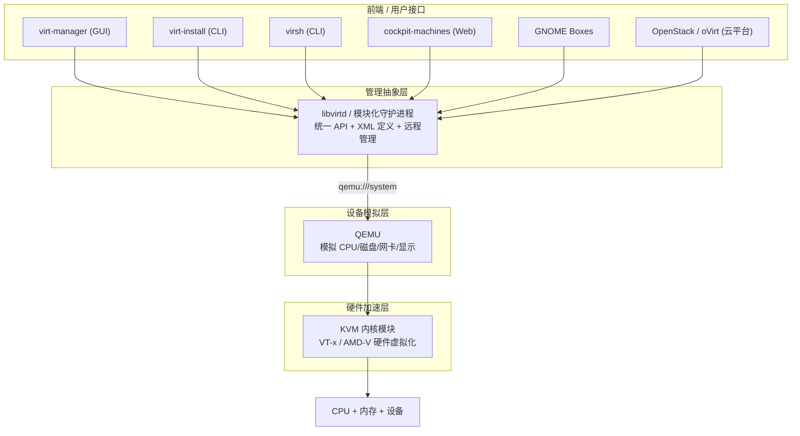
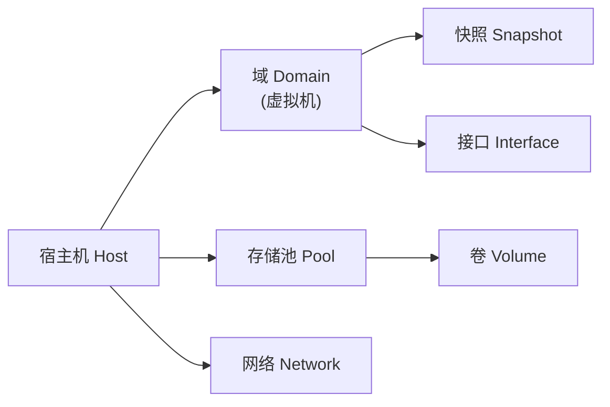

# 71 - libvirt 与 QEMU/KVM 虚拟化完全指南

> **本章定位**：[[09-虚拟机配置与打包]] 是虚拟化"全景图"，覆盖 VirtualBox/VMware/Vagrant/打包分发；本章则是 **Linux 原生虚拟化方案（QEMU/KVM + libvirt）的深度专章**——从内核模块到管理抽象层，从分发行版安装到日常运维。学完本章，你能在任意发行版上用命令行与 XML 完整掌控虚拟机，而不是只会点 GUI。

---

## 71.1 三层架构：KVM、QEMU、libvirt 各是什么

初学者最容易混淆这三个名字。它们不是三个竞品，而是**同一套方案的三个层次**：



| 组件 | 层次 | 职责 | 关键事实 |
|------|------|------|---------|
| **KVM** | 内核模块 | 利用 CPU 硬件虚拟化指令，让虚拟机直接跑在硬件上 | 两个模块：`kvm_intel` / `kvm_amd`；接口是 `/dev/kvm` |
| **QEMU** | 用户态程序 | 模拟整台计算机：CPU、磁盘、网卡、USB、显示 | 没有 KVM 时纯软件模拟（TCG，慢）；有 KVM 时几乎原生速度 |
| **libvirt** | 守护进程 + API | 统一管理虚拟化后端（QEMU/KVM、Xen、LXC、bhyve…） | 用 **XML 描述**虚拟机；提供 `virsh`、远程连接、事件、存储/网络抽象 |

### 为什么需要 libvirt 这层抽象

直接敲 `qemu-system-x86_64` 也能跑虚拟机，但工程上会遇到这些问题：

| 裸 QEMU 的问题 | libvirt 的解法 |
|---------------|---------------|
| 参数极多，一条命令上百个开关 | XML 定义一次，反复使用；`virsh define/edit` 管理 |
| 进程与终端绑定，SSH 断开虚拟机就挂 | 守护进程托管，systemd 级生命周期与开机自启 |
| 存储、网络、快照要自己拼命令 | 存储池/网络/快照都是一等对象，统一命令管理 |
| 多台宿主机各管各的 | `qemu+ssh://host/system` 远程统一管理 |
| 权限、审计、监控缺失 | 与 polkit/SELinux/AppArmor 集成，暴露统计与事件 |

### 抽象层的其他选择

| 方案 | 定位 | 适合 |
|------|------|------|
| **libvirt** | 通用管理抽象层（本章主角） | 单机到小集群、脚本化、所有 Linux 发行版 |
| 裸 QEMU | 无守护进程，直接控制 | 内核/固件调试、嵌入式、一次性实验（见 71.9） |
| Incus / LXD | 系统容器 + 虚拟机的统一管理 | 容器为主、虚拟机为辅的场景 |
| Proxmox VE | 完整虚拟化平台（自带 Web/集群/备份） | 家用服务器、小型机房（见 [[09-虚拟机配置与打包]]） |
| oVirt / OpenStack | 数据中心级云平台（内部使用 libvirt） | 企业私有云 |

> **结论**：学习阶段掌握 **libvirt + QEMU/KVM** 性价比最高——它是所有上层平台（oVirt、OpenStack、大量云厂商）的共同底座，学会它再看其他方案都是"换皮"。

---

## 71.2 硬件前提与检查

### CPU 虚拟化支持

```bash
# Intel 输出 vmx，AMD 输出 svm；有输出说明 CPU 支持
grep -Eoc '(vmx|svm)' /proc/cpuinfo

# 检查 KVM 模块是否已加载（通常自动加载）
lsmod | grep kvm

# 检查 /dev/kvm 设备是否存在、权限如何
ls -l /dev/kvm
```

若 `/proc/cpuinfo` 没有 `vmx/svm`，先到 BIOS/UEFI 中开启虚拟化（Intel VT-x / AMD-V / SVM Mode）。虚拟机里跑虚拟机（嵌套虚拟化）需要宿主也开启：

```bash
# Intel：检查嵌套是否开启（Y 为开启）
cat /sys/module/kvm_intel/parameters/nested
# AMD：通常默认开启
cat /sys/module/kvm_amd/parameters/nested

# 手动开启（重启失效，持久化写 /etc/modprobe.d/）
sudo modprobe -r kvm_intel && sudo modprobe kvm_intel nested=1
```

### 快速自检工具

```bash
# Debian/Ubuntu 可安装 cpu-checker 后使用
sudo apt install cpu-checker
kvm-ok
# 期望输出：KVM acceleration can be used
```

### IOMMU（GPU 直通才需要）

```bash
# 内核参数检查：Intel 用 intel_iommu=on，AMD 用 amd_iommu=on
cat /proc/cmdline | grep -o 'iommu=on'
# 查看 IOMMU 分组
for d in /sys/kernel/iommu_groups/*/devices/*; do echo "$d"; done | head
```

GPU 直通的完整流程见 [[09-虚拟机配置与打包]] 的 vfio-pci 小节，本章不重复。

---

## 71.3 安装（按发行版分开）

组件较多，先明确每个包的作用，再按发行版安装。

### 组件清单

| 组件 | 作用 | 是否必需 |
|------|------|:-------:|
| QEMU（`qemu-system-x86` 等） | 设备模拟器 | 必需 |
| libvirt 守护进程 | 管理抽象层服务端 | 必需 |
| libvirt 客户端（`virsh` 等） | 命令行管理工具 | 必需 |
| `virt-install`（virtinst） | 命令行创建虚拟机 | 必需 |
| `virt-manager` | 图形管理界面 | 桌面推荐 |
| OVMF（`edk2-ovmf`） | UEFI 固件，装 UEFI 系统必需 | 推荐 |
| `swtpm` | 虚拟 TPM（Windows 11 必需） | 按需 |
| `dnsmasq` | 默认 NAT 网络（default 网络） | 推荐 |
| `qemu-utils` / `qemu-img` | 磁盘镜像工具 | 必需（通常随 QEMU） |

### Debian / Ubuntu

```bash
sudo apt update
sudo apt install -y \
  qemu-system-x86 qemu-utils \
  libvirt-daemon-system libvirt-clients \
  virtinst virt-manager \
  ovmf swtpm

# 把当前用户加入 libvirt 组（免 sudo 管理虚拟机）
sudo usermod -aG libvirt,kvm "$USER"
newgrp libvirt          # 当前终端立即生效；或注销重新登录

# 服务（apt 安装时通常已自动启动）
sudo systemctl enable --now libvirtd
systemctl status libvirtd --no-pager
```

> Debian 上不要安装 `qemu-kvm`——它是过渡用的空包，实际软件在 `qemu-system-x86` 里。

### Fedora / RHEL / Rocky

```bash
# 组安装（Fedora 推荐）
sudo dnf group install -y --with-optional virtualization

# 或者按包安装（RHEL/Rocky 也可）
sudo dnf install -y \
  qemu-kvm qemu-img \
  libvirt libvirt-daemon-kvm \
  virt-install virt-manager \
  edk2-ovmf swtpm

sudo usermod -aG libvirt "$USER"
newgrp libvirt
```

```bash
# Fedora 38+ / RHEL 9+ 默认使用「模块化守护进程」而非单体 libvirtd
systemctl status virtqemud.socket --no-pager
systemctl status virtnetworkd.socket --no-pager
# 查看所有 libvirt 相关单元
systemctl list-units 'virt*' --no-pager
```

> 模块化守护进程是 libvirt 10+ 的方向：`virtqemud` 管 QEMU、`virtnetworkd` 管网、`virtstoraged` 管存储，按需启动。旧教程里的 `systemctl enable libvirtd` 在这些系统上仍可用（安装 `libvirt-daemon` 后），但没必要——两者不要同时启用。

### Arch Linux

```bash
# QEMU：qemu-full 全功能；只跑 x86_64 虚拟机可装 qemu-desktop + qemu-system-x86
sudo pacman -S qemu-full

sudo pacman -S --needed \
  libvirt virt-install virt-manager \
  edk2-ovmf swtpm dnsmasq \
  iptables-nft dmidecode

# 启动守护进程（Arch 使用单体 libvirtd）
sudo systemctl enable --now libvirtd

sudo usermod -aG libvirt "$USER"
newgrp libvirt
```

> Arch 上如果默认网络（default）没有自动创建，手动注册一次即可：
> ```bash
> sudo virsh net-define /usr/share/libvirt/networks/default.xml
> sudo virsh net-start default
> sudo virsh net-autostart default
> ```

### openSUSE

```bash
# 模式安装：kvm_server（宿主）+ kvm_tools（工具）
sudo zypper install -t pattern kvm_server kvm_tools

# 或按包安装
sudo zypper install -y qemu-kvm libvirt virt-install virt-manager ovmf swtpm

sudo systemctl enable --now libvirtd
sudo usermod -aG libvirt "$USER"
newgrp libvirt
```

### 安装后验证（所有发行版通用）

```bash
# 1. 宿主环境自检：逐项检查硬件虚拟化、IOMMU、网络等
virt-host-validate qemu

# 2. 确认 libvirt 能连上 QEMU
virsh -c qemu:///system version
virsh -c qemu:///system nodeinfo

# 3. 查看默认网络与存储
virsh -c qemu:///system net-list --all
virsh -c qemu:///system pool-list --all
```

`virt-host-validate` 关键项：`QEMU: Checking for hardware virtualization` 应为 `PASS`；`Checking for device /dev/kvm` 应为 `PASS`。

### 权限模型：qemu:///system 与 qemu:///session

| 连接 URI | 运行身份 | 能力 | 用途 |
|----------|---------|------|------|
| `qemu:///system` | root 级（qemu 用户运行进程） | 完整：网络桥接、自启、直通 | **标准选择**，加 libvirt 组即可免 sudo |
| `qemu:///session` | 当前用户 | 受限：无默认 NAT、无自启 | 无 root 权限时临时用 |
| `qemu+ssh://user@host/system` | 远程宿主机 | 与本地 system 相同 | 远程管理 |

```bash
# 让 virsh 默认使用 system 连接（写入用户环境变量）
echo 'export LIBVIRT_DEFAULT_URI="qemu:///system"' >> ~/.bashrc
source ~/.bashrc
```

---

## 71.4 libvirt 核心概念

### 对象模型



| 概念 | 对应现实 | XML 关键字 |
|------|---------|-----------|
| 域（Domain） | 一台虚拟机 | `<domain>` |
| 存储池（Pool） | 存放磁盘镜像的仓库 | `<pool>` |
| 卷（Volume） | 池中的一个磁盘文件/块设备 | `<volume>` |
| 网络（Network） | 虚拟交换机 + DHCP/NAT 或桥接 | `<network>` |
| 快照（Snapshot） | 某时刻的磁盘/内存状态 | `<domainsnapshot>` |

### XML：libvirt 的"单一事实源"

```bash
# 导出虚拟机定义（可读可存可版本化）
virsh dumpxml vm1 > vm1.xml

# 用 XML 定义新虚拟机（不启动）
virsh define vm1.xml

# 在线编辑定义（保存后需 shutdown/start 或部分热生效）
virsh edit vm1
```

一个最小可用的 domain XML 结构（字段含义注释）：

```xml
<domain type='kvm'>
  <name>demo</name>
  <memory unit='MiB'>2048</memory>
  <vcpu>2</vcpu>
  <os>
    <type arch='x86_64'>hvm</type>
    <boot dev='hd'/>
  </os>
  <features><acpi/><apic/></features>
  <cpu mode='host-passthrough'/>                <!-- 直通宿主 CPU 特性，性能最好 -->
  <devices>
    <disk type='file' device='disk'>
      <driver name='qemu' type='qcow2' cache='none' io='native'/>
      <source file='/var/lib/libvirt/images/demo.qcow2'/>
      <target dev='vda' bus='virtio'/>           <!-- virtio 磁盘 -->
    </disk>
    <interface type='network'>
      <source network='default'/>
      <model type='virtio'/>                     <!-- virtio 网卡 -->
    </interface>
    <graphics type='spice' autoport='yes'/>      <!-- SPICE 图形控制台 -->
    <console type='pty'/>                        <!-- virsh console 串口 -->
  </devices>
</domain>
```

> 记住一句话：**libvirt 的一切操作，最终都可以归结为"读/写/应用 XML"**。GUI（virt-manager）不过是在帮你生成 XML。

---

## 71.5 用 virt-install 创建第一台虚拟机

`virt-install` 是命令行创建虚拟机的标准工具，参数会翻译成上面那份 XML。

### 从 ISO 全新安装（以 Ubuntu Server 为例）

```bash
virt-install \
  --name ubuntu-server \
  --memory 4096 \
  --vcpus 2 \
  --cpu host-passthrough \
  --disk path=/var/lib/libvirt/images/ubuntu-server.qcow2,size=30,format=qcow2,bus=virtio \
  --network network=default,model=virtio \
  --cdrom /path/to/ubuntu-24.04-live-server-amd64.iso \
  --os-variant ubuntu24.04 \
  --graphics spice \
  --boot uefi \
  --noautoconsole
```

| 参数 | 作用 |
|------|------|
| `--name` | 虚拟机名称（唯一） |
| `--memory` / `--vcpus` | 内存（MiB）/ vCPU 数 |
| `--cpu host-passthrough` | 把宿主 CPU 特性直通给客户机，性能最好 |
| `--disk ...` | 磁盘路径、大小、格式、总线；`bus=virtio` 性能最优 |
| `--network network=default` | 接入默认 NAT 网络；`model=virtio` |
| `--cdrom` | 安装 ISO；也可用 `--location` 走网络安装 |
| `--os-variant` | 告诉 libvirt 目标系统类型，用于优化默认参数 |
| `--boot uefi` | 使用 UEFI 固件（需装 OVMF） |
| `--noautoconsole` | 创建后不自动打开控制台，便于脚本化 |

```bash
# 查询可用的 os-variant 列表
osinfo-query os | grep -i ubuntu

# 图形界面安装（桌面环境）
virt-manager    # 新建虚拟机向导；最后一步勾选"在安装前自定义配置"
```

### 导入已有磁盘镜像

```bash
virt-install \
  --name imported-vm \
  --memory 2048 --vcpus 2 \
  --disk /data/images/existing.qcow2,bus=virtio \
  --import \
  --os-variant generic \
  --network network=default,model=virtio \
  --graphics spice
```

### 云镜像 + cloud-init 秒开虚拟机

云镜像（cloud image）是预装好的 qcow2，配合 cloud-init 注入用户名/密钥/网络，几秒即可得到一台可 SSH 的虚拟机：

```bash
# 1. 下载云镜像（以 Ubuntu 24.04 为例）
cd /var/lib/libvirt/images
sudo curl -LO https://cloud-images.ubuntu.com/noble/current/noble-server-cloudimg-amd64.img
sudo qemu-img resize noble-server-cloudimg-amd64.img 20G

# 2. 编写 cloud-init 配置
cat > user-data <<'EOF'
#cloud-config
users:
  - name: dev
    sudo: ALL=(ALL) NOPASSWD:ALL
    ssh_authorized_keys:
      - ssh-ed25519 AAAA...你的公钥
package_update: true
packages: [nginx]
EOF
cat > meta-data <<'EOF'
instance-id: dev-001
local-hostname: dev-001
EOF

# 3. 生成 seed 镜像（需 cloud-image-utils / cloud-utils 包）
cloud-localds seed.img user-data meta-data

# 4. 创建虚拟机
virt-install \
  --name cloud-dev \
  --memory 2048 --vcpus 2 \
  --disk noble-server-cloudimg-amd64.img,bus=virtio \
  --disk seed.img,device=cdrom \
  --import --os-variant ubuntu24.04 \
  --network network=default,model=virtio \
  --noautoconsole

# 5. 查 IP 并 SSH
virsh net-dhcp-leases default
ssh dev@<上一步查到的IP>
```

---

## 71.6 存储管理

### 默认存储池

安装后通常自带一个 `default` 池，指向 `/var/lib/libvirt/images`：

```bash
virsh pool-list --all
virsh pool-info default
virsh vol-list default
```

### 自定义存储池（dir 类型）

```bash
# 1. 定义：名字 vmstore，类型 dir，目标目录 /data/vmstore
sudo mkdir -p /data/vmstore
virsh pool-define-as vmstore dir --target /data/vmstore

# 2. 构建目录 + 启动 + 开机自启
virsh pool-build vmstore
virsh pool-start vmstore
virsh pool-autostart vmstore

# 3. 在池中创建卷
virsh vol-create-as vmstore disk1.qcow2 20G --format qcow2
virsh vol-list vmstore
```

LVM、ZFS 等池类型只需替换 `dir --target ...` 为对应参数（`logical --source-name vg0`、`zfs --source-name tank --target vms`），管理命令完全一致。

### qemu-img：镜像的瑞士军刀

```bash
# 创建
qemu-img create -f qcow2 disk.qcow2 20G

# 查看信息（虚拟大小 vs 实际占用、快照列表、后端文件）
qemu-img info disk.qcow2

# 格式转换（qcow2 → raw 更快，raw → qcow2 更省空间）
qemu-img convert -p -O raw disk.qcow2 disk.raw
qemu-img convert -p -c -O qcow2 disk.raw disk.qcow2   # -c 压缩

# 扩容（只能增大，缩小需转换）
qemu-img resize disk.qcow2 +10G

# 内部快照（qcow2 专属）
qemu-img snapshot -c snap1 disk.qcow2
qemu-img snapshot -l disk.qcow2
qemu-img snapshot -a snap1 disk.qcow2    # 回滚
```

### 磁盘性能要点

| 参数 | 推荐值 | 说明 |
|------|--------|------|
| `bus` | `virtio`（或 `virtio-scsi`） | 性能远超 IDE/SATA |
| `cache` | `none` | 绕过宿主页缓存，配合 `io=native` 最佳 |
| `io` | `native` | 使用 Linux 原生 AIO |
| `discard` | `unmap` | 支持 TRIM，SSD 上重要 |
| 预分配 | `--disk ...,prealloc_metadata` | 减少碎片，提升写入稳定性 |

---

## 71.7 网络管理

### 默认 NAT 网络（default）

```bash
virsh net-list --all
virsh net-dumpxml default        # 查看网段、DHCP 范围
virsh net-dhcp-leases default    # 查看已分配 IP
virsh net-edit default           # 修改后 virsh net-destroy && net-start 生效
```

`default` 网络 = 宿主上的虚拟网桥 `virbr0` + dnsmasq 提供 DHCP/DNS + NAT 转发，网段默认 `192.168.122.0/24`。虚拟机可以访问外网，外网无法主动访问虚拟机（除非配置端口转发）。

```bash
# 查看网桥
ip addr show virbr0
bridge link show

# 端口转发：把宿主的 2222 转发到虚拟机的 22（用 nftables 示例）
sudo nft add rule ip nat PREROUTING tcp dport 2222 dnat to 192.168.122.50:22
```

### 桥接网络（虚拟机获得局域网 IP）

桥接让虚拟机像物理机一样直接出现在局域网中，适合服务器场景。

```bash
# 方式一：NetworkManager（跨发行版通用，推荐）
sudo nmcli connection add type bridge ifname br0 con-name br0
sudo nmcli connection add type bridge-slave ifname enp3s0 master br0
sudo nmcli connection modify br0 ipv4.method auto
sudo nmcli connection up br0

# 方式二：netplan（Ubuntu）
# /etc/netplan/01-bridge.yaml 中定义 bridges: br0 + 以太网口
sudo netplan apply

# 方式三：systemd-networkd（服务器最小化安装）
# /etc/systemd/network/25-bridge.netdev + 25-bridge.network
```

创建虚拟机时接入桥：

```bash
virt-install ... --network bridge=br0,model=virtio
# 或对已有虚拟机热插网卡
virsh attach-interface vm1 bridge br0 --model virtio --config --live
```

> 注意：用无线网卡做桥接通常不可行（802.11 限制）；需要无线接入时用 NAT 或 macvtap。macvtap（`--network type=direct,source=wlan0`）在部分驱动上可用但兼容性一般。

### 网络模式速查

| 模式 | 虚拟机 IP | 外网→虚拟机 | 适用 |
|------|----------|:-----------:|------|
| user（QEMU 内置） | 10.0.2.x | 需 hostfwd | 裸 QEMU 快速测试 |
| network=default（NAT） | 192.168.122.x | 需端口转发 | 日常开发、上网 |
| bridge | 局域网同段 | 直接可达 | 服务器、需要被访问 |
| macvtap | 局域网同段 | 视模式而定 | 无桥接条件时的替代 |
| isolated | 仅虚拟机之间 | 否 | 安全实验、多机靶场 |

---

## 71.8 日常运维：生命周期、快照、克隆、迁移

### 虚拟机生命周期

```bash
virsh list --all                    # 列出所有（含关机）
virsh start vm1                     # 启动
virsh shutdown vm1                  # 优雅关机（发 ACPI）
virsh destroy vm1                   # 强制断电（危险）
virsh reboot vm1                    # 重启
virsh autostart vm1                 # 宿主开机自启
virsh autostart --disable vm1
virsh console vm1                   # 串口控制台（exit: Ctrl+]）
virsh dominfo vm1                   # 基本信息
virsh domstats vm1                  # 详细统计（CPU/内存/磁盘/网络）
```

### 快照：实验前的后悔药

```bash
# 创建（默认内部快照，qcow2 专属，包含磁盘状态；加 --memsnapshot 或默认含内存视配置而定）
virsh snapshot-create-as vm1 clean-install --description "刚装完系统"

# 查看与回滚
virsh snapshot-list vm1
virsh snapshot-revert vm1 clean-install

# 删除
virsh snapshot-delete vm1 clean-install
```

| 类型 | 命令特征 | 优点 | 缺点 |
|------|---------|------|------|
| 内部快照 | 默认 | 管理简单，单文件 | 影响磁盘性能，不支持 raw |
| 外部快照 | `--disk-only` | 性能好，可多级链 | 文件链管理复杂，依赖父文件 |

> 快照不是备份：快照依赖父镜像链，父文件损坏则全部失效。长期保存请用 `qemu-img convert` 导出完整镜像或走备份系统。

### 克隆

```bash
# 完整克隆（复制磁盘，独立可用）
virt-clone --original vm1 --name vm2 \
  --file /var/lib/libvirt/images/vm2.qcow2

# 链接克隆（共享父镜像，省空间，改父镜像会影响所有克隆）
qemu-img create -f qcow2 -b /var/lib/libvirt/images/vm1.qcow2 -F qcow2 vm2.qcow2
```

### 迁移

```bash
# 在线迁移到另一台宿主机（要求共享存储或使用 --copy-storage-all 块迁移）
virsh migrate --live --persistent --undefinesource \
  vm1 qemu+ssh://user@host2/system

# 带非共享存储的迁移（全量复制磁盘，适合一次性搬迁）
virsh migrate --live --copy-storage-all vm1 qemu+ssh://user@host2/system
```

迁移前提：两台宿主机 libvirt 版本兼容、CPU 特性兼容（可用 `--cpu host-model` 折中）、时间同步。

---

## 71.9 不用 libvirt：裸 QEMU 方式

libvirt 是抽象层，不是唯一选择。理解裸 QEMU 有助于排错与理解底层，也适用于无守护进程的场景。

### 一条完整的 QEMU 命令

```bash
qemu-system-x86_64 \
  -enable-kvm -cpu host -smp 2 -m 2048 \
  -drive file=disk.qcow2,if=virtio,format=qcow2,cache=none \
  -netdev user,id=n0,hostfwd=tcp::2222-:22 \
  -device virtio-net-pci,netdev=n0 \
  -cdrom install.iso -boot d \
  -vga virtio -display gtk
```

| 参数 | 含义 |
|------|------|
| `-enable-kvm`（新写法 `-accel kvm`） | 启用 KVM 加速，否则纯软件模拟 |
| `-cpu host` | 直通宿主 CPU 特性 |
| `-smp 2 -m 2048` | 2 vCPU / 2048 MiB 内存 |
| `-drive ...,if=virtio` | virtio 磁盘 |
| `-netdev user,hostfwd=...` | 用户态网络 + 端口转发 |
| `-display gtk` / `-nographic` | 图形窗口 / 纯串口（无桌面服务器） |

```bash
# 无图形界面运行（串口控制台），退出用 Ctrl+A 然后 X
qemu-system-x86_64 -enable-kvm -m 1024 -nographic \
  -drive file=disk.qcow2,if=virtio

# 跨架构模拟（x86 上跑 ARM64，纯 TCG 模拟，慢但可用）
qemu-system-aarch64 -M virt -cpu cortex-a72 -m 1024 -nographic \
  -drive file=arm64-rootfs.qcow2,if=virtio \
  -bios /usr/share/edk2/aarch64/QEMU_EFI.fd
```

### 什么时候用裸 QEMU

| 场景 | 理由 |
|------|------|
| 调试内核/固件、复现启动问题 | 完全控制命令行与设备，日志直接可见 |
| 一次性实验、CI 脚本 | 无守护进程依赖，开完即弃 |
| 跨架构模拟（ARM/RISC-V） | 不需要 libvirt 的完整管理栈 |
| 学习虚拟化原理 | 每个开关都显式可见，是理解 libvirt XML 的底料 |

```bash
# 挂载 qcow2 镜像到宿主（排查客户机磁盘用）
sudo modprobe nbd max_part=8
sudo qemu-nbd --connect=/dev/nbd0 disk.qcow2
sudo mount /dev/nbd0p1 /mnt
# 用完
sudo umount /mnt && sudo qemu-nbd --disconnect /dev/nbd0
```

---

## 71.10 排错与常见问题

| 症状 | 原因 | 解决 |
|------|------|------|
| `error: Failed to connect to the hypervisor` | 守护进程未启动 / 用户不在 libvirt 组 | `systemctl status libvirtd`；`usermod -aG libvirt $USER` 后重新登录 |
| `Permission denied` 访问 `/dev/kvm` | 用户不在 kvm 组 | `sudo usermod -aG kvm $USER` 后重新登录 |
| `Network 'default' is not active` | 默认网络未启动/未定义 | `virsh net-start default && virsh net-autostart default`；缺失则先 `net-define` |
| 虚拟机启动报 `virbr0: not found` | dnsmasq/iptables 未装或网络定义损坏 | 安装 dnsmasq；`virsh net-destroy default && virsh net-start default` |
| AppArmor 拒绝（Debian/Ubuntu） | 镜像路径不在允许目录 | 换到 `/var/lib/libvirt/images`，或改 `/etc/apparmor.d/libvirt` 规则 |
| SELinux 拒绝（Fedora/RHEL） | 镜像文件上下文错误 | `sudo restorecon -Rv /var/lib/libvirt/images`；`setsebool -P virt_use_nfs on`（NFS 场景） |
| `KVM is not available` | BIOS 未开虚拟化 / 嵌套未开 | 进 BIOS 开启 VT-x/SVM；嵌套见 71.2 |
| UEFI 启动进不去 | 未装 OVMF 或固件路径不对 | 安装 `ovmf`/`edk2-ovmf`；`--boot uefi` 或 XML 中指定 `<loader>` |
| 图形控制台黑屏 | 客户机缺 virtio-gpu/spice 驱动 | 临时改 `-vga std` 装驱动后再切回；Linux 客户机装 `spice-vdagent` |
| 磁盘写入慢 | 用了 IDE/SATA 或 cache 配置不当 | `bus=virtio`，`cache=none,io=native` |
| Windows 11 安装报 TPM 缺失 | 未提供虚拟 TPM | `swtpm` + XML `<tpm model='tpm-crb'><backend type='emulator' version='2.0'/></tpm>` |
| 宿主机卡顿、内存被吃满 | 内存超售过度 / KSM 未开 | 参考 [[09-虚拟机配置与打包]] 的资源分配建议 |

### 排错三件套

```bash
# 1. 看虚拟机日志（启动失败第一现场）
sudo journalctl -u libvirtd -e
virsh domstate vm1 --reason
sudo tail -100 /var/log/libvirt/qemu/vm1.log

# 2. 看 XML 定义是否符合预期
virsh dumpxml vm1 | less

# 3. 用自检工具逐项过
virt-host-validate qemu
```

---

## 71.11 本章小结

| 主题 | 关键结论 |
|------|---------|
| 三层架构 | KVM（内核加速）→ QEMU（设备模拟）→ libvirt（管理抽象），前端工具都建立在 libvirt 之上 |
| 安装 | Debian/Ubuntu 用 apt、Fedora/RHEL 用 dnf 组、Arch 用 pacman、openSUSE 用 zypper pattern，包名不同但组件一一对应 |
| 验证 | `virt-host-validate qemu` + `virsh version` + `net-list` |
| 抽象层使用 | XML 是单一事实源；virsh 管域/池/网络/快照；virt-install 创建；virt-manager 图形化 |
| 存储与网络 | 存储池抽象磁盘，default NAT 开箱即用，桥接用于服务器场景 |
| 裸 QEMU | 无守护进程、完全可控，适合调试与跨架构模拟；也是理解 libvirt XML 的基础 |
| 排错 | 先看 `journalctl` 与 `/var/log/libvirt/qemu/*.log`，再对照症状表 |

**下一步**：虚拟机编排（多台机器、模板、自动化）可看 [[09-虚拟机配置与打包]] 的 Vagrant/cloud-init 部分；容器路线对比见 [[46-容器技术]] 与 [[47-容器编排与K8s入门]]；GPU 直通见 09 章 vfio-pci 小节。

---

## 练习

| 序号 | 任务 | 验收标准 |
|------|------|---------|
| 1 | 在任意发行版安装 libvirt + QEMU/KVM，完成 `virt-host-validate qemu` 自检 | 硬件虚拟化与 `/dev/kvm` 检查均 PASS |
| 2 | 用 `virt-install` 从 ISO 创建一台 2C/2G 的虚拟机 | `virsh list` 可见，能通过 `virsh console` 或图形控制台完成安装 |
| 3 | 创建一个自定义 dir 存储池并把新虚拟机磁盘放进去 | `virsh pool-list`、`virsh vol-list` 可见 |
| 4 | 用 `virsh` 完成一次快照 → 破坏性操作 → 回滚 | `snapshot-revert` 后系统恢复到快照时状态 |
| 5 | 用云镜像 + cloud-init 创建一台可 SSH 的虚拟机 | 从创建到 SSH 登录不超过 2 分钟 |
| 6 | 用裸 QEMU 命令启动同一份磁盘镜像 | 不依赖 libvirt 能正常启动，并解释每个参数含义 |
| 7 | 把虚拟机接入桥接网络，从局域网另一台机器 ping 通 | 虚拟机获得局域网 IP 且可被访问 |

---

**返回** [[README|Linux 教程总目录]]；相关章节：[[09-虚拟机配置与打包]]、[[46-容器技术]]、[[47-容器编排与K8s入门]]、[[54-Device Mapper与存储栈]]。
