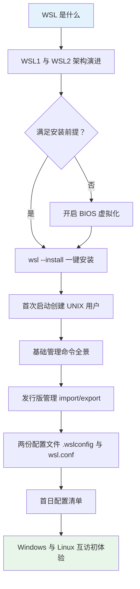
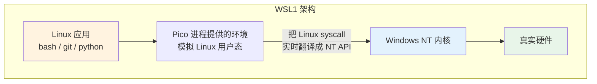
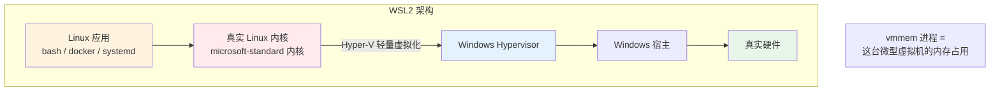

# 01 - WSL 入门与安装

> 你在 Windows 上写代码，但教程、工具链、部署环境全是 Linux 的。双系统要重启、虚拟机笨重缓慢——而 WSL（Windows Subsystem for Linux）让你在 Windows 里直接拥有一个秒级启动的 Linux 环境，文件互通、内存按需分配。本章带你从零装好第一个发行版，并理解它的基本管理方式。

---

## 阅读前提

- Windows 10 2004 及以上版本，或 Windows 11（建议 Win11，体验更完整）
- 电脑 BIOS 已开启虚拟化（绝大多数机器默认开启，后文有检查方法）
- 熟悉基本命令行操作，可回顾 [[../06-命令行基础与Shell入门|命令行基础与 Shell 入门]]

## 本章路线图



---

## 1.1 WSL 定位：它到底解决什么问题

WSL 是微软官方提供的 **Windows 子系统**，让 Linux 用户态环境直接跑在 Windows 内核之上或轻量虚拟机之中。对开发者而言，它的核心价值有三点：

| 能力 | 说明 | 对比传统方案 |
|------|------|--------------|
| 秒级启动 | `wsl` 命令敲下即进入 shell，冷启动不到 3 秒 | 双系统需重启切换，VM 冷启动数十秒 |
| 文件互通 | `/mnt/c` 直接访问 Windows 盘；Windows 资源管理器直接进 Linux 文件系统 | VM 需共享文件夹或网络传输 |
| 内存按需 | WSL2 虚拟机按实际使用动态归还内存给 Windows | 传统 VM 启动即占满配置的固定内存 |
| 工具链原生 | apt/git/systemd 等真实 Linux 行为 | Git for Windows / MSYS2 只是模拟 |

### 三种方案的取舍一句话

**双系统**性能最完整但需要重启切换、无法同时使用两边软件；**虚拟机（VirtualBox/VMware）**隔离彻底但吃内存、启动慢、剪贴板和文件共享都要额外配置；**WSL** 则取中间最优解——Linux 环境像 Windows 进程一样随开随用，代价是与真实硬件隔离更深（详见 [[07-WSL与虚拟机协作]] 中它与完整 VM 的协作与边界）。

> 选型速记：想"在 Windows 里日常用 Linux 命令行开发"，选 WSL；想做内核实验、需要独立桌面环境或严格网络隔离，选 VM。

---

## 1.2 架构演进：从翻译层到真内核

理解 WSL1 与 WSL2 的区别，是后面所有章节的基础。

### WSL1：系统调用翻译层



WSL1 没有 Linux 内核。Linux 程序发出的每个系统调用（open/read/fork）被 NT 内核中的翻译层动态转换成对应的 Windows 调用。优点是文件读写极快（直接走 NTFS）、内存占用极小；缺点是**不完整**——很多依赖特殊系统调用的程序（Docker、部分数据库、iptables）根本跑不起来。

### WSL2：轻量级实用虚拟机 + 真 Linux 内核



WSL2 使用 Hyper-V 的轻量虚拟化技术运行一个**真正的 Linux 内核**（微软编译的 microsoft-standard 版本），所有系统调用都是真实的 Linux 行为，兼容性接近裸机。代价是需要虚拟化支持、文件跨系统访问变慢（第 02 章详述）。2019 年之后 WSL2 成为默认，本章后续内容均以 WSL2 为准。

| 对比项 | WSL1 | WSL2 |
|--------|------|------|
| 是否有 Linux 内核 | 无，syscall 翻译 | 有，真实内核 |
| Docker / systemd 支持 | 不支持 | 完整支持 |
| 访问 Windows 文件（/mnt/c） | 极快 | 较慢（9P 协议） |
| 访问 Linux 文件（~） | 慢 | 快（ext4） |
| 需要 BIOS 虚拟化 | 否 | 是 |
| 当前默认 | 否 | 是 |

---

## 1.3 安装前置要求

1. **系统版本**：Windows 10 版本 2004（内部版本 19041+）或 Windows 11。查看方法：`Win + R` 输入 `winver`。
2. **BIOS 虚拟化开启**：任务管理器 → 性能 → CPU，右下角"虚拟化"显示"已启用"即为 OK。
3. 若显示"已禁用"，需进 BIOS 打开 Intel VT-x 或 AMD-V（不同主板按键不同，常见为开机按 F2/Del）。

---

## 1.4 一键安装：wsl --install

管理员身份打开 PowerShell：

```powershell
# 一键安装：自动启用所需功能、下载内核、安装默认发行版 Ubuntu
wsl --install
```

执行完**重启电脑**，Ubuntu 会自动弹出窗口开始初始化。

### 指定发行版安装

默认安装的是 Ubuntu。想换别的：

```powershell
# 查看官方可安装的发行版列表
wsl --list --online

# 输出示例（节选）
# NAME                   FRIENDLY NAME
# Ubuntu                 Ubuntu
# Debian                 Debian GNU/Linux
# kali-linux             Kali Linux Rolling
# openSUSE-Tumbleweed    openSUSE Tumbleweed
# OracleLinux_9          Oracle Linux 9

# 安装指定发行版
wsl --install -d Debian
```

可以同时安装多个发行版并存，互不干扰（多发行版管理的通用思想可对照 [[../02-多发行版安装指南|多发行版安装指南]]，只是那里讲的是裸机场景）。

---

## 1.5 旧版手动安装路径（简述）

如果你的系统较老、`wsl --install` 不可用，手动路径分三步：

```powershell
# 1. 以管理员身份启用两个 Windows 功能
dism.exe /online /enable-feature /featurename:Microsoft-Windows-Subsystem-Linux /all /norestart
dism.exe /online /enable-feature /featurename:VirtualMachinePlatform /all /norestart

# 2. 重启后，设置默认版本为 WSL2
wsl --set-default-version 2

# 3. 若提示内核缺失，下载并安装"WSL2 Linux 内核更新包"
#    （微软官网搜索 wsl_update_x64.msi）
```

新版 Windows 上这些步骤已被 `wsl --install` 全部接管，此路径仅作了解。

---

## 1.6 首次启动：创建 UNIX 用户

安装完成后首次打开 Ubuntu 终端，会依次询问：

```text
Enter new UNIX username: dev
New password: ********
Retype new password: ********
```

关键认知：

- 这个用户名/密码**只属于 Linux 侧**，与你的 Windows 账号完全无关，忘了密码可以在 Windows 侧用 `ubuntu config --default-user root` 重置。
- 该用户在 Linux 侧属于 `sudo` 组，具备提权能力（sudo 机制详解见 [[../08-用户与权限管理|用户与权限管理]]）。
- 执行 `sudo` 时输入的就是这个密码，且默认 15 分钟内免重复输入。

---

## 1.7 基础命令全景表

所有 `wsl` 管理命令都在 **PowerShell/CMD** 中执行，不是在 Linux shell 里。

| 命令 | 作用 | 备注 |
|------|------|------|
| `wsl -l -v` | 列出已装发行版及版本（WSL1/2）、运行状态 | 最常用 |
| `wsl --status` | 查看默认发行版、WSL 版本、内核版本 | 排障第一步 |
| `wsl -t <名称>` | 温和终止指定发行版 | 数据会落盘 |
| `wsl --shutdown` | 关闭整个 WSL 虚拟机及全部发行版 | 改配置后必须执行 |
| `wsl -d <名称>` | 进入指定发行版 | 多发行版时切换用 |
| `wsl --set-default <名称>` | 设置默认发行版 | 裸敲 `wsl` 进入的那个 |
| `wsl --unregister <名称>` | **注销发行版** | 警告：该发行版全部数据被永久删除，不可恢复 |
| `wsl --update` | 更新 WSL 自身组件与内核 | 修 GUI/网络问题时常用 |

> `--unregister` 是 WSL 世界里的"格式化 C 盘"。执行前务必 export 备份（见下一节）。

---

## 1.8 发行版管理：Store 安装与 import/export

### Store 安装

Microsoft Store 中搜索 Ubuntu/Debian 等直接安装，效果等同 `wsl --install -d`，本质一样。

### export 导出备份

```powershell
# 将 Ubuntu 导出为 tar 归档（包含完整根文件系统）
wsl --export Ubuntu D:\backup\ubuntu-20260825.tar
```

导出的 tar 就是这个发行版的完整快照：所有文件、已装软件、你的 home 目录全在里面。定期备份是好习惯。

### import 导入自定义发行版（迁移场景）

典型场景：C 盘满了，想把整个发行版搬到 D 盘。

```powershell
# 1. 导出原发行版
wsl --export Ubuntu D:\backup\ubuntu.tar

# 2. 注销原发行版（数据已被备份，放心删）
wsl --unregister Ubuntu

# 3. 从 tar 导入到 D 盘新位置
wsl --import Ubuntu D:\WSL\Ubuntu D:\backup\ubuntu.tar --version 2

# 4. 设置默认登录用户（import 后默认以 root 登录，需要指回普通用户）
ubuntu config --default-user dev
```

import 同样可以用来分发自定义镜像：团队里一个人配好环境导出 tar，其他人 import 即得一模一样的环境——这是没有容器时代最朴素的"环境复制"方案。

---

## 1.9 两份配置文件总览

WSL 的配置分为两层，作用域和位置都不同，初学者最容易混淆：

| 配置文件 | 所在位置 | 管什么 |
|----------|----------|--------|
| `.wslconfig` | Windows 侧 `%UserProfile%\.wslconfig` | 整个 WSL 虚拟机的全局资源上限 |
| `/etc/wsl.conf` | 各发行版的 Linux 侧 | 单个发行版的行为（挂载、网络、systemd 等） |

### .wslconfig：Windows 侧全局资源控制

文件位于 `C:\Users\<你>\.wslconfig`，不存在就新建：

```ini
# 只影响 WSL2，对 WSL1 无效
[wsl2]
# 虚拟机可用内存上限（默认约为物理内存的一半）
memory=8GB
# 分配的处理器核数（默认全部）
processors=4
# 交换空间大小（默认 25% 内存大小）
swap=8GB
# swap 虚拟盘存放位置（C 盘紧张时可挪走）
swapFile=D:\\WSL\\swap.vhdx
# 不用的内存是否逐步归还 Windows（默认 true）
autoMemoryReclaim=gradual
# 是否允许 Windows 访问 WSL 的 localhost 服务（默认 true）
localhostForwarding=true
```

逐行的意义：`memory` 防止 vmmem 吃光内存卡死宿主；`processors` 给宿主留算力；`swap` 在内存不足时兜底；`autoMemoryReclaim` 解决"WSL 用过一次内存就不还"的老问题。

### /etc/wsl.conf：Linux 侧单发行版行为

```ini
[automount]
# 是否自动把 Windows 盘挂到 /mnt 下
enabled = true
# 挂载选项：metadata 让 chmod/chown 对 NTFS 生效
options = "metadata,umask=22,fmask=11"

[network]
# 主机名（默认继承 Windows 主机名）
hostname = wsl-dev
# 是否自动生成 /etc/hosts
generateHosts = true

[interop]
# 是否允许从 Linux 里直接运行 .exe
enabled = true
# 关键开关：是否把 Windows PATH 追加进 $PATH
appendWindowsPath = false

[user]
# 默认登录用户
default = dev

[boot]
# systemd 开关（详见 03 章）
systemd = true
```

其中 `appendWindowsPath = false` 值得单独强调：默认情况下 Windows 的 PATH 全部注入 Linux 的 `$PATH`，导致你在 Linux 里能敲出 `code`、`notepad.exe`，也导致 PATH 冗长、同名命令冲突。关掉它即可实现干净的 PATH 隔离（PATH 原理见 [[../07-PATH深入与环境变量全书|PATH 深入与环境变量全书]]）。

### 生效规则：改完必须 shutdown

两份配置文件都**只在 WSL 启动时读取**。改完任何一处，必须执行：

```powershell
wsl --shutdown
```

再重新进入才生效。这是 WSL 新手排障第一名："我明明改了为什么没用"——因为没重启。

---

## 1.10 首日配置清单

新装好的 Ubuntu，建议按顺序完成以下几件事。

### 更新软件源索引

```bash
sudo apt update && sudo apt upgrade -y
```

国内网络环境下可将 `/etc/apt/sources.list` 换成清华/阿里镜像源（各镜像站首页都有现成的替换说明，一行 sed 即完成），下载速度差距可达十倍以上。apt 的体系结构详见 [[../14-软件包管理通识|软件包管理通识]]。

### 配置中文 locale

```bash
sudo apt install -y locales
sudo dpkg-reconfigure locales   # 选择 zh_CN.UTF-8
locale                          # 查看当前生效值
```

如果输出中 LANG 相关字段为空或为 POSIX，中文文件名会显示异常。locale 的生成机制在 [[../06-命令行基础与Shell入门|命令行基础与 Shell 入门]] 有详细回顾；`LANG/LC_ALL` 等变量的优先级规则见 [[../07-PATH深入与环境变量全书|PATH 深入与环境变量全书]] 的变量章节。

### 安装基础编译工具链

```bash
sudo apt install -y build-essential curl git
gcc --version   # 验证
```

`build-essential` 打包了 gcc/g++/make/libc 头文件，是几乎所有源码编译的前置依赖。

---

## 1.11 互访初体验：两个世界握手

### 从 Linux 访问 Windows：/mnt/c

```bash
ls /mnt/c/Users      # Windows 的 C:\Users
cd /mnt/d/projects   # D 盘目录
```

所有本地磁盘按盘符自动挂载在 `/mnt` 下（由前文 `[automount]` 控制）。

### 从 Windows 访问 Linux：\\wsl$

打开资源管理器，地址栏输入：

```text
\\wsl$\Ubuntu\home\dev
\\wsl.localhost\Ubuntu\home\dev   # 新写法，二者等价
```

可以直接浏览、编辑 Linux 侧文件，也可以把这个路径收藏到快速访问。VS Code 的 Remote-WSL 底层同样基于这条通道（见 [[05-VSCode与SSH开发]]）。

### localhost 直通测试

WSL2 最贴心的特性之一：Linux 里监听的端口，Windows 用 `localhost` 就能访问。

```bash
# 在 WSL 里起一个 HTTP 服务
python3 -m http.server 8000
```

然后在 Windows 浏览器打开 `http://localhost:8000`——能看到文件列表即直通成功。原理与反向（外部设备访问 WSL）在第 02 章网络部分展开。

---

## 本章小结

- WSL2 是 Hyper-V 轻量 VM + 真 Linux 内核，兼容性接近裸机，是当前唯一推荐的形态
- `wsl --install` 一键搞定；`--export/--import` 是迁移与备份的核心组合
- `.wslconfig` 管全局资源（Windows 侧），`/etc/wsl.conf` 管单发行版行为（Linux 侧），改完必须 `wsl --shutdown`
- `--unregister` 会永久删除数据，执行前先 export
- 代码放 Linux 侧（~），通过 `\\wsl$` 和 localhost 直通获得最佳体验

