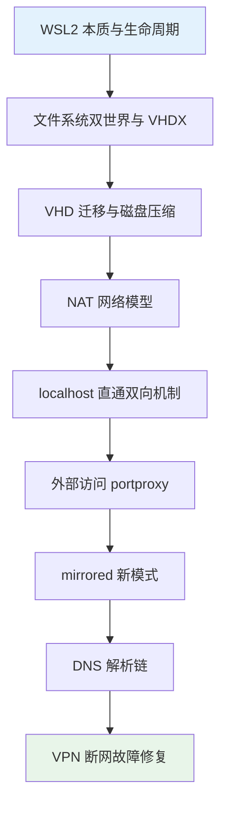
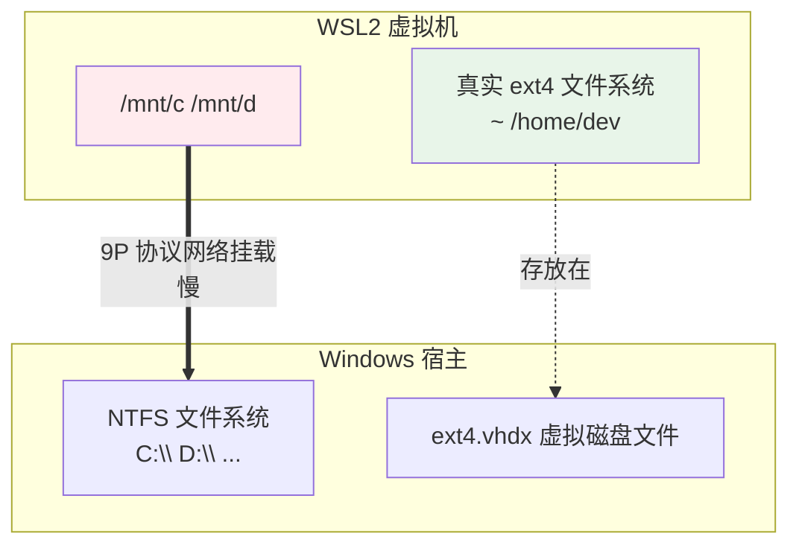
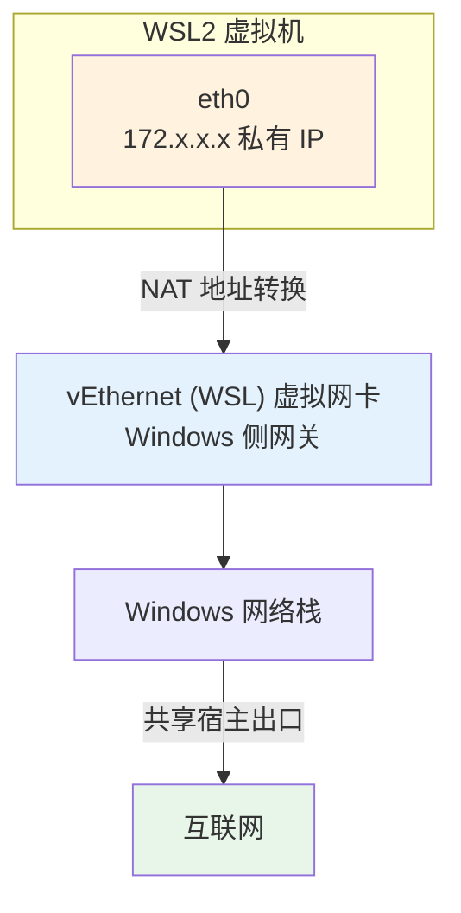
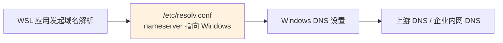

# 02 - WSL2 架构与网络

> 上一章装好了 WSL，但"它到底是怎么跑起来的"决定了你排障的上限：vmmem 是什么、VHDX 磁盘为什么只涨不缩、localhost 为什么能直通、VPN 一连就断网又是为什么。本章把 WSL2 的运行时与网络模型一次讲透。

---

## 阅读前提

- 已按 [[01-WSL入门与安装]] 完成安装并了解 `.wslconfig` 与 `/etc/wsl.conf` 的分工
- 对虚拟化有基本概念（可对照 [[../09-虚拟机配置与打包|虚拟机配置与打包]]）
- 了解基础网络术语，可回顾 [[../13-网络配置基础|网络配置基础]]

## 本章路线图



---

## 2.1 WSL2 本质：Hyper-V 轻量实用分区

WSL2 不是"模拟器"，而是一台由 Hyper-V 托管的**轻量实用 VM**（utility VM）。它没有完整的虚拟硬件栈，去掉了 BIOS/显卡模拟等冗余，启动路径极短，所以才能秒级开机。

验证内核真身：

```bash
uname -a
# Linux wsl-dev 5.15.167.4-microsoft-standard-WSL2 ... GNU/Linux
```

`microsoft-standard` 字样说明这是微软编译维护的 Linux 内核，版本号跟随 `wsl --update` 更新。这是一个货真价实的 Linux 内核——Docker、systemd、eBPF 都因此成为可能。

### 生命周期与 vmmem

```text
PowerShell: wsl                    → 虚拟机冷启动（约 1~3 秒）→ 进入 shell
关闭所有终端 + 无后台进程          → 空闲约 8 秒后自动回收，VM 关机
任务管理器: vmmem 进程             → 就是这台 VM 的内存占用实体
PowerShell: wsl --shutdown         → 强制立刻关掉整台 VM
```

要点：

- **vmmem** 在任务管理器里显示的内存就是 Linux 侧实际占用量，它按需增长；新版 WSL 配合 `.wslconfig` 的 `autoMemoryReclaim=gradual` 会逐步归还。
- 只要还有进程在跑（比如一个 sshd 或 docker daemon），VM 就不会自动回收。发现 vmmem 占用异常时先想"Linux 里有什么还活着"。
- 查询当前状态的两个顺手命令：`wsl -l -v` 看每个发行版的 Running/Stopped 状态；Linux 内 `systemd-detect-virt` 会返回 `wsl`，确认自己身处的环境。
- "空闲回收"只关 VM，不删数据——ext4 状态完整保存在 VHDX 中，下次 `wsl` 命令敲下即恢复原样。

---

## 2.2 文件系统双世界

WSL2 中存在两套文件系统，性能特征截然相反，这是日常使用最重要的知识点。

### 两套世界的结构



- **Linux 侧**（`~/...`）：真正的 ext4，数据物理上存在 `%LocalAppData%\Packages\<发行版包名>\LocalState\ext4.vhdx` 这个虚拟磁盘里。读写速度接近原生。
- **Windows 侧**（`/mnt/c/...`）：通过 9P 文件共享协议跨 VM 边界访问 NTFS，每个文件操作都有网络往返开销。

### 性能差异实测参考

同一份中等规模前端项目分别在两个位置执行：

| 操作 | 位置：Linux 侧 ~ | 位置：/mnt/c | 差距 |
|------|------------------|--------------|------|
| `git status` | 约 0.3 秒 | 约 8 秒 | 20 倍以上 |
| `npm install`（冷缓存） | 约 40 秒 | 约 6 分钟 | 近 10 倍 |
| `find . -name "*.ts"` | 约 1 秒 | 约 25 秒 | 20 倍以上 |

（数值随机器浮动，量级稳定。）结论即铁律：**项目代码必须放在 Linux 侧的 `~` 下，不要放在 /mnt/c**。VS Code Remote-WSL 的最佳实践同样如此（[[06-开发环境实战]] 有完整工作流）。反过来，如果某个工具必须在 NTFS 上操作（比如给 Windows 侧项目跑格式化），那就在 PowerShell 里跑原生工具，别绕道 WSL。

---

## 2.3 VHD：位置、迁移与膨胀

### VHD 在哪里

默认路径形如：

```text
C:\Users\<你>\AppData\Local\Packages\CanonicalGroupLimited.Ubuntu...\LocalState\ext4.vhdx
```

Store 版与 import 版位置不同，最可靠的查找方式是看注册表或直接搜索 `ext4.vhdx`。

### 整盘迁移到 D 盘

C 盘空间紧张时的标准流程（复用第 01 章 import/export 组合拳）：

```powershell
# 1. 关闭 WSL
wsl --shutdown

# 2. 导出整个发行版
wsl --export Ubuntu D:\backup\ubuntu.tar

# 3. 注销（此时 C 盘上的 vhdx 被删除）
wsl --unregister Ubuntu

# 4. 导入到 D 盘新家
wsl --import Ubuntu D:\WSL\Ubuntu D:\backup\ubuntu.tar --version 2

# 5. 指回默认用户
ubuntu config --default-user dev
```

### 膨胀原理：动态扩展只增不减

VHDX 是动态扩展磁盘——写入数据时文件变大，但**删除 Linux 里的文件并不会让 vhdx 变小**。已分配给虚拟磁盘的空间会一直保留。长期使用后常见几十 GB 的 vhdx 而 Linux 内 `df -h` 只显示用了十几 GB。

### 两条压缩回收路径

前提都是先关机：

```powershell
wsl --shutdown
```

**路径一：diskpart（所有版本可用，推荐）**

```powershell
diskpart
# 进入 diskpart 交互后依次执行：
select vdisk file="C:\Users\<你>\AppData\Local\Packages\CanonicalGroupLimited.Ubuntu...\LocalState\ext4.vhdx"
attach vdisk readonly
compact vdisk
detach vdisk
exit
```

**路径二：Optimize-VHD（需要 Hyper-V 模块，Win 专业版）**

```powershell
Optimize-VHD -Path "C:\Users\<你>\...\ext4.vhdx" -Mode Full
```

两者效果等价，都是把稀疏空间归还宿主。执行后可用 `dir` 对比 vhdx 文件大小确认回收效果。

> 提示：compact 只回收"已 trim/未使用"的空间。先在 Linux 里删掉无用数据、执行 `fstrim -a`，再关机 compact，回收量才最大化。

### fstrim：日常轻量维护

```bash
sudo fstrim -a
```

在 Linux 侧执行 trim，告诉虚拟磁盘哪些块已经不再使用。它不能立刻缩小 vhdx，但配合上面的 compact 能提高回收效率，建议作为每月一次的例行维护。

---

## 2.4 网络：NAT 模式原理

默认网络模式下，WSL2 位于一个 NAT 后面的私有网段。



- WSL 内 `ip addr` 看到的 eth0 地址通常是 `172.16.x.x ~ 172.31.x.x` 私有网段。
- Windows 上出现一块 `vEthernet (WSL)` 虚拟网卡充当网关。
- 出网流量全部经 Windows NAT 转发，DNS 默认也交给 Windows 处理（见 2.7 节）。

这套机制对"WSL 主动出网"完全透明，麻烦都出在"别人进来"的方向。

---

## 2.5 localhost 直通：双向机制

### 方向一：WSL 访问 Windows 服务

Windows 上起的服务（比如 3000 端口的开发服务器），WSL 里直接：

```bash
curl http://localhost:3000   # 可达
```

WSL 会自动把 localhost 解析到 Windows 宿主侧。

### 方向二：Windows 访问 WSL 服务

WSL 里监听的端口，Windows 浏览器打开 `http://localhost:<端口>` 即达。这由 localhostForwarding 实现（`.wslconfig` 中 `[wsl2] localhostForwarding=true`，默认开启）。底层是 Windows 侧自动把 localhost 流量转发进 VM。

> 注意：直通绑定的是 localhost 回环。局域网里其他设备默认**无法**访问你的 WSL 服务，这正是下一节要解决的问题。

---

## 2.6 外部设备访问 WSL 服务：portproxy

场景：手机要访问你电脑上跑的 WSL 开发服务器。因为 WSL 在 NAT 后面，需要在 Windows 上做端口转发。

```powershell
# 管理员 PowerShell：把 Windows 的 8080 转发到 WSL 的 8080
netsh interface portproxy add v4tov4 `
  listenport=8080 `
  listenaddress=0.0.0.0 `
  connectaddress=$(wsl hostname -I).Trim() `
  connectport=8080
```

完整可重复脚本（保存为 `forward-wsl.ps1`）：

```powershell
$wslIp = (wsl hostname -I).Trim().Split(" ")[0]
netsh interface portproxy reset
netsh interface portproxy add v4tov4 listenport=8080 listenaddress=0.0.0.0 connectaddress=$wslIp connectport=8080
Write-Host "8080 -> $wslIp`:8080"
```

然后放行防火墙（对照 [[../24-防火墙与安全|防火墙章]] 的规则语法）：

```powershell
New-NetFirewallRule -DisplayName "WSL Port 8080" -Direction Inbound -LocalPort 8080 -Protocol TCP -Action Allow
```

### 持久化问题：IP 会变

每次 WSL 重启，虚拟机 IP 大概率变化，静态 portproxy 立刻失效。通用解法思路：

1. 把上面的转发脚本放到一个 `.ps1`；
2. 用 Windows 任务计划程序建一个"登录时/开机时"触发的任务执行它；
3. 更稳妥的变体是让脚本轮询 `wsl hostname -I` 直到拿到非空值再注册转发（WSL 启动可能晚于任务触发）。

或者干脆升级到下一节的 mirrored 模式，从根上消灭这个问题。

---

## 2.7 mirrored 新网络模式

Win11 22H2 及以上 + 新版 WSL 支持 mirrored（镜像）网络模式，在 `.wslconfig` 中开启：

```ini
[wsl2]
networkingMode=mirrored
```

`wsl --shutdown` 后生效。特性对比：

| 能力 | NAT（默认） | mirrored |
|------|-------------|----------|
| WSL IP | 独立 172.x 私有 IP | 与主机相同 |
| IPv6 | 不支持 | 支持 |
| localhost 行为 | 单向自动转发 | 双向一致，行为与裸机相同 |
| 外部设备访问 | 需 portproxy | 直接可达（仍需防火墙放行） |
| VPN 兼容性 | 常出问题 | 显著改善 |

已知兼容性问题提示：mirrored 依赖较新的 Windows 网络组件，少数代理软件、抓包驱动（如旧版 Npcap）与之冲突，表现为 WSL 完全断网。遇到时可回退 NAT 排查是否为第三方软件引起。

---

## 2.8 DNS 解析链

默认链路：



WSL 启动时自动生成 `/etc/resolv.conf`，内容通常是一行 `nameserver 172.x.x.1`——指向 Windows 侧的虚拟网关，由 Windows 代为解析。好处是零配置跟随宿主；坏处是不受你控制。

### 手动接管 resolv.conf

场景：需要固定 DNS、使用公司内网 DNS、或被 VPN 干扰时。步骤：

```ini
# /etc/wsl.conf
[network]
generateResolvConf = false
```

```bash
sudo rm /etc/resolv.conf
echo "nameserver 223.5.5.5" | sudo tee /etc/resolv.conf
sudo chattr +i /etc/resolv.conf   # 防止被重新生成覆盖
```

`wsl --shutdown` 生效。DNS 原理本身见 [[../25-DNS与域名系统|DNS 与域名系统]]。

---

## 2.9 经典故障：连上企业 VPN 就断网

症状：平时一切正常，一连公司 VPN，WSL 里 ping 不通任何域名（IP 也常常不通）。

根因：多数企业 VPN 接管了 Windows 全部 DNS，把解析强制导向 VPN 内部 DNS 服务器；NAT 模式下 WSL 的 resolv.conf 指向的那条转发链被掐断，于是"域名全挂"。部分 VPN 还会丢弃来自未知虚拟网段的流量。

修复方案按优先级：

1. **换 mirrored 模式**（Win11）：网络栈与宿主一致，绝大多数 VPN 场景直接痊愈。
2. **手动 resolv.conf**：按 2.8 节固定为公共 DNS 或公司 DNS，绕过自动生成。
3. 终极手段：在 VPN 提供的拆分隧道设置中放行 WSL 网段（需要管理员配合）。

排障顺序口诀：先 `ping 8.8.8.8` 分清"IP 不通"还是"只有域名不通"——前者找 VPN/防火墙，后者九成是 DNS。

一个补充判断技巧：在 Windows 侧执行 `nslookup baidu.com`，若 Windows 自己也解析失败，问题在 VPN 本身而非 WSL；若 Windows 正常而 WSL 失败，才是本章讨论的转发链被劫持场景。把宿主与子系统分开验证，能少走一半弯路。

---

## 2.10 网络排障速查表

把本章所有故障收敛成一张按症状索引的表，遇到问题时自上而下对号入座：

| 症状 | 第一检查点 | 第二检查点 | 对应章节 |
|------|-----------|-----------|----------|
| WSL 内完全断网 | `ping 223.5.5.5` 分层 | VPN 是否刚连接 | 2.9 |
| 域名解析失败但 IP 可达 | `cat /etc/resolv.conf` | 是否被 VPN 劫持 | 2.8 |
| Windows 访问不了 WSL 服务 | 服务是否监听 0.0.0.0 而非 127.0.0.1 | localhostForwarding 配置 | 2.5 |
| 手机等外部设备访问失败 | portproxy 是否注册 | 防火墙是否放行、IP 是否已漂移 | 2.6 |
| 改了 mirrored 后彻底断网 | `wsl --status` 确认模式生效 | 第三方代理/抓包驱动冲突 | 2.7 |
| resolv.conf 反复被改回 | generateResolvConf 是否关闭 | chattr +i 是否执行 | 2.8 |
| WSL 内 IP 显示 169.254.x.x | VM 未正确获取地址，先 shutdown 重启 | Hyper-V 服务是否正常 | 2.4 |

两个通用诊断命令值得背下来：

```bash
# Linux 侧：确认当前拿到的 IP 与网段
ip addr show eth0
# Windows 侧：确认当前 NAT/mirrored 模式与虚拟网卡状态（PowerShell）
wsl --status; Get-NetAdapter | Where-Object Name -like "*WSL*"
```

另外注意应用层的监听地址：Node 的 dev server 默认可能只监听 `127.0.0.1`，即使网络层一切正常，Windows 也访问不到。此时给服务加上监听所有接口的参数（如 `--host 0.0.0.0`）即可。这类"网络通了但应用不通"的问题，先看 `ss -tlnp` 里服务绑的是哪个地址。

---

## 本章小结

- WSL2 = Hyper-V 轻量 VM + microsoft-standard 真 Linux 内核；vmmem 就是它的内存化身
- 代码放 `~`（ext4/VHDX），别放 `/mnt/c`，性能差距一个数量级
- VHDX 只增不减；`wsl --export/unregister/import` 迁移，diskpart compact 回收空间
- 默认 NAT 模式：localhost 直通很方便，外部访问靠 portproxy 且要注意 IP 漂移
- mirrored 模式一举解决 IP 同步、IPv6、VPN 兼容三大痛点（Win11 22H2+）
- VPN 断网先分清 IP 层还是 DNS 层，再选 mirrored 或手动 resolv.conf

