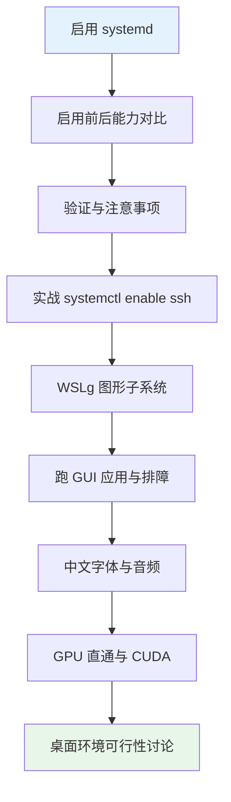
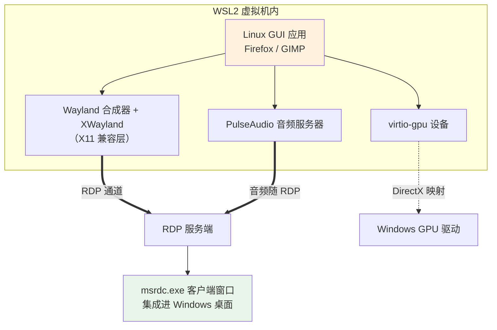

# 03 - systemd 与系统集成

> 早期的 WSL 是个"无 init 的命令行盒子"：没有 systemd，服务自启靠玄学，日志散落各处，Docker 要绕路装。2022 年微软正式加入 systemd 支持后，WSL 才成为一个真正意义上的 Linux 系统——顺带，WSLg 让 GUI 应用原生出现在 Windows 桌面，GPU 直通让 Linux 里也能跑 CUDA。本章把这些"系统集成"能力一次配齐。

---

## 阅读前提

- 已完成 [[01-WSL入门与安装]] 并熟悉 `/etc/wsl.conf` 的写法
- 了解 [[../11-systemd服务管理|systemd 服务管理]] 的基本概念（unit/enable/status）
- WSL 为 Store 版且版本号不低于 0.67.6（`wsl --version` 查看）

## 本章路线图



---

## 3.1 启用 systemd

### 写入配置

编辑 `/etc/wsl.conf`，加入（或确认已有）：

```ini
[boot]
systemd = true
```

然后 `wsl --shutdown` 重启生效。

### 版本要求

| 组件 | 最低要求 | 检查方法 |
|------|----------|----------|
| WSL 本体 | Store 版 0.67.6+ | PowerShell: `wsl --version` |
| 发行版 | Ubuntu 22.04+（自带 systemd 249+） | `cat /etc/os-release; systemctl --version` |
| 内核 | 较新的 microsoft-standard 内核 | `uname -r` |

```bash
# Linux 内确认当前是否已启用
ps -p 1 -o comm=
cat /etc/wsl.conf   # 查看现有配置，避免重复段落
```

### 版本检查一键脚本

```powershell
# PowerShell 中执行，一次看全四项版本信息
wsl --version; wsl --status
wsl -d Ubuntu -- bash -c "cat /etc/os-release | head -2; systemctl --version | head -1"
```

老版本 WSL 先执行 `wsl --update`；从旧版"msix 安装包时代"升级的用户建议直接重装 Store 版。

---

## 3.2 启用前后对比

| 能力 | systemd=false | systemd=true |
|------|---------------|--------------|
| `systemctl` 命令 | 报错 "System has not been booted with systemd" | 完整可用 |
| `journalctl` 日志 | 无系统日志可查 | 完整 journal |
| sshd 开机自启 | 手动脚本模拟，不可靠 | `systemctl enable` 真正生效 |
| Docker Engine | 无法以官方方式安装运行 | 正常安装运行 |
| snap 包管理器 | 不工作（依赖 systemd） | 正常使用 |
| 定时器 systemd timer | 不可用 | 可替代 cron 的现代方案 |

一句话总结：没有 systemd 的 WSL 只是一个"能跑 shell 的兼容层"；有了它，[[../11-systemd服务管理|systemd 服务管理]] 中学到的所有技能原封不动地适用。

---

## 3.3 验证与注意事项

### 验证 1 号进程

```bash
ps -p 1 -o comm=
# 未启用时输出: init（其实是微软的精简 init）
# 启用后输出:   systemd
```

再看一眼整体状态：

```bash
systemctl list-units --type=service --state=running | head
journalctl -b --no-pager | tail -20
```

### 两点注意

1. **启动变慢**：systemd 要拉起一堆单元，WSL 冷启动从约 1 秒变成 3~5 秒。对交互体验影响很小，但如果你高频启停且不需要服务，可以保持关闭。
2. **行为差异**：极少数老脚本假设了"WSL 没有 systemd"的行为（例如自己往 /etc/init.d 或 profile 里塞启动逻辑），启用后可能出现服务被拉起两次。迁移老环境时检查一下 `/etc/profile`、`~/.bashrc` 里有没有手工启动服务的残留。

---

## 3.4 systemd 深度使用速成

systemd 启用后，[[../11-systemd服务管理|systemd 服务管理]] 的全部玩法在 WSL 中照单全收。这里补几个 WSL 场景下高频的操作片段。

### journalctl：终于有了正经日志

```bash
journalctl -b                      # 本次启动以来的全部日志
journalctl -u ssh                  # 只看 sshd 单元的日志
journalctl -f                      # 实时跟踪（类似 tail -f）
journalctl --since "10 min ago"    # 最近十分钟
```

没有 systemd 时，WSL 里服务日志要么不产生、要么散落在 /var/log 各个文件里；现在统一进 journal，排障效率完全不同。

### 写一个自己的开机自启服务

假设你在 `~/scripts/sync-notes.sh` 有一个笔记同步脚本，想让它随 WSL 启动自动运行：

```ini
# /etc/systemd/system/sync-notes.service
[Unit]
Description=Sync notes on startup
After=network.target

[Service]
Type=oneshot
User=dev
ExecStart=/home/dev/scripts/sync-notes.sh

[Install]
WantedBy=multi-user.target
```

```bash
sudo systemctl daemon-reload
sudo systemctl enable sync-notes.service
```

下次 WSL 启动（包括空闲回收后的重新拉起）它就会执行。相比往 `.bashrc` 里塞命令的土办法：不依赖你开终端、失败有 journal 可查、可精确控制启动顺序。

### timer 替代 cron

WSL 中 cron 服务默认未必运行，而 systemd timer 随系统天然可用：

```ini
# /etc/systemd/system/backup.timer
[Unit]
Description=Daily backup

[Timer]
OnCalendar=*-*-* 03:00:00
Persistent=true

[Install]
WantedBy=timers.target
```

`Persistent=true` 的意义在 WSL 里尤其大：VM 经常被回收重启，错过的任务会在下次启动时补跑。计划任务的通用知识见 [[../15-计划任务与自动化|计划任务与自动化]]。

---

## 3.5 实战：sshd 开机自启

这是 systemd 在 WSL 上最实用的场景之一——让 SSH 服务常驻，为 [[05-VSCode与SSH开发]] 的远程连接铺路。

```bash
sudo apt install -y openssh-server
sudo systemctl enable --now ssh     # 开机自启 + 立即启动
systemctl status ssh                # active (running) 即成功
```

之后即使 `wsl --shutdown` 再进入，sshd 都会随系统自动拉起。注意两点：

- WSL 默认 NAT 模式下 IP 会漂移，SSH 连接目标地址不固定；mirrored 模式下直接连 localhost 最省心（网络原理见 [[02-WSL2架构与网络]]）。
- 想改端口或禁密码登录，编辑 `/etc/ssh/sshd_config` 后 `systemctl restart ssh`。
- 密钥登录的配置与安全加固（禁 root、禁密码等）完整做法见 [[../23-SSH远程管理|SSH 远程管理]]，WSL 场景完全一致。

---

## 3.6 WSLg：图形子系统

WSLg 让 Linux GUI 应用以"原生窗口"的形态出现在 Windows 桌面上，看起来就像 Windows 程序一样能拖动、贴任务栏。它是 Store 版 WSL 自带组件，无需单独安装。

### 架构



要点拆解：

- 应用画在 Wayland/X11 上，画面经 **RDP 协议**传给 Windows 侧的 `msrdc.exe` 渲染成普通窗口。
- **音频**同样走 RDP 通道（PulseAudio over RDP），应用发声直接从 Windows 扬声器出来。
- **GPU** 通过 virtio-gpu 暴露给 Linux，最终映射到宿主的 DirectX 驱动（详见 3.7 节）。
- 剪贴板文本互通开箱即用；**文件拖放**目前支持有限，跨系统复制文件仍推荐走 `\\wsl$` 路径或 `/mnt/c`。

### 环境要求与升级

- Win10 21H2+ 或 Win11；Store 版 WSL 自带全套组件。
- 表现异常先升级：

```powershell
wsl --update
wsl --shutdown
```

---

## 3.7 跑第一个 GUI 应用

```bash
sudo apt install -y firefox-esr
firefox-esr &
# 数秒后一个 Firefox 窗口出现在 Windows 桌面上，任务栏也有它的图标
```

再试 GIMP、gnome-text-editor 等均可。也可以从 Windows 开始菜单直接点击它们——安装 GUI 应用时会自动生成开始菜单快捷方式。

### 显示相关环境变量

```bash
echo $DISPLAY          # 通常为 :0
echo $WAYLAND_DISPLAY  # 通常为 wayland-0
ls /tmp/.X11-unix/     # X11 socket 存在即通道正常
```

X11 应用看 `$DISPLAY`，Wayland 原生应用看 `$WAYLAND_DISPLAY`。SSH 进来后这两个变量可能为空，需要手动补上才能转发 GUI。

### 日常使用细节清单

| 事项 | 现状 | 建议 |
|------|------|------|
| 剪贴板文本复制粘贴 | 双向可用，开箱即用 | 放心用 |
| 文件拖放进 GUI 应用 | 部分应用支持不佳 | 用 `\\wsl$` 或 /mnt/c 复制 |
| 高分屏缩放 | 跟随 Windows 缩放，偶有个别应用模糊 | Wayland 原生应用表现更好 |
| 开始菜单集成 | 自动生成 .desktop 快捷方式 | 直接从开始菜单点开 |
| 多窗口任务栏分组 | 表现为普通 Windows 窗口 | 与原生程序混用无违和感 |
| 中文输入法 | Linux 侧需自装 fcitx5 框架 | 重度中文输入建议在 Windows 侧完成 |

这些细节决定了 WSLg 的合理定位：它是"偶尔需要 Linux 图形工具"的方案（如 GIMP 处理图片、Eclipse/IDEA 的 Linux 版验证），而不是日常图形工作环境的主力。

### GUI 不显示排障三步

1. `wsl --update` 把 WSLg 组件升到最新；
2. `wsl --shutdown` 后重新进入（RDP 通道状态经常一重启就好）;
3. 用最小用例定位：`sudo apt install -y x11-apps && xeyes`——两只眼睛的小窗口能弹出来说明通道没问题，问题在具体应用。

---

## 3.8 中文 GUI 与音频

### 中文乱码：装 CJK 字体

GUI 界面里中文显示为方块，是缺字体而非编码问题：

```bash
sudo apt install -y fonts-noto-cjk
fc-list :lang=zh | head    # 确认已注册中文字体
```

字体机制本身在 [[../00-Linux快速上手|快速上手章]] 字体节有完整讲解，WSL 场景唯一区别是这些字体只服务于 Linux 侧应用，与 Windows 字体互不相通。

### 音频栈

```bash
pactl info    # 能输出 Server 信息即音频通道正常
speaker-test -twav -c2   # 听到白噪声即扬声器通路 OK
```

新版发行版正逐步以 **PipeWire** 替代 PulseAudio 作为音频服务器，WSLg 对两者均兼容，日常无需干预；只在排障时留意 `pactl info` 显示的服务器名字即可。

---

## 3.9 GPU 直通与 CUDA

这是 WSL 对 AI/图形开发者的杀手级特性：**Linux 侧不装显卡驱动，驱动由 Windows 提供**。

### 关键认知

| 层 | 谁负责 | 说明 |
|----|--------|------|
| 显卡驱动 | Windows 侧 | 装 NVIDIA 官方 Game Ready/Studio 驱动即可，**切勿**在 WSL 里再装 Linux 驱动 |
| /dev/dxg | WSL 自动提供 | GPU 半虚拟化设备节点 |
| 用户态库 | /usr/lib/wsl/lib | 微软打包的 CUDA/cuDNN 直通库，nvidia-smi 就在这里 |
| CUDA 工具链（nvcc 等） | Linux 侧按需安装 | `apt install cuda-toolkit`，只是编译工具，不是驱动 |

验证直通是否成功：

```bash
nvidia-smi
# 能打印出显卡型号/驱动版本/显存占用即成功
ls /dev/dxg
ls /usr/lib/wsl/lib/
```

最常见的错误就是手贱在 Ubuntu 里执行了 `apt install nvidia-driver-*`——会破坏直通，卸载后重启 WSL 即恢复。

### GPU 直通故障速查

| 症状 | 根因 | 处理 |
|------|------|------|
| `nvidia-smi: command not found` | Windows 未装 NVIDIA 驱动或 WSL 组件过旧 | Windows 装驱动；`wsl --update` 后 shutdown |
| `nvidia-smi` 报 "Driver/library version mismatch" | Windows 侧驱动刚更新，WSL 内旧库残留 | `wsl --shutdown` 重启即可同步 |
| `torch.cuda.is_available()` 为 False | pip 装成了 CPU 版 torch | 用官方 cu 系列的 index-url 重装 |
| 直通正常但计算报错 | cuda-toolkit 版本与 PyTorch 编译版本不匹配 | 对齐 CUDA 主版本号 |

排查时记住分层：`nvidia-smi` 验证"直通层"，`nvcc --version` 验证"工具链层"，PyTorch 自检验证"框架层"。三层逐级确认，故障定位不会超过一分钟。

### PyTorch GPU 冒烟测试

```bash
pip install torch --index-url https://download.pytorch.org/whl/cu121
python3 - <<'EOF'
import torch
print("CUDA available:", torch.cuda.is_available())
print("Device count:", torch.cuda.device_count())
if torch.cuda.is_available():
    print("Device:", torch.cuda.get_device_name(0))
    x = torch.randn(1000, 1000, device="cuda")
    y = x @ x
    print("MatMul on GPU ok:", y.shape)
EOF
```

四行输出全绿，就说明从 Windows 驱动到 Linux 计算栈的整条链路都通了。

### AMD / Intel GPU 现状

AMD 与 Intel 的支持走 Vulkan / Direct3D 12 映射路线（dzn/d3d12 驱动），OpenCL/Vulkan 加速可用性因代际而异，CUDA 级别的成熟度尚有差距；深度学习场景目前仍是 NVIDIA 体验最好，其余场景一句"能用但别指望满血"即可概括。

---

## 3.10 能装整个桌面环境吗

技术上可行：`apt install ubuntu-desktop` 之后配合 WSLg，GNOME 全家桶确实能在 Windows 里跑起来。但不推荐：

| 方案 | 体验 | 建议 |
|------|------|------|
| 单个 GUI 应用按需启动 | 流畅、窗口独立、贴合 Windows | 推荐 |
| 完整桌面环境（GNOME/KDE） | 缩放/多屏/输入法问题多，内存占用大 | 仅作实验 |
| 第三方方案（XRDP 连桌面等） | 配置繁琐且与 WSLg 冲突风险高 | 不推荐 |

另一个常见疑问是登录管理器：**xdm/gdm 这类 display manager 在 WSL 里不可用**。因为 WSL 没有真实显示终端与 TTY 切换概念，图形会话完全由 WSLg 的 RDP 通道托管，不存在"开机出现登录界面"这一环——用户会话在 `wsl` 进入时就已建立。理解这一点后就不会在 gdm 排障上浪费时间了。

需要真正完整桌面体验时，正确工具是虚拟机（协作方式见 [[07-WSL与虚拟机协作]]）：WSL 管 CLI 与容器，VM 管完整图形桌面，各司其职。

---

## 本章小结

- `/etc/wsl.conf` 写 `[boot] systemd=true`，需 Store 版 WSL 0.67.6+；验证看 `ps -p 1`
- systemd 打开后 systemctl/journalctl/Docker/snap 全部解锁，代价是冷启动慢几秒
- 自定义 service 与 timer 是 WSL 里最实用的两项 systemd 技能，timer 的 Persistent 特性尤其契合 VM 频繁重启的场景
- WSLg 经 RDP 通道把 Linux GUI 集成进 Windows 桌面，音频同路，剪贴板可用
- GUI 排障三板斧：update → shutdown → xeyes 最小测试；中文乱码装 fonts-noto-cjk
- GPU 直通的铁律：Windows 装驱动，Linux 只装 cuda-toolkit 工具链，`nvidia-smi` 是验收标准
- 桌面环境能跑不建议装；display manager 因架构原因不可用

## 思考题

1. 启用 systemd 后哪个命令能立刻证明 1 号进程换了人？未启用时 1 号进程是谁？
2. 为什么在 WSL 的 Ubuntu 里安装 NVIDIA Linux 驱动反而会让 GPU 直通失效？
3. xeyes 能正常弹出但 Firefox 不显示，说明问题不在哪一层？下一步查什么？
4. 你有一个希望每天凌晨三点执行的备份脚本，为什么在 WSL 里优先选 systemd timer 而不是 cron？
