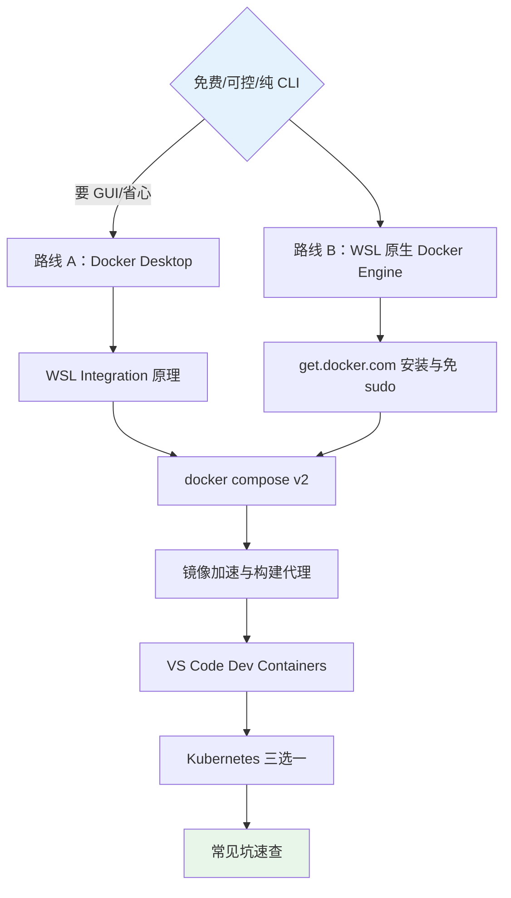
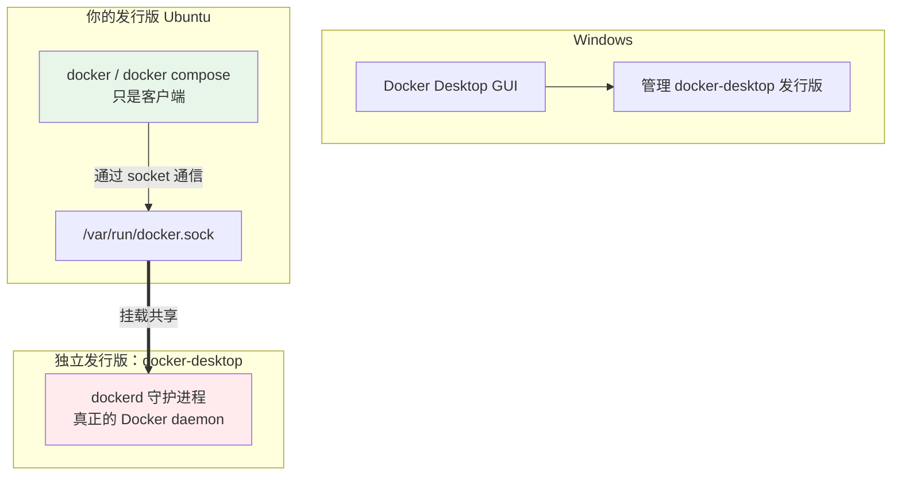
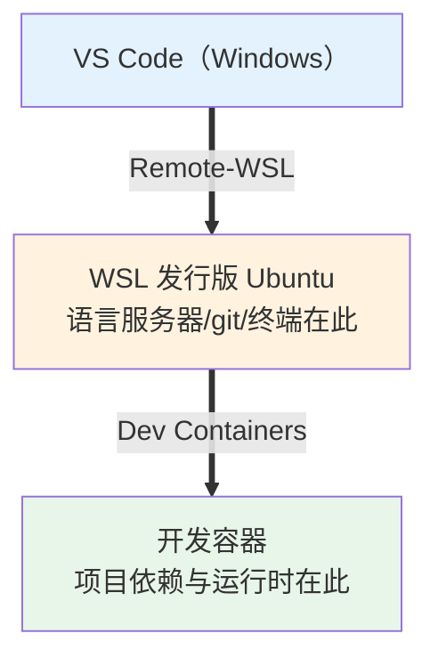

# 04 - Docker 与容器集成

> 容器是 WSL2 的头号用例。但"WSL 里怎么跑 Docker"有两条路线：Docker Desktop 图形界面一键搞定，或在 WSL 里原生安装 Docker Engine。选错路线会让你多花订阅费或白折腾。本章先给决策依据，再分别走通两条路线，最后接上 Dev Containers 与本地 Kubernetes。

---

## 阅读前提

- 已按 [[03-systemd与系统集成]] 启用 systemd 并验证 `ps -p 1` 输出 systemd
- 理解容器基本概念，可先读 [[../46-容器技术|容器技术]] 打底
- WSL2 网络模型心中有数（[[02-WSL2架构与网络]]）

## 本章路线图



---

## 4.1 两条路线决策表

| 对比项 | 路线 A：Docker Desktop | 路线 B：WSL 内直装 Engine |
|--------|------------------------|---------------------------|
| 费用 | 个人免费；**250 人以上企业商用需付费订阅** | 完全免费 |
| 界面 | GUI 托盘程序，可视化管容器/镜像/卷 | 纯 CLI |
| 架构 | daemon 跑在独立发行版，跨发行版共享 | daemon 就在你当前发行版里 |
| 资源控制 | Desktop 设置界面调整 | 直接受 `.wslconfig` 约束 |
| systemd 依赖 | 不依赖（自带运行方式） | 强依赖 |
| 适合人群 | 已有授权的公司、想要图形界面的用户 | 后端开发者、CI 思维、追求干净环境 |

一句话建议：**个人学习与后端开发选路线 B**——更轻、更透明、没有许可边界问题；公司统一配发 Desktop 且预算允许，则路线 A 开箱即用。

---

## 4.2 路线 A：Docker Desktop

### 开启 WSL Integration

1. 安装并启动 Docker Desktop；
2. Settings → Resources → **WSL Integration**：
   - 打开总开关 "Enable integration with my default WSL distro"；
   - 在发行版列表里勾选你的目标发行版（如 Ubuntu）。
3. 进入该 WSL 发行版，`docker --version` 可用即集成成功。

### 工作原理



关键认知：集成开启后，Ubuntu 里并没有安装 dockerd——你用的 `docker` 只是客户端，它通过共享的 `/var/run/docker.sock` 与 docker-desktop 发行版里的 daemon 通信。所以：

- Ubuntu 里 `systemctl status docker` 是查无此服务的，别在这里排障；
- Desktop 设置里的资源限制（CPU/内存）本质上改的就是 `.wslconfig` 同层的 VM 资源分配。

### 验证

```bash
docker run hello-world
# 能看到 "Hello from Docker!" 即整条链路通畅
```

---

## 4.3 路线 B：WSL 内原生安装 Docker Engine

### 安装

官方一键脚本最省事：

```bash
curl -fsSL https://get.docker.com | sudo sh
```

（国内网络可换镜像源脚本或手动按 Docker 官方文档配置 apt 源，软件包管理的源配置原理见 [[../14-软件包管理通识|软件包管理通识]]。）

### systemd 前提与开机自启

路线 B 的硬前提是 [[03-systemd与系统集成]] 中启用了 systemd，否则 dockerd 无法被托管、每次进 WSL 都要手工启动：

```bash
sudo systemctl enable --now docker
systemctl is-active docker   # active 即成功
```

### 免 sudo 使用 docker

docker daemon 的 socket 默认归 root 组所有，普通用户每次都要 sudo。把自己加入 docker 组即可：

```bash
sudo usermod -aG docker $USER
newgrp docker     # 或注销重新进入生效
docker ps         # 不再报 permission denied
```

安全提示：docker 组等价于 root 权限（可挂载宿主文件系统），只给自己用的工作机上加没问题。

### data-root 与磁盘膨胀

镜像和容器的默认存储位置是 `/var/lib/docker`——位于 VHDX 虚拟磁盘内。这意味着它会受 [[02-WSL2架构与网络]] 讲过的"VHDX 只增不减"膨胀问题影响。养成习惯：

```bash
docker system df          # 先看磁盘都被谁吃了
docker system prune       # 清理悬空镜像/停止容器/无用网络
docker system prune -a --volumes   # 大扫除（会删未使用卷，谨慎）
```

每月一次 prune 加一次 fstrim + compact，磁盘不会失控。

---

## 4.4 docker compose v2 一条龙

新版 Docker 自带 compose v2 插件，命令为 `docker compose`（空格，不再是连字符的 v1）。最小示例：

```yaml
# compose.yaml
services:
  web:
    image: nginx:alpine
    ports:
      - "8080:80"
    volumes:
      - ./site:/usr/share/nginx/html:ro
    depends_on:
      - db
  db:
    image: postgres:16
    environment:
      POSTGRES_PASSWORD: devpass
    volumes:
      - pgdata:/var/lib/postgresql/data

volumes:
  pgdata:
```

常用流程：

```bash
mkdir site && echo "<h1>hello</h1>" > site/index.html
docker compose up -d          # 后台拉起 web+db
docker compose ps             # 查看状态
curl http://localhost:8080    # Windows 浏览器同样可达（localhost 直通）
docker compose down           # 拆除（加 -v 连卷一起删）
```

volumes 相对路径注意点：compose.yaml 中的相对路径（如 `./site`）是**相对于执行命令时所在目录**解析的。把项目放在 `~` 下、在项目根目录执行 `docker compose up`，就不会踩路径错位的坑——这也再次呼应了代码放 `~` 的铁律。

---

## 4.5 镜像加速与构建代理

### daemon 级：registry-mirrors 国内加速

编辑 `/etc/docker/daemon.json`：

```json
{
  "registry-mirrors": [
    "https://docker.m.daocloud.io",
    "https://dockerproxy.net"
  ]
}
```

```bash
sudo systemctl restart docker
docker info | grep -A3 Mirrors   # 确认已加载
```

### 构建时走宿主代理

公司网络需要代理才能出网时，构建阶段的下载也要走代理。利用特殊域名 `host.docker.internal`：

```bash
docker build \
  --build-arg http_proxy=http://host.docker.internal:7890 \
  --build-arg https_proxy=http://host.docker.internal:7890 \
  -t myapp .
```

配套 Dockerfile 片段：

```dockerfile
FROM node:18-alpine
ARG http_proxy
ARG https_proxy
ENV http_proxy=$http_proxy https_proxy=$https_proxy
RUN apk add --no-cache git
# ...构建步骤
ENV http_proxy= https_proxy=
```

关于可用性的说明：`host.docker.internal` 是 Docker 提供的指向宿主的特殊 DNS 名。它在 **Docker Desktop 与较新版本的 Linux Docker Engine（20.10+ 配合默认 bridge 或加 host-gateway 参数）中均可直接使用**，WSL 场景下因为宿主就是 Windows 本机，指向关系天然成立。老版本若解析失败，可在 `docker run/build` 时追加 `--add-host=host.docker.internal:host-gateway` 兜底。

---

## 4.6 VS Code Dev Containers

Dev Containers 把"开发环境即容器"做到极致：你的终端、插件、调试器全部跑在容器内，本机零污染。

### 最小 devcontainer.json

在项目根目录建 `.devcontainer/devcontainer.json`：

```json
{
  "name": "node-dev",
  "image": "node:18-bullseye",
  "features": {
    "ghcr.io/devcontainers/features/git:1": {}
  },
  "forwardPorts": [3000],
  "postCreateCommand": "node --version && git --version"
}
```

字段解读：`image` 指定基础镜像；`features` 是可组合的环境片段（一行装好 git）；`forwardPorts` 自动转发服务端口到 localhost；`postCreateCommand` 在容器创建后执行初始化检查。

### 工作流

1. VS Code 安装 Dev Containers 扩展；
2. 打开项目文件夹，左下角弹出提示，点击 **"Reopen in Container"**；
3. 首次会构建镜像并启动容器（几分钟），之后秒级进入；
4. 终端、调试、扩展全部运行在容器内，`.bashrc` 与依赖互不影响宿主机。

### 与 Remote-WSL 的层级关系



三层嵌套各司其职：Windows 提供 IDE 外壳，WSL 提供类 Unix 文件系统与工具链，容器提供与生产一致的项目环境。日常小项目停在第二层（Remote-WSL）即可；团队协作、依赖复杂时再下沉到第三层。

---

## 4.7 Kubernetes 本地入门三选一

想在本地玩 K8s，三个主流方案各有生态位。

### 方案一：k3s（最轻量）

单二进制 Kubernetes 发行版，安装一条命令：

```bash
curl -sfL https://get.k3s.io | sh -
sudo kubectl get nodes    # 单节点 Ready 即成功
kubectl run nginx --image=nginx
```

要点：k3s **依赖 systemd** 管理自身服务（又一个必须开 systemd 的理由），资源占用极低（几百 MB），适合长期挂在 WSL 里当玩具集群。

### 方案二：kind（CI 友好）

Kubernetes in Docker——每个节点是一个容器：

```bash
kind create cluster --name dev
kubectl cluster-info --context kind-dev
kind delete cluster --name dev   # 秒级销毁重建
```

要点：依赖 Docker（本章任一路线皆可），集群生命周期完全由配置文件描述，最适合"用完就扔"的 CI 与版本矩阵测试。

### 方案三：minikube（功能最全）

```bash
minikube start --driver=docker
minikube dashboard       # 自带 Web 控制台
minikube addons enable ingress
```

要点：`--driver=docker` 让节点跑在 Docker 容器里，addon 体系（dashboard/ingress/registry）对新手最友好，代价是最吃资源。

### 选型建议

| 场景 | 推荐 |
|------|------|
| 长期低占用学习集群 | k3s |
| 测试 Helm chart / CI 流水线 | kind |
| 想要图形面板与丰富 addon | minikube |

无论哪个，都只是入口；编排概念的正餐在 [[../47-容器编排与K8s入门|容器编排与 K8s 入门]]。

---

## 4.8 常见坑速查

### 坑一：Cannot connect to the Docker daemon

```text
Cannot connect to the Docker daemon at unix:///var/run/docker.sock
```

分情况排查：

- 路线 B：十有八九是 systemd 未启用或 docker 服务没起。`systemctl status docker` 确认；若输出显示在尝试连 TCP 地址（如 tcp://localhost:2375），说明环境变量里有残留的 `DOCKER_HOST`，`unset DOCKER_HOST` 即恢复。
- 路线 A：Docker Desktop 没启动，或 WSL Integration 未勾选当前发行版。

### 坑二：磁盘暴涨

WSL 磁盘莫名少了几十 GB？先 `docker system df` 看 images/containers/volumes 各占多少，然后 prune 三连：

```bash
docker container prune
docker image prune -a     # 删除所有未被容器引用的镜像
docker volume prune       # 谨慎：会删除未挂载的数据卷
```

别忘了 prune 之后 VHDX 也不会自动缩小，按第 02 章 fstrim + compact 流程回收宿主空间。

### 坑三：WSL 重启后容器不见了？

不是丢了。容器数据都在 VHDX 里持久保存，只是**容器进程随 VM 关闭而停止**：

```bash
docker ps -a              # 用 -a 就能看到它们，状态 Exited
docker start <名称或ID>    # 拉起来即可
```

真正需要"重启自动回来"的服务，写 compose.yaml 并配合 systemd 单元或 `restart: unless-stopped` 策略。

### 坑四：时间漂移导致证书报错

长时间休眠/待机后 WSL 时钟可能与真实时间偏差数小时，典型症状是 git clone、apt update 报证书校验失败（certificate is not yet valid 等）。原因是 VM 暂停期间时钟停摆而 Windows 时间已前进。修复：

```bash
sudo hwclock -s
date    # 确认恢复正常
```

新版 WSL 多数场景已自动处理，但休眠数天后再进来仍可能中招，遇到证书类报错先看 `date`。

---

## 本章小结

- 路线选择看两点：要不要 GUI、有没有付费授权；个人开发推荐 WSL 内直装 Engine
- Desktop 的本质是独立 docker-desktop 发行版 + socket 共享；Engine 则强依赖 systemd
- `usermod -aG docker` 免 sudo；data-root 在 VHDX 内，prune 要成为肌肉记忆
- 构建代理用 `host.docker.internal` 指回宿主；daemon.json 配国内镜像加速
- Dev Containers 是 Remote-WSL 之下的第三层嵌套，环境隔离更彻底
- 本地 K8s：长期用 k3s、CI 用 kind、新手面板用 minikube
- 四大坑：DOCKER_HOST 残留、磁盘暴涨、容器 Exited 不是丢失、时钟漂移毁证书

