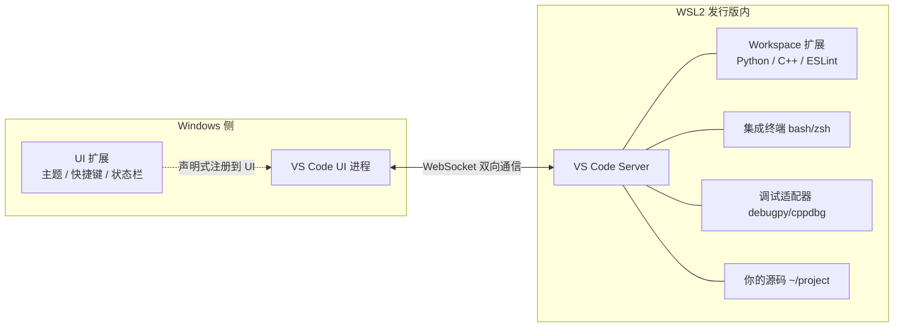
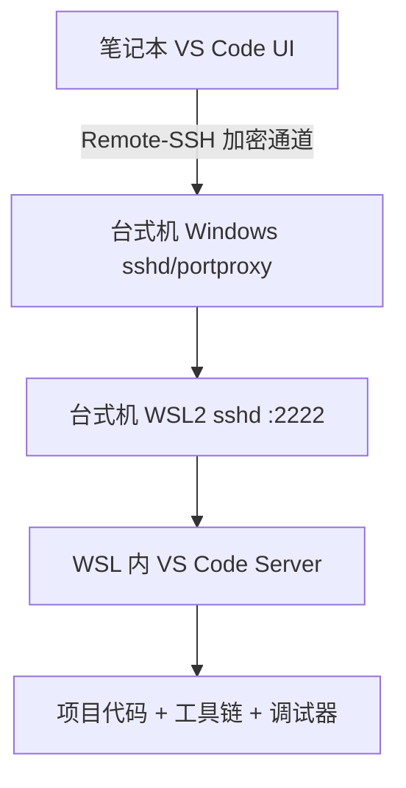

# 05 - VS Code 与 SSH 开发

> VS Code 的 Remote-WSL 模式是 WSL2 生态中最具杀伤力的生产力工具：编辑器界面跑在 Windows，代码执行、调试、终端全部落在 Linux 内。本章讲透 Remote-WSL 的架构原理、扩展双栏机制、Git 与 SSH 的深度集成、WSL 内 sshd 的搭建与外网穿透，以及跨机器远程开发的组合拳。

---

## 5.1 Remote-WSL 架构原理

### 客户端-服务端模型

VS Code Remote-WSL 并不是简单的"共享文件夹"，而是一个真正的分布式架构：



关键点：

| 组件 | 运行位置 | 说明 |
|------|----------|------|
| VS Code UI | Windows | 窗口、渲染、快捷键处理 |
| VS Code Server | WSL 发行版内 | 首次连接时自动下载到 `~/.vscode-server/` |
| UI 扩展 | Windows | 主题、图标、键位等纯界面扩展 |
| Workspace 扩展 | WSL 内 | 语言服务器、调试器、Lint 工具 |
| 集成终端 | WSL 内 | 默认启动发行版的登录 shell |

这个架构的意义在于：**代码在 Linux 文件系统上，语言服务器也在 Linux 上**。Python 解释器、编译器、调试器看到的路径和环境与生产环境一致，彻底消除"Windows 路径分隔符""CRLF 行尾""大小写不敏感"三类经典事故。

### 为什么不是直接打开 `\\wsl$`

用 VS Code 直接打开 `\\wsl$\Ubuntu\home\user\project` 也能工作，但走的是 9p 网络文件协议，扩展仍在 Windows 侧运行，文件监听和 IO 性能都差一个档次。Remote-WSL 才是官方推荐姿势。

---

## 5.2 连接 WSL 的三种方式

### 方式一：左下角绿色按钮

安装 "WSL" 扩展（微软官方，旧名 Remote - WSL）后，左下角出现绿色远程指示器：

1. 点击绿色按钮（或按 `F1` 输入 `WSL: Connect`）
2. 选择 `Connect to WSL` 或指定发行版 `Connect to WSL using Distro...`
3. 新窗口弹出，首次会自动下载 VS Code Server（约几十 MB，只需一次）

### 方式二：从 WSL 终端一键打开

这是日常使用频率最高的方式：

```bash
# 在 WSL 终端中，cd 到项目目录后
code .

# 打开当前目录并跳转到某文件
code . src/main.py

# 用 root 身份或指定用户
code --user-data-dir ~/.config/code-profile .
```

`code` 命令由 WSL 扩展自动注入 PATH，它负责通知 Windows 侧的 VS Code 拉起 Server 并建立连接。

### 方式三：命令面板切换

已连接状态下，`F1` → `WSL: Reopen Folder in WSL` 可以把普通窗口转为远程窗口；`WSL: Open Folder in WSL` 列出发行版内的目录历史。

### 验证连接状态

连接成功后观察两处：

```bash
# 左下角显示
# WSL: Ubuntu-22.04

# 在远程窗口的终端里执行
which code          # /mnt/c/Users/xxx/AppData/Local/Programs/.../code.cmd
ls ~/.vscode-server # server 二进制与扩展落点
```

---

## 5.3 扩展双栏机制

### 概念

进入远程窗口后，扩展视图分为两栏：**Local - Installed**（本地）和 **WSL: Ubuntu - Installed**（远端）。同一个扩展可以只装在一侧，也可以两侧都装。

| 扩展类型 | 应装位置 | 原因 |
|----------|----------|------|
| 主题、图标、键位 | UI 侧 | 纯界面渲染 |
| Python、Pylance | WSL 侧 | 语言服务器要读 Linux 文件、调 Linux Python |
| C/C++、clangd | WSL 侧 | 编译数据库、gdb 都在 Linux |
| Docker | WSL 侧 | 对接 docker CLI |
| Vim 模拟、GitLens | 均可 | 看个人偏好 |

### 把禁用扩展迁移到 WSL 侧

常见误区：装了 Python 扩展却显示"已禁用"。这是因为该扩展被标记为 workspace 类，必须运行在远端：

1. 扩展视图中找到该扩展
2. 点击齿轮 → 若显示 `Install in WSL: Ubuntu` 则点击安装到远端
3. 已在本地安装的语言类扩展不会自动生效于远程窗口，必须显式安装远端副本

批量操作：

```
F1 → Extensions: Show Local Extensions (Ignoring Workspace)
    → 逐个判断哪些需要 Install in WSL
```

> 经验法则：凡是"理解代码"的扩展装 WSL 侧，凡是"改变外观"的扩展装本地侧。装错位置的症状通常是 IntelliSense 失效、调试按钮灰色。

---

## 5.4 设置同步与 workspace 设置差异

VS Code 的设置分三层，远程模式下行为有微妙差别：

| 层级 | 作用范围 | 远程模式下的位置 |
|------|----------|------------------|
| User Settings | 全局默认 | Windows 侧 `%APPDATA%/Code/User/settings.json` |
| Remote Settings | 仅当前 WSL 发行版 | WSL 内 `~/.vscode-server/data/Machine/settings.json` |
| Workspace Settings | 仅当前项目 | 项目根 `.vscode/settings.json`（随仓库走） |

优先级从下往上覆盖：Workspace > Remote > User。

典型用法：

```jsonc
// User Settings（Windows 侧）：外观与通用习惯
{
  "workbench.colorTheme": "Default Dark Modern",
  "editor.fontSize": 14,
  "files.autoSave": "afterDelay"
}

// .vscode/settings.json（项目内，进仓库）：项目约定
{
  "python.defaultInterpreterPath": "~/.venv/bin/python",
  "editor.rulers": [88],
  "[python]": { "editor.formatOnSave": true }
}

// Remote Settings（WSL 侧）：只对该发行版有意义的东西
{
  "terminal.integrated.defaultProfile.linux": "zsh"
}
```

Settings Sync 只同步 User 层；Remote 与 Workspace 层各管各的。团队协作时，解释器路径、格式化规则应放 Workspace 层提交进 git。

---

## 5.5 调试实战

### Python 断点调试完整示例

项目结构：

```
~/demo/
├── .vscode/
│   └── launch.json
└── main.py
```

`main.py`：

```python
def divide(a: int, b: int) -> float:
    result = a / b        # 在此行设断点
    return result

if __name__ == "__main__":
    for pair in [(10, 2), (7, 0)]:
        try:
            print(divide(*pair))
        except ZeroDivisionError:
            print("div by zero")
```

`.vscode/launch.json`（文件本身就在 WSL 文件系统内）：

```json
{
  "version": "0.2.0",
  "configurations": [
    {
      "name": "Python: main.py",
      "type": "debugpy",
      "request": "launch",
      "program": "${workspaceFolder}/main.py",
      "console": "integratedTerminal",
      "justMyCode": false,
      "env": { "LOG_LEVEL": "DEBUG" },
      "args": ["--verbose"]
    }
  ]
}
```

按 `F5` 启动，断点命中时可以查看调用栈、变量、Watch 表达式，也可以在 Debug Console 中直接执行 Python 语句——这一切都发生在 Linux 进程里，`sys.executable` 就是 WSL 内的解释器。

### Node.js 断点调试示例

```json
{
  "version": "0.2.0",
  "configurations": [
    {
      "name": "Node: Launch",
      "type": "node",
      "request": "launch",
      "program": "${workspaceFolder}/index.js",
      "skipFiles": ["<node_internals>/**"],
      "restart": true
    },
    {
      "name": "Node: Attach to 9229",
      "type": "node",
      "request": "attach",
      "port": 9229,
      "restart": true
    }
  ]
}
```

attach 模式配合 `node --inspect index.js` 使用，适合进程由 pm2 或容器拉起的场景。

### 终端集成

Remote 窗口的集成终端默认就是发行版的默认 shell（Ubuntu 是 bash），`Ctrl+反引号` 快捷呼出。多个终端共享同一个 WSL 实例，环境变量、cd 历史彼此独立但内核状态一致。若想换成 zsh/fish，改 shell 本身后重启终端即可，无需动 VS Code 配置。

---

## 5.6 Git 深度集成

### 凭据管理器复用 Windows 登录态

WSL 里的 git 推 GitHub 时不想再输一遍 token？让 WSL git 借用 Windows 的 Git Credential Manager：

```bash
git config --global credential.helper \
  "/mnt/c/Program\ Files/Git/mingw64/bin/git-credential-manager.exe"
```

原理：WSL git 需要凭据时调用 GCM.exe，GCM 从 Windows 凭据库读取你之前 `git push` 时保存的 PAT/OAuth token，全程无感。首次推送到 GitHub 弹出的认证窗口也是 Windows 原生 UI。

验证：

```bash
git clone https://github.com/yourname/private-repo.git
# 不提示输入密码即为成功
```

注意：如果 GCM 安装路径不同（如 scoop 安装），先用 `where.exe git-credential-manager` 定位实际路径。

### 行尾策略

跨 Windows/Linux 编辑同一仓库，行尾是头号事故源。推荐 WSL 侧统一：

```bash
git config --global core.autocrlf input
```

| 取值 | 提交时 | 检出时 | 适用 |
|------|--------|--------|------|
| `true` | CRLF→LF | LF→CRLF | 纯 Windows 仓库 |
| `input` | CRLF→LF | 原样 | WSL/Linux 开发，推荐 |
| `false` | 不转换 | 不转换 | 明确知道自己在做什么 |

配合 `.gitattributes` 固化仓库级行尾规则更稳：

```
* text=auto eol=lf
*.bat text eol=crlf
*.png binary
```

### 密钥生成与分发

在 WSL 内生成密钥并推送到服务器：

```bash
ssh-keygen -t ed25519 -C "dev@wsl"
# 默认落在 ~/.ssh/id_ed25519

ssh-copy-id user@build-server
# 之后免密登录
```

GitHub 则把 `~/.ssh/id_ed25519.pub` 内容贴到 Settings → SSH and GPG keys。若想让 Windows 侧工具（如 TortoiseGit）也用同一密钥，可从 `\\wsl$\Ubuntu\home\you\.ssh\` 复制，或在两个环境中分别持有一对密钥。

---

## 5.7 WSL 内搭建 SSH Server

### 场景

外部机器（同局域网的另一台电脑、CI 跳板）要直接 SSH 进这台 Windows 上的 WSL。默认情况下流量只能到达 Windows，需要在两侧各打通一层。

### 服务端安装与配置

```bash
sudo apt update && sudo apt install openssh-server -y

# 备份并修改端口，避免与未来 Windows 侧可能的 sshd 冲突
sudo cp /etc/ssh/sshd_config{,.bak}
sudo sed -i 's/^#\?Port 22/Port 2222/' /etc/ssh/sshd_config

# 允许密钥登录（默认已开）、按需关闭密码登录
# PasswordAuthentication no
# PubkeyAuthentication yes
```

### 设置自启

启用 systemd 的发行版（`/etc/wsl.conf` 中 `[boot] systemd=true`）最简单：

```bash
sudo systemctl enable --now ssh
systemctl status ssh
```

未启用 systemd 时，用 `/etc/wsl.conf` 的 boot command：

```ini
[boot]
command = service ssh start
```

### 完整链路：portproxy 把外部流量送进 WSL

Windows 与 WSL 是两个独立网络命名空间，外部机器无法直接路由到 WSL IP。用 netsh portproxy 在 Windows 侧架桥：


Windows 侧 PowerShell（管理员）：

```powershell
# 端口代理：监听 2222，转发到 WSL 的 2222
netsh interface portproxy add v4tov4 `
  listenport=2222 listenaddress=0.0.0.0 `
  connectport=2222 connectaddress=(wsl hostname -I).Trim()

# 放行防火墙（仅局域网范围更安全）
New-NetFirewallRule -DisplayName "WSL SSH" `
  -Direction Inbound -Protocol TCP -LocalPort 2222 `
  -Action Allow -Profile Private

# 查看已有转发
netsh interface portproxy show all

# 删除转发
netsh interface portproxy delete v4tov4 listenport=2222 listenaddress=0.0.0.0
```

WSL 重启后 IP 会变，portproxy 指向的地址随之失效。可以把刷新逻辑写成计划任务，或改用 mirrored 网络模式（Win11 22H2+）让 WSL 直接复用主机地址，省掉 portproxy 一层。

### 局域网访问安全清单

- 防火墙规则限定 `-Profile Private`，避免咖啡馆 Wi-Fi 下裸奔
- `PasswordAuthentication no`，只留密钥
- `AllowUsers youruser` 收窄可登录账户
- 端口保持非 22，降低扫描噪音（不是安全边界，只是降噪）

---

## 5.8 远程开发组合拳

### VS Code Remote-SSH 连接另一台 WSL 机器

Remote-WSL 解决"本机"，Remote-SSH 解决"那台机器"。假设公司有台台式机开了 WSL，你在笔记本上开发：

笔记本侧配置 `~/.ssh/config`：

```
Host devbox
    HostName 192.168.1.50
    Port 2222
    User alice
    IdentityFile ~/.ssh/id_ed25519
```

然后 VS Code 装 "Remote - SSH" 扩展，`F1` → `Remote-SSH: Connect to Host...` → 选 `devbox`。Server 会下载到那台机器的 WSL 里，体验与本机无异。

链路全景：



这套组合同样适用于云主机上的 Linux——Remote-SSH 是通用的，目标不必是 WSL。

### 多发行版切换开发

一台机器同时维护 Ubuntu（稳定）与 Arch（尝鲜）环境时：

```powershell
# Windows 侧列出发行版
wsl -l -v

# 指定发行版打开项目
wsl -d Arch code /home/alice/project

# 或先进入再打开
wsl -d Debian
cd ~/project && code .
```

每个发行版有独立的 `~/.vscode-server`、独立的扩展集、独立的 settings。切换成本为零，适合"上游要求 Arch 复现 bug"这类场景。注意各发行版内的 SSH key、git config 需要分别配置（可用 dotfiles 仓库同步）。

---

## 5.9 常见问题速查

| 现象 | 原因 | 处理 |
|------|------|------|
| 左下角一直 "Starting VS Code Server" | server 下载失败 | 删 `~/.vscode-server` 后重连 |
| 扩展在远程窗口灰掉 | 装在了 UI 侧 | 扩展页点 Install in WSL |
| code . 无反应 | PATH 未注入 | 关闭重开 WSL，或重装 WSL 扩展 |
| git push 反复要密码 | credential.helper 未配 | 见 5.6 节配置 GCM |
| portproxy 外部连不通 | WSL IP 变了 | 刷新 connectaddress 或换 mirrored 网络 |
| 断点不停 | launch.json 的 type 错误 | Python 用 debugpy，Node 用 node |
| 远程窗口卡顿 | 代码放在 /mnt/c | 移回 `~/`，见 [[06-开发环境实战]] |

---

## 5.10 小结

- Remote-WSL = Windows 侧 UI + WSL 侧 Server，扩展分 UI/workspace 两栏，语言类扩展必须在 WSL 侧
- `code .` 从 WSL 终端一键回连是最顺手的工作流起点
- Git 三件套：GCM 复用 Windows 凭据、`core.autocrlf input` 管住行尾、ed25519 密钥加 ssh-copy-id
- WSL sshd 改端口防冲突，systemd 或 boot command 自启，netsh portproxy + New-NetFirewallRule 打通外网访问
- Remote-SSH 让"另一台开了 WSL 的电脑"变成你的远程开发机；`wsl -d <distro> code .` 实现多发行版随取随用

下一篇 [[06-开发环境实战]] 将把 Node、Python、Go、Rust、Java 等工具链逐个落到 WSL 里。
