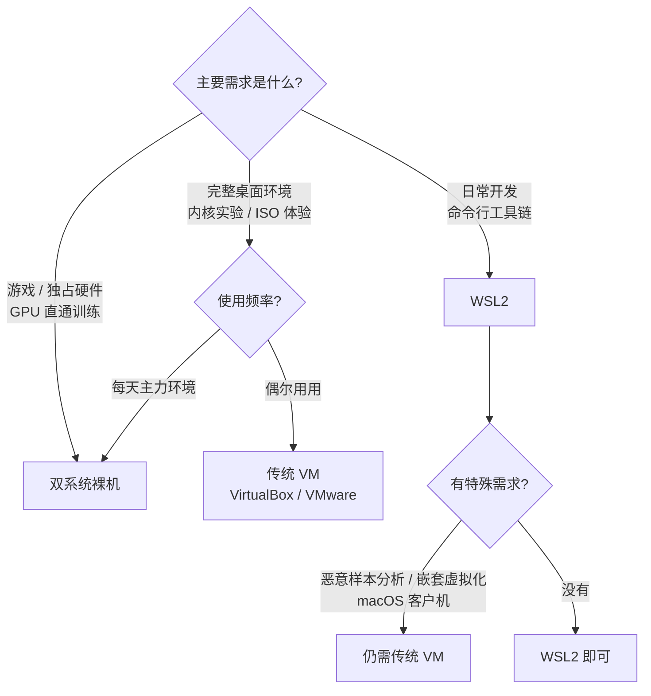
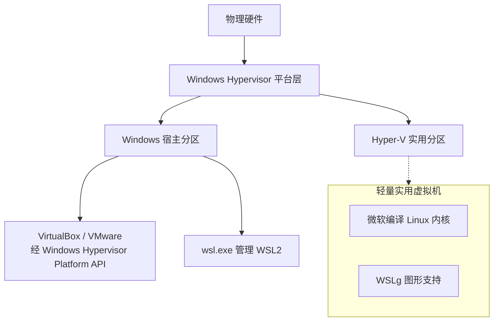
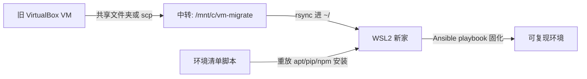
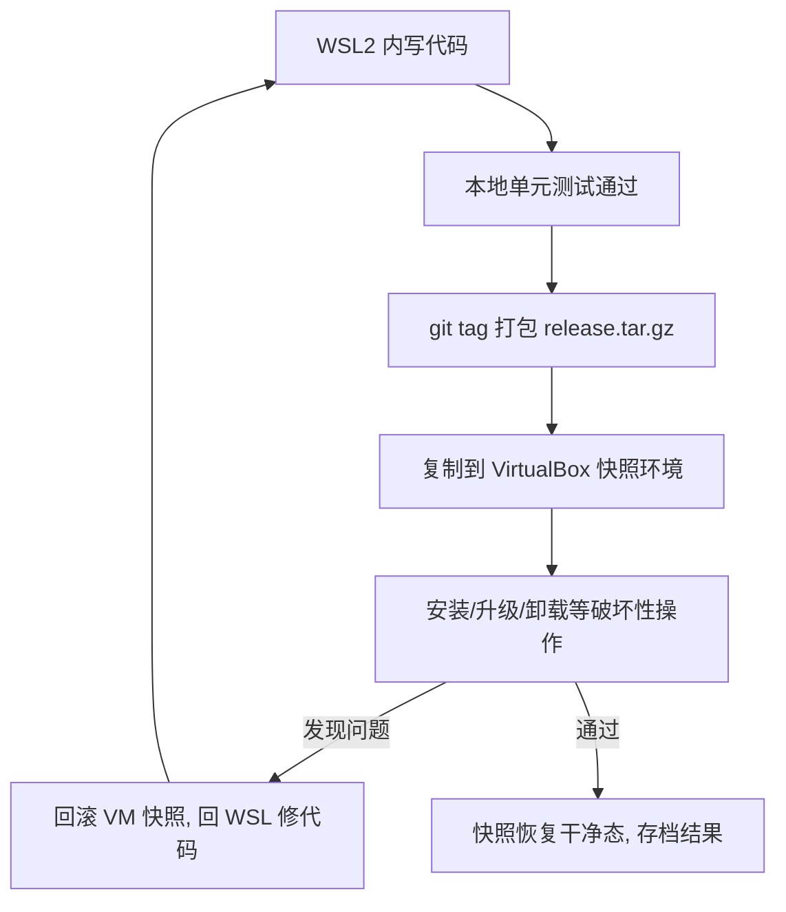

# 07 - WSL 与虚拟机协作

> WSL2 不是 VirtualBox 的完全替代品，虚拟机也没有过时。三者（WSL2、传统 VM、双系统）各有不可替代的生态位。本章给出选型决策树，讲清 WSL2 与 Hyper-V、VirtualBox、VMware 的共存机制与性能取舍，提供从 VM 迁移到 WSL 的现实路径，并对比四维性能数据帮你建立合理预期。

---

## 7.1 三者决策树

先问自己要什么：



一句话版本：**日常开发选 WSL2，需要完整桌面或内核实验开 VM，长期主力且要独占硬件就双系统**。三者不是互斥选项，很多人是"WSL2 日常 + 一个 VBox 快照环境做破坏性测试 + 双系统打游戏"的组合。

### 决策树的补充判据

除了主需求，还有几个常被忽略的判据：

- **协作形态**：如果团队统一发 devcontainer/远程开发机，本地只需要一个瘦客户端，WSL2 的轻量优势被进一步放大
- **合规要求**：某些行业要求开发环境与个人环境强隔离，完整 VM 的边界清晰度更容易过审计
- **学习目的**：备考 RHCE 或研究 systemd/LVM 等系统组件时，一台完整 VM 更接近真实服务器，WSL2 的裁剪内核会掩盖不少细节
- **硬件条件**：16GB 内存以下机器同时养 WSL2 与 VM 会很吃力，优先保 WSL2

把判据代入决策树，大多数人的落点是：WSL2 承担九成日常，VM 作为低频重装备库，双系统看娱乐与硬件需求。

| 维度 | WSL2 | 传统 VM | 双系统 |
|------|------|---------|--------|
| 启动速度 | 秒级 | 分钟级 | 切换需重启 |
| 资源占用 | 动态，可设上限 | 预分配，常驻 | 独占 |
| GUI 桌面 | WSLg 可用但非完整体验 | 完整 | 完整 |
| 内核可定制 | 受限（微软编译内核） | 部分（模块加载） | 完全自由 |
| 快照/回滚 | export/import 较笨重 | 一键快照 | 无 |

---

## 7.2 WSL2 与 Hyper-V 的关系

### 同一个 Hypervisor 平台层

WSL2 不是寄生在 VirtualBox 式的托管虚拟化上，它直接构建在 Hyper-V 轻量架构之上：



要点：

- WSL2 使用 Hyper-V 的"实用分区"机制跑一个高度定制的微型 VM，不是完整桌面 VM
- 第三方 VM（VBox 6.1.26+、VMware 15.5+）通过 Windows Hypervisor Platform（WHP）API 在同一 Hypervisor 上运行，因此天然共存
- 共存的代价是大家都走 Hyper-V 这条路，老式的直接 VT-x 独占模式不再可用

### .wslconfig 内存上限防抢内存

WSL2 默认可能吃掉一半内存。当同一台机器还要跑 VirtualBox 时，必须给 WSL 设硬上限，否则两者叠加会触发宿主机交换颠簸：

```ini
# %UserProfile%\.wslconfig
[wsl2]
memory=8GB          # 按物理内存的 40-50% 设置
processors=4
swap=4GB
```

改完必须 `wsl --shutdown` 才生效。经验法则：物理内存 32GB 时给 WSL 8-12GB，剩余留给 Windows 和 VM。

### 资源预算示例

以一台 32GB 内存、跑 WSL2 + VirtualBox 双环境的机器为例，给出一个经过验证的分配方案：

| 消费方 | 分配 | 说明 |
|--------|------|------|
| Windows 宿主 | 约 6GB | 系统常驻 + 浏览器 |
| WSL2 | memory=8GB | 编译与数据库足够 |
| VirtualBox VM | 8GB 预分配 | 单台测试 VM |
| 余量 | 约 10GB | 文件缓存与突发 |

原则：**VM 的预分配是刚性的，WSL2 的上限是弹性的**。先把刚性需求钉死，再给弹性方留上限，两者相加永远低于物理内存的八成。

---

## 7.3 WSL2 + VirtualBox 共存

### 6.1.26+ 官方兼容

Oracle 从 VirtualBox 6.1.26 起官方支持在 Hyper-V 开启的环境下工作，自动切换到 NEM（Nested Execution Mode）模式。装新版 VBox 后通常无感共存，但有代价：

| 项目 | 表现 |
|------|------|
| 基本功能 | 正常，VM 能开机运行 |
| 3D 加速 | 失效（NEM 不支持） |
| CPU 性能 | 降级约 10-30%，视负载而定 |
| 多核表现 | NEM 下调度效率低于原生 VT-x |

取舍建议：如果 VM 里只是跑个测试用的 Ubuntu Server 或旧版浏览器，NEM 完全够用；如果要做 Android 模拟器加速或图形重度应用，要么关 Hyper-V 要么换思路（如用 WSLg 替代部分场景）。

### NEM 模式的技术细节

理解 NEM 为什么慢，有助于判断自己的负载是否受影响：

- **原生 VT-x 模式**：VBox 直接接管 CPU 虚拟化扩展，客户机代码以硬件级速度执行
- **NEM 模式**：VBox 把虚拟化工作委托给 Hyper-V，自己退化为管理层；两次软件层转换带来额外开销
- **受影响最大的负载**：高频系统调用密集型（内核编译）、图形 API 调用、中断敏感型应用（实时音频）
- **几乎不受影响的负载**：Web 服务、数据库单实例、脚本批处理

一个快速自检方法：在 VM 里跑 `sysbench cpu --threads=4 run` 与宿主 WSL2 内同命令对比，差距超过 25% 说明你正踩在 NEM 的性能坑里，需要重新评估该 VM 任务的归属。

### 判断当前 VBox 运行在哪种模式

VirtualBox 管理界面 → 帮助 → 关于中可看版本；运行中的 VM 在底部状态栏右键虚拟硬盘图标旁的系统信息，或直接看日志：

```
VM 日志路径: %USERPROFILE%\VirtualBox VMs\<vm>\Logs\VBox.log
搜索关键字: NEM: / HM: / VT-x
出现 "NEM" 字样即运行于 Hyper-V 共存模式
```

### 老版本报错 vt-x unavailable 的解决

VBox 6.1.26 之前在 Hyper-V 开启时会报：

```
VT-x is not available (VERR_VMX_NO_VMX)
```

两条路：

**路线一（推荐）：升级 VirtualBox 到 6.1.26 以上**，让 NEM 自动接管，无需动系统配置。

**路线二：关闭 Hypervisor 让 VBox 独占 VT-x**：

```powershell
# 管理员 PowerShell：关闭 Hyper-V 引导
bcdedit /set hypervisorlaunchtype off
# 重启后 VBox 恢复原生性能；但此时 WSL2 无法启动！

# 想用 WSL2 时再切回来：
bcdedit /set hypervisorlaunchtype auto
# 再次重启生效
```

警告：这是一次重启成本的双向开关，且 `hypervisorlaunchtype off` 会连带影响 WSL2、Docker Desktop（WSL2 后端）、Windows Sandbox、内核隔离（内存完整性）等所有依赖 Hyper-V 的功能。切过去前确认这些都不急用，并记下恢复命令。日常别把这条写进开机脚本。

---

## 7.4 WSL2 + VMware Workstation 共存

VMware 从 Workstation 15.5 起（Player 同步）默认使用 Windows Hypervisor Platform 作为执行引擎，与 Hyper-V/WSL2 共存良好：

```powershell
# 确认 WHP 已启用
Get-WindowsOptionalFeature -Online -FeatureName HypervisorPlatform
```

注意事项：

- VMware 偏好设置里 "Enable nested virtualization / Use Windows Hypervisor Platform" 相关选项保持默认即可
- 与 VBox 类似，走 WHP 后性能略降、嵌套虚拟化和某些直通特性受限
- VMware 15.5 之前的版本同样会遇到 `VMX is disabled` 类报错，解法同 7.3：升级优先

---

## 7.5 从 VM 迁移到 WSL

### 诚实说明：磁盘镜像不能直接转

网上流传"qemu-img 转 vmdk 再挂进 WSL"的方案，对 WSL2 并不成立。原因：

1. WSL2 的系统盘是微软私有格式的 ext4 VHD，由其自研 init 拉起，不是标准 qcow2/vmdk 能直接引导的环境
2. WSL2 没有 bootloader 概念，不存在"把这个磁盘作为根文件系统启动"的入口
3. 即使转成 raw ext4 挂载，VM 内的 fstab、驱动、initramfs 与 WSL2 环境假设全部不匹配

所以迁移的正确姿势是**搬数据、重建环境，而不是搬磁盘**。

### 三段式迁移策略



第一步：数据出逃。VM 内开启共享文件夹挂到 /mnt/c 作中转，或在 VM 内打包后 scp：

```bash
# VM 内
tar czf /mnt/c/vm-migrate/home-backup.tar.gz --exclude='.cache' ~/work ~/dotfiles
```

清单化意识比命令本身重要。迁移前先在 VM 里盘点"这个环境到底有什么"：

```bash
# VM 内生成环境快照清单
dpkg --get-selections > /mnt/c/vm-migrate/packages.txt
pip list --format=freeze > /mnt/c/vm-migrate/pip.txt
npm ls -g --depth=0 > /mnt/c/vm-migrate/npm.txt
crontab -l > /mnt/c/vm-migrate/cron.txt
systemctl list-unit-files --state=enabled > /mnt/c/vm-migrate/services.txt
cp -r ~/.ssh ~/.gitconfig /mnt/c/vm-migrate/
```

第二步：WSL 内落位与环境重建：

```bash
mkdir -p ~/work && tar xzf /mnt/c/vm-migrate/home-backup.tar.gz -C ~/work/
# 环境按 [[06-开发环境实战]] 的清单重装一遍工具链

# 对照 packages.txt 批量补装 apt 包（注意剔除 VM 特有的内核相关包）
awk '{print $1}' /mnt/c/vm-migrate/packages.txt | \
  xargs sudo apt install -y 2>/dev/null
```

第三步：固化。把"装了什么、配了什么"写成脚本或 playbook，下次新机器一条命令重建。Ansible 的系统用法见 [[../62-Ansible与配置管理|Ansible]]，最小骨架示例：

```yaml
# wsl-bootstrap.yml
- hosts: localhost
  connection: local
  tasks:
    - name: install base packages
      become: true
      apt:
        name: [build-essential, git, redis-server, postgresql]
        state: present
    - name: install nvm
      shell: curl -o- https://raw.githubusercontent.com/nvm-sh/nvm/v0.40.1/install.sh | bash
      args:
        creates: ~/.nvm/nvm.sh
```

```bash
ansible-playbook wsl-bootstrap.yml
```

### 过渡期共享文件夹技巧

迁移不可能一次完成时，保持一段双环境并行期：VM 继续跑老项目，新产出放共享文件夹（/mnt/c 中转），WSL 侧定期同步。注意这期间两边都在 /mnt/c 上读写会有锁冲突风险，尽量做到"一边只读"，并尽早收口到单环境。

---

## 7.6 何时仍必须用 VM 对照表

| 场景 | 为什么 WSL2 不行 | 结论 |
|------|------------------|------|
| GPU 直通训练（独占整卡） | WSL2 的 GPU 是 paravirtualization 共享，CUDA 支持好但非独占直通 | 用 VM 或裸机 |
| macOS 客户端 | 法律与授权问题叠加 WSL2 只跑 Linux | 只能传统 VM |
| 内核模块开发 | WSL2 内核是微软预编译，无法替换内核镜像做实验 | 用 VM 或裸机 |
| 恶意样本隔离 | WSL 与宿主共享网络栈和文件互通面，隔离强度不足 | 用隔离 VM |
| 嵌套虚拟化测试 | WSL2 默认嵌套支持有限且不稳定 | 用 VM |
| 特定发行版 ISO 体验（openSUSE Live 等） | WSL 只能导入 rootfs tar，非 ISO 安装体验 | 用 VM |

---

## 7.7 性能四维对比表

> 口径说明：以下为社区常见基准方向性结论（sysbench CPU、fio 顺序/随机 IO、iperf3 回环网络），数值随硬件、版本、配置大幅浮动，仅供选型参考，不构成精确承诺。

| 维度 | 裸机基准 | WSL2 | VirtualBox (NEM) | VMware (WHP) |
|------|----------|------|-------------------|--------------|
| CPU 计算 | 100% | 约 90-95% | 约 75-90% | 约 85-95% |
| 磁盘 IO（Linux fs 内） | 100% | 约 90-95%（ext4） | 约 70-90% | 约 80-95% |
| 网络 | 100% | mirrored 接近原生；NAT 有开销 | NAT 约 60-85% | NAT/NAT 网络约 70-90% |
| 内存开销 | 无额外 | 微型 VM 底噪小但常驻 | 完整 VM 预分配大 | 完整 VM 预分配大 |

解读三个关键点：

1. **CPU 层大家差距不大**：都经过同一个硬件 Hypervisor，指令执行损耗相近
2. **WSL2 磁盘优势来自 ext4**：前提还是那句话，代码放在 Linux 文件系统内；一旦跨 /mnt/c 立即垫底
3. **内存模型差异最大**：WSL2 动态回收（配合 autoMemoryReclaim），VM 是你分多少占多少，这是"多环境并存"时 WSL2 最大的隐性优势

---

## 7.8 混合工作流实例

真实案例：为某开源项目做兼容性回归，需要在脏环境下反复折腾。

流程设计：



分工逻辑：WSL 承担一切"创造性"工作（编码、调试、快速迭代），享受秒级启动与 ext4 性能；VBox 快照承担一切"破坏性"工作（rm -rf 级别的安装器测试、污染 PATH 的环境变量实验），享受一键还原。每次破坏完 revert 快照即可，宿主和 WSL 全程无风险。

实操细节：

```bash
# WSL 内打包
make dist   # 生成 dist/app-1.0.0.tar.gz

# 经 /mnt/c 丢给 VM（VM 挂载同一共享目录）
cp dist/app-1.0.0.tar.gz /mnt/c/share/
```

VM 侧的验收脚本示例（放进快照前的基线环境里）：

```bash
#!/usr/bin/env bash
set -euo pipefail
ARTIFACT=/mnt/share/app-1.0.0.tar.gz

tar xzf "$ARTIFACT" -C /opt/app
cd /opt/app
./install.sh --prefix=/usr/local          # 破坏性安装，随便折腾
app --selftest || { echo "FAIL"; exit 1; }
apt remove -y app && dpkg -l | grep app   # 卸载残留检查
echo "PASS"
```

每次跑完无论 PASS 还是 FAIL：

```
VirtualBox 菜单 → 控制 → 恢复转储的快照（Revert to Snapshot）
```

三十秒回到干净态。这套"创造在 WSL、破坏在 VM"的节拍一旦建立，做兼容性回归和安装器测试的心理负担趋近于零。

---

## 7.9 双启动与 WSL 的分工

双系统（Linux 裸机 + Windows 裸机，GRUB 引导菜单切换）依然有不可替代的场景：

- **游戏**：反作弊系统普遍拒绝虚拟化环境，只能裸机 Windows；Linux 游戏则相反
- **独占硬件**：直播采集卡、特定调试探针、PCIe 直通设备
- **极限性能**：竞赛级编译/训练压榨最后几个百分点

分工建议：把"需要重启才能到达的环境"用于低频重负载任务，把高频日常开发留在免重启的 WSL。两边的代码用 git 同步，环境用 Ansible playbook 对齐，避免双系统变成两套漂移的世界。GRUB 的原理与配置背景见 [[../40-引导流程与GRUB|GRUB 章]]——理解引导链之后，你会明白为什么 WSL2 干脆绕过了这一层。

### 双系统与 WSL 的数据互通

双系统下 Linux 裸机分区与 WSL 之间没有直接通道（它们甚至不在同一个开机周期里），但可以通过 NTFS 数据分区做交换：

```bash
# 裸机 Linux 挂载 Windows 的 D 盘作交换区
sudo mount /dev/nvme0n1p4 /mnt/share

# WSL 里天然可见 /mnt/d
cp ~/work/dist/app.tar.gz /mnt/d/swap/
```

注意 NTFS 分区上同样适用第 6 章的铁律：交换归档文件可以，把工作目录长期放在上面不行。git 是更干净的同步方式：裸机与 WSL 各自 clone 同一仓库，push/pull 到远端即可，物理搬运只留给大体积二进制产物。

### 引导视角的收束

三种方案在引导链上的位置完全不同：

| 方案 | 引导路径 | 到达速度 |
|------|----------|----------|
| 双系统 | UEFI → GRUB → 内核 → 登录 | 分钟级，需中断当前会话 |
| 传统 VM | Windows → Hypervisor → VM BIOS → 客户机内核 | 分钟级，不中断宿主 |
| WSL2 | Windows → wsl.exe → 实用分区直接拉起 init | 秒级 |

WSL2 砍掉 bootloader 与完整固件模拟，换来的是"环境即进程"的体验；代价就是 7.6 表格里那些必须回到完整 VM 或裸机才能满足的场景。理解这个取舍，比记住任何一条命令都重要。

---

## 7.10 小结

- 决策树一句话：日常开发 WSL2，桌面与内核实验 VM，主力独占硬件双系统；三者常见于共存而非三选一
- WSL2 与 VBox 6.1.26+/VMware 15.5+ 经 WHP 天然共存，代价是 NEM/WHP 模式下 3D 加速失效与轻度性能降级
- `bcdedit hypervisorlaunchtype` 是双向开关，off 会连坐 WSL2/Docker/Sandbox，慎用且记住恢复命令
- VM 迁移到 WSL 不能转磁盘镜像，正确姿势是 rsync 数据 + 脚本重建环境 + Ansible 固化
- GPU 独占训练、macOS 客户机、内核开发、样本隔离、嵌套虚拟化五类需求仍必须 VM
- 性能预期：WSL2 各维度约为裸机九成上下；混合工作流让 WSL 做创造、VM 快照做破坏，各得其所

下一篇 [[08-WSL运维与排障]] 收尾本系列：生命周期管理、磁盘与内存运维、安全加固与故障排查手册。
