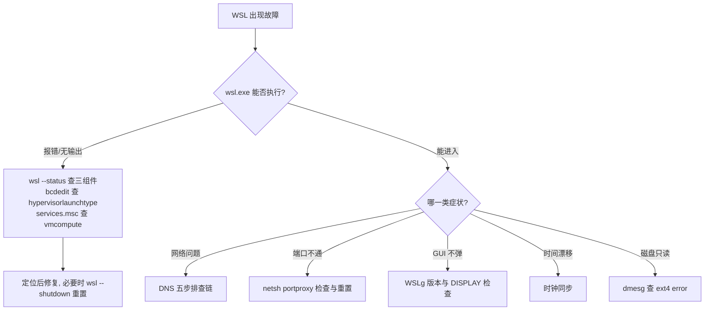

# 08 - WSL 运维与排障

> WSL 用得顺手是"无感"的，一旦出问题又常常让人无从下手：它横跨 Windows 与 Linux 两套体系，日志分散在两侧，故障面覆盖虚拟化、网络、文件系统三层。本章作为系列收尾，给出生命周期管理、磁盘与内存运维、安全加固的常规动作，以及一本按"现象 → 诊断 → 修复"组织的排障手册。

---

## 8.1 生命周期运维

### 三组件版本解读

```powershell
wsl --version
# WSL 版本: 2.2.4.0
# 内核版本: 5.15.153.1-2
# WSLg 版本: 1.0.66
# MSRDC 版本: 1.2.5402
# Direct3D 版本: 1.611.1-81528511
# DXCore 版本: 10.0.26100.1-240331-1435.ge-release
# Windows 版本: 10.0.22631.4037
```

| 组件 | 含义 | 出问题时的表现 |
|------|------|----------------|
| kernel | 微软编译的 Linux 内核 | 系统调用异常、新硬件特性缺失 |
| wsl（MSI/Store 包） | 用户态管理器与 wsl.exe | 命令行为异常、新配置项不识别 |
| WSLg | 图形支持栈（Wayland/X11） | GUI 应用不弹、剪贴板失灵 |

MSRDC 是远程桌面通信库，Direct3D/DXCore 服务于 GPU 加速。日常只需关心前三个。

### wsl --update 与版本策略

Windows 自带的 inbox WSL（系统组件形态）更新随 Windows 补丁走，节奏慢；Store 版 WSL 是独立分发的现代形态，功能先行。两者一句总结：**inbox 版保底可用，Store 版跟进最新特性**。现在新机器默认就是 Store 版，保持最新的方式只有一条：

```powershell
wsl --update          # 手动拉取最新内核与组件
wsl --update --pre-release   # 愿意尝鲜时
```

建议把 `wsl --update` 纳入月度习惯，内核安全修复也经此通道下发。

### wsl --shutdown 何时必要

WSL 实用 VM 有状态，以下场景必须整体重启才能生效或修复：

| 场景 | 原因 |
|------|------|
| 修改 `.wslconfig` 后 | 配置只在 VM 启动时读取 |
| 修改 `/etc/wsl.conf` 后 | 发行版级配置同理 |
| VHD 压缩前 | 文件被占用无法 compact |
| 网络 DNS 彻底紊乱 | 重置网络栈最干脆的手段 |
| 内存占用居高不下 | 触发整体回收 |

```powershell
wsl --shutdown      # 关闭所有发行版与实用 VM
wsl                 # 下次任意命令自动重新拉起
```

### 空闲自动回收与常驻服务

WSL2 有空闲回收机制：当没有活动进程时，VM 约 8 秒后（vmIdleTimeout 概念）自动关闭以释放内存。这带来一个经典困扰——你在 WSL 里起的数据库、SSH server 等后台服务，人一走开就被连锅端：

```bash
sudo service postgresql start
# ...去倒了杯咖啡...
psql: could not connect: Connection refused   # VM 已被回收
```

应对技巧：

1. **启用 systemd（推荐）**：`/etc/wsl.conf` 写入 `[boot] systemd=true` 后，systemd 本身作为 PID 1 持续运行，VM 判定为非空闲而保持常驻，enable 过的服务开机自启
2. **keep-alive 进程**：未用 systemd 时留一个 `sleep infinity` 或 tmux 会话兜底
3. **接受回收**：如果服务都是按需用的，让 VM 回去睡觉反而省内存

---

## 8.2 磁盘运维

### VHD 膨胀复查

WSL2 的 ext4 落在一个动态扩展 VHDX 里，只增不减：删掉 20GB 文件后，宿主上的 vhdx 文件不会变小。先确认差距有多大：

```bash
# WSL 内看实际用量
df -h /
du -sh ~/* 2>/dev/null | sort -h
```

```powershell
# Windows 侧看 vhdx 实际大小
Get-ChildItem "$env:LOCALAPPDATA\Packages\*\LocalState\ext4.vhdx"
```

两者差距巨大就值得压缩。两条压缩路径在 [[02-WSL2架构与网络|02 章]] 有详述，此处仅回顾命令骨架：

```powershell
# 路径一：diskpart（传统）
wsl --shutdown
diskpart
# > select vdisk file="C:\Users\you\AppData\Local\...\ext4.vhdx"
# > compact vdisk

# 路径二：新版 wsl 管理（更简单）
wsl --shutdown
wsl --manage Ubuntu-22.04 --set-sparse true
```

### 预防习惯

压缩是补救，习惯才是治理：

```bash
# Docker 是 vhdx 膨胀头号元凶，定期清理悬空层
docker system prune -af --volumes    # 谨慎：会删未使用镜像卷

# journald 日志限额，防止无限增长
sudo journalctl --vacuum-size=200M
# 持久化限制写入 /etc/systemd/journald.conf:
#   SystemMaxUse=200M
```

再加一条：`~/Downloads`、tar 包、node_modules 的历史副本是最常见的隐形大户，`du` 排查时优先看它们。

---

## 8.3 内存与 CPU 运维

### vmmem 吃满内存争议

任务管理器里 `vmmem`（或 `vmmemWSL`）动辄吃掉几 GB 甚至逼近物理内存一半，这是 WSL2 最著名的争议点。真相是：vmmem 显示的是实用 VM 的总内存足迹，Linux 侧 page cache 也计入其中——它看起来吓人，但大部分是可回收缓存。即便如此，默认上限（物理内存 50% 或 8GB 取小值）对很多场景仍过于宽松，主动设限：

```ini
# %UserProfile%\.wslconfig
[wsl2]
memory=8GB
```

### autoMemoryReclaim 渐进回收

较新的 WSL 版本支持在运行中逐步归还内存：

```ini
[experimental]
autoMemoryReclaim=gradual   # dropcache 式渐进回收
sparseVhd=true              # 新发行版 VHD 自动稀疏化
```

取值 `dropcache`（激进一次性）/ `gradual`（温和渐进）/ `disabled`。开启 gradual 后 vmmem 曲线会在负载回落后缓慢下降，配合 memory 上限基本消除"WSL 把机器拖垮"的观感。

### swap 与 processors

```ini
[wsl2]
swap=4GB                     # 默认 25% 物理内存；设 0 可禁用
swapFile=D:\\wsl\\swap.vhdx  # 自定义位置
processors=6                 # 限核：给宿主留算力
```

限核的典型用途：编译服务器与日常办公同机共存时，把 processors 设为物理核数减二，避免一次 make -j 把 IDE 卡死。

### 性能调优汇总表

| 症状 | 先查什么 | 位置 |
|------|----------|------|
| 整体慢 | .wslconfig 是否合理 | `%UserProfile%\.wslconfig` |
| 编译慢 | 项目是否在 /mnt/c | 移到 ~/，见第 6 章 |
| 网络慢 | DNS 解析耗时、NAT vs mirrored | /etc/resolv.conf、.wslconfig networkingMode |
| 启动慢 | failed 单元与服务数量 | systemctl list-units --failed |
| 内存吃紧 | memory 上限与 autoMemoryReclaim | .wslconfig |
| 磁盘膨胀 | vhdx 与 df 差值 | 8.2 节两条路径 |

启动慢专项：

```bash
systemctl list-units --failed        # 找卡住的单元
systemd-analyze blame | head         # 谁拖慢了启动
systemctl disable snapd.service      # 按需关掉重型服务
```

---

## 8.4 安全加固

### 隔离边界评估

WSL2 的隔离边界是一个轻量 VM，强于 WSL1 的系统调用翻译层；但它与 Windows 宿主共享同一物理内核宿主关系之外的多个互通通道（localhost 直通、/mnt/c 挂载、WSLg 剪贴板），且所有发行版共享同一个 Linux 内核——**一个发行版内的内核态漏洞理论上波及全部发行版**。一句话评估：WSL2 适合开发工作负载，不适合当作恶意代码分析或生产安全边界。

### sudo 与账户最小化

- WSL 默认用户有免密 sudo（部分发行版），敏感操作前想清楚；可改回密码验证：编辑 `/etc/sudoers` 去掉 `NOPASSWD`
- 不用 root 当日常用户；`wsl -u root` 需要时显式指定即可

### SSH 仅监听内网

若在 WSL 内开了 sshd（见 [[05-VSCode与SSH开发|05 章]]），收紧监听面：

```
# /etc/ssh/sshd_config
ListenAddress 172.x.x.x     # 只绑 WSL eth0，不绑 0.0.0.0
AllowUsers youruser
```

配合 Windows 防火墙规则限定 Private Profile，公网 Wi-Fi 下自动失效。

### Defender 排除项的利弊

社区流行把 WSL 目录加进 Microsoft Defender 排除项来提速：

```powershell
Add-MpPreference -ExclusionPath "\\wsl$\Ubuntu-22.04"
Add-MpPreference -ExclusionProcess "wsl.exe"
```

利：实时扫描不再逐文件穿越 9p 边界，npm install/git 操作明显提速。
弊：排除区内的恶意载荷落地时不被检测，等于给跨边界的攻击路径开了绿灯。
建议：**不要全目录排除**。确有性能刚需时，只排除项目构建产物类子目录（如 node_modules、target），源码与下载目录保持受保护。速度收益主要来自海量小文件的场景，收窄范围后大部分收益仍在。

### 敏感密钥别放 /mnt/c

经典坑：把 SSH 私钥放在 Windows 分区，从 WSL 使用时报权限错误：

```bash
cp /mnt/c/Users/you/keys/id_ed25519 ~/.ssh/
chmod 600 ~/.ssh/id_ed25519    # 正确落位后再收紧
ssh git@github.com             # 放 /mnt/c 时这里会报 Permissions too open
```

原因：/mnt/c 上的文件继承 NTFS ACL，WSL 的 chmod 对其无效（除非挂载选项 metadata），9p 层会把权限呈现为 0777。ssh 严格模式直接拒绝。结论：密钥、token、证书一律放 `~/.ssh`、`~/.config` 等 ext4 侧路径，用 chmod 收口；需要 Windows 侧共用的密钥另配一套并分别保管。

---

## 8.5 故障排查手册

### 总决策树



### 速查表

| 现象 | 诊断命令 | 修复动作 |
|------|----------|----------|
| wsl 起不来 | `wsl --status`；`bcdedit /enum {current}` 看 hypervisorlaunchtype；查 vmcompute 服务是否运行 | hypervisor 被关则 `bcdedit /set hypervisorlaunchtype auto` 后重启；vmcompute 未跑则启动该服务 |
| 网络全断 | 见下方五步链 | 按链条逐级修复 |
| 端口转发失效 | `netsh interface portproxy show all` | 条目丢失则重新 add；WSL IP 变了则刷新 connectaddress；顽固失效用 `netsh int portproxy reset all` 重置后重建 |
| GUI 不弹 | `wsl --version` 看 WSLg 存在与否；`echo $DISPLAY` 应为 :0 | 更新 `wsl --update`；DISPLAY 异常则检查 shell 配置是否误改 |
| 时间不同步 | `date` 对照真实时间；`timedatectl`（systemd 时） | 见下文时钟漂移 |
| 磁盘变只读 | `dmesg \| grep -i "ext4\|error"` | 见下文只读盘处理 |

### 网络全断：DNS 五步排查链

```bash
# 第一步：IP 层通不通
ip addr show eth0                    # 有无正常 inet 地址
ping -c2 8.8.8.8                     # 通 => 问题在 DNS; 不通 => 继续

# 第二步：网关
ip route                             # default 路由存在吗
ping -c2 $(ip route | awk '/default/{print $3}')

# 第三步：DNS 解析
cat /etc/resolv.conf                 # nameserver 是否有效
nslookup github.com                  # 失败 => DNS 问题

# 第四步：resolv.conf 是否被反复覆写
cat /etc/wsl.conf                    # generateResolvConf 设置
ls -l /etc/resolv.conf               # 是否为符号链接

# 第五步：重置
# WSL 侧清自定义后, PowerShell: wsl --shutdown 再进入验证
```

DNS 反复损坏的标准修法：关闭自动生成并手写：

```ini
# /etc/wsl.conf
[network]
generateResolvConf = false
```

```bash
sudo rm /etc/resolv.conf
echo "nameserver 223.5.5.5" | sudo tee /etc/resolv.conf
sudo chattr +i /etc/resolv.conf      # 锁住防覆写
```

### 时钟漂移：睡眠唤醒后的经典问题

Windows 睡眠唤醒后，WSL 内核时钟可能落后数小时，导致 TLS 证书校验失败（git clone 报证书未生效/过期）、JWT 校验诡异报错等连锁反应：

```bash
date                                 # 发现偏差
sudo hwclock -s                      # 从硬件时钟同步（需 NTP 服务可达时也可 ntpdate）
# systemd 环境:
sudo timedatectl set-ntp true && timedatectl status
```

频繁遇到就把同步写进 shell 启动钩子，或升级到较新 WSL 版本（已内置唤醒后自动校正）。

### 磁盘只读：ext4 error 的现实处置

ext4 检测到严重错误时会将根文件系统转为只读自保：

```bash
touch testfile
# touch: cannot touch 'testfile': Read-only file system
dmesg | tail -30                     # 通常可见 EXT4-fs error 字样
```

标准 Linux 服务器此时应卸载后 fsck，但 WSL 的根文件系统正被实用 VM 占用，**无法在运行中对它 fsck**，也没有单用户模式的入口。现实可行的处置顺序：

1. 抢救数据：趁只读可读，把重要目录 tar 到 /mnt/c
2. 尝试软修复：`wsl --shutdown` 后重启发行版，有时 journal 回放即可恢复读写
3. 兜底方案：`wsl --export` 导出（若还能导出）、`wsl --unregister` 注销、`wsl --import` 重建，再把数据导回——这也是为什么 export 备份应当成为习惯

### 版本升级策略

inbox WSL 与 Store 版 WSL 的差异一句话说清：前者是 Windows 系统组件，更新绑定系统补丁周期；后者是独立应用包，内核与新特性先行。当前微软主推 Store 版并持续把新能力（mirrored 网络、autoMemoryReclaim、--manage 子命令）发布在这条通道上。运维策略因此非常简单：

```powershell
wsl --update        # 月度例行执行, 覆盖内核与组件
wsl --version       # 执行后核对版本号变化
```

企业环境若需锁版本（合规或回归验证），可通过 Intune/包管理策略固定 Store 包版本号，但至少保留每年一次的升级窗口，避免内核安全补丁长期缺席。

---

## 8.6 日志收集与求助

### WSL 侧

```bash
journalctl -b -p err                 # 本次启动的错误级日志
journalctl -u ssh                    # 单元级追踪
dmesg --level=err,warn               # 内核环形缓冲
```

### Windows 侧

事件查看器中定位专用日志：

```
应用程序和服务日志 → Microsoft → Windows → Subsystem-Linux
相关服务日志: Hyper-V-Compute (vmcompute), Hypervisor
```

PowerShell 快速导出：

```powershell
Get-WinEvent -LogName "Microsoft-Windows-Subsystem-Linux/Operational" -MaxEvents 50 `
  | Format-List TimeCreated, Message
```

### 提交 issue 时该带什么

向 microsoft/WSL 提 issue 时附齐以下信息能省一轮往返：

1. `wsl --version` 与 `wsl --status` 完整输出
2. `wsl -l -v` 列出发行版及 WSL 版本号
3. Windows 版本（winver）
4. `.wslconfig` 全文（脱敏后）与 `/etc/wsl.conf` 内容
5. 故障的最小复现步骤与预期/实际行为差异
6. 相关日志片段：WSL 侧 journalctl/dmesg + Windows 侧 Subsystem-Linux 事件日志
7. 若涉网络：`ip addr`、`ip route`、resolv.conf、是否使用 VPN/mirrored 模式声明

---

## 8.7 小结

- 三组件版本（kernel/wsl/WSLg）是排障的第一现场；Store 版 WSL 配合 `wsl --update` 保持最新
- `.wslconfig` 与 `/etc/wsl.conf` 的修改都要过一遍 `wsl --shutdown`；启用 systemd 既解决服务自启也顺带解决空闲回收杀服务的困扰
- 磁盘治理靠习惯：docker prune 定期做、journald 设上限、vhdx 膨胀用 sparse 或 diskpart compact 收缩
- 内存设 memory 上限并开 autoMemoryReclaim=gradual；CPU 用 processors 限核与办公和平共处
- 安全上认清边界：VM 隔离但不等于安全沙箱；Defender 排除项收窄到构建产物目录；密钥永远放 ext4 侧
- 排障手册五条主线：起不来查 hypervisor/vmcompute，网络断走 DNS 五步链，GUI 查 WSLg，时钟漂移 hwclock -s，磁盘只读靠 export 重建兜底
- 求助时带上版本信息、两份 conf、双侧日志与最小复现，issue 才有生命力

至此 WSL 系列完结。回顾全程：[[02-WSL2架构与网络|02 章]] 打地基，[[05-VSCode与SSH开发|05]]、[[06-开发环境实战|06 章]] 建生产力，[[07-WSL与虚拟机协作|07 章]] 定生态位，本章负责让它长期健康运转。更深层的通用方法论可延伸阅读 [[../45-系统错误排查与日志分析|系统错误排查与日志分析]] 与 [[../39-系统调优与性能分析|系统调优与性能分析]]。
