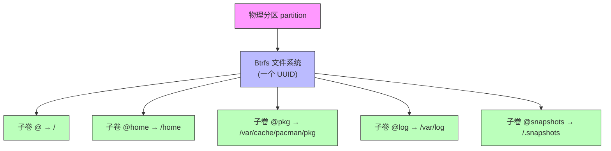

# 16 - Btrfs 高级玩法

> Btrfs 是 Linux 最强大的文件系统之一，集成了子卷快照、透明压缩、CoW (写时复制)、数据校验等特性。Arch 安装时选择 Btrfs 意味着可以享受系统级的"时间机器"。

---

## 16.1 Btrfs 核心概念



> [!info] 关键认知
> - 子卷不是分区，不需要预留空间
> - 所有子卷共享同一块存储池
> - 快照 = 某个子卷在某个时刻的只读副本（零空间占用，CoW 保证）

---

## 16.2 子卷布局设计

### 为什么分离 @、@home、@pkg、@log？

| 子卷 | 挂载点 | 原因 |
|------|--------|------|
| `@` | `/` | 根文件系统，快照保护系统文件 |
| `@home` | `/home` | 用户数据独立快照，回滚系统不影响个人文件 |
| `@pkg` | `/var/cache/pacman/pkg` | pacman 缓存，回滚时保留（避免重新下载） |
| `@log` | `/var/log` | 日志独立，排查问题时不会被快照回滚覆盖 |

### /etc/fstab 配置

```bash
# 同一块 NVMe 盘，Btrfs 子卷挂载
UUID=3762fae6-... / btrfs rw,relatime,compress=zstd:3,ssd,discard=async,space_cache=v2,subvol=/@ 0 0
UUID=3762fae6-... /home btrfs rw,relatime,compress=zstd:3,ssd,discard=async,space_cache=v2,subvol=/@home 0 0
UUID=3762fae6-... /var/cache/pacman/pkg btrfs rw,relatime,compress=zstd:3,ssd,discard=async,space_cache=v2,subvol=/@pkg 0 0
UUID=3762fae6-... /var/log btrfs rw,relatime,compress=zstd:3,ssd,discard=async,space_cache=v2,subvol=/@log 0 0
```

### 挂载选项详解

| 选项 | 说明 |
|------|------|
| `compress=zstd:3` | zstd 压缩，级别 3（1=最快, 15=最小, 3 是甜点） |
| `ssd` | SSD 优化模式 |
| `discard=async` | 异步 TRIM（不阻塞 I/O） |
| `space_cache=v2` | V2 空闲空间缓存（更快、更可靠） |
| `relatime` | 减少 atime 写入 |
| `noatime` | 完全禁用 atime（进一步减少写入，可选） |
| `autodefrag` | 自动在线碎片整理（可选，对 HDD 更有效） |
| `subvol=@` | 指定要挂载的子卷 |

---

## 16.3 子卷管理

```bash
# 查看所有子卷
sudo btrfs subvolume list /

# 输出示例：
# ID 256 gen 5847 top level 5 path @
# ID 257 gen 5847 top level 5 path @home
# ID 258 gen 5847 top level 5 path @pkg
# ID 259 gen 5847 top level 5 path @log

# 创建子卷
sudo btrfs subvolume create /mnt/@snapshots
sudo btrfs subvolume create /mnt/@games

# 删除子卷（无法撤销！）
sudo btrfs subvolume delete /path/to/subvol

# 查看子卷占用空间
sudo btrfs subvolume show /
sudo btrfs qgroup show / # 需要先启用 quota
```

---

## 16.4 快照系统

### Snapper 自动快照

```bash
# 安装
sudo pacman -S snapper

# 创建快照配置（为 / 子卷）
sudo snapper -c root create-config /

# 这会：
# 1. 创建 /.snapshots 子卷（独立于 @，不被 / 的快照覆盖）
# 2. 在 /etc/snapper/configs/root 生成配置
# 3. 启用 systemd timer：snapper-timeline.timer 和 snapper-cleanup.timer
```

### Snapper 配置调优

```bash
# /etc/snapper/configs/root

# 时间线快照频率
TIMELINE_CREATE="yes"
TIMELINE_HOURLY="5" # 保留最近 5 个小时快照
TIMELINE_DAILY="7" # 保留最近 7 天
TIMELINE_WEEKLY="4" # 保留最近 4 周
TIMELINE_MONTHLY="3" # 保留最近 3 月
TIMELINE_YEARLY="0" # 不保留年度

# 清理规则
NUMBER_CLEANUP="yes"
NUMBER_LIMIT="50" # 最多保留 50 个快照
NUMBER_LIMIT_IMPORTANT="10" # 重要快照最多 10 个

TIMELINE_CLEANUP="yes"
TIMELINE_LIMIT_HOURLY="5"
TIMELINE_LIMIT_DAILY="7"
TIMELINE_LIMIT_WEEKLY="4"
TIMELINE_LIMIT_MONTHLY="3"

# 不自动快照的子卷
SUBVOLUME="/home" # 如果用同一 Btrfs，排除 @home
SUBVOLUME="/var/cache/pacman/pkg"
SUBVOLUME="/var/log"
```

### 手动快照

```bash
# Snapper 风格
sudo snapper -c root create -d "更新前——2025-06-10"
sudo snapper -c root create -d "安装nvidia驱动前" -t pre
sudo snapper -c root create -d "安装完成" -t post --pre-number 15

# 原生 Btrfs 风格（不依赖 snapper）
sudo btrfs subvolume snapshot -r / /.snapshots/@-ro-$(date +%Y%m%d)
# -r = 只读快照（必须，send/receive 要求）

# 读写快照（用于回滚操作的中间步骤）
sudo btrfs subvolume snapshot / /.snapshots/@-rw-fix
```

### 查看与比较快照

```bash
# 列出快照
sudo snapper -c root list

# 比较两个快照间的文件变化
sudo snapper -c root status 15..20 # 15 到 20 之间变化的文件
sudo snapper -c root diff 15..20 # 详细的 diff 输出

# 撤销单个文件的更改（不整个回滚）
sudo snapper -c root undochange 15..20 /etc/pacman.conf
```

---

## 16.5 系统回滚

### 场景：滚动更新后系统崩了

```bash
# 1. 从 GRUB 高级选项进入快照或 Live USB
# 2. 挂载 Btrfs 根分区
mount -o subvol=/ /dev/nvme0n1p2 /mnt

# 3. 移动损坏的 @ 子卷
mv /mnt/@ /mnt/@-broken

# 4. 从快照创建新的 @
btrfs subvolume snapshot /mnt/.snapshots/N/snapshot /mnt/@

# 5. 重启
reboot
```

### 场景：用 snapper rollback

```bash
# Snapper 自带 rollback（对默认子卷机制）
sudo snapper -c root rollback 25
# 创建快照 25 的读写副本作为新的默认子卷，重启后生效
```

---

## 16.6 自动快照联动 — quicksave / quickload

```bash
# Shorin/DMS 工具链中的快照快速存取

# 更新前自动保存
quicksave -d quicksave-sysup

# 读档（需在恢复环境或快照模式下操作）
quickload
```

```bash
# sysup 脚本中的集成片段：
perform_update() {
 # 如果根文件系统是 btrfs 且 quicksave 可用
 if command -v quicksave >/dev/null 2>&1 && \
 [[ "$(findmnt -no FSTYPE /)" == "btrfs" ]]; then
 quicksave -d quicksave-sysup # 创建快照
 fi
 # ... 执行系统更新 ...
}
```

---

## 16.7 Btrfs Send/Receive（增量备份）

```bash
# 全量发送
sudo btrfs send /.snapshots/root-2025-01-01 | \
 sudo btrfs receive /mnt/backup/

# 增量发送（只传差异）
sudo btrfs send -p /.snapshots/root-2025-01-01 \
 /.snapshots/root-2025-02-01 | \
 sudo btrfs receive /mnt/backup/

# 发送到远程（通过 SSH）
sudo btrfs send /.snapshots/root-2025-01-01 | \
 ssh backup-server "sudo btrfs receive /backup/pool/"

# 增量远程
sudo btrfs send -p /.snapshots/root-2025-01-01 \
 /.snapshots/root-2025-02-01 | \
 ssh backup-server "sudo btrfs receive /backup/pool/"

# 实用备份脚本
#!/bin/bash
DEST="/run/media/backup/niri-laptop"
SRC="/.snapshots"
LAST=$(ls -1 "$DEST" 2>/dev/null | tail -1)

if [ -n "$LAST" ]; then
 sudo btrfs send -p "$SRC/$LAST" "$SRC/latest" | sudo btrfs receive "$DEST/"
else
 sudo btrfs send "$SRC/latest" | sudo btrfs receive "$DEST/"
fi
```

---

## 16.8 压缩

```bash
# 查看当前压缩状态
sudo btrfs filesystem df /
sudo compsize / # 需要安装 compsize

# 检查压缩率
compsize /home
# Processed 25643 files, 42112 regular extents
# Type Perc Disk Usage Uncompressed Referenced
# TOTAL 57% 2.1G 3.8G 4.1G

# 重新压缩已有数据（改变压缩级别）
sudo btrfs filesystem defragment -r -czstd:1 /home
# -czstd:1 = 用 zstd 级别 1 重新压缩

# 强制重压缩为更高级别（更小）
sudo btrfs filesystem defragment -r -czstd:9 /var/log

# 只对未压缩的文件压缩（不改已压缩的）
sudo btrfs filesystem defragment -r -czstd:3 -clzo /path
```

---

## 16.9 维护任务

### Scrub（数据完整性校验）

```bash
# 在线校验（不影响使用）
sudo btrfs scrub start /
sudo btrfs scrub status /
sudo btrfs scrub cancel /

# 自动 scrub（用 systemd timer）
sudo systemctl enable --now btrfs-scrub@-.timer
sudo systemctl enable --now btrfs-scrub@home.timer
```

### Balance（数据块平衡）

```bash
# 日常平衡（轻度，推荐定期执行）
sudo btrfs balance start -dusage=50 -musage=50 /

# 完全平衡（仅在磁盘空间极度碎片化时）
sudo btrfs balance start /

# 查看平衡状态
sudo btrfs balance status /
```

### 碎片整理

```bash
# 查看碎片程度
sudo btrfs filesystem usage /

# 碎片整理（谨慎使用，不推荐频繁执行，尤其对快照多的系统）
sudo btrfs filesystem defragment -r /home

# 排除目录（不要整理 CoW 重度目录）
# - 不要整理数据库文件、虚拟机镜像、torrent 下载目录
# 对这些目录禁用 CoW：
chattr +C /var/lib/postgresql/data
chattr +C /var/lib/libvirt/images
```

---

## 16.10 Btrfs-assistant（GUI 管理工具）

```bash
sudo pacman -S btrfs-assistant
# 或 paru -S btrfs-assistant

# 功能：
# - 可视化子卷树
# - 快照管理（创建/删除/回滚）
# - Scrub / Balance 一键执行
# - 磁盘使用统计
# - Snapper 配置 GUI
```

---

## 16.11 禁用 CoW（适合大文件/数据库/VM）

```bash
# 对目录禁用 CoW（新文件继承）
sudo chattr +C /var/lib/libvirt/images
sudo chattr +C /var/lib/postgresql/data
sudo chattr +C ~/.local/share/Steam

# 对单个文件禁用 CoW
touch /var/lib/libvirt/images/test.img
sudo chattr +C /var/lib/libvirt/images/test.img

# 验证 CoW 状态
lsattr /path/to/file
# 输出中 C 标志 = CoW 已禁用
```

### 为什么禁用 CoW？

```
场景 CoW=on CoW=off
数据库 (PostgreSQL) 写放大、碎片化 预分配 + 直接写入
虚拟机镜像 (qcow2) CoW on CoW 双重开销 直接 IO
BitTorrent 下载 极度碎片化 顺序写入
Steam 游戏库 碎片累积 性能稳定
```

---

## 16.12 数据校验

```bash
# Btrfs 自动计算和校验 checksum（默认 crc32c）

# 查看当前 checksum 算法
sudo btrfs inspect-internal dump-super /dev/nvme0n1p2 | grep csum

# 用更强的校验（需要重新格式化，不可在线改）
mkfs.btrfs --csum xxhash64 /dev/sdXX # 更快
mkfs.btrfs --csum sha256 /dev/sdXX # 更强

# 检测数据损坏
sudo btrfs scrub start /
# Scrub 读取所有数据块，对比 checksum，发现损坏尝试从镜像/奇偶校验修复
```

---

## 16.13 常用救援命令

```bash
# 文件系统检查（只读，不修复）
sudo btrfs check /dev/nvme0n1p2

# 修复（谨慎！先备份数据）
sudo btrfs check --repair /dev/nvme0n1p2

# 恢复坏掉的超级块（如果第一个坏了）
sudo btrfs rescue super-recover /dev/nvme0n1p2

# 零日志（如果日志损坏导致无法挂载）
sudo btrfs rescue zero-log /dev/nvme0n1p2

# 恢复文件（从损坏的文件系统中抢救）
sudo btrfs restore /dev/nvme0n1p2 /mnt/recovery

# 碎片化分析
sudo btrfs filesystem frag /path
```

---

## 16.14 Btrfs 监控

```bash
# 磁盘使用详情
btrfs filesystem usage /
# 输出：
# Overall:
# Device size: 476.94GiB
# Device allocated: 300.00GiB
# Device unallocated: 176.94GiB
# Used: 280.50GiB
# Free (estimated): 190.00GiB

# 实时 I/O 监控
sudo btrfs filesystem show /

# 快照占用（需要 quota）
sudo btrfs quota enable /
sudo btrfs qgroup show /

# 设备统计
sudo btrfs device stats /
```

---

## 16.15 Btrfs 最佳实践

```
 DO
 - 使用子卷分离系统/用户/缓存/日志
 - 启用 compress=zstd（SSD 级别 1-3，HDD 级别 3-6）
 - 定期 scrub（每月一次）
 - 更新前创建快照
 - 对数据库/VM/下载目录禁用 CoW
 - 用 noatime 减少写入量
 - 监控磁盘空间（Btrfs 空间不足时行为异常）

 DON'T
 - 在空间不足 10% 时继续大量写入（Btrfs 会进入只读模式）
 - 大量快照后做 full balance（极慢）
 - 在快照很多的系统上整理碎片（CoW 会复制所有快照数据）
 - 混用 RAID 级别（除非你确切知道在做什么）
 - 作为 /boot 文件系统（用 FAT32/EXT4）
```

---

