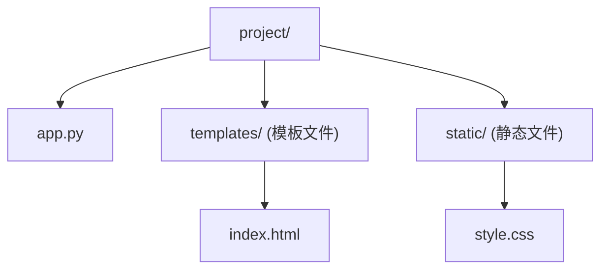

# Flask：十分钟起一个服务 (Flask Quickstart)
---

## 章节概述

Flask 是 Python 生态中最轻量的 Web 微框架——核心代码仅 5 行即可运行一个 HTTP 服务。本章面向 C 程序员，快速展示 Flask 的路由、请求/响应处理、JSON API 和模板渲染，让你在十分钟内就能为 C 后端服务搭建一个 Web 前端界面。

> **核心理念**：Flask 的哲学是"微框架，全自由"。它只提供最核心的路由和请求/响应封装，不强制任何项目结构、ORM 或模板引擎。对于 C 程序员而言，这恰好契合"最小依赖、手动控制"的习惯——你可以在 Flask 路由中通过 `subprocess` 调用 C 程序、通过 `ctypes` 加载 C 共享库、或者通过管道交换数据，Flask 只负责 HTTP 层。

---

### 第一节：最小 Flask 应用

一个完整的 Flask Web 服务，仅需 5 行代码：

```python
from flask import Flask
app = Flask(__name__)

@app.route('/')
def hello():
 return 'Hello, World!'

app.run()
```

保存为 `app.py`，执行 `python app.py`，浏览器打开 `http://127.0.0.1:5000` 即可看到页面。

甚至可以一行命令直接启动：

```bash
python -c "from flask import Flask; app=Flask(__name__); \
 @app.route('/'); def hello(): return 'Hello'; app.run()"
```

核心组件拆解：

| 组件 | 含义 | 对应 C 思维 |
|------|------|------------|
| `Flask(__name__)` | 创建 WSGI 应用实例 | 类似 `int main()` 入口 |
| `@app.route('/')` | 装饰器：将 URL 路径绑定到函数 | 类似注册回调函数指针 |
| `return 'Hello'` | 返回 HTTP 响应体（默认 200） | 类似 `write(socket, buf)` |
| `app.run()` | 启动内置开发服务器 | 类似 `while(1) { accept(); }` |

> Flask 内置的 Werkzeug 开发服务器**仅用于开发**，生产环境必须使用 gunicorn（见 [[05_部署：gunicorn与Docker|第 5 章 部署]]）。

---

### 第二节：路由与 URL 变量

路由是 URL 到处理函数的映射。Flask 支持多种路由模式：

```python
@app.route('/') # 根路径
def index():
 return 'Home Page'

@app.route('/user/<name>') # 动态变量（字符串）
def user(name):
 return f'User: {name}'

@app.route('/post/<int:post_id>') # 类型转换：int/float/path/uuid
def show_post(post_id):
 return f'Post #{post_id * 2}' # post_id 已是 int，不是字符串

@app.route('/files/<path:filepath>') # 匹配含 / 的路径
def serve_file(filepath):
 return f'File: {filepath}'
```

类型转换器对应 C 思维：

| 转换器 | Python 类型 | C 等价思维 |
|--------|------------|-----------|
| `<string:>` (默认) | `str` | `const char *` |
| `<int:>` | `int` | `atoi()` 自动完成 |
| `<float:>` | `float` | `atof()` 自动完成 |
| `<path:>` | `str`（含 `/`） | 原始字符串 |
| `<uuid:>` | `uuid.UUID` | 128-bit UUID 解析 |

`url_for()` 函数根据函数名反向生成 URL（避免硬编码）：

```python
from flask import url_for

@app.route('/user/<name>')
def profile(name):
 return f'Profile of {name}'

# url_for('profile', name='root') → '/user/root'
```

---

### 第三节：HTTP 方法与请求对象

Flask 默认只响应 GET 请求。通过 `methods` 参数指定支持的 HTTP 方法：

```python
from flask import request

@app.route('/login', methods=['GET', 'POST'])
def login():
 if request.method == 'POST':
 username = request.form['username'] # POST 表单数据
 password = request.form['password']
 return f'Hello, {username}'
 return '''
 <form method="post">
 <input name="username">
 <input name="password" type="password">
 <button type="submit">Login</button>
 </form>
 '''
```

`request` 对象常用属性（类比 C 中解析 HTTP 头）：

| 属性 | 内容 | C 对照 |
|------|------|--------|
| `request.method` | `'GET'`, `'POST'` 等 | 解析 HTTP 第一行 |
| `request.args` | URL 查询参数（`?key=val`） | 解析 QUERY_STRING |
| `request.form` | POST 表单数据 | 解析 POST body |
| `request.json` | JSON 请求体 | 解析 Content-Type: application/json |
| `request.headers` | HTTP 请求头 | 逐行读取 Header 字段 |
| `request.cookies` | Cookie 字典 | 解析 Cookie 头 |
| `request.files` | 上传的文件 | 解析 multipart/form-data |

获取 URL 查询参数：

```python
@app.route('/search')
def search():
 q = request.args.get('q', '') # 安全获取，设默认值
 page = request.args.get('page', 1, type=int) # 自动转 int
 return f'Searching for {q}, page {page}'
```

---

### 第四节：JSON API 与返回响应

对于前后端分离或 API 服务，JSON 是核心数据格式：

```python
from flask import jsonify, make_response

@app.route('/api/v1/data')
def get_data():
 return jsonify({
 'status': 'ok',
 'data': [1, 2, 3],
 'count': 3
 })
 # 自动设置 Content-Type: application/json

@app.route('/api/v1/compute')
def compute():
 # 典型场景：Flask 接收请求 → 调用 C 后端 → 返回结果
 result = {'sum': 100, 'product': 200}
 resp = make_response(jsonify(result))
 resp.headers['X-Custom-Header'] = 'value'
 resp.status_code = 201 # 自定义状态码
 return resp
```

错误响应：

```python
from flask import abort

@app.route('/api/v1/data/<int:id>')
def get_item(id):
 if id < 0:
 abort(400, description='Invalid ID: must be non-negative')
 return jsonify({'id': id, 'name': f'item_{id}'})
```

---

### 第五节：模板与静态文件（简述）

Flask 使用 Jinja2 模板引擎渲染 HTML。目录约定：



模板渲染：

```python
from flask import render_template

@app.route('/hello/<name>')
def hello(name):
 return render_template('index.html', name=name, items=[1, 2, 3])
```

```html
<!-- templates/index.html -->
<h1>Hello, {{ name }}!</h1>
<ul>

 <li>{{ item }}</li>

</ul>
```

静态文件自动挂载在 `/static/` 路径下，HTML 中用 `url_for('static', filename='style.css')` 引用。模板的详细用法见 [[03_模板与静态资源|第 3 章 模板与静态资源]]。

---

### 第六节：包装 C 后端为 Web 服务

Flask 最适宜作为 C 后端的 HTTP 前端。三种互操作模式：

**模式一：subprocess 调用 C 程序**

```python
import subprocess, json

@app.route('/api/c-run')
def c_run():
 result = subprocess.run(
 ['./bin/my_c_program', '--input', '42'],
 capture_output=True, text=True, timeout=5
 )
 return jsonify({
 'exit_code': result.returncode,
 'stdout': result.stdout,
 'stderr': result.stderr
 })
```

**模式二：ctypes 调用 C 共享库**

```python
import ctypes

lib = ctypes.CDLL('./lib/libcompute.so')

> **跨平台提示**：ctypes 加载共享库时注意后缀差异——Linux 用 `.so`，macOS 用 `.dylib`，Windows 用 `.dll`。跨平台代码请参考 [[../2精通/05_ctypes：在Python中调用C库|ctypes 章节]]。
lib.compute_sum.argtypes = [ctypes.c_int, ctypes.c_int]
lib.compute_sum.restype = ctypes.c_int

@app.route('/api/sum/<int:a>/<int:b>')
def api_sum(a, b):
 result = lib.compute_sum(a, b)
 return jsonify({'sum': result})
```

**模式三：管道/共享内存/消息队列**

```python
# 打开命名管道与 C 后台进程通信
@app.route('/api/pipe-query')
def pipe_query():
 with open('/tmp/c_backend.pipe', 'w') as f:
 f.write('QUERY\n')
 with open('/tmp/c_backend_resp.pipe', 'r') as f:
 result = f.read()
 return jsonify({'result': result.strip()})
```

> ctypes 的完整用法见 [[../2精通/05_ctypes：在Python中调用C库|精通 05 ctypes]]，进程间通信见 [[../2精通/08_subprocess与进程管道：C与Python数据交换|精通 08 进程管道]]。

---

### 第七节：蓝图（Blueprint）——模块化路由

大型项目中，所有路由写在一个文件里不可维护。Blueprint 允许将路由拆分到不同模块：

```python
# blueprints/auth.py
from flask import Blueprint, request, jsonify

auth_bp = Blueprint('auth', __name__, url_prefix='/auth')

@auth_bp.route('/login', methods=['POST'])
def login():
    data = request.json
    # 验证逻辑...
    return jsonify({'token': 'xxx'})

@auth_bp.route('/register', methods=['POST'])
def register():
    return jsonify({'status': 'registered'})
```

```python
# app.py
from flask import Flask
from blueprints.auth import auth_bp

app = Flask(__name__)
app.register_blueprint(auth_bp)

# 路由变为 /auth/login, /auth/register
```

类比 C：Blueprint 类似把 `switch-case` 拆分成多个 `.c` 文件中的函数表，再通过 `register` 统一注册。

---

### 第八节：中间件与钩子

```python
@app.before_request
def before():
    # 每个请求之前执行（认证检查、日志等）
    if request.endpoint != 'login' and not check_auth():
        return jsonify({'error': 'unauthorized'}), 401

@app.after_request
def after(response):
    # 每个请求之后执行（添加 headers、CORS 等）
    response.headers['X-Request-Time'] = str(time.time())
    return response

@app.errorhandler(404)
def not_found(e):
    return jsonify({'error': 'not found'}), 404

@app.errorhandler(500)
def server_error(e):
    return jsonify({'error': 'internal server error'}), 500
```

---

### 第九节：Flask 与数据库

```python
# SQLite（轻量方案）
import sqlite3

def get_db():
    if 'db' not in g:
        g.db = sqlite3.connect('app.db')
        g.db.row_factory = sqlite3.Row
    return g.db

@app.teardown_appcontext
def close_db(exception):
    db = g.pop('db', None)
    if db is not None:
        db.close()

@app.route('/users')
def users():
    db = get_db()
    rows = db.execute('SELECT * FROM users').fetchall()
    return jsonify([dict(r) for r in rows])
```

```python
# SQLAlchemy（ORM 方案）
from flask_sqlalchemy import SQLAlchemy

app.config['SQLALCHEMY_DATABASE_URI'] = 'sqlite:///app.db'
db = SQLAlchemy(app)

class User(db.Model):
    id = db.Column(db.Integer, primary_key=True)
    name = db.Column(db.String(80))

# db.create_all()  # 创建表
# User.query.all()  # 查询
```

---

### 第十节：WebSocket 实时通信

```bash
pip install flask-sock
```

```python
from flask_sock import Sock
import json

sock = Sock(app)

@sock.route('/ws')
def echo(ws):
    while True:
        data = ws.receive()
        ws.send(json.dumps({'echo': data}))
```

适用场景：实时日志推送、聊天、股票行情。

---

## 速查卡片

| 需求 | 命令 |
|------|------|
| 安装 | `pip install flask` |
| 创建应用 | `app = Flask(__name__)` |
| 路由 | `@app.route('/path')` |
| JSON 响应 | `jsonify({'key': 'value'})` |
| 模板渲染 | `render_template('tpl.html', var=val)` |
| 蓝图 | `Blueprint('name', __name__)` |
| 启动 | `app.run(debug=True)` |
| 生产部署 | `gunicorn app:app` |
