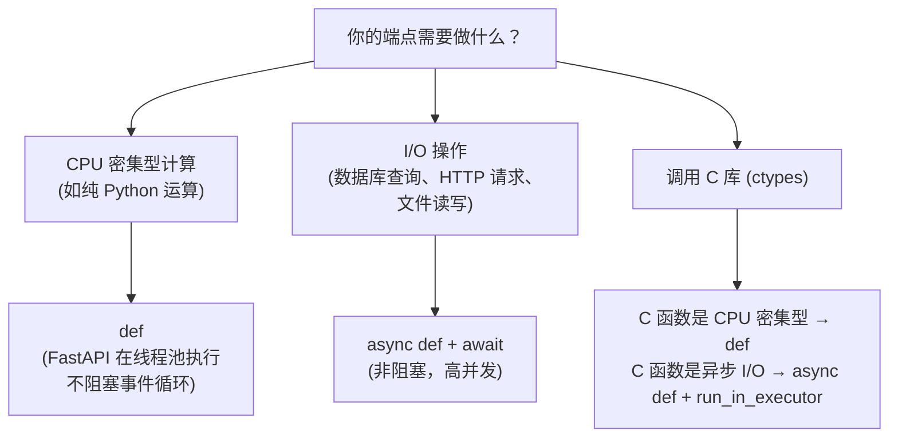

# FastAPI：现代异步 API (FastAPI: Modern Async API)
---

## 章节概述

FastAPI 是 Python Web 框架的新一代选择——基于 Python 类型提示实现自动参数校验、自动生成 OpenAPI 交互文档、原生支持 `async/await`。本章对比 Flask 说明 FastAPI 的核心优势，展示如何用 Pydantic 模型定义结构化数据、用类型提示声明路径/查询参数，以及构建最小 CRUD API。对于需要高频调用 C 后端的场景，`async` 端点能显著提升吞吐量。

> **核心理念**：FastAPI 将"类型就是文档"发挥到极致——你写的 Python 类型提示同时承担了运行时校验、IDE 自动补全和 API 文档生成三重职责。对于 C 程序员，这意味着你不需要在代码之外维护接口文档，也不需要手写参数校验逻辑。正如 C 语言中 `int f(int x)` 的签名自身就是约束，FastAPI 把这一哲学带到了 Web API 层。

---

### 第一节：FastAPI vs Flask — 为什么还需要一个框架？

Flask 和 FastAPI 的核心差异：

| 维度 | Flask | FastAPI |
|------|-------|---------|
| 服务器协议 | WSGI（同步） | ASGI（异步） |
| 数据校验 | 手动（需 WTForms 等） | 自动（Pydantic + 类型提示） |
| API 文档 | 手动书写或扩展 | 自动生成 Swagger/ReDoc |
| 异步支持 | 需扩展（Quart） | 原生 `async/await` |
| 性能 | 一般（同步阻塞） | 高（异步非阻塞） |
| 学习曲线 | 平缓 | 平缓（类型提示直观） |

WSGI vs ASGI 的本质差异（类比 C 思维）：

```
WSGI (PEP 3333):
 单请求 → 单线程处理 → 函数返回 → 响应
 类似 C 中: while(1) { fd=accept(); handle(fd); }

ASGI (PEP 异步):
 多个请求可在一个线程中交错处理 → await 切换
 类似 C 中: epoll + 非阻塞 I/O → 单线程高并发
```

> 如果你只需要简单的 Web UI 包装 C 后端，Flask 足够。但如果你的 API 需要处理大量并发请求（如多个 C 计算任务的异步调度），FastAPI 是更好的选择。

最小 FastAPI 应用：

```python
from fastapi import FastAPI

app = FastAPI()

@app.get("/")
def read_root():
 return {"Hello": "World"}
```

保存为 `main.py`，用 uvicorn 启动：

```bash
pip install fastapi uvicorn
uvicorn main:app --reload
```

---

### 第二节：路径参数与查询参数的类型提示

FastAPI 的核心机制：函数参数的类型提示直接定义 API 的输入契约。

```python
from fastapi import FastAPI

app = FastAPI()

@app.get("/users/{user_id}") # 路径参数
def get_user(user_id: int): # 类型提示 → 自动转 int
 return {"user_id": user_id, "type": type(user_id).__name__}
# GET /users/42 → {"user_id": 42, "type": "int"}
# GET /users/abc → 422 Unprocessable Entity（自动校验拒绝）

@app.get("/items/") # 查询参数
def list_items(skip: int = 0, limit: int = 10, q: str | None = None):
 return {"skip": skip, "limit": limit, "q": q}
# GET /items/?skip=20&limit=5 → {"skip": 20, "limit": 5, "q": null}

@app.get("/files/{file_path:path}") # 路径参数含 / 时用 :path
def read_file(file_path: str):
 return {"file_path": file_path}
```

可选参数与默认值——Python 类型系统 vs C 的对照：

| 声明 | 含义 | C 等价思维 |
|------|------|-----------|
| `q: str` | 必需参数 | `const char *q; // 必须提供` |
| `q: str \| None = None` | 可选字符串 | `const char *q = NULL;` |
| `q: str = "default"` | 可选，带默认值 | `const char *q = "default";` |
| `limit: int = 10` | 可选整数，默认 10 | `int limit = 10;` |
| `tags: list[str] = []` | 字符串列表 | `char **tags; int tagc;` |

枚举类型参数：

```python
from enum import Enum

class ModelName(str, Enum):
 alexnet = "alexnet"
 resnet = "resnet"
 lenet = "lenet"

@app.get("/models/{model_name}")
def get_model(model_name: ModelName):
 if model_name is ModelName.alexnet:
 return {"model_name": model_name, "message": "Deep Learning FTW!"}
 return {"model_name": model_name}
```

---

### 第三节：请求体与 Pydantic 模型

FastAPI 使用 Pydantic 定义请求体/响应体的数据结构。Pydantic 之于 FastAPI，如同 `struct` 之于 C：

```python
from pydantic import BaseModel, Field

class Item(BaseModel):
 name: str
 price: float = Field(gt=0, description="价格必须大于 0")
 description: str | None = None
 tax: float | None = None
 tags: list[str] = []

@app.post("/items/")
def create_item(item: Item): # item 自动从 JSON body 解析
 total = item.price + (item.tax or 0)
 return {"item": item, "total": total}

@app.put("/items/{item_id}")
def update_item(item_id: int, item: Item):
 return {"item_id": item_id, **item.model_dump()}
```

Pydantic 的内置校验能力：

```python
from pydantic import BaseModel, Field, field_validator

class User(BaseModel):
 username: str = Field(min_length=3, max_length=50)
 email: str = Field(pattern=r'^[a-zA-Z0-9_.+-]+@[a-zA-Z0-9-]+\.[a-zA-Z0-9-.]+$')
 age: int = Field(ge=18, le=120)

 @field_validator('username')
 @classmethod
 def username_must_not_contain_space(cls, v: str) -> str:
 if ' ' in v:
 raise ValueError('用户名不能包含空格')
 return v
```

> 对比 C 编程：在 C 中你需要手写 `if(strlen(username) < 3) return -1;` 之类的校验代码。FastAPI 中声明即校验——`Field(min_length=3)` 帮你做了这件事。

---

### 第四节：自动 API 文档与 OpenAPI

启动 FastAPI 应用后，浏览器访问：

- `http://127.0.0.1:8000/docs` — Swagger UI 交互式文档
- `http://127.0.0.1:8000/redoc` — ReDoc 文档
- `http://127.0.0.1:8000/openapi.json` — 原始 OpenAPI 3.0 JSON

文档完全由你的类型提示和 Pydantic 模型自动生成，无需手动书写。可以添加元信息：

```python
app = FastAPI(
 title="C Backend API",
 description="为 C 计算引擎提供 HTTP API 接口",
 version="1.0.0",
)

@app.get("/compute", tags=["计算"],
 summary="执行计算任务",
 response_description="计算结果")
def compute():
 return {"result": 42}
```

---

### 第五节：异步端点与 async/await

FastAPI 原生支持 `async def` 端点。关键理解：**同步 vs 异步的执行模型**。

```python
import asyncio
import time

# 同步端点：运行在线程池中（不阻塞事件循环）
@app.get("/sync")
def sync_endpoint():
 time.sleep(2) # 阻塞当前线程 2 秒
 return {"msg": "sync done"}

# 异步端点：运行在事件循环中
@app.get("/async")
async def async_endpoint():
 await asyncio.sleep(2) # 非阻塞等待
 return {"msg": "async done"}
```

使用场景决策树：



调用 C 库的正确姿势——将阻塞操作放入线程池：

```python
import asyncio
import ctypes
from concurrent.futures import ThreadPoolExecutor

lib = ctypes.CDLL('./lib/libheavy.so')

> **跨平台提示**：`.so` 为 Linux/macOS 格式；Windows 上用 `.dll`。跨平台加载方案详见 [[../2精通/05_ctypes：在Python中调用C库|ctypes 章节]]。
lib.heavy_compute.restype = ctypes.c_double

pool = ThreadPoolExecutor(max_workers=4)

@app.get("/c-compute")
async def c_compute(input: float):
 loop = asyncio.get_event_loop()
 # 在线程池中运行阻塞的 C 函数，不阻塞事件循环
 result = await loop.run_in_executor(pool, lib.heavy_compute, ctypes.c_double(input))
 return {"input": input, "result": result}
```

---

### 第六节：最小 CRUD API 示例

完整的内存存储 CRUD API，展示 FastAPI 端到端用法：

```python
from fastapi import FastAPI, HTTPException
from pydantic import BaseModel
from typing import Optional

app = FastAPI()

class Task(BaseModel):
 id: Optional[int] = None
 title: str
 done: bool = False

db: dict[int, Task] = {}
next_id = 1

@app.post("/tasks", status_code=201)
def create_task(task: Task):
 global next_id
 task.id = next_id
 db[next_id] = task
 next_id += 1
 return task

@app.get("/tasks")
def list_tasks():
 return list(db.values())

@app.get("/tasks/{task_id}")
def get_task(task_id: int):
 if task_id not in db:
 raise HTTPException(status_code=404, detail="Task not found")
 return db[task_id]

@app.put("/tasks/{task_id}")
def update_task(task_id: int, task: Task):
 if task_id not in db:
 raise HTTPException(status_code=404, detail="Task not found")
 task.id = task_id
 db[task_id] = task
 return task

@app.delete("/tasks/{task_id}", status_code=204)
def delete_task(task_id: int):
 if task_id not in db:
 raise HTTPException(status_code=404, detail="Task not found")
 del db[task_id]
```

用 `curl` 或 Swagger UI 测试所有端点。这只是内存存储——后续章节会结合 SQLite 实现持久化（见 [[04_SQLite与ORM集成|第 4 章 SQLite 与 ORM]]）。

---

### 小节练习


> [!question] 判断题 1
> FastAPI 中使用 `async def` 定义的端点自动就是异步的，不需要额外配置。 （ ）
> - [ ] 正确
> - [ ] 错误
>
> > [!success]- 点击查看答案
> > 答案: 正确
> > **解析**: 只要用 `async def` 定义，FastAPI 自动在 ASGI 事件循环中运行该端点。但如果内部有阻塞操作（如 `time.sleep()`），仍然会阻塞事件循环。


---

## 章节测试

### 一、判断题（正确选 ，错误选 ）

> [!question] 判断题 1
> FastAPI 的服务器协议 ASGI 支持异步处理，而 Flask 的 WSGI 只支持同步处理。 （ ）
> - [ ] 正确
> - [ ] 错误
>
> > [!success]- 点击查看答案
> > 答案: 正确
> > **解析**: WSGI 是同步协议，一个请求占用一个线程；ASGI 是异步协议，支持在一个线程中交错处理多个请求。

> [!question] 判断题 2
> FastAPI 中使用 Pydantic 模型定义的请求体，字段类型校验是编译时完成的。 （ ）
> - [ ] 正确
> - [ ] 错误
>
> > [!success]- 点击查看答案
> > 答案: 错误
> > **解析**: Pydantic 的校验是运行时完成的。Python 的类型提示本身不强制，Pydantic 在运行时根据类型提示进行数据校验和转换。

> [!question] 判断题 3
> FastAPI 的 `@app.get()` 和 `@app.post()` 本质是一样的，只是函数名不同。 （ ）
> - [ ] 正确
> - [ ] 错误
>
> > [!success]- 点击查看答案
> > 答案: 错误
> > **解析**: 不同的装饰器绑定了不同的 HTTP 方法：`@app.get()` 响应 GET，`@app.post()` 响应 POST。同一个路径可以用不同方法对应不同函数。

> [!question] 判断题 4
> 在 `async def` 端点中调用 `time.sleep(5)` 会阻塞整个 ASGI 事件循环。 （ ）
> - [ ] 正确
> - [ ] 错误
>
> > [!success]- 点击查看答案
> > 答案: 正确
> > **解析**: `time.sleep()` 是同步阻塞调用，在 `async def` 中执行会阻塞事件循环，导致所有其他请求无法处理。应该用 `await asyncio.sleep(5)` 或将阻塞操作放入线程池。

> [!question] 判断题 5
> uvicorn 是 FastAPI 的依赖，提供了 WSGI 服务器功能。 （ ）
> - [ ] 正确
> - [ ] 错误
>
> > [!success]- 点击查看答案
> > 答案: 错误
> > **解析**: uvicorn 是 **ASGI** 服务器（不是 WSGI）。Flask 用 gunicorn（WSGI 服务器），FastAPI 用 uvicorn（ASGI 服务器）。

---


---

## 力扣练习

以下题目用于验证本章所学内容：

| 题号 | 题目 | 链接 | 涉及知识点 |
|------|------|------|-----------|
| — | 本章无对应力扣题 | — | 请用动手练习题自检 |


### 动手练习题

> [!example] 练习题 1：类型驱动的 API
> **难度**: 简单
>
> 用 FastAPI 实现一个 `/add` 端点，接受查询参数 `a: float` 和 `b: float`，返回 `{"result": a + b}`。访问 Swagger UI 测试不同类型的输入（字符串、浮点数），观察自动校验的行为。

> [!example] 练习题 2：Pydantic 模型实践
> **难度**: 简单
>
> 定义一个 `Student` Pydantic 模型，字段包括：
> - `name: str`（长度 2-20）
> - `age: int`（6-30）
> - `scores: list[float]`（最多 10 个元素）
>
> 实现 `POST /students` 创建学生、`GET /students` 列出所有学生。使用内存字典存储。

> [!example] 练习题 3：异步 C 调用封装
> **难度**: 简单
>
> 写一个 C 共享库（`libdelay.so`），导出一个函数 `double slow_sqrt(double x)`，内部用 `sleep(1)` 模拟耗时计算后返回 `sqrt(x)`。在 FastAPI 的 `async def` 端点中用 `run_in_executor` 调用，同时支持并发请求，验证异步非阻塞效果。

> [!example] 练习题 4：完整 CRUD 迁移
> **难度**: 简单
>
> 将本章第六节的 Task CRUD API 复制到本地，启动 uvicorn 后用 Swagger UI 完整测试所有端点（创建→列表→获取→更新→删除）。然后用 `curl` 等价操作重试一遍，对比两种测试方式的便利性。
