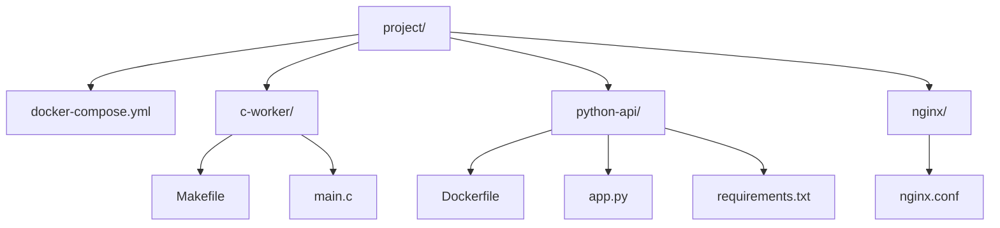

# 部署：gunicorn 与 Docker (Deployment)
---

## 章节概述

开发环境跑通了，下一步是将服务部署到生产环境。本章覆盖 WSGI 服务器 gunicorn（Flask 生产部署）、ASGI 服务器 uvicorn（FastAPI 生产部署）、Docker 容器化、Nginx 反向代理、systemd 服务管理，以及一个完整的 Docker Compose 示例——C 后端作为工作进程，Python Flask 提供 HTTP API 前端。

> **核心理念**：Python Web 应用的部署本质上是一个"进程管理 + 网络层"问题——你不直接暴露 Flask 的开发服务器，而是在它前面放一个生产级网关。这有点像 C 程序不会直接裸奔在公网上，而是包一层守护进程和 iptables 规则。Docker 则进一步将整个运行环境打包为可移植的容器，解决了"我机器上能跑，你机器上不行"的经典问题。

---

### 第一节：WSGI 服务器 — gunicorn 部署 Flask

Flask 内置的 `app.run()` 调用的是 Werkzeug 开发服务器，单进程、单线程、无资源限制——生产环境**绝对不要用它**。

gunicorn（Green Unicorn）是 Python 生态中最成熟的 WSGI 生产服务器：

```bash
pip install gunicorn

# 基本启动：gunicorn -w 4 -b 0.0.0.0:8000 app:app
# -w   worker 进程数（一般 = CPU 核心数 × 2 + 1）
# -b   绑定地址和端口
# app  模块名（app.py 中的 app = Flask(__name__)）
# :app Flask 实例变量名
```

核心参数：

| 参数 | 含义 | 建议值 |
|------|------|--------|
| `-w` / `--workers` | 工作进程数 | `2 * CPU 核数 + 1` |
| `-b` / `--bind` | 绑定地址 | `0.0.0.0:8000` |
| `-k` / `--worker-class` | worker 类型 | `sync`（默认）, `gevent`（异步） |
| `--timeout` | 请求超时秒 | `30`（调用 C 后端时可加大） |
| `--max-requests` | worker 处理 N 请求后重启 | `10000`（防内存泄漏） |
| `--daemon` | 后台运行 | 生产环境不建议，用 systemd 管理 |
| `--access-logfile` | 访问日志文件 | `-` 表示 stdout |
| `--error-logfile` | 错误日志文件 | `-` 表示 stderr |

完整启动命令：

```bash
gunicorn \
 --workers 4 \
 --bind 0.0.0.0:8000 \
 --timeout 60 \
 --max-requests 10000 \
 --access-logfile /var/log/myapp/access.log \
 --error-logfile /var/log/myapp/error.log \
 app:app
```

> **跨平台提示**：
> - **Windows**：gunicorn 不支持 Windows，使用 `waitress`（`pip install waitress; waitress-serve --port=8000 app:app`）作为 WSGI 替代，日志输出到文件或 stdout
> - **macOS**：与 Linux 一致，但日志路径建议用 `/usr/local/var/log/` 或项目相对路径

配置文件的替代方案（`gunicorn.conf.py`）：

```python
bind = "0.0.0.0:8000"
workers = 4
timeout = 60
max_requests = 10000
accesslog = "/var/log/myapp/access.log"
errorlog = "/var/log/myapp/error.log"
```

```bash
gunicorn -c gunicorn.conf.py app:app
```

Worker 类型选择：

| Worker 类型 | 适用场景 | 注意 |
|------------|---------|------|
| `sync` | 一般 Web 应用，响应快 | 慢请求会阻塞 worker |
| `gevent` | 有 I/O 等待（调外部 API） | 需 `pip install gevent` |
| `gthread` | 多线程，适合调用 C 库 | 注意 GIL |

> 如果你的 Flask 端点通过 ctypes 调用 C 库做 CPU 密集型计算，`sync` worker + 多进程是最简单可靠的选择。

---

### 第二节：ASGI 服务器 — uvicorn 部署 FastAPI

FastAPI 基于 ASGI 协议，用 uvicorn（或配合 gunicorn）作为生产服务器：

```bash
pip install uvicorn

# 单进程模式（开发）
uvicorn main:app --host 0.0.0.0 --port 8000 --reload

# 多进程模式（生产）—— 使用 gunicorn 管理 uvicorn worker
pip install gunicorn
gunicorn main:app \
 --workers 4 \
 --worker-class uvicorn.workers.UvicornWorker \
 --bind 0.0.0.0:8000
```

WSGI vs ASGI 部署对照表：

| | Flask | FastAPI |
|---|-------|---------|
| 协议 | WSGI | ASGI |
| 开发服务器 | `app.run()` (Werkzeug) | `uvicorn main:app --reload` |
| 生产服务器 | `gunicorn app:app -w 4` | `gunicorn -k uvicorn.workers.UvicornWorker` |
| 或直接用 | — | `uvicorn main:app --workers 4` |

---

### 第三节：Nginx 反向代理

Nginx 位于 gunicorn/uvicorn 前面，负责：
- 静态文件服务（直接返回，不经过 Python）
- 请求缓冲（保护后端 Python 进程）
- SSL 终止（HTTPS）
- 负载均衡（多个 gunicorn 实例）

基础 Nginx 配置 `/etc/nginx/sites-available/myapp`：

```nginx
upstream app_server {
 server 127.0.0.1:8000; # gunicorn 监听地址
 # server 127.0.0.1:8001; # 可添加多个后端做负载均衡
}

server {
 listen 80;
 server_name example.com;

 # 静态文件直接由 Nginx 提供（不经过 Python）
 location /static/ {
 alias /opt/myapp/static/;
 expires 30d;
 add_header Cache-Control "public, immutable";
 }

 # 其他请求代理给 gunicorn
 location / {
 proxy_pass http://app_server;
 proxy_set_header Host $host;
 proxy_set_header X-Real-IP $remote_addr;
 proxy_set_header X-Forwarded-For $proxy_add_x_forwarded_for;
 proxy_set_header X-Forwarded-Proto $scheme;
 proxy_connect_timeout 30;
 proxy_read_timeout 60; # C 后端计算慢时可增大
 }
}
```

启用配置：

```bash
sudo ln -s /etc/nginx/sites-available/myapp /etc/nginx/sites-enabled/
sudo nginx -t # 测试配置语法
sudo systemctl reload nginx # 重新加载
```

> 如果你觉得 Nginx 配置太复杂，可以试试 **Caddy**——自动 HTTPS、配置极简（3 行起）、一个二进制文件。对于内部工具或小项目，Caddy 的学习成本远低于 Nginx。

---

### 第四节：systemd 服务管理

将 gunicorn 注册为 systemd 服务，实现开机自启、崩溃自动重启、日志集成。

> **跨平台提示**：
> - **Windows**：使用 Windows Service (NSSM 包装) 或任务计划程序（Task Scheduler）实现开机自启
> - **macOS**：使用 `launchd`（plist 配置文件放在 `~/Library/LaunchAgents/`），或 Docker 统一管理
> - 跨平台推荐方案：Docker + `restart: always`，彻底消除 OS 差异

服务文件 `/etc/systemd/system/myapp.service`：

```ini
[Unit]
Description=MyApp Flask Web Service
After=network.target

[Service]
User=www-data
Group=www-data
WorkingDirectory=/opt/myapp
Environment="PATH=/opt/myapp/venv/bin"
ExecStart=/opt/myapp/venv/bin/gunicorn \
 -c /opt/myapp/gunicorn.conf.py \
 app:app
Restart=always
RestartSec=5

[Install]
WantedBy=multi-user.target
```

管理命令：

```bash
sudo systemctl daemon-reload # 修改 service 文件后重载
sudo systemctl enable myapp # 开机自启
sudo systemctl start myapp # 启动
sudo systemctl status myapp # 查看状态
sudo journalctl -u myapp -f # 实时查看日志
sudo systemctl stop myapp # 停止
```

---

### 第五节：Docker 容器化

Docker 让环境一致性成为可能——容器内包含 Python 解释器、C 编译器、所有依赖和你的应用代码。

**基础 Dockerfile：**

```dockerfile
FROM python:3.12-slim

WORKDIR /app

# 安装系统依赖（C 程序运行时需要的库）
RUN apt-get update && apt-get install -y --no-install-recommends \
 libsqlite3-0 \
 && rm -rf /var/lib/apt/lists/*

COPY requirements.txt .
RUN pip install --no-cache-dir -r requirements.txt

COPY . .

EXPOSE 8000

CMD ["gunicorn", "-w", "4", "-b", "0.0.0.0:8000", "app:app"]
```

**多阶段构建（编译 C 程序 + Python 运行）：**

```dockerfile
FROM gcc:13 AS c-builder
WORKDIR /src
COPY src/c-backend/ .
RUN gcc -O2 -o c-worker worker.c

FROM python:3.12-slim
WORKDIR /app
COPY --from=c-builder /src/c-worker /app/bin/c-worker

COPY requirements.txt .
RUN pip install --no-cache-dir -r requirements.txt
COPY python-app/ .

EXPOSE 8000
CMD ["gunicorn", "-w", "4", "-b", "0.0.0.0:8000", "app:app"]
```

构建与运行：

```bash
docker build -t myapp:latest .
docker run -d -p 8000:8000 --name myapp myapp:latest
docker logs -f myapp
```

---

### 第六节：Docker Compose — C 后端 + Python 前端

完整示例：C 计算程序作为 worker，Python Flask 作为 HTTP API 前端。

项目结构：



`c-worker/main.c`（计算程序，从 stdin 读 JSON，输出 JSON 到 stdout）：

```c
#include <stdio.h>
#include <stdlib.h>
// reads: {"op":"add","a":3,"b":5}
// writes: {"result":8}
int main() {
 char line[256];
 while (fgets(line, sizeof(line), stdin)) {
 int a, b;
 sscanf(line, "{\"a\":%d,\"b\":%d}", &a, &b);
 printf("{\"result\":%d}\n", a + b);
 fflush(stdout);
 }
 return 0;
}
```

`python-api/app.py`：

```python
import subprocess, json
from flask import Flask, request, jsonify

app = Flask(__name__)

@app.route('/api/compute', methods=['POST'])
def compute():
 data = request.json
 proc = subprocess.run(
 ['/app/bin/c-worker'],
 input=json.dumps(data),
 capture_output=True, text=True
 )
 return jsonify(json.loads(proc.stdout))
```

`docker-compose.yml`：

```yaml
version: '3.8'
services:
 c-worker:
 build:
 context: ./c-worker
 dockerfile: Dockerfile
 image: c-worker:latest

 python-api:
 build:
 context: ./python-api
 dockerfile: Dockerfile
 ports:
 - "8000:8000"
 depends_on:
 - c-worker
 volumes:
 - shared-data:/tmp/shared

 nginx:
 image: nginx:alpine
 ports:
 - "80:80"
 volumes:
 - ./nginx/nginx.conf:/etc/nginx/conf.d/default.conf:ro
 - ./python-api/static:/usr/share/nginx/html/static:ro
 depends_on:
 - python-api

volumes:
 shared-data:
```

> 这个架构实现了完整的"C 后端 + Python 前端"分层：C 处理计算密集型任务，Python 处理 HTTP 协议和业务逻辑，Nginx 处理静态文件和反向代理。C 程序员可以从最内层（C worker）写到最外层（Nginx），全栈贯通。

---

---

## 力扣练习

以下题目用于验证本章所学内容：

| 题号 | 题目 | 链接 | 涉及知识点 |
|------|------|------|-----------|
| — | 本章无对应力扣题 | — | 请用动手练习题自检 |
