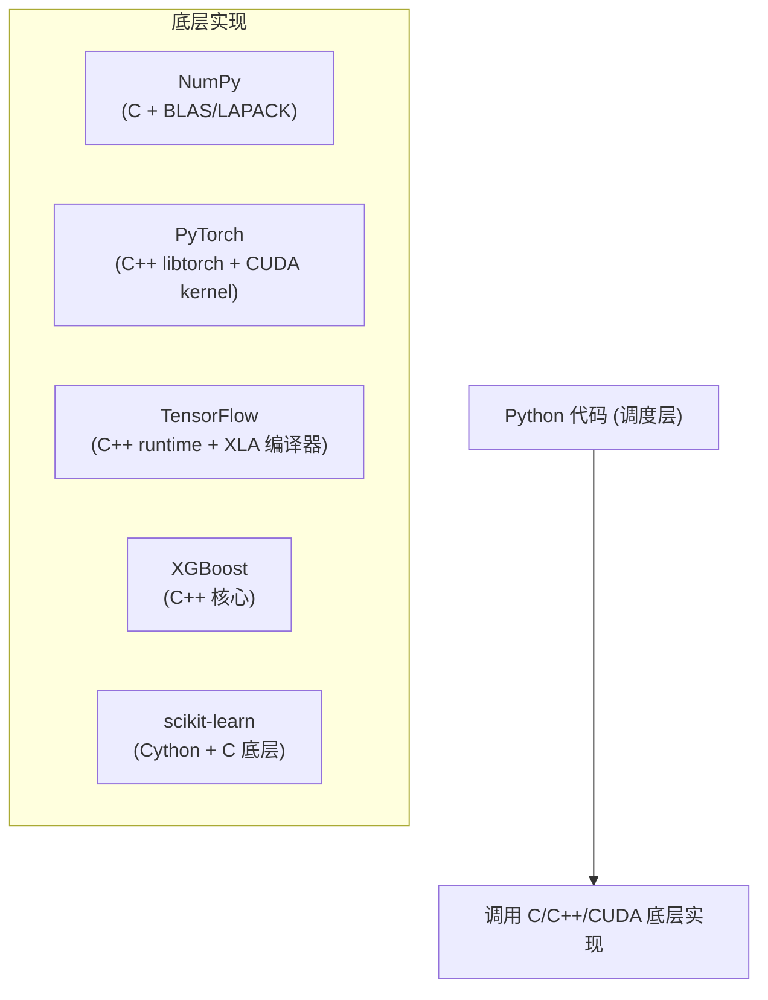
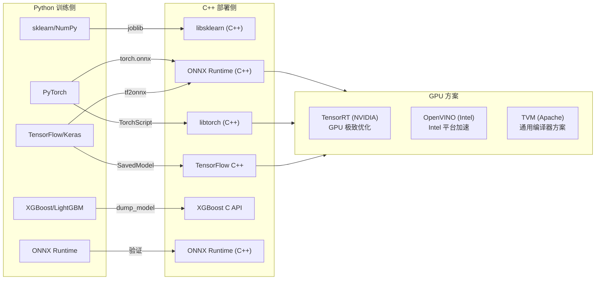

# AI 生态概览：从 sklearn 到 PyTorch (AI Ecosystem Overview)
---

## 章节概述

Python 是当前人工智能/机器学习领域的主导语言，几乎所有主流框架都提供 Python API。本章为 C 程序员绘制 Python AI 生态全景图，帮助你理解各工具的定位和选择：哪些适合传统机器学习，哪些适合深度学习，以及最终如何将 Python 训练的模型部署到 C++ 生产环境中。

> **核心理念**：Python 是 AI 的**训练和原型语言**，C/C++ 是 AI 的**推理部署语言**。你用 Python 训练模型（易用、生态丰富），用 C/C++ 执行推理（低延迟、可控内存、嵌入式设备）。理解 Python 生态不是为了"转行写 Python"，而是为了看懂、修改、导出模型到 C++ 侧。

---

### 第一节：Python AI 生态全景图

1.1 为什么 Python 统治 AI
--------------------------

C 程序员可能会疑惑：Python 这么慢，为什么 AI 领域全是 Python？



Python 只是"胶水语言"——所有性能敏感的计算都在 C/C++/CUDA 中完成。你用简洁的 Python 语法调度高效的底层实现。这和 C 程序员用 shell 脚本调度编译流程是同样的哲学。

1.2 AI 工具的四个层次
----------------------

| 层次 | 工具 | 类比（C 视角） |
|------|------|---------------|
| **传统 ML** | sklearn, XGBoost, LightGBM | libc 标准库 — 成熟稳定、开箱即用 |
| **深度学习框架** | PyTorch, TensorFlow/Keras | 编译器后端 — 构建计算图并优化执行 |
| **预训练模型** | HuggingFace, timm, torchvision | 静态库 — 别人训练好的模型直接拿来用 |
| **LLM/Agent 应用层** | LangChain, LlamaIndex | 应用程序框架 — 在模型之上构建业务逻辑 |

1.3 Python ↔ C++ 部署管道全景
------------------------------



> **关键路径**：`Python 训练 → 导出 ONNX → C++ 加载 ONNX → ONNX Runtime 推理` 是最通用的跨框架部署方案。TensorRT 是 NVIDIA GPU 上的性能天花板。

---

### 第二节：传统机器学习工具

2.1 scikit-learn（sklearn）— 经典 ML 的瑞士军刀
------------------------------------------------

sklearn 覆盖了 90% 的传统 ML 需求，API 设计堪称典范：所有模型遵循统一的 `fit()` / `predict()` / `transform()` 接口。

```python
from sklearn.linear_model import LogisticRegression
from sklearn.ensemble import RandomForestClassifier
from sklearn.svm import SVC

# 三个完全不同的模型，完全相同的 API
models = {
 "逻辑回归": LogisticRegression(),
 "随机森林": RandomForestClassifier(),
 "支持向量机": SVC(),
}
for name, model in models.items():
 model.fit(X_train, y_train)
 score = model.score(X_test, y_test)
 print(f"{name}: {score:.3f}")
```

**适用场景**：表格数据（CSV/数据库）、特征工程、小数据量（< 1GB）、需要可解释性的场景。

> C 对比：sklearn 的 C 底层实现在 `LibSVM`、`LIBLINEAR` 等库中。`RandomForest` 的决策树核心用 Cython 编写，编译后生成 C 代码。

2.2 XGBoost / LightGBM — 表格数据的竞赛之王
--------------------------------------------

梯度提升树（GBDT）是 Kaggle 竞赛和工业界表格数据的王者。两者的 C++ 核心实现非常高效：

```bash
# 一行流：XGBoost 分类
python -c "
import xgboost as xgb
import numpy as np
X = np.random.rand(100, 5)
y = (X.sum(axis=1) > 2.5).astype(int)
model = xgb.XGBClassifier(n_estimators=10, max_depth=3)
model.fit(X, y)
print('score:', model.score(X, y))
"
```

| 特性 | XGBoost | LightGBM |
|------|---------|----------|
| 核心语言 | C++ | C++ |
| 树生长策略 | Level-wise | Leaf-wise |
| 速度 | 快 | 更快（大数据集） |
| C API | `XGBoosterCreate()` | `LGBM_BoosterCreate()` |
| C++ 部署 | xgboost C 库 | lib_lightgbm.so |

> **部署要点**：XGBoost 提供原生 C API，模型可直接由 C/C++ 程序加载和推理，无需 ONNX 中转。调用路径：`XGBoosterCreate() → XGBoosterLoadModel() → XGBoosterPredict()`。

---

### 第三节：深度学习框架

3.1 PyTorch — 研究到生产的首选
-------------------------------

PyTorch 是目前深度学习领域的主导框架，其核心优势：

```python
import torch

# PyTorch 张量 — 像 NumPy 数组但可以在 GPU 上运行
x = torch.randn(3, 4) # 3×4 随机张量
w = torch.randn(4, 2, requires_grad=True) # 带梯度的参数
y = x @ w # 矩阵乘法，自动构建计算图
loss = y.sum()
loss.backward() # 自动求导
print(w.grad.shape) # (4, 2)
```

**PyTorch 的 C++ 侧**：
- `libtorch` — PyTorch 的 C++ API，与 Python API 一一对应
- `TorchScript` — 将 Python 模型编译为可优化的中间表示
- `torch.onnx` — 导出 ONNX 格式供通用推理引擎使用

```cpp
// C++ 侧用 libtorch 加载模型
#include <torch/script.h>
torch::jit::script::Module model = torch::jit::load("model.pt");
auto output = model.forward({input_tensor});
```

3.2 TensorFlow / Keras — 生产管道的另一选择
--------------------------------------------

TensorFlow 由 Google 维护，Keras 是其高级 API。优势在于：TF Serving（模型服务）、TF Lite（移动端/嵌入式）、TF.js（浏览器端）。

```python
import tensorflow as tf

model = tf.keras.Sequential([
 tf.keras.layers.Dense(64, activation='relu'),
 tf.keras.layers.Dense(10, activation='softmax'),
])
model.compile(optimizer='adam', loss='sparse_categorical_crossentropy')
```

> **C++ 部署**：TensorFlow 有完整的 C++ runtime，但体积庞大（>1GB）。大多数团队选择将 TF 模型转为 ONNX 再用轻量的 ONNX Runtime 部署。

3.3 选择建议
------------

| 如果你是 | 推荐 |
|---------|------|
| 想快速原型验证想法 | PyTorch |
| 公司有成熟的 TF 管道 | TensorFlow/Keras |
| 只做表格数据 | sklearn + XGBoost |
| 想用预训练大模型 | PyTorch + HuggingFace |

---

### 第四节：预训练模型与 LLM 应用

4.1 HuggingFace — 模型"包管理器"
--------------------------------

HuggingFace Hub 是 AI 模型的 "GitHub + npm"：

```bash
# 一行流：加载预训练情感分析模型
python -c "
from transformers import pipeline
classifier = pipeline('sentiment-analysis')
print(classifier('I love programming in C!'))
print(classifier('Segmentation fault. Core dumped.'))
"
```

4.2 常用预训练模型分类
-----------------------

| 任务 | 模型 | 框架 |
|------|------|------|
| 图像分类 | ResNet, ViT | torchvision / timm |
| 目标检测 | YOLO, Faster R-CNN | ultralytics / detectron2 |
| 文本分类 | BERT, RoBERTa | HuggingFace transformers |
| 文本生成 | GPT, LLaMA, Qwen | HuggingFace transformers |
| 语音识别 | Whisper | openai-whisper |

4.3 LangChain / LlamaIndex — LLM 应用层
----------------------------------------

当需要在 LLM 之上构建业务逻辑（RAG 检索增强、Agent 工具调用、Chain 链式调用），这些框架提供标准化的抽象：

```python
# 概念示例（不要求安装，仅展示意图）
# from langchain.llms import OpenAI
# from langchain.chains import LLMChain
# chain = LLMChain(llm=..., prompt=...)
# result = chain.run("What is the size of int in C?")
```

> 应用层框架不直接涉及 C++ 部署。模型的推理仍然通过 ONNX Runtime / TensorRT 在 C++ 侧完成，应用层逻辑在 Python/Node.js/Go 等语言中实现。

---

### 小节练习


> [!question] 判断题 1
> XGBoost 的核心计算在 Python 中完成。 （ ）
> - [ ] 正确
> - [ ] 错误
>
> > [!success]- 点击查看答案
> > 答案: 错误
> > **解析**: XGBoost 的 C++ 核心负责所有树的构建和预测，Python 只是对 C++ 库的封装。

---

## 章节测试

### 一、判断题（正确选 ，错误选 ）

> [!question] 判断题 1
> PyTorch 只能运行在 NVIDIA GPU 上。 （ ）
> - [ ] 正确
> - [ ] 错误
>
> > [!success]- 点击查看答案
> > 答案: 错误
> > **解析**: PyTorch 支持 CPU、NVIDIA GPU（CUDA）、AMD GPU（ROCm）、Apple Silicon（MPS），以及其他后端（如 Intel XPU）。

> [!question] 判断题 2
> sklearn 的 RandomForestClassifier 和 XGBoost 的 XGBClassifier 使用相同的 API 模式（fit/predict）。 （ ）
> - [ ] 正确
> - [ ] 错误
>
> > [!success]- 点击查看答案
> > 答案: 正确
> > **解析**: sklearn 统一了传统 ML 的 API 风格（fit/predict/transform），XGBoost 的 sklearn 包装器也遵循此约定。

> [!question] 判断题 3
> ONNX Runtime 的 C++ API 需要依赖完整的 Python 运行时。 （ ）
> - [ ] 正确
> - [ ] 错误
>
> > [!success]- 点击查看答案
> > 答案: 错误
> > **解析**: ONNX Runtime 是纯 C++ 实现，C API 无需 Python 依赖。Python 侧只用 `torch.onnx.export` 生成模型文件。

> [!question] 判断题 4
> HuggingFace 只能用于 NLP（自然语言处理）任务。 （ ）
> - [ ] 正确
> - [ ] 错误
>
> > [!success]- 点击查看答案
> > 答案: 错误
> > **解析**: HuggingFace Hub 覆盖 NLP、CV（图像）、Audio（语音）、多模态等所有 AI 领域。transformers 库也支持 Vision Transformer、CLIP 等视觉模型。

> [!question] 判断题 5
> TensorRT 是 NVIDIA 的推理优化引擎，可以将 ONNX 模型进一步优化为 GPU 加速的推理引擎。 （ ）
> - [ ] 正确
> - [ ] 错误
>
> > [!success]- 点击查看答案
> > 答案: 正确
> > **解析**: TensorRT 是 NVIDIA 的推理优化器和运行时，支持从 ONNX、TensorFlow、PyTorch 等格式导入模型，进行层融合、精度校准（FP16/INT8）等优化。

> [!question] 判断题 6
> LangChain 是一个深度学习训练框架。 （ ）
> - [ ] 正确
> - [ ] 错误
>
> > [!success]- 点击查看答案
> > 答案: 错误
> > **解析**: LangChain 是一个 LLM 应用层框架，用于在预训练的大语言模型之上构建业务逻辑（Agent、Chain、RAG），不是训练框架。


---

## 力扣练习

以下题目用于验证本章所学内容：

| 题号 | 题目 | 链接 | 涉及知识点 |
|------|------|------|-----------|
| — | 本章无对应力扣题 | — | 请用动手练习题自检 |


### 动手练习题

> [!example] 练习题 1：安装并验证 AI 工具链
> **难度**: 简单
>
> ```bash
> pip install numpy scikit-learn xgboost torch
> ```
>
> 验证安装：
> ```bash
> python -c "import sklearn; print('sklearn', sklearn.__version__)"
> python -c "import xgboost; print('xgboost', xgboost.__version__)"
> python -c "import torch; print('PyTorch', torch.__version__, 'CUDA:', torch.cuda.is_available())"
> ```

> [!example] 练习题 2：使用预训练模型
> **难度**: 简单
>
> 用 `python -c` 一行流加载 HuggingFace 的 `distilbert-base-uncased-finetuned-sst-2-english` 情感分析模型，预测三段文本的情感（正面/负面）。
>
> 提示：`from transformers import pipeline`

> [!example] 练习题 3：绘制 AI 部署流程图
> **难度**: 简单
>
> 在一张纸上画出以下路径：
> 1. Python 训练模型（画一个 Python 标志）
> 2. 导出 ONNX（画一个箭头 + .onnx 文件）
> 3. C++ 加载（画一个 C 标志 + ONNX Runtime）
> 4. 推理输出（画一个箭头 → 结果）
>
> 标注每个阶段使用的工具和文件格式。这是贯穿本章的核心工作流。
