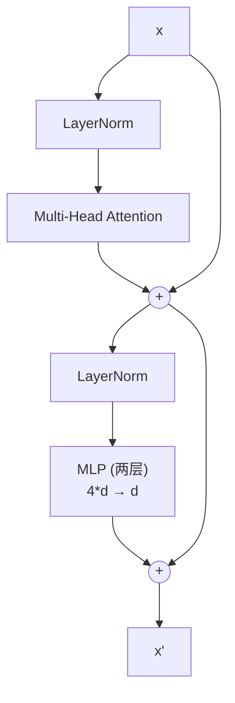

# CNN 与 Transformer：现代模型结构 (Modern Model Architectures)
---

## 章节概述

卷积神经网络（CNN）和 Transformer 是深度学习的两个里程碑架构。CNN 统治了计算机视觉十年，Transformer 从 NLP 出发改变了整个 AI 领域。本章从原理到实战：构建 CNN 分类 MNIST，理解注意力机制的 Q/K/V 数学，加载预训练模型做推理。目标是让你能看懂现代模型结构，知道它们如何被导出为 ONNX。

> **核心理念**：现代深度学习模型本质上是**层次化的特征提取器**。CNN 通过卷积核扫描局部特征逐层抽象，Transformer 通过注意力让输入序列的每个位置与其他位置互相查询。两者最终都输出一个向量 — 给分类器、回归器或解码器使用。理解架构不是为了从头训练，而是为了知道输入/输出形状、如何加载预训练权重、如何导出 ONNX 给 C++ 使用。

---

### 第一节：CNN — 卷积神经网络

1.1 卷积核：从 C 循环到 nn.Conv2d
----------------------------------

C 中卷积核是一个双层循环：

```c
// 3x3 卷积，步长=1，填充=0
float output[H][W];
for (int i = 0; i < H; i++)
 for (int j = 0; j < W; j++)
 for (int ki = 0; ki < 3; ki++)
 for (int kj = 0; kj < 3; kj++)
 output[i][j] += input[i+ki][j+kj] * kernel[ki][kj];
```

PyTorch 等价：`nn.Conv2d(in_channels, out_channels, kernel_size, stride, padding)`。

```python
import torch
import torch.nn as nn

# 输入: (batch, channels, height, width) — 注意是 NCHW 格式！
x = torch.randn(1, 1, 28, 28) # 1 张 28×28 灰度图

# 一个卷积层：1 输入通道，32 输出通道，3×3 卷积核
conv = nn.Conv2d(in_channels=1, out_channels=32, kernel_size=3, padding=1)
out = conv(x)
print(f"Input: {x.shape}") # (1, 1, 28, 28)
print(f"Output: {out.shape}") # (1, 32, 28, 28) — 32 个特征图，尺寸不变（padding=1）
```

> **C 程序员注意**：PyTorch 的图像张量格式是 `(N, C, H, W)`——Batch、Channel、Height、Width。OpenCV 通常是 `(H, W, C)`。导出 ONNX 和写给 C++ 时，必须注意这个通道维度的位置。

1.2 卷积输出尺寸公式
---------------------

```
output_size = (input_size - kernel_size + 2 * padding) / stride + 1
```

```bash
python -c "
import torch, torch.nn as nn
# 输入 32×32，3×3 卷积，步长 2，填充 1
x = torch.randn(1, 3, 32, 32)
conv = nn.Conv2d(3, 16, kernel_size=3, stride=2, padding=1)
print(conv(x).shape) # (1, 16, 16, 16)
# (32 - 3 + 2*1)/2 + 1 = 16
"
```

1.3 Pooling — 下采样
---------------------

```python
import torch.nn as nn

# MaxPool2d: 取每个 2×2 窗口的最大值（最常用）
pool = nn.MaxPool2d(kernel_size=2, stride=2)

# AdaptiveAvgPool2d: 无论输入多大，输出固定尺寸（常用于分类头）
adaptive_pool = nn.AdaptiveAvgPool2d((1, 1)) # 全局平均池化
```

> `AdaptiveAvgPool2d((1, 1))` 等价于对整个特征图取平均，得到 (C, 1, 1) 的输出。这常用于将卷积特征图展平送入全连接层。

1.4 完整 CNN 示例：MNIST 分类
------------------------------

```bash
python -c "
import torch, torch.nn as nn, torch.optim as optim
from torchvision import datasets, transforms

# 数据
transform = transforms.Compose([
 transforms.ToTensor(),
 transforms.Normalize((0.1307,), (0.3081,))
])
train_data = datasets.MNIST('mnist_data/', train=True, download=True, transform=transform)
train_loader = torch.utils.data.DataLoader(train_data, batch_size=64, shuffle=True)

# CNN 模型
class CNN(nn.Module):
 def __init__(self):
 super().__init__()
 self.conv = nn.Sequential(
 nn.Conv2d(1, 32, 3, padding=1), nn.ReLU(), nn.MaxPool2d(2),
 nn.Conv2d(32, 64, 3, padding=1), nn.ReLU(), nn.MaxPool2d(2),
 )
 self.fc = nn.Sequential(
 nn.Flatten(),
 nn.Linear(64 * 7 * 7, 128), nn.ReLU(),
 nn.Linear(128, 10),
 )

 def forward(self, x):
 x = self.conv(x)
 return self.fc(x)

model = CNN()
opt = optim.Adam(model.parameters(), lr=0.001)
loss_fn = nn.CrossEntropyLoss()

for epoch in range(3):
 total = correct = 0
 for X, y in train_loader:
 opt.zero_grad()
 loss = loss_fn(model(X), y)
 loss.backward()
 opt.step()
 correct += (model(X).argmax(1) == y).sum().item()
 total += len(y)
 print(f'Epoch {epoch+1}: acc={correct/total:.3f}')
" 2>&1 | head -20
```

这个 CNN 的结构：

```
Input (1, 28, 28)
 → Conv(1→32, 3×3) → ReLU → MaxPool(2) → (32, 14, 14)
 → Conv(32→64, 3×3) → ReLU → MaxPool(2) → (64, 7, 7)
 → Flatten → (64*7*7=3136)
 → Linear(3136→128) → ReLU
 → Linear(128→10)
 → Softmax (自动包含在 CrossEntropyLoss 中)
```

---

### 第二节：Transformer — 注意力机制

2.1 为什么需要 Transformer
---------------------------

CNN 处理序列的局限：卷积核一次只能看到局部区域（感受野有限），堆叠多层才逐步扩大视野。Transformer 的注意力机制让每个位置直接看到序列中的所有其他位置，适合长程依赖建模。

2.2 注意力机制的数学本质
-------------------------

注意力 = "用 Query 去查 Key，得到的匹配分数对 Value 加权求和"。

```
Attention(Q, K, V) = softmax(Q @ K^T / √d_k) @ V

Q (Query): 我要查什么 — shape (seq_len, d_k)
K (Key): 我有什么标签 — shape (seq_len, d_k)
V (Value): 我的内容是什么 — shape (seq_len, d_v)
```

> **C 视角类比**：注意力机制类似于带权重的查找操作。如果 `Q[i]` 和 `K[j]` 的相似度高（点积大），则 `V[j]` 对输出 `O[i]` 的贡献就大。等价于 "对于每个位置 i，用 Q[i] 去搜索所有 Key，把匹配到的 Value 加权求和"。

2.3 手动实现 Scaled Dot-Product Attention
------------------------------------------

```python
import torch
import torch.nn.functional as F

def scaled_dot_product_attention(Q, K, V, mask=None):
 """
 Q: (batch, heads, seq_len, d_k)
 K: (batch, heads, seq_len, d_k)
 V: (batch, heads, seq_len, d_v)
 """
 d_k = Q.size(-1)
 scores = Q @ K.transpose(-2, -1) / (d_k ** 0.5) # 缩放点积
 if mask is not None:
 scores = scores.masked_fill(mask == 0, float('-inf'))
 attn_weights = F.softmax(scores, dim=-1) # 归一化为概率
 return attn_weights @ V, attn_weights
```

> 为什么除以 `√d_k`？当 `d_k` 较大时，点积的方差变大，softmax 会趋向于极端的 one-hot 分布（梯度消失）。除以 `√d_k` 保证方差稳定在 1。

2.4 Multi-Head Attention
-------------------------

多头注意力 = 并行做多次注意力（不同表示子空间），拼接结果：

```python
class MultiHeadAttention(nn.Module):
 def __init__(self, d_model, n_heads):
 super().__init__()
 assert d_model % n_heads == 0
 self.d_model = d_model
 self.n_heads = n_heads
 self.d_k = d_model // n_heads

 self.W_q = nn.Linear(d_model, d_model)
 self.W_k = nn.Linear(d_model, d_model)
 self.W_v = nn.Linear(d_model, d_model)
 self.W_o = nn.Linear(d_model, d_model)

 def forward(self, Q, K, V, mask=None):
 batch = Q.size(0)
 # Linear projection + split into heads
 Q = self.W_q(Q).view(batch, -1, self.n_heads, self.d_k).transpose(1, 2)
 K = self.W_k(K).view(batch, -1, self.n_heads, self.d_k).transpose(1, 2)
 V = self.W_v(V).view(batch, -1, self.n_heads, self.d_k).transpose(1, 2)

 attn_out, _ = scaled_dot_product_attention(Q, K, V, mask)

 # Concatenate heads: (batch, heads, seq, d_k) → (batch, seq, d_model)
 attn_out = attn_out.transpose(1, 2).contiguous().view(batch, -1, self.d_model)
 return self.W_o(attn_out)
```

2.5 Transformer Block 完整结构
-------------------------------



```python
class TransformerBlock(nn.Module):
 def __init__(self, d_model, n_heads, d_ff):
 super().__init__()
 self.attn = MultiHeadAttention(d_model, n_heads)
 self.norm1 = nn.LayerNorm(d_model)
 self.norm2 = nn.LayerNorm(d_model)
 self.mlp = nn.Sequential(
 nn.Linear(d_model, d_ff),
 nn.GELU(),
 nn.Linear(d_ff, d_model),
 )

 def forward(self, x):
 x = x + self.attn(self.norm1(x), self.norm1(x), self.norm1(x)) # self-attention + residual
 x = x + self.mlp(self.norm2(x)) # MLP + residual
 return x
```

> 残差连接 `x = x + f(norm(x))` 使得梯度可以直接流过 `+` 号，解决了深层网络的梯度消失问题。这是在 C 中只需一句 `x[i] += f(x_norm[i])` 的操作，但效果极其关键。

---

### 第三节：GPT 架构速览

3.1 GPT 的本质
---------------

GPT 是 Transformer 的 Decoder-only 部分：堆叠多个 TransformerBlock，加入因果掩码（mask）使每个位置只能看到之前的 token：

```python
# 因果掩码（Causal Mask）：防止当前位置看到未来token
# mask[i, j] = 0 if j > i else 1
# 1 0 0 0
# 1 1 0 0
# 1 1 1 0
# 1 1 1 1

def causal_mask(seq_len):
 return torch.tril(torch.ones(seq_len, seq_len)) # 下三角
```

3.2 GPT 的推理过程（自回归生成）
--------------------------------

```
用户输入: "The meaning of life is"

→ Tokenize: [The, meaning, of, life, is]
→ Model 前向: logits → softmax → 采样 → "42"
→ 追加到序列: [... life, is, 42]
→ Model 再前向 → 采样 → "."
→ 重复直到生成结束符 <EOS>
```

GPT 推理时每次只预测下一个 token，然后追加到输入序列再次推理。每次推理是一个完整的 Transformer 前向传播。

> **C++ 部署关键**：GPT 推理在 C++ 侧是纯前向传播——没有 backward，没有 optimizer。每次生成 token 需要一次或多次矩阵运算。用 ONNX Runtime + CUDA 可以高效执行。Memory 管理（KV Cache）是部署的最大挑战。

---

### 第四节：预训练模型使用

4.1 torchvision — 加载预训练 ResNet
-------------------------------------

```bash
python -c "
import torch
from torchvision import models, transforms
from PIL import Image

# 加载预训练的 ResNet18（ImageNet 1000 类）
model = models.resnet18(weights='IMAGENET1K_V1')
model.eval()
print(f'Parameters: {sum(p.numel() for p in model.parameters()):,}')

# 模拟推理
x = torch.randn(1, 3, 224, 224) # ResNet 标准输入
with torch.no_grad():
 out = model(x)
print(f'Input: {x.shape} → Output: {out.shape}') # → (1, 1000)
print(f'Predicted class: {out.argmax(dim=1).item()}')
"
```

4.2 HuggingFace — 加载预训练 BERT
-----------------------------------

```bash
python -c "
from transformers import AutoTokenizer, AutoModel
import torch

# 加载模型和分词器
name = 'bert-base-uncased'
tokenizer = AutoTokenizer.from_pretrained(name)
model = AutoModel.from_pretrained(name)
model.eval()

# 编码文本
text = 'The pointer points to the heap.'
inputs = tokenizer(text, return_tensors='pt')
with torch.no_grad():
 outputs = model(**inputs)
print(f'Hidden states: {outputs.last_hidden_state.shape}')
# (1, seq_len, 768) — 每个token的768维向量表示
"
```

4.3 常用预训练模型速查表
-------------------------

| 模型 | 参数量 | 输入 | 输出 | 用途 |
|------|--------|------|------|------|
| ResNet-18 | 11M | (1,3,224,224) | (1,1000) | 图像分类 |
| ResNet-50 | 25M | (1,3,224,224) | (1,1000) | 图像分类 |
| ViT-B | 86M | (1,3,224,224) | (1,1000) | 图像分类 |
| BERT-base | 110M | (1,seq,768) | (1,seq,768) | 文本编码 |
| GPT-2 small | 124M | (1,seq) | (1,seq,vocab) | 文本生成 |
| YOLOv8-n | 3M | (1,3,640,640) | boxes+classes | 目标检测 |

> 预训练模型的输出形状是导出 ONNX 时 `dummy_input` 的基础。你必须知道模型的输入/输出形状才能正确导出 ONNX。

---

---

## 力扣练习

以下题目用于验证本章所学内容：

| 题号 | 题目 | 链接 | 涉及知识点 |
|------|------|------|-----------|
| — | 本章无对应力扣题 | — | 请用动手练习题自检 |
