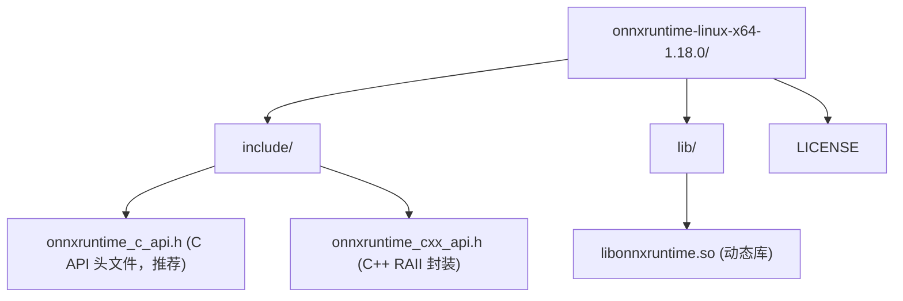
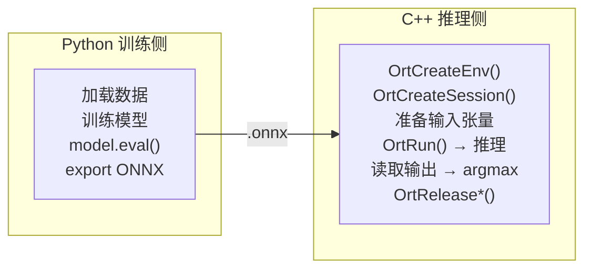
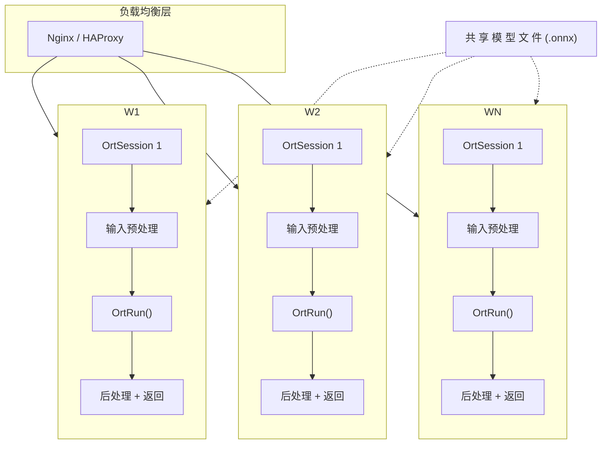

# 推理部署：ONNX Runtime 接 C++ 程序 (Inference Deployment)
---

## 章节概述

这是从 Python 到 C++ 的最后一公里。你用 Python 训练并导出了 .onnx 模型，本章教你用 C++ 加载并执行推理。CMake 配置、加载模型、创建 session、传入输入张量、读取输出、完整端到端流程。最后简要介绍 TensorRT、OpenVINO、TVM 等进阶方案。

> **核心理念**：AI 的训练和部署是两个截然不同的工程领域。训练需要 Python 的灵活生态，部署需要 C++ 的性能特性（低延迟、可控内存、无 GC 抖动）。ONNX Runtime 的 C API 只有不到 20 个核心函数，比 C 标准库的 `stdio.h` 还简单。本章的 C++ 代码是你将 AI 集成到任何 C/C++ 项目的起点模板。

---

### 第一节：ONNX Runtime 安装与 CMake 配置

1.1 什么是 ONNX Runtime
------------------------

ONNX Runtime 是 Microsoft 维护的高性能推理引擎，跨平台（Windows/Linux/macOS/Android/iOS）、跨硬件（CPU/CUDA/TensorRT/OpenVINO/DirectML/QNN）。提供 C、C++、C#、Python、Java 等 API。

1.2 下载 ONNX Runtime C/C++ 库
--------------------------------

```bash
# 方法一：下载预编译包（推荐，无 Python 依赖）
wget https://github.com/microsoft/onnxruntime/releases/download/v1.18.0/onnxruntime-linux-x64-1.18.0.tgz
tar xzf onnxruntime-linux-x64-1.18.0.tgz

# 方法二：通过系统包管理器
sudo apt install libonnxruntime-dev # Ubuntu 22.04+
brew install onnxruntime # macOS

> **跨平台提示**：
> - **Windows**：从 [NuGet](https://www.nuget.org/packages/Microsoft.ML.OnnxRuntime) 或 GitHub Releases 下载预编译包 `onnxruntime-win-x64-*.zip`，解压后将 `lib/` 和 `include/` 加入项目配置
```

安装后的目录结构：


1.3 CMakeLists.txt 配置
------------------------

```cmake
cmake_minimum_required(VERSION 3.14)
project(ONNXInference LANGUAGES CXX)

set(CMAKE_CXX_STANDARD 17)
set(CMAKE_CXX_STANDARD_REQUIRED ON)

# 修改为你解压的实际位置
set(ONNXRUNTIME_ROOT "/path/to/onnxruntime-linux-x64-1.18.0")

find_path(ONNXRUNTIME_INCLUDE onnxruntime_c_api.h
 HINTS ${ONNXRUNTIME_ROOT}/include)
find_library(ONNXRUNTIME_LIB onnxruntime
 HINTS ${ONNXRUNTIME_ROOT}/lib)

if(NOT ONNXRUNTIME_LIB)
 message(FATAL_ERROR "ONNX Runtime not found!")
endif()

add_library(onnxruntime SHARED IMPORTED)
set_target_properties(onnxruntime PROPERTIES
 IMPORTED_LOCATION "${ONNXRUNTIME_LIB}"
 INTERFACE_INCLUDE_DIRECTORIES "${ONNXRUNTIME_INCLUDE}"
)

add_executable(inference_demo main.cpp)
target_link_libraries(inference_demo PRIVATE onnxruntime)
```

---

### 第二节：C API 推理核心流程

2.1 推理五步骤
---------------

```
1. OrtCreateEnv → 创建环境（全局配置）
2. OrtCreateSession → 加载 .onnx 模型
3. OrtCreateTensor → 构造输入张量（数据+形状）
4. OrtRun → 执行推理
5. OrtGetTensorMutableData → 读取输出张量结果
6. OrtRelease* → 释放所有资源
```

关键函数签名：

```c
OrtCreateEnv(ORT_LOGGING_LEVEL_WARNING, "app", &env);
OrtCreateSession(env, "model.onnx", session_opts, &session);
OrtCreateTensorWithDataAsOrtValue(mem_info, data, data_sz, shape, ndim,
 ONNX_TENSOR_ELEMENT_DATA_TYPE_FLOAT, &tensor);
OrtRun(session, run_opts, in_names, in_values, n_in,
 out_names, n_out, out_values);
OrtGetTensorMutableData(out_values[0], (void**)&output_ptr);
```

2.2 完整推理代码（主流程）
---------------------------

```cpp
#include <onnxruntime_c_api.h>
#include <stdio.h>
#include <stdlib.h>

#define ORT_ABORT_IF_ERROR(expr) do { \
 OrtStatus* _s = (expr); \
 if (_s != NULL) { \
 fprintf(stderr, "ONNX Error: %s\n", \
 OrtGetErrorMessage(_s)); \
 OrtReleaseStatus(_s); \
 exit(1); \
 } \
} while(0)

int main() {
 // 1. 创建环境
 OrtEnv* env;
 OrtCreateEnv(ORT_LOGGING_LEVEL_WARNING, "demo", &env);

 // 2. 配置 Session 并加载模型
 OrtSessionOptions* opts;
 OrtCreateSessionOptions(&opts);
 OrtSetIntraOpNumThreads(opts, 4);
 OrtSetSessionGraphOptimizationLevel(opts, 99);

 OrtSession* session;
 ORT_ABORT_IF_ERROR(
 OrtCreateSession(env, "model.onnx", opts, &session));

 printf("[OK] Model loaded\n");

 // 3. 获取模型元信息
 OrtAllocator* alloc;
 OrtCreateDefaultAllocator(&alloc);

 char* in_name;
 OrtGetSessionInputName(session, 0, alloc, &in_name);
 char* out_name;
 OrtGetSessionOutputName(session, 0, alloc, &out_name);
 printf("Input: %s Output: %s\n", in_name, out_name);

 // 4. 准备输入数据 (batch=1, features=4)
 float input_data[] = {1.0f, 2.0f, 3.0f, 4.0f};
 int64_t shape[] = {1, 4};

 OrtMemoryInfo* mem_info;
 OrtCreateCpuMemoryInfo(OrtDeviceAllocator, OrtMemTypeDefault,
 &mem_info);

 OrtValue* in_tensor;
 ORT_ABORT_IF_ERROR(
 OrtCreateTensorWithDataAsOrtValue(
 mem_info, input_data, sizeof(input_data),
 shape, 2, ONNX_TENSOR_ELEMENT_DATA_TYPE_FLOAT,
 &in_tensor));

 // 5. 执行推理
 const char* in_names[] = {in_name};
 const char* out_names[] = {out_name};
 const OrtValue* inputs[] = {in_tensor};
 OrtValue* outputs[1] = {NULL};

 OrtRunOptions* run_opts;
 OrtCreateRunOptions(&run_opts);

 ORT_ABORT_IF_ERROR(
 OrtRun(session, run_opts,
 in_names, inputs, 1,
 out_names, outputs, 1));
 printf("[OK] Inference done\n");

 // 6. 读取输出
 float* out_data;
 OrtGetTensorMutableData(outputs[0], (void**)&out_data);

 OrtTensorTypeAndShapeInfo* out_info;
 OrtGetTensorTypeAndShape(outputs[0], &out_info);
 size_t out_elems;
 OrtGetTensorShapeElementCount(out_info, &out_elems);

 printf("Output (%zu values):\n", out_elems);
 for (size_t i = 0; i < out_elems; i++)
 printf(" [%zu] = %.4f\n", i, out_data[i]);

 // 7. 释放资源
 OrtReleaseTensorTypeAndShapeInfo(out_info);
 OrtReleaseRunOptions(run_opts);
 OrtReleaseValue(outputs[0]);
 OrtReleaseValue(in_tensor);
 OrtReleaseMemoryInfo(mem_info);
 OrtReleaseAllocator(alloc);
 OrtReleaseSessionOptions(opts);
 OrtReleaseSession(session);
 OrtReleaseEnv(env);

 printf("[OK] Cleanup done\n");
 return 0;
}
```

编译运行：
```bash
mkdir build && cd build
cmake .. && make
./inference_demo
```

> **C 程序员注意**：C API 没有 RAII，每个 `OrtCreate*` 都对应一个 `OrtRelease*`。忘记释放导致内存泄漏。这与 C 中 `malloc/free` 成对出现的要求一致。C++ API（`onnxruntime_cxx_api.h`）用智能指针封装了资源释放。

2.3 使用 C++ API（更简洁）
----------------------------

```cpp
#include <onnxruntime_cxx_api.h>
#include <iostream>
#include <vector>

int main() {
 Ort::Env env(ORT_LOGGING_LEVEL_WARNING, "demo");
 Ort::SessionOptions opts;
 opts.SetIntraOpNumThreads(4);

 Ort::Session session(env, "model.onnx", opts);

 // 输入
 std::vector<float> input = {1, 2, 3, 4};
 std::vector<int64_t> shape = {1, 4};

 Ort::MemoryInfo mem_info =
 Ort::MemoryInfo::CreateCpu(OrtDeviceAllocator, OrtMemTypeDefault);

 Ort::Value in_tensor = Ort::Value::CreateTensor<float>(
 mem_info, input.data(), input.size(), shape.data(), shape.size());

 // 推理（自动获取输入/输出名）
 auto out = session.Run(Ort::RunOptions{nullptr},
 session.GetInputName(0, Ort::AllocatorWithDefaultOptions()),
 &in_tensor, 1,
 session.GetOutputName(0, Ort::AllocatorWithDefaultOptions()),
 1);

 float* data = out[0].GetTensorMutableData<float>();
 auto out_shape = out[0].GetTensorTypeAndShapeInfo().GetShape();

 for (size_t i = 0; i < out_shape[1]; i++)
 std::cout << data[i] << " ";
 std::cout << std::endl;

 return 0;
}
```

> C++ API 自动管理资源（智能指针 + RAII），无需手动 `OrtRelease*`。原理上用 `onnxruntime_cxx_api.h` 比 `onnxruntime_c_api.h` 更安全简洁。

---

### 第三节：端到端流程 — Python 训练 → C++ 推理

3.1 Python 侧：训练并导出
--------------------------

```bash
python -c "
import torch, torch.nn as nn

class Model(nn.Module):
 def __init__(self):
 super().__init__()
 self.net = nn.Sequential(
 nn.Linear(4, 16), nn.ReLU(),
 nn.Linear(16, 3),
 )
 def forward(self, x):
 return self.net(x)

model = Model()
# 模拟训练（实际会用真实数据）
model.eval()

# 导出
x = torch.randn(1, 4)
torch.onnx.export(model, x, 'model.onnx',
 input_names=['x'], output_names=['logits'],
 dynamic_axes={'x': {0: 'batch'}, 'logits': {0: 'batch'}},
 opset_version=17)
print('Exported model.onnx')
"
```

3.2 C++ 侧：加载并推理
-----------------------

使用上面的 `main.cpp`，修改输入数据为真实的特征值：
```cpp
// 真实输入数据: 鸢尾花 4 个特征
float input_data[] = {5.1f, 3.5f, 1.4f, 0.2f}; // → 类别 0 (setosa)
```

完整流程：



3.3 验证一致性
---------------

在 Python 和 C++ 上用相同输入推理，对比输出：

```bash
# Python 侧
python -c "
import torch, numpy as np
# ... 加载模型，推理，打印输出 ...
"

# C++ 侧
./inference_demo
# 输出应该在浮点误差内一致（diff < 1e-5）
```

---

### 第四节：进阶部署方案

4.1 方案对比速查表
-------------------

| 方案 | 适用硬件 | 性能 | 开发复杂度 | 适用场景 |
|------|---------|------|-----------|---------|
| ONNX Runtime (CPU) | 所有 CPU | ★★★ | 低 | 通用部署、边缘设备 |
| ONNX Runtime (CUDA) | NVIDIA GPU | ★★★★ | 低 | GPU 服务器推理 |
| TensorRT | NVIDIA GPU | ★★★★★ | 中 | GPU 极致优化 |
| OpenVINO | Intel CPU/GPU/VPU | ★★★★ | 中 | Intel 平台 |
| TVM | 通用（ARM/x86/GPU） | ★★★★ | 高 | 自定义硬件加速 |
| libtorch | CPU/CUDA | ★★★ | 低 | PyTorch 原生部署 |

4.2 TensorRT（NVIDIA GPU 极致性能）
------------------------------------

TensorRT 由 NVIDIA 开发，针对 GPU 进行极致优化：层融合、精度校准（FP16/INT8）、内存优化。

```bash
# 安装 onnx-tensorrt 转换工具
pip install onnx-graphsurgeon

# 将 ONNX 转换为 TensorRT engine
trtexec --onnx=model.onnx --saveEngine=model.engine --fp16
```

> TensorRT 的推理延迟可以比 ONNX Runtime CUDA 快 2-5 倍，但需要针对每个 GPU 型号编译 engine 文件。不适合需要跨设备部署的场景。

4.3 OpenVINO（Intel 平台优化）
-------------------------------

```bash
# 安装 OpenVINO
pip install openvino

# 转换为 OpenVINO IR
mo --input_model model.onnx --output_dir ov_model/

# C++ 推理（openvino runtime）
```

4.4 TVM（Apache — 通用编译器方案）
-----------------------------------

TVM 将模型编译为目标硬件的原生代码，无需独立的运行时。

```bash
pip install apache-tvm

python -c "
import tvm
import onnx

model = onnx.load('model.onnx')
# 编译为 LLVM / CUDA / ARM NEON 等后端
# target = 'llvm' # CPU
# target = 'cuda' # GPU
# target = 'llvm -mtriple=aarch64-linux-gnu' # ARM
"
```

> 本教程的 C++ 进阶部署方案（TensorRT、OpenVINO、TVM）属于中高级部署知识。推荐入门路径：**先用 ONNX Runtime (CPU) 跑通整个流程 → 再根据需要按需升级**。

---

### 第五节：性能对比与最佳实践

5.1 Python vs C++ 推理性能
----------------------------

```python
# Python 端性能测试
python -c "
import torch, time, numpy as np, onnxruntime as ort

# 加载模型...
# 热身 (warmup)
for _ in range(100): # warmup
 session.run(None, {'x': data})

# 计时
t0 = time.perf_counter()
for _ in range(1000):
 session.run(None, {'x': data})
t1 = time.perf_counter()
print(f'Python ONNX RT: {(t1-t0)/1000*1000:.3f}ms / inference')
"
```

C++ 端也做类似基准测试，通常 C++ 延迟更低（无 Python GIL、无解释器开销）。

5.2 部署最佳实践
------------------

| 原则 | 说明 |
|------|------|
| 输入预处理在 C++ 侧完成 | 图像 resize/normalize 用 OpenCV，不要依赖 Python |
| 批量推理提升吞吐 | 一次传入多个样本（batch>1），充分利用 CPU SIMD / GPU 并行 |
| Session 单例复用 | 只创建一次 `OrtSession`，反复调用 `OrtRun`，避免重复加载模型 |
| 设置合适的线程数 | `OrtSetIntraOpNumThreads` 设为 CPU 核心数，设置过多会因线程切换降低性能 |
| 图优化级别 | 生产环境用 `ORT_ENABLE_ALL (99)`，调试用 `ORT_DISABLE_ALL (0)` |
| 内存复用 | 推理时复用输入/输出 buffer，避免每次分配/释放内存 |

5.3 推理服务的架构模式
-----------------------



> 本教程的 C++ 进阶内容（多线程服务、CUDA stream、TensorRT plugin、KV Cache 管理）请参考 [[../../cpp教程/cpp目录|CPP教程]] 的高性能计算章节。

---

---

## 力扣练习

以下题目用于验证本章所学内容：

| 题号 | 题目 | 链接 | 涉及知识点 |
|------|------|------|-----------|
| — | 本章无对应力扣题 | — | 请用动手练习题自检 |
