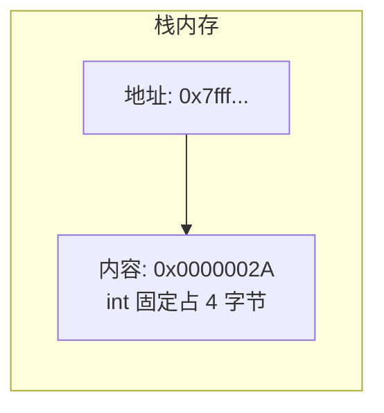

# 变量与类型：从 C 迁移 (Variables & Types)
---

## 章节概述

本章带你从 C 的静态类型系统迁移到 Python 的动态类型世界。你将理解 Python 的"名字绑定"与 C 的"内存分配"之间的本质区别：在 C 中，`int x = 5` 是在栈上分配 4 字节并写入值；在 Python 中，`x = 5` 是给整数对象 5 贴上一个标签 `x`。我们还会探讨 Python 的任意精度整数、不可变类型、`None` 空值，以及与 C 类型转换的对比。

> **核心理念**：C 的变量是"装着值的盒子"，Python 的变量是"贴在对象上的便签"。理解这个思维转变，是 C 程序员掌握 Python 最关键的一步。

---

### 第一节：名字绑定 vs 内存分配
---

1.1 同一个赋值，两种世界观
--------------------------

```c
// C 语言：变量是内存中的一块区域
int x = 42;
```



```python
# Python：变量是对对象的引用
x = 42
```


在 Python 中，`x` 只是一个**名字**（name），不是内存地址。你可以随时改变 `x` 指向的对象：

```bash
python -c "
x = 42 # x 指向整数 42
print(type(x), x)
x = 'hello' # x 现在指向字符串 'hello'（类型变了！）
print(type(x), x)
x = [1, 2, 3] # x 又指向列表了
print(type(x), x)
"
```

在 C 中这完全不可能——`int x` 一旦声明，就永远是 `int`。

1.2 多重绑定和引用共享
---------------------

```bash
python -c "
a = [1, 2, 3]
b = a # b 和 a 指向同一个列表对象！（不复制）
a.append(4)
print('a =', a)
print('b =', b) # b 也变了！
"
```

对比 C 语言的赋值：

```c
int a[] = {1, 2, 3};
int *b = a; // b 是指向 a 首元素的指针
a[0] = 99; // b 指向的内容也变了
```

Python 的 `b = a` 行为类似于 C 的**指针赋值**——共享底层对象，而不是复制。但 Python 不必管理 `free`，由垃圾回收自动处理。

1.3 `id()` 查看对象身份
-----------------------

```bash
python -c "
import sys
x = 42
y = 42
print('x id:', id(x))
print('y id:', id(y))
print('Same object?', x is y)
print('Reference count:', sys.getrefcount(x))
"
```

小整数（-5 到 256）在 Python 中会被缓存复用——这相当于 C 中的编译时常量池：

```c
// C 也有类似行为（常量折叠）
const char *s1 = "hello";
const char *s2 = "hello";
// s1 和 s2 可能指向相同的只读内存区域
```

### 小节练习


> [!question] 判断题 1
> Python 的 `id(x)` 返回值等价于 C 语言中变量 `x` 的指针（地址）值。（ ）
> - [ ] 正确
> - [ ] 错误
>
> > [!success]- 点击查看答案
> > 答案: 正确
> > **解析**: `id()` 返回的是 Python 对象在 CPython 实现中的内存地址（一个整数）。在概念上它确实类似于 C 的指针，但 Python 不允许通过 `id()` 进行指针运算或直接读写内存。

---

### 第二节：核心数据类型全览
---

2.1 整型 int —— 任意精度
-------------------------

```bash
python -c "
x = 2**100 # 2 的 100 次方
print(x)
print('位数:', x.bit_length()) # 101 位
print('类型:', type(x))
"
```

C 语言的整数：

```c
#include <stdio.h>
#include <stdint.h>
#include <limits.h>

int main() {
 int x = 2147483647; // INT_MAX（32 位）
 // unsigned long long 也只有 64 位
 uint64_t y = UINT64_MAX; // 18446744073709551615
 printf("%lu\n", y);
 return 0;
}
```

Python 的 `int` **没有上限**（除了可用内存），内部使用变长数组存储大数。这相当于 C 语言中引入 GMP 库才能实现的功能。

```bash
python -c "
# 这是 Python 的整数，不是 float
huge = 2**10000
print('2**10000 的位数:', huge.bit_length())
print('前 50 位:', str(huge)[:50])
"
```

2.2 浮点数 float —— 双精度
---------------------------

Python 的 `float` 对应 C 的 `double`（64 位 IEEE 754）：

```bash
python -c "
import sys
print('float 大小:', sys.float_info)

x = 0.1 + 0.2
print('0.1 + 0.2 =', x) # 0.30000000000000004
print('x == 0.3?', x == 0.3) # False！浮点精度问题
"
```

这跟 C 完全一样：

```c
#include <stdio.h>
int main() {
 double x = 0.1 + 0.2;
 printf("%.17f\n", x); // 0.30000000000000004
 return 0;
}
```

> Python 的 `float` 就是 C 的 `double`，精度和陷阱完全一致。如果你需要高精度小数，用 `decimal` 模块。

2.3 字符串 str —— Unicode 原生支持
-----------------------------------

```bash
python -c "
s = '你好, World!'
print('类型:', type(s))
print('长度（字符数）:', len(s))
print('字节表示:', s.encode('utf-8'))
print('字节数:', len(s.encode('utf-8')))
"
```

对比 C 语言的字符串：

```c
// C 语言：字符串是字节数组
char s[] = "Hello"; // 每个字符 1 字节（ASCII）
char ws[] = L"你好"; // 宽字符需要特殊处理
// strlen 返回字节数，不是字符数
```

Python 的 `str` 是**不可变 Unicode 字符串**——内部用变长编码存储（PEP 393），自动处理多字节字符。你不需要纠结 `char` vs `wchar_t`。

2.4 布尔 bool —— 只有两个值
----------------------------

```bash
python -c "
print('True:', True, 'type:', type(True))
print('False:', False)

# bool 是 int 的子类！
print('True == 1:', True == 1)
print('False == 0:', False == 0)
print('True + True:', True + True) # 2

# 真假值规则
print('bool(\"\") =', bool('')) # 空字符串 → False
print('bool(\"hello\") =', bool('hello'))
print('bool(0) =', bool(0))
print('bool(42) =', bool(42))
print('bool([]) =', bool([]))
print('bool([0]) =', bool([0])) # 非空列表 → True
"
```

> Python 的 `bool` 是 `int` 的子类——这意味着 `True + 1 == 2`。这在 C 中不可想象（C 的 `bool` 通常定义为 `_Bool` 或 `int`）。

2.5 None —— 这不是空指针
------------------------

```bash
python -c "
x = None
print('type:', type(x))
print('x is None:', x is None)

# None 是单例，不是空指针
import sys
print('None 的引用计数:', sys.getrefcount(None))
"
```

C 语言中的对应概念：

```c
// C: NULL 是一个空指针
int *p = NULL;
// Python: None 是一个真实存在的对象
x = None
// Python 中不存在"空指针"概念，None 是有类型（NoneType）有身份的
```

判断 `None` 时**必须用 `is` 而非 `==`**：

```bash
python -c "
class MyObj:
 def __eq__(self, other):
 return True # 这个类说"我等于一切"

obj = MyObj()
print(obj == None) # True（误导！）
print(obj is None) # False（正确）
"
```

### 小节练习


---

### 第三节：动态类型与类型检查
---

3.1 `type()` 和 `isinstance()`
-------------------------------

```bash
python -c "
x = 42
print('type(x):', type(x))
print('type(x) == int:', type(x) == int)
print('isinstance(x, int):', isinstance(x, int))
print('isinstance(x, (int, float)):', isinstance(x, (int, float)))
"
```

`type()` 返回精确类型，`isinstance()` 检查继承链：

```bash
python -c "
class A: pass
class B(A): pass

b = B()
print('type(b) == B:', type(b) == B) # True
print('type(b) == A:', type(b) == A) # False
print('isinstance(b, A):', isinstance(b, A)) # True（考虑继承）
"
```

> **推荐使用 `isinstance()`**：它支持继承，支持元组多类型检查，更符合 Python 的鸭子类型哲学。

3.2 动态类型的优势和代价
-------------------------

优势一：写通用代码不需要泛型/模板：

```bash
python -c "
def twice(x):
 return x + x

print(twice(10)) # 20
print(twice('hello')) # hellohello
print(twice([1,2])) # [1, 2, 1, 2]
"
```

对比 C 需要重载或泛型：
```c
int twice_int(int x) { return x + x; }
char* twice_str(...) { /* 需要 strdup 等操作 */ }
// C++ 需要模板: template<typename T> T twice(T x) { return x + x; }
```

代价：类型错误推迟到运行时：

```bash
python -c "
def add(a, b):
 return a + b

print(add(1, 2)) # 3
print(add('a', 'b')) # 'ab'
print(add(1, 'b')) # TypeError! 在 C 中编译期就会报错
"
```

3.3 类型注解与可选类型检查
---------------------------

Python 3.5+ 支持类型注解，但**默认不强制检查**：

```bash
python -c "
def greet(name: str) -> str:
 return 'Hello, ' + name

print(greet('World')) # 正常
print(greet(42)) # 也正常！（运行时不检查类型注解）
"
```

要用 `mypy` 做静态类型检查：

```bash
# 安装 mypy
pip install mypy

# 检查类型
echo 'def greet(name: str) -> str:
 return 42' > /tmp/t.py

mypy /tmp/t.py
# error: Incompatible return value type (got "int", expected "str")
```

> 类型注解让 Python 获得了类似 C 的类型安全感——但它是**可选的**、**渐进式的**。你可以从完全不写注解，逐步过渡到严格类型检查。

### 小节练习


> [!question] 判断题 1
> Python 的类型注解（Type Hints）会在运行时被强制执行。（ ）
> - [ ] 正确
> - [ ] 错误
>
> > [!success]- 点击查看答案
> > 答案: 错误
> > **解析**: Python 的类型注解**默认不在运行时被检查**——它们只是元数据，可以被第三方工具（如 mypy、pyright）用于静态分析。要运行时检查，需要配合 `pydantic` 或 `typeguard` 等库。

---

### 第四节：可变性（Mutability）概念
---

4.1 不可变 vs 可变类型
-----------------------

```bash
python -c "
# 不可变类型：int, float, str, tuple, frozenset
x = 'hello'
# x[0] = 'H' # TypeError: 'str' object does not support item assignment
x = 'Hello' # 这没有修改原字符串——是创建了新字符串，重新绑定

# 可变类型：list, dict, set, bytearray
arr = [1, 2, 3]
arr[0] = 99 # 直接修改列表的内容
print(arr)
"
```

对比 C 语言：

```c
// C 中，const 和原始内存的区分
const char *s = "hello"; // 不可修改（通常在只读段）
char buf[] = "hello"; // 可修改（在栈上）
buf[0] = 'H'; // 合法
```

Python 的不可变性不是 `const` 关键字——它是**类型级别**的保证。`int` 类型没有提供修改自身的方法。

4.2 可变对象作为默认参数——经典陷阱
----------------------------------

```bash
python -c "
def bad_append(item, target=[]): # 默认参数只求值一次！
 target.append(item)
 return target

print(bad_append(1)) # [1]
print(bad_append(2)) # [1, 2] ← 不是 [2]！
"
```

```bash
python -c "
def good_append(item, target=None):
 if target is None:
 target = [] # 每次调用都创建新列表
 target.append(item)
 return target

print(good_append(1)) # [1]
print(good_append(2)) # [2] ← 正确！
"
```

> 这个陷阱类似于 C 语言的**静态局部变量**——`def` 语句中的默认参数在函数定义时求值一次，之后所有调用共享同一个对象。

4.3 嵌套可变对象的浅拷贝问题
----------------------------

```bash
python -c "
import copy

original = [[1, 2], [3, 4]]
shallow = original[:] # 浅拷贝
deep = copy.deepcopy(original) # 深拷贝

original[0][0] = 99
print('original:', original) # [[99, 2], [3, 4]]
print('shallow:', shallow) # [[99, 2], [3, 4]] ← 受影响！
print('deep:', deep) # [[1, 2], [3, 4]] ← 不受影响
"
```

对比 C 语言：

```c
// C: 手工复制嵌套结构
struct Node { int val; struct Node *next; };
struct Node* shallow_copy(struct Node *n) { ... } // 只复制指针
struct Node* deep_copy(struct Node *n) { ... } // 递归复制整个链表
// Python 的 copy.deepcopy 自动完成递归复制
```

### 小节练习


---

## 章节测试

### 一、判断题（正确选，错误选）

> [!question] 判断题 1
> Python 中 `a = 5; b = a; a = 10` 后，`b` 的值是 10。（ ）
> - [ ] 正确
> - [ ] 错误
>
> > [!success]- 点击查看答案
> > 答案: 错误
> > **解析**: `b = a` 让 b 指向了整数对象 5。之后 `a = 10` 只改变了 a 的指向，b 仍然指向 5。Python 的赋值是"名字绑定"而非"内存覆盖"。

> [!question] 判断题 2
> Python 的 `int` 类型与 C 的 `int` 类型一样都有固定的位宽限制。（ ）
> - [ ] 正确
> - [ ] 错误
>
> > [!success]- 点击查看答案
> > 答案: 错误
> > **解析**: Python 的 `int` 是任意精度的（arbitrary precision），没有固定的 32 位或 64 位限制。内部使用变长数组存储数值，只受可用内存限制。

> [!question] 判断题 3
> `None` 在 Python 中是一个布尔值为 `False` 的单例对象。（ ）
> - [ ] 正确
> - [ ] 错误
>
> > [!success]- 点击查看答案
> > 答案: 正确
> > **解析**: `None` 是 `NoneType` 的唯一实例，`bool(None)` 返回 `False`。在条件判断中 `None` 被视为假值。

> [!question] 判断题 4
> Python 的类型注解在程序运行时具有零开销——完全不检查注解。（ ）
> - [ ] 正确
> - [ ] 错误
>
> > [!success]- 点击查看答案
> > 答案: 错误
> > **解析**: 虽然 Python 运行时不检查注解的正确性，但注解本身会在函数定义时求值并保存在 `__annotations__` 字典中。这个过程有少量开销（特别是使用 `from __future__ import annotations` 的延迟求值模式下开销更小）。

> [!question] 判断题 5
> Python 中 `True == 1` 和 `False == 0` 都返回 `True`。（ ）
> - [ ] 正确
> - [ ] 错误
>
> > [!success]- 点击查看答案
> > 答案: 正确
> > **解析**: Python 的 `bool` 是 `int` 的子类——`True` 继承自整数 1，`False` 继承自整数 0。`True + True` 等于 2，`isinstance(True, int)` 返回 `True`。

> [!question] 判断题 6
> `isinstance(True, int)` 返回 `False`。（ ）
> - [ ] 正确
> - [ ] 错误
>
> > [!success]- 点击查看答案
> > 答案: 错误
> > **解析**: `bool` 是 `int` 的子类，`isinstance(True, int)` 返回 `True`。这是 Python 2 时期的历史遗留设计，在 Python 3 中保留了下来。

> [!question] 判断题 7
> Python 的 `float('nan') == float('nan')` 返回 `True`。（ ）
> - [ ] 正确
> - [ ] 错误
>
> > [!success]- 点击查看答案
> > 答案: 错误
> > **解析**: 遵循 IEEE 754 标准，NaN（Not a Number）不等于任何值，包括它自己。这与 C 语言的 `isnan()` 行为一致。

---


---

## 力扣练习

以下题目用于验证本章所学内容：

| 题号 | 题目 | 链接 | 涉及知识点 |
|------|------|------|-----------|
| 1 | 两数之和 | https://leetcode.cn/problems/two-sum/ | 哈希表、列表遍历 |
| 7 | 整数反转 | https://leetcode.cn/problems/reverse-integer/ | 整数运算、类型边界 |
| 9 | 回文数 | https://leetcode.cn/problems/palindrome-number/ | 整数操作、字符串转换 |


### 动手练习题

> [!example] 练习题 1：类型侦探
> **难度**: 简单
>
> 编写一个 Python 脚本，从命令行接收任意数量的参数，对每个参数进行以下处理：
> 1. 如果能转换为整数，输出 `"int: value"`
> 2. 如果能转换为浮点数，输出 `"float: value"`
> 3. 否则作为字符串处理，输出 `"str: value"`
> 4. 对于字符串参数，额外输出其 UTF-8 编码的字节数
>
> ```
> $ python type_detect.py 42 3.14 hello
> int: 42
> float: 3.14
> str: hello (5 chars, 5 bytes in utf-8)
> ```

> [!example] 练习题 2：深度拷贝实验
> **难度**: 简单
>
> 设计以下嵌套结构并实验浅拷贝和深拷贝的区别：
> ```python
> data = {
> 'users': [{'name': 'Alice', 'scores': [90, 85]},
> {'name': 'Bob', 'scores': [70, 92]}],
> 'version': 1
> }
> ```
> 1. 分别使用 `copy.copy()` 和 `copy.deepcopy()` 创建副本
> 2. 修改原始数据中的 `scores[0]` 和 `version`
> 3. 观察并解释两个副本的变化情况
>
> 画出内存引用关系图（文字描述即可），解释浅拷贝和深拷贝的本质区别。

> [!example] 练习题 3：实现一个泛型 `max_by` 函数
> **难度**: 简单
>
> 利用 Python 的动态类型特性，实现一个 `max_by` 函数：
> - 接收两个参数：一个可迭代对象 `items`，一个键函数 `key`
> - 返回使 `key(item)` 最大的那个 `item`
> - 不依赖内置的 `max` 函数
>
> 测试你的函数：
> ```python
> max_by(['hello', 'world', 'python'], len) # → 'python' (6 letters)
> max_by([{'n':1}, {'n':5}, {'n':3}], lambda d: d['n']) # → {'n': 5}
> ```
>
> 对比：在 C 语言中如何实现等效功能？需要多少行代码？

> [!example] 练习题 4：静态类型检查
> **难度**: 简单
>
> 编写一个简短的 Python 模块 `calculator.py`，包含以下带类型注解的函数：
> ```python
> def add(a: int, b: int) -> int: ...
> def divide(a: int, b: int) -> float: ...
> def concat(a: str, b: str) -> str: ...
> ```
> 安装 `mypy`，对模块做静态类型检查。故意在调用处传入错误类型参数，观察 `mypy` 的报错信息。对比 `gcc -Wall` 的类型检查——有哪些相似之处？有哪些不同？
