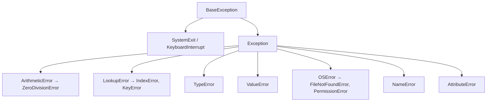

# 异常处理与 pdb 调试 (Exceptions & Debugging)
---

## 章节概述

C 语言程序员习惯用 `errno`、返回值检查 `NULL` 或 `-1` 来排错。Python 走的是完全不同的路：错误通过**异常**（exception）向上冒泡，直到某个 `try/except` 块被捕获。本章对比这两种错误处理哲学，教你用 `try/except/finally/else` 写健壮的代码，用 `pdb`（Python Debugger）做交互式调试——并把它与 GDB 的操作方式做对比。对于 C 程序员来说，pdb 就是"只差没有 core dump"的 GDB 替代品。

> **核心理念**：C 的错误处理是"检查返回值，传播 `errno`"，Python 的错误处理是"抛出去，让调用者决定怎么处理"。异常不是故障——它们是控制流的一部分。pdb 则让你在异常爆发时，像 GDB 的 `backtrace` 一样看到完整的调用栈全景。

---

### 第一节：从 errno 到 try/except
---

1.1 C 风格的错误处理 vs Python 的异常
--------------------------------------

```c
// C: 每次函数调用都要检查返回值
#include <stdio.h>
#include <errno.h>
#include <string.h>

int read_config(const char *path, char *buf, size_t size) {
 FILE *f = fopen(path, "r");
 if (!f) {
 fprintf(stderr, "Cannot open %s: %s\n", path, strerror(errno));
 return -1;
 }
 if (fread(buf, 1, size, f) < size) {
 if (ferror(f)) {
 fprintf(stderr, "Read error: %s\n", strerror(errno));
 fclose(f);
 return -2;
 }
 }
 fclose(f);
 return 0;
}
// 主调方需要：int ret = read_config(...); if (ret < 0) { /* 处理 */ }
```

```python
# Python: 异常自动向上冒泡，只需在合适的层级捕获
def read_config(path):
 with open(path) as f: # 文件不存在？FileNotFoundError 自动上抛
 return f.read() # 读取失败？IOError 自动上抛

# 调用方决定何时处理
try:
 content = read_config('/etc/myapp.conf')
except FileNotFoundError:
 print('Config file not found, using defaults')
 content = 'defaults'
except IOError as e:
 print(f'Read error: {e}')
 raise SystemExit(1)
```

1.2 完整的异常处理结构
-----------------------

```bash
python -c "
def divide(a, b):
 return a / b

# 四种异常处理结构
numbers = [(10, 2), (10, 0), (10, 'x')]

for a, b in numbers:
 try:
 result = divide(a, b)
 except ZeroDivisionError:
 print(f'{a}/{b}: division by zero')
 except (TypeError, ValueError) as e:
 print(f'{a}/{b}: type error - {e}')
 else:
 print(f'{a}/{b} = {result}') # 无异常时执行
 finally:
 print(' (attempt done)')
"
```

`try/except/else/finally` 的执行顺序：

| 是否有异常 | `try` | `except` | `else` | `finally` |
|-----------|-------|----------|--------|-----------|
| 无异常 | 执行完 | 跳过 | **执行** | 总是执行 |
| 有匹配异常 | 跳到 except | 执行 | 跳过 | 总是执行 |
| 有未匹配异常 | 跳到 finally | 跳过 | 跳过 | 执行后异常继续上抛 |

1.3 常见内置异常类
-------------------



```bash
python -c '
# 对照 C 语言的常见错误
exceptions = {
 "ZeroDivisionError": "除以 0 ← C 中通过检查除数是否为 0 避免",
 "IndexError": "列表索引越界 ← C 中是未定义行为或段错误",
 "KeyError": "字典键不存在 ← C 哈希表中返回 NULL",
 "TypeError": "类型不匹配 ← C 中编译时捕捉（或隐式转换）",
 "ValueError": "值不合理（如 int(\\\"abc\\\")）← C 中 atoi 返回 0",
 "FileNotFoundError": "文件不存在 ← C 中 fopen 返回 NULL",
 "AttributeError": "属性不存在 ← C 中编译时捕捉（struct 字段）",
 "NameError": "变量名未定义 ← C 中编译时捕捉",
}
for ex, desc in exceptions.items():
 print(f"{ex}: {desc}")
'
```

> 注意 `IndexError` 和 `KeyError` 都是 `LookupError` 的子类。如果你要同时捕获索引错误和键错误，可以写 `except LookupError`。

### 小节练习


> [!question] 判断题 1
> Python 的 `except` 块可以捕获操作系统信号（如 SIGINT）导致的 `KeyboardInterrupt`。（ ）
> - [ ] 正确
> - [ ] 错误
>
> > [!success]- 点击查看答案
> > 答案: 正确
> > **解析**: `KeyboardInterrupt` 在 Python 中是 `BaseException` 的子类（不是 `Exception`），可以被 `except BaseException` 捕获，但不能被 `except Exception` 捕获。通常不建议捕获 `KeyboardInterrupt`，因为这会阻止用户用 Ctrl+C 中断程序。

---

### 第二节：raise 与自定义异常
---

2.1 `raise` 抛出异常
--------------------

```bash
python -c "
def validate_age(age):
 if not isinstance(age, int):
 raise TypeError(f'Age must be int, got {type(age).__name__}')
 if age < 0:
 raise ValueError(f'Age cannot be negative: {age}')
 if age > 150:
 raise ValueError(f'Age too large: {age}')
 return age

# 测试验证
for v in [25, -5, 200, 'thirty']:
 try:
 print(f'Valid: {validate_age(v)}')
 except (TypeError, ValueError) as e:
 print(f'Invalid: {e}')
"
```

2.2 异常链（Exception Chaining）
--------------------------------

```bash
python -c "
import json

def load_config(path):
 try:
 with open(path) as f:
 return json.load(f)
 except FileNotFoundError as e:
 raise RuntimeError(f'Config not found: {path}') from e
 except json.JSONDecodeError as e:
 raise ValueError(f'Invalid JSON in {path}: {e}') from e

# 测试
for path in ['/nonexistent.json', '/tmp/malformed.json']:
 try:
 load_config(path)
 except (RuntimeError, ValueError) as e:
 print(f'{type(e).__name__}: {e}')
 print(f' Caused by: {e.__cause__}')
 print()
" 2>/dev/null
```

> **跨平台提示**：
> - **Windows**：CMD 使用 `2>NUL`，PowerShell 使用 `2>$null`
> - **macOS**：与 Linux 一致，`2>/dev/null`
```

> `raise ... from e` 建立异常链，保留了原始异常作为 `__cause__`。这类似于 C 语言中逐层打印 `errno` 和 `strerror` 的调试日志，但 Python 的异常链是**结构化的**——可以被程序逻辑使用，而不只是日志文本。

2.3 自定义异常类
----------------

```bash
python -c "
class NetworkError(ConnectionError):
 '''网络相关错误'''
 def __init__(self, host, port, message):
 self.host = host
 self.port = port
 super().__init__(f'{host}:{port} - {message}')

class TimeoutError(NetworkError):
 '''网络超时'''
 pass

# 使用自定义异常
try:
 raise TimeoutError('db.example.com', 5432, 'connection timed out')
except NetworkError as e:
 print(f'Network {type(e).__name__}: {e}')
 print(f' host={e.host}, port={e.port}')
"
```

### 小节练习


> [!question] 判断题 1
> 自定义异常类可以继承自内置异常类，形成异常层次结构。（ ）
> - [ ] 正确
> - [ ] 错误
>
> > [!success]- 点击查看答案
> > 答案: 正确
> > **解析**: 推荐所有自定义异常继承自 `Exception`（而非 `BaseException`）。自定义异常类可以有自己的属性和方法，可以形成层次结构（如 `NetworkError → TimeoutError`），调用方可以用 `except NetworkError` 捕获所有网络相关异常。

---

### 第三节：traceback —— 读懂错误信息
---

3.1 阅读 traceback
-------------------

```bash
python -c "
def func_c():
 1 / 0 # ZeroDivisionError

def func_b():
 func_c()

def func_a():
 func_b()

func_a()
" 2>&1 || true
```

输出解读：

```
Traceback (most recent call last): ← 从顶层调用方开始
 File "<string>", line 10, in <module> ← 第 10 行调用了 func_a()
 File "<string>", line 8, in func_a ← func_a() 中调用了 func_b()
 File "<string>", line 5, in func_b ← func_b() 中调用了 func_c()
 File "<string>", line 2, in func_c ← func_c() 中 1/0 触发
ZeroDivisionError: division by zero ← 最终异常类型和消息
```

**从下往上读**——最底部是"事故现场"，顶部是"始作俑者"的调用链。

3.2 以编程方式获取 traceback
-----------------------------

```bash
python -c "
import traceback
import sys

def risky_function():
 return [1, 2, 3][100]

try:
 risky_function()
except IndexError:
 # 获取完整的 traceback 字符串
 tb_str = traceback.format_exc()
 print('=== Formatted traceback ===')
 print(tb_str)
 print('============================')

 # 获取 traceback 对象（用于程序分析）
 exc_type, exc_value, exc_tb = sys.exc_info()
 print(f'Exception type: {exc_type.__name__}')
 frames = traceback.extract_tb(exc_tb)
 for frame in frames:
 print(f' File \"{frame.filename}\", line {frame.lineno}, in {frame.name}')
 if frame.line:
 print(f' {frame.line.strip()}')
"
```

### 小节练习


> [!question] 判断题 1
> `traceback.format_exc()` 只能在 `except` 块内部使用。（ ）
> - [ ] 正确
> - [ ] 错误
>
> > [!success]- 点击查看答案
> > 答案: 正确
> > **解析**: `format_exc()` 依赖 `sys.exc_info()` 获取当前线程的异常信息，而异常信息只在 `except` 块内部保持活跃。在 `except` 块外调用会得到 `NoneType: None`。

---

### 第四节：pdb —— Python 的 GDB
---

4.1 启动 pdb 的三种方式
------------------------

```bash
# 方式一：命令行直接启动 pdb
python -m pdb my_script.py

# 方式二：在代码中插入断点
# 在 Python 3.7+ 中使用 breakpoint()
echo 'x = 42
breakpoint() # ← 执行到此处自动进入 pdb
print(x)' > /tmp/debug_me.py

python /tmp/debug_me.py

# 方式三：异常发生后进入 pdb
python -m pdb -c continue /tmp/debug_me.py 2>&1 | head
```

4.2 pdb 核心命令与 GDB 对照表
-----------------------------

| 操作 | pdb | GDB 等价 | 说明 |
|------|-----|----------|------|
| 设置断点（函数） | `b func_name` 或 `break func_name` | `break func_name` | 在函数入口设断点 |
| 设置断点（行号） | `b 42` | `break 42` | 在当前文件第 42 行 |
| 设置断点（文件:行） | `b script.py:42` | `break script.c:42` | 指定文件 |
| 列出断点 | `b` 或 `break` | `info breakpoints` | |
| 删除断点 | `clear` 或 `disable N` | `delete N` | |
| 继续执行 | `c` 或 `continue` | `continue` | 运行到下一断点 |
| 单步执行（不进函数） | `n` 或 `next` | `next` | |
| 单步执行（进函数） | `s` 或 `step` | `step` | |
| 返回当前函数 | `r` 或 `return` | `finish` | |
| 打印变量 | `p expr` 或 `pp expr` | `print expr` | `pp` 是美化打印 |
| 查看调用栈 | `w` 或 `where` 或 `bt` | `backtrace` | |
| 移动栈帧 | `u`（上）/ `d`（下） | `frame N` `up` `down` | pdb 方向与 GDB 相反 |
| 查看源码 | `l` 或 `ll` 或 `list` | `list` | |
| 查看参数 | `a` 或 `args` | `info args` | |
| 执行任意 Python | `!expr` | — | 如 `!len(variable)` |
| 查看类型 | `whatis variable`（pdb） | `ptype variable`（GDB） | |
| 退出 | `q` 或 `quit` | `quit` | |
| 帮助 | `h` 或 `help` | `help` | |

```bash
python -c "
# pdb 调试示例
def fibonacci(n):
 a, b = 0, 1
 for _ in range(n):
 a, b = b, a + b
 return a

# breakpoint() # 取消注释即可调试
print(f'fib(10) = {fibonacci(10)}')
"
```

4.3 调试实战
-------------

```bash
cat > /tmp/buggy.py << 'PYEOF'
def process(lst):
 result = []
 for item in lst:
 result.append(item / len(lst)) # BUG: 如果 lst 为空？
 return result

def main():
 data = [100, 200, 300]
 processed = process(data)
 print('OK:', processed)

 # 故意触发空列表
 bad = process([])
 print('Bad:', bad)

main()
PYEOF

python /tmp/buggy.py 2>&1 | head -20

# pdb 调试流程：
# python -m pdb /tmp/buggy.py
# (pdb) b process ← 在 process 函数设断点
# (pdb) c ← 继续执行
# > process(...) ← 第一次进入 process
# (pdb) n ← 逐步执行
# (pdb) p lst ← 打印参数
# (pdb) c ← 继续到第二次调用（空列表）
# (pdb) p len(lst) ← 查看列表长度
# (pdb) q ← 退出
```

4.4 `pdb.post_mortem` —— 异常后事分析
---------------------------------------

```bash
python -c "
import pdb
import sys

def crash():
 return [][0] # IndexError

try:
 crash()
except Exception:
 # 异常发生后进入 pdb
 pdb.post_mortem(sys.exc_info()[2])
" 2>&1 <<< 'q'
```

> `pdb.post_mortem()` 就像是给 Python 程序做的"尸检"——程序已经崩溃了，但你仍然可以检查崩溃瞬间的所有变量状态。这类似于用 GDB 加载 core dump 文件。

### 小节练习


---

## 章节测试

### 一、判断题（正确选，错误选）

> [!question] 判断题 1
> Python 的 `try` 语句必须至少包含一个 `except` 或 `finally` 块。（ ）
> - [ ] 正确
> - [ ] 错误
>
> > [!success]- 点击查看答案
> > 答案: 正确
> > **解析**: `try` 不能单独出现——必须配合 `except` 子句、`finally` 子句或两者。`try ... finally`（无 except）、`try ... except`（无 finally）、`try ... except ... else ... finally` 都合法。

> [!question] 判断题 2
> `KeyError` 和 `IndexError` 都是 `LookupError` 的子类。（ ）
> - [ ] 正确
> - [ ] 错误
>
> > [!success]- 点击查看答案
> > 答案: 正确
> > **解析**: 两者都表示"查找失败"——`KeyError` 是字典键查找失败，`IndexError` 是序列索引查找失败。因此 `except LookupError` 可以同时捕获这两种异常。

> [!question] 判断题 3
> 空白 `except:` 子句会捕获所有异常，包括 `KeyboardInterrupt` 和 `SystemExit`。（ ）
> - [ ] 正确
> - [ ] 错误
>
> > [!success]- 点击查看答案
> > 答案: 正确
> > **解析**: 裸 `except:`（没有指定异常类型）会捕获**所有**异常——包括 `SystemExit`、`KeyboardInterrupt` 和 `GeneratorExit`（都继承自 `BaseException`）。这通常是不推荐的坏习惯——它会阻止用户用 Ctrl+C 中断程序。

> [!question] 判断题 4
> Python 的异常处理机制在内存使用上有显著性能开销。（ ）
> - [ ] 正确
> - [ ] 错误
>
> > [!success]- 点击查看答案
> > 答案: 错误
> > **解析**: Python 的 `try/except` 在无异常时基本上零开销（`try` 块设置了"异常处理跳转表"，但不增加每条指令的执行成本）。只有在异常实际被抛出时，才需要构造 traceback 对象和执行栈回退（unwinding）——这个过程确实有开销。

> [!question] 判断题 5
> `finally` 块中的 `return` 语句会覆盖 `try` 块中的 `return`。（ ）
> - [ ] 正确
> - [ ] 错误
>
> > [!success]- 点击查看答案
> > 答案: 正确
> > **解析**: 如果 `finally` 块中包含 `return` 语句，它将覆盖 `try` 或 `except` 块中的任何返回值或异常。"finally 中的 return 是无情的"——记住这条规则。

> [!question] 判断题 6
> pdb 可以调试正在运行的 Python 进程（附加模式），类似 GDB 的 `gdb -p PID`。（ ）
> - [ ] 正确
> - [ ] 错误
>
> > [!success]- 点击查看答案
> > 答案: 正确
> > **解析**: 可以使用 `gdb -p PID` 附加到 Python 进程（需要有调试符号），或用第三方工具 `py-spy`、`pystack` 查看 Python 层级调用栈。标准库 pdb 本身额外支持通过信号（`SIGUSR1`）触发已运行进程进入调试模式。

> [!question] 判断题 7
> 在 `except` 块中重新 `raise` 而不带参数，会重新抛出当前被捕获的异常。（ ）
> - [ ] 正确
> - [ ] 错误
>
> > [!success]- 点击查看答案
> > 答案: 正确
> > **解析**: `raise` 不带参数只在 `except` 块内有效——它会重新抛出当前正在处理的异常，保留原始 traceback。不要用 `raise e`（会重置 traceback），应该直接用 `raise`。

---


---

## 力扣练习

以下题目用于验证本章所学内容：

| 题号 | 题目 | 链接 | 涉及知识点 |
|------|------|------|-----------|
| 278 | 第一个错误的版本 | https://leetcode.cn/problems/first-bad-version/ | 二分查找、错误检测模式 |
| 374 | 猜数字大小 | https://leetcode.cn/problems/guess-number-higher-or-lower/ | 二分查找、边界处理 |


### 动手练习题

> [!example] 练习题 1：异常转换器
> **难度**: 简单
>
> 编写一个函数 `safe_int_parser(x)`，它接受任意类型的输入：
> - 如果是 `int`，直接返回
> - 如果是 `float`，返回整数部分（截断）
> - 如果是 `str`，尝试用 `int()` 转换
> - 如果是其他类型，抛出一个清晰的 `TypeError`，带上类型信息
>
> 使用 `try/except` 处理所有可能的异常，确保函数永远不会崩溃。编写测试代码验证各种输入。

> [!example] 练习题 2：用 pdb 调试栈溢出
> **难度**: 简单
>
> 编写一个名为 `deeprecursion.py` 的文件：
> ```python
> def recurse(n):
> if n == 0:
> return 0
> return 1 + recurse(n) # BUG: 应该是 n-1，这是无限递归！
>
> recurse(10)
> ```
>
> 使用 `python -m pdb` 调试这个脚本：
> 1. 在 `recurse` 函数设置断点
> 2. 每次中断时检查 `n` 的值
> 3. 使用 `bt` 查看调用栈，观察无限递归时栈帧不断增长
> 4. 记录从调试器中发现问题和修复问题的时间
>
> 对比：在 GDB 中调试 C 语言的无限递归（`int recurse(int n) { return 1 + recurse(n); }`）步骤有何不同？

> [!example] 练习题 3：配置文件加载器
> **难度**: 简单
>
> 编写一个 `load_config(path)` 函数，尝试依次加载以下格式的配置文件：
> 1. JSON（`json.load`）
> 2. 如果 JSON 无效，尝试按行解析为 `key=value` 格式
> 3. 如果文件不存在，返回默认配置 `{}`
> 4. 如果文件编码错误，用 `latin-1` 等备选编码重试
>
> 用多重 `try/except` 实现优雅的降级策略。为每种失败情况提供有意义的错误信息和警告。

> [!example] 练习题 4：编写可调试的脚本
> **难度**: 简单
>
> 编写一个带 `--debug` 命令行开关的脚本 `process.py`：
> - 正常模式下处理输入文件
> - 当 `--debug` 启用时，遇到异常自动进入 `pdb.post_mortem()`
> - 在关键位置插入 `breakpoint()` 调用（可通过 `--no-breakpoints` 禁用）
>
> 使用 `argparse` 处理命令行参数（参考 [[../2进阶/python标准库|标准库教程]]）。
>
> 完成后用以下命令测试：
> ```bash
> PYTHONBREAKPOINT=pdb.set_trace python process.py --debug input.txt
> ```
