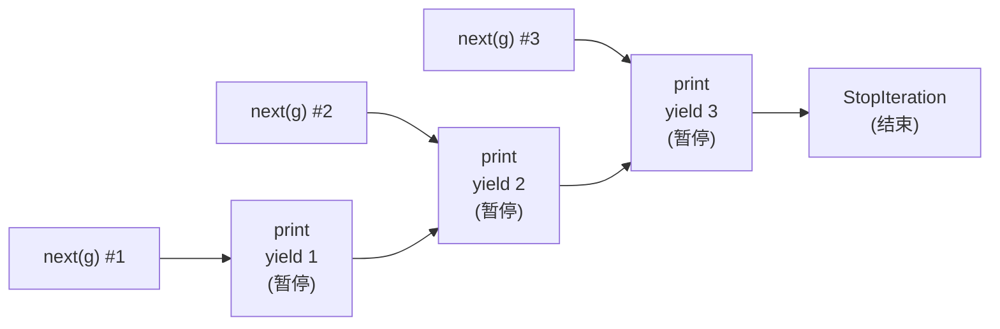

# 生成器与协程：yield 与 async 底层 (Generators & Coroutines)
---

## 章节概述

`yield` 是 Python 最具魔力的关键字之一——它让函数"暂停"并在下次调用时从暂停点继续。本章从 C 的状态机模式出发，深入剖析 Python 生成器的内部实现（帧状态保存），再延伸到 `yield from`、`async/await` 和事件循环。理解生成器的底层机制，是理解 Python 协程和异步编程的基础。

> **核心理念**：Python 的 `yield` 在 C 层面等价于"保存栈帧的指令指针和局部变量，然后 `return`"。每次 `next()` 恢复该栈帧继续执行。C 语言没有这种能力——你只能手动编写状态机来模拟。

---

### 第一节：yield 是什么

#### 1.1 最简单的生成器

```python
def simple_gen():
 print("生成器开始")
 yield 1
 print("已产出 1")
 yield 2
 print("已产出 2")
 yield 3
 print("生成器结束")

g = simple_gen()
print(type(g)) # <class 'generator'>
print(next(g)) # 打印: 生成器开始 → 返回 1
print(next(g)) # 打印: 已产出 1 → 返回 2
print(next(g)) # 打印: 已产出 2 → 返回 3
# print(next(g)) # StopIteration 异常！
```

执行流程可视化：



> **关键概念**：`yield` 让函数返回一个值，但函数的状态（局部变量、指令指针）被完整保存。下次 `next(g)` 时，从 `yield` 的下一行继续执行——就像函数"暂停"了。

#### 1.2 C 中没有 yield —— 必须用状态机

```c
// C 语言：用状态机模拟生成器
// 需求：每次调用返回下一个斐波那契数
#include <stdio.h>

typedef struct {
 int state; // 当前状态：0=初始，1=第一次产出，2=后续
 int prev;
 int curr;
 int count;
} FibGenerator;

void fib_init(FibGenerator *g, int n) {
 g->state = 0;
 g->count = n;
}

int fib_next(FibGenerator *g) {
 switch (g->state) {
 case 0: // 第一次调用
 g->state = 1;
 g->prev = 0;
 g->curr = 1;
 if (g->count-- <= 0) return -1;
 return 0;

 case 1: // 第二次调用
 g->state = 2;
 if (g->count-- <= 0) return -1;
 return 1;

 case 2: // 后续调用
 if (g->count-- <= 0) return -1;
 int next = g->prev + g->curr;
 g->prev = g->curr;
 g->curr = next;
 return next;
 }
 return -1;
}

int main() {
 FibGenerator g;
 fib_init(&g, 10);
 for (int val; (val = fib_next(&g)) != -1; )
 printf("%d ", val); // 0 1 1 2 3 5 8 13 21 34
 return 0;
}
```

Python 的等价实现——只需 4 行：

```python
def fib(n):
 a, b = 0, 1
 for _ in range(n):
 yield a
 a, b = b, a + b

for val in fib(10):
 print(val, end=' ') # 0 1 1 2 3 5 8 13 21 34
```

> **C vs Python 差异**：C 程序员必须手动管理 `state` 变量、将所有局部状态提升为 struct 成员、用 `switch-case` 重建执行流程。Python 的 `yield` 把这个过程自动化——编译器将生成器函数编译为特殊字节码，运行时自动保存和恢复帧状态。

---

### 第二节：生成器对象内部

#### 2.1 生成器的帧状态

当你调用一个包含 `yield` 的函数时，函数体**不会立即执行**——它返回一个生成器对象。

```python
def gen():
 x = 1
 y = yield x # 暂停点 1
 z = yield x + y # 暂停点 2

g = gen()
# g 是一个 generator 对象，函数体尚未执行

# g.gi_frame: 暂停时的栈帧（正在执行时非 NULL，结束后为 NULL）
# g.gi_code: 函数的编译后代码对象
# g.gi_running: 是否正在执行（防递归）

first = next(g) # 执行到第一个 yield，返回 1
print(first) # 1
# 此时 g.gi_frame 保存了局部变量 x=1, y=未赋值, 指令指针在 yield 1 的下一行

second = g.send(10) # 将 10 作为 yield x 的返回值赋给 y，继续执行
print(second) # 11 (1 + 10)
```

#### 2.2 send() 与双向通信

生成器不仅是"可迭代的数据源"，还可以接收外部输入：

```python
def accumulator():
 total = 0
 while True:
 value = yield total # 返回 total，等待外部 send() 输入
 if value is None:
 break
 total += value

acc = accumulator()
print(next(acc)) # 0 — 启动生成器，执行到第一个 yield
print(acc.send(10)) # 10 — value=10, total=0+10=10
print(acc.send(25)) # 35 — value=25, total=10+25=35
print(acc.send(-7)) # 28 — value=-7, total=35+(-7)=28
```

---

### 第三节：yield from — 委托子生成器

#### 3.1 基本用法

```python
def sub_gen():
 yield 'A'
 yield 'B'

def main_gen():
 yield 'start'
 yield from sub_gen() # 委托给子生成器
 yield 'end'

for item in main_gen():
 print(item)
# 输出: start → A → B → end
```

`yield from` 在 C 层面的等价代码：

```python
# yield from ITER 的简化等价逻辑
def _yield_from(iterator):
 _i = iter(iterator)
 try:
 _y = next(_i)
 while True:
 _s = yield _y # 将子生成器的产出传给调用者
 _y = _i.send(_s) # 将调用者的 send() 传给子生成器
 except StopIteration as _e:
 return _e.value # 子生成器的 return 值
```

#### 3.2 真正的威力：双向代理

```python
def echo_upper():
 """子生成器：接收输入，返回大写"""
 while True:
 received = yield
 if received is None:
 break
 yield received.upper()

def delegator():
 """委托生成器：双向透传"""
 result = yield from echo_upper()
 print(f"子生成器返回: {result}")

d = delegator()
next(d) # 启动
print(d.send('hello')) # HELLO — 经过 delegator 透明传给 echo_upper
print(d.send('world')) # WORLD
d.send(None) # 子生成器退出
# 子生成器返回: None
```

`yield from` 建立了一个双向通道：
```
调用者 ←→ delegator ←→ echo_upper
 send() yield from yield
 → → →
 ← ← ←
```

> **C 类比**：这类似 C 的管道和代理模式，但 C 中你需要手动编写所有的数据转发、异常传播和资源清理代码。`yield from` 帮你自动完成了这层胶水代码。

---

### 第四节：for 循环与迭代器协议

#### 4.1 迭代器协议

Python 的 `for x in obj:` 依赖于两个魔术方法：

```python
# for x in obj: 的底层等价逻辑
iterator = iter(obj) # 调用 obj.__iter__()，获取迭代器
while True:
 try:
 x = next(iterator) # 调用 iterator.__next__()
 except StopIteration:
 break
 # 循环体使用 x
```

任何实现了 `__iter__` 和 `__next__` 的对象都是迭代器：

```python
class Countdown:
 def __init__(self, start):
 self.count = start

 def __iter__(self):
 return self # 迭代器返回自身

 def __next__(self):
 if self.count <= 0:
 raise StopIteration
 self.count -= 1
 return self.count + 1

for n in Countdown(3):
 print(n) # 3, 2, 1
```

#### 4.2 生成器自动实现迭代器协议

```python
def countdown(start):
 while start > 0:
 yield start
 start -= 1

# 生成器自动实现了 __iter__ 和 __next__
g = countdown(3)
print(hasattr(g, '__iter__')) # True
print(hasattr(g, '__next__')) # True
```

> **C 对比**：C 没有内建的迭代器抽象。`for (int i = 0; i < n; i++)` 直接暴露索引操作，依赖数组的随机访问特性。Python 的迭代器协议更抽象，可以适配任何数据结构（链表、树、文件流），代价是每次迭代有 `next()` 的函数调用开销。

---

### 第五节：async/await — 基于生成器的协程

#### 5.1 生成器 → 协程的演化

Python 的 `async/await` 构建在生成器的基础上。你可以认为：

```
协程 = 生成器 + 事件循环
async def = 定义协程函数（类似生成器函数）
await = yield from 的异步版本
```

```python
import asyncio

async def fetch_data(url):
 print(f"开始请求: {url}")
 await asyncio.sleep(1) # 模拟 I/O — 释放控制权
 print(f"请求完成: {url}")
 return f"<data from {url}>"

async def main():
 # 并发执行两个"请求"
 task1 = asyncio.create_task(fetch_data("url_1"))
 task2 = asyncio.create_task(fetch_data("url_2"))

 result1 = await task1
 result2 = await task2
 print(result1, result2)

asyncio.run(main())
```

输出：
```
开始请求: url_1
开始请求: url_2
# (等待约 1 秒，两个请求并发进行)
请求完成: url_1
请求完成: url_2
<data from url_1> <data from url_2>
```

#### 5.2 底层：await = 暂停点

```python
async def demo():
 x = 1
 await asyncio.sleep(0) # ← 暂停点：将控制权交还给事件循环
 y = x + 1
 return y
```

```
async def ≈ 生成器函数（含 yield 的函数）
await ≈ yield（暂停点，释放执行权给事件循环）
事件循环 ≈ 调度器，决定接下来执行哪个协程
```

`await` 的字节码级别等价于：函数执行到一个"暂停点" → 将当前协程帧挂起 → 回到事件循环 → 事件循环调度下一个就绪的协程 → 当等待的事件完成 → 恢复协程帧继续执行。

#### 5.3 简易事件循环实现

```python
# 用生成器模拟事件循环（理解原理用，不要用于生产！）
import time

def simple_sleep(delay):
 """模拟 await asyncio.sleep()"""
 deadline = time.time() + delay
 while time.time() < deadline:
 yield # 让出控制权，等待
 return None

def task1():
 print("task1 start")
 yield from simple_sleep(1)
 print("task1 middle")
 yield from simple_sleep(0.5)
 print("task1 end")
 return "task1 done"

def task2():
 print("task2 start")
 yield from simple_sleep(0.5)
 print("task2 end")
 return "task2 done"

# 简易调度器
def run(tasks):
 gens = [t() for t in tasks]
 results = [None] * len(gens)
 active = list(range(len(gens)))

 while active:
 for i in active[:]:
 try:
 next(gens[i])
 except StopIteration as e:
 results[i] = e.value
 active.remove(i)

 return results

print(run([task1, task2]))
# task1 start → task2 start → task2 end → task1 middle → task1 end
```

> **C 对比**：这是 C 中协程库（如 libco、libaco、boost.context）所做的：保存/恢复栈帧、寄存器上下文来实现协作式多任务。Python 在虚拟机层面实现了这一机制。

---

## 力扣练习

以下题目用于验证本章所学内容：

| 题号 | 题目 | 链接 | 涉及知识点 |
|------|------|------|-----------|
| — | 本章无对应力扣题 | — | 请用动手练习题自检 |
