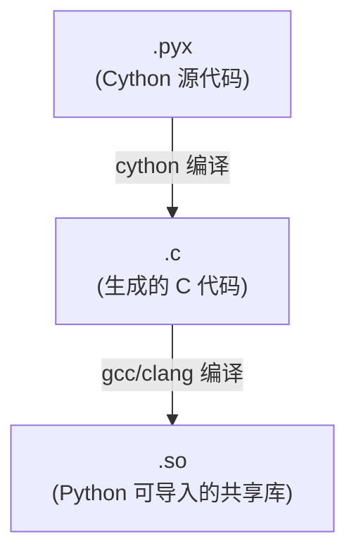
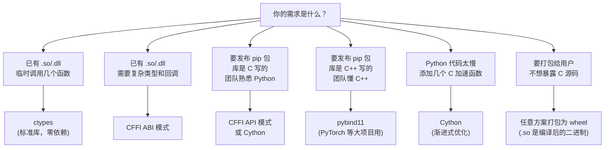
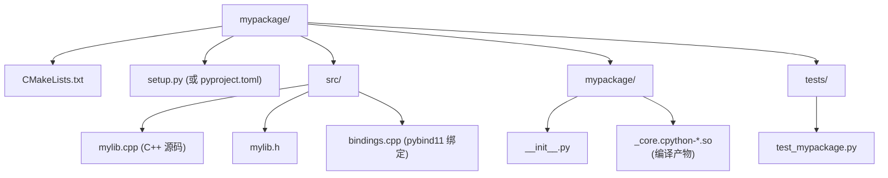

# pybind11 与 Cython：给 C/C++ 库披上 Python 外衣 (Bindings & Wrappers)
---

## 章节概述

你已经会用 ctypes 调用 C 库（[[05_ctypes：在Python中调用C库|第五章]]），也会在 C 中内嵌 Python（[[06_内嵌CPython：在C程序里运行Python|第六章]]）。但当你需要**发布一个 C/C++ 库为 pip 可安装的 Python 包**时，pybind11、Cython 和 CFFI 才是正确的工具。本章对比三种方案的语法、编译流程和适用场景，帮你快速选型。

> **核心理念**：选择绑定方案的本质是权衡"开发效率 vs 运行性能 vs 维护成本"。pybind11 精度最高但需 C++11，Cython 语法灵活但多一层编译，CFFI 最快上手但对 C 头文件依赖最少。

---

### 第一节：三方案对比概览

| 特性 | pybind11 | Cython | CFFI | ctypes |
|------|----------|--------|------|--------|
| 语言 | C++11 | Cython (.pyx) | Python + C ABI | 纯 Python |
| 编译 | 编译为 .so | .pyx → .c → .so | ABI 模式无编译 | 无需编译 |
| 依赖 | header-only | cython 包 | cffi 包 | 标准库 |
| C 类型安全 | 编译时 | 部分 | 运行时 | 运行时 |
| 性能 | 最优（零开销抽象） | 优（可 C 加速） | 中等 | 有调用开销 |
| C++ 支持 | 一流（类、模板、STL） | 支持 | 仅 C ABI | 仅 C ABI |
| 学习曲线 | 陡（C++ 模板元编程） | 中 | 低 | 最低 |

> **一句话选型**：给 C/C++ 库做正式 Python 发布 → pybind11；需要同时加速 Python 代码和包装 C 库 → Cython；快速原型或只有 .so 没头文件 → CFFI；临时调用系统库 → ctypes。

---

### 第二节：pybind11 — C++ 绑定

#### 2.1 安装

```bash
# 方式一：pip 安装（推荐，自带编译器基础设施）
pip install pybind11

# 方式二：系统包管理器
sudo apt install pybind11-dev # Debian/Ubuntu

> **跨平台提示**：
> - **Windows**：推荐 `pip install pybind11`，或从 GitHub 源码用 CMake 构建
> - **macOS**：`brew install pybind11` 或 `pip install pybind11`

# 方式三：作为 CMake 子模块
git submodule add https://github.com/pybind/pybind11.git extern/pybind11
```

#### 2.2 最小示例

```cpp
// mymath.cpp — 要包装的 C++ 库
#include <cmath>

double add(double a, double b) {
 return a + b;
}

double sin_deg(double degrees) {
 return std::sin(degrees * M_PI / 180.0);
}

int factorial(int n) {
 int result = 1;
 for (int i = 2; i <= n; i++) result *= i;
 return result;
}
```

```cpp
// bindings.cpp — pybind11 绑定代码
#include <pybind11/pybind11.h>
#include "mymath.cpp" // 简单示例，实际项目应分离

namespace py = pybind11;

PYBIND11_MODULE(mymath, m) {
 m.doc() = "My math library"; // 模块 docstring

 // 绑定简单函数
 m.def("add", &add, "Add two numbers",
 py::arg("a"), py::arg("b"));
 m.def("sin_deg", &sin_deg, "Sine of angle in degrees");
 m.def("factorial", &factorial, "Factorial of n");

 // 绑定常量
 m.attr("PI") = M_PI;
 m.attr("__version__") = "1.0.0";
}
```

编译方式一：c++ 命令行

```bash
# 编译为共享库（Linux）
c++ -O3 -Wall -shared -std=c++11 -fPIC \
 $(python3 -m pybind11 --includes) \
 bindings.cpp -o mymath$(python3-config --extension-suffix)

> **跨平台提示**：
> - **Windows**：使用 MSVC 生成的扩展名不同，或 MinGW 下输出 `.pyd`（本质是 `.dll`）
> - **macOS**：编译命令一致，输出后缀为 `.dylib`（`$(python3-config --extension-suffix)` 自动适配 `.cpython-312-darwin.so` 格式）
> - 推荐使用 CMake + `pybind11_add_module` 实现跨平台编译（见下方方式二）

# 测试
python -c "import mymath; print(mymath.add(3, 4))" # 7.0
python -c "import mymath; print(mymath.sin_deg(90))" # 1.0
python -c "import mymath; print(mymath.factorial(5))" # 120
```

编译方式二：CMake（推荐用于实际项目）

```cmake
# CMakeLists.txt
cmake_minimum_required(VERSION 3.12)
project(MymathPy)

find_package(pybind11 REQUIRED)

pybind11_add_module(mymath bindings.cpp)
```

```bash
cmake -B build && cmake --build build
python -c "import sys; sys.path.insert(0, 'build'); import mymath; print(mymath.add(1, 2))"
```

#### 2.3 绑定 C++ 类

```cpp
// geometry.cpp
#include <pybind11/pybind11.h>
#include <pybind11/stl.h> // std::vector 自动转换
#include <cmath>
#include <string>
#include <vector>

namespace py = pybind11;

class Point {
public:
 double x, y;
 Point(double x = 0, double y = 0) : x(x), y(y) {}

 double distance_to(const Point &other) const {
 double dx = x - other.x, dy = y - other.y;
 return std::sqrt(dx*dx + dy*dy);
 }

 Point operator+(const Point &other) const {
 return Point(x + other.x, y + other.y);
 }

 std::string to_string() const {
 return "Point(" + std::to_string(x) + ", " + std::to_string(y) + ")";
 }
};

PYBIND11_MODULE(geometry, m) {
 py::class_<Point>(m, "Point")
 .def(py::init<double, double>(), py::arg("x")=0, py::arg("y")=0)
 .def_readwrite("x", &Point::x)
 .def_readwrite("y", &Point::y)
 .def("distance_to", &Point::distance_to)
 .def("__add__", &Point::operator+) // 支持 Python 的 +
 .def("__repr__", &Point::to_string) // 支持 print()
 ;

 // 绑定接受 vector<Point> 的函数
 m.def("total_distance", [](std::vector<Point> points) {
 double total = 0;
 for (size_t i = 1; i < points.size(); i++)
 total += points[i-1].distance_to(points[i]);
 return total;
 });
}
```

### 小节练习


> [!question] 判断题 1
> pybind11 是 header-only 库，因此使用时不需要链接任何 pybind11 的 .so 文件。 （ ）
> - [ ] 正确
> - [ ] 错误
>
> > [!success]- 点击查看答案
> > 答案: 正确
> > **解析**: pybind11 完全由头文件组成，只需 `#include <pybind11/pybind11.h>` 即可使用。编译时只需链接 Python 本身（`-lpython3.x`）。

---

### 第三节：Cython — C 与 Python 的混血儿

#### 3.1 安装

```bash
pip install cython
```

#### 3.2 Cython 的编译链



#### 3.3 最小示例

```python
# primes.pyx — Cython 源代码
# 编译: cythonize -i primes.pyx (生成 primes.c → primes.so)

def count_primes(int n):
 """统计 <= n 的素数个数"""
 cdef int count = 0
 cdef int i, j
 cdef bint is_prime # C 的 bool

 for i in range(2, n + 1):
 is_prime = True
 for j in range(2, int(i ** 0.5) + 1):
 if i % j == 0:
 is_prime = False
 break
 if is_prime:
 count += 1
 return count
```

编译方式一：`cythonize` 命令

```bash
# 自动编译 .pyx → .so
cythonize -i primes.pyx

# 测试
python -c "import primes; print(primes.count_primes(10000))"
```

编译方式二：`setup.py`（传统）

```python
# setup.py
from setuptools import setup
from Cython.Build import cythonize

setup(
 ext_modules=cythonize("primes.pyx"),
)
```

```bash
python setup.py build_ext --inplace
```

#### 3.4 调用外部 C 库

```cython
# clib_wrapper.pyx — 包装外部 C 库

# 声明 C 函数接口（来自 libm）
cdef extern from "math.h":
 double sin(double x)
 double cos(double x)
 double sqrt(double x)

# 声明自己编写的 C 函数
cdef extern from "mystats.h":
 double mean(double *data, int n)
 double stdev(double *data, int n)

# Python 包装函数
def py_sin(double x):
 return sin(x)

def py_mean(data_list):
 """接受 Python list，转为 C 数组后计算"""
 cdef int n = len(data_list)
 cdef double[::1] arr = data_list # typed memoryview
 return mean(&arr[0], n)
```

```cython
# 使用 numpy 数组（零拷贝）
import numpy as np
cimport numpy as np

def array_sum(np.ndarray[np.float64_t, ndim=1] arr):
 cdef int n = arr.shape[0]
 cdef double total = 0.0
 cdef int i
 for i in range(n):
 total += arr[i]
 return total
```

#### 3.5 Cython 的类型声明


| Cython 声明 | 对应 C 类型 | 说明 |
|-------------|------------|------|
| `cdef int x` | `int x` | 静态 C 变量 |
| `cdef double[::1] arr` | `double *arr` (typed memoryview) | 高效数组 |
| `cdef extern from "..."` | `#include "..."` | 声明外部 C 声明 |
| `cpdef func()` | C 快速调用 + Python 可调用 | 双接口函数 |
| `cdef class MyClass` | C 扩展类型 | 高效类（无 `__dict__`） |

### 小节练习

> [!question] 判断题 1
> Cython 的 `.pyx` 文件可以直接被 Python 解释器执行。 （ ）
> - [ ] 正确
> - [ ] 错误
>
> > [!success]- 点击查看答案
> > 答案: 错误
> > **解析**: `.pyx` 文件必须先被 Cython 编译器（`cython`）转换为 `.c` 文件，再由 C 编译器编译为 `.so`/`.pyd` 后才能被 Python 导入。


---

### 第四节：CFFI — 纯 Python 的 C 接口

#### 4.1 ABI 模式（运行时，无需编译器）

```python
# cffi_abi_demo.py
from cffi import FFI

ffi = FFI()

# 声明 C 接口（类似 C 头文件）
ffi.cdef("""
 double sin(double x);
 double cos(double x);
 int printf(const char *format, ...);
""")

# 加载库（ABI 模式 — 不需要编译器）
libm = ffi.dlopen("libm.so.6")
libc = ffi.dlopen(None) # None = 当前进程（libc 函数）

# 调用
import math
result = libm.sin(1.0)
print(f"sin(1) = {result}")

libc.printf(b"Hello from CFFI! sin(1) = %f\n", result)
```

#### 4.2 API 模式（编译时，更安全）

```python
# cffi_api_build.py — 构建脚本
from cffi import FFI

ffi = FFI()

ffi.cdef("""
 typedef struct { double x; double y; } Point;
 double distance(Point *a, Point *b);
 double array_sum(double *arr, int len);
""")

# 提供 C 源代码或库
ffi.set_source("_geo", # 输出模块名
 """
 #include <math.h>
 typedef struct { double x; double y; } Point;
 double distance(Point *a, Point *b) {
 double dx = a->x - b->x, dy = a->y - b->y;
 return sqrt(dx*dx + dy*dy);
 }
 double array_sum(double *arr, int len) {
 double s = 0;
 for (int i = 0; i < len; i++) s += arr[i];
 return s;
 }
 """,
 libraries=['m'])

if __name__ == "__main__":
 ffi.compile()
```

```python
# cffi_api_use.py — 使用编译好的模块
from _geo import ffi, lib

p1 = ffi.new("Point *", {'x': 0.0, 'y': 0.0})
p2 = ffi.new("Point *", {'x': 3.0, 'y': 4.0})
print(lib.distance(p1, p2)) # 5.0

arr = ffi.new("double[]", [1.1, 2.2, 3.3])
print(lib.array_sum(arr, 3)) # 6.6
```

#### 4.3 CFFI vs ctypes

| 特性 | CFFI | ctypes |
|------|------|--------|
| 声明方式 | 写 C 声明（字符串） | 定义 Python 类 |
| 编译器依赖 | ABI 模式不需要 | 不需要 |
| 复杂类型 | 更灵活 | 较繁琐 |
| 性能 | API 模式 ≈ pybind11 | 有调用开销 |
| 学习成本 | 需懂 C 声明 | 需懂 ctypes 类型 |
| 与 NumPy 集成 | `ffi.from_buffer` | `np.ctypeslib` |

### 小节练习


---

### 第五节：决策表与实战建议

#### 5.1 场景决策



#### 5.2 性能对比（计算 1000 万次 sqrt）

```python
# 纯 Python
import math
result = sum(math.sqrt(i) for i in range(10_000_000))

# vs
# Cython / pybind11 (≈ C 速度)
# ctypes / CFFI ABI (≈ C 速度但有小开销)
# CFFI API (≈ C 速度，编译时优化)
```

#### 5.3 pybind11 项目模板



---

## 章节测试

### 一、判断题

> [!question] 判断题 1
> pybind11 只支持绑定 C 代码，不支持 C++ 类和 STL。 （ ）
> - [ ] 正确
> - [ ] 错误
>
> > [!success]- 点击查看答案
> > 答案: 错误
> > **解析**: pybind11 **原生支持 C++**——类、虚函数、模板、STL 容器（`std::vector`/`std::map`）、智能指针、lambda 等。它是 C++ 到 Python 绑定的首选方案。

> [!question] 判断题 2
> Cython 生成的 C 代码依赖 Cython 运行时库才能运行。 （ ）
> - [ ] 正确
> - [ ] 错误
>
> > [!success]- 点击查看答案
> > 答案: 错误
> > **解析**: Cython 生成的 C 代码是自包含的，编译后的 .so 模块不需要 Cython 包本身就可以运行（只需 `pip install` 的包即可，甚至不需要 `cython` 包）。

> [!question] 判断题 3
> CFFI 的 ABI 模式需要 GCC/Clang 编译器。 （ ）
> - [ ] 正确
> - [ ] 错误
>
> > [!success]- 点击查看答案
> > 答案: 错误
> > **解析**: CFFI ABI 模式是纯 Python 的——它使用 `libffi` 库在运行时直接调用函数指针，不需要编译器。API 模式才需要编译器来构建 C 胶水代码。

> [!question] 判断题 4
> 使用 Cython 时必须将整个模块都写成 `.pyx` 格式，不能混用 `.py` 和 `.pyx`。 （ ）
> - [ ] 正确
> - [ ] 错误
>
> > [!success]- 点击查看答案
> > 答案: 错误
> > **解析**: Cython 支持渐进式加速——你可以只把性能热点函数移到 `.pyx` 文件中，其余代码保持纯 Python `.py` 文件，通过 import 互相调用。

> [!question] 判断题 5
> 分发 Python 包时，pybind11/cython/cffi 编译出的 `.so` 文件可以跨操作系统使用。 （ ）
> - [ ] 正确
> - [ ] 错误
>
> > [!success]- 点击查看答案
> > 答案: 错误
> > **解析**: 编译出的 `.so` 文件是平台相关的二进制文件。发布到 PyPI 时需要为不同平台（Linux/Mac/Windows）和架构（x86_64/arm64）编译各自的 wheel。

---


---

## 力扣练习

以下题目用于验证本章所学内容：

| 题号 | 题目 | 链接 | 涉及知识点 |
|------|------|------|-----------|
| — | 本章无对应力扣题 | — | 请用动手练习题自检 |


### 动手练习题

> [!example] 练习题 1：三方案对比
> **难度**: 简单
>
> 同一个 C 函数库 `libstats.c`（包含 mean、stdev、sort），分别用以下三种方案绑定并在 Python 调用：
> 1. ctypes（纯 Python，标准库）
> 2. CFFI ABI 模式
> 3. pybind11 或 Cython（选择一种）
>
> 对比代码量、调用性能（用 `timeit`）、和开发体验。

> [!example] 练习题 2：pybind11 封装小型 C++ 类库
> **难度**: 简单
>
> 编写一个 C++ 矩阵运算库 `Mat2x2`（2x2 矩阵：加法、乘法、求逆、行列式），用 pybind11 包装为 Python 类。要求：
> - 支持 `+` 和 `*` 运算符
> - 支持 `str()` / `repr()`
> - 从 Python 的 list-of-lists 构造
> - 编译为可 pip 安装的包结构

> [!example] 练习题 3：Cython 加速 Python 代码
> **难度**: 简单
>
> 有一段纯 Python 代码（计算 1000 万次循环的数值运算），将其改写为 Cython：
> 1. 首先不加类型声明，仅用 `cythonize` 编译（观察小幅加速）
> 2. 添加 `cdef` 类型声明（观察大幅加速）
> 3. 用 typed memoryview 替换 Python list
> 4. 对比每个步骤的性能变化
>
> 理解"Python 慢在哪"和"Cython 快在哪"。

> [!example] 练习题 4：CFFI 在无头文件场景下的实战
> **难度**: 简单
>
> 你只有一个第三方 `.so` 文件（无头文件），但知道函数签名：`double transform(double input)`。用 CFFI ABI 模式调用它：
> 1. 通过 `nm -D libfoo.so` 或 `readelf -s` 确认符号名

> **跨平台提示**：
> - **Windows**：用 `dumpbin /exports foo.dll`（需 Visual Studio Build Tools），或用 `objdump -t foo.dll`（MinGW）
> - **macOS**：用 `nm -g libfoo.dylib` 或 `otool -tV libfoo.dylib`
> 2. 编写 `ffi.cdef()` 声明
> 3. 加载并调用
> 4. 对比如果需要传递 struct 参数时 ctypes 和 CFFI 的差异
