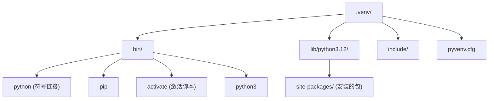
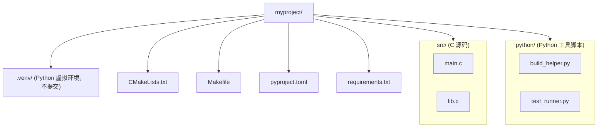

# venv 与 uv：环境隔离 (Virtual Environments)
---

## 章节概述

C 语言的世界里，库文件（`.so`、`.a`）安装在系统路径（`/usr/lib`、`/usr/local/lib`），所有项目共享同一份库。Python 的世界截然不同——每个项目可能需要不同版本的 Django、NumPy 或 requests。如果所有项目共享同一个 Python 环境的 site-packages，版本冲突会像多米诺骨牌一样让所有项目崩溃。虚拟环境就是 Python 世界的"沙箱"，让每个项目拥有独立的依赖空间。

> **跨平台提示**：
> - **Windows**：系统库路径为 `C:\Windows\System32\`，Python 库在 `%LOCALAPPDATA%\Programs\Python\`
> - **macOS**：系统库在 `/usr/lib/`（同 Linux），Python 框架路径为 `/Library/Frameworks/Python.framework/`

本章从 `venv` 基础操作开始，逐步引入现代工具 `uv`（Rust 重写的 pip/pip-tools 替代品），并与 C 语言的 pkg-config、LD_LIBRARY_PATH 等机制对比，帮助 C 程序员理解 Python 的依赖隔离哲学。

> **核心理念**：C 通过链接器路径区分库版本（`LD_LIBRARY_PATH`、`rpath`），Python 通过虚拟环境复制一个完整的 Python 解释器"副本"。这不是浪费，而是工程确定性——每个项目的 Python 环境和依赖可以精确复现。

---

### 第一节：为什么需要虚拟环境

在 C 项目中，依赖管理靠系统包管理器（`apt install libcurl-dev`）或用 CMake `find_package` 查找：

```bash
# C 项目：全局库，用完即走
gcc -o myapp main.c -lcurl -lssl

# 查看链接的库
ldd ./myapp
```

> **跨平台提示**：
> - **Windows**：`dumpbin /dependents myapp.exe`（需安装 Visual Studio Build Tools）
> - **macOS**：`otool -L ./myapp`

问题来了：如果你的项目 A 需要 `libfoo 1.0`，项目 B 需要 `libfoo 2.0`，而系统只能装一个版本——这就是"DLL Hell"在 Linux 上的表现。

Python 的解决方案是**虚拟环境**——为每个项目创建一个独立的 Python 解释器目录，包括独立的 `site-packages`：

```bash
# 系统 Python 的 site-packages
python3 -c "import site; print(site.getsitepackages())"
# → ['/usr/lib/python3.12/site-packages']

> **跨平台提示**：
> - **Windows**：`%LOCALAPPDATA%\Programs\Python\Python312\Lib\site-packages`
> - **macOS**：`/Library/Frameworks/Python.framework/Versions/3.12/lib/python3.12/site-packages`

# 虚拟环境中的 site-packages
~/myproject/.venv/lib/python3.12/site-packages/
```

> 与 C 对比：`LD_LIBRARY_PATH` 只是改变运行时库搜索顺序，而虚拟环境是真正隔离的"第二个 Python 安装"。类比：`LD_LIBRARY_PATH` 像是给链接器一个"优先看这里"的便条，而虚拟环境像是把整个编译链和库复制了一份。

---

### 第二节：venv 基础操作

#### 2.1 创建虚拟环境

```bash
# 标准方式：使用内置 venv 模块
python3 -m venv .venv

# 目录结构
tree -L 2 .venv
```

输出：



#### 2.2 激活与退出

```bash
# 激活（Linux/macOS）
source .venv/bin/activate

> **跨平台提示**：
> - **Windows**（CMD）：`.venv\Scripts\activate`
> - **Windows**（PowerShell）：`.venv\Scripts\Activate.ps1`（如遇执行策略限制，运行 `Set-ExecutionPolicy -Scope CurrentUser RemoteSigned`）

# 激活后，提示符会显示环境名
(.venv) user@host:~/myproject$

# 验证当前使用的是虚拟环境中的 Python
which python
# → /home/user/myproject/.venv/bin/python

python -c "import sys; print(sys.prefix)"
# → /home/user/myproject/.venv

# 退出虚拟环境
deactivate
```

> `python -c "import sys; print(sys.prefix)"` 是最可靠的验证方式——如果输出是系统路径（如 `/usr`），说明不在虚拟环境中。

#### 2.3 安装与导出依赖

```bash
# 激活环境后安装包
source .venv/bin/activate
pip install requests numpy

# 导出依赖列表（锁定版本）
pip freeze > requirements.txt

# 查看 requirements.txt
cat requirements.txt
# certifi==2024.2.2
# charset-normalizer==3.3.2
# idna==3.6
# numpy==1.26.4
# requests==2.31.0
# urllib3==2.2.1
```

在另一台机器上复现环境：

```bash
# 创建并激活新环境后
pip install -r requirements.txt
```

> 与 C 对比：`requirements.txt` 有点像 C 项目的 `apt list` 或 `brew bundle`，但它锁定到了具体的版本号。CMake 的 `find_package(libfoo 1.0 REQUIRED)` 只能检查版本下限，无法精确锁定。

#### 2.4 最佳实践

```bash
# 1. 虚拟环境目录命名为 .venv（隐藏目录，不会被意外提交）
python3 -m venv .venv

# 2. 将 .venv/ 加入 .gitignore
echo '.venv/' >> .gitignore

# 3. 提交 requirements.txt，不提交 .venv/
git add requirements.txt .gitignore
git commit -m "Add Python dependencies"

# 4. 克隆后重建环境
git clone <repo>
cd <repo>
python3 -m venv .venv
source .venv/bin/activate
pip install -r requirements.txt
```

---

### 第三节：深入理解虚拟环境机制

#### 3.1 pyvenv.cfg 的秘密

```bash
cat .venv/pyvenv.cfg
```

```ini
home = /usr/bin
include-system-site-packages = false
version = 3.12.3
```

- `home`：基 Python 安装位置
- `include-system-site-packages = false`：不继承系统 site-packages（隔离！）
- `version`：Python 版本

#### 3.2 指定 Python 版本

```bash
# 使用特定版本的 Python 创建环境
python3.11 -m venv .venv-py311
python3.12 -m venv .venv-py312

# 不依赖系统 Python（需要先安装对应版本）
sudo apt install python3.11-venv

> **跨平台提示**：
> - **Windows**：Python 安装器已自带 venv 模块，无需额外安装
> - **macOS**：brew 安装的 Python 自带 venv；下载的 .pkg 安装包也包含 venv
```

#### 3.3 环境变量对比：Python vs C

| 概念 | C 语言 | Python |
|------|--------|--------|
| 库搜索路径 | `LD_LIBRARY_PATH` | `PYTHONPATH` |
| 头文件搜索 | `C_INCLUDE_PATH` | —（无头文件概念） |
| 编译器/解释器 | `PATH` 中的 `gcc` | `PATH` 中的 `python` |
| pkg-config 路径 | `PKG_CONFIG_PATH` | — |
| site-packages | — | `sys.path` |
| 链接器 rpath | `-Wl,-rpath,...` | —（无需链接） |

```bash
# C 语言：运行时库搜索顺序
# 1. LD_LIBRARY_PATH
# 2. /etc/ld.so.cache
# 3. /lib, /usr/lib

# Python：模块搜索顺序
python -c "import sys; [print(p) for p in sys.path]"
# 1. 当前目录（或脚本目录）
# 2. PYTHONPATH 环境变量
# 3. site-packages（虚拟环境或系统）
# 4. 标准库路径
```

---

### 第四节：uv — 现代 Python 包管理器

[uv](https://github.com/astral-sh/uv) 是用 Rust 重写的 pip/pip-tools/poetry 替代品，速度比 pip 快 10-100 倍。对于习惯了 C 工具链"编译快"的读者，uv 能消除 `pip install` 等待的焦虑。

#### 4.1 安装 uv

```bash
# Linux/macOS
curl -LsSf https://astral.sh/uv/install.sh | sh

# 或通过 pip 安装
pip install uv

# 验证
uv --version
```

#### 4.2 创建虚拟环境

```bash
# 创建虚拟环境（比 python -m venv 更快）
uv venv

# 指定 Python 版本
uv venv --python 3.12

# 指定路径
uv venv .venv
```

#### 4.3 安装依赖

```bash
# uv pip install（兼容 pip 语法，但更快）
uv pip install requests numpy

# 从 requirements.txt 安装
uv pip install -r requirements.txt

# 从 pyproject.toml 安装
uv pip install -e .
```

#### 4.4 锁定依赖

```bash
# 生成锁定的依赖文件（类似 pip-tools 的 pip-compile）
uv pip compile requirements.in -o requirements.txt

# 从 pyproject.toml 生成
uv pip compile pyproject.toml -o requirements.txt

# 同步环境到锁定版本
uv pip sync requirements.txt
```

#### 4.5 uv vs pip 速度对比

```bash
# 以下命令展示速度差异（非必须执行）
time pip install django # 约 5-10 秒
time uv pip install django # 约 0.5-1 秒
```

> uv 快的原理：Rust 实现 + 全局缓存 + 并行下载 + 复用已解析的依赖树。这类似 C 语言中 `ccache` 对 `gcc` 的加速效果。

#### 4.6 完整工作流

```bash
# 1. 创建项目并初始化
mkdir myproject && cd myproject
uv venv
source .venv/bin/activate

# 2. 添加依赖并记录
uv pip install fastapi uvicorn
uv pip freeze > requirements.txt

# 3. 团队成员克隆后
git clone <repo>
cd <repo>
uv venv
source .venv/bin/activate
uv pip sync requirements.txt
```

---

### 第五节：C 项目中使用 Python 虚拟环境

在混合 C/Python 项目中，虚拟环境的使用有讲究：

#### 5.1 项目布局



#### 5.2 CMake 中集成 Python 虚拟环境

```cmake
# CMakeLists.txt
cmake_minimum_required(VERSION 3.18)
project(MyHybridProject C)

# 查找 Python（优先使用虚拟环境中的）
find_package(Python3 COMPONENTS Interpreter)

# 使用 Python 脚本生成代码
add_custom_command(
 OUTPUT generated_config.h
 COMMAND ${Python3_EXECUTABLE} ${CMAKE_SOURCE_DIR}/python/generate_config.py
 --input config.json
 --output generated_config.h
 DEPENDS python/generate_config.py config.json
)
```

#### 5.3 Makefile 中集成

```makefile
# Makefile 片段
VENV = .venv
PYTHON = $(VENV)/bin/python

.PHONY: venv test

venv:
	uv venv $(VENV)
	$(VENV)/bin/uv pip install -r requirements.txt

test: venv
	$(PYTHON) -m pytest python/tests/
```

> 这个模式在 C 项目中很常见：用 Python 做代码生成（替代部分 awk/sed/m4），用 C 做核心逻辑。虚拟环境确保生成脚本的依赖不会污染系统。

---

## 力扣练习

以下题目用于验证本章所学内容：

| 题号 | 题目 | 链接 | 涉及知识点 |
|------|------|------|-----------|
| — | 本章无对应力扣题 | — | 请用动手练习题自检 |
